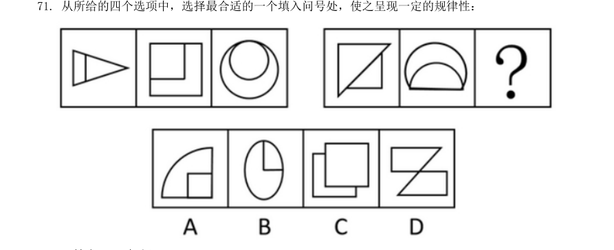
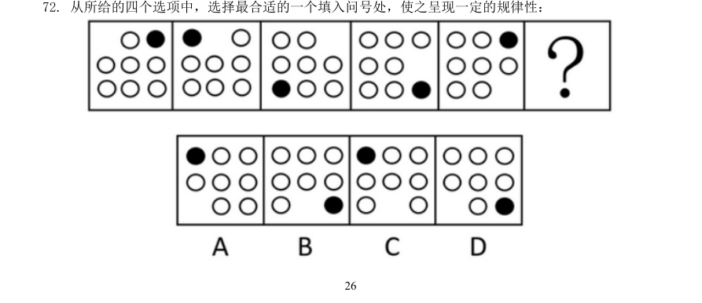
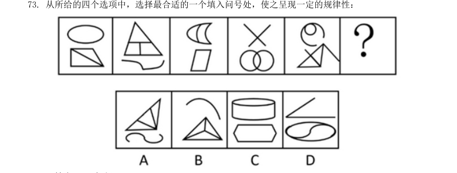
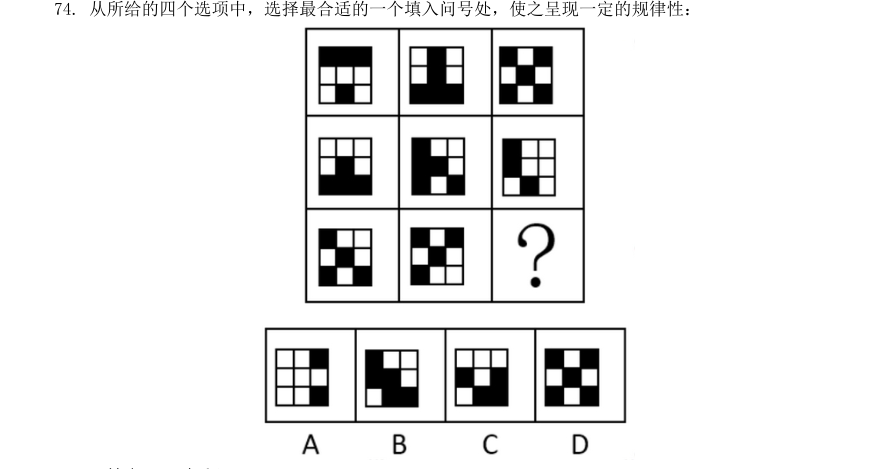
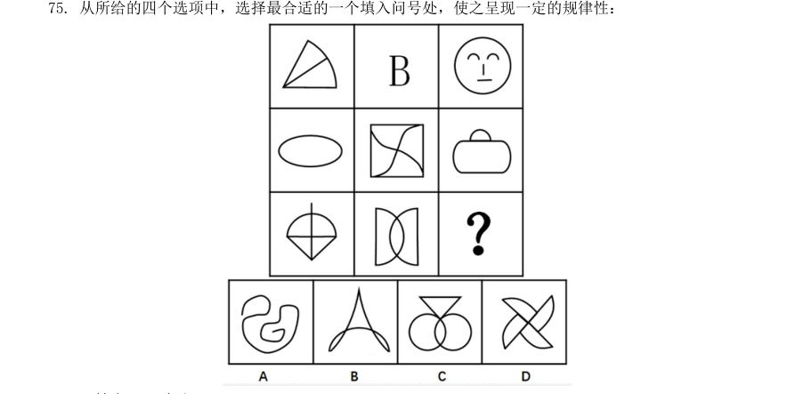
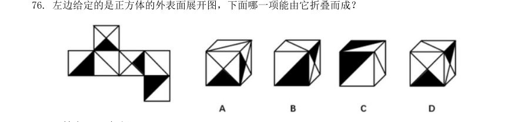
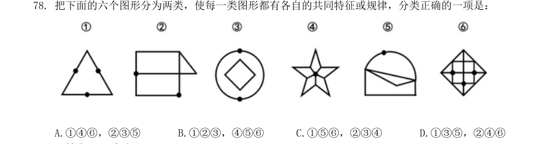
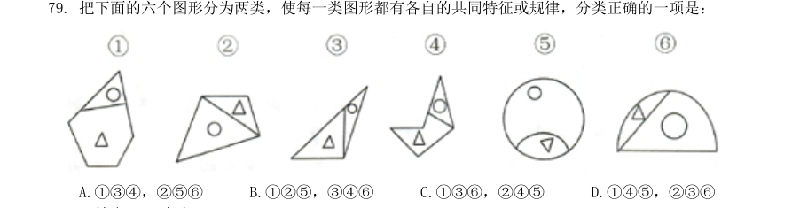
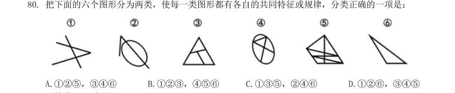

# 2017年国考《行政职业能力测验》真题（地市级）

> 题目来源：高教公考真题库解析版（含答案+逐题解析）（考生回忆版）｜共 130 题
> 答案与解析见同目录《2017年国考行测答案与解析（地市级）.md》

## 常识判断
*根据题目要求，在四个选项中选出一个最恰当的答案。*

**1.** 根据我国宪法，下列表述错误的是：
- A. 一切组织和个人都负有实施宪法和保障宪法实施的职责
- B. 我国在普通地方、民族自治地方和特别行政区建立了相应的地方制度
- C. 为了追查刑事犯罪，公安机关、检察机关、审判机关可依法对公民的通信进行检查
- D. 我国形成了人民代表大会制度、中国共产党领导的多党合作和政治协商制度以及基层群众自治制度等民主形式

**2.** 依据《刑法修正案(九)》的规定，下列说法不正确的是：
- A. 胡乱编造虚假险情在微信里传播、严重扰乱社会秩序的行为是犯罪行为
- B. 组织群众医闹的行为是犯罪行为
- C. 代替他人高考应作出行政处罚
- D. 伪造货币罪不再判死刑

**3.** 关于中国外交，下列说法错误的是：
- A. 周恩来和陈毅都曾担任过外交部长
- B. 委内瑞拉是第一个同新中国建交的拉丁美洲国家
- C. “另起炉灶”是毛泽东在新中国成立前夕提出的外交方针
- D. 二十世纪八九十年代，邓小平提出“韬光养晦、有所作为”的外交战略

**4.** 在银行的资产负债表中，客户存款属于：
- A. 资产
- B. 负债
- C. 权益
- D. 资金

**5.** 关于我国著名园林，下列说法正确的是：
- A. 十二兽首曾是颐和园的镇园之宝
- B. 承德避暑山庄始建于明代崇祯年间
- C. 《枫桥夜泊》涉及的城市是留园所在地
- D. 苏州拙政园整体呈现均衡对称的格局

**6.** 我国古代用“金”“石”“丝”“竹”指代不同材质、类别的乐器，下列诗词涉及“竹”的是：
- A. 珠帘夕殿闻钟磬，白日秋天忆鼓鼙
- B. 主人有酒欢今夕，请奏鸣琴广陵客
- C. 深秋帘幕千家雨，落日楼台一笛风
- D. 哀筝一弄湘江曲，声声写尽湘波绿

**7.** 柏拉图认为处于变化之中的事物不是真正的存在。持这种理论的人会认为以下哪项最真实？
- A. 马的概念
- B. 人的照片
- C. 一棵树
- D. 勾股定理

**8.** 司马谈《论六家要旨》：“ ① 博而寡要，劳而少功，是以其事难尽从；然其序君臣父子之礼，列夫妇长幼之别，不可易也。② 俭而难遵，是以其事不可遍循；然其强本节用，不可废也。③ 严而少恩；然其正君臣上下之分，不可改矣。 ④ 使人俭而善失真；然其正名实，不可不察也。”①②③④处应分别填入：
- A. 儒家  墨家  道家  法家
- B. 道家  名家  墨家  儒家
- C. 儒家  墨家  法家  名家
- D. 儒家  法家  兵家  名家

**9.** 下列艺术领域与专业术语对应有误的是：
- A. 摄影：噪点、景深
- B. 绘画：散点透视、写意
- C. 音乐：调式、声部
- D. 舞蹈：变位跳、变奏

**10.** 与________共同构成中国诗歌传统源头的《楚辞》，主要作者是因谗去国、被流放到蛮荒之地的屈原，他用 “________”这一著名诗句，表现了岁月蹉跎、时不我待的恐惧。文中画横线部分应依次填入：
- A. 《庄子》  长太息以掩涕兮，哀民生之多艰
- B. 《庄子》  日月忽其不淹兮，春与秋其代序
- C. 《诗经》  惟草木之零落兮，恐美人之迟暮
- D. 《诗经》  路漫漫其修远兮，吾将上下而求索

**11.** 掩星是一种天文现象，指一个天体在另一个天体与观测者之间通过而产生的遮蔽现象。科学家经常借助观察这一现象来判断星体是否有大气层。当行星掩过遥远恒星，如果恒星变得模糊之后才消失，那么可以认为：
- A. 该恒星有稠密的大气层
- B. 该行星有稠密的大气层
- C. 该恒星无大气层或大气层稀薄
- D. 该行星无大气层或大气层稀薄

**12.** 关于图中所标示的海峡，下列说法错误的是：
- A. ①是世界上最繁忙的石油运输航道
- B. ②是世界上最宽的海峡
- C. ③的海峡中心线是国际日期变更线的一部分
- D. ④的附近地区夏季炎热干燥，冬季温和多雨

**13.** 2016 年3 月，阿尔法狗围棋程序(AlphaGo )对战世界围棋冠军、职业九段选手李世石，以4:1 的总比分获胜。阿尔法狗围棋程序的工作原理基于下列哪项技术？
- A. 量子计算
- B. 深度学习
- C. 纳米技术
- D. 基因编辑

**14.** 下列矿物与其用途对应错误的是：
- A. 燧石—取火
- B. 石灰岩—生产水泥
- C. 石棉—促进燃烧
- D. 石英—制作半导体

**15.** 下列与汽车有关的说法错误的是：
- A. 手动挡和自动挡汽车的主要区别在于是否人为控制离合装置
- B. 冬天路面结冰时在车轮上挂铁链是为了增大摩擦
- C. 遥控钥匙通过发射无线电波控制车门的开关
- D. 手刹的制动原理是切断汽车的动力系统

**16.** 下列关于航天器的说法正确的是：
- A. “长征一号”属于二级运载火箭
- B. “玉兔”号月球车在月球上行走的动力驱动是电动车
- C. “北斗二号”属于通信广播卫星
- D. “风云”系列气象卫星通过光纤实现与地面的数据传输

**17.** 关于垃圾分类处理，下列说法错误的是：
- A. 速冻饺子的包装袋属于厨余垃圾
- B. 塑料制品不可采用深度填埋的处理方法
- C. 果皮等食品类废物可进行堆肥处理
- D. 红色的收集容器用于收集有害垃圾

**18.** 氢气是重要的工业燃料，下列关于氢气的说法正确的是：
- A. 氢气在氧气中燃烧发出明亮的红色火焰
- B. 电解水生成氢气的过程是一个吸热过程
- C. 人工降雨过程中通常使用氢气作催化剂
- D. 氢气在自然界中含量很少，故为稀有气体

**19.** 小王冬季从北京首都国际机场乘坐航班去某个机场，到达后发现手表显示的时间为18 点30 分，而机场所在地时间为22 点30 分，他去的可能是以下哪个城市?
- A. 华盛顿
- B. 马尼拉
- C. 曼彻斯特
- D. 惠灵顿

**20.** 关于农业生产中使用的草木灰，下列说法错误的是：
- A. 在种有大白菜的地里撒上草木灰可防病虫害
- B. 花卉移栽时，可以用草木灰做底料增加养分
- C. 育苗时，草木灰和氮肥同时施用效果更好
- D. 往鱼塘撒用草木灰能够降低鱼类的发病率

## 言语理解与表达

**21.** 物理学研究与艺术创作有异曲同工之妙，若是不能_______ ，就只能千锤百炼，通过成年累月的辛苦工作来解开暗物质的谜团了。填入画横线部分最恰当的一项是：
- A. 妙手偶得
- B. 一蹴而就
- C. 守株待兔
- D. 灵机一动

**22.** 在这个万物互通互联的时代，单个企业是无法“________” 的，只有人人安全、合作伙伴都安全、整个环境都安全，才能最大限度地保障自己的网络安全，这也是网络安全的更高等级——生态安全。填入画横线部分最恰当的一项是：
- A. 明哲保身
- B. 自力更生
- C. 独善其身
- D. 自给自足

**23.** 卫星轨道数据是一类需要严格保密的数据，卫星所有人将卫星的位置和运行路线视为机密资料。拥有卫星的那些企业担心泄密会使自己丧失竞争________ ，因为把________ 的定位信息泄露出去，可能会向竞争对手暴露自己的实力，政府也担心这会危害国家安全。依次填入画横线部分最恰当的一项是：
- A. 筹码  详细
- B. 能力  准确
- C. 机遇  隐藏
- D. 优势  确切

**24.** 各国在对外交往中常常会形成一套相对________ 的话语体系，特别是拥有自己的核心话语。对外话语不仅体现一国的外交政策，更________ 了一国对外沟通的基本态度和价值。依次填入画横线部分最恰当的一项是：
- A. 灵活  承载
- B. 固定  代表
- C. 独立  说明
- D. 集中  体现

**25.** 近年来，多部科幻电影在各大影院热播，黑洞、白洞、虫洞等都是人们________ 的天文学前沿概念，人类似乎在不久的将来就可以通过虫洞快速抵达太阳系外的宜居星球。但实际上，近年来星际飞行理论并没有突破性进展，深空探测在可以预见的将来还只能________于对太阳系内天体的探测。依次填入画横线部分最恰当的一项是：
- A. 如数家珍  满足
- B. 了如指掌  倾向
- C. 津津乐道  局限
- D. 念念不忘  受制

**26.** 家庭是社会的基本单元，家庭功能受损，已经并将继续产生深远后果。规模庞大的留守儿童，是中国独有的城乡二元体制的产物。解决这一问题_______ ，且无法毕其功于一役，多项改革不可能_______ ，但严峻的现实提醒我们，多层次的行动、全方位的改革必须启动或加速。依次填入画横线部分最恰当的一项是：
- A. 迫在眉睫  万无一失
- B. 千头万绪  立竿见影
- C. 千难万险  齐头并进
- D. 错综复杂  避重就轻

**27.** 对于科学家来说，数学公式可以展现大自然的基本原理，或者将复杂的东西简洁地表达出来，这的确________ 。但对普通大众中的一些人而言，公式也可能是令人生畏、晦涩难懂的；然而对另外一些人来说，正是公式的________使其变得迷人：即使不能理解公式的含义，我们也可以被它打动，因为我们知道，有些公式蕴含着一些超出我们理解能力的含义。依次填入画横线部分最恰当的一项是：
- A. 妙不可言  神秘
- B. 独树一帜  深奥
- C. 无与伦比  周密
- D. 叹为观止  严谨

**28.** 密码学的历史大致可以追溯到两千年前，相传古罗马名将凯撒为了防止敌方截获情报，便使用密码传送情报。凯撒的做法很________ ，就是为二十几个罗马字母建立一张对应表，如果不知道对应表，即使拿到情报也是________ 。依次填入画横线部分最恰当的一项是：
- A. 别致  前功尽弃
- B. 隐蔽  枉费心机
- C. 简单  徒劳无功
- D. 精妙  无所适从

**29.** 水污染防治之难，在于水的________ 。水自源头奔流而下，被沿岸居民、企业反复利用，任何环节疏于治理，都可能让水变脏。水往低处流的特性，也导致“上游排污，下游遭殃”，上游地区的污水如不加处理直流下游，下游往往________也难以应对。依次填入画横线部分最恰当的一项是：
- A. 循环性  殚精竭虑
- B. 地域性  一掷千金
- C. 流动性  竭尽全力
- D. 便利性  废寝忘食

**30.** 处在互联网时代，中小型民营书店虽然无法在出版规模、价格、渠道等方面和大型发行集团、出版社、传媒集团展开竞争，但可以专注于某一特色，________ ，市场空间小而利润不小。网络的传播与沟通效应、数据平台的挖掘分析能力，能够帮助独立书店更便捷地触及到读者的思想和需求，并________需求，引导消费。依次填入画横线部分最恰当的一项是：
- A. 发扬光大  发现
- B. 画龙点睛  刺激
- C. 锦上添花  满足
- D. 拾遗补缺  创造

**31.** 未来将会怎样，不可准确预知，但格局和________总有踪迹可循。在信息技术、互联网发展所________的巨大变革面前，时代和社会呼唤产生一批真正的未来学家，能够站在历史和现实的关口，对信息社会的未来有所把握，为未来人们的生产和生活、选择和行为提供一些理论上的________ 。依次填入画横线部分最恰当的一项是：
- A. 轨迹  带来  解释
- B. 方向  造成  设想
- C. 路径  导致  服务
- D. 趋势  引发  指导

**32.** 传统曲艺中一两个演员借助简单的手持道具，靠说唱完成一场表演，没有过硬的功夫不行，不会与观众________更不行。修养高深的曲艺表演者会使用各种手段拉近与观众的情感距离，________引领观众参与艺术创造。在基本没有舞台布景和“灯服道效”相配合的________表演环境中，曲艺演员要靠自身的表演征服观众，其难度远远大于其他舞台表演艺术。依次填入画横线部分最恰当的一项是：
- A. 交流  主动  简约
- B. 对话  巧妙  临时
- C. 沟通  间接  单一
- D. 互动  快速  虚拟

**33.** 在长期积累中，传统媒体在新闻信息采集、加工和传播方面形成了一套比较________ 的方法、流程、标准和机制，虽然有单一乃至僵化的缺陷，但________ ，对保证传统媒体的权威性发挥了重要作用。具有高度专业水平的内容对任何媒体都是________ 的，这是媒体安身立命之本。依次填入画横线部分最恰当的一项是：
- A. 系统  无独有偶  求之不得
- B. 成熟  不可否认  不可或缺
- C. 普遍  显而易见  独一无二
- D. 先进  不言自明  至关重要

**34.** 实际上，靠强制手段和利益驱使评上的“文明城市”，只不过是________罢了。只有每一位市民发自内心地________“文明城市”理念，从身边点滴小事做起，做文明有礼的城市人，“文明城市” 自然________ 。依次填入画横线部分最恰当的一项是：
- A. 自欺欺人  认同  水到渠成
- B. 沽名钓誉  拥护  不期而至
- C. 装腔作势  赞同  实至名归
- D. 掩耳盗铃  维护  名副其实

**35.** 一个拥有工匠精神、推崇工匠精神的国家和民族，必然会少一些浮躁，多一些纯粹；少一些投机取巧，多一些________ ；少一些________ ，多一些专注持久；少一些________ ，多一些优品精品。依次填入画横线部分最恰当的一项是：
- A. 实事求是  好高骛远  偷工减料
- B. 兢兢业业  口是心非  花里胡哨
- C. 脚踏实地  急功近利  粗制滥造
- D. 稳扎稳打  杀鸡取卵  敷衍了事

**36.** 随着人工智能技术不断发展，简单重复或危险作业将由机器执行，低端蓝领、白领阶层可能会被人工智能________。未来人工智能对职场很可能产生颠覆性影响。填入画横线部分最恰当的一项是：
- A. 取而代之
- B. 越俎代庖
- C. 鸠占鹊巢
- D. 更弦易辙

**37.** 有研究者认为人类大脑处理高级数学问题的能力与人类使用语言的能力息息相关，语言中的抽象化能力是处理高级数学问题的__________。但是，不少数学家和物理学家__________这种观点的可靠性，爱因斯坦就曾宣言，“词汇和语言，不管是写下来的还是说出口的，对我的思考过程似乎没有什么用处”。依次填入划线部分最恰当的一项是：
- A. 前提  相信
- B. 关键  否认
- C. 条件  赞同
- D. 起点  质疑

**38.** 我们今天在市场上所见到的创新，大多数属于________创新的成果。内燃机动力汽车是第二次工业革命的产物，这一发明出现后，乘车在基本原理上并没有发生根本改变，但今天的车与一百年前的车已经不可________。技术进步的推动与客户不断变化的需求，同样是创新的源泉。依次填入画横线部分最恰当的一项是：
- A. 渐进  同日而语
- B. 间接  等量齐观
- C. 曲线  相提并论
- D. 二次  混为一谈

**39.** 晚清官员最害怕的就是和洋人直接打交道。他们中的绝大部分人不懂外语，不明世界大势，不知国际公法，在和洋人打交道时未免______，进退失据。对于日渐增多的华洋纠纷，他们处理起来更是______，稍有不慎，就会招来严重的的外交纷争。因此，他们便普遍形成了一种“畏洋如虎” 的心态。依次填入画横线部分最恰当的一项是：
- A. 如履薄冰  捉襟见肘
- B. 瞻前顾后  手足无措
- C. 左支右绌  力不从心
- D. 妄自菲薄  眼花缭乱

**40.** 在过去的半个多世纪里，我们所生活的世界日益________到全球化的浪潮中。社会科学领域里的大多数学者认为，全球化开始于地理大发现的15 世纪，期间________了几个世界霸权的兴衰，渐次发展到今日的________世界。依次填入画横线部分最恰当的一项是：
- A. 融入  度过  多维
- B. 卷入  经历  多极
- C. 投入  见证  多边
- D. 涌入  目睹  多元

**41.** 在城镇化初、中期，美国奉行自由经济理论，市场机制起主要作用，联邦政府调控手段薄弱，导致过度郊区化，造成城镇发展规划结构性失衡、城市无序扩张蔓延、土地资源浪费严重、生态环境破坏等一系列问题。对此，在城镇化后期，美国政府逐步加大调控力度，通过立法和行政干预，加强了城市规划和产业规划布局，逐步重视环境保护，特别是上世纪90 年代，美国政府提出的“精明增长”运动，对城镇化建设产生了深刻影响。这段文字给我们的启示是：
- A. 政府要重视推进城镇与农村的均衡发展
- B. 生态环境是城镇化进程中首要考虑的问题
- C. 城镇化建设与经济协调发展方能取得成效
- D. 政府应该对城镇化发展施行规划与干预

**42.** 在古代，对未知世界的恐惧感不只属于儿童。中世纪的绘图师们在绘制地图时，并不把未知地带留为空白，而是画上海蛇和想象中的怪兽，并标记“此处有龙”。几个世纪以来，探险家们穿越大洋，攀登高山，逐渐在地图上把这些想象替换成了真实的标记。现如今，我们可以从外太空拍摄照片，感叹地球之美。通信网络造就了“地球村”，世界变得越来越小了。这段文字的核心观点是：
- A. 科技让世界更美好
- B. 知识是治疗恐惧的良药
- C. 读万卷书，行万里路
- D. 吾生也有涯，而知也无涯

**43.** 随着全球气候变暖、冰层融化，南北极所蕴含的巨大能源资源、航道优势等被充分发掘出来，其战略意义愈发凸显。据估算，仅北极地区的煤炭、石油、天然气储量就分别占到全世界潜在储量的25% 、13%、30% 。同时，极地的战略位置也尤为重要。如今，为赢得竞争优势，不仅美国、俄罗斯、加拿大等极地国家纷纷根据各自的国家利益制定极地战略，而且一些非极地国家和集团也积极参与极地事务，使得极地地区形势骤然变化。作为新兴战略热点，围绕极地尤其是北极地区的国际斗争将日趋复杂和激烈。这段文字意在强调：
- A. 大国的积极参与使得极地地区形势复杂化
- B. 各国应从全球战略高度看待极地地区问题
- C. 围绕北极地区的国际斗争即将拉开帷幕
- D. 极地成为世界各国战略博弈的热点地区

**44.** 自明清以来，大众对于国史最熟悉的段落，大概是“三国”，这主要得力于罗贯中所写的史传文学《三国演义》。《三国演义》“据实指陈，非属臆造”，但题材取舍、人物描写、故事演绎则广纳传说和野史素材，并借助艺术虚构。在受众那里，《三国演义》经常被当作三国信史，故清代史家章学诚称其“七分实事，三分虚构，以至观者往往为之惑乱”。这种“惑乱”，就是信史与史传文学两者间的矛盾性给读者带来的困惑。“文”与“史”固然不可分家，但又不能混淆，也不能相互取代。一旦以“文”代“史”，便会导致“惑乱”。这段文字主要说的是：
- A. 史传文学的生命力在于适度的史学真实性
- B. 史传文学是文学性与史学价值的对立统一
- C. 人们应避免落入以“文”代“史”的窠臼
- D. “文史分家”是评价史传文学的重要标准

**45.** 海洋学家揭开了珊瑚礁颜色绚丽多变的秘密。原来，珊瑚虫体内负责控制色素生成的基因存在多种变异，激活的基因越多，珊瑚颜色就越明亮鲜艳。这些色素对与珊瑚共生并为之提供食物的海藻有保护作用。在日照强烈的地方，为了避免海藻被阳光杀死，珊瑚虫便会生成更多色素，珊瑚的颜色就会更鲜艳。最适合做这段文字标题的是：
- A. 保卫海藻
- B. 多彩珊瑚之谜
- C. 阳光与珊瑚
- D. 乐于奉献的珊瑚虫

**46.** 在文字还不普及的时代，民间故事承担了培养人生观、道德观、伦理观的职能，听故事是人们学习传统文化、自然知识、人生哲学等的重要渠道。然而，飞速发展的现代科技正在深刻改变着人们的生活方式，也极大地影响着人们的接受习惯和审美趣味。当下的年轻人对传统文化的感知和了解，更多的是通过影视作品、网络小说、电子游戏等途径，年轻人对传统民间故事中的一些经典形象越来越陌生。不少专家学者表示，打捞“失落” 的民间故事刻不容缓。接下来最可能讲的是：
- A. 让民间故事为现代人接受的途径
- B. 民间故事与传统文化之间的关系
- C. 年轻一代对民间故事的了解状况
- D. 现代科技对民间故事传播的冲击

**47.** ①未开采的煤炭只是一种能源储备，只有开采出来，价值才能得到发挥②充分挖掘并应用大数据这座巨大而未知的宝藏，将成为企业转型升级的关键③有人把大数据比喻为蕴藏能量的煤矿④数据作为一种资源，在“沉睡” 的时候是很难创造价值的，需要进行数据挖掘⑤大数据是一种在获取、存储、管理、分析方面规模大大超出传统数据库软件工具能力范围的数据集合⑥与此类似，大数据并不在“大”，而在于“用”将以上6 个句子重新排列，语序正确的是：
- A. ③①②⑤④⑥
- B. ⑤③④⑥①②
- C. ③⑤②①④⑥
- D. ⑤④③①⑥②

**48.** ①让世代居住在古城的居民全搬到城外，破坏了历史街区的真实与完整，不利于古城文化遗产和原生态文化的保护与传承②人口流动是一个长期自然发展的过程③既要保护古城历史文化遗存、历史街区等物质载体，也要传承风土人情、生活习俗等文化生态，实现传统文化生活和古城文明的延续④仅就商业运营来说，这种模式在一些地方也并不成功⑤如果把古城内的物质文化遗产比作人的“肌肉和骨架”，那么非物质文化遗产就是人体里流淌的“血液”，两者密不可分⑥现在有种现象，政府或公司把古城里的街区甚至整体城区买下来，把原来居民安置到城外，然后引来商户进城经营将以上6 个句子重新排列，语序正确的是：
- A. ①④②⑥③⑤
- B. ②⑤⑥③④①
- C. ⑤③⑥②①④
- D. ⑥①②④⑤③

**49.** 植物的光合作用，是地球上最为有效的固定太阳光能的过程，人类消耗的石油、天然气等，其实都是远古时期植物光合作用的直接或间接产物。地球每年经光合作用产生的物质有1730 亿至2200 亿吨，其中蕴含的能量相当于全世界能源消耗总量的10 到20 倍，但目前的利用率不到3%。光合作用是高效利用太阳能的最好榜样，破解光合作用的神秘机制，将为建立“人工光合作用系统”、继而开发清洁高效的新能源奠定基础。这段文字主要说的是：
- A. 破解光合作用机制的重要意义
- B. 植物光合作用的神秘机制
- C. 提高光合作用利用率的途径
- D. 太阳能与植物光合作用的关系

**50.** 当炫耀式旅游成了目的，扎堆往知名景点挤，也就在意料之中。其实旅游作为一种现代的生活方式，可以有多样化的功能。如果是为了教育，可以带孩子去看名山大川、古城遗迹，帮助他们了解国家的历史和文化传统；如果是为了休闲放松，可以去海边、深山，或者就近选择市郊的农家小院，能短暂逃避尘世喧嚣就好。理性面对旅游目的，寻找合适的度假所在，才是健康的旅游观念，才能更好地享受旅游的快乐。旅游观念转型升级，旅游市场分化，人满为患的现象才可能消失，旅行中的快乐亦会更加醇厚。根据这段文字，旅游观念的“转型升级”指的是：
- A. 实现多样化的功能
- B. 理性面对旅游目的
- C. 赋予旅游实际意义
- D. 享受旅行中的快乐

**51.** 印象中，文物给我的常是一种高冷、神秘、刻板、枯燥的印象，仿佛都是遥不可及的东西，和百科知识别无二致，与普通人的生活多有隔膜。尔后，逐渐有一些机会听到收藏家回忆他们和某一文物相遇、相守的故事，或充满人情世故，或彼此坚守，交织着个人的情感，也打捞起历史的点滴。我便开始对文物有了新鲜的认识，似乎还能感受到老物件的温度，意识到原来“文”是中心，“物”只是载体；收藏文物的目的就是为了传播文化，而不是仅仅将其作为物品小心翼翼地收藏起来。根据这段文字，下列哪项最好地阐明了作者对文物的看法？
- A. 物尽其用
- B. 睹物思人
- C. 超然物外
- D. 寄情于物

**52.** 现代信息网络技术、微电子技术和虚拟技术，把人们的视野扩展到一个全新的领域。人们不仅可以借助计算机技术建立作战实验室，把对历史经验的归纳和对未来的预测融为一体，将计算机自动推理与专家经验指导结合起来，而且能通过合成动态的人工模拟战场、造就逼真的作战环境，为战略理论研究开启新的渠道和广阔空间。许多国家以此为依据，提出新的作战原则和理论，并在此基础上形成了本国的国家安全战略，从而实现了国家安全谋划从经验决策到科学决策的转变。这段文字意在强调：
- A. 现代科技有助于科学制定国家安全战略
- B. 现代信息网络技术的发展革新了战争方式
- C. 国家安全谋划正从经验决策向科学决策转变
- D. 作战原则和理论依赖于科学技术的创新和发展

**53.** 现在许多学者在讨论“全球变暖”这一话题时，常将其作为“科学问题”来讨论。实际上，在涉及这种超长时段的复杂问题时，现在许多标准的科学验证方法都是有局限性的，因而从历史的角度来讨论这个问题，有其特殊意义。但众所周知，历史学家在建构历史时，必须依赖史料之外的东西，而“全球变暖”涉及长时段的气候变迁，文字记载往往十分缺乏，只能通过地质材料间接推测；而且地球不是人类，它的行为和规律，不可能借助“史料之外的东西”来推测。所以，________ 。填入画横线部分最恰当的一句是：
- A. “全球变暖” 目前仍然是科学所无法确定的问题
- B. 将“全球变暖”视为一个历史问题显然是不妥的
- C. 讨论“全球变暖”比通常的历史学课题难度更大
- D. 积累丰富准确的地质材料形成证据链很难实现

**54.** 调查显示，青年创业过程中最大的困难是资金问题，64.2%的人认为缺乏足够的资金是主要困难。而很多人尽管缺乏资金，也不愿意去贷款或融资，这反映出很多创业者在创业过程中有保守的心态。另一个比较突出的困难是同行竞争过度，占26.9%。调研过程中发现，青年创业的领域比较集中，如大学生群体更倾向于电商、计算机技术支持等方面的创业，青年农民更愿意从事自己比较熟悉的种植和养殖业等，这种同质化的创业在形成规模效应的同时，也难免会带来过度竞争。以下说法与原文相符的是：
- A. 资金不足是青年创业失败的主要因素
- B. 金融服务对青年创业者支持力度不足
- C. 同质化创业反映了创业者的保守心态
- D. 青年创业的领域集中在某些固定行业

**55.** 高校专业的设置应该是高校、政府、市场以及社会等多种力量多重考量的结果，过于强调某一方面必然会导致失衡。要实现相对合理和均衡，就要在制度上提供平台，比如确保大学在设置专业时经过教授委员会或学术委员会等专门机构的集体论证。教育主管部门也应推动并尊重现代大学治理模式，在专业设置上给专业组织更多的自主权。在消除不合理的制度因素之后，社会在评价高校专业时，才能有可能以理性平和的心态看待不同专业的就业状况，而不是把就业率的红牌等同于“专业不好”。这段文字意在强调：
- A. 教育主管部门应给予大学更多的自主权
- B. 制度建设是保证专业评估合理性的基础
- C. 高校的专业设置应该考虑多方面因素
- D. 就业率不是评价专业好坏的唯一标准

**56.** 继指纹识别、虹膜识别等身份认证技术出现之后，科学家们正在研究耳道识别技术。这种技术以微型入耳式耳塞为载体，耳机发出声波进入外耳道的鼓膜，到中耳，内耳，再反射回鼓膜，形成的声学共振频谱在人与人之间具有个体差异，可以通过样本匹配并判断使用者的身份。这种识别技术是基于耳道孔构造的唯一性，识别时间仅需1 秒，准确率达到99%。关于耳道识别技术，这段文字没有涉及：
- A. 适用范围
- B. 声学原理
- C. 生物基础
- D. 工作方式

**57.** 许多度假胜地，例如大名鼎鼎的夏威夷，完全是由火山喷发的熔岩堆积形成的，直到今天，夏威夷火山群的面积还在不断扩大。岩浆中含有大量微量元素，风化之后形成的土壤异常肥沃，造福了当地的百姓。火山岩干净且透水，火山区的水质一流，是众多天然矿泉水基地。此外，火山区还蕴藏着大量矿产，比如黄金、钻石等。在科学上，火山还是研究板块构造很好的载体，它是板块漂移说最有利的证明之一。这段文字主要介绍：
- A. 板块漂移学说的研究思路
- B. 火山岩与土壤、水质的关系
- C. 夏威夷成为旅游胜地的原因
- D. 火山的经济、生活与科学价值

**58.** 陨星体冲入地球大气圈的速度各有不同，这取决于____________________。如果它正对着地球运动，那么冲入的速度是最大的，可达到每秒70 公里。这种迎面而来的陨星体，即使有几万或者几十万吨重，也会在地球大气圈中被完全破坏。相反，“追赶”地球或被地球“追赶”的陨星体的残体，就能到达地球表面，成为陨石。画横线部分最恰当的一项是：
- A. 陨星体的主要组成成分和质量
- B. 陨星体在星际空间中的初始速度
- C. 陨星体在星际空间中的运动方向
- D. 陨星体与地球大气圈的摩擦面积

**59.** ①大脑能够极其敏锐地探测到环境中的威胁②它们会激活我们大脑中恐惧回路，有时候我们会反击，有时候则逃跑③大脑还擅长鉴别哪些乍看之下的威胁或者惊吓的刺激其实是无害的，或者是可以被解决的④新的研究发现了一种神经回路，它使大脑具有“删除”不良记忆的能力，这项发现可能为焦虑症找到新的治疗方法⑤但如果该系统失灵，一些不愉快的联想就会萦绕不去，这种机能失常被认为是创伤后应激障碍以及其他效率症的根源⑥嘈杂的声音、有毒的气味、正在靠近的捕食者：这些因素都会对我们的感觉神经元发出电刺激将以上6 个句子重新排列，语序正确的是：
- A. ④②①③⑥⑤
- B. ④②⑥①③⑤
- C. ①③⑥②⑤④
- D. ①⑥②③⑤④

**60.** 空气、水、土地是人类赖以生存的三大必须条件，然而相对于大气污染和水环境污染，公众对土壤污染并不够重视，防治意识要弱很多，这很大程度上是由于土壤污染具有隐蔽性、滞后性。雾霾来了我们能看到，河水变臭我们能闻到，可我们并不知道自己吃的大米、蔬菜是在什么样的土里种出来的，含有什么不该有的元素。更可怕的是，土壤污染一旦发生便很难恢复，如果今年这片地里种出的庄稼有毒，明年也必定带毒，若想恢复如初，需要付出巨大的代价，需要经过漫长的时间。这段文字意在强调：
- A. 土壤污染与其他生态污染有哪些不同
- B. 公众应重视土壤污染并提高防治意识
- C. 土壤污染治理应舍得投入时间和财力
- D. 土壤污染危害的发现为何具有滞后性

## 数量关系

**61.** 为维护办公环境，某办公室四人在工作日每天轮流打扫卫生，每周一打扫卫生的人给植物浇水。7月5 日周五轮到小玲打扫卫生。问下一次小玲给植物浇水是哪天？
- A. 7 月I5 日
- B. 7 月22 日
- C. 7 月29 日
- D. 8 月5 日

**62.** 某超市购入每瓶200 毫升和500 毫升两种规格的沐浴露各若干箱，200 毫升沐浴露每箱20 瓶、500毫升沐浴露每箱12 瓶，定价分别为14 元/瓶和25 元/瓶，货品卖完后，发现两种规格沐浴露的销售收入相同，那么这批沐浴露中，200 毫升的沐浴露最少有几箱？
- A. 3
- B. 8
- C. 10
- D. 15

**63.** 某人租下一店面准备卖服装，房租每月1 万元，重新装修花费10 万元。从租下店面到开始营业花费3 个月时间。开始营业后第一个月，扣除所有费用后的纯利润为3 万元。如每月纯利润都比上月增加2000 元而成本不变，问该店在租下店面后第几个月内收回投资？
- A. 7
- B. 8
- C. 9
- D. 1O

**64.** 某次知识竞赛试卷包括3 道每题10 分的甲类题，2 道每题20 分的乙类题以及l 道30 分的丙类题。参赛者赵某随机选择其中的部分试题作答并全部答对，其最终得分为70 分。问赵某未选择丙类题的概率为多少？
- A. 1/3
- B. 1/5
- C. 1/7
- D. 1/8

**65.** 某抗洪指挥部的所有人员中，有2/3 的人在前线指挥抢险。由于汛情紧急，又增派6 人前往，此时在前线指挥抢险的人数占总人数的75%。如该抗洪指挥部需要保留至少10%的人员在应急指挥中心，那么最多还能再增派多少人去前线？
- A. 11
- B. 10
- C. 9
- D. 8

**66.** 小张需要在5 个长度分别为15 秒、53 秒、22 秒、47 秒和23 秒的视频片段中选取若干个，合成为一个长度在80～90 秒之间的宣传视频。如果每个片段均需完整使用且最多使用一次，并且片段间没有空闲时段，问他按照要求可能做出多少个不同的视频？
- A. 24
- B. 18
- C. 12
- D. 6

**67.** 一块种植花卉的矩形土地如图所示，AD 边长是AB 的2 倍，E 是CD 的中点，甲、乙、丙、丁、戊区域分别种植白花、红花、黄花、紫花、白花。问种植白花的面积占矩形土地面积的：
- A. 3/4
- B. 2/3
- C. 7/12
- D. 1/2

**68.** 某商铺甲乙两组员工利用包装礼品的边角料制作一批花朵装饰门店。甲组单独制作需要10 小时，乙组单独制作需要15 小时，现两组一起做，期间乙组休息了1 小时40 分，完成时甲组比乙组多做300朵。问这批花有多少朵？
- A. 600
- B. 900
- C. 1350
- D. 1500

**69.** 一正三角形小路如下图所示，甲乙两人从A 点同时出发，朝不同方向沿小路散步，已知甲的速度是乙的2 倍。问以下哪个坐标图能准确描述两人之间的直线距离与时间的关系（横轴为时间，纵轴为直线距离）？ 【答案】。解析：正确选项是D。
> （本题选项为图片，请配合原始PDF查看）

**70.** 面包房购买一包售价为15 元/千克的白糖，取其中的一部分加水溶解形成浓度为20%的糖水12 千克，然后将剩余的白糖全部加入后溶解，糖水浓度变为25%，问购买白糖花了多少元钱？
- A. 45
- B. 48
- C. 36
- D. 42

## 判断推理

**71.** 从所给的四个选项中，选择最合适的一个填入问号处，使之呈现一定的规律性：

**72.** 从所给的四个选项中，选择最合适的一个填入问号处，使之呈现一定的规律性：

**73.** 从所给的四个选项中，选择最合适的一个填入问号处，使之呈现一定的规律性：

**74.** 从所给的四个选项中，选择最合适的一个填入问号处，使之呈现一定的规律性：

**75.** 从所给的四个选项中，选择最合适的一个填入问号处，使之呈现一定的规律性：

**76.** 左边给定的是正方体的外表面展开图，下面哪一项能由它折叠而成？

**77.** 下图中的立体图形①是由立体图形②，③和④组合而成，下列哪一项不能填入问号处？
> （本题选项为图片，请配合原始PDF查看）

**78.** 把下面的六个图形分为两类，使每一类图形都有各自的共同特征或规律，分类正确的一项是：
- A. ①④⑥，②③⑤
- B. ①②③，④⑤⑥
- C. ①⑤⑥，②③④
- D. ①③⑤，②④⑥

**79.** 把下面的六个图形分为两类，使每一类图形都有各自的共同特征或规律，分类正确的一项是：
- A. ①③④，②⑤⑥
- B. ①②⑤，③④⑥
- C. ①③⑥，②④⑤
- D. ①④⑤，②③⑥

**80.** 把下面的六个图形分为两类，使每一类图形都有各自的共同特征或规律，分类正确的一项是：
- A. ①②⑤，③④⑥
- B. ①②③，④⑤⑥
- C. ①③⑤，②④⑥
- D. ①②⑥，③④⑤

**81.** 水利工程是用于控制和调配自然界的地表水和地下水，达到除害兴利目的而修建的工程。根据上述定义，下列不涉及水利工程的是：
- A. 在水利枢纽中设河岸泄洪道以防止因洪水超过水库容量而漫顶造成溃坝
- B. 农业上建设合理开发利用地下水的灌溉设施，以满足作物生长需要
- C. 城市污水处理厂利用微生物分解吸收水中的有机物
- D. 水电站利用水力发电技术，将水能转化为电能

**82.** 语句的示意功能是指通过语句表达某种通知、告诫、命令或请求，目的在于要求别人按照语句表达的思想，做出或不做出某种行为。根据上述定义，下列没有反映语句的示意功能的是：
- A. 禁止生产假冒伪劣产品
- B. 销售部现在应该在开会
- C. 全体学生请到操场集合
- D. 请您务必不要践踏草坪

**83.** 货币性资产是指持有的现金及将以固定或可确定金额的货币收取的资产，包括现金、应收账款和应收票据以及准备持有至到期的债券等。非货币性资产则是指货币性资产以外的资产，这些资产在将来为企业带来的经济利益（即货币金额）是不固定的或不可确定的。根据上述定义，下列属于货币性资产的是：
- A. 某化工集团按照固家规定获得的技术补贴
- B. 某服装厂的库存货物
- C. 某汽车公司用于出租的车辆
- D. 某通讯企业旗下手机品牌的商标权

**84.** 火力投射密度是指军事行动中军事部门在单位时间内的最大弹药发射量。它是现代军事学中衡量作战部队战斗力的重要指标之一。根据上述定义，以下属于通过增大火力投射密度来加强部队战斗力的是：
- A. 某步兵师在普通士兵中选拔特等射手编入狙击班，进而能够更有效地杀伤敌人的有生力量
- B. 某炮兵部队将原计划两小时的炮火掩护时间延长为三小时，更有效地杀伤了掩体中的敌人
- C. 某军事科研单位研制出更先进的炮火定位系统，能将打击误差由半径200 米缩小到50 米
- D. 某国将其部队列装的半自动步枪全部更换为全自动步枪，增加了子弹的发射频率

**85.** 埋伏营销是指企业利用媒体和公众对重大事件的关注，通过举办与重大事件相关的活动，使自己与重大事件产生关联，从而引起消费者的联想和媒体的注意。这类营销通常是隐蔽的、突发的，不以赞助者的身份出现，却对自己的品牌悄无声息地进行了宣传。根据上述定义，下列不属于埋伏营销的是：
- A. 地震发生后，某户外用品公司向灾区捐赠价值100 万元的帐篷，并举行了捐赠仪式
- B. 世界一级方程式锦标赛比赛期间，观众席中时不时会有人挥舞着印有某轮胎企业商标的彩色旗帜
- C. 某市举办中小学生知识竞赛，一出版集团在现场向参与者免费发放其出版的图书
- D. 某矿泉水公司邀请著名运动员为其代言，并将广告投放在电视媒体的黄金时段和一些大型酒店的视频媒体中

**86.** 著名科学家、科学史学家普赖斯提出：如果K 代表参与某一专业领域的人数，那么这个数字的平方根大致等于为这个领域做出一半贡献的排名在前的那部分人的人数。根据上述定义，下列符合普赖斯观点的是：
- A. 某国出版协会统计了本国的期刊，发现与经济有关的期刊大约有150 种，所有与经济有关的科研论文中，有一半发表在其中的13 种期刊上
- B. 某县有20 万农业人口，统计发现，过去一年全县的粮食总产量中，大约一半粮食产量是由450位左右的种粮大户贡献的
- C. 某组织统计过去一年全世界公开举办的音乐会的演奏曲目，发现所有演奏曲目是由大约250 位作曲家完成的，其中大约一半的曲目来自于16 位作曲家
- D. 某销售奢侈品的网店过去一年的访问量为10 万人次，但去年全部的销售额中，大约一半的销售额是由其中大约300 位固定客户提供的

**87.** 自由落体运动是指物体只在重力作用下从静止开始下落的运动。这种运动只有在真空条件下才能发生，在有空气时，如果空气的阻力作用比较小，可以忽略不计，则物体的下落可以近似看作自由落体运动。根据上述定义，下列可以近似看作自由落体运动的是：
- A. 冬日中午，冰棱融化后从屋檐掉下
- B. 抛过来的皮球没被接住，掉在地上
- C. 熟透了的苹果从树上被风吹落
- D. 飞行中的飞机被导弹击中坠落

**88.** 参照依赖是指个体基于某个参照点对得失价值进行判断，参照点之上，个体感受是收益，反之感受为损失。损失和收益的感知取决于参照点的选择。根据上述定义，下列不属于参照依赖的是：
- A. 张女士因为生育和哺乳不得不暂停工作半年，失去了很多客户，心里很苦恼，但看到自己健康活泼的儿子，又变得高兴起来
- B. 小张原本对收入很满意，他听说跟自己同时进公司、现在同是项目经理的小李收入比自己高I0%后，对收入没有那么满意了
- C. 研究者设计了一项实验：告知被试他们邻居的月水电支出比他们低，结果发现被试下个月的家庭能耗显著降低了
- D. 姐姐期中考试得了99 分，期末考试得了95 分，妈妈批评了她；弟弟期中考试得了75 分，期末考试得了85 分，妈妈奖励了他

**89.** 隐匿定位策略是指当一类产品不被消费者看好时，公司能够在不打破产品种类界限的情况下，合法地利用某些策略消除消费者对这类产品的偏见，使消费者转而接受它们，实现更好的销量。根据上述定义，下列没有运用隐匿定位策略的是：
- A. 某公司生产的游戏机销量不佳，公司决定将产品升级并提出创建家庭娱乐平台的概念，该游戏机因此变得畅销
- B. 某公司推出一种小型电脑，由于定价高而鲜有问津。该公司在产品宣传中强调其可作为移动数字化设备等，与低端产品区分开，从而打开销路
- C. 某公司推出新款SUV 车型，但少有人问津，于是公司又推出一款价格昂贵的跑车，消费者觉得SUV性价比更高，纷纷购买
- D. 某公司开发了家庭机器人，但消费者并不感兴趣。该公司调整思路，推出一种可爱的、不做家务的机器狗，一上市就大受欢迎

**90.** 传递关系指的是对任意的元素A、 B、C 来说，若元素A 与元素B 有某关系并且元素B 与元素C 有该关系，则元素A 与元素C 也有该关系。反传递关系指的是若元素A 与元素B 有某种关系并且元素B与元素C 有该关系，但元素A 与元素C 没有该关系。根据上述定义，下列关系属于传递关系的是：
- A. 家庭中的父子关系
- B. 自然数中的大于关系
- C. 生活中的同学关系
- D. 食物链的天敌关系

**91.** 白醋︰消毒
- A. 白糖︰调味
- B. 人参︰滋补
- C. 汽油︰去渍
- D. 热水器︰加热

**92.** 生死︰存亡
- A. 轻重︰缓急
- B. 好坏︰优劣
- C. 亲疏︰长幼
- D. 真伪︰对错

**93.** 成百︰上千
- A. 千变︰万化
- B. 千方︰百计
- C. 三教︰九流
- D. 三头︰六臂

**94.** 踢皮球︰相互推诿
- A. 破天荒︰闻所未闻
- B. 纸老虎︰不堪一击
- C. 燕归巢︰时过境迁
- D. 睁眼瞎︰目不识丁

**95.** 观众︰电视︰新闻
- A. 教师︰课堂︰知识
- B. 消费者︰消费指南︰优惠信息
- C. 士兵︰靶场︰命令
- D. 渔夫︰渔船︰渔汛

**96.** 战术︰战争︰胜负
- A. 策略︰竞选︰成败
- B. 经验︰能力︰高低
- C. 血型︰人种︰胖瘦
- D. 诉状︰案件︰输赢

**97.** 寒︰寒冷︰寒舍
- A. 肤︰皮肤︰肌肤
- B. 讽︰讽刺︰讥讽
- C. 甘︰甘甜︰甘愿
- D. 恨︰仇恨︰怨恨

**98.** 设计︰发放︰问卷
- A. 制定︰执行︰政策
- B. 播放︰快进︰磁带
- C. 复制︰修改︰文字
- D. 预习︰复习︰考试

**99.** 教案 对于 (    ) 相当于 (    ) 对于 分类
- A. 课件；信息
- B. 教学；归类
- C. 提纲；商品
- D. 授课；标准

**100.** 故人西辞黄鹤楼 对于 (    ) 相当于 (    ) 对于 怀古
- A. 出游；越王勾践破吴归
- B. 场所；千古兴亡多少事
- C. 送别；折戟沉沙铁未销
- D. 离别；西出阳关无故人

**101.** 针对地球冰川的研究发现，当冰川之下的火山开始喷发后，会快速产生蒸汽流，爆炸式穿透冰层，释放灰烬进入高空，并且产生出沸石、硫化物和黏土等物质。日前人们发现，在火星表面的一些圆形平顶山丘也探测到这些矿物质，并且广泛而大量地存在。因此，人们推测火星早期是覆盖着冰原的，那里曾有过较多的火山活动。要得到上述结论，需要补充的前提是：
- A. 近日火星侦察影像频谱仪发现，火星南极存在火山
- B. 火星地质活动不活跃，地表地貌大部分形成于远古较活跃的时期
- C. 在火星平顶山丘的岩石中发现了某种远古细菌，说明这里很可能曾经有水源
- D. 沸石、硫化物和黏土这三类物质是仅在冰川下的火山活动后才会产生的独特物质

**102.** 某网购平台发布了一份网购调研报告，分析亚洲女性的网购特点。分析显示，当代亚洲女性在网购服饰、化妆品方面的决定权为88%，在网购家居用品方面的决定权为85%。研究者由此认为，那些喜爱网购的亚洲女性在家庭中拥有更大的控制权。以下哪项如果为真，最能反驳上述结论？
- A. 亚洲女性中，习惯上网购物的人数只占女性总人数的30%左右
- B. 一些亚洲女性经济不独立，对家庭收入没有贡献
- C. 喜爱网购的亚洲女性的网购支出只占其家庭消费支出的25%
- D. 亚洲女性在购买贵重商品时往往会与丈夫商量，共同决定

**103.** 复活节岛是位于太平洋上的一座孤岛。在报道中，复活节岛文明的衰落常作为一个警世故事，讲述人类肆意采伐棕榈树林，致使肥沃的土壤流失，最终导致岛中食物短缺，文明自此衰落。然而近日有专家提出，复活节岛文明的衰落与树木砍伐并无必然联系。以下哪项如果为真，最能支持上述专家的观点？
- A. 考古发现，当岛上最后的树木（棕榈树）被砍伐之后，仍有大量原住居民生活着，其农业耕作的水平没有下降
- B. 大约公元1200 年，岛上居民开始砍伐棕榈树，用于建造木船，运送大型石质雕像
- C. 花粉分析表明，早在公元800 年，森林的毁灭就已经开始，岛屿地层中的大棕榈树和其他树木的花粉越来越少
- D. 1772 年荷兰殖民者开始登陆复活节岛，并对当地居民进行奴役，那时岛上的土著人口是4000 人，到1875 年时仅有200 人

**104.** 阿尔茨海默病是一种较为严重的疾病，4 号基因突变曾被认为是阿尔茨海默病的一项致病因素。但近期有科学家提出导致这一复杂疾病的病因可能很简单，就是一些能引起脑部感染的微生物，如HSV-1 病毒。以下哪项如果为真，最能支持上述科学家的观点？
- A. 当大鼠脑部受到HSV-1 感染时，携带4 号突变基因的大鼠产生的病毒DNA 是正常大鼠的14 倍
- B. 携带4 号突变基因同时感染了HSV-1 病毒的人群罹患阿尔茨海默病的概率会比单独具有此类突变基因的群体高2 倍
- C. 有些携带4 号突变基因的患者使用抗病毒药物治疗后，其病情有所好转
- D. 在一些健康老年人的大脑中也存在着HSV-1 病毒

**105.** 研究显示，约200 万年前，人类开始使用石器处理食物，例如切肉和捣碎植物，与此同时，人类逐渐演化形成较小的牙齿和脸型，以及更弱的咀嚼肌和咬力。因此研究者推测，工具的使用减弱了咀嚼的力量，从而导致人类脸型的变化。以下哪项如果为真，最能削弱上述研究者的观点?
- A. 对于人类较为接近的灵长类动物进行研究，发现他们白天有一半时间用于咀嚼，他们的口腔肌肉非常发达，脸型也较大。
- B. 200 万年前人类食物类型发生了变化，这加速了人类脸型的变化
- C. 在利用石器处理食物后，越来越多的食物经过了程度更高的处理，变得易于咀嚼
- D. 早期人类进化出较小的咀嚼结构，这一过程使其他变成可能，比如大脑体积的增大

**106.** 以下哪项的工作安排符合上述条件？
- A. 王莉：网络； 李明：人事、管理、财务；丁勇：教育
- B. 王莉：网络； 李明：教育、管理；丁勇：人事、财务
- C. 王莉：教育、财务； 李明：人事、管理；丁勇：网络
- D. 王莉：管理、网络； 李明：教育、人事；丁勇：财务

**107.** 如果李明只完成5 项工作中的一项，那么包括该工作的所有可能性是以下哪项？
- A. 人事、网络
- B. 人事、财务
- C. 财务
- D. 人事、管理、财务

**108.** 以下哪项中的任务不可能均由丁勇完成？
- A. 网络、人事
- B. 财务、管理
- C. 人事、管理
- D. 教育、管理

**109.** 以下哪项中的任务不可能均由李明完成？
- A. 教育、人事、财务
- B. 教育、人事、网络
- C. 教育、管理、网络
- D. 教育、管理、财务

**110.** 如果管理工作和网络工作是由同一个人完成的，则以下哪项可能是真的？
- A. 管理工作是由李明完成的
- B. 人事工作是由丁勇完成的
- C. 财务工作是由丁勇完成的
- D. 教育工作是由李明完成的

**111.** 公元250 年至800 年，玛雅文明还十分发达，城市繁荣，庄稼收成也很喜人。气候记录显示，这一时期玛雅地区的降水量相对较高。此后玛雅文明开始衰落，从公元820 年左右起，在连续95 年的时间里，该地区开始经历断断续续的干旱，有些地方的干旱甚至持续了数十年之久。许多专家由此认为，9 世纪的气候变化或许正是玛雅文明消亡的原因。以下哪项如果为真，最能支持上述专家的观点？
- A. 在9 世纪衰退的玛雅城市大多分布在南部，使用木材进行的建造活动也大大减少
- B. 和所有大型农耕文明一样，玛雅人的社会很大程度上依赖于农作物，干旱导致农产品减少，严重影响玛雅人的生存
- C. 大多数玛雅城市是在公元850 年到925 年之间衰落的，和干旱发生的时间高度重合
- D. 公元1000 年至1075 年期间，玛雅地区石雕和其他建造活动减少了将近一半，而那时当地又一次遭受了严重的旱灾

**112.** 人体的大脑与血液之间有一道“血脑屏障”，任何起安眠作用的物质首先必须能穿过这个屏障才能起效。牛奶中含有一种名为色氨酸的氨基酸能够穿过血脑屏障，制造诱发睡眠的荷尔蒙5-羟色胺，因此人们认为睡前喝牛奶是促进睡眠非常有效的方法。以下哪项如果为真，最能削弱上述结论？
- A. 皮肤温度上升，入睡速度就快，故而喝一杯热牛奶就如同洗热水浴一样，能够加快入睡速度
- B. 小份的牛奶所含的色氨酸总量不足以让身体的激素水平发生较大的波动，只有喝大量的牛奶助眠效果才会好
- C. 米饭等碳水化合物助眠效果更好，它们会刺激胰岛素的合成，让色氨酸以外的氨基酸进入肌肉组织，从而使色氨酸更易进入大脑
- D. 牛奶中蕴含许多种类的氨基酸，这些物质进入血液后，会争抢穿过血脑屏障的通道，从而降低色氨酸穿过血脑屏障的能力

**113.** 教练在甲、乙、丙三人背上分别贴了三个数字，三人都能看到对方的数字，但是看不到自己的数字，
- A. A＞B＞C B.C＞B＞A
- B. C 代替。甲说B＞C；乙说A＜C；丙说A＜B；教练说他们之中最多有一个人说了假话。假如教练说的是假话，则甲、乙、丙数字大小顺序可能是：
- C. B＞C＞A
- D. B＞A＞C

**114.** 在某公司中，李明帮助了王刚，而王刚帮助了赵贤。李明纳税比赵贤多。由此可以推出：
- A. 王刚纳税比赵贤多
- B. 李明纳税和王刚一样多
- C. 有人帮助了一个纳税比他多的人
- D. 有人帮助了一个纳税比他少的人

**115.** 大学毕业的张、王、李、赵4 人应聘到了同一家大型公司，每人负责一项工作，其中一人做行政管理，一人做销售，一人做研发，另一人做安保。已知：①张不做行政管理，也不做安保；②王不做行政管理，也不做研发；③如果张没有做研发，那么赵也没有做行政管理；④李不做行政管理，也不做安保；⑤赵不做研发，也不做安保。由此可以推出：
- A. 张做销售，李做研发
- B. 赵做研发，李做销售
- C. 李做销售，张做研发
- D. 李做研发，赵做安保

## 资料分析

**116.** 2014 年，我国文物机构相关指标同比增速最快的是：
- A. 从业人员数
- B. 参观人数
- C. 文物机构数
- D. 未成年人参观人数

**117.** 2014 年末，我国一、二、三级文物总量占全部文物藏品的比重最接近以下哪个数字？
- A. 8%
- B. 10%
- C. 14%
- D. 54%

**118.** 2014 年，平均每家博物馆接待观众人次数约是其他文物机构的多少倍？
- A. 2
- B. 4.5
- C. 7.5
- D. 11

**119.** 2008～2014 年间，文物机构参观者中未成年人占比超过三成的年份有几个？
- A. 1
- B. 2
- C. 3
- D. 4

**120.** 能够从上述资料中推出的是：
- A. 2014 年末，我国平均每家博物馆文物藏品超过1 万件
- B. 2013 年，我国全部文物机构日均接待参观者200 多万人次
- C. 2014 年平均每家文物机构安排的基本陈列数低于上年水平
- D. 2010～2012 年，文物机构接待成年参观者人次数逐年上升

**121.** 2015 年我国钟表全行业生产时钟（含钟心）的产值与2013 年相比约：
- A. 上升了11%
- B. 下降了11%
- C. 上升了8%
- D. 下降了8%

**122.** 2015 年钟表全行业平均每制造一只手表，能实现约多少元的产值？
- A. 36
- B. 39
- C. 42
- D. 63

**123.** 2015 年我国钟表行业规模以上工业企业主营业务利润率比轻工行业平均水平：
- A. 低3 个百分点
- B. 高3 个百分点
- C. 低1.2 个百分点
- D. 高1.2 个百分点

**124.** 2014 年我国钟表行业贸易顺差约为多少亿美元？
- A. 27
- B. 25
- C. 23
- D. 18

**125.** 能够从上述资料中推出的是：
- A. 2015 年钟表零配件、定时器及其它计时仪器产值比2013 年增长20%以上
- B. 2015 年钟表行业海关出口总额中加工贸易额占进出口总额的40%以上
- C. 2014 年手表产值同比增速低于钟表全行业工业总产值增速
- D. 2015 年时钟（含钟心）产值达到手表产值的一半以上

**126.** 表中新能源汽车产业零部件配件制造技术专利申请数增速最快的年份为：
- A. 2005 年
- B. 2002 年
- C. 2014 年
- D. 2010 年

**127.** “十二五”期间整车制造专利申请总数约是“十五”期间总数的多少倍？
- A. 2
- B. 4
- C. 6
- D. 8

**128.** 能够正确描述2015 年新能源汽车产业五种专利申请数占比的统计图是：
> （本题选项为图片，请配合原始PDF查看）

**129.** 2001～2015 年间，新能源汽车五种技术专利申请数均高于上年的年份有多少个？
- A. 7
- B. 8
- C. 9
- D. 10

**130.** 能够从上述资料中推出的是：
- A. 2000～2015 年间，五种技术专利中申请数年均增速最快的是零部件配件制造
- B. 2011～2015 年间，储能装置制造专利申请数均超过电动机制造的3 倍
- C. 2010 年供能装置制造专利申请数比2005 年翻了两番
- D. 2001～2015 年间，储能装置制造专利申请数增加最多的年份是2010 年
