# 2024年国考《行政职业能力测验》真题（地市级）

> 题目来源：星光公考（考生回忆版）｜共 130 题
> 答案与解析见同目录《2024年国考行测答案与解析（地市级）.md》

## 常识判断
*根据题目要求，在四个选项中选出一个最恰当的答案。*

**1.** 习近平总书记指出，我们要坚守人民至上理念，突出现代化方向的人民性。关于现代化方向的人民性，下列表述正确的有几项？①人民是历史的创造者，是推进现代化最坚实的根基、最深厚的力量②现代化道路最终能否走得通、行得稳，关键要看是否坚持以人民为中心③现代化不仅要看纸面上的指标数据，更要看人民的幸福安康④政党要锚定人民对美好生活的向往，让现代化更好回应人民各方面诉求和多层次需要
- A. 1项
- B. 2项
- C. 3项
- D. 4项

**2.** 习近平总书记指出，农业强国是社会主义现代化强国的根基，满足人民美好生活需要、实现高质量发展、夯实国家安全基础，都离不开农业发展。下列关于建设农业强国的表述正确的是：①农业科技创新要以农业关键核心技术攻关为引领，以促进大规模经营为导向②要坚持把增加农民收入作为“三农”工作的中心任务③要一体推进农业现代化和农村现代化，实现乡村由表及里、形神兼备的全面提升④扩大耕地面积是建设农业强国的首要任务
- A. ①③
- B. ①④
- C. ②③
- D. ②④

**3.** 习近平总书记强调，要大兴调查研究之风，深入了解群众需求，切实解决广大百姓关心关切的利益问题，不断提高人民群众的获得感、幸福感、安全感。关于调查研究，下列说法正确的有几项：①调查研究是我们党的传家宝，是做好各项工作的基本功②要大兴务实之风，抓好调查研究，在察实情、出实招、求实效上下功夫③检验调查研究成效，要看是否摸清社情民意、是否解决实际问题④调查研究是了解情况的主要渠道，不能通过二手材料了解情况
- A. 1项
- B. 2项
- C. 3项
- D. 4项

**4.** 中国共产党登上中国历史舞台后，经过艰辛探索和实践，成功在中华大地上制定和实施具有鲜明社会主义性质的宪法、真正意义上的人民宪法，在我国宪法发展史乃至世界宪法制度史上都具有开创性意义，为人类法治文明进步贡献了中国智慧、中国方案。下列有关我国宪法的表述正确的有几项？①我国宪法确认了中国共产党的领导地位，这是我国宪法最显著的特征②宪法是治国安邦的总章程，是中国共产党治国理政的根本法律依据③要全面发挥宪法在立法中的核心地位功能，每一个立法环节都把好宪法关④必须坚持宪法监督制度化法规化，宪法的生命在于监督，宪法的权威也在于监督
- A. 1项
- B. 2项
- C. 3项
- D. 4项

**5.** 习近平总书记强调，要引导民营企业和民营企业家正确理解党中央方针政策，增强信心、轻装上阵、大胆发展，实现民营经济健康发展、高质量发展。关于推动民营经济高质量发展，下列表述正确的是：①民营企业要践行新发展理念，转变发展方式、调整产业结构、转换增长动力，坚守主业、做强实业，自觉走高质量发展路子②有能力、有条件的民营企业要加强自主创新，在推进科技自立自强和科技成果转化中发挥更大作用③要激发民间资本投资活力，鼓励和吸引更多民间资本参与互联网融资和境外投资，为促进国际国内双循环作出更大贡献④要依法规范和引导各类资本健康发展，有效防范化解系统性金融风险，为各类所有制企业创造公平竞争、竞相发展的环境
- A. ①②④
- B. ①③④
- C. ①②③
- D. ②③④2024年国家公务员录用考试《行测》真题（市地卷-考生回忆版）

**6.** 中华优秀传统文化有很多重要元素，共同塑造出中华文明的突出特性，其中之一就是具有突出的创新性。对于中华文明具有突出的创新性，下列理解正确的是：①从根本上决定了中华文化对世界文明兼收并蓄的开放胸怀②从根本上决定了中华民族守正不守旧、尊古不复古的进取精神③从根本上决定了中华民族不惧新挑战、勇于接受新事物的无畏品格④从根本上决定了中华民族交往交流交融的历史取向
- A. ①②
- B. ②③
- C. ①④
- D. ③④

**7.** 在2023年7月召开的全国生态环境保护大会上，习近平总书记全面总结我国生态文明建设取得的举世瞩目的巨大成就，精辟概括了“四个重大转变”,这四个重大转变是：①实现由重点整治到系统治理的重大转变②实现由被动应对到主动作为的重大转变③实现由全球环境治理参与者到引领者的重大转变④实现由实践探索到科学理论指导的重大转变⑤实现由多重压力叠加到单一结构性压力的重大转变
- A. ①②③④
- B. ①②③⑤
- C. ②③④⑤
- D. ①③④⑤

**8.** 习近平总书记强调，要把黑土地保护作为一件大事来抓，把黑土地用好养好。《中华人民共和国黑土地保护法》自2022年8月1日起施行，下列表述不符合该法规定的是：
- A. 黑土层深厚、土壤性状良好的黑土地划入永久基本农田，重点用于粮食生产
- B. 无法修复的黑土地不列入黑土地保护范围进行修复
- C. 县级以上人民政府应当将黑土地保护工作纳入国民经济和社会发展规划
- D. 除国防建设项目选址无法避开外，其他建设项目一律不得占用黑土地

**9.** 根据《中华人民共和国立法法》下列说法错误的是：
- A. 国家监察委员会可以向全国人大常委会提出法律案
- B. 县级人大常委可以对基层治理方面的事项制定地方性法规
- C. 设区的市人大常委会可根据实际需要设立基层立法联系点
- D. 法律草案的说明应当包括起草过程中对重大分歧意见的协商处理情况

**10.** 根据《中华人民共和国反间谍法》，下列说法或做法错误的是：
- A. 甲在境外受胁迫参加间谍组织，后及时向大使馆如实说明情况，并有悔改表现，可以不予追究
- B. 乙涉嫌间谍行为，移民管理机构接省国家安全厅通知后，不准其出境
- C. 丙因涉嫌间谍行为被传唤，在其嫌疑消除前不得将传唤原因通知其家属
- D. 丁因协助反间谍工作导致财产损失，根据国家有关规定可获补偿

**11.** 2022年11月28日，中共中央办公厅、国务院办公厅发布《乡村振兴责任制实施办法》。下列与乡村振兴责任制有关的说法不准确的是：
- A. 坚持党对农村工作的全面领导，省市县乡村五级书记抓乡村振兴
- B. 中央和国家机关有关部门要以健全城乡融合发展体制为主线深化农村改革
- C. 地方政府乡村振兴要把确保粮食和重要农产品供给作为首要任务
- D. 县级党委和政府是乡村振兴“一线指挥部”

**12.** 下列不能被授予专利权的是：
- A. 一种医疗口腔内科专用的喷药器
- B. 一种治疗主动脉夹层的新型手术方法
- C. 一种计算机控制油墨颜色配制的装置
- D. 一种针对水稻辐射诱变育种的新技术

**13.** 下列与企业应负担的税种有关的说法正确的是：2024年国家公务员录用考试《行测》真题（市地卷-考生回忆版）
- A. 对纳税人出口应税消费品，一般免征消费税
- B. 所有印花税税目均按照统一的税率征收
- C. 增值税专用发票是增值税小规模纳税人销售货物等开具的发票
- D. 企业所得税应纳税所得额不包括向投资者支付的股息、红利

**14.** 习近平总书记在给山东省地矿局第六地质大队全体地质工作者的回信中强调：“矿产资源是经济社会发展的重要物质基础，矿产资源勘查开发事关国计民生和国家安全。”下列与我国矿产资源有关的说法错误的是：
- A. 锡矿是我国的优势矿产资源之一
- B. 我国已在南海实现天然气水合物试采
- C. 新疆罗布泊是我国钾盐的主要产地之一
- D. 我国目前最大的金矿在云南省内

**15.** 2023年2月6日，自然资源部印发《公开地图内容表示规范》，下列说法与之不相符的是：
- A. 香港特别行政区、澳门特别行政区在地图上应按省级行政单位表示
- B. 表现地为我国境内的地图不得表示未对社会公众开放的卫星导航定位基准站
- C. 台湾省地图的图幅范围，应当绘出钓鱼岛和赤尾屿
- D. 表现地为我国境内的遥感影像，地面分辨率不得优于0.1米

**16.** 某地将要举办一场主题为“星汉灿烂”——追溯两汉科技的学术交流会，下列论文题目最不可能出现在这次交流会上的是：
- A. 太初历制定中的年干支变化
- B. 水运仪象台复原研究新探究
- C. 《汜胜之书》中的栽培技术及区种法探析
- D. 试论直辕犁的推广及其对农业生产的影响

**17.** 下列与统计学相关的说法正确的是：①两个变量相关程度很高，说明两者存在因果关系②回归可以利用过去的数据预测未来的趋势③自变量是一种随机变量④众数的大小可能与样本数据中的部分数据无关
- A. ①③
- B. ①④
- C. ②④
- D. ②③

**18.** 某展览馆举办的“奋进新时代”主题成就展设置了一些地方展区。下列场景最可能出现的是：
- A. 在天津展区，观众仔细阅读着展柜中黄文秀生前的日记，久久不愿离去
- B. 在江苏展区，杨柳青年画代表性传承人正忙着给观众们制作年画作品
- C. 在河北展区，观众在“地球卫士奖”奖杯前感叹荒原变林海的人间奇迹
- D. 在广西展区，观众在“今日开山岛”模型前聆听王继才、王仕花夫妇的守岛事迹

**19.** 关于肥料，下列说法错误的是：
- A. 化肥宜用金属器皿密封储藏，以防潮湿变质
- B. 秸秆、餐厨垃圾都是有机肥料的原料
- C. 细菌肥料一般应避光保存
- D. 水溶性肥料适合滴灌施肥

**20.** 下列与家庭用电有关的说法错误的是：
- A. 电能表应安装在家庭电路的干路上
- B. 空气开关需要搭配保险丝使用才能起到保护电路的作用
- C. 使用同一插线板供电的家用小电器之间是并联连接方式
- D. 白炽灯利用电流的热效应进行工作

## 言语理解与表达

**21.** 所谓环境影响评价，是指对规划和建设项目实施后可能造成的环境影响进行分析、预测和评估，提出预防或减轻不良环境影响的对策和措施，进行跟踪监测的方法与制度。可以说，环境影响评价是控制环境风险2024年国家公务员录用考试《行测》真题（市地卷-考生回忆版）的“___________”，也是在发展中守住绿水青山的第一道防线，对协同推进经济高质量发展和生态环境高水平保护发挥着重要作用。填入画横线部分最恰当的一项是：
- A. 预警机
- B. 安全阀
- C. 试金石
- D. 缓冲器

**22.** 现在，我国经济金融领域风险隐患很多，但总体可控。要坚持底线思维。古人说：“祸几始作，当杜其萌；疾证方形，当绝其根。”我们要发挥好党的领导和我国社会主义制度优势，_______，抓早抓小，着力避免发生重大风险或危机。填入画横线部分最恰当的一项是：
- A. 对症下药
- B. 审时度势
- C. 见微知著
- D. 当机立断

**23.** 战场上未解之惑、未识之物、未通之理皆可疑。战场中的善疑并非一味多疑或疑而无度，而是要从全局出发，围绕作战目的、作战对手、作战体系而“疑”，观察战场态势，分析关联要点，力求对敌方的军事行动_______，对敌方的结构体系心知肚明，从而把握重心，掌握大局。填入画横线部分最恰当的一项是：
- A. 洞若观火
- B. 防患未然
- C. 胸有成竹
- D. 未卜先知

**24.** 推进乡村振兴必须规避两种倾向：一是“只见树木、不见森林”，打造“样板村”，并将资源或政策向其倾斜；二是“_____、平均用力”，即将单一发展方式套用到所有农村，或将资源进行简单分解。只有尊重农村发展实际和市场规律，_____实施振兴政策，才能使广大农民得到实惠。依次填入画横线部分最恰当的一项是：
- A. 一视同仁  脚踏实地
- B. 等量齐观  因地制宜
- C. 面面俱到  坚定不移
- D. 不偏不倚  步步为营

**25.** 史书是古人写就的，有些内容可能会因有人随意取舍、记忆有误或者心存故意而______历史真实。运用基因等高科技手段的考古研究是科学，它以客观而非主观的科学事实和科学数据得出结论。科学可以检验，可以用重复操作检验此前的研究成果是否准确、正确，从而______了人为造假的可能。依次填入画横线部分最恰当的一项是：
- A. 违背  化解
- B. 掩盖  规避
- C. 虚构  杜绝
- D. 偏离  降低

**26.** 应急情境下妥善治理谣言，考验的是应急处置能力的临场发挥，更是应急处置能力的建设。网络谣言治理主要有治标与治本两条路径，前者针对既成事实，_______，即时奏效；后者侧重于“治未病”，_______，久久为功。两条路径有机结合，方可有效遏制互联网谣言的生产与传播。依次填入画横线部分最恰当的一项是：
- A. 亡羊补牢    曲突徙薪
- B. 双管齐下    未雨绸缪
- C. 惩前毖后    深谋远虑
- D. 补偏救弊    先发制人

**27.** 从长远看，保护个人信息，并不是把信息数据与互联网经济_______开来，而是应当探讨如何在必要、合理、合规的基础上，实现信息保护与利用的共赢。在大数据、信息化时代，如何在海量个人信息中_______敏感信息、利用好其他可用信息，对发展信息产业、平衡数据应用与用户权益之间的关系，都具有重要意义。依次填入画横线部分最恰当的一项是：
- A. 分离  甄别
- B. 独立  屏蔽
- C. 区别  剔除
- D. 隔绝  剥离

**28.** “潜”是“显”的基础，“显”是“潜”的结果。对于事关长远、事关基础的任务，“一口吃不成个胖子”，就要扎扎实实、稳步有序推进。这些工作并不_______，政绩也并非_______，但有助于各项事业全面发展、长足进步，是真正对党、对人民、对历史负责的体现。依次填入画横线部分最恰当的一项是：
- A. 声势浩大  家喻户晓
- B. 惊天动地  有目共睹
- C. 显山露水  一目了然
- D. 轰轰烈烈  引人注目

**29.** 在音乐文化中，_______并不会形成传播壁垒，反而会引发人们对不同文化背景下的音乐进行探索。电影是2024年国家公务员录用考试《行测》真题（市地卷-考生回忆版）讲好中国故事的重要媒介，面对跨文化背景下的观众，应当充分发挥音乐这一艺术形式的作用，让优秀的中国故事、中国精神、中国文化更好地与全球不同层次的观众实现_______。依次填入画横线部分最恰当的一项是：
- A. 多元化    互动
- B. 差异性    共鸣
- C. 独特性    连接
- D. 本土化    沟通

**30.** 马克思主义理论必须随着实践发展而发展，必须中国化才能_____、本土化才能深入人心。马克思主义中国化的进程是中国共产党人解放思想、统一思想的过程。解放思想不是脱离国情的_____，也不是闭门造车的主观想象，而是要求我们一切从实际出发。依次填入画横线部分最恰当的一项是：
- A. 薪火相传  高谈阔论
- B. 枝繁叶茂  空穴来风
- C. 落地生根  异想天开
- D. 生生不息  海市蜃楼

**31.** “木刻分水”是哈尼族在长期梯田农耕活动中形成_______分配水源的制度，具体做法是：根据沟渠所能灌溉的梯田面积，经过集体协商，确定每份梯田应得水量，刻在横木上，作为分配水源的尺子。哈尼人用其量水、分水，取之有度，用之有节，既体现出对大自然的崇敬，也实现了对水资源的_______。依次填入画横线部分最恰当的一项是：
- A. 公平  精打细算
- B. 便捷  物尽其用
- C. 科学  量入为出
- D. 精确  开源节流

**32.** 民生服务的创新不应忽略老年人的感受，很多对年轻人而言_______的操作，却给老年人带来不小烦恼，甚至成为难以逾越的数字鸿沟。因此，大力推进数字技术适老化改造势在必行。这需要全社会成员_______，站在老年人的角度，感受他们可能遭遇的困境，让适老化理念贯彻民生服务始终。依次填入画横线部分最恰当的一项是：
- A. 司空见惯    设身处地
- B. 烂熟于心    推己及人
- C. 手到擒来    将心比心
- D. 习以为常    感同身受

**33.** 北极地区常年漂浮着体积巨大、厚薄不一的海冰。面对这些海冰，绝大部分战舰只______，唯有破冰船和冰面下的潜艇敢于一试身手。当前，世界上力量最强的破冰船，排水量可达3.3万吨，能够_______地破开近3米厚的坚冰，堪称北极航线上的开路先锋。依次填入画横线部分最恰当的一项是：
- A. 望而却步  轻而易举
- B. 束手无策  易如反掌
- C. 退避三舍  游刃有余
- D. 裹足不前  长驱直入

**34.** 许多老大难问题之所以长期无解，重要原因是调查研究流于形式，导致情况吃得不透、病根找得不准。有的是“盲人摸象”式调研，眼中只有一个个孤立的“盆景”，得出的结论往往是_____；有的是“刻舟求剑”式调研，对新情况多凭主观判断下结论，导致出台的政策_____不强。依次填入画横线部分最恰当的一项是：
- A. 以偏概全  针对性
- B. 老生常谈  科学性
- C. 一孔之见  时效性
- D. 闭门造车  可行性

**35.** 量子理论描述了微观粒子的诸多反直觉行为，广义相对论描述了引力的本质，并做出许多_____的预言，比如黑洞、引力波、引力透镜等。这两种理论在各自领域都运作得非常好，却无法以一种_____的方式结合起来。因此，寻找能将这两种理论统一起来的量子引力理论，是物理学家最大的_____之一。依次填入画横线部分最恰当的一项是：
- A. 奇特  完美  目标
- B. 著名  直观  难题
- C. 大胆  简便  挑战
- D. 神秘  合理  困惑

**36.** 读书学习的过程，实际上是一个不断思考认知的过程。思考是阅读的_____，是认知的必然，是把书读活的关键。如果只是机械地阅读、被动地接受、_____地浏览，没有思考，_____，再好的知识也难以吸收和消化。依次填入画横线部分最恰当的一项是：
- A. 延伸  浮泛  敷衍了事
- B. 升华  肤浅  走马观花
- C. 深化  简单  人云亦云
- D. 转化  消极  挂一漏万

**37.** 载人航天系统是最复杂、科技最_______、创新最活跃的工程之一，它_______力学、天文学、地球科学、航2024年国家公务员录用考试《行测》真题（市地卷-考生回忆版）天医学、空间科学等众多科学领域，涉及系统工程、自动控制、计算机、航天动力、通信、遥感、新能源、新材料等诸多工程技术，是_______的国家科技成果的“集大成者”。依次填入横线部分最恰当的一项是：
- A. 广泛    融合    众望所归
- B. 密集    涵盖    当之无愧
- C. 尖端    集中    独占鳌头
- D. 先进    兼顾    不折不扣

**38.** 基层工作_____，调研起来难免千头万绪。调查研究要从“小切口”入题，从民生实事选题定向。同时，调研要坚持“一根竿子插到底”，_____直面“真问题”、克服认知盲区和思维局限，秉持更加开阔的视野，方能_____基层“最后一公里”的症结。依次填入画横线部分最恰当的一项是：
- A. 盘根错节  高屋建瓴  治理
- B. 错综复杂  追根溯源  洞见
- C. 包罗万象  抽丝剥茧  破解
- D. 任重道远  实事求是  缓解

**39.** 生命科学界普遍认同“科学数据共享”，研究人员在使用数据库的同时，将自己研究发现的基因序列或蛋白质结构数据存入数据库，同时成为数据库的使用者和_______。如今，数据库已经成为生命史书最_______的记录载体和强大的数据分析平台，为整个生命科学研究所_______。依次填入横线部分最恰当的一项是：
- A. 维护者    完备    期待
- B. 推广者    稳定    认可
- C. 贡献者    可靠    依赖
- D. 建设者    坚定    欢迎

**40.** 守正是创新的前提，创新是守正的路径。守正不是_____、循规蹈矩，而是守住本和源、根和魂；创新也不是凭空幻想、_____，而是在把握事物发展规律的基础上充分发挥主观能动性。只有守正，才能恪守正道、_____；只有创新，才能与时俱进、推陈出新。依次填入画横线部分最恰当的一项是：
- A. 陈陈相因  纸上谈兵  正本清源
- B. 抱残守缺  天马行空  返璞归真
- C. 食古不化  向壁虚造  拨乱反正
- D. 墨守成规  恣意妄为  固本强基

**41.** ______________。让绿水青山充分发挥经济社会效益，关键是要树立正确的发展思路，因地制宜选择好发展产业。在内蒙古大兴安岭的北岸林场，林业工人在护林的同时，围绕“林”字做活“绿文章”，发展森林旅游，实现了“不砍树照样能致富”；在陕西延安，依托自然生态优势，“小苹果”形成大产业，助村民挑起“金局担”……思路一变天地宽。生态保护和经济发展不是矛盾对立关系，积极探索绿水青山转化为金山银山的新路径，利用自然优势发展特色产业，因地制宜壮大“美丽经济”，就能创造更多“点绿成金”的新奇迹。填入画横线部分最恰当的一项是：
- A. 党旗红，引领生态绿
- B. 思路决定出路
- C. 农业发展要因地制宜
- D. 美丽经济是发展新出路

**42.** 良法是善治的前提。“法非从天下，非从地出，发于人间，合乎人心而已。”______________，发挥好人大及其常委会在立法工作中的主导作用，坚持尊重和体现客观规律，坚持为了人民、依靠人民，坚持严格依照法定权限和法定程序，深入推进科学立法、民主立法、依法立法。填入画横线部分最恰当的一项是：
- A. 要抓住提高立法质量这个关键
- B. 人大要统筹运用法定监督方式
- C. 法律体系须与时俱进加以完善
- D. 治国理政要保障人民当家作主

**43.** 目录链主要依托区块链技术进行搭建，可将政府部门、职能机构的数据共享关系和流程上链锁定，建构起数据共享的新规则。所有政务数据共享，业务协同行为在链上共建共管，无数据的职责会被调整，未上链的系统将被关停，从而建立起部门业务、数据、履职的全新闭环，解决应用与数据脱节、技术与管理失控等问题。在具体技术应用上，目录区块链通过数据协调机制实现数据信息高效交互，通过多点共识确保数据存储不可篡改，通过交互验证对数据计算和结果的可信度审计追溯，从而实现对数据资源目录进行全面管理和监控。2024年国家公务员录用考试《行测》真题（市地卷-考生回忆版）这段文字主要介绍了目录链的：
- A. 产生背景及共享规则
- B. 数据存储及监管流程
- C. 适用场景及流程体系
- D. 技术依托及应用价值

**44.** 获得“低损伤、高分辨、动态实时”的功能图像是医学影像技术研究的核心目标之一。医学电阻抗成像技术因无创、无损、无辐射等优势备受关注，并在对急性呼吸窘迫综合征的治疗中发挥了积极作用。由于人体不同组织器官的电特性不同，从中获得的电特性图像也会存在差异，这些图像包含丰富的解剖学信息，也能反映组织器官的生理、病理状态和功能变化，对疾病诊断具有重要的临床价值，然而，实现高质量的图像重建是电阻抗成像技术领域的巨大挑战，获取功能医学影像大数据在临床上也极其困难。这段文字接下来最可能讲的是：
- A. 对医学图像重建方法的探索
- B. 共享功能影像大数据的意义
- C. 电阻抗成像技术的实际应用
- D. 图像对疾病诊疗的重要作用

**45.** 最高人民法院对近年来生效裁判进行系统化、常态化梳理，深入总结提炼在审理过程中形成的价值理念、司法经验和裁判规则，推动形成体系完备、门类齐全、科学权、便捷适用的裁判要旨提炼编撰体系。最高人民法院还出台了法律适用分歧解决机制的实施办法和统一法律适用工作实施办法，有效解决生效裁判之间存在的法律适用分歧问题，创新“点对点”法律适用分歧解决机制，推动法律适用分歧解决机制运行更加精确有效，灵活快捷，切实防止公平正义因地域、城乡、行业差异而打折扣。最合适这段文字标题的是：
- A. 统一裁判尺度，维护社会公平
- B. 以法律适用统一提升执法水平
- C. 用良法善治夯实法治之基
- D. 消除“同案不同判”迫在眉睫

**46.** 村落形成是优胜劣汰、自我生长的过程。我们现在看到的村落，是经过历史“折叠”后的结果，当下呈现的只是其中一个切面。村落里的大部分遗留物中，隐藏着不同历史阶段的痕迹，想要看清楚，需要将“折叠”展开，按照各种痕迹进行重新整理和立体化呈现。所谓“没有特色、没有传统的村落”，其实是因为信息残缺较为严重，但其中的历史印记不会完全消失。要发现这些信息，必须通过长时间的田野调查，与原住民进行深入交流，感受他们对艺术的认知与理解，找到他们能接受、认为美的形式，这才是艺术乡建最重要的切入点。作者通过这段文字想说的是：
- A. 村落中的历史文化信息亟待发掘整理
- B. 艺术乡建应以复原村落特色为着力点
- C. 发现历史细节是振兴传统村落的基础
- D. 扎实的田野调查对艺术乡建至关重要

**47.** 核桃油富含不饱和脂肪酸，但易氧化、存储时间短，限制了其应用。最近，研究团队以食用纳米纤维素作为唯一凝胶因子，以核桃油为载体，通过乳液模板法，成功构造出性能良好的核桃油凝胶，使核桃油变身“植物黄油”。在乳液阶段，食用纳米纤维素吸附并紧密包裹在核桃油油滴表面，形成不均匀的致密网格结构，降低液滴的聚集；冷冻干燥后，其结构产生形变，获得油脂结合能力强的核桃油凝胶。由于纳米纤维素可定向“裁剪”，因此可构造不同性质的多不饱和油凝胶，这为核桃油的多元化应用提供了新路径。下列说法与这段文字相符的是：
- A. 食用纳米纤维素具有不易吸附的特点
- B. 添加食用纳米纤维素会稀释核桃油浓度
- C. 纳米纤维素会使不饱和脂肪酸发生形变
- D. 纳米纤维素拓宽了核桃油的应用范围

**48.** 过去“时事新闻”，不受著作权法的保护，何谓“时事新闻”一直界定困难且存在争议。2020年《关于修改<中国人民共和国著作权法>的决定》将不受法律保护的实时新闻压缩为“单纯事实消息”，这意味着除此以外的绝大多数新闻作品都有可能成为著作权法意义上的“作品”。此举不但厘清了新闻报道保护与不保护的界限，还遏制了洗稿，随意转载等侵权现象，加大了对新闻作品的保护力度。不过，在全媒体时代，新闻作品版权保护仍面临着诸多障碍，只有在有效版权保护的前提下做好内容传播，才能推动新闻出版更高质量发展。这段文字接下来最可能讲的是：
- A. 明确对时事新闻范围对版权保护的意义
- B. 全媒体时代新闻作品版权保护的思路
- C. 当前新闻作品版权保护面临的诸多困境
- D. 我国新闻出版社更高质量发展的前提条件2024年国家公务员录用考试《行测》真题（市地卷-考生回忆版）

**49.** _______________。我们党当初为什么要创办中央党校？就是为人民解放事业培养骨干力量。90年来，各级党校特别是中央党校与党的事业同频共振、按需施训，教育培训了一批又一批领导干部，肩负起为党育才的神圣职责，推动党的事业从胜利走向新的胜利。例如，党校创办初期，马克思共产主义学校一年多时间里共培训了1000多名干部；延安时期，中央党校常规班次培养各类骨干上万人，其中约65%的七大代表有中央党校的学习工作经历。党的十八大以来，中央党校举办的主体班次共培训轮训干部8.8万人，其中省部级干部1.3万余人。填入画横线部分最恰当的一项是：
- A. 党校是领导干部锤炼党性的“大熔炉”
- B. 党校是干部教育培训的主阵地
- C. 党校是传承党的精神血脉的殿堂
- D. 党校是党的意识形态工作的重要前沿阵地

**50.** “_______________。”人民代表大会制度之所以具有强大生命力和显著优越性，关键在于深深植根于人民之中。一切国家机关和国家工作人员必须牢固树立人民公仆意识，把人民放在心中最高位置，保持同人民的密切联系，倾听人民意见和建议，接受人民监督，努力为人民服务。要丰富人大代表联系人民群众的内容和形式，拓宽联系渠道，积极回应社会关切，更好接地气、察民情、聚民智、惠民生。各级人大常委会要加强代表工作能力建设，支持和保障代表更好依法履职，使发挥各级人大代表作用成为人民当家作主的重要体现。填入画横线部分最恰当的一项是：
- A. 人视水见形，视民知治不
- B. 为政之要，以顺民心为本
- C. 善为政者，弊则补之，决则塞之
- D. 苟利于民，不必法古；苟周于事，不必循俗

**51.** ①与以往依靠装甲抵御弹药不同，战车主动防护系统实施贴身或近距离防御且强调先敌主动出击、御“敌拳”于车体之外②从二战至今，装甲车辆的性能和数量一直是影响陆战胜负的重要因素③如果面对轻型反坦克武器的近距离突袭，主动防护系统甚至能使装甲车辆的生存概率提高3-4倍④随着反坦克武器弹药的发展，装甲车辆仅靠自身抗衡弹药的时代已经远去，为提高战场生存力，战车主动防护系统应运而生⑤有关测试资料显示，加装主动防护系统后，装甲车辆的生存概率可提高1倍以上⑥主动防护系统是通过雷达和光电等探测装置，获取来袭弹药的运动特征，由计算机控制对抗装置进行自卫将以上6个句子重新排列，语序正确的一项是：
- A. ②④①⑥⑤③
- B. ②④⑥①③⑤
- C. ④⑥①②⑤③
- D. ④①②③⑥⑤

**52.** ①当前，我国荒漠化、沙化土地治理呈现出“整体好转、改善加速”的良好态势，但沙化土地面积大、分布广、程度重、治理难的基本面尚未根本改变②现实表明，我国荒漠化防治和防沙治沙工作形势依然严峻③我国是世界上荒漠化最严重的国家之一，荒漠化土地主要分布在三北地区，而且荒漠化地区与经济欠发达区、少数民族聚居区等高度耦合④荒漠化、风沙危害和水土流失导致的生态灾害，制约着三北地区经济社会发展，对中华民族的生存、发展构成挑战⑤我们要充分认识防沙治沙工作的长期性、艰巨性、反复性和不确定性，进一步提高站位，增强使命感和紧迫感⑥这两年，受气候变化异常影响，我国北方沙尘天气次数有所增加将以上6个句子重新排列，语序正确的一项是：
- A. ①③⑥⑤②④
- B. ②⑤⑥①④③
- C. ④①③②⑥⑤
- D. ③④①⑥②⑤

**53.** 穿山甲的外壳由被称作角蛋白的有机骨骼组成，能为躯体提供强有力的保护作用，却不会妨碍行动或损伤自身。穿山甲能把角质鳞片组成重叠结构，灵活无碍地移动。受其启发，工程师设计出一个拥有重叠鳞片设计的微型机器人，用于在人体内进行安全和微创的医学医疗。它通过变形，可以到达人体内难以触及的胃或小肠等区域。在概念验证实验中，微型机器人能够加热到70℃，对人体组织进行医疗处理，包括在难以触及区域进行癌症热疗或止血。此外，机器人能够将负载物释放到组织，未来可用于递送药物。2024年国家公务员录用考试《行测》真题（市地卷-考生回忆版）关于微型机器人，下列说法与这段文字不相符的是：
- A. 鳞片结构与穿山甲类似
- B. 具有灵活机动的移动能力
- C. 治疗能力已在临床中得到验证
- D. 可用在微创手术中进行止血

**54.** 大模型赋能，生成式人工智能正在引发新一轮智能化浪潮。得益于拥有庞大的数据、参数以及较好的学习能力，大模型增强了人工智能的通用性。从与人顺畅聊天到写合同、剧本，从检测程序安全漏洞到辅助创作游戏甚至电影，生成式人工智能本领加速进化。随着技术迭代，更高效、更聪明的大模型将渗透到越来越多的领域，有望成为人工智能技术及应用的新基座，变成人们生产生活的基础性工具，进而带来经济社会发展和产业的深刻变革。人工智能大模型强大的创新潜能，使其成为全球竞争的焦点之一。这段文字意在说明：
- A. 人工智能在大模型赋能下正在快速发展
- B. 加快发展新一代人工智能势在必行
- C. 生成式人工智能的创新潜能亟待挖掘
- D. 生成式人工智能已成为全球研究的焦点

**55.** 我国经济已由高速增长阶段转向高质量发展阶段，这是一个重要转变。一个时期以来，传统投资驱动的经济增长模式已经难以为继，同时经济全球化遭遇逆流，大进大出的环境条件已经变化，不可能单纯依靠出口实现经济发展质的提升。因此，必须根据我国经济发展实际情况，建立起扩大内需的有效制度，特别是要更好更充分地释放消费潜力。消费作用的不断强化，能有效降低我们对出口和投资的依赖，有利于经济长远发展，促进经济内外平衡发展、实现提质增效。这段文字意在说明：
- A. 高质量的经济发展需重点平衡好质与量的关系
- B. 单纯依靠出口实现经济发展的模式亟待改变
- C. 释放消费潜力有利于推动经济高质量发展
- D. 优化扩大内需制度是经济长远发展的关键

**56.** 火山喷发时，大量矿物粒子及颗粒物裹挟烟尘形成蘑菇云，甚至瞬间穿透对流层，进入相对稳定的平流层。其中部分颗粒物很快随风雨降落地面，另一部分以硫化物为主的物质在平流层中长期无法沉降，经过一系列化学反应形成硫酸盐气溶胶，随风在全球范围内均匀扩散，像遮阳伞一样反射太阳光，被称为“阳伞效应”。同时，这些气溶胶颗粒又是形成云层冰晶的凝结核，这导致火山灰波及之处多为阴雨天气。而水汽在向液态、固态水转化的过程中也会吸收大量太阳辐射，这也是为什么在强烈火山喷发活动后，地表会出现明显的降温现象。这段文字未对哪一现象做出解释：
- A. 火山灰波及之处多为阴雨天气
- B. 硫酸盐气溶胶在全球范围内扩散
- C. 强烈火山喷发活动后地表明显降温
- D. 硫化物在平流层中发生的化学反应

**57.** ①据有关机构估算，每年损失浪费的食物超过22.7%，约 9200亿斤，若能挽回一半的损失，就够1.9亿人吃一年②食物节约减损既可有效减轻供给压力，也可减少资源使用，善莫大焉③我国居民食用油和“红肉”人均消费量，分别超过膳食指南推荐标准约1倍和2倍④当前，食物采收、储运、加工、销售、消费每个环节都有“跑冒滴漏”，情况还相当严重⑤要树立节约减损就是增产的理念，推进全链条节约减损，健全常态化、长效化工作机制，每个环节都要有具体抓手，越是损失浪费严重的环节越要抓得实⑥消费环节大有文章可做，不仅要制止“舌尖上的浪费”，深入开展“光盘行动”，还要提倡健康饮食将以上6个句子重新排列，语序正确的一项是：
- A. ①⑥③②④⑤
- B. ①③④⑤②⑥
- C. ④①⑥③②⑤
- D. ④②⑤③①⑥

**58.** 任何领域人才的成长进阶之路都离不开激励。以往提起技能人员，人们往往会想到“社会认可度低”“上升空间有限”“工资待遇不高”等标签。一些年轻人不愿意进工厂，企业也时常出现技工荒，这都不利于制造业的高质量发展。经过多年的努力，我国通过出台各类支持技能人才发展的政策措施，引导用人单位对高技能人2024年国家公务员录用考试《行测》真题（市地卷-考生回忆版）才实行岗位分红、专项特殊奖励、技术创新成果入股等激励办法，为构建完善的高技能人才培养体系提供了保障和依据。如今，技能人才的上升空间更加广阔，上升渠道更加通畅，评价机制更加完善，待遇水平也更有吸引力。这段文字意在说明：
- A. 政策激励使技能人才培养体系更完善
- B. 企业应为技能人才成长提供上升空间
- C. 应不断创新企业吸纳人才的激励办法
- D. 技能人才是制造业高质量发展的保障

**59.** 如何精准评估生态产品的受益主体与范围，准确核算产品的价值量，是实现生态产品价值绕不开的问题，鼓励研发自然资源资产信息化管理平台是主要途径之一。将自然资源资产负债表所涉及的资源信息和评估核算模块录入系统，依托技术数据，叠加功能图形信息，形成自然资源资产“一张图”信息化管理平台。还应鼓励有条件的城市建设生态系统生产总值数字化服务平台，利用大数据、云计算技术，系统反映生态资源的数量、质量、分布、权属等信息，绘制生态产品价值地图，实现精细化动态核算。这段文字主要讲的是：
- A. 开发信息化管理平台，提升生态产品监管水平
- B. 利用数字技术，增强生态产品价值的核算效能
- C. 建设统一的服务平台，实现生态资源系统管理
- D. 整合自然资源资产，推动数字化管理平台建构

**60.** 在数字经济时代，因为用工关系的多样化、灵活化、去组织体化、去劳动关系化等特征，市场配置劳动力资源的一面更加凸显，就更需要回到市场经济的一般法律体系，从数字经济协同治理的角度考虑新就业形态劳动者权益保护的问题。劳动法的制度和思路处于兜底保障的位置，是一种末端解决问题的思路；其他市场经济的法律处于优化产业和市场秩序的位置，是一种前端解决问题的思路。源头治理与兜底保障相结合，才能更好实现产业有序发展与新就业形态劳动者权益维护的平衡。这段文字意在说明：
- A. 劳动法与市场经济的其他法律是相辅相成的
- B. 新就业形态下劳动者权益维护思路亟待更新
- C. 数字经济时代劳动保障需加强法律体系协同
- D. 维护劳动者权益才能更好促进数字经济发展

## 数量关系

**61.** 某地为工业企业提供相当于营业额2%的税收优惠，当地的A工厂原本预计当年会产生相当于营业额0.8%的亏损，在享受优惠政策后预计可以盈利300万元。问A工厂当年的预计营业额为多少亿元？
- A. 4
- B. 3.6
- C. 3
- D. 2.5

**62.** 某企业招聘笔试参考人员均来自甲、乙、丙三所高校。笔试结束后，在进入面试的100人中，来自甲高校人员占比从笔试时的50%下降至当前的40%,乙高校人员占比下降了15个百分点，丙高校的有50人。问笔试时来自甲、乙、丙三所高校的人员比例是多少？
- A. 2：1：1
- B. 2：3：2
- C. 3：1：2
- D. 3：2：1

**63.** 甲和乙分别从一条环形跑道的A、B两点同时出发分别沿顺时针、逆时针方向匀速跑步，甲跑了15秒后与乙相遇，又跑了20秒后到达B点，又跑了45秒后回到A点。问此时乙还要跑多久才能再次回到B点：
- A. 50秒
- B. 40秒
- C. 30秒
- D. 20秒

**64.** 公司有6个编号依次为1-6的研发团队。现安排这6个团队参与甲、 乙2个科研课题，要求每个团队参与1个课题，每个课题最少安排2个团队。每个课题安排1个团队负责，且负责团队不能是该课题所有参与团队中编号最小的团队。问有多少种不同的安排方式：2024年国家公务员录用考试《行测》真题（市地卷-考生回忆版）
- A. 340
- B. 300
- C. 170
- D. 150

**65.** 甲、乙、丙三个研发团队共有研发人员300多人，其中甲的人数比乙多26%。现丙调3人去乙后，两个团队人数相同。问此时甲至少调多少人去丙后，才能保证丙的人数是甲的2倍以上？
- A. 49
- B. 35
- C. 50
- D. 40

**66.** 2023年王的年龄比张年龄的2倍小2岁，2025年张的年龄是李年龄的1.5倍，2030年张和李的年龄之和与王年龄相同。同3人的年龄之和在哪一年第一次超过120岁：
- A. 2034年
- B. 2035年
- C. 2036年
- D. 2037年

**67.** 甲、乙、丙三人未来3周均要去A、B、C三个地方调研，每人每个地方调研时长为1周，如每个人随机安排顺序，则每周三个人去的地方都不同的概率为：
- A. 1/6
- B. 1/3
- C. 1/18
- D. 1/9

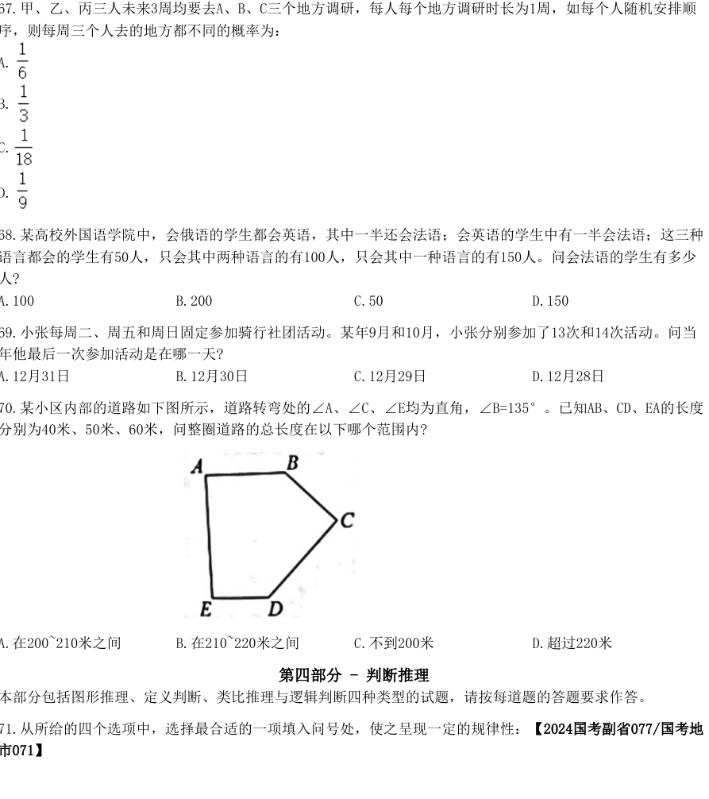

**68.** 某高校外国语学院中，会俄语的学生都会英语，其中一半还会法语；会英语的学生中有一半会法语；这三种语言都会的学生有50人，只会其中两种语言的有100人，只会其中一种语言的有150人。问会法语的学生有多少人?
- A. 100
- B. 200
- C. 50
- D. 150

**69.** 小张每周二、周五和周日固定参加骑行社团活动。某年9月和10月，小张分别参加了13次和14次活动。问当年他最后一次参加活动是在哪一天?
- A. 12月31日
- B. 12月30日
- C. 12月29日
- D. 12月28日

**70.** 某小区内部的道路如下图所示，道路转弯处的∠A、∠C、∠E均为直角，∠B=135°。已知AB、CD、EA的长度分别为40米、50米、60米，问整圈道路的总长度在以下哪个范围内?
- A. 在200~210米之间
- B. 在210~220米之间
- C. 不到200米
- D. 超过220米

## 判断推理

**71.** 从所给的四个选项中，选择最合适的一项填入问号处，使之呈现一定的规律性：【2024国考副省077/国考地市071】 2024年国家公务员录用考试《行测》真题（市地卷-考生回忆版）
- A. 如图所示
- B. 如图所示
- C. 如图所示
- D. 如图所示

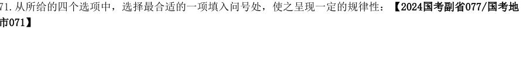

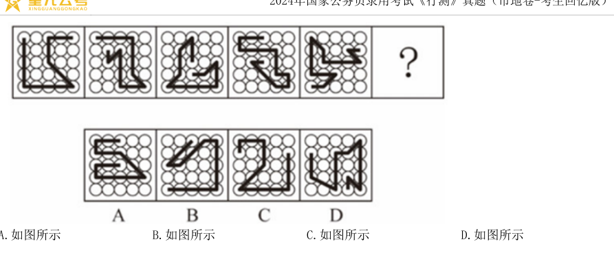

**72.** 从所给的四个选项中，选择最合适的一项填入问号处，使之呈现一定的规律性：【2024国考行政执法072/国考副省076/国考地市072】
- A. 如图所示
- B. 如图所示
- C. 如图所示
- D. 如图所示

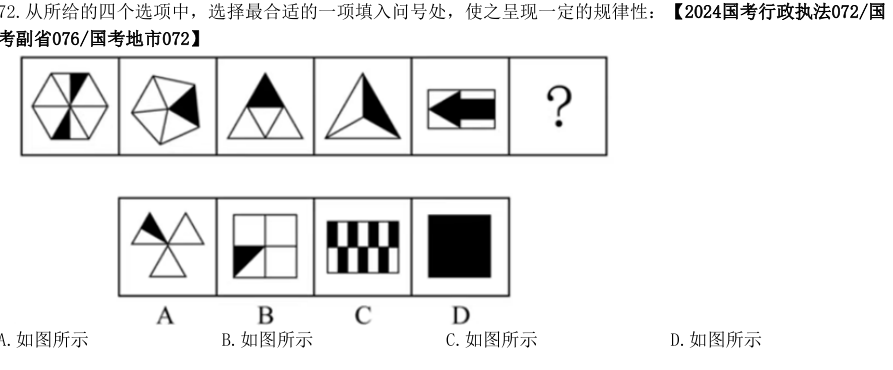

**73.** 从所给的四个选项中，选择最合适的一项填入问号处，使之呈现一定的规律性：【2024国考地市级073】 2024年国家公务员录用考试《行测》真题（市地卷-考生回忆版）
- A. 如图所示
- B. 如图所示
- C. 如图所示
- D. 如图所示

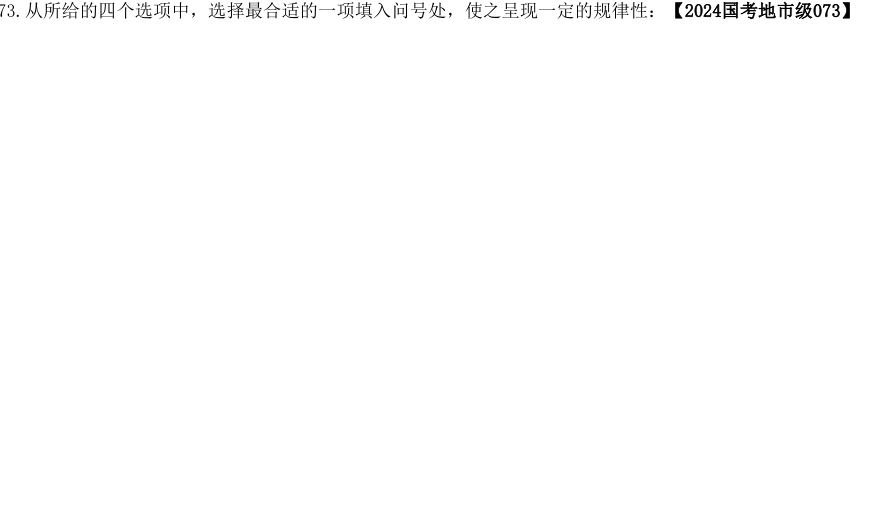

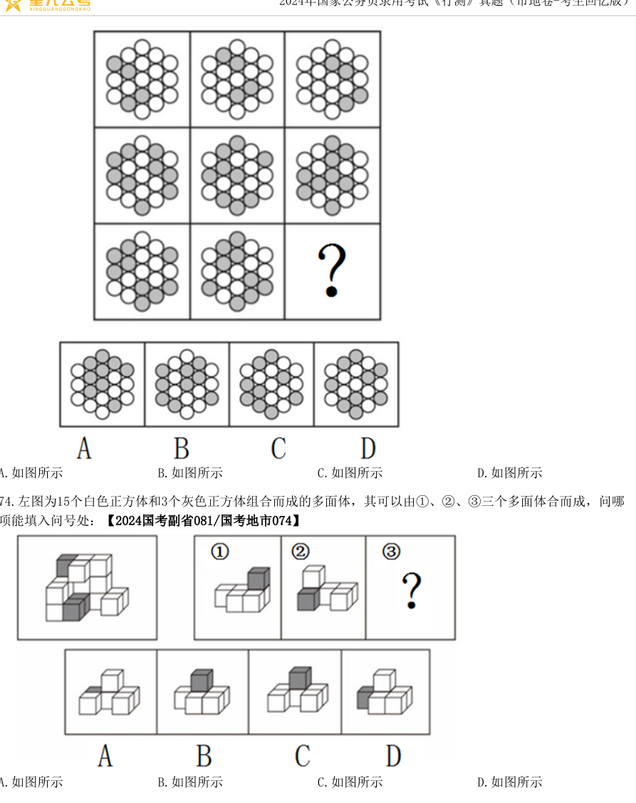

**74.** 左图为15个白色正方体和3个灰色正方体组合而成的多面体，其可以由①、②、③三个多面体合而成，问哪项能填入问号处：【2024国考副省081/国考地市074】
- A. 如图所示
- B. 如图所示
- C. 如图所示
- D. 如图所示

**75.** 从所给的四个选项中，选择最合适的一项填入问号处，使之呈现一定的规律性：【2024国考地市级075】 2024年国家公务员录用考试《行测》真题（市地卷-考生回忆版）
- A. 如图所示
- B. 如图所示
- C. 如图所示
- D. 如图所示

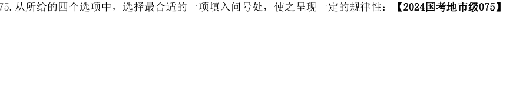

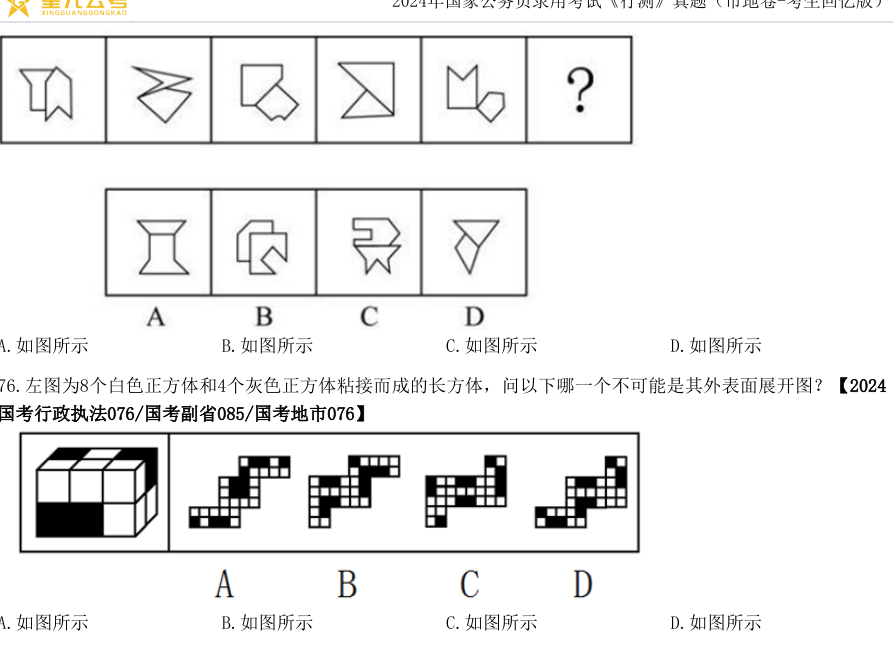

**76.** 左图为8个白色正方体和4个灰色正方体粘接而成的长方体，问以下哪一个不可能是其外表面展开图？【2024国考行政执法076/国考副省085/国考地市076】
- A. 如图所示
- B. 如图所示
- C. 如图所示
- D. 如图所示

**77.** 左图为13个白色正方体和5个灰色正方体组合而成的多面体，现用经A、B、C三个顶点的平面对该多面体进行切割，正确的截面是：【2024国考地市级077】
- A. 如图所示
- B. 如图所示
- C. 如图所示
- D. 如图所示

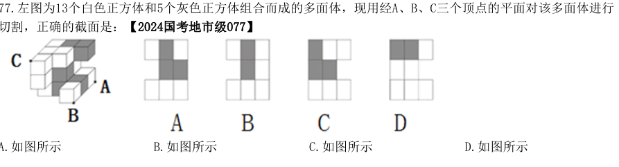

**78.** 把下面的六个图形分为两类，使每一类图形都有各自的共同特征或规律，分类正确的一项是：【2024国考副省083/国考地市078】
- A. ①②⑥，③④⑤
- B. ①③④，②⑤⑥
- C. ①③⑥，②④⑤
- D. ①③⑤，②④⑥

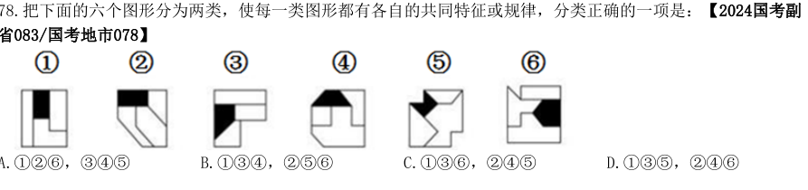

**79.** 把下面的六个图形分为两类，使每一类图形都有各自的共同特征或规律，分类正确的一项是：【2024国考行政执法078/国考副省084/国考地市079】 2024年国家公务员录用考试《行测》真题（市地卷-考生回忆版）
- A. ①④⑤，②③⑥
- B. ①③④，②⑤⑥
- C. ①⑤⑥，②③④
- D. ①②⑥，③④⑤

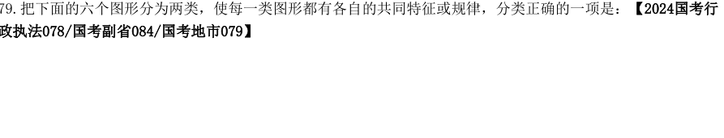

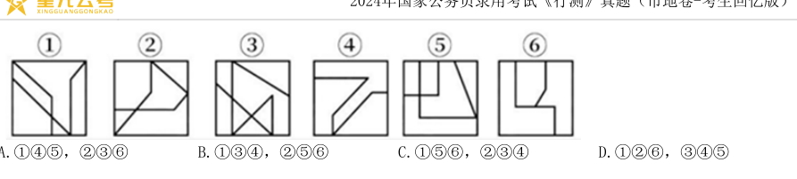

**80.** 把下面的六个图形分为两类，使每一类图形都有各自的共同特征或规律，分类正确的一项是：【2024国考行政执法080/国考地市080/国考副省080】
- A. ①②⑥，③④⑤
- B. ①④⑥，②③⑤
- C. ①③⑤，②④⑥
- D. ①②③，④⑤⑥

**81.** 多级养殖是指根据物种代谢产物或残余有机质的利用价值及其在食物链中所处的级次，依次放养相应生物，多级次利用营养物质的一种养殖方式。根据上述定义，下列属于多级养殖的是：
- A. 将养殖过江蓠的海水用于放养贝类，以利用其中繁殖的浮游生物；再将养殖过贝类的水用于放养对虾；再以对虾代谢分解的产物养殖藻类
- B. 将鱼、虾、贝类与藻类放在同一水槽混养，其代谢产物会为藻类提供必要的营养要素，藻类的光合作用又产生更多的溶解氧
- C. 在一台浮筏上，于冬春季养殖海带；至夏秋季养殖海湾扇贝或石花菜，从而更好利用海况条件，满足市场需要
- D. 同一池塘中，鲢、鳙生活在上层，主食浮游生物；草鱼、鳊生活在中下层，主食草类；鲤、鲫生活在底层，主食底栖动物和有机碎屑

**82.** 复杂型消费行为是指消费者对价格昂贵，品牌差异大，功能复杂的商品，由于缺乏必要的商品知识，需要慎重选择，仔细对比，只求降低风险的购买行为；多变型消费行为是指如果消费者购买的商品价格低，可供选择的品牌很多时，他们并不花太多的时间选择品牌，而是经常变换品牌。根据上述定义，下列说法正确的是：
- A. 老李给儿子换了十几个钢琴老师之后，发现还是第一个钢琴老师最好，于是一次性交了一年的学费，这属于复杂型消费行为
- B. 小明去超市买某品牌饼干，心想上次买了巧克力口味，这次买绿茶口味，下次再试一下夹心的。这属于多变型消费行为
- C. 老王打算买一辆越野车，网上查阅了各种型号参数，试驾了十几款品牌之后，才做出决定。这属于复杂型消费行为
- D. 小丽逛街的时候本来只想买一条裤子，后来发现需要搭配一件合适的上衣和配套的手提包，所以买了全套。这属于多变型消费行为

**83.** 慢病也称为慢性非传染性疾病，是指长期的、不能自愈的、也几乎不能被治愈的疾病。慢病自我管理是指慢病患者主动监测自己的病情，以积极态度及行动，改善健康和情绪，通过对疾病的认识，学习与疾病长期共存。根据上述定义，下列属于慢病自我管理的是：
- A. 老张在患了流感后多方查阅相关信息，每天检测血氧、心率、血压等指标，不做剧烈运动，避免着凉
- B. 老王因慢性肾功能衰竭需定期在医院进行透析治疗，医院为其建立了慢病管理档案，追踪监测肾功能等各项指标
- C. 老赵的父母都因胃癌去世，老赵深知该疾病的严重后果，每年全面体检一次，定期进行胃肠镜检查，不熬夜2024年国家公务员录用考试《行测》真题（市地卷-考生回忆版）不喝酒，规律作息
- D. 患Ⅱ型糖尿病的老李，平日生活格外谨慎，含糖量高的食物一概不碰，每天按时服药，定期监测血糖水平

**84.** 人际关系图，是用一套特定的符号来表示团体内成员之间各种关系的图形。依据前期的调查，将团体成员的关系分为“吸引”“排斥”“无关”三类。图中圆圈内的字母是团体内每一成员的代号。实线与虚线表示相互关系，其中实线表示吸引关系，虚线表排斥关系，箭头表示方向(例如：表示A受B吸引，表示A排斥B),其中被实线箭头指向最多的人，就是处于团体中心位置的人。根据上述定义，对下图的判断正确的是：
- A. 该团体中没有相互排斥的人
- B. C是处于团体中心位置的人
- C. F是该团体中受排斥最多的人
- D. H和B是相互吸引的人

**85.** 电子测量是指利用电子技术为测量手段，进行电的或非电的各种测量，主要分两类：电参量的测量，是指对用电设备中用电参数的测量；非电参量的测量，是指通过不同类型的传感器将物理的、化学的、机械的非电参量转换成电信号，然后利用电子技术测出其相应的电参量，最后将其折合成非电参量数据。根据上述定义，下列电子测量与其他三项类型不同的是：
- A. 利用电子仪表测量某机房电路的电压、电流
- B. 用电子天平称出物体的重量
- C. 声波使话筒内的驻极体薄膜振动，产生与之变化的电压，这一电压被数据采集器接收，用于测量声音的振动频率
- D. 将电极放到体表采集患者心脏活动的电信号，经过放大传输到机器后形成心电图

**86.** 总被引频次是指期刊自创刊以来登载的全部论文在统计当年被引用的总次数。扩散因子是一个用于评估期刊影响力的学术指标，显示总被引频次扩散的范围，具体意义为期刊当年每被引100次所涉及的期刊目数，即扩散因子=总被引频次涉及的期刊数×100/总被引频次。甲刊：创刊于1980年，2022年总被引频次为2000，涉及期刊800种乙刊：创刊于2000年，2022年总被引频次为1500，涉及期刊500种丙刊：创刊于2020年，2022年总被引频次为200，涉及期刊60种根据定义，在2022年，上述三种期刊按照扩散因子由大到小排序正确的是：
- A. 丙、甲、乙
- B. 丙、乙、甲
- C. 乙、丙、甲
- D. 甲、乙、丙

**87.** 动态描写法是指记叙文中对人物、景物作运动状态的描写，创造具体而栩栩如生的形象的一种描写方法。动2024年国家公务员录用考试《行测》真题（市地卷-考生回忆版）态描写法包括两类：一类是对运动着的景物的描写，一类是对静物所作的动态描写。动态描写法的目的在于赋予客观事物以运动感、活力感、变化感，克服形象的单调性，丰富形象的多样性，达到更好地表现事物、感染读者的艺术效果。根据上述定义，下列没有体现动态描写法的是：
- A. 有的松树望穿秋水，不见你来，独自上到高处，斜着身子张望
- B. 夜阑人静，家养的大黃狗趴在院子里安静地睡了
- C. 七股大水，从水库的桥孔跃出，仿佛七幅闪光的黄锦，直铺下去
- D. 一轮杏黄色的满月，悄悄从山嘴处爬出来，把倒影投入湖水中

**88.** 附性法推理是指将同一属性分别附加在原命题的主项和谓项前面，从而形成一个新命题的推理方法，以公式表示即为：“所有S（主项）是P（谓项）→所有NS是NP”（其中“N”表示某种属性） 。运用这种推理必须遵守的规则是： ①原命题必须断定了某个类别的所有事物的某种共性； ②附加的属性概念必须保持含义的同一：③结论中的主谓项关系应与前提中的主谓项关系相同。根据上述定义，下列符合附性法推理规则的是：
- A. 蝴蝶是昆虫，所以，色彩斑斓的蝴蝶是色彩斑斓的昆虫
- B. 教师是人，所以，老教师是老人
- C. 有些诗人是画家，所以，有些女诗人是女画家
- D. 音乐家是人，所以，无天赋的音乐家是无天赋的人

**89.** 中医七方指的是大方、小方、缓方、急方、奇方、偶方、复方七种方剂的总称。其中缓方是指药性缓和，治疗病势缓慢需长期服用的方剂；急方是指药性峻猛，治疗病势急重急于取效的方剂；奇方是指单数药物合成的方剂；偶方是指双数药物组成的方剂。根据上述定义，下列既属于缓方又属于偶方的是：
- A. 参附汤：人参15克、附子30克，有回阳、益气、固脱之功，常用于元气大亏、阳气暴脱之症
- B. 甘草汤：甘草6克，主治少阴咽痛，兼治舌肿，有清热解毒之功效
- C. 四君子汤：人参、甘草、茯苓、白术各等分，主治脾胃气虚证，症见面色萎黄、语声低微、气短乏力等
- D. 生脉散：人参9克、麦门冬9克、五味子6克，为补益剂，具有益气生津、敛阴止汗之功效

**90.** 在图书馆统计指标中，文献流通数是指实际被阅读者借阅、利用的文献数。文献流通率是指文献流通数与馆藏中提供流通的文献数的比率。文献利用率是指文献流通数与馆藏文献总数的比率。文献拒借率是指读者未能借到的文献数与读者合理要求借阅的文献数的比率，即索书条拒借数占索书条总数的百分比。文献保障率是指图书馆根据读者借阅、利用的文献数与图书馆拥有的读者数的比率。根据上述定义，下列说法正确的是：
- A. 对一个图书馆来说，文献流通率一定不低于文献利用率
- B. 对一个图书馆来说，文献流通率反映了图书馆馆藏文献的规模及读者的需求
- C. 当文献拒借率越高时，文献保障率就越低
- D. 文献流通数越多而馆藏中提供流通的文献数越少，文献利用率就越高

**91.** 卫冕∶夺冠
- A. 庄园∶田园
- B. 追讨∶诉讼
- C. 续约∶签约
- D. 姓名∶笔名

**92.** 花生壳∶核桃仁
- A. 刺梨汁∶桃花扇
- B. 丝瓜络∶石榴籽
- C. 杏仁露∶葡萄皮
- D. 葛根茶∶芡实粉

**93.** 诛禁不当∶反受其央
- A. 为者常成∶行者常至
- B. 君子检身∶常若有过
- C. 其身不正∶虽令不从
- D. 麻雀虽小∶五脏俱全

**94.** 明辨是非∶静待成败2024年国家公务员录用考试《行测》真题（市地卷-考生回忆版）
- A. 判若云泥∶开释左右
- B. 洞鉴古今∶博观始终
- C. 一争高低∶弱肉强食
- D. 惩恶劝善∶天差地别

**95.** 蚜虫∶七星瓢虫∶小麦
- A. 蛇∶鸟：谷子
- B. 稗草∶螳螂∶水稻
- C. 蚊子∶青蛙∶高梁
- D. 老鼠∶黄鼬∶玉米

**96.** 感想∶主观性∶体会
- A. 典范∶示范性∶表率
- B. 发明∶创造性∶方法
- C. 泥土∶可塑性∶材料
- D. 规律∶普遍性∶定理

**97.** 自发裂变∶核裂变∶诱发裂变
- A. 波浪能∶太阳能∶再生能源
- B. 铁路交通∶现代交通∶公路交通
- C. 贸易逆差∶贸易平衡∶贸易顺差
- D. 负有理数∶负实数∶负无理数

**98.** 轮作休耕∶耕地保护∶严禁占用
- A. 植树造林∶碳中和∶节能减排
- B. 登月计划∶空间站∶太空探索
- C. 商品交换∶国际贸易∶技术服务
- D. 观众评选∶荣获大奖∶出类拔萃

**99.** 领头雁 对于 （   ） 相当于 （   ） 对于 先驱
- A. 领导者  拓荒牛
- B. 鸟类    革命
- C. 迁徙    先锋
- D. 出头鸟  先行者

**100.** 重型战机 对于 （  ）相当于（  ） 对于 分辨率
- A. 隐形战机  清晰度
- B. 战斗机  性能指标
- C. 轻型战机  订单量
- D. 载弹量  显示器

**101.** 冰雪旅游是利用冰雪气候资源体验冰雪文化的旅游活动，包括冰雪观光演艺、运动竞技等内容。H地区冰雪旅游开展了五年，调查显示：在近万名受访者中，有90%的人曾以不同形式体验过冰雪旅游，平均每4年有65%的人体验过1-2次冰雪旅游，有25%的人体验过3-4次，且这一比例逐年升高。这说明H地区冰雪旅游的需求较高，常态化多次消费正成为H地区越来越多人的选择。以下哪项如果为真，最能削弱上述结论：
- A. 参与调查的受访者几乎都是了解或喜爱冰雪旅游的年轻人
- B. 近五年，H地区冰雪旅游产业的年均投资额接近，没有增加
- C. H地区位于北半球北部，冬季较长，许多游客会来此体验冰雪旅游
- D. 为扩大宣传，H地区许多冰雪项目会推出优惠组合套餐，吸引人们多次消费

**102.** 多重宇宙理论通常也称为平行宇宙理论，该理论认为有无数个宇宙与我们所在的宇宙并存，虽然我们无法意识到这一点。但也可能与我们的宇宙极其相似，在更广的意义上，要证明多重宇宙存在远比单纯想象它困难得多。甚至从一开始，有一部分科学家就认为这个理论称不上是“真正意义上的科学”。因为没有人能证明多重宇宙理论是错误的——即它无法被证伪。以下哪项可能是上述科学家论证的前提：
- A. 平行宇宙理论至今未获证实，只是单纯的想象
- B. 只有能被证伪的理论，才能称得上是“真正意义上的科学”
- C. 平行宇宙理论即使变成现实，对于人类的文明进步也未必是坏事
- D. 如果平行宇宙的数量足够多，那可能意味着在我们认为的虚拟世界中发生的事情也会真实地发生在平行宇宙中

**103.** 在过去，药物的研发主要来自于陆地生物，这与陆地生物更被熟知且容易获得有关。近几十年来，越来越多的药物开始从海洋生物中产生，海洋生态环境极具复杂性，因而海洋生物相比于陆地生物有着更为广泛的多样性。有人据此认为，海洋生物产业潜力巨大，海洋生物更有可能是未来新型抗生素，抗癌药物的来源。以下除哪项外，均能支持上述观点？
- A. 目前抗生素都来源于陆地微生物，病菌耐药性不断上升，而海洋微生物药物已经对一些感染性疾病提供了替2024年国家公务员录用考试《行测》真题（市地卷-考生回忆版）代性疗法
- B. 借助计算机工具，人们已经将庞大的生物基因组库和具有生物活性的化合物库进行关联，用以探索性药物
- C. 一些海洋生物如鲸、鲨等终身不得癌症，有近300种海洋生物含有抗肿瘤物质，他们是研究抗癌药物的重要资源
- D. 当前已经发现的3.5万个海洋天然产物中有一半以上都具有生物活性，还有更多数以万计的未知海洋天然产物亟待开发

**104.** 研究中，实验组小鼠每天晚上接受两小时的蓝光照射，对照组小鼠白天接受两个小时的蓝光照射。三周之后，所有小鼠进行“强迫游泳”和“糖水偏好”测试。这两项测试常用来检测小鼠是否出现了类似抑郁的症状。结果发现，相比于白天接受光照的小鼠，夜间接受光照的小鼠明显表现出类似抑郁的症状。研究者认为，长期在夜间暴露于蓝光下，人们出现抑郁情绪的风险会提高。以下除哪项外，均能削弱研究者的观点：
- A. 小鼠与人的生活习性完全不同，小鼠昼伏夜出，而人类基本是白天活动，晚上休息
- B. 光对于小鼠是厌恶型刺激，小鼠回避光以降低被发现和捕食的风险，而人通常在光明的环境感觉更加安全
- C. 行为测试是否能够测试主观情绪体验，类似抑郁的症状是否等同于出现抑郁的情绪体验，尚存在争议
- D. 相比白天，夜间的光照更容易通过视网膜神经节细胞激活伏隔核，该脑区与负性情绪的产生有关

**105.** 研究发现，一种被称为EPAS1的特殊基因能调节机体生理状态，使人类适应缺氧环境。考古研究表明这种特殊基因最早可追溯至16万年前已居于青藏高原的古人类。由于16万年前全国同时生活着尼安德特人、月尼索瓦人及古老的直立人，其中只有丹尼索瓦人拥有这一基因，考古学家推测丹尼索瓦人很可能在16万年前居住于青藏高原。以下哪项除外，最能支持考古学家的推测？
- A. 通过对牙齿形态的扫描，发现青藏高原古人类的牙齿齿列和丹尼索瓦人最为相似
- B. 分析青藏高原人骨化石中的蛋白质序列，发现这些人类与丹尼索瓦人同属一类
- C. 考古人员在青藏高原东北部的白石崖溶洞遗址提取到丹尼索瓦人的线粒体DNA
- D. 丹尼索瓦人曾在亚洲广泛分布，他们曾在西伯利亚生活过，可耐受高寒环境有甲、乙、丙、丁、戊、己6个城市，其中的两个城市在2021年结成一对友好城市，其余4个城市中的2个在2022年结成一对友好城市，剩余的2个城市在2023年也结成一对友好城市，已知：（1）乙的结对城市不是丁（2）甲的结对城市不是乙就是丙（3）甲和乙均不是在2021年结对的（4）丁和戊均不是在2023年结对的

**106.** 下列哪项是可能的先后依次结对的城市名单？
- A. 甲和丙，丁和戊，乙和己
- B. 丙和丁，甲和乙，戊和己
- C. 丁和己，丙和戊，甲和乙
- D. 丙和戊，甲和丁，乙和己

**107.** 如果己是2023年结对的，那么戊一定是和哪个城市结对的？
- A. 甲
- B. 乙
- C. 丙
- D. 丁

**108.** 如果丁是2022年结对的，那么下列各项中，哪两个城市可能结对？
- A. 丙和戊
- B. 乙和己
- C. 甲和戊
- D. 乙和戊

**109.** 如果甲和丙结对，下列哪一项一定为真？
- A. 丙是2023年结对的
- B. 己是2023年结对的
- C. 丁是2021年结对的
- D. 戊是2021年结对的

**110.** 有几个城市可能是在2022年与其他城市结对的？
- A. 6个
- B. 5个
- C. 4个
- D. 3个2024年国家公务员录用考试《行测》真题（市地卷-考生回忆版）

## 资料分析

**111.** 将S省各级12315工作机构接收的投诉、举报和咨询三类投诉量按2022年同比增速从高到低排序，以下正确的是：
- A. 投诉量、举报量、咨询量
- B. 咨询量、投诉量、举报量
- C. 举报量、咨询量、投诉量
- D. 举报量、投诉量、咨询量

**112.** 2022年，S省各级12315工作机构热线电话投诉接收件数占投诉总件数的比重比热线电话举报接收件数占举报总件数的比重：
- A. 高20个百分点以上
- B. 低20个百分点以上
- C. 高不到20个百分点
- D. 低不到20个百分点

**113.** 2022年，S省各级12315工作机构接收诉求量最少的季度是：
- A. 第一季度
- B. 第二季度
- C. 第三季度
- D. 第四季度

**114.** 以下折线图反映了2022年哪一时间段内S省各级12315工作机构的接收诉求量环比增量的变化趋势？ 2024年国家公务员录用考试《行测》真题（市地卷-考生回忆版）
- A. 2—5月
- B. 3—6月
- C. 5—8月
- D. 8—11月

**115.** 关于2022年S省各级12315工作机构接受诉求状况，不能从上述资料中推出的是：
- A. 2—12月间，接收诉求件数环比增量最大的是3月
- B. 全年接收诉求件数最多的月份诉求件数是最少月份的1.5倍以上
- C. 全年举报接收量占本渠道投诉、举报接收量比重最高的渠道是来函
- D. 全年互联渠道投诉、举报接收件数超过40万件2022年，京津冀地区生产总值合计10.0万亿元，是2013年的1.8倍。其中，北京、河北跨越4万亿元量级，均为4.2万亿元，分别是2013年的2.0倍和1.7倍；天津1.6万亿元，是2013年的1.6倍，京津冀第一产业、第二产业、第三产业增加值占生产总值比重构成由2013年的6.2∶35.7∶58.1变化为2022年的4.8∶29.6∶65.6。京津冀三地第三产业增加值占生产总值比重分别为83.8%、61.3%和49.4%，较2013年分别提高4.3、7.2和8.4个百分点。2013～2022年，京津冀地区城镇累计分别新增就业288.1万、405.5万和748.4万人。2021年，北京法人单位从业人员中，第三产业比重为84.4%，较2013年提高6.2个百分点，其中信息服务业和商务服务业占比达25.5%，较2013年提高6.2个百分点；天津和河北第三产业就业人员占比为60.5%和46.6%，较2013年提高10.9和15.1个百分点。2022年，京津冀三地全体居民人均可支配收入分别为77415元、48976元和30867元，与2013年相比，年均分别增长7.4%、7.1%和8.2%。其中，城镇居民人均可支配收入分别增长7.3%、6.9%和7.1%，农村居民人均可支配收入分别增长8.2%、7.3%和8.6%。

**116.** 以2013年为基期，则2013-2022年京津翼地区生产总值年均约增加多少万亿元：
- A. 1.1
- B. 0.9
- C. 0.7
- D. 0.5

**117.** 2013年，北京第三产业增加值占其生产总值比重比天津高多少个百分点：
- A. 25.4
- B. 22.5
- C. 19.6
- D. 16.7

**118.** 2013-2022年，北京城镇累计新增就业人数约占同期京津冀地区城镇累计新増就业总人数的：
- A. 30%
- B. 35%
- C. 20%
- D. 25%

**119.** 将京、津、冀按2013-2022年居民人均可支配收入年均增速的城乡差值的绝对值从大到小排列，以下正确的是：
- A. 京、冀、津
- B. 冀、京、津
- C. 京、津、冀
- D. 冀、津、京

**120.** 在以下信息中，能够从上述资料中推出的有几项：①2013-022年京津冀第一产业增加值年均增量（以2013年为基期）②2013年天津第一产业、第二产业增加值之和③2013-2022年河北城镇新增就业人员中第三产业就业人员人数
- A. 0项
- B. 1项
- C. 2项
- D. 3项2024年国家公务员录用考试《行测》真题（市地卷-考生回忆版）

**121.** 2016年-2020年，我国马铃薯总产量在以下哪个范围内：
- A. 不到0.9亿吨
- B. 0.9亿~0.92亿吨之间
- C. 0.92亿~0.94亿吨之间
- D. 超过0.94亿吨

**122.** 2018年-2022年，我国马铃薯单位面积产量同比增长的年份有几个：
- A. 2
- B. 3
- C. 4
- D. 5

**123.** 2020-2022年，我国马铃薯出口量占产量的比重呈现何种变化趋势：
- A. 持续上升
- B. 持续下降
- C. 先降后升
- D. 先升后降

**124.** 2017-2022年我国马铃薯出口量最高的年份，当年出口额在这6年中排名：
- A. 第一
- B. 第二
- C. 第三
- D. 第四

**125.** 以下折线图反映了2019-2022年我国马铃薯哪一产销数据的同比增量变化趋势：2024年国家公务员录用考试《行测》真题（市地卷-考生回忆版）
- A. 出口额
- B. 出口量
- C. 播种面积
- D. 产量

**126.** 2017-2022年，全国移动数据流量业务收入总额在以下哪个范围内：
- A. 不到3.4万亿元
- B. 超过3.6万亿元
- C. 3.4万亿—3.5万亿元之间
- D. 3.5万亿—3.6万亿元之间

**127.** 2019年，蜂窝物联网终端用户数同比增量约是移动电话用户数同比增量的多少倍：
- A. 7
- B. 10
- C. 13
- D. 16

**128.** 以下年份中，全国电信新兴业务收入同比增速最快的是：
- A. 2019年
- B. 2020年
- C. 2021年
- D. 2022年2024年国家公务员录用考试《行测》真题（市地卷-考生回忆版）

**129.** 如2022年内每个月移动电话用户数增量和蜂窝物联网终端用户数增量均为固定值，则2022年蜂窝物联网终端用户数第一次超过移动电话用户数是在哪个季度：
- A. 第一季度
- B. 第二季度
- C. 第三季度
- D. 第四季度

**130.** 以下折线图反映了2019-2022年全国哪一类电信业务收入同比增量的变化趋势：
- A. 新兴业务
- B. 移动数据流量业务
- C. 互联网宽带接入业务
- D. 语音业务
