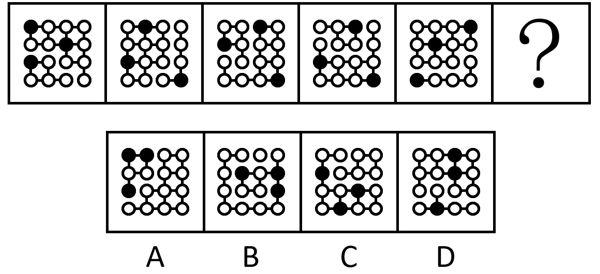
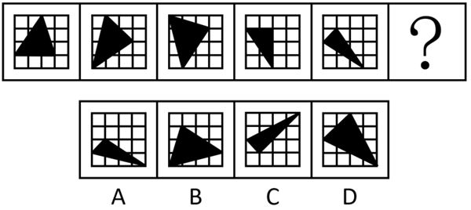
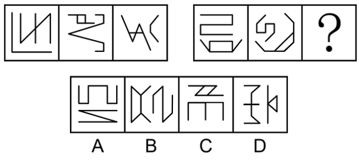
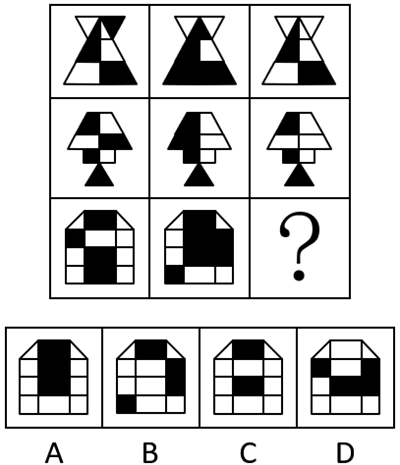
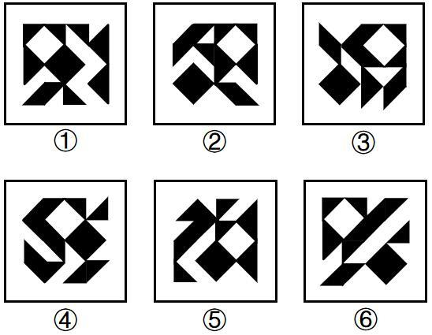
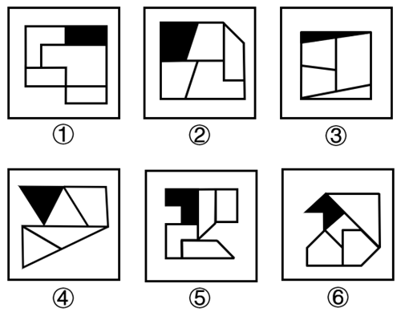

# 2026年国考《行政职业能力测验》真题（行政执法类）

> 题目来源：爱题库（考生回忆版）｜共 130 题
> 答案与解析见同目录《2026年国考行测答案与解析（行政执法类）.md》

## 政治理论

**1.** 习近平总书记强调，必须坚持自信自立。中国人民和中华民族从近代以后的深重苦难走向伟大复兴的光明前景，从来就没有教科书，更没有现成答案。关于坚持自信自立，下列表述正确的有几项？①走自己的路，是党的全部理论和实践立足点，更是党百年奋斗得出的历史结论②推进中国式现代化，必须坚持把国家和民族发展放在自己力量的基点上③中国式现代化既要物质财富极大丰富，也要精神财富极大丰富、在思想文化上自信自强④独立自主是中华民族的优良传统，是中国共产党、中华人民共和国立党立国的重要原则
- A. 1项
- B. 2项
- C. 3项
- D. 4项

**2.** 习近平总书记强调，科学制定和接续实施五年规划，是我们党治国理政一条重要经验，也是中国特色社会主义一个重要政治优势。关于五年规划编制工作，下列说法正确的是：
- A. 我国五年规划（计划）编制工作起始于1949年，有力推动了经济社会发展、综合国力提升、人民生活改善
- B. 中长期发展规划有助于充分发挥政府在资源配置中的决定性作用，彰显了政府对经济社会发展的宏观调控能力
- C. 从第一个五年计划到当前的五年规划，一以贯之的主题是把我国建设成为社会主义现代化国家
- D. 通过互联网就“十五五”规划编制向全社会征求意见和建议，在我国五年规划编制史上是第一次

**3.** 建设文化强国，事关中国式现代化建设全局，事关中华民族复兴大业，事关提升国际竞争力，锚定2035年建成社会主义文化强国的战略目标，必须始终坚持文化建设着眼于人、落脚于人。下列有关说法正确的是：①文化强国之“强”最终要体现在为人民提供文化服务和文化产品的能力上②坚持以人民为中心，着眼满足人民群众多样化、多层次、多方面的精神文化需求③文化创造核心在人，要建设一支规模宏大、结构合理、锐意创新的高水平文化人才队伍④尊重人才成长规律，完善符合文化领域特点的人才选拔、培养、使用、激励机制，营造识才、重才、爱才的良好政策环境
- A. ①②③
- B. ②③④
- C. ①②④
- D. ①③④

**4.** 中共中央、国务院印发《加快建设农业强国规划（2024-2035年）》，提出面对新形势新要求，必须把加快建设农业强国作为统领“三农”工作的战略总纲，摆上建设社会主义现代化强国的重要位置，下列与加快建设农业强国有关的说法正确的是：
- A. 推进生态综合补偿，健全横向生态保护补偿机制，统筹推进生态环境损害赔偿
- B. 建立健全长江流域信息共享系统，推进长江流域农业深度节水控水
- C. 完善粮食产销奖补制度，中央预算内投资向粮食主销区倾斜
- D. 推进农业科技推广体系，从经营性向公益性转变

**5.** 全面推进依法治国是一个系统工程，必须坚持法治国家、法治政府、法治社会一体建设。下列相关表述不准确的是：
- A. 法治社会是构筑法治国家、法治政府的基础
- B. 建设法治政府对建设法治社会具有重要引领和带动作用
- C. 法治政府、法治社会建设必须服从、服务于法治国家建设
- D. 法治国家是依法治国的主体，是法治社会建设的先导和示范

**6.** 2025年7月，习近平总书记在中央城市工作会议上发表重要讲话，明确做好城市工作的总体要求、重要原则、重点任务，为做好新时代新征程的城市工作提供了根本遵循。关于城市工作，下列说法正确的是：
- A. 要把握“我国城镇化正从快速增长期转向稳定发展期”的历史方位
- B. 城市工作重心应向更加注重建设投入转变
- C. 着力通过外延扩张发展组团式的现代化城市群和都市圈
- D. 城市政府应从城市事务管理的“掌舵人”转变为“划桨人”

**7.** 经济工作千头万绪，必须统筹好有效市场和有为政府的关系、总供给和总需求的关系、培育新动能和更新旧动能的关系、做优增量和盘活存量的关系、提升质量和做大总量的关系。下列相关说法不准确的是：
- A. 要加快推动作为经济增长和就业收入基本依托的传统产业改造升级
- B. 要加快补上内需特别是消费短板，使内需成为拉动经济增长的主动力和稳定锚
- C. 要坚持以量取胜、充分发挥规模效应，用好超大规模市场优势和丰富应用场景
- D. 要用好各类增量资源和存量资源，通过盘活存量来带动增量

**8.** 2025年7月30日，中共中央政治局召开会议，对扎实做好民生保障工作作了重要部署。下列相关表述不准确的是（）。
- A. 巩固拓展脱贫攻坚成果，确保不发生规模性返贫致贫
- B. 夯实“三农”基础，推动粮食和重要农产品价格保持在合理水平
- C. 突出就业优先政策导向，促进高校毕业生、退役军人、农民工等重点群体就业
- D. 始终把人民群众财产安全放在第一位，加强安全生产监管

**9.** 做好新时代人口工作，要完善新时代人口发展战略，认识、适应、引领人口发展新常态，以人口高质量发展支撑中国式现代化。关于做好新时代人口工作，下列说法正确的是：
- A. 要树立“大人口观”，推动人口与财政、货币、就业、产业、投资、消费、生态、区域等政策形成系统集成效应
- B. 必须推动人口工作由稳定总量、畅通流动向调节数量、优化结构转变
- C. 要更加重视“引导”和“激励”的办法，由社会治理向政府治理转变
- D. 坚持人民主体地位，把人口高速增长同人民高品质生活紧密结合起来

**10.** 《中共中央关于制定国民经济和社会发展第十五个五年规划的建议》提出，推进国家安全体系和能力现代化，建设更高水平平安中国。下列有关说法正确的是（    ）。
- A. 锻造实战实用的国家安全能力，把捍卫国土安全摆在首位
- B. 统筹推进房地产、地方政府债务、中小金融机构等风险有序化解
- C. 健全国家安全体系，坚持以风险防控为先导、法治保障为落脚点
- D. 完善公共安全体系，推动公共安全治理模式由事后处理向事中控制转型

**11.** 习近平总书记高度重视战略思维，多次强调党员领导干部要加强战略思维，增强战略定力。下列体现战略思维的说法，正确的有几项？①粮食多一点少一点是战略问题，粮食安全是战术问题②统战工作的本质要求是大团结大联合，解决的是人心和力量问题③要心怀“国之大者”，站在全局和战略的高度想问题、办事情，一切工作都要以贯彻落实党中央决策部署为前提④自觉把党的对外工作放到党和国家工作大局中来认识，放到中国与世界关系的发展变化中来把握
- A. 1项
- B. 2项
- C. 3项
- D. 4项

**12.** 习近平总书记指出，我们要建成的教育强国，是中国特色社会主义教育强国，应当具有强大的思政引领力、人才竞争力、科技支撑力、民生保障力、社会协同力、国际影响力，为以中国式现代化全面推进强国建设、民族复兴伟业提供有力支撑。关于建设教育强国，下列说法正确的是：
- A. 要坚持教育均等化原则，把教育公平作为国家基本教育政策
- B. 要完善人才培养与经济社会发展需要适配机制，顺应时代发展要求，适度增加学科专业数量
- C. 要把引进全球顶尖科学家摆到更加突出位置，着力培育拔尖创新人才，推动实现高水平科技自立自强
- D. 从教育大国到教育强国是一个系统性跃升和质变，必须以改革创新为动力

**13.** 习近平主席在二十国集团领导人第十九次峰会上指出，要完善全球贸易治理，建设开放型世界经济。下列相关表述正确的是：
- A. 要适应经济问题政治化的潮流，通过强化绿色低碳要求推行贸易保护政策
- B. 要积极构建更具平等性、包容性和建设性的产业链供应链伙伴关系，呼吁各方加强合作
- C. 要把安全置于国际经贸议程中心地位，持续推动贸易和投资自由化便利化
- D. 要一以贯之保持世界贸易组织规则不变，提高多边贸易体制的权威性、有效性和相关性

**14.** 中国式现代化要靠科技现代化作支撑，实现高质量发展要靠科技创新培育新动能。关于建成科技强国的举措，下列说法正确的是：
- A. 要坚持有所为有所不为，突出经济发展需求，在重要领域实施科技战略部署
- B. 要充分发挥人才在科技资源配置中的决定性作用，调动产学研各环节的积极性
- C. 要充分发挥科技领军企业龙头作用，鼓励中小企业和民营企业科技创新，支持企业牵头或参与国家重大科技项目
- D. 要降低基础研究组织化程度，强化自由探索，鼓励面向重大科学问题的协同攻关

**15.** 习近平总书记强调，选人用人要加强党性鉴别，注重考察干部的境界格局和忠诚度廉洁度。下列与党性相关的说法正确的是：
- A. 树立和践行正确政绩观，起决定性作用的是党性
- B. 强党性，就是要自觉用马克思主义思想改造客观世界
- C. 党性、党风、党纪是有机整体，党性是根本，党风是保障，党纪是表现
- D. 作风问题本质上是党性问题，要把作风建设摆在党性修养的首位

**16.** 坚持问题导向是习近平新时代中国特色社会主义思想的世界观和方法论的重要内容。关于坚持问题导向，下列说法不准确的是：
- A. 坚持问题导向是马克思主义的鲜明特点
- B. 坚持问题导向要抓住人民最关心最直接最现实的利益问题
- C. 坚持问题导向体现了矛盾的普遍性和客观性
- D. 坚持问题导向本质是变与不变、继承与发展的辩证统一

**17.** 恩格斯深刻指出：“马克思的整个世界观不是教义，而是方法。它提供的不是现成的教条，而是进一步研究的出发点和供这种研究使用的方法。”下列有关马克思主义理论的说法不准确的是：
- A. 马克思创立了辩证法，成为我们认识世界和改造世界的根本方法
- B. 科学社会主义的原则不能丢，但科学社会主义也绝不是一成不变的教条
- C. 当代中国的伟大社会变革不是简单套用马克思主义经典作家设想的模板
- D. 《共产党宣言》发表至今，人类社会发生了翻天覆地的变化，但马克思主义所阐述的一般原理整个来说仍然是完全正确的

**18.** 以实践为基础，从整体上把握人与世界的关系，是马克思主义世界观的重要内容。关于马克思主义实践观，下列说法正确的是：
- A. 正确发挥主观能动性是实践的根本途径
- B. 实践的过程就是对于结果的检验和评价
- C. 实践是人类生存和发展最基本的活动
- D. 实践是一种无目的的适应环境的本能活动

**19.** 习近平总书记在对各省区市进行深入考察调研的过程中，结合各地实际情况，对推进高质量发展作出一系列重要部署。下列对应关系正确的是：
- A. 江苏——要建设国家资源型经济转型综合配套改革试验区，重点抓好能源转型、产业升级和适度多元发展
- B. 山东——要发挥海洋资源丰富的得天独厚优势，经略海洋、向海图强，打造世界级海洋港口群，打造现代海洋经济发展高地
- C. 云南——要把握好挑大梁的着力点，在推动科技创新和产业创新融合上打头阵
- D. 贵州——聚焦实现贸易、投资、跨境资金流动、人员进出、运输来往自由便利和数据安全有序流动

**20.** 2025年是中国人民抗日战争暨世界反法西斯战争胜利80周年。中国人民对战争带来的苦难有着刻骨铭心的记忆，对和平有着孜孜不倦的追求。关于中国人民抗日战争，下列表述不准确的是：
- A. 中国人民抗日战争的伟大胜利，是以爱国主义为核心的民族精神的伟大胜利
- B. 中国人民抗日战争的伟大胜利，第一次确立了中国在世界上的大国地位，使中国人民赢得了世界爱好和平人民的尊敬
- C. 中国人民抗日战争的伟大胜利，是近代以来中国抗击外敌入侵的第一次完全胜利
- D. 中国人民抗日战争的伟大胜利，为中华民族由近代以来陷入深重危机走向伟大复兴确立了历史转折点

## 常识判断
*根据题目要求，在四个选项中选出一个最恰当的答案。*

**21.** 下列情形不符合《中华人民共和国监察法》及其实施条例规定的是：
- A. 再派出的监察专员王某在开展监察工作过程中，受派出他的监察机构领导
- B. 公务员张某在怀孕期间因涉嫌严重职务违法被监察机关调查，经监察机关依法审批，对其采取责令候查措施
- C. 办理监察事项的监察人员黄某系监察对象刘某的丈夫，黄某应自行回避
- D. 监察人员李某涉嫌职务犯罪，监察机关决定对其采取15日禁闭措施

**22.** 关于《中华人民共和国民营经济促进法》，下列说法错误的是：
- A. 是我国第一部专门关于民营经济发展的基础性法律
- B. 规定司法行政部门建立涉企行政执法诉求沟通机制
- C. 规定地方各级人民政府与民营经济组织订立的合同不得变更
- D. 规定向民营经济组织开放国家重大科研基础设施

**23.** 根据《中华人民共和国反洗钱法》，下列说法错误的是：
- A. 在我国境内设立的非银行支付机构应履行该法规定的金融机构反洗钱义务
- B. 我国境内宝石现货交易应当及时向反洗钱监测分析机构报告
- C. 在业务关系结束后，金融机构应将客户身份资料至少保存十年
- D. 出入境人员携带的现金超过规定金额的，应当按照规定向海关申报

**24.** 甲乙系夫妻关系。甲盗窃他人3万元人民币后回家告诉了乙，要其帮忙联系去外地朋友家“躲几天风头”。对此，下列说法正确的是：
- A. 若乙为甲盗窃案的证人，在人民法院通知其出庭作证时可以拒绝
- B. 由于甲乙为夫妻，即使乙帮助甲逃匿，其行为也不构成犯罪
- C. 若甲逃匿后公安机关联系到乙，乙陪同甲至公安机关投案，甲不构成自首
- D. 若甲最终被判处刑罚，乙可以不经过甲的同意直接提出上诉

**25.** 下列说法与我国税收制度不相符的是：
- A. 对我国境内某全球知名半导体公司征收增值税
- B. 对未做废弃物无害化处理的养殖场征收资源税
- C. 对某进口高档化妆品公司征收消费税
- D. 对在我国境内外资企业工作多年的外籍居民征收个人所得税

**26.** 《贺新郎.读史》是毛泽东创作的咏史词，高度凝练了人类社会发展历程。下列相关说法不恰当的是：
- A. 成汤创立商朝是“五帝三皇神圣事”之一
- B. 在“只几个石头磨过”时人类学会了用火
- C. 利簋是“铜铁炉中翻火焰”时代留下的器物
- D. “更陈王奋起挥黄钺”揭开了秦末农民起义的序幕

**27.** 2025年3月，中共中央办公厅、国务院办公厅印发《逐步把永久基本农田建成高标准农田实施方案》，下列有关说法正确的是：
- A. 西北区要重点加强水平梯田改造建设
- B. 25度以上坡耕地、沿海内陆滩涂是开展建设的重点区域
- C. 高标准农田建设标准中的“两通”是指通水通路
- D. 黄淮海区应该把改善田块细碎化问题作为一个工作重点

**28.** “体重管理年”三年行动旨在引导全社会养成重视体重、科学饮食与锻炼的习惯，科学减重，健康生活。关于肥胖对健康的影响，下列说法错误的是：
- A. 肥胖容易引发胰岛素抵抗，增加患2型糖尿病风险
- B. 内脏脂肪组织分泌的炎症因子与动脉粥样硬化发展相关
- C. 肥胖者的排尿次数多，会导致血尿酸水平远低于正常人
- D. 肥胖引起的气道狭窄可能诱发阻塞性睡眠呼吸暂停

**29.** 下列与自然界中的颜色有关的说法错误的是：
- A. “橙色月亮”通常发生在大气层中水汽或颗粒物质较多时
- B. 火烈鸟羽毛呈朱红色与摄入食物中的虾青素累积有关
- C. 蓝闪蝶翅膀呈蓝色是由于其表面鳞片具有特殊的微结构
- D. 蓝莓呈现靛蓝色是因为表面蜡质层中含高浓度花青素

**30.** 为促进长江水生生物多样性和水域生态修复，我国实施长江十年禁渔，下列相关说法错误的是：
- A. 长江流域“一江一口两湖七河”禁渔，“两湖”指鄱阳湖和太湖
- B. 禁止在长江流域开放水域养殖外来物种或者其他非本地物种
- C. 青、草、鲢、鳙四大家鱼会在长江和其附属湖泊之间洄游
- D. 在禁渔期内使用炸鱼、电鱼等方式捕捞，涉嫌刑事犯罪

**31.** 关于汽车自动驾驶技术，下列说法错误的是：
- A. 激光雷达通过发射激光束来探测目标的位置、速度
- B. 相对于毫米波雷达，超声波雷达更适合远距离探测
- C. 强化学习有助于实现车辆的自主学习和智能决策
- D. 陀螺仪和加速度计可用来测算车辆的姿态和运动信息

**32.** 关于中国古代建筑的构件，下列说法正确的是：
- A. 飞檐在木构建筑中能有效减少梁柱交接处的剪力
- B. 台基多使用石材，其主要目的是防火
- C. 藻井可解决建筑室内通风和采光问题
- D. 榫卯结构通过允许微小位移来提升整体抗震性能

**33.** 某物流公司要优化长三角到乌鲁木齐的易腐货物运输路线，下列方案最可行的是：
- A. 夏季采用陇海——兰新铁路运输利用沿线低温天气自然保鲜
- B. 冬季选择长江——京杭大运河——黄河水运组合避开陆路交通拥堵
- C. 春秋季采用铁路冷藏集装箱运输平衡运输成本与时效性
- D. 全年优先使用连霍高速公路运输以追求最低的运输成本

**34.** 某款创意时钟要用不同的符号替代表盘上的数字，下列设计不合适的是：
- A. 用45度角的正弦“sin45°;”替代“1”
- B. 用3的阶乘“3！”替代“6”
- C. 用重力加速度“g”替代“10”
- D. 用二进制数“(1100)₂”替代&“2”

**35.** 某学院要制作一款与爱因斯坦有关的纪念手提袋，下列哪项不适合用作印刷图案？
- A. F=ma
- B. 光电效应
- C. E=mc²;
- D. 引力是时空弯曲的效应

## 言语理解与表达

**36.** 在技术的赋能下，检察机关在办理公益诉讼案件时如同拥有了顺风耳、千里眼，不仅能有效避免“______”式的线索摸排，也能有力确保证据的客观性和准确性，办案将更加精准、规范、高效，国家利益和社会公共利益将得到更好守护，公平正义也将更加可感可触。填入画横线部分最恰当的一项是：
- A. 刻舟求剑
- B. 管中窥豹
- C. 缘木求鱼
- D. 大海捞针

**37.** 在太空实验室开展的脑电测试实验中，航天员戴的“小红帽”叫作脑电帽，里面嵌入了众多微小的触头，它们像一群______的小侦探，精准捕捉大脑每一个微妙的波动。这顶帽子赋予航天员神奇的能力——无须言语，无须动作，仅仅通过思维就能给电脑下指令，操控各种设备。填入画横线部分最恰当的一项是：
- A. 未卜先知
- B. 明察秋毫
- C. 洞若观火
- D. 随机应变

**38.** 2024年，我国脱贫县农民人均可支配收入增幅高于全国平均水平，脱贫人口务工就业规模保持稳中有增。2025年是巩固拓展脱贫攻坚成果同乡村振兴有效衔接5年过渡期的最后一年，越是这个时候，越要扛稳责任，______，做好监测帮扶工作。填入画横线部分最恰当的一项是：
- A. 步步为营
- B. 行稳致远
- C. 慎终如始
- D. 绵绵用力

**39.** 通用人工智能对重大情报的挖掘和精确预测，确实能够提高情报准确性，有利于减少误判；但有时也可能会使人类盲目自信，刺激其______，通用人工智能带来的进攻优势，导致最佳防御战略就是“______”，这会打破进攻与防御的平衡，引发新型安全困境，反而增加了战争爆发的风险。依次填入画横线部分最恰当的一项是：
- A. 孤注一掷避实击虚
- B. 轻举妄动以攻为守
- C. 刚愎自用攻其不备
- D. 铤而走险先发制人

**40.** 面对技术突破催生的新产品和新服务，市场响应往往具有______  。在层出不穷的技术供给面前，市场选择是审慎、挑剔的，具有一定的随机性。对于一些技术虽然先进，但应用前景不明朗、难以迅速形成现金流的企业，市场通常会选择放弃。从这个角度看，瞪羚企业、独角兽企业都是经受住市场______的胜出者。依次填入画横线部分最恰当的一项是：
- A. 滞后性大浪淘沙
- B. 差异性精挑细选
- C. 被动性优胜劣汰
- D. 模糊性千锤百炼

**41.** 把握好动静之度，是解决问题的关键。过度求静易陷入消极懈怠、______的泥潭。在面对新问题时，往往会因为害怕承担责任或者担心打破现有秩序，一味地观望等待，致使问题越积越多。相反，情况不明时过于求动会让很多事情变得杂乱无章，往往______。依次填入画横线部分最恰当的一项是：
- A. 安于现状分身乏术
- B. 固步自封事与愿违
- C. 裹足不前措手不及
- D. 自暴自弃适得其反

**42.** 五彩滩是一处著名的雅丹地貌景观，位于新疆维吾尔自治区，中国唯一一条注入北冰洋的河流额尔齐斯河穿其而过。南岸有绿洲、沙漠，北岸则是______的泥岩、砂岩及砂砾组成的奇石怪岩，这两种______的地貌遥相辉映，“一河隔两岸，胜似两重天”。依次填入画横线部分最恰当的一项是：
- A. 鳞次栉比大相径庭
- B. 千姿百态别具一格
- C. 色彩斑斓截然不同
- D. 绚丽多姿各有千秋

**43.** 面对新的形势和要求，必须进一步全面深化改革，继续完善各方面制度机制，因而制度建设的任务更为繁重艰巨，加强顶层设计更为重要。如果不能全景式俯瞰和把握制度建设全局，采取总体构想和战略谋划，做到胸中有数，______地层层系统设计，难免顾此失彼、______，无法取得制度建设的成效。依次填入画横线部分最恰当的一项是：
- A. 抽丝剥茧捉襟见肘
- B. 循序渐进进退维谷
- C. 由表及里得不偿失
- D. 自上而下左支右绌

**44.** 未来特战力量可通过智能辅助，直接干扰或控制敌方指挥控制系统、造成敌方思想混乱、心理受挫甚至出现幻觉；或者通过伴随无人平台实施网络作战，篡改指控系统指令和数据实现“______”，致使敌方指挥失灵、协同失效、人员失能，______地失去战斗力，从而实现不战而屈人之兵。依次填入画横线部分最恰当的一项是：
- A. 移花接木彻头彻尾
- B. 釜底抽薪无声无息
- C. 暗度陈仓潜移默化
- D. 反客为主浑然不觉

**45.** 对于不符合著作权法、专利法、商标法等专门法保护条件的创新成果，反不正当竞争法为其提供了______保护。面对数字时代______的新型不正当竞争行为，反不正当竞争法通过一般条款的灵活解释和适用，能够及时规制尚未被其他专门法______的知识产权侵权行为，防止创新成果被不正当使用。依次填入画横线部分最恰当的一项是：
- A. 补充层出不穷 覆盖
- B. 特殊屡见不鲜 界定
- C. 升级五花八门 收录
- D. 额外应运而生 明确

**46.** 中生代寄生蠕虫的化石数量并不稀少，但由于其地质年代相较于寒武纪、奥陶纪等更年轻，常被认为难以______深层次的生物演化奥秘。其次，这些蠕虫往往体型微小，化石保存状况不佳。再者，它们形态单调、特征______，使得分类鉴定难度极高。因此，中生代寄生蠕虫的相关研究仍然______。依次填入画横线部分最恰当的一项是：
- A. 阐释相似 凤毛麟角
- B. 蕴含泛化 停滞不前
- C. 探寻统一 无从下手
- D. 揭示模糊 屈指可数

**47.** 发展新质生产力不能简单理解为______传统产业，它与发展传统产业并不矛盾。一方面，传统产业平稳发展在稳就业、稳增长等方面具有不可替代的作用；另一方面，传统产业不仅对战略性新兴产业和未来产业发展有______的支撑作用，而且可以转化为新兴产业，通过科技赋能，成为新质生产力的重要______。依次填入画横线部分最恰当的一项是：
- A. 取代持续性 依托
- B. 摒弃系统性 抓手
- C. 淘汰基础性 载体
- D. 削弱根本性 源头

**48.** 敢于正视问题的反面是回避矛盾、______，个别表现在：发言提纲套用、借用、翻用，发言内容偏离主题、不及重点，______、似曾相识，剖析问题避重就轻、______，相互批评官话、套话......凡此种种，致使民主生活会的批评和自我批评有形式而无实质内容和效果，必须防止和纠正。依次填入画横线部分最恰当的一项是：
- A. 敷衍了事老生常谈 隔靴搔痒
- B. 虚与委蛇长篇大论 大而化之
- C. 畏首畏尾陈词滥调 浮光掠影
- D. 闪烁其词不痛不痒 张冠李戴

**49.** 作风建设无小事，廉洁自律的考验往往藏在“生活圈”“社交圈”的细微处。年轻干部必须以“______”的清醒系紧“风纪扣”，在公私界限上______，在校准坐标中涵养浩然之气。一些年轻干部的案例警示我们，许多违纪违法行为的______，正是对“微特权”“小官僚”习以为常的麻木。依次填入画横线部分最恰当的一项是：
- A. 常备不懈一丝不苟 征兆
- B. 如履薄冰寸步不让 起点
- C. 严阵以待锱铢必较 端倪
- D. 谨小慎微壁垒分明 倾向

**50.** 进一步全面深化司法改革，必须聚焦改革的本质要求，严格依法依规推进改革，所有履职都要立足宪法法律赋权，______职能边界，不脱离法院职能，不超越法院职权，更不能______，确保改革不偏离正确方向。积极发挥法治对改革的引导、推动、规范、______作用，确保重大改革依法有序、于法有据，增强改革的执行力、穿透力。依次填入画横线部分最恰当的一项是：
- A. 遵循各自为政 监督
- B. 划定为所欲为 震慑
- C. 厘清画地为牢 约束
- D. 恪守越俎代庖 保障

**51.** 何为担当作为？从字面上看，担当作为就是承担起应尽的责任和义务，发挥出应有的能力和能量，创造出应然的成绩和实效；从辩证法看，担当是作为的前提和基础，作为是担当的体现和成效，二者相辅相成。习近平总书记强调：“ ______。”事业发展不可能一帆风顺，做事总有风险，因此才需要担当。有时候越怕事越容易出事，越想绕道走矛盾就越堵着道。只有敢于担当，豁得出去、敢闯敢干，矛盾和困难才可能得到解决。填入画横线部分最恰当的一项是：
- A. 担当作为就要真抓实干、埋头苦干，决不能坐而论道、光说不练
- B. 党把干部放在各个岗位上是要大家担当干事，而不是做官享福
- C. 担当和作为是一体的，不作为就是不担当，有作为就要有担当
- D. 如果不担当、不作为，没有执行力、战斗力，那是要打败仗的

**52.** 生态保护修复工程的人工修复工程投资和建设周期一般为3到5年，而高寒地区生态群落完成自然演替往往需要几十年乃至更长的时间。以拉萨河流域山水林田湖草生态保护修复试点工程为例，在工程验收时植被覆盖度显著增加，但群落自然演替尚未完成，生态系统的稳定性仍然较低。由于现有生态修复工程的相关投资多用于工程实施周期内，工程周期结束后大多依靠高寒生态系统自然恢复，在管护力度不足的情况下，生态系统容易发生再次退化，威胁生态修复工程效益的长期可持续性。这段文字意在说明，高寒地区生态系统修复工程要：
- A. 保障后期管护与可持续性
- B. 充分发挥系统的内在恢复能力
- C. 科学规划投资和建设周期
- D. 强调验收流程的规范性与科学性

**53.** 条叶庭荠和四齿芥是沙漠中常见的两种短命植物，其新成熟种子具有生理休眠特性，传播后的种子能在夏季高温中通过后熟作用，进入非休眠状态，随后在秋季土壤湿度适宜时萌发。未能在秋季萌发的种子，则会在冬季重新休眠。在早春湿润的雪融期，部分种子通过低温层积作用再次结束休眠，在早春季节萌发。这种一年两次的休眠循环机制使其能在一年内形成两个不同的萌发幼苗群体。这种适应策略可能是植物长期适应荒漠降水和温度胁迫生境的一种“两头下注”策略，有助于它们在极端环境下的维持和繁衍。“两头下注策略”指的是：
- A. 一年中在不同季节发生两次休眠
- B. 在休眠与非休眠状态间随机切换
- C. 形成两个环境适应性不同的幼苗群体
- D. 能同时应对降水和温度两种极端环境

**54.** 随着人工智能时代的到来，“未来人”和“远方的陌生人”问题逐渐进入人类的伦理视界。传统伦理学是“近的伦理学”，强调人与人之间的直接交往，行为双方是熟悉的、共同在场的，道德时空是近距离的。科技深度介入使人类的道德空间和行为性质发生改变，一些新的对象（如人工智能）逐渐进入我们为之负责和道德关切的领域。人工智能作为新科技，给人类的伦理世界和道德空间带来了深刻变革，它以虚拟化和拟人化的方式与人类建立了新的交往关系，伦理关系从“人与人”“人与动物”“人与自然”扩展到“人与人工智能”。这段文字接下来最可能介绍：
- A. 未来人工智能技术的发展趋势
- B. 影响人类道德空间的技术因素
- C. 人工智能时代人际交往模式的新变化
- D. 人工智能带来的伦理挑战和道德困境

**55.** 随着我国城镇化率逐步提高，城市已经成为人口集聚的主要空间，要实现智慧城市的发展目标，必须紧跟新一代数字技术发展趋势，找准数字技术融入市域社会治理的“小切口”，促进两者深度融合，可建设区、街、社（村）三层结构的数智化基层治理平台，覆盖社区治理全域组织工作场景，有效破解基层治理“小马拉大车”的突出问题。通过建设数智化基层治理平台，加快实现市域社会管理手段、管理模式、管理理念创新、推动城市治理和运行从数字化到智能化再到智慧化的转型升级。最适合做这段文字标题的是：
- A. 变“治理”为“智理”，提升城市智治水平
- B. 从“数字”到“数智”，打造基层治理平台
- C. 数字技术：提升基层治理的新手段
- D. 基层治理：从末梢发力向智慧升级

**56.** ①原子时能够满足对时间间隔均匀性的要求，但它的时刻却没有具体的物理含义②它是采用原子时的秒长，利用原子时的均匀性，通过闰秒，保证时刻与世界时在一定程度相符的时间尺度③世界时的时刻对应太阳在天空中的特定位置，反映地球在空间旋转时自转的角度和地轴方位④1972年，国际上规定“协调世界时”成为新的国际标准时间，并沿用至今⑤因此，为了兼顾人们对时刻和时间间隔的测量应用需要，定义了“协调世界时”⑥但是地球自转不均匀等特性，使得世界时的秒长大致呈逐年变长的趋势将以上6个句子重新排列，语序正确的一项是：
- A. ④③①⑥②⑤
- B. ④①⑤③②⑥
- C. ③⑥①⑤②④
- D. ③①②⑥⑤④

**57.** ①它的形成过程与火星上的风力，风向等因素密切相关，是科学家研究火星气候特征的重要对象，可以帮助人们推测火星的古气候环境②火星上常年风沙肆虐，岩土遍布，形成了许多不同形态的风沙地貌③更有趣的是，火星上横向风成脊的两翼方向指向南方——只有在北风之下才能形成这样的形态④科学家通过计算祝融号着陆区横向风成脊的脊线、顺风剖面和风成床的形态特征，惊喜地发现，其与地球上存在的巨型沙波纹形态参数较为相似⑤综合祝融号测量到的火星风场信息，我们可以推断，火星上古时期也许时常刮起北风⑥在祝融号的着陆区中，有一种典型的风沙地貌——横向风成脊将以上6个句子重新排列，语序正确的一项是：
- A. ⑥②①③④⑤
- B. ⑥④③②⑤①
- C. ②④⑤⑥③①
- D. ②⑥①④③⑤

**58.** 液晶显示器是一种光偏振调制的显示器件。当白光光源射入显示器时，通过入射偏振片，自然光被转换为线偏振光。未施加外来电场时，入射偏振光会顺着液晶分子的排列旋转前进，在正常黑色操作模式下，偏振光被出射偏振片阻挡并吸收，显示器画面呈现暗态；当施加电压时，液晶分子倾向平行于施加电场的方向，线偏振光直接到达出射偏振片，由于入射偏振光的偏振状态不受此液晶分子的影响，并保持与出射偏振片穿透轴方向一致，故能通过出射偏振片形成亮态。所以______。填入画横线部分最恰当的一项是：
- A. 电场不够强时显示器呈半透明的中间灰度状态
- B. 利用适当驱动电压即可得到明暗对比的显示效果
- C. 液晶分子的旋转作用可以有效控制光线的穿透
- D. 站在不同视角看显示屏时显示效果会有很大差异

**59.** 民主真正落地，需基于明确、可操作的行动指南，行动指南要依托科学规范的程序文本来呈现，在这个意义上，科学民主的程序文本是民主得以从理念转化为现实不可或缺的载体，也是维护民主之实的基本保证。一方面，可借鉴他山之石，一定程度地吸纳其他国家较为成熟的，基于民主、公正、法治原则所建立起的议事规则；另一方面，须扎根实际，不能将程序简单视为政治制度的“飞来峰”，照抄照搬或简而化之，需要注重历史和现实、理论和实践、形式和内容有机统一，找到正确的方式方法。此外，还应构建长效化的程序完善机制，不断夯实程序之基。最适合做这段文字标题的是：
- A. 以程序保障之力强化实质民主之效
- B. 以程序内容之基筑牢实质民主之实
- C. 以程序运行之效提升实质民主之质
- D. 以程序科学之道阐释实质民主之义

**60.** 半规管原本是感知头部运动的器官，目前尚不清楚它是如何捕捉气压变化的。当半规管感知气压降低，会将信息传递给前庭神经，再传递给下丘脑。下丘脑负责调整自主神经。自主神经是维持体内状态不变、使身体适应外界变化的神经，分为交感神经和副交感神经，前者负责将身体切换到“战斗模式”，后者负责切换到“放松模式”。当下丘脑因气压变化受到刺激时，自主神经的功能就会紊乱，导致精神状态不佳。交感神经过度活跃时，身体会处于紧张状态，产生焦虑感；交感神经不能正常工作时，人就会无精打采。根据这段文字，下列说法正确的是：
- A. 交感神经负责使人进入放松状态
- B. 气压变化时人的前庭神经最先感知
- C. 副交感神经过度活跃使人产生焦虑感
- D. 气压变化通过下丘脑影响人的精神状态

**61.** 对于县域而言，“错位”首先必须植根于自身“家底”。习近平总书记强调做好“土特产”文章，正是点明要善于发掘和利用这种基于本土禀赋的比较优势，形成“人无我有”的独特起点。同时，随着技术进步、市场变化，过去的优势可能减弱，新的机遇窗口不断开启。因此，“错位发展”更需秉持发展眼光和创新思维，不仅要立足当前“有什么”，更要前瞻性谋划“能发展什么”“应发展什么”，主动对接国家战略需求、区域发展格局、城市功能疏解、乡村全面振兴需要和市场前沿，将潜在优势有效转化为产业竞争力与市场效益。这段文字意在说明：
- A. 以产业促发展方能激活乡村振兴新动能
- B. 县域产业发展应主动聚焦国家战略需求
- C. 县域经济如何科学把握“错位发展”
- D. 前瞻性谋划为什么要先摸清“家底”

**62.** 中纬度地区高空的西风带，是在北极极涡外环绕全球一周的强大气流，由上升的赤道暖空气在向两极运动过程中受地球自转影响而偏转形成。西风带就像是地球大气环流中的一根“皮筋儿”，其松紧程度取决于赤道和极地之间的温度差。当温差较大时，西风带流动较强，冷空气被束缚在极地。而随着全球变暖，南北温差减小，西风带环流变弱，这根“皮筋儿”变松了。当极涡分裂南下时，冷暖空气的南北交汇现象会变得更加剧烈。西风带上大尺度波动的增强，会使中纬度地区的天气过程变得更加极端，急剧降温，并且持续时间更长。这段文字主要解释了：
- A. 为何中纬度地区会有极端寒潮天气
- B. 为何中纬度地区高空会形成西风带
- C. 西风带的风力为何如此巨大而持久
- D. 西风带的风力为何与南北温差有关

**63.** 行政决策要遵循科学、民主和依法的原则，但______。按照行政决策的性质及目标划分，行政决策可分为经营性决策和管理型决策。经营性决策是政府为履行发展职能，促进经济社会发展而实施的决策，如制定产业政策、作出招商引资决定等，涉及经济社会发展，因而需要更多遵循经济规律，面向市场进行成本效益分析，量力而行。管理型决策则是直接涉及行政相对人的利益，如公共福利政策制定、生态环境保护措施等，需要更多的开放性和公众参与。凡是利益相关者，都应赋予其表达意见、参与决策的权利。填入画横线部分最恰当的一项是：
- A. 要注意倾听各利益相关群体的不同声音
- B. 应根据现实中的具体情况进行适当调整
- C. 仍然需要完善相关制度以确保其规范运行
- D. 具体要求则因行政决策性质的不同而有差异

**64.** 牵牛花色丰富，且一朵花一日之内的花色有诸多变化，清晨时的蓝紫色至午后会逐渐变作粉紫色，而这与花朵内的花青素以及当天的温度、日照等有关，天气晴好的日子，这种变色似乎更加明显。清人邹一桂擅画，所著《小山画谱》中曾说：“清晓开放，日高即殷，遇阴曀则花竟日。”牵牛清早盛开，经阳光曝晒则会变作红色，碰到阴天则会开放一整日。大自然的诸种变化都有科学解释，诗人却将理性的科学事实化作了感性的诗句——“晚卸蓝裳着茜衫”，数次咏过牵牛的宋代诗人杨万里，将花色变化比作女子更换衣衫，平添了几分细腻与温柔。作者引用古代诗文，是为了说明：
- A. 牵牛的花期较为短暂
- B. 牵牛具有变色的生物特性
- C. 牵牛是古代诗画的常见题材
- D. 牵牛被古人赋予了文化意蕴

**65.** 早期宇宙中，一个典型的星系会从周围的星系间介质中吸积气体，并将这些气体转化为恒星。这一过程会增加星系的质量，从而提高气体吸积的效率，加速恒星形成。然而，星系并不是无限增长的，天文学家将这一过程称为“熄灭”。在近域宇宙中，大约有一半被观测到的星系已经不再形成恒星，也就是成为了息产星系，它们不再包含年轻明亮的蓝色恒星，只剩下更老、更小的红色恒星，因此，它们的外观呈现红色。根据这段文字，下列说法正确的是：
- A. 停止形成恒星的星系外观呈现红色
- B. 近域宇宙中大多数星系是息产星系
- C. 星系质量与恒星形成效率呈正相关
- D. 息产星系中仍包含少量的蓝色恒星

## 数量关系

**66.** 某种商品若按每件100元出售，每天售出m件；若降价10%，日销量将提高25%且单日利润与降价前相同。问该商品成本为多少元/件？
- A. 50
- B. 60
- C. 70
- D. 8

**67.** 某部门7人分两组到甲、乙两市进行调研。已知到甲市人数超过一半，老张和小王均到乙市，问共有多少种不同的分组方式？
- A. 10
- B. 8
- C. 6
- D. 5

**68.** 小王从甲地匀速前往乙地，到达后立刻匀速返回。已知他去程的用时比返程多3小时，去程的速度是返程的40%，且往返的平均速度为40千米/小时，问甲、乙两地相距多少千米？
- A. 70
- B. 140
- C. 210
- D. 280

**69.** 2024年张和李年龄的平均值是刘的2倍；2028年张的年龄是李的1.5倍，比刘年龄的2倍大4岁。问张哪一年60岁？
- A. 2036年
- B. 2038年
- C. 2040年
- D. 2042年

**70.** 甲、乙和丙3个单位共有100多名职工，其中甲单位的职工人数占总数的24%，乙单位的职工比丙单位多50%。问丙单位的职工比甲单位多多少人？
- A. 4
- B. 8
- C. 12
- D. 16

**71.** 某单位从所有职工中随机选3人参加某个会议，张立和李磊2人中只有1人被选中的概率是2人均被选中概率的30倍。问该单位有职工多少人？
- A. 15
- B. 17
- C. 29
- D. 33

**72.** 甲、乙两个工程队单独完成A、B、C三个工程，所需时间如下：问两队合作完成这3个工程至少需要多少天（不足1天算1天）？
- A. 18
- B. 17
- C. 16
- D. 15

**73.** 某考试有30人参加，每人得分都是0~100之间的整数且互不相同。已知得分不低于90的人平均分为93.8分，小姜得了92分，问他的成绩排名最低可能是第几名？
- A. 4
- B. 5
- C. 7
- D. 8

**74.** 一块梯形场地如下图所示，已知OA=0.6OD，现在需要将这块场地拓展为一块长方形场地，问扩展后场地面积比原来至少增加：
- A. 20%
- B. 25%
- C. 40%
- D. 50%

**75.** 某社区干部每周一参加工作例会，每月10日、20日接访群众。已知8月与9月共有2次接访群众与工作例会在同一天，问当年9月1日是：
- A. 周三
- B. 周二
- C. 周六
- D. 周五

## 判断推理

**76.** 从所给的四个选项中，选择最合适的一个填入问号处，使之呈现一定的规律性：

**77.** 从所给的四个选项中，选择最合适的一个填入问号处，使之呈现一定的规律性：

**78.** 从所给的四个选项中，选择最合适的一个填入问号处，使之呈现一定的规律性：

**79.** 从所给的四个选项中，选择最合适的一个填入问号处，使之呈现一定的规律性：

**80.** 左边为给定的多面体，现用经P、Q、R三点的平面对其进行切割，切面为：
> （本题选项为图片，请配合原始PDF查看）

**81.** 下图为由2个正方体组合而成的长方体，问这2个正方体的外表面展开图可能分别是：
- A. ②和④
- B. ②和③
- C. ①和④
- D. ①和③

**82.** 左边为由12个白色正方体和3个灰色正方体组合而成的多面体前后两面直观图，问其可以由除哪项外的三个多面体组合而成？

**83.** 把下面的六个图形分为两类，使每一类图形都有各自的共同特征或规律，分类正确的一项是：
- A. ①④⑤，②③⑥
- B. ①③⑤，②④⑥
- C. ①③④，②⑤⑥
- D. ①②④，③⑤⑥

**84.** 把下面的六个图形分为两类，使每一类图形都有各自的共同特征或规律，分类正确的一项是：
- A. ①②⑥，③④⑤
- B. ①②④，③⑤⑥
- C. ①⑤⑥，②③④
- D. ①④⑥，②③⑤

**85.** 把下面6个图形分为两类，使每一类图形都有各自的共同特征或规律，分类正确的一项是：
- A. ①④⑤，②③⑥
- B. ①③⑥，②④⑤
- C. ①②⑥，③④⑤
- D. ①②④，③⑤⑥

**86.** 选矿是指用物理、化学或者物理与化学相结合的方法，将原矿中的有用矿物与伴生的无用固定物质（脉石）或有害矿物分开的过程。选矿可显著提高矿石的质量，减少运输费用，降低冶炼成本，进而实现综合利用。根据上述定义，下列没有体现选矿过程的是：
- A. 利用矿物颗粒电性的差别，在高压电场中挑选出白钨矿、赤铁矿等，通过电机分离除尘
- B. 利用水枪和洗矿槽等设备，将锡矿石中的泥土等杂质洗去，同时也可以将部分轻矿物冲走，实现锡石初步富集
- C. 经验丰富的老师傅通过敲击、光照、观察皮壳等方法对开采的翡翠原石进行筛选，挑选优质原石
- D. 将铜矿矿石破碎到一定的粒度后，混以少量的食盐和煤粉隔氧加热，矿石中的铜便以金属状态析出，由此获得铜精矿

**87.** 波特五力模型是一种竞争分析工具，用于评估一个行业的竞争力和吸引力。该模型通过对同行业竞争对手的威胁，潜在进入者的威胁、替代品的威胁、上游供应商的议价能力和下游购买者的议价能力这五个方面的分析，帮助企业了解其所处行业的竞争环境，以制定相应的竞争策略。根据上述定义，关于康复机器人行业，对下列问题的分析不能归入波特五力模型的是：
- A. 康复机器人行业准入门槛高吗？需要强大的技术能力和创新能力吗？
- B. 医院和康复中心患者规模如何？对于康复机器人的需求有多大？
- C. 与传统物理治疗等康复治疗方法相比，康复机器人有竞争力吗？
- D. 康复机器人企业内部各部门之间的协同合作程度高吗？

**88.** 假对是指借用同音或多义的字或词作形（音）此义彼的表达，构成形式上相对的一种修辞方式。假对也是对偶的形式之一，多用于古汉语作品中。根据其构成方式，假对可以分为谐音假对和衍义假对两类：谐音假对是利用语音的相同或相近构成的假对，衍义假对是利用字或词的一形多义现象构成的假对。根据上述定义，下列对偶句中的一对画线字属于衍义假对的是：
- A. 明月松间照，清泉石上流
- B. 厨人具鸡黍，稚子摘杨梅
- C. 本无丹灶术，那免白头翁
- D. 枸杞因吾有，鸡栖奈汝何

**89.** 药学服务是指药师应用药学专业知识向公众（包括医护人员、患者及家属）提供直接的、负责任的、与药物使用有关的服务，以提高药物治疗的安全性、有效性和经济性。根据上述定义，下列没有体现药学服务的是：
- A. 药师与主治医生协商，调整了某患者的用药方案，并给予其相应的用药教育和指导
- B. 药师在社区药房开展咨询活动，为长期服药的慢病患者提供个性化的健康用药建议
- C. 药师给去药房拿药的患者一个条码，患者扫码后手机就会显示出药物的使用医嘱
- D. 药师在调剂工作中审核某患者处方的合法性，评估病情与用药匹配度及疗程合理性

**90.** 均变论认为，支配各种地质过程的法则在地质历史上没有发生过变化，现在起作用的各种自然营力在漫长的地质过程中具有普遍的均一性，即地质演变是一个渐变的过程，具有相同方式和相同的强度；地球上生物的种与种之间有过渡关系，生物进化过程是极其漫长的。灾变论认为，在整个地质发展的过程中，地球经常发生各种突如其来的、短暂的全球性灾难性变化，这些变化强烈地改变了地球的面貌；地球上生物的变化是反复多次灾变的结果。根据上述定义，下列说法最能体现灾变论观点的是：
- A. “我们找不到开始的痕迹，也看不到结束的迹象”
- B. “地质记录是一部被鲜血和火焰写成的史诗”
- C. “现在是通往过去的一把钥匙”
- D. “自然界里没有飞跃”

**91.** 联想的相似律是指两种在性质、特征上相似的事物或属性可形成联想；对比律是指具有相反特点的事物或属性可形成联想；接近律是指在空间与时间上接近的事物或属性可形成联想。根据上述定义，下列说法正确的是：
- A. 由树木想到森林、由蓝天想到飞机，都运用了对比律
- B. 由狐狸想到狡猾、由电灯想到房间，都运用了相似律
- C. 由钢铁想到坚强、由酷暑想到严寒，分别运用了接近律和对比律
- D. 由黑暗想到光明、由花圃想到蝴蝶，分别运用了对比律和接近律

**92.** 商品动销率是指在售的商品品种数与库存商品总品种数的比率。商品库销比是指商品库存量与销售额的比率。商品滞销率是指滞销的商品品种数占库存商品总品种数的比率。商品损耗率是指在一定的保管条件下，某商品在储存保管期间，其自然损耗量与商品在库总量的比例。根据上述定义，下列说法正确的是：
- A. 若商品动销率超过100%，说明商品在售品种数高于库存商品总品种数
- B. 商品损耗率高表明有库存积压风险，商品损耗率低表明销售态势良好
- C. 库存商品数一定时，商品滞销率越高，说明滞销的商品越多
- D. 当商品库存量越大，销售额越高时，商品库销比就会越大

**93.** 动作预期是指运动员在比赛过程中，根据已有信息，对即将发生的动作结果进行预测的过程。在这一过程中，运动员主要依赖两类信息：运动学信息和情境先验信息。运动学信息包括对手的动作、器材的运动轨迹或队员之间的相对位置，情境先验信息则涉及比赛情境中事件发生的概率。根据上述定义，下列不涉及上述任何一种信息的是：
- A. 篮球队员甲在双方比分紧咬的情况下，基于对手今日比赛罚篮命中率不高，在对手投篮时选择直接犯规
- B. 网球运动员乙知道对手在比赛前有一系列习惯性动作，包括整理球衣、球裤、头发等，暗自提醒自己不要被其干扰
- C. 羽毛球双打运动员丙发现对方准备接发球的球员位置稍微靠前，可能来不及转身或后退接球，便发了个后场球
- D. 乒乓球运动员丁发现对方发过来的球位置较低、速度较慢，极有可能擦网变线，便没有后退，向前伸拍做好接球准备

**94.** 在民法理论上，可以将条件划分为随意条件、混合条件与偶成条件。随意条件又分为纯粹随意条件和非纯粹随意条件。纯粹随意条件的成就与否完全由一方当事人的意思决定；非纯粹随意条件的成就与否除一方当事人的意思外，尚须另一方当事人发生某种事件；混合条件的成就与否取决于一方当事人与第三人的意思；偶成条件的成就与否无关当事人的意思，但可能受制于第三人的意思。根据上述定义，下列属于混合条件的是：
- A. 小王与爸爸约定，如果小王考上的研究生院校让爸爸满意，爸爸就资助其旅游经费
- B. 某店铺与供应商约定，如果三伏的第一天下雨，则今年的雨伞就多进货30%
- C. 甲厂与乙厂约定，如果甲厂能与丙公司签订承揽合同，甲厂就在乙厂购置原料板材
- D. 小李与哥哥约定，如果小李能在开学前考取驾照，哥哥就把现在开的这台车赠送给小李

**95.** 分项累进淘汰法是指在对植株进行选种时，根据性状的相对重要性顺序排列，先按第一重要性状进行选择，然后在入选株内按第二重要性状进行选择，依此顺次累进的一种选种方法。根据上述定义，下列对南瓜的选种方法属于分项累进淘汰法的是：
- A. 按株选目标性状出现的先后顺序，先淘汰蔓生植株，然后淘汰第一雌花节位高的植株，再淘汰单瓜重量低的植株
- B. 首先在群体内选择无病植株，再在这些无病植株内选择丰产性好的植株，再根据产量性状顺次进行选择
- C. 在收获时按照果实的大小、果型等性状初选，在初选瓜内再按照综合性状入选标准进行复选
- D. 将需要鉴定的性状，如蔓长、单瓜重、果实籽粒数、籽粒长等，分别规定一个最低的入选标准，将低于入选标准的淘汰

**96.** 与“经年：积岁”在逻辑关系上最相近的是：
- A. 善本：版本
- B. 秘方：偏方
- C. 仲夏：夏季
- D. 黎民：百姓

**97.** 与“口腔：唾液：淀粉酶”在逻辑关系上最相近的是：
- A. 种子：孜然：调味品
- B. 叶片：叶肉：叶绿体
- C. 松树：松脂：树脂醇
- D. 试剂：试纸：pH试纸

**98.** 与“护士人数：护患比：患者人数”在逻辑关系上最相近的是：
- A. 理赔总额：平均理赔金额：理赔次数
- B. 签收率：实际签收数量：应签收数量
- C. 流动资产：流动负债：流动比率
- D. 旅客数：入住率：客房数

**99.** 颅内疾病对于 （    ） 相当于（    ） 对于 岩石断裂依次填入括号中最恰当的是：
- A. 颅内感染；岩石熔融
- B. 机体疾病；地壳应力
- C. 核磁共振；地下采样
- D. 视野缺失；冰川运动

**100.** 如果用一个圆来表示词语所指称的对象的集合，那么以下哪项中画横线词语之间的关系符合下图？
- A. 船舶按用途分为军用船舶（①）和民用船舶两大类，潜艇、航空母舰（③）、驱逐舰等都属于军用船舶；按推进动力分为机动船和非机动船（②）
- B. 水杉（③）是我国的特有树种，属于落叶树（①），是一种高大的乔木（②），是世界上珍稀的“活化石”植物
- C. 图书按照读者群可分为少儿读物（③）和成人读物等；按照载体可分为纸质书和电子书（②）等；按照学科可分为历史书、文学书和哲学书（①）等
- D. 大熊猫属于哺乳动物（①），是中国特有动物（②），被列为中国国家一级保护野生动物（③）

**101.** 考古人员在某地发掘出一些似鸟动物化石，同位素测年显示这些动物生存于中侏罗世晚期（距今1.72亿～1.64亿年）。经考古推算，这些似鸟动物体型与现代鸟类大致接近，尾巴很短，最重要的是它们都具有愈合的尾综骨。考古人员据此认为，这些动物一定属于鸟类。以下哪项最有可能是考古人员论证的前提？
- A. 这些似鸟动物长有与现代鸟类相似的脚骨，可以在陆地上行走
- B. 这些化石保存了诸如肩胛骨、乌喙骨、尾综骨等骨骼，形态清晰
- C. 鸟类与爬行动物最显著的区别就是鸟类最后几枚尾椎愈合成为尾综骨
- D. 尾综骨结构的出现对似鸟动物后肢和尾骨的独立运动及飞行能力的完善至关重要

**102.** S遗址近年来出土了大量与众不同的奇特文物，不少人认定S遗址展现了一个特色鲜明且区域封闭的南部地方文化。然而最新研究发现，在距离S遗址较远的北部Y遗址，出土的青铜器曾大量使用了来自S遗址附近矿床的铅铜矿料，在S遗址文化消亡后，Y遗址出土的青铜器基本不再含有这种矿料。这说明S遗址不是封闭区域，其所在的古国曾与Y遗址的古国或其他区域存在着交流互动。以下哪项如果为真，没有支持上述结论？
- A. S遗址的青铜器制造业在当时非常发达，出土的青铜器含有多种不同的铅铜矿料
- B. 随着考古发掘的深入，S遗址出土了越来越多带有明显Y遗址文化元素的青铜器
- C. 在铸造工艺上，S遗址出土的部分文物采用了Y遗址多见的“泥模块铸法”
- D. 原本流行于东部地区的牙璋、铜牌饰、陶盉等也在位于南部的S遗址中大量出现

**103.** 完善城乡融合发展体制机制是破除我国城乡二元结构、拓展高质量发展空间的必要举措。只有完善农业农村优先发展的投入保障机制，并且优化城乡公共资源配置机制，才能完善城乡融合发展体制机制。只有加大中央预算内投资和地方政府专项债券支持力度，并且提高土地出让收入用于农业农村的比例，才能完善农业农村优先发展的投入保障机制。只有推进户籍制度改革，才能优化城乡公共资源配置机制。由此可以推出的是（）。
- A. 如果推进户籍制度改革，就能优化城乡公共资源配置机制
- B. 只要完善农业农村优先发展的投入保障机制，就能完善城乡融合发展体制机制
- C. 除非完善农业农村优先发展的投入保障机制，否则不能提高土地出让收入用于农业农村的比例
- D. 加大中央预算内投资和地方政府专项债券支持力度是破除我国城乡二元结构、拓展高质量发展空间的必要前提

**104.** 平台企业依赖金融资本投资，需要迎合金融市场的估值逻辑，通过轻资产运营、扩大市场规模和用户数据挖掘与开发等，来提升自身在金融市场上的估值。随着平台企业金融化程度的日益加深，平台劳动者的具体劳动和生产过程也在发生变化。研究者认为，平台企业金融化程度的加深使得平台劳动者的劳动权益保护问题日益突出。以下哪项如果为真，最能支持上述研究者的观点？
- A. 为扩大市场规模、争夺消费者注意力，平台企业在资金投入和服务提升方面容易陷入无序竞争
- B. 为塑造轻资产企业形象、摆脱劳动密集型标签，平台企业采用弹性用工制，增加劳动者就业不稳定性
- C. 越来越多的平台企业日益注重用户数据挖掘，以增加企业竞争力，为此更加注重员工培训
- D. 部分平台企业以缴纳保证金、押金或其他名义向劳动者收取财物，限制劳动者在多平台就业

**105.** 一项针对中学生的研究发现：直接使用通用AI工具可短暂提高学生数学测试成绩，但最终削弱了学生的数学学习能力。研究持续一学期，学生被分为三组，分别在课堂练习阶段使用不同工具：①组使用标准课本和笔记；②组使用通用AI工具，可以直接查询答案；③组使用特别设计的AI工具，指导而不直接给出答案。随堂考核发现，②组和③组学生比①组学生的成绩高出48％和127％。但期末考试时，②组比①组成绩低了17%；而③组和①组无明显差异。以下除哪项外，均能削弱上述结论？
- A. 研究中未对学生做AI工具使用培训，研究结果不能说明正确使用AI工具的效果
- B. 学生的数学基础水平、学习动机、课后自主练习等变量都会影响考试成绩
- C. 研究仅针对数学学科，不能说明AI工具辅助教学对其他学科的影响
- D. 研究持续时间不够，不足以说明长期使用AI工具可能带来的效果（一）为倡导团结合作精神，某单位举办了若干项目的双打比赛。该单位后勤部由王、吴、韩和宋4人组成网球、乒乓球和羽毛球3支双打队伍参赛，每支队伍由其中2人组成，4人均至少参加了其中的一支队伍。已知：（1）王和韩没有参加同一个项目；（2）若韩参加羽毛球项目，则宋参加网球项目；（3）若王参加乒乓球项目，则吴参加网球项目，若王不参加乒乓球项目，则吴也不参加网球项目。

**106.** 对于3支双打队伍的组成情况，以下哪项是可能的？
- A. 网球——王、宋；乒乓球——吴、宋；羽毛球——王、韩
- B. 网球——吴、韩；乒乓球——吴、王；羽毛球——韩、宋
- C. 网球——韩、宋；乒乓球——吴、王；羽毛球——王、宋
- D. 网球——王、宋；乒乓球——吴、韩；羽毛球——王、吴

**107.** 若宋和韩组队网球双打，则以下哪项一定正确？
- A. 吴参加乒乓球项目
- B. 王参加羽毛球项目
- C. 宋参加乒乓球项目
- D. 吴参加羽毛球项目

**108.** 若吴参加3个项目，则以下哪项是可能的？
- A. 宋参加网球项目
- B. 王参加网球项目
- C. 宋参加乒乓球项目
- D. 王参加羽毛球项目

**109.** 以下哪项中的两人可能同时组队网球和羽毛球双打？
- A. 王和吴
- B. 王和宋
- C. 吴和宋
- D. 韩和宋

**110.** 若宋和韩组队乒乓球双打，则以下哪项是可能的？
- A. 吴和韩组队网球双打
- B. 吴和宋组队网球双打
- C. 宋和韩组队羽毛球双打
- D. 吴和宋组队羽毛球双打

## 资料分析

**111.** 2024年上半年，中国医药保健品进出口贸易顺差（出口额-进口额）比上年同期：
- A. 下降了20%以上
- B. 下降了不到20%
- C. 上升了20%以上
- D. 上升了不到20%

**112.** 2024年上半年，中药提取物出口额占医药保健品出口总额的比重比上年同期：
- A. 上升了3个百分点以上
- B. 下降了3个百分点以上
- C. 上升了不到3个百分点
- D. 下降了不到3个百分点

**113.** 表中所列医药保健品12个小类中，2024年上半年进出口总额同比上升的有几类？
- A. 7
- B. 6
- C. 5
- D. 4

**114.** 将2024年上半年①医用敷料②一次性耗材③保健康复用品④口腔设备与材料进口额同比增量从高到低排序正确的是：
- A. ③④①②
- B. ③④②①
- C. ④③①②
- D. ④③②①

**115.** 以下饼图中，最能准确反映2024年上半年中国西药类进出口总额中，西药原料（白色）、西成药（横线）和生化药（黑色）占比关系的是：
- A. 如图A所示
- B. 如图B所示
- C. 如图C所示
- D. 如图D所示

**116.** 2024年，我国企业发明专利产业化平均收益比上年增长约多少万元/件？
- A. 60
- B. 50
- C. 40
- D. 30

**117.** 将我国企业的发明专利、实用新型专利、外观设计专利按产业化率从高到低排序，则2020~2023年中次序与2024年次序一致的年份有几个？
- A. 0
- B. 1
- C. 2
- D. 3

**118.** 2024年，我国大型企业平均每拥有1件有效发明专利产生的专利产业化收益约是我国中型企业的多少倍？
- A. 0.8
- B. 1.0
- C. 1.3
- D. 1.6

**119.** 资料所列13个行业中，2024年企业发明专利产业化率同比增量超过3个百分点的有几个？
- A. 5
- B. 6
- C. 7
- D. 8

**120.** 在①2023年未来产业领域企业发明专利产业化平均收益、②2024年小微企业发明专利产业化总体平均收益、③2023年金属制品业大型企业发明专利产业化率3项指标中，能够从上述资料中推出的有几项？
- A. 3项
- B. 2项
- C. 1项
- D. 0项（四）科幻产业包括科幻阅读、科幻影视、科幻游戏、科幻衍生品、科幻文旅五大领域。2024年，我国科幻产业总营收1089.6亿元。

**121.** 2021~2024年，我国科幻产业累计营收额约是2017~2020年的多少倍？
- A. 2.5
- B. 2.2
- C. 1.9
- D. 1.6

**122.** 如保持2024年同比增量不变，则2026-2030年，我国科幻游戏产业累计营收将在以下哪个范围内？
- A. 不到4500亿元
- B. 4500亿～4750亿元之间
- C. 超过5000亿元
- D. 4750亿～5000亿元之间

**123.** 我国科幻产业五大领域中，2024年营收额同比增速快于2023年水平的有几个？
- A. 4
- B. 3
- C. 2
- D. 1

**124.** 2022~2024年，科幻文旅营收额占科幻产业营收额的比重超过20%的年份仅包括：
- A. 2023和2024年
- B. 2023年
- C. 2022和2024年
- D. 2022年

**125.** 以下柱状图反映了哪一时间段内，我国科幻产业营收额同比增量的变化情况（横轴位置表示增量为0）？
- A. 2021~2024年
- B. 2020~2023年
- C. 2019~2022年
- D. 2018~2021年（五）2025年清明假期3天，Y省接待游客2110.5万人次，同比增长6.4%；实现旅游收入107.8亿元，同比增长8.7%。全省4A级及以上景区接待游客657.5万人次，同比增长7.4%；纳入监测的13家红色旅游经典景区接待游客54.7万人次，同比增长5.1%。2025年“五一”假期5天，Y省接待游客4608.2万人次，同比增长18.7%；实现旅游收入295亿元，同比增长20.3%。全省4A级及以上景区接待游客1629.9万人次，同比增长14.3%；纳入监测的13家红色旅游经典景区接待游客119.5万人次，同比增长12.0%。2025年端午假期3天，Y省接待游客2321.0万人次，同比增长20.6%；实现旅游收入114.4亿元，同比增长25.6%。全省4A级及以上景区接待游客726.1万人次，同比增长18.9%；纳入监测的13家红色旅游经典景区接待游客54.4万人次，同比增长17.5%。

**126.** 2025年清明假期、“五一”假期和端午假期，Y省接待游客总人次数比上年增长了：
- A. 超过1400万人次
- B. 1100万~1400万人次之间
- C. 800万~1100万人次之间
- D. 不到800万人次

**127.** 2025年“五一”假期，Y省平均每接待1人次游客产生的旅游收入比清明假期：
- A. 高10%以上
- B. 高不到10%
- C. 低10%以上
- D. 低不到10%

**128.** 将Y省2024年清明假期、“五一”假期和端午假期日均实现旅游收入从高到低排列，以下正确的是：
- A. “五一”、端午、清明
- B. 清明、“五一”、端午
- C. “五一”、清明、端午
- D. 清明、端午、“五一”

**129.** 2025年清明假期、“五一”假期和端午假期Y省接待的游客中，平均每万人次中有多少人次前往纳入监测的13家红色旅游经典景区旅游？
- A. 超过300人次
- B. 200~300人次之间
- C. 100~200人次之间
- D. 不到100人次

**130.** 以下柱状图反映了2025年清明假期、“五一”假期和端午假期，Y省接待游客哪一指标的变化情况（横轴位置表示数值为0）？
- A. 纳入监测的13家红色旅游经典景区日均接待游客数同比增量
- B. 纳入监测的13家红色旅游经典景区日均接待游客数量
- C. 4A级及以上景区日均接待游客数同比增量
- D. 4A级及以上景区日均接待游客数量
