# 数量关系·历年国考真题汇编（2011–2026）

> 共 400 题。每题标注 `[年份·卷种·原卷题号]`，方便对照原卷与解析。

> 答案见同目录《答案速查.md》；文字解析见《答案与解析.md》。

## 2011年 · （2015年前合卷）

**66.** 小王步行的速度比跑步慢50%，跑步的速度比骑车慢50%。如果他骑车从A 城去B 城，再步行返回A城共需要2 小时。问小王跑步从A 城到B 城需要多少分钟？  `[2011·合卷·66]`
- A. 45
- B. 48
- C. 56
- D. 60

**67.** 甲、乙、丙三个工程队的效率比为6︰5︰4，现将A、B 两项工作量相同的工程交给这三个工程队，甲队负责A 工程，乙队负责B 工程，丙队参与A 工程若干天后转而参与B 工程。两项工程同时开工，耗时16 天同时结束，问丙队在A 工程中参与施工多少天？  `[2011·合卷·67]`
- A. 6
- B. 7
- C. 8
- D. 9

**68.** 甲、乙两人在长30 米的泳池内游泳，甲每分钟游37.5 米，乙每分钟游52.5 米，两人同时分别从泳池的两端出发，触壁后原路返回，如是往返。如果不计转向的时间，则从出发开始计算的1 分50秒内两人共相遇了多少次？  `[2011·合卷·68]`
- A. 2
- B. 3
- C. 4
- D. 5

**69.** 某公司去年有员工830 人，今年男员工人数比去年减少6%，女员工人数比去年增加5%，员工总数比去年增加3 人，问今年男员工有多少人？  `[2011·合卷·69]`
- A. 329
- B. 350
- C. 371
- D. 504

**70.** 受原材料涨价影响，某产品的总成本比之前上涨了1/15，而原材料成本在总成本中的比重提高了2.5个百分点，问原材料的价格上涨了多少？  `[2011·合卷·70]`
- A. 1/9
- B. 1/10
- C. 1/11
- D. 1/12

**71.** 某商店花10000 元进了一批商品，按期望获得相当于进价25%的利润来定价，结果只销售了商品总量的30%，为尽快完成资金周转，商店决定打折销售，这样卖完全部商品后，亏本1000 元，问商店是按定价打几折销售的？  `[2011·合卷·71]`
- A. 九折
- B. 七五折
- C. 六折
- D. 四八折

**72.** 甲，乙两个科室各有4 名职员，且都是男女各半，现从两个科室中选出4 人参加培训，要求女职员比重不得低于一半，且每个科室至少选 1 人，问有多少种不同的选法？  `[2011·合卷·72]`
- A. 67
- B. 63
- C. 53
- D. 51

**73.** 小赵，小钱，小孙一起打羽毛球，每局两人比赛 ，另一人休息，三人约定每一局的输方下一局休息，结束时算了一下，小赵休息了2 局，小钱共打了8 局，小孙共打了5 局，则参加第9 局比赛的是：  `[2011·合卷·73]`
- A. 小钱和小孙
- B. 小赵和小钱
- C. 小赵和小孙
- D. 以上皆有可能

**74.** 某市对52 种建筑防水卷材产品进行质量抽检，其中有8 种产品的低温柔度不合格，10 种产品的可溶物含量不达标，9 种产品的接缝剪切性能不合格，同时两项不合格的有7 种，有1 种产品这三项都不合格，则三项全部合格的建筑防水卷材产品有多少种？  `[2011·合卷·74]`
- A. 37
- B. 36
- C. 35
- D. 34

**75.** 用一个平面将一个边长为1 的正四面体切分为两个完全相同的部分，则切面的最大面积为：  `[2011·合卷·75]`
- A. 1/4
- B. √2/4
- C. √3/4
- D. 1/2

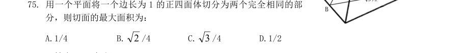

**76.** 某单位共有A、B、C 三个部门，三部门人员平均年龄分别为38 岁，24 岁，42 岁，A 和B 两部门人员平均年龄为30 岁，B 和C 两部门人员平均年龄为34 岁，该单位全体人员的平均年龄为多少岁？  `[2011·合卷·76]`
- A. 34
- B. 36
- C. 35
- D. 37

**77.** 同时打开游泳池的A、B 两个进水管，加满水需1 小时30 分钟，且A 管比B 管多进水180 立方米，若单独打开A 管，加满水需2 小时40 分钟，则B 管每分钟进水多少立方米？  `[2011·合卷·77]`
- A. 6
- B. 7
- C. 8
- D. 9

**78.** 某城市共有A、B、C、D、E 五个区，A 区人口是全市人口的5/17，B 区人口是A 区人口的2/5，C 区人口是D 区和E 区人口总数的5/8，A 区比C 区多3 万人，问全市共有多少万人？  `[2011·合卷·78]`
- A. 20.4
- B. 30.6
- C. 34.5
- D. 44.2

**79.** 某城市9 月平均气温为28.5 度，如当月最热日和最冷日的平均气温相差不超过10 度，则该月气温在30 度及以上的日子最多有多少天？  `[2011·合卷·79]`
- A. 24
- B. 25
- C. 26
- D. 27

**80.** 一个班的学生排队，如果排成3 人一排的队列，则比2 人一排的队列少8 排；如果排成4 人一排的队列，则比3 人一排的队列少5 排，这个班的学生如果按5 人一排来排队的话，队列有多少排？  `[2011·合卷·80]`
- A. 9
- B. 10
- C. 11
- D. 12

## 2012年 · （2015年前合卷）

**66.** 某市气象观测，今年第一、第二季度本市降水量分别比去年同期增加了11%和9%，而两个季度降水量的绝对增量刚好相同，那么今年上半年该市降水量同比增长了多少？  `[2012·合卷·66]`
- A. 9.5%
- B. 10%
- C. 9.9%
- D. 10.5%

**67.** 甲、乙二人协商共同投资，甲从乙处取了15000 元，并以两人名义进行了25000 元投资，但由于决策失误，只收回了10000 元，甲由于过失在己，原意主动承担2/3 的损失，问收回的投资中乙将分得多少钱？  `[2012·合卷·67]`
- A. 1 万
- B. 9 千
- C. 6 千
- D. 5 千

**68.** 有300 名求职者参加高端人才专场招聘会，其中软件设计类、市场营销类、财务管理类和人力资源类分别有100、80、70、50 人，问至少有多少人找到工作才能保证一定有70 名找到工作的人专业相同？  `[2012·合卷·68]`
- A. 71
- B. 119
- C. 258
- D. 277

**69.** 某儿童艺术培训中心有5 名钢琴教师和6 名拉丁舞教师，培训中心将所有的钢琴学员和拉丁舞学员共76 人分别平均地分给各个老师带领，刚好能够分配完，且每位老师所带的学生数量都是质数。后来由于学生人数减少，培训中心只保留了4 名钢琴教师和3 名拉丁舞教师，但每名教师所带的学生数量不变，那么目前培训中心还剩下多少学员？  `[2012·合卷·69]`
- A. 36
- B. 37
- C. 39
- D. 41

**70.** 一只装有动力桨的船，其单靠人工划船顺流而下的速度是水流速度的3 倍。现该船靠人工划动从a 地顺流到达b 地，原路返回时只开足动力桨行驶，用时比来时少2/5，问船在静水中开足动力桨行驶的速度是人工划桨的速度的多少倍？  `[2012·合卷·70]`
- A. 2
- B. 3
- C. 4
- D. 5

**71.** 有5 对夫妻参加一场婚礼，他们被安排在一张10 个座位的圆桌就餐，但是婚礼操办者不知道他们之间的关系，只是随机安排座位。问5 对夫妻恰好相邻而坐的概率是多少？  `[2012·合卷·71]`
- A. 在1‰到5‰之间
- B. 在5‰到1%之间
- C. 超过1%
- D. 不超过1‰

**72.** 2010 年某种货物的进价为15 元/公斤，2011 年该货物的进口量增加了一半，进口金额增加了20%，问2011 年该货物的进口价格是每公斤多少元？  `[2012·合卷·72]`
- A. 10
- B. 12
- C. 18
- D. 24

**73.** 三位专家为10 幅作品投票，每位专家分别投出5 票，并且每幅作品都有专家投票。如果三位专家都投票的作品列为A 等，两位专家投票的作品列为B 等，仅有一位专家投票的作品列为C 等，则下面说法正确的是：  `[2012·合卷·73]`
- A. A 等和B 等共6 幅
- B. B 等和C 等共7 幅
- C. A 等最多有5 幅
- D. A 等比C 等少5 幅

**74.** 为了浇灌一个半径为10 米的花坛，园艺师要在花坛布置若干个旋转喷头，但库房里只有浇灌半径为5 米的喷头，问花坛里至少要布置几个这样的喷头才能保证每个角落都能浇灌到？  `[2012·合卷·74]`
- A. 4
- B. 7
- C. 6
- D. 9

**75.** 甲、乙两人计划从A 地步行去B 地，乙早上7：00 出发，匀速步行前往，甲因事耽误，9：00 才出发。为了追上乙，甲决定跑步前进，跑步的速度是乙步行速度的2.5 倍，但每跑半小时都需要休息半小时。问甲什么时候才能追上乙？  `[2012·合卷·75]`
- A. 10：20
- B. 12：10
- C. 14：30
- D. 16：10

**76.** 某项工程由A、B、C 三个工程队负责施工，他们将工程总量等额分成了三份同时开始施工。当A队完成了自己任务的90%时，B 队完成了自己任务的一半，C 队完成了B 队已完成任务量的80%，此时A队派出2/3 的人力加入C 队工作，问A 队和C 队都完成任务时，B 队完成了其自身任务的比例是多少？  `[2012·合卷·76]`
- A. 80%
- B. 90%
- C. 60%
- D. 100%

**77.** 99 个苹果装进两种包装盒，大包装盒每盒装12 个苹果，小包装盒每盒装5 个苹果，共用了十多个盒子刚好装完。问两种包装盒相差多少个？  `[2012·合卷·77]`
- A. 3
- B. 4
- C. 7
- D. 13

**78.** 对9 名缝纫工进行技术评比，9 名工人的得分恰好成等差数列，9 人的平均得分是86 分，前5名工人的得分之和是460 分，那么前7 名工人的得分之和是多少？  `[2012·合卷·78]`
- A. 602
- B. 623
- C. 627
- D. 631

**79.** 草地上插了若干根旗杆，已知旗杆的高度在1 至5 米之间，且任意两根旗杆的距离都不超过它们高度差的10 倍。如果用一根绳子将所有的旗杆都围进去，在不知旗杆的数量和位置的情况下，最少需要准备多少米长的绳子？  `[2012·合卷·79]`
- A. 40
- B. 60
- C. 80
- D. 100

**80.** 连接正方体每个面的中心构成一个正八面体（如下图所示）。已知正方体的边长为6 厘米，问正八面体的体积为多少立方厘米？  `[2012·合卷·80]`
- A. 18
- B. 24
- C. 36
- D. 72

## 2013年 · （2015年前合卷）

**61.** 某单位2011 年招聘了65 名毕业生，拟分配到该单位的7 个不同部门。假设行政部门分得的毕业生人数比其他部门都多，问行政部门分得的毕业生人数至少为多少名？  `[2013·合卷·61]`
- A. 10
- B. 11
- C. 12
- D. 13

**62.** 阳光下，电线杆的影子投射到墙面及地面上，其中墙面部分的高度为1 米，地面部分的长度为7米。某甲身高1.8 米，同一时刻在地面形成的影子长0.9 米。问该电线杆的高度为：  `[2013·合卷·62]`
- A. 12 米
- B. 14 米
- C. 15 米
- D. 16 米

**63.** 甲和乙进行打靶比赛，各打两发子单，中靶数量多的人获胜。甲每发子弹中靶的概率是60%，乙每发子弹中靶的概率是30%。问该比赛中乙战胜甲的可能性：  `[2013·合卷·63]`
- A. 小于5%
- B. 在5%～10%之间
- C. 在10%～15%之间
- D. 大于15%

**64.** 某汽车厂商生产甲、乙、丙三种车型，其中乙型产量的3 倍与丙型产量的6 倍之和等于甲型产量的4 倍，甲型产量与乙型产量的2 倍之和等于丙型产量7 倍。问甲、乙、丙三种车型的产量之比为：  `[2013·合卷·64]`
- A. 5︰4︰3
- B. 4︰3︰2
- C. 4︰2︰1
- D. 3︰2︰1

**65.** 某种汉堡每个成本4.5 元，售价10.5 元，当天卖不完的汉堡即不再出售。在过去的十天里，餐厅每天都会准备200 个汉堡，其中有六天正好卖完，四天各剩余25 个，问这十天该餐厅卖汉堡共赚了多少元？  `[2013·合卷·65]`
- A. 10850
- B. 10950
- C. 11050
- D. 11350

**66.** 某单位组织党员参加党史、党风廉政建设、科学发展观和业务能力四项培训，要求每名党员参加且只参加其中的两项。无论如何安排，都有至少5 名党员参加的培训完全相同。问该单位至少有多少名党员？  `[2013·合卷·66]`
- A. 17
- B. 21
- C. 25
- D. 29

**67.** 某人银行账户今年底余额减去1500 元后，正好比去年底余额减少了25%，去年底余额比前年底余额的120%少2000 元。问此人银行账户今年底余额一定比前年底余额：  `[2013·合卷·67]`
- A. 少10%
- B. 多10%
- C. 少1000 元
- D. 多1000 元

**68.** 某河段中的沉积河沙可供80 人连续开采6 个月或60 人连续开采10 个月。如果要保证该河段河沙不被开采枯竭，问最多可供多少人进行连续不间断的开采？（假设该河段河沙沉积的速度相对稳定）  `[2013·合卷·68]`
- A. 25
- B. 30
- C. 35
- D. 40

**69.** 书架的某一层上有136 本书，且是按照“3 本小说、4 本教材、5 本工具书、7 本科技书、3 本小说、4 本教材……”的顺序循环从左至右排列的。问该层最右边的一本是什么书？  `[2013·合卷·69]`
- A. 小说
- B. 教材
- C. 工具书
- D. 科技树

**70.** 根据国务院办公厅节假日安排的通知，某年8 月份有22 个工作日，那么当年的8 月1 日可能是：  `[2013·合卷·70]`
- A. 周一或周三
- B. 周三或周日
- C. 周一或周四
- D. 周四或周日

**71.** 公路上有三辆同向行驶的汽车，其中甲车的时速为63 公里，乙、丙两车的时速均为60 公里，但由于水箱故障，丙车每连续行驶30 分钟后必须停车休息2 分钟，早上十点，三车到达同一位置。问1小时后，甲、丙两车最多相距多少公里？  `[2013·合卷·71]`
- A. 5
- B. 7
- C. 9
- D. 11

**72.** 某市园林部门计划对市区内30 处绿化带进行补栽，每处绿化带补栽方案可从甲、乙两种方案中任选一种方案进行。甲方案补栽阔叶树80 株，针叶树40 株；乙方案补栽阔叶树50 株，针叶树90 株。现有阔叶树苗2070 株，针叶树苗1800 株，为最大限度利用这批树苗，甲、乙两种方案应各选：  `[2013·合卷·72]`
- A. 甲方案19 个、乙方案11 个
- B. 甲方案20 个、乙方案10 个
- C. 甲方案17 个、乙方案13 个
- D. 甲方案18 个、乙方案12 个

**73.** 两个派出所某月内共受理案件160 起，其中甲派出所受理的案件中有17%是刑事案件，乙派出所受理的案件中有20%是刑事案件，问乙派出所在这个月中共受理多少起非刑事案件？  `[2013·合卷·73]`
- A. 48
- B. 60
- C. 72
- D. 96

**74.** 小王参加了五门百分制的测验，每门成绩都是整数。其中语文94 分，数学的得分最高，外语的得分等于语文和物理的平均分，物理的得分等于五门的平均分，化学的得分比外语多2 分，并且是五门中第二高的得分。问小王的物理考了多少分？  `[2013·合卷·74]`
- A. 94
- B. 95
- C. 96
- D. 97

**75.** 若干个相同的立方体摆在一起，前后左右的视图都是一样的（如右图）。问这堆立方体最少有多少个正方体？  `[2013·合卷·75]`
- A. 4
- B. 6
- C. 10
- D. 8

## 2014年 · （2015年前合卷）

**61.** 老王两年前投资的一套艺术品市价上涨了50%，为尽快出手，老王将该艺术品按市价的八折出售，扣除成交价5%的交易费用后，发现与买进时相比赚了7 万元。问老王买进该艺术品花了多少万元？  `[2014·合卷·61]`
- A. 42
- B. 50
- C. 84
- D. 100

**62.** 烧杯中装了100 克浓度为10%的盐水。每次向该烧杯中加入不超过14 克浓度为50%的盐水。问最少加多少次之后，烧杯中的盐水浓度能达到25%？（假设烧杯中盐水不会溢出）  `[2014·合卷·62]`
- A. 6
- B. 5
- C. 4
- D. 3

**63.** 某连锁企业在10 个城市共有100 家专卖店，每个城市的专卖店数量都不同。如果专卖店数量排名第5 多的城市有12 家专卖店，那么专卖店数量排名最后的城市，最多有几家专卖店？  `[2014·合卷·63]`
- A. 2
- B. 3
- C. 4
- D. 5

**64.** 30 个人围坐在一起轮流表演节目，他们按顺序从1 到3 依次不重复地报数，数到3 的人出来表演节目，并且表演过的人不再参加报数，那么在仅剩1 个人没有表演过节目的时候，共报数多少人次？  `[2014·合卷·64]`
- A. 77
- B. 57
- C. 117
- D. 87

**65.** 搬运工负重徒步上楼，刚开始保持匀速，用了30 秒爬了两层楼（中间不休息）；之后每多爬一层多花5 秒，多休息10 秒，那么他爬到七楼一共用了多少秒？  `[2014·合卷·65]`
- A. 220
- B. 240
- C. 180
- D. 200

**66.** 某单位原有45 名职工，从下级单位调入5 名党员职工后，该单位的党员人数占总人数的比重上升了6 个百分点，如果该单位又有2 名职工入党，那么该单位现在的党员人数占总人数的比重为多少？  `[2014·合卷·66]`
- A. 40%
- B. 50%
- C. 60%
- D. 70%

**67.** 一个立方体随意翻动，每次翻动朝上一面的颜色与翻动前都不同，那么这个立方体的颜色至少有几种？  `[2014·合卷·67]`
- A. 3
- B. 4
- C. 5
- D. 6

**68.** 工厂组织职工参加周末公益劳动，有80%的职工报名参加。其中报名参加周六活动的人数与报名参加周日活动的人数比为2∶1，两天的活动都报名参加的人数为只报名参加周日活动的人数的50%。问未报名参加活动的人数是只报名参加周六活动的人数的：  `[2014·合卷·68]`
- A. 20%
- B. 30%
- C. 40%
- D. 50%

**69.** 某单位某用1～12 日安排甲、乙、丙三人值夜班，每人值班4 天。三个人各自值班日期数字之和相等。已知甲头两天值夜班，乙9、10 日值夜班，问丙在自己第一天与最后一天值夜班之间，最多有几天不用值夜班？  `[2014·合卷·69]`
- A. 0
- B. 2
- C. 4
- D. 6

**70.** 8 位大学生打算合资创业。在筹资阶段，有2 名同学决定考研而退出，使得剩余同学每人需要再多筹资1 万元；等到去注册时，又有2 名同学因找到合适工作而退出，那么剩下的同学每人又得再多筹资几万元？  `[2014·合卷·70]`
- A. 1
- B. 2
- C. 3
- D. 4

**71.** 一次会议某单位邀请了10 名专家。该单位预定了10 个房间，其中一层5 间，二层5 间。已知专家中有4 人要求住二层，3 人要求住一层，其余人住任一层均可。如果要满足他们的住宿要求并且每人1 间，问有多少种不同的安排方案？  `[2014·合卷·71]`
- A. 75
- B. 450
- C. 7200
- D. 43200

**72.** 某羽毛球赛共有23 支队伍报名参赛、赛事安排23 支队伍抽签两两争夺下一轮的出线权，没有抽到对手的队伍轮空，直接进入下一轮。那么，本次羽毛球赛最后共会遇到多少次轮空的情况？  `[2014·合卷·72]`
- A. 1
- B. 2
- C. 3
- D. 4

**73.** 甲、乙两个工程队共同完成A 和B 两个项目，已知甲队单独完成A 项目需13 天，单独完成B 项目需7 天；乙队单独完成A 项目需11 天，单独完成B 项目需9 天。如果两队合作用最短的时间完成两个项目，则最后一天两队需要共同工作多少时间就可以完成任务？  `[2014·合卷·73]`
- A. 1/12 天
- B. 1/9 天
- C. 1/7 天
- D. 1/6 天

**74.** 甲、乙两同学需托运行李，托运收费标准为10 公斤以下6 元/公斤，超出10 公斤部分每公斤收费标准略低一些。已知甲、乙两人的托运费分别为109.5 元、78 元，甲的行李比乙的重50%。那么，超出10 公斤部分每公斤收费标准比10 公斤以内的低了多少元？  `[2014·合卷·74]`
- A. 1.5 元
- B. 2.5 元
- C. 3.5 元
- D. 4.5 元

**75.** 小王、小李、小张和小周4 人共为某希望小学捐赠了25 个书包，按照数量多少的顺序分别为小王、小李、小张、小周。已知小王捐赠的书包数量是小李和小张捐赠书包的数量之和，小李捐赠的书包数量是小张和小周捐赠的书包数量之和。问小王捐赠了多少书包？  `[2014·合卷·75]`
- A. 9
- B. 10
- C. 11
- D. 12

## 2015年 · 副省级

**61.** 某单位有50 人，男女性别比为3︰2，其中有15 人未入党，如从中任选1 人，则此人为男性党员的概率最大为多少？  `[2015·副省·61]`
- A. 3/5
- B. 2/3
- C. 3/4
- D. 5/7

**62.** 某技校安排本届所有毕业生分别去甲、乙、丙3 个不同的工厂实习。去甲厂实习的毕业生占毕业生总数的32%，去乙厂实习的毕业生比甲厂少6 人，且占毕业生总数的24%。问去丙厂实习的人数比去甲厂实习的人数：  `[2015·副省·62]`
- A. 少9 人
- B. 多9 人
- C. 少6 人
- D. 多6 人

**63.** 某农场有36 台收割机，要收割完所有的麦子需要14 天时间，现收割了7 天后增加4 台收割机，并通过技术改造使每台机器的效率提升5%，问收割完所有的麦子还需要几天？  `[2015·副省·63]`
- A. 3
- B. 4
- C. 5
- D. 6

**64.** 小李的弟弟比小李小2 岁，小王的哥哥比小王大2 岁、比小李大5 岁。1994 年，小李的弟弟和小王的年龄之和为15。问2014 年小李与小王的年龄分别为多少岁？  `[2015·副省·64]`
- A. 25，32
- B. 27，30
- C. 30，27
- D. 32，25

**65.** 某企业调查用户从网络获取信息的习惯，问卷回收率为90%，调查对象中有179 人使用搜索引擎获取信息，146 人从官方网站获取信息，246 人从社交网站获取信息，同时使用这三种方式的有115人，使用其中两种的有24 人，另有52 人这三种方式都不使用，问这次调查共发出了多少份问卷？  `[2015·副省·65]`
- A. 310
- B. 360
- C. 390
- D. 410

**66.** 某学校准备重新粉刷国旗旗台，该旗台由两个正方体上下叠加而成，边长分别为1 米和2 米，问需要粉刷的面积为：  `[2015·副省·66]`
- A. A30 平方米
- B. 29 平方米
- C. 26 平方米
- D. 24 平方米

**67.** 把12 棵同样的松树和6 棵同样的柏树种植在道路两侧，每侧种植9 棵，要求每侧的柏树数量相等且不相邻，且道路起点和终点处两侧种植的都必须是松树。问有多少种不同的种植方法？  `[2015·副省·67]`
- A. 36
- B. 50
- C. 100
- D. 400

**68.** 餐厅需要使用9 升食用油，现在库房里库存有15 桶5 升装的，3 桶2 升装的，8 桶1 升装的。问库房有多少种发货方式，能保证正好发出餐厅需要的9 升食用油？  `[2015·副省·68]`
- A. 4
- B. 5
- C. 6
- D. 7

**69.** 网管员小刘负责甲、乙、丙三个机房的巡检工作，甲、乙、丙机房分别需要每隔2 天、4 天和7 天巡检一次。3 月1 日，小刘巡检了3 个机房，问他整个3 月有几天不用做机房的巡检工作？  `[2015·副省·69]`
- A. 12
- B. 13
- C. 14
- D. 15

**70.** 甲、乙、丙、丁四个人分别住在宾馆1211、1213、1215、1217 和1219 这五间相邻的客房中的四间里，而另外一间客房空着。已知甲和乙两人的客房中间隔了其他两间客房，乙和丙的客房号之和是四个人里任意二人的房号和之中最大的，丁的客房与甲相邻且不与乙、丙相邻。则以下哪间客房可能是空着的？  `[2015·副省·70]`
- A. 1213
- B. 1211
- C. 1219
- D. 1217

**71.** 甲、乙、丙、丁四人共同投资一个项目，已知甲的投资额比乙、丙二人的投资额之和高20%，丙的投资是丁的60%，总投资额比项目的需求资金高1/3。后来丁因故临时撤资，剩下三人的投资额之和比项目的需求资金低1/12，则乙的投资额是项目资金需求的：  `[2015·副省·71]`
- A. 1/6
- B. 1/5
- C. 1/4
- D. 1/3

**72.** 现要在一块长25 公里，宽8 公里的长方形区域内设置哨塔，每个哨塔的监视半径为5 公里。如果要求整个区域内的每个角落都能被监视到，则至少需要设置多少个哨塔？  `[2015·副省·72]`
- A. 7
- B. 6
- C. 5
- D. 4

**73.** 甲、乙两名运动员在400 米的环形跑道上练习跑步，甲出发1 分钟后乙同向出发，乙出发2 分钟后第一次追上甲，又过了8 分钟，乙第二次追上甲，此时乙比甲多跑了250 米。问两人的出发地相隔多少米？  `[2015·副省·73]`
- A. 200
- B. 150
- C. 100
- D. 50

**74.** 某单位有3 项业务招标，共有5 家公司前来投标，且每家公司都对3 项业务发出了投标申请，最终发现每项业务都有且只有1 家公司中标。如果5 家公司在各项业务中中标的概率均相等，问这3 项业务由同一家公司中标的概率为多少？  `[2015·副省·74]`
- A. 1/25
- B. 1/81
- C. 1/125
- D. 1/243

**75.** 某学校组织学生春游，往返目的地时租用可乘坐10 名乘客的面包车，每辆面包车往返的租金为250元。此外，每名学生的景点和午餐费用为40 元。如果要求尽可能少租车，则以下哪个图形最能反映平均每名学生的春游费用支出与参加人数之间的关系？  `[2015·副省·75]`
> （本题选项为图片，请配合原始PDF查看）

## 2015年 · 地市级

**61.** 某单位有50人，男女性别比为3:2，其中有15人未入党，若从中任选1人，则此人为男性党员的概率最大为多少：  `[2015·地市·61]`
- A. 3/5
- B. 2/3
- C. 3/4
- D. 5/7

**62.** 某技校安排本届所有毕业生分别去甲、乙、丙三个不同的工厂实习。去甲厂实习的毕业生占毕业生总数的，去乙厂实习的毕业生比甲厂少6人，且占毕业生总数的。问去丙厂实习的人数比去甲厂实习的人数：  `[2015·地市·62]`
- A. 少9人
- B. 多9人
- C. 少6人
- D. 多6人

**63.** 某农场有36台收割机，要收割完所有的麦子需要14天时间。现收割了7天后增加4台收割机，并通过技术改造使每台机器的效率提升，问收割完所有的麦子还需要几天。  `[2015·地市·63]`
- A. 3
- B. 4
- C. 5
- D. 6

**64.** 小李的弟弟比小李小2岁，小王的哥哥比小王大2岁、比小李大5岁。1994年，小李的弟弟和小王的年龄之和为15。问2014年小李与小王的年龄分别为多少岁：  `[2015·地市·64]`
- A. 25，32
- B. 27，30
- C. 30，27
- D. 32，25

**65.** 某企业调查用户从网络获取信息的习惯，问卷回收率为90%，调查对象中有179人使用搜索引擎获取信息，146人从官方网站获取信息，246人从社交网站获取信息，同时使用这三种方式的有115人，使用其中两种的有24人，另有52人这三种方式都不使用，问这次调查共发出了多少份问卷：  `[2015·地市·65]`
- A. 310
- B. 360
- C. 390
- D. 410

**66.** 某学校准备重新粉刷升国旗的旗台，该旗台由两个正方体上下叠加而成，边长分别为1米和2米，问需要粉刷的面积为：  `[2015·地市·66]`
- A. 30平方米
- B. 29平方米
- C. 26平方米
- D. 24平方米

**67.** 把12棵同样的松树和6棵同样的柏树种植在道路两侧，每侧种植9棵，要求每侧的柏树数量相等且不相邻，且道路起点和终点处两侧种植的都必须是松树。问有多少种不同的种植方法：  `[2015·地市·67]`
- A. 36
- B. 50
- C. 100
- D. 400

**68.** 餐厅需要使用9升食用油，现在库房里库存有15桶5升装的，3桶2升装的，8桶1升装的。问库房有多少种发货方式，能保证正好发出餐厅需要的9升食用油：  `[2015·地市·68]`
- A. 4
- B. 5
- C. 6
- D. 7

**69.** 现要在一块长25公里、宽8公里的长方形区域内设置哨塔，每个哨塔的监视半径为5公里。如果要求整个区域内的每个角落都能被监视到，则至少需要设置多少个哨塔：  `[2015·地市·69]`
- A. 7
- B. 6
- C. 5
- D. 4

**70.** 甲、乙、丙、丁四人共同投资一个项目，已知甲的投资额比乙、丙二人的投资额之和高20%，丙的投资额是丁的3/5，总投资额比项目的资金需求高1/3。后来丁因故临时撤资，剩下三人的投资额之和比项目的资金需求低1/12。则乙的投资额是项目资金需求的：  `[2015·地市·70]`
- A. 1/6
- B. 1/5
- C. 1/4
- D. 1/3

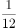

## 2016年 · 副省级

**61.** 某单位组建兴趣小组，每人选择―项参加。羽毛球组人数是乒乓球组人数的2倍，足球组人数是篮球组人数的3倍，乒乓球组人数的4倍与其他3个组人数的和相等。则羽毛球组人数等于：  `[2016·副省·61]`
- A. 足球组人数与篮球组人数之和
- B. 乒乓球组人数与足球组人数之和
- C. 足球组人数的1.5倍
- D. 篮球组人数的3倍

**62.** 某新建小区计划在小区主干道两侧种植银杏树和梧桐树绿化环境，一侧每隔3棵银杏树种一棵梧桐树，另一侧每隔4棵梧桐树种1棵银杏树，最终两侧各种植了35棵树，问最多栽种了多少棵银杏树？  `[2016·副省·62]`
- A. 33
- B. 34
- C. 36
- D. 37

**63.** 20人乘飞机从甲市前往乙市，总费用为27000元。每张机票的全价票单价为2000元，除全价票之外，该班飞机还有九折票和五折票两种选择。每位旅客的机票总费用除机票价格之外，还包括170元的税费。则购买九折票的乘客与购买全价票的乘客人数相比为（）。  `[2016·副省·63]`
- A. 两者一样多
- B. 买九折票的多1人
- C. 买全价票的多2人
- D. 买九折票的多4人

**64.** 某电器工作功耗为370瓦，待机状态下功耗为37瓦，该电器周一从9:30到17:00处于工作状态，其余时间断电。周二从9:00到24:00处于待机状态，其余时间断电。问其周―的耗电量是周二的多少倍？  `[2016·副省·64]`
- A. 10
- B. 6
- C. 8
- D. 5

**65.** 某浇水装置可根据天气阴晴调节浇水量，晴天浇水量为阴雨天的2.5倍。灌满该装置的水箱后，在连续晴天的情况下可为植物自动浇水18天。小李6月1日0：00灌满水箱后，7月1日0：00正好用完。问6月有多少个阴雨天？  `[2016·副省·65]`
- A. 10
- B. 16
- C. 18
- D. 20

**66.** 某政府机关内甲、乙两部门通过门户网站定期向社会发布消息，甲部门每隔两天、乙部门每隔3天有―个发布日，节假日无休。问甲、乙两部门在一个自然月内最多有几天同时为发布日？  `[2016·副省·66]`
- A. 5
- B. 2
- C. 6
- D. 3

**67.** A地到B地的道路是下坡路。小周早上6:00从A地出发匀速骑车前往B地，7:00时到达两地正中间的C地。到达B地后，小周立即匀速骑车返回，在10:00时又途经C地。此后小周的速度在此前速度的基础上增加1米／秒。最后在11：30回到A地。问A、B两地间的距离在以下哪个范围内？  `[2016·副省·67]`
- A. 40～50公里
- B. 大于50公里
- C. 小于30公里
- D. 30～40公里

**68.** 某集团三个分公司共同举行技能大赛，其中成绩靠前的X人获奖。如获奖人数最多的分公司获奖的人数为Y，问以下哪个图形能反映Y的上、下限分别与X的关系？  `[2016·副省·68]`
- A. A
- B. B
- C. C
- D. D

**69.** 为加强机关文化建设，某市直属机关在系统内举办演讲比赛，3个部门分别派出3、2、4名选手参加比赛，要求每个部门的参赛选手比赛顺序必须相连，问不同参赛顺序的种数在以下哪个范围之内？  `[2016·副省·69]`
- A. 小于1000
- B. 1000～5000
- C. 5001～20000
- D. 大于20000

**70.** 李主任在早上8点30分上班之后参加了一个会议，会议开始时发现其手表的时针和分针呈120度角，而上午会议结束时发现手表的时针和分针呈180度角。问在该会议举行的过程中，李主任的手表时针与分针呈90度角的情况最多可能出现几次？  `[2016·副省·70]`
- A. 4
- B. 5
- C. 6
- D. 7

**71.** 有一位百岁老人出生于二十世纪，2015年他的年龄各数字之和正好是他在2012年的年龄的各数字之和的三分之一，问该老人出生的年份各数字之和是多少（出生当年算作0岁）？  `[2016·副省·71]`
- A. 14
- B. 15
- C. 16
- D. 17

**72.** 某集团有A和B两个公司，A公司全年的销售任务是B公司的1.2倍。前三季度B公司的销售业绩是A公司的1.2倍，如果照前三季度的平均销售业绩，B公司到年底正好能完成销售任务。问如果A公司希望完成全年的销售任务，第四季度的销售业绩需要达到前三季度平均销售业绩的多少倍？  `[2016·副省·72]`
- A. 1.44
- B. 2.4
- C. 2.76
- D. 3.88

**73.** 某出版社新招了10名英文、法文和日文方向的外文编辑，其中既会英文又会日文的小李是唯一掌握一种以上外语的人。在这10人中，会法文的比会英文的多4人，是会日文人数的两倍。问只会英文的有几人？  `[2016·副省·73]`
- A. 2
- B. 0
- C. 3
- D. 1

**74.** 某单位原有几十名职员，其中有14名女性。当两名女职员调出该单位后,女职员比重下降了3个百分点。现在该单位需要随机选派两名职员参加培训，问选派的两人都是女职员的概率在以下哪个范围内？  `[2016·副省·74]`
- A. 小于1%
- B. 1%～4%
- C. 4%～7%
- D. 7%～10%

**75.** 将一个8厘米× 8厘米× 1厘米的白色长方体木块的外表面涂上黑色颜料，然后将其切成64个棱长1厘米的小正方体，再用这些小正方体堆成棱长4厘米的大正方体，且使黑色的面向外露的面积要尽量大，问大正方体的表面上有多少平方厘米是黑色的?（）  `[2016·副省·75]`
- A. 84
- B. 88
- C. 92
- D. 96

## 2016年 · 地市级

**61.** 某电器工作功耗为370瓦，待机状态下功耗为37瓦，该电器周一从9:30到17:00处于工作状态，其余时间断电。周二从9:00到24:00处于待机状态，其余时间断电。问其周―的耗电量是周二的多少倍？  `[2016·地市·61]`
- A. 10
- B. 6
- C. 8
- D. 5

**62.** 某单位组建兴趣小组，每人选择―项参加。羽毛球组人数是乒乓球组人数的2倍，足球组人数是篮球组人数的3倍，乒乓球组人数的4倍与其他3个组人数的和相等。则羽毛球组人数等于：  `[2016·地市·62]`
- A. 足球组人数与篮球组人数之和
- B. 乒乓球组人数与足球组人数之和
- C. 足球组人数的1.5倍
- D. 篮球组人数的3倍

**63.** 某政府机关内甲、乙两部门通过门户网站定期向社会发布消息，甲部门每隔两天、乙部门每隔3天有―个发布日，节假日无休。问甲、乙两部门在一个自然月内最多有几天同时为发布日？  `[2016·地市·63]`
- A. 5
- B. 2
- C. 6
- D. 3

**64.** 某新建小区计划在小区主干道两侧种植银杏树和梧桐树绿化环境，一侧每隔3棵银杏树种一棵梧桐树，另一侧每隔4棵梧桐树种1棵银杏树，最终两侧各种植了35棵树，问最多栽种了多少棵银杏树？  `[2016·地市·64]`
- A. 33
- B. 34
- C. 36
- D. 37

**65.** 某集团三个分公司共同举行技能大赛，其中成绩靠前的X人获奖。如获奖人数最多的分公司获奖的人数为Y，问以下哪个图形能反映Y的上、下限分别与X的关系？  `[2016·地市·65]`
- A. A
- B. B
- C. C
- D. D

**66.** 李主任在早上8点30分上班之后参加了一个会议，会议开始时发现其手表的时针和分针呈120度角，而上午会议结束时发现手表的时针和分针呈180度角。问在该会议举行的过程中，李主任的手表时针与分针呈90度角的情况最多可能出现几次？  `[2016·地市·66]`
- A. 4
- B. 5
- C. 6
- D. 7

**67.** 为加强机关文化建设，某市直属机关在系统内举办演讲比赛，3个部门分别派出3、2、4名选手参加比赛，要求每个部门的参赛选手比赛顺序必须相连，问不同参赛顺序的种数在以下哪个范围之内？  `[2016·地市·67]`
- A. 小于1000
- B. 1000～5000
- C. 5001～20000
- D. 大于20000

**68.** A地到B地的道路是下坡路。小周早上6:00从A地出发匀速骑车前往B地，7:00时到达两地正中间的C地。到达B地后，小周立即匀速骑车返回，在10:00时又途经C地。此后小周的速度在此前速度的基础上增加1米／秒。最后在11：30回到A地。问A、B两地间的距离在以下哪个范围内？  `[2016·地市·68]`
- A. 40～50公里
- B. 大于50公里
- C. 小于30公里
- D. 30～40公里

**69.** 某集团有A和B两个公司，A公司全年的销售任务是B公司的1.2倍。前三季度B公司的销售业绩是A公司的1.2倍，如果照前三季度的平均销售业绩，B公司到年底正好能完成销售任务。问如果A公司希望完成全年的销售任务，第四季度的销售业绩需要达到前三季度平均销售业绩的多少倍？  `[2016·地市·69]`
- A. 1.44
- B. 2.4
- C. 2.76
- D. 3.88

**70.** 某单位原有几十名职员，其中有14名女性。当两名女职员调出该单位后,女职员比重下降了3个百分点。现在该单位需要随机选派两名职员参加培训，问选派的两人都是女职员的概率在以下哪个范围内？  `[2016·地市·70]`
- A. 小于1%
- B. 1%～4%
- C. 4%～7%
- D. 7%～10%

## 2017年 · 副省级

**61.** 面包房购买一包售价为的白糖，取其中的一部分加水溶解形成浓度为的糖水12千克，然后将剩余的白糖全部加入后溶解，糖水浓度变为，问购买白糖花了多少元钱？  `[2017·副省·61]`
- A. 45
- B. 48
- C. 36
- D. 42

**62.** 某人出生于20世纪70年代，某年他发现从当年起连续10年自己的年龄均与当年年份数字之和相等（出生当年算0岁）。问他在以下哪一年时，年龄为9的整数倍？  `[2017·副省·62]`
- A. 2006年
- B. 2007年
- C. 2008年
- D. 2009年

**63.** 为维护办公环境，某办公室四人在工作日每天轮流打扫卫生，每周一打扫卫生的人给植物浇水。7月5日周五轮到小玲打扫卫生，下一次小玲给植物浇水是哪天？  `[2017·副省·63]`
- A. 7月15日
- B. 7月22日
- C. 7月29日
- D. 8月5日

**64.** 某超市购入每瓶200毫升和500毫升两种规格的沐浴露各若干箱，200毫升沐浴露每箱20瓶，500毫升沐浴露每箱12瓶。定价分别为和。货品卖完后，发现两种规格沐浴露的销售收入相同，那么这批沐浴露中，200毫升的最少有几箱？  `[2017·副省·64]`
- A. 3
- B. 8
- C. 10
- D. 15

**65.** 某次知识竞赛试卷包括3道每题10分的甲类题，2道每题20分的乙类题以及1道30分的丙类题。参赛者赵某随机选择其中的部分试题作答并全部答对，其最终得分为70分。问赵某未选择丙类题的概率为多少？  `[2017·副省·65]`
- A. 1/3
- B. 1/5
- C. 1/7
- D. 1/8

**66.** 某人租下一店面准备卖服装，房租每月1万元，重新装修花费10万元。从租下店面到开始营业花费3个月时间。开始营业后第一个月，扣除所有费用后的纯利润为3万元。如每月纯利润都比上月增加2000元而成本不变，问该店在租下店面后第几个月内收回投资？  `[2017·副省·66]`
- A. 7
- B. 8
- C. 9
- D. 10

**67.** 某抗洪指挥部的所有人员中，有的人在前线指挥抢险。由于汛情紧急，又增派6人前往，此时在前线指挥抢险的人数占总人数的。如该抗洪指挥部需要保留至少的人员在应急指挥中心，那么最多还能再增派多少人去前线？  `[2017·副省·67]`
- A. 8
- B. 9
- C. 10
- D. 11

**68.** 小张需要在5个长度分别为15秒、53秒、22秒、47秒和23秒的视频片段中选取若干个，合成为一个长度在80～90秒之间的宣传视频。如果每个片段均需完整使用且最多使用一次，并且片段间没有空闲时段，问他按照要求可能做出多少个不同的视频？  `[2017·副省·68]`
- A. 12
- B. 6
- C. 24
- D. 18

**69.** 一块种植花卉的矩形土地如图所示，AD边长是AB的2倍，E是CD的中点，甲、乙、丙、丁、戊区域分别种植白花、红花、黄花、紫花、白花。问种植白花的面积占矩形土地面积的：  `[2017·副省·69]`
- A. 3/4
- B. 2/3
- C. 7/12
- D. 1/2

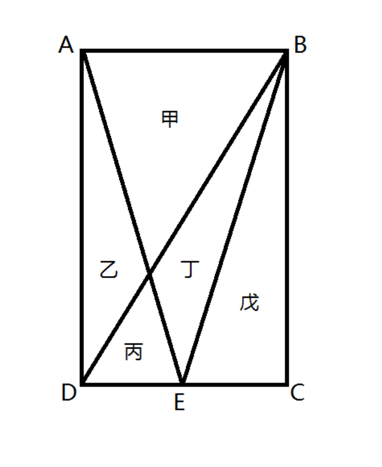

**70.** 某集团企业5个分公司分别派出1人去集团总部参加培训，培训后再将5人随机分配到这5个分公司，每个分公司只分配1人。问5个参加培训的人中，有且仅有1人在培训后返回原分公司的概率：  `[2017·副省·70]`
- A. 低于
- B. 在之间
- C. 在之间
- D. 大于

**71.** 某商铺甲乙两组员工利用包装礼品的边角料制作一批花朵装饰门店。甲组单独制作需要10小时，乙组单独制作需要15小时，现两组一起做，期间乙组休息了1小时40分，完成时甲组比乙组多做300朵。问这批花有多少朵？  `[2017·副省·71]`
- A. 600
- B. 900
- C. 1350
- D. 1500

**72.** 工厂有5条效率不同的生产线。某个生产项目如果任选3条生产线一起加工，最快需要6天整，最慢需要12天整；5条生产线一起加工，则需要5天整。问如果所有生产线的产能都扩大一倍，任选2条生产线一起加工最多需要多少天完成？  `[2017·副省·72]`
- A. 11
- B. 13
- C. 15
- D. 30

**73.** 一正三角形小路如右图所示，甲乙两人从A点同时出发，朝不同方向沿小路散步，已知甲的速度是乙的2倍。问以下哪个坐标图能准确描述两人之间的直线距离与时间的关系（横轴为时间，纵轴为直线距离）？  `[2017·副省·73]`
- A. A
- B. B
- C. C
- D. D

**74.** 将一个棱长为整数的正方体零件切掉一个角，截面是面积为的三角形，问其棱长最小为多少？  `[2017·副省·74]`
- A. 15
- B. 10
- C. 8
- D. 6

**75.** 某次军事演习中，一架无人机停在空中对三个地面目标点进行侦察。已知三个目标点在地面上的连线为直角三角形，两个点之间的最远距离为600米。问无人机与三个点同时保持500米距离时，其飞行高度为多少米？  `[2017·副省·75]`
- A. 500
- B. 600
- C. 300
- D. 400

## 2017年 · 地市级

**61.** 为维护办公环境，某办公室四人在工作日每天轮流打扫卫生，每周一打扫卫生的人给植物浇水。7月5 日周五轮到小玲打扫卫生。问下一次小玲给植物浇水是哪天？  `[2017·地市·61]`
- A. 7 月I5 日
- B. 7 月22 日
- C. 7 月29 日
- D. 8 月5 日

**62.** 某超市购入每瓶200 毫升和500 毫升两种规格的沐浴露各若干箱，200 毫升沐浴露每箱20 瓶、500毫升沐浴露每箱12 瓶，定价分别为14 元/瓶和25 元/瓶，货品卖完后，发现两种规格沐浴露的销售收入相同，那么这批沐浴露中，200 毫升的沐浴露最少有几箱？  `[2017·地市·62]`
- A. 3
- B. 8
- C. 10
- D. 15

**63.** 某人租下一店面准备卖服装，房租每月1 万元，重新装修花费10 万元。从租下店面到开始营业花费3 个月时间。开始营业后第一个月，扣除所有费用后的纯利润为3 万元。如每月纯利润都比上月增加2000 元而成本不变，问该店在租下店面后第几个月内收回投资？  `[2017·地市·63]`
- A. 7
- B. 8
- C. 9
- D. 1O

**64.** 某次知识竞赛试卷包括3 道每题10 分的甲类题，2 道每题20 分的乙类题以及l 道30 分的丙类题。参赛者赵某随机选择其中的部分试题作答并全部答对，其最终得分为70 分。问赵某未选择丙类题的概率为多少？  `[2017·地市·64]`
- A. 1/3
- B. 1/5
- C. 1/7
- D. 1/8

**65.** 某抗洪指挥部的所有人员中，有2/3 的人在前线指挥抢险。由于汛情紧急，又增派6 人前往，此时在前线指挥抢险的人数占总人数的75%。如该抗洪指挥部需要保留至少10%的人员在应急指挥中心，那么最多还能再增派多少人去前线？  `[2017·地市·65]`
- A. 11
- B. 10
- C. 9
- D. 8

**66.** 小张需要在5 个长度分别为15 秒、53 秒、22 秒、47 秒和23 秒的视频片段中选取若干个，合成为一个长度在80～90 秒之间的宣传视频。如果每个片段均需完整使用且最多使用一次，并且片段间没有空闲时段，问他按照要求可能做出多少个不同的视频？  `[2017·地市·66]`
- A. 24
- B. 18
- C. 12
- D. 6

**67.** 一块种植花卉的矩形土地如图所示，AD 边长是AB 的2 倍，E 是CD 的中点，甲、乙、丙、丁、戊区域分别种植白花、红花、黄花、紫花、白花。问种植白花的面积占矩形土地面积的：  `[2017·地市·67]`
- A. 3/4
- B. 2/3
- C. 7/12
- D. 1/2

**68.** 某商铺甲乙两组员工利用包装礼品的边角料制作一批花朵装饰门店。甲组单独制作需要10 小时，乙组单独制作需要15 小时，现两组一起做，期间乙组休息了1 小时40 分，完成时甲组比乙组多做300朵。问这批花有多少朵？  `[2017·地市·68]`
- A. 600
- B. 900
- C. 1350
- D. 1500

**69.** 一正三角形小路如下图所示，甲乙两人从A 点同时出发，朝不同方向沿小路散步，已知甲的速度是乙的2 倍。问以下哪个坐标图能准确描述两人之间的直线距离与时间的关系（横轴为时间，纵轴为直线距离）？ 【答案】。解析：正确选项是D。  `[2017·地市·69]`
> （本题选项为图片，请配合原始PDF查看）

**70.** 面包房购买一包售价为15 元/千克的白糖，取其中的一部分加水溶解形成浓度为20%的糖水12 千克，然后将剩余的白糖全部加入后溶解，糖水浓度变为25%，问购买白糖花了多少元钱？  `[2017·地市·70]`
- A. 45
- B. 48
- C. 36
- D. 42

## 2018年 · 副省级

**61.** 甲商店购入400 件同款夏装。7 月以进价的1.6 倍出售，共售出200 件；8 月以进价的1.3 倍出售，共售出100 件；9 月以进价的0.7 倍将剩余的100 件全部售出，总共获利15000 元。则这批夏装的单件进价为多少元？  `[2018·副省·61]`
- A. 125
- B. 144
- C. 100
- D. 120

**62.** 某单位的会议室有5 排共40 个座位，每排座位数相同。小张和小李随机入座，则他们坐在同一排的概率：  `[2018·副省·62]`
- A. 不高于15%
- B. 高于15%但低于20%
- C. 正好为20%
- D. 高于20%

**63.** 企业某次培训的员工中有369 名来自A 部门，412 名来自B 部门。现分批对所有人进行培训，要求每批人数相同且批次尽可能少。如果有且仅有一批培训对象同时包含来自A 和B 部门的员工，那么该批中有多少人来自B 部门？  `[2018·副省·63]`
- A. 14
- B. 32
- C. 57
- D. 65

**64.** 将一块长24 厘米、宽16 厘米的木板分割成一个正方形和两个相同的圆形，其余部分弃去不用。在弃去不用的部分面积最小的情况下，圆的半径为多少厘米？  `[2018·副省·64]`
- A. 3
- B. 2
- C. 8
- D. 4

**65.** 企业花费600 万元升级生产线，升级后能耗费用降低了10%，人工成本降低了30%。如每天的产量不变，预计在400 个工作日后收回成本。若升级前人工成本为能耗费用的3 倍，则升级后每天的人工成本比能耗费用高多少万元？  `[2018·副省·65]`
- A. 1.2
- B. 1.5
- C. 1.8
- D. 2.4

**66.** 工程队接到一项工程，投入80 台挖掘机。如连续施工30 天，每天工作10 小时，正好按期完成。但施工过程中遭遇大暴雨，有10 天时间无法施工。工期还剩8 天时，工程队增派70 台挖掘机并加班施工。若工程队想按期完成，则平均每天需多工作多少个小时？  `[2018·副省·66]`
- A. 1.5
- B. 2
- C. 2.5
- D. 3

**67.** 枣园每年产枣2500 公斤，每公斤固定盈利18 元。为了提高土地利用率，现决定明年在枣树下种植紫薯（产量最大为10000 公斤），每公斤固定盈利3 元。当紫薯产量大于400 公斤时，其产量每增加n 公斤将导致枣的产量下降0.2n 公斤。则该枣园明年最多可能盈利多少元？  `[2018·副省·67]`
- A. 46176
- B. 46200
- C. 46260
- D. 46380

**68.** 某企业国庆放假期间，甲、乙和丙三人被安排在10 月1 号到6 号值班。要求每天安排且仅安排1 人值班，每人值班2 天，且同一人不连续值班2 天。问有多少种不同的安排方式？  `[2018·副省·68]`
- A. 15
- B. 24
- C. 30
- D. 36

**69.** 某新能源汽车企业计划在A、B、C、D 四个城市建设72 个充电站，其中在B 市建设的充电站数量占总数的1/3，在C 市建设的充电站数量比A 市多6，在D 市建设的充电站数量少于其他任一城市。那么至少要在C 市建设多少个充电站？  `[2018·副省·69]`
- A. 20
- B. 18
- C. 22
- D. 21

**70.** 某公司按1︰3︰4 的比例订购了一批红色、蓝色、黑色的签字笔，实际使用时发现三种颜色的笔消耗比例为1︰4︰5。当某种颜色的签字笔用完时，发现另两种颜色的签字笔共剩下100 盒。此时又购进三种颜色签字笔总共900 盒，从而使三种颜色的签字笔可以同时用完。则新购进黑色签字笔多少盒？  `[2018·副省·70]`
- A. 450
- B. 425
- C. 500
- D. 475

**71.** 一非法渔船作业时发现其正右方有海上执法船，于是沿下图所示方向左转30°后，立即以15节（1 节=1 海里/小时）的速度逃跑，同时执法船沿某一直线方向匀速追赶，并正好在某一点追上。已知渔船在被追上前逃跑的距离刚好与其发现执法船时与执法船的距离相同，则执法船的速度为多少节？  `[2018·副省·71]`
- A. 20
- B. 30
- C. 10
- D. 15

**72.** 某公司A 商品利润为定价的30%，前年销量为10 万个；B 商品利润为定价的40%，前年销量为4万个。去年公司将A、B 商品捆绑销售，售价为前年两种商品定价之和的90%，共卖出8 万套，总利润比前年增加了20%。若两种商品去年的成本与前年相同，则前年A 商品的定价为B 商品定价的：  `[2018·副省·72]`
- A. 24%
- B. 25%
- C. 30%
- D. 36%

**73.** 书法大赛的观众对5 幅作品进行不记名投票。每张选票都可以选择5 幅作品中的任意一幅或多幅，但只有在选择不超过2 幅作品时才为有效票。5 幅作品的得票数（不考虑是否有效）分别为总票数的69%、63%、44%、58%和56%。则本次投票的有效率最高可能为多少？  `[2018·副省·73]`
- A. 65%
- B. 70%
- C. 75%
- D. 80%

**74.** 某饲料厂原有旧粮库存Y 袋，现购进X 袋新粮后，将粮食总库存的1/3 精加工为饲料。被精加工为饲料的新粮最多为A1 袋，最少为A2 袋。若所有旧粮、新粮每袋重量相同，则以下哪个坐标图最能准确描述A1、A2 分别与X 的关系？  `[2018·副省·74]`
> （本题选项为图片，请配合原始PDF查看）

**75.** 一辆汽车第一天行驶了5 个小时，第二天行驶了600 公里，第三天比第一天少行驶200 公里，三天共行驶了18 个小时。已知第一天的平均速度与三天全程的平均速度相同，则三天共行驶了多少公里？  `[2018·副省·75]`
- A. 800
- B. 900
- C. 1000
- D. 1100

## 2018年 · 地市级

**61.** 甲商店购入400 件同款夏装。7 月以进价的1.6 倍出售，共售出200 件；8 月以进价的1.3 倍出售，共售出100 件；9 月以进价的0.7 倍将剩余的100 件全部售出，总共获利15000 元。则这批夏装的单件进价为多少元？  `[2018·地市·61]`
- A. 125
- B. 144
- C. 100
- D. 120

**62.** 某单位的会议室有5 排共40 个座位，每排座位数相同。小张和小李随机入座，则他们坐在同一排的概率：  `[2018·地市·62]`
- A. 不高于15%
- B. 高于15%但低于20%
- C. 正好为20%
- D. 高于20%

**63.** 企业某次培训的员工中有369 名来自A 部门，412 名来自B 部门。现分批对所有人进行培训，要求每批人数相同且批次尽可能少。如果有且仅有一批培训对象同时包含来自A 和B 部门的员工，那么该批中有多少人来自B 部门？  `[2018·地市·63]`
- A. 14
- B. 32
- C. 57
- D. 65

**64.** 将一块长24 厘米、宽16 厘米的木板分割成一个正方形和两个相同的圆形，其余部分弃去不用。在弃去不用的部分面积最小的情况下，圆的半径为多少厘米？  `[2018·地市·64]`
- A. 3
- B. 2
- C. 8
- D. 4

**65.** 企业花费600 万元升级生产线，升级后能耗费用降低了10%，人工成本降低了30%。如每天的产量不变，预计在400 个工作日后收回成本。若升级前人工成本为能耗费用的3 倍，则升级后每天的人工成本比能耗费用高多少万元？  `[2018·地市·65]`
- A. 1.2
- B. 1.5
- C. 1.8
- D. 2.4

**66.** 工程队接到一项工程，投入80 台挖掘机。如连续施工30 天，每天工作10 小时，正好按期完成。但施工过程中遭遇大暴雨，有10 天时间无法施工。工期还剩8 天时，工程队增派70 台挖掘机并加班施工。若工程队想按期完成，则平均每天需多工作多少个小时？  `[2018·地市·66]`
- A. 1.5
- B. 2
- C. 2.5
- D. 3

**67.** 枣园每年产枣2500 公斤，每公斤固定盈利18 元。为了提高土地利用率，现决定明年在枣树下种植紫薯（产量最大为10000 公斤），每公斤固定盈利3 元。当紫薯产量大于400 公斤时，其产量每增加n 公斤将导致枣的产量下降0.2n 公斤。则该枣园明年最多可能盈利多少元？  `[2018·地市·67]`
- A. 46176
- B. 46200
- C. 46260
- D. 46380

**68.** 某企业国庆放假期间，甲、乙和丙三人被安排在10 月1 号到6 号值班。要求每天安排且仅安排1 人值班，每人值班2 天，且同一人不连续值班2 天。问有多少种不同的安排方式？  `[2018·地市·68]`
- A. 15
- B. 24
- C. 30
- D. 36

**69.** 某新能源汽车企业计划在A、B、C、D 四个城市建设72 个充电站，其中在B 市建设的充电站数量占总数的，在C 市建设的充电站数量比A 市多6，在D 市建设的充电站数量少于其他任一城市。那么至少要在C 市建设多少个充电站？  `[2018·地市·69]`
- A. 20
- B. 18
- C. 22
- D. 21

**70.** 某公司按1︰3︰4 的比例订购了一批红色、蓝色、黑色的签字笔，实际使用时发现三种颜色的笔消耗比例为1︰4︰5。当某种颜色的签字笔用完时，发现另两种颜色的签字笔共剩下100 盒。此时又购进三种颜色签字笔总共900 盒，从而使三种颜色的签字笔可以同时用完。则新购进黑色签字笔多少盒？  `[2018·地市·70]`
- A. 450
- B. 425
- C. 500
- D. 475

## 2019年 · 副省级

**61.** 有100 名员工去年和今年均参加考核，考核结果分为优、良、中、差四个等次。今年考核结果为优的人数是去年的1.2 倍。今年考核结果为良及以下的人员占比比去年低15 个百分点。问两年考核结果均为优的人数至少为多少人？  `[2019·副省·61]`
- A. 55
- B. 65
- C. 75
- D. 85

**62.** 从A 市到B 市的机票如果打6 折，包含接送机出租车交通费90 元、机票税费60 元在内的总乘机成本是机票打4 折时总乘机成本的1.4 倍，问从A 市到B 市的全价机票价格（不含税费）为多少元？  `[2019·副省·62]`
- A. 1200
- B. 1250
- C. 1500
- D. 1600

**63.** 小张和小王在同一个学校读研究生，每天早上从宿舍到学校有6:40、7:00、7:20 和7:40 发车的4 班校车。某星期周一到周三，小张和小王都坐班车去学校，且每个人在3 天中乘坐的班车发车时间都不同。问这3 天小张和小王每天都乘坐同一趟班车的概率在：  `[2019·副省·63]`
- A. 3%以下
- B. 3%～4%之间
- C. 4%～5%之间
- D. 5%以上

**64.** 甲车上午8 点从A 地出发匀速开往B 地，出发30 分钟后乙车从A 地出发以甲车2 倍的速度前往B 地，并在距离B 地10 千米时追上甲车。如乙车9 点10 分到达B 地，问甲车的速度为多少千米/小时？  `[2019·副省·64]`
- A. 30
- B. 36
- C. 45
- D. 60

**65.** 甲和乙进行5 局3 胜的乒乓球比赛，甲每局获胜的概率是乙每局获胜概率的1.5 倍。问以下哪种情况发生的概率最大？  `[2019·副省·65]`
- A. 比赛在3 局内结束
- B. 乙连胜3 局获胜
- C. 甲获胜且两人均无连胜
- D. 乙用4 局获胜

**66.** 有甲、乙、丙三个工作组，已知乙组2 天的工作量与甲、丙共同工作1 天的工作量相同。A 工程如由甲、乙组共同工作3 天，再由乙、丙组共同工作7 天，正好完成，如果三组共同完成，需要整7 天。B 工程如丙组单独完成正好需要10 天，问如由甲、乙组共同完成，需要多少天？  `[2019·副省·66]`
- A. 不到6 天
- B. 6 天多
- C. 7 天多
- D. 超过8 天

**67.** 某单位有2 个处室，甲处室有12 人，乙处室有20 人。现在将甲处室最年轻的4 人调入乙处室，则乙处室的平均年龄增加了1 岁，甲处室的平均年龄增加了3 岁。问在调动之前，两个处室的平均年龄相差多少岁？  `[2019·副省·67]`
- A. 8
- B. 12
- C. 14
- D. 15

**68.** 甲和乙两条自动化生产线同时生产相同的产品，甲生产线单位时间的产量是乙生产线的5 倍，甲生产线每工作1 小时就需要花3 小时时间停机冷却而乙生产线可以不间断生产。问以下哪个坐标图能准确表示甲、乙生产线产量之差（纵轴L）与总生产时间（横轴T）之间的关系？  `[2019·副省·68]`
> （本题选项为图片，请配合原始PDF查看）

**69.** 某单位要求职工参加20 课时线上教育课程，其中政治理论10 课时，专业技能10 课时。可供选择的政治理论课共8 门，每门2 课时；可供选择的专业技能课共10 门，其中2 课时的有5 门，1 课时的有5 门。问可选择的课程组合共有多少种？  `[2019·副省·69]`
- A. 5656
- B. 5600
- C. 1848
- D. 616

**70.** 花圃自动浇水装置的规则设置如下：①每次浇水在中午12:00～12:30 之间进行；②在上次浇水结束后，如连续3 日中午12:00 气温超过30 摄氏度，则在连续第3 个气温超过30 摄氏度的日子中午12:00开始浇水；③如在上次浇水开始120 小时后仍不满足条件②，则立刻浇水。已知6 月30 日12:00～12:30该花圃第一次自动浇水，7 月份该花圃共自动浇水8 次，问7 月至少有几天中午12:00 的气温超过30 摄氏度？  `[2019·副省·70]`
- A. 18
- B. 20
- C. 12
- D. 15

**71.** 一个圆形的人工湖，直径为50 公里，某游船从码头甲出发，匀速直线行驶30 公里到码头乙停留36 分钟，然后到与码头甲直线距离为50 公里的码头丙，共用时2 小时。问该游船从码头甲直线行驶到码头丙需用多少时间？  `[2019·副省·71]`
- A. 50 分钟
- B. 1 小时
- C. 1 小时20 分
- D. 1 小时30 分

**72.** 某工厂有4 条生产效率不同的生产线，甲、乙生产线效率之和等于丙、丁生产线效率之和。甲生产线月产量比乙生产线多240 件，丙生产线月产量比丁生产线少160 件，问乙生产线月产量与丙生产线月产量相比：  `[2019·副省·72]`
- A. 乙少40 件
- B. 丙少80 件
- C. 乙少80 件
- D. 丙少40 件

**73.** A 和B 两家企业2018 年共申请专利300 多项，其中A 企业申请的专利中27%是发明专利，B 企业申请的专利中，发明专利和非发明专利之比为8︰13。已知B 企业申请的专利数量少于A 企业，但申请的发明专利数量多于A 企业。问两家企业总计最少申请非发明专利多少项？  `[2019·副省·73]`
- A. 250
- B. 255
- C. 237
- D. 242

**74.** 甲、乙两辆卡车运输一批货物，其中甲车每次能运输35 箱货物。甲车先满载运输2 次后，乙车加入并与甲车共同满载运输10 次完成任务，此时乙车比甲车多运输10 箱货物。问如果乙车单独执行整个运输任务且每次都尽量装满，最后一次运多少箱货物？  `[2019·副省·74]`
- A. 10
- B. 30
- C. 33
- D. 36

**75.** 园丁将若干同样大小的花盆在平地上摆放为不同的几何图形，发现如果增加5 盆，就能摆成实心正三角形。如果减少4 盆，就能摆成每边多于1 个花盆的实心正方形。问将现有的花盆摆成实心矩形，最外层最少有多少盆花？  `[2019·副省·75]`
- A. 28
- B. 26
- C. 24
- D. 22

## 2019年 · 地市级

**61.** 有100 名员工去年和今年均参加考核，考核结果分为优、良、中、差四个等次。今年考核结果为优的人数是去年的1.2 倍。今年考核结果为良及以下的人员占比比去年低15 个百分点。问两年考核结果均为优的人数至少为多少人？  `[2019·地市·61]`
- A. 55
- B. 65
- C. 75
- D. 85

**62.** 从A 市到B 市的机票如果打6 折，包含接送机出租车交通费90 元、机票税费60 元在内的总乘机成本是机票打4 折时总乘机成本的1.4 倍，问从A 市到B 市的全价机票价格（不含税费）为多少元？  `[2019·地市·62]`
- A. 1200
- B. 1250
- C. 1500
- D. 1600

**63.** 小张和小王在同一个学校读研究生，每天早上从宿舍到学校有6:40、7:00、7:20 和7:40 发车的4 班校车。某星期周一到周三，小张和小王都坐班车去学校，且每个人在3 天中乘坐的班车发车时间都不同。问这3 天小张和小王每天都乘坐同一趟班车的概率在：  `[2019·地市·63]`
- A. 3%以下
- B. 3%～4%之间
- C. 4%～5%之间
- D. 5%以上

**64.** 甲车上午8 点从A 地出发匀速开往B 地，出发30 分钟后乙车从A 地出发以甲车2 倍的速度前往B 地，并在距离B 地10 千米时追上甲车。如乙车9 点10 分到达B 地，问甲车的速度为多少千米/小时？  `[2019·地市·64]`
- A. 30
- B. 36
- C. 45
- D. 60

**65.** 甲和乙进行5 局3 胜的乒乓球比赛，甲每局获胜的概率是乙每局获胜概率的1.5 倍。问以下哪种情况发生的概率最大？  `[2019·地市·65]`
- A. 比赛在3 局内结束
- B. 乙连胜3 局获胜
- C. 甲获胜且两人均无连胜
- D. 乙用4 局获胜

**66.** 有甲、乙、丙三个工作组，已知乙组2 天的工作量与甲、丙共同工作1 天的工作量相同。A 工程如由甲、乙组共同工作3 天，再由乙、丙组共同工作7 天，正好完成，如果三组共同完成，需要整7 天。B 工程如丙组单独完成正好需要10 天，问如由甲、乙组共同完成，需要多少天？  `[2019·地市·66]`
- A. 不到6 天
- B. 6 天多
- C. 7 天多
- D. 超过8 天

**67.** 某单位有2 个处室，甲处室有12 人，乙处室有20 人。现在将甲处室最年轻的4 人调入乙处室，则乙处室的平均年龄增加了1 岁，甲处室的平均年龄增加了3 岁。问在调动之前，两个处室的平均年龄相差多少岁？  `[2019·地市·67]`
- A. 8
- B. 12
- C. 14
- D. 15

**68.** 甲和乙两条自动化生产线同时生产相同的产品，甲生产线单位时间的产量是乙生产线的5 倍，甲生产线每工作1 小时就需要花3 小时时间停机冷却而乙生产线可以不间断生产。问以下哪个坐标图能准确表示甲、乙生产线产量之差（纵轴L）与总生产时间（横轴T）之间的关系？  `[2019·地市·68]`
> （本题选项为图片，请配合原始PDF查看）

**69.** 某单位要求职工参加20 课时线上教育课程，其中政治理论10 课时，专业技能10 课时。可供选择的政治理论课共8 门，每门2 课时；可供选择的专业技能课共10 门，其中2 课时的有5 门，1 课时的有5 门。问可选择的课程组合共有多少种？  `[2019·地市·69]`
- A. 5656
- B. 5600
- C. 1848
- D. 616

**70.** 花圃自动浇水装置的规则设置如下：①每次浇水在中午12:00～12:30 之间进行；②在上次浇水结束后，如连续3 日中午12:00 气温超过30 摄氏度，则在连续第3 个气温超过30 摄氏度的日子中午12:00开始浇水；③如在上次浇水开始120 小时后仍不满足条件②，则立刻浇水。已知6 月30 日12:00～12:30该花圃第一次自动浇水，7 月份该花圃共自动浇水8 次，问7 月至少有几天中午12:00 的气温超过30 摄氏度？  `[2019·地市·70]`
- A. 18
- B. 20
- C. 12
- D. 15

## 2020年 · 副省级

**61.** 扶贫干部某日需要走访村内6 个贫困户甲、乙、丙、丁、戊和己。已知甲和乙的走访次序要相邻，丙要在丁之前走访，戊要在丙之前走访，己只能在第一个或最后一个走访。问走访顺序有多少种不同的安排方式？  `[2020·副省·61]`
- A. 24
- B. 16
- C. 48
- D. 32

**62.** 高架桥12：00～14：00 每分钟车流量比9：00～11：00 少20%，9：00～11：00、12：00～14：00、17：00～19：00 三个时间段的平均每分钟车流量比9：00～11：00 多10%。问17：00～19：00 每分钟的车流量比9：00～11：00 多：  `[2020·副省·62]`
- A. 40%
- B. 50%
- C. 20%
- D. 30%

**63.** 某种糖果的进价为12 元/千克，现购进这种糖果若干千克，每天销售10 千克，且从第二天起每天都比前一天降价2 元/千克。已知以6 元/千克的价格销售的那天正好卖完最后10 千克，且总销售额是总进货成本的2 倍。问总共进了多少千克这种糖果？  `[2020·副省·63]`
- A. 180
- B. 190
- C. 160
- D. 170

**64.** 环保局某科室需要对四种水样进行检测，四种水样依次有5、3、2、4 份。检测设备完成四种水样每一份的检测时间依次为8 分钟、4 分钟、6 分钟、7 分钟。已知该科室本日最多可使用检测设备38分钟，如今天之内要完成尽可能多数量样本的检测，问有多少种不同的检测组合方式？  `[2020·副省·64]`
- A. 6
- B. 10
- C. 16
- D. 20

**65.** 一条圆形跑道长500 米，甲、乙两人从不同起点同时出发，均沿顺时针方向匀速跑步。已知甲跑了600 米后第一次追上乙，此后甲加速20%继续前进，又跑了1200 米后第二次追上乙。问甲出发后多少米第一次到达乙的出发点？  `[2020·副省·65]`
- A. 180
- B. 150
- C. 120
- D. 100

**66.** 将一个圆盘形零件匀速向下浸入水中。问以下哪个坐标图能准确反映浸入深度AO 及圆盘与水面的接触部位长度CD 之间的关系？  `[2020·副省·66]`
> （本题选项为图片，请配合原始PDF查看）

**67.** 丙地为甲、乙两地之间高速公路上的一个测速点，其与甲地之间的距离是与乙地之间距离的一半。  `[2020·副省·67]`
- A. B 两车分别从甲地和乙地同时出发匀速相向而行，第一次迎面相遇的位置距离丙地500 米。两车到达对方出发地后立刻原路返回，第二次两车相遇也为迎面相遇，问第二次相遇的位置一定：A.距离甲地1500 米
- B. 距离乙地1500 米
- C. 距离丙地1500 米
- D. 距离乙、丙中点1500 米

**68.** 某个项目由甲、乙两人共同投资，约定总利润10 万元以内的部分甲得80%，10 万元～20 万元的部分甲得60%，20 万元以上的部分乙得60%。最终乙分得的利润是甲的1.2 倍。问如果总利润减半，甲分得的利润比乙：  `[2020·副省·68]`
- A. 少1 万元
- B. 多1 万元
- C. 少2 万元
- D. 多2 万元

**69.** 甲、乙两条生产线生产A 和B 两种产品。其中甲生产线生产A、B 产品的效率分别是乙生产线的2 倍和3 倍。现有2 种产品各X 件的生产任务，企业安排甲和乙生产线合作尽快完成任务，最终甲总共生产了1.5X 件产品。问乙在单位时间内生产A 的件数是生产B 件数的多少倍？  `[2020·副省·69]`
- A. 3/4
- B. 3/5
- C. 4/3
- D. 5/3

**70.** 销售员小刘为客户准备了A、B、C 三个方案。已知客户接受方案A 的概率为40%。如果接受方案A，则接受方案B 的概率为60%，反之为30%。客户如果A 或B 方案都不接受，则接受C 方案的概率为90%，反之为10%。问将3 个方案按照客户接受概率从高到低排列，以下正确的是：  `[2020·副省·70]`
- A. A＞B＞C
- B. A＞C＞B
- C. B＞C＞A
- D. C＞B＞A

**71.** 某种产品每箱48 个。小李制作这种产品，第1 天制作了1 个，以后每天都比前一天多制作1 个。X天后总共制作了整数箱产品。问X 的最小值在以下哪个范围内？  `[2020·副省·71]`
- A. 在41～60 之间
- B. 超过60
- C. 不到20
- D. 在20～40 之间

**72.** 某单位从理工大学、政法大学和财经大学总计招聘应届毕业生300 多人。其中从理工大学招聘人数是政法大学和财经大学之和的80%，从政法大学招聘的人数比财经大学多60%。问该单位至少再多招聘多少人，就能将从这三所大学招聘的应届生平均分配到7 个部门？  `[2020·副省·72]`
- A. 6
- B. 5
- C. 4
- D. 3

**73.** 从一个装有水的水池中向外排水，规定每周二、四、六每天排出剩余水量的1/3，其余日期每天排出剩余水量的1/2。如此连续操作6 天后，水池中剩余相当于总容量1/72 的水。问最开始时水池中的水量最多相当于总容量的：  `[2020·副省·73]`
- A. 1/4
- B. 3/8
- C. 1/2
- D. 5/8

**74.** 部队前哨站的雷达监测范围为100 千米。某日前哨站侦测到正东偏北30°100 千米处，一架可疑无人机正匀速向正西方向飞行。前哨站通知正南方向150 千米处的部队立即向正北方向发射无人机拦截，匀速飞行一段时间后，正好在某点与可疑无人机相遇。问我方无人机速度是可疑无人机的多少倍？  `[2020·副省·74]`
> （本题选项为图片，请配合原始PDF查看）

**75.** 一个无盖长方体饮料盒如下图所示，其底面为正方形，高为23 厘米。若插入一根足够细的不可弯折的吸管与底部接触，已知插入饮料盒内的吸管长度最大为27 厘米，问饮料盒底面边长为多少厘米？  `[2020·副省·75]`
- A. 5
- B. 8
- C. 10
- D. 10

## 2020年 · 地市级

**61.** 扶贫干部某日需要走访村内6 个贫困户甲、乙、丙、丁、戊和己。已知甲和乙的走访次序要相邻，丙要在丁之前走访，戊要在丙之前走访，己只能在第一个或最后一个走访。问走访顺序有多少种不同的安排方式？  `[2020·地市·61]`
- A. 24
- B. 16
- C. 48
- D. 32

**62.** 环保局某科室需要对四种水样进行检测，四种水样依次有5、3、2、4 份。检测设备完成四种水样每一份的检测时间依次为8 分钟、4 分钟、6 分钟、7 分钟。已知该科室本日最多可使用检测设备38分钟，如今天之内要完成尽可能多数量样本的检测，问有多少种不同的检测组合方式？  `[2020·地市·62]`
- A. 6
- B. 10
- C. 16
- D. 20

**63.** 某种糖果的进价为12 元/千克，现购进这种糖果若干千克，每天销售10 千克，且从第二天起每天都比前一天降价2 元/千克。已知以6 元/千克的价格销售的那天正好卖完最后10 千克，且总销售额是总进货成本的2 倍。问总共进了多少千克这种糖果？  `[2020·地市·63]`
- A. 180
- B. 190
- C. 160
- D. 170

**64.** 一条圆形跑道长500 米，甲、乙两人从不同起点同时出发，均沿顺时针方向匀速跑步。已知甲跑了600 米后第一次追上乙，此后甲加速20%继续前进，又跑了1200 米后第二次追上乙。问甲出发后多少米第一次到达乙的出发点？  `[2020·地市·64]`
- A. 180
- B. 150
- C. 120
- D. 100

**65.** 某个项目由甲、乙两人共同投资，约定总利润10 万元以内的部分甲得80%，10 万元～20 万元的部分甲得60%，20 万元以上的部分乙得60%。最终乙分得的利润是甲的1.2 倍。问如果总利润减半，甲分得的利润比乙：  `[2020·地市·65]`
- A. 少1 万元
- B. 多1 万元
- C. 少2 万元
- D. 多2 万元

**66.** 某种产品每箱48 个。小李制作这种产品，第1 天制作了1 个，以后每天都比前一天多制作1 个。X天后总共制作了整数箱产品。问X 的最小值在以下哪个范围内？  `[2020·地市·66]`
- A. 在41～60 之间
- B. 超过60
- C. 不到20
- D. 在20～40 之间

**67.** 从一个装有水的水池中向外排水，规定每周二、四、六每天排出剩余水量的1/3，其余日期每天排出剩余水量的1/2。如此连续操作6 天后，水池中剩余相当于总容量1/72 的水。问最开始时水池中的水量最多相当于总容量的：  `[2020·地市·67]`
- A. 1/4
- B. 3/8
- C. 1/2
- D. 5/8

**68.** 某单位从理工大学、政法大学和财经大学总计招聘应届毕业生300 多人。其中从理工大学招聘人数是政法大学和财经大学之和的80%，从政法大学招聘的人数比财经大学多60%。问该单位至少再多招聘多少人，就能将从这三所大学招聘的应届生平均分配到7 个部门？  `[2020·地市·68]`
- A. 6
- B. 5
- C. 4
- D. 3

**69.** 甲、乙两条生产线生产A 和B 两种产品。其中甲生产线生产A、B 产品的效率分别是乙生产线的2 倍和3 倍。现有2 种产品各X 件的生产任务，企业安排甲和乙生产线合作尽快完成任务，最终甲总共生产了1.5X 件产品。问乙在单位时间内生产A 的件数是生产B 件数的多少倍？  `[2020·地市·69]`
- A. 3/4
- B. 3/5
- C. 4/3
- D. 5/3

**70.** 部队前哨站的雷达监测范围为100 千米。某日前哨站侦测到正东偏北30°100 千米处，一架可疑无人机正匀速向正西方向飞行。前哨站通知正南方向150 千米处的部队立即向正北方向发射无人机拦截，匀速飞行一段时间后，正好在某点与可疑无人机相遇。问我方无人机速度是可疑无人机的多少倍？  `[2020·地市·70]`
> （本题选项为图片，请配合原始PDF查看）

## 2021年 · 副省级

**61.** 某商场开展“助农销售”活动，凡购买某种农产品满300 元者可获得一个礼盒，其中装有6 种干货中的随机3 种各1 小袋，以及1 袋小米或红豆。问内容不完全相同的礼盒共有多少种可能？  `[2021·副省·61]`
- A. 30
- B. 40
- C. 45
- D. 50

**62.** 商业街物业管理处采购了一批消毒液发放给街内的复工商户，如果每个商户分6 瓶，最后剩余12瓶。如果多采购30%，则在给每个商户分8 瓶后还能剩余10 瓶。如果多采购80%，复工商户数量增加10家，且每个商户分到的数量相同，问每个商户最多可以分多少瓶？  `[2021·副省·62]`
- A. 8
- B. 9
- C. 10
- D. 12

**63.** 社区工作人员小张连续4 天为独居老人采买生活必需品。已知前三天共采买65 次，其中第二天采买次数比第一天多50%，第三天采买次数比前两天采买次数的和少15 次，第四天采买次数比第一天的2 倍少5 次。问这4 天中，小张为独居老人采买次数最多和最少的日子，单日采买次数相差多少次？  `[2021·副省·63]`
- A. 9
- B. 10
- C. 11
- D. 12

**64.** 某企业将一批防疫物资赠送给“一带一路”沿线国家的若干家医院。如果向每家医院赠送10 箱口罩和7 箱防护服，则剩余的口罩比防护服多20 箱。如果向每家医院赠送12 箱口罩和8 箱防护服，则还缺8 箱口罩和11 箱防护服。如该企业决定额外采购物资，口罩和防护服按2︰1 的比例向每家医院捐赠相同数量的物资，且捐完后没有剩余，问口罩和防护服总计至少还要采购多少箱？  `[2021·副省·64]`
- A. 54
- B. 63
- C. 75
- D. 87

**65.** 某企业参与兴办了甲、乙、丙、丁4 个扶贫车间，共投资450 万元，甲车间的投资额是其他三个车间投资额之和的一半，乙车间的投资额比丙车间高25%，丁车间的投资额比乙、丙车间投资额之和低60 万元。企业后期向4 个车间追加了200 万元投资，每个车间的追加投资额都不超过其余任一车间追加投资额的2 倍，问总投资额最高和最低的车间，总投资额最多可能相差多少万元？  `[2021·副省·65]`
- A. 70
- B. 90
- C. 110
- D. 130

**66.** 甲、乙两个单位周末分别安排60%和75%的职工下沉社区帮助困难群众，其中甲单位派出的职工比乙单位少3 人。后两单位又在剩下的职工中，分别抽调40%和75%的职工，共计24 人参加周末的业务培训。问甲单位职工人数比乙单位：  `[2021·副省·66]`
- A. 少3 人
- B. 少11 人
- C. 多3 人
- D. 多11 人

**67.** 某县通过网络直播帮助本地农民销售农副产品，总共直播6 次，其中第2 次直播销售额比第1次高40%，比第3 次低12.5%，直播3 次后电视台报道了这一新闻，此后销量大幅提升，后3 次直播总销售额是前3 次总销售额的3 倍。其中第5 次直播销售额相当于6 次直播总销售额的25%，且比第4 次直播高10%，比第6 次直播少16 万元，问第6 次直播的销售额比第3 次直播高：  `[2021·副省·67]`
- A. 不到100 万元
- B. 100～120 万元之间
- C. 120～140 万元之间
- D. 140 万元以上

**68.** 某地10 户贫困农户共申请扶贫小额信贷25 万元。已知每人申请金额都是1000 元的整数倍，申请金额最高的农户申请金额不超过申请金额最低农户的2 倍，且任意2 户农户的申请金额都不相同。问申请金额最低的农户最少可能申请多少万元信贷？  `[2021·副省·68]`
- A. 1.5
- B. 1.6
- C. 1.7
- D. 1.8

**69.** 某村居民整体进行搬迁移民，现安排载客（不含司机）20 人/辆的中巴车和30 人/辆的大巴车运载所有村民到搬迁地实地考察。如安排12 辆中巴车，则大巴车需要18 辆，且除一辆大巴车载6 人以外，其他车全部载满。现本着安排车辆数最少的原则派车，问最少要安排多少辆大巴车？  `[2021·副省·69]`
- A. 20
- B. 22
- C. 24
- D. 26

**70.** 在一块下图所示的梯形土地中种植某种产量为1.2 千克/平方米的作物。已知该梯形的高为100米，ABC、BCD 和CDE 为正三角形，且BAF 和DEG 的角度都是90 度，问该土地的总产量为多少吨?  `[2021·副省·70]`
- A. 72/√3
- B. 84/√3
- C. 108/√6
- D. 126/√6

**71.** 某企业选拔170 多名优秀人才平均分配为7 组参加培训。在选拔出的人才中，党员人数比非党员多3 倍。接受培训的党员中的10%在培训结束后被随机派往甲单位等12 个基层单位进一步锻炼。已知每个基层单位至少分配1 人，问甲单位分配人数多于1 的概率在以下哪个范围内？  `[2021·副省·71]`
- A. 不到14%
- B. 14%～17%之间
- C. 17%～20%之间
- D. 超过20%

**72.** 某单位为定点帮扶村捐建一个乡村图书馆。已知完工时基建支出为总预算的40%，图书购买支出比基建支出低25%，比信息化支出高25%，其他支出之和为4.5 万元，最终项目的总支出比总预算结余了3000 元。已知图书来源为购买和捐赠，平均每购买1 本图书的支出为25 元，且购买的图书比接受外来捐赠的图书多20%。问该乡村图书馆最终拥有的图书数量在以下哪个范围内？  `[2021·副省·72]`
- A. 不到1.1 万本
- B. 1.1～1.4 万本之间
- C. 1.4～1.7 万本之间
- D. 超过1.7 万本

**73.** 某地调派96 人分赴车站、机场、超市和学校四个人流密集的区域进行卫生安全检查，其中公共卫生专业人员有62 人。已知派往机场的人员是四个区域中最多的，派往车站和超市的人员中，专业人员分别占64%和65%，派往学校的人员中，非专业人员比专业人员少30%，问派往机场的人员中，专业人员的占比在四个区域中排名：  `[2021·副省·73]`
- A. 第1
- B. 第2
- C. 第3
- D. 第4

**74.** 一个人工湖的湖面上有一个露出水面3米的圆锥体人工景观（底面朝下）。如人工湖水深减少20%，则该景观露出水面部分的体积将增加61/64。问原来的人工湖水深为多少米?  `[2021·副省·74]`
- A. 3.5
- B. 3.75
- C. 4.25
- D. 4.5

**75.** 某商业街复工复产之后，向消费者发放满50 元减10 元、满100 元减30 元的电子优惠券各若干张，并规定消费者在商户处完成交易并核销电子优惠券后，商户可以免除等同于核销优惠券减免金额75%的店面租金。促销期内，商户共核销优惠券15.6 万张，通过核销优惠券方式减免租金219 万元。问该次促销中，消费者实际支付金额可能的最低值在以下哪个范围内?  `[2021·副省·75]`
- A. 不到750 万元
- B. 750～800 万元之间
- C. 800～850 万元之间
- D. 超过850 万元

## 2021年 · 地市级

**61.** 某商场开展“助农销售”活动，凡购买某种农产品满300 元者可获得一个礼盒，其中装有6 种干货中的随机3 种各1 小袋，以及1 袋小米或红豆。问内容不完全相同的礼盒共有多少种可能？  `[2021·地市·61]`
- A. 30
- B. 40
- C. 45
- D. 50

**62.** 社区工作人员小张连续4 天为独居老人采买生活必需品。已知前三天共采买65 次，其中第二天采买次数比第一天多50%，第三天采买次数比前两天采买次数的和少15 次，第四天采买次数比第一天的2 倍少5 次。问这4 天中，小张为独居老人采买次数最多和最少的日子，单日采买次数相差多少次？  `[2021·地市·62]`
- A. 9
- B. 10
- C. 11
- D. 12

**63.** 甲、乙两个单位周末分别安排60%和75%的职工下沉社区帮助困难群众，其中甲单位派出的职工比乙单位少3 人。后两单位又在剩下的职工中，分别抽调40%和75%的职工，共计24 人参加周末的业务培训。问甲单位职工人数比乙单位：  `[2021·地市·63]`
- A. 少3 人
- B. 少11 人
- C. 多3 人
- D. 多11 人

**64.** 某地10 户贫困农户共申请扶贫小额信贷25 万元。已知每人申请金额都是1000 元的整数倍，申请金额最高的农户申请金额不超过申请金额最低农户的2 倍，且任意2 户农户的申请金额都不相同。问申请金额最低的农户最少可能申请多少万元信贷？  `[2021·地市·64]`
- A. 1.5
- B. 1.6
- C. 1.7
- D. 1.8

**65.** 某县通过网络直播帮助本地农民销售农副产品，总共直播6 次，其中第2 次直播销售额比第1次高40%，比第3 次低12.5%，直播3 次后电视台报道了这一新闻，此后销量大幅提升，后3 次直播总销售额是前3 次总销售额的3 倍。其中第5 次直播销售额相当于6 次直播总销售额的25%，且比第4 次直播高10%，比第6 次直播少16 万元，问第6 次直播的销售额比第3 次直播高：  `[2021·地市·65]`
- A. 不到100 万元
- B. 100～120 万元之间
- C. 120～140 万元之间
- D. 140 万元以上

**66.** 某村居民整体进行搬迁移民，现安排载客（不含司机）20 人/辆的中巴车和30 人/辆的大巴车运载所有村民到搬迁地实地考察。如安排12 辆中巴车，则大巴车需要18 辆，且除一辆大巴车载6 人以外，其他车全部载满。现本着安排车辆数最少的原则派车，问最少要安排多少辆大巴车？  `[2021·地市·66]`
- A. 20
- B. 22
- C. 24
- D. 26

**67.** 某地调派96 人分赴车站、机场、超市和学校四个人流密集的区域进行卫生安全检查，其中公共卫生专业人员有62 人。已知派往机场的人员是四个区域中最多的，派往车站和超市的人员中，专业人员分别占64%和65%，派往学校的人员中，非专业人员比专业人员少30%，问派往机场的人员中，专业人员的占比在四个区域中排名：  `[2021·地市·67]`
- A. 第1
- B. 第2
- C. 第3
- D. 第4

**68.** 某企业选拔170 多名优秀人才平均分配为7 组参加培训。在选拔出的人才中，党员人数比非党员多3 倍。接受培训的党员中的10%在培训结束后被随机派往甲单位等12 个基层单位进一步锻炼。已知每个基层单位至少分配1 人，问甲单位分配人数多于1 的概率在以下哪个范围内？  `[2021·地市·68]`
- A. 不到14%
- B. 14%～17%之间
- C. 17%～20%之间
- D. 超过20%

**69.** 在一块下图所示的梯形土地中种植某种产量为1.2 千克/平方米的作物。已知该梯形的高为100米，ABC、BCD 和CDE 为正三角形，且BAF 和DEG 的角度都是90 度，问该土地的总产量为多少吨?  `[2021·地市·69]`
- A. 72/√3
- B. 84/√3
- C. 108/√6
- D. 126/√6

**70.** 某工厂在做好防疫工作的前提下全面复工复产，复工后第1 天的产能即恢复到停工前日产能的60%，复工后每生产4 天，日产能都会比前4 天的水平提高1000 件/日。已知复工80 天后，总产量相当于停工前88 天的产量，问复工后的总产量达到100 万件是在复工后的第几天?  `[2021·地市·70]`
- A. 54
- B. 56
- C. 58
- D. 60

## 2022年 · 副省级

**61.** 某企业职工筹款给甲村学龄儿童购买学习用具，如按100 元/人的标准执行则资金剩余550 元，如按120 元/人的标准执行则还需筹集630 元。现额外筹集2510 元，且最终按80 元/人的标准，正好能给甲、乙两村的学龄儿童购买学习用具。问乙村学龄儿童有多少人？  `[2022·副省·61]`
- A. 50
- B. 53
- C. 56
- D. 59

**62.** 甲、乙、丙、丁、戊5 名职工参加党史知识测验，每人得分均不相同。甲和乙的平均分比丙多2分，丁和戊的平均分比丁多5 分，甲、乙的平均分比丙、丁、戊的平均分多3 分。问丙、丁、戊三人得分的排序为：  `[2022·副省·62]`
- A. 丙＞丁＞戊
- B. 丙＞戊＞丁
- C. 丁＞丙＞戊
- D. 戊＞丙＞丁

**63.** 企业列出500 万元设备采购预算，如用于购买x 台进口设备，最后剩余20 万元。经董事会研究后，决定购买质量更高的同类国产设备，单价仅为进口设备的75%。当前预算可购买x+3 台，最后剩余5万元。问国产设备的单价在以下哪个范围内？  `[2022·副省·63]`
- A. 不到30 万元/台
- B. 30～40 万元/台之间
- C. 40～50 万元/台之间
- D. 50 万元/台以上

**64.** 甲和乙两个乡村图书室共有5000 本藏书，其中甲图书室的藏书比乙图书室多3x 本。现从甲图书室中取出150 本书放入乙图书室后，甲图书室的藏书仍比乙图书室多2x 本。问甲图书室原有图书多少本？  `[2022·副省·64]`
- A. 2500
- B. 2750
- C. 2950
- D. 3500

**65.** 李某骑车从甲地出发前往乙地，出发时的速度为15 千米/小时，此后均匀加速，骑行25%的路程后速度达到21 千米/小时。剩余路段保持此速度骑行，总路程前半段比后半段多用时3 分钟。问甲、乙两地之间的距离在以下哪个范围内？  `[2022·副省·65]`
- A. 不到23 千米
- B. 在23—24 千米之间
- C. 在24—25 千米之间
- D. 超过25 千米

**66.** 高校某专业70 多名毕业生中，有96%在毕业后去西部省区支援国家建设。其中去偏远中小学支教的毕业生占该专业毕业生总数的20%，比任职大学生村官的毕业生少2 人，比在西部地区参军入伍的毕业生多1 人，其余的毕业生选择去国有企业西部边远岗位工作。问去国有企业西部边远岗位工作的毕业生有多少人？  `[2022·副省·66]`
- A. 32
- B. 29
- C. 26
- D. 23

**67.** 某地引进新的杂交水稻品种，今年每亩稻谷产量比上年增加了20%，且由于口感改善，每斤稻谷的售价从1.5 元提升到1.65 元。以此计算，今年每亩稻谷的销售收入比上年高660 元。问今年的稻谷亩产是多少斤？  `[2022·副省·67]`
- A. 2200
- B. 1980
- C. 1650
- D. 1375

**68.** 甲地在丙地正西17 千米，乙地在丙地正北8 千米。张从甲地、李从乙地同时出发，分别向正东和正南方向匀速行走。两人速度均为整数千米/小时，且1 小时后两人的直线距离为13 千米，又经过3小时后两人均经过了丙地且直线距离为5 千米。已知李的速度是张的60%，则张经过丙地的时间比李：  `[2022·副省·68]`
- A. 早不到10 分钟
- B. 早10 分钟以上
- C. 晚不到10 分钟
- D. 晚10 分钟以上

**69.** 某县通过发展旅游业来实现乡村振兴，引进了甲、乙、丙、丁、戊和己6 名专家。其中甲、乙、丙是环境保护专家，丁、戊、己是旅游行业专家，甲、丁、戊熟悉社交媒体宣传。现要将6 名专家平均分成2 个小组，每个小组都要有环境保护专家、旅游行业专家和熟悉社交媒体宣传的人，问有多少种不同的分组方式？  `[2022·副省·69]`
- A. 12
- B. 24
- C. 4
- D. 8

**70.** 某水果种植特色镇创办水果加工厂，从去年年初开始通过电商平台销售桃汁、橙汁两种产品。从去年2 月开始，每个月桃汁的销量都比上个月多5000 盒，橙汁的销量都比上个月多2000 盒。已知去年第一季度桃汁的总销量比橙汁少4.5 万盒，则去年桃汁的销量比橙汁：  `[2022·副省·70]`
- A. 多5 万盒以上
- B. 少5 万盒以上
- C. 少不到5 万盒
- D. 多不到5 万盒

**71.** 救灾部门紧急运送两批大米分给受灾群众。已知甲村人数是丙村的2 倍，如果两批大米都给甲村，每人正好能分24 斤；如果第一批大米分给乙村，每人正好能分12 斤，第二批大米分给甲、乙、丙三个村，每人正好能分4 斤。为尽量保障受灾群众的基本需求，现决定另运送一批面粉分给甲村，并将两批大米都分给乙、丙两村。问乙、丙两村平均每人分到的大米重量在以下哪个范围内？  `[2022·副省·71]`
- A. 不到14 斤
- B. 14～15 斤之间
- C. 15～16 斤之间
- D. 16 斤以上

**72.** 为降低碳排放，企业对生产设备进行改造，改造后日产量下降了10%，但每件产品的能耗成本下降了50%，其他成本和出厂价不变的情况下每天的利润提高10%。已知单件利润=出厂价-能耗成本-其他成本，且改造前产品的出厂价是单件利润的3 倍，则改造前能耗成本为其他成本的：  `[2022·副省·72]`
- A. 不到1/4
- B. 1/4～1/3 之间
- C. 1/3～1/2 之间
- D. 超过1/2

**73.** 一个圆柱体零件的高为1，其圆形底面上的内接正方形边长正好也为1。现将该圆柱体零件切割4 次，得到棱长为1 的正方体，则切去部分的总表面积为：  `[2022·副省·73]`
- A. 2√2π−2
- B. √2（π+2）
- C. 2√2（π−2）
- D. (√2+1)π+2

**74.** 甲和乙两条效率相同的生产线从早上不同时间开始生产同一种产品，到中午12：00 时分别正好生产了x 件和y 件。已知乙生产x 件时，甲生产了54 件；甲生产y 件时，乙生产了1.5x 件。如乙从9：00 开始生产且12：00 后两条生产线仍保持原有速度，问两条生产线生产的产品总量达到500 件是在什么时候？  `[2022·副省·74]`
- A. 16：30 之前
- B. 16：30～17：00 之间
- C. 17：00～17：30 之间
- D. 17：30 之后

**75.** 某种商品的定价为成本的1.5 倍，如果在降价30 元/件的基础上再打八折，则销售5 件这种商品的利润比原价销售1 件时多130 元。问用以下哪种折扣销售时，1.5 万元能买到的件数正好比原价销售时多4 件？  `[2022·副省·75]`
- A. 先降价50 元/件再打八折
- B. 先打九折再降价50 元/件
- C. 降价150 元/件
- D. 打八五折

## 2022年 · 地市级

**61.** 某单位办事大厅有3个相同的办事窗口，2天最多可以办理600笔业务，每个窗口办理单笔业务的用时均相同。现对该办事大厅进行流程优化，增设2个与以前相同的办事窗口，且每个办事窗口办理每笔业务的用时缩短到以前的2/3。问优化后的办事大厅办理6000笔业务最少需要多少天？  `[2022·地市·61]`
- A. 8
- B. 15
- C. 12
- D. 10

**62.** 企业列出500万元设备采购预算，如用于购买x台进口设备，最后剩余20万元。经董事会研究后，决定购买质量更高的同类国产设备，单价仅为进口设备的75%。当前预算可购买x+3台，最后剩余5万元。问国产设备的单价在以下哪个范围内？  `[2022·地市·62]`
- A. 不到30万元/台
- B. 30～40万元/台之间
- C. 40～50万元/台之间
- D. 50万元/台以上

**63.** 某地引进新的杂交水稻品种，今年每亩稻谷产量比上年增加了20%，且由于口感改善，每斤稻谷的售价从1.5元提升到1.65元。以此计算，今年每亩稻谷的销售收入比上年高660元。问今年的稻谷亩产是多少斤？  `[2022·地市·63]`
- A. 2200
- B. 1980
- C. 1650
- D. 1375

**64.** 张和李2名社区工作者上门统计某小区内住户的新冠疫苗接种情况，两人各负责1栋住宅楼，每访问1户居民均需要5分钟。李因处理公文比张晚出发一段时间。已知14:00时两人共访问63户，15:00时张访问的户数是李的2倍。问李访问完50户居民是在什么时候？  `[2022·地市·64]`
- A. 17:15
- B. 16:45
- C. 17:00
- D. 16:30

**65.** 某县通过发展旅游业来实现乡村振兴，引进了甲、乙、丙、丁、戊和己6名专家。其中甲、乙、丙是环境保护专家，丁、戊、己是旅游行业专家，甲、丁、戊熟悉社交媒体宣传。现要将6名专家平均分成2个小组，每个小组都要有环境保护专家、旅游行业专家和熟悉社交媒体宣传的人，问有多少种不同的分组方式？  `[2022·地市·65]`
- A. 12
- B. 24
- C. 4
- D. 8

**66.** 某水果种植特色镇创办水果加工厂，从去年年初开始通过电商平台销售桃汁、橙汁两种产品。从去年2月开始，每个月桃汁的销量都比上个月多5000盒，橙汁的销量都比上个月多2000盒。已知去年第一季度桃汁的总销量比橙汁少4.5万盒，则去年桃汁的销量比橙汁：  `[2022·地市·66]`
- A. 多5万盒以上
- B. 少5万盒以上
- C. 少不到5万盒
- D. 多不到5万盒

**67.** 一个圆柱体零件的高为1，其圆形底面上的内接正方形边长正好也为1。现将该圆柱体零件切割4次，得到棱长为1的正方体，则切去部分的总表面积为：  `[2022·地市·67]`
- A. 2√2π−2
- B. √2（π+2）
- C. 2√2（π−2）
- D. (√2+1)π+2

**68.** 某企业将5台不同的笔记本电脑和5台不同的平板电脑捐赠给甲、乙两所小学，每所学校分配5台电脑。如在所有可能的分配方式中随机选取一种，两所学校分得的平板电脑数量均不超过3台的概率为：  `[2022·地市·68]`
- A. 25/63
- B. 50/63
- C. 125/252
- D. 125/126

**69.** 高校某专业70多名毕业生中，有96%在毕业后去西部省区支援国家建设。其中去偏远中小学支教的毕业生占该专业毕业生总数的20%，比任职大学生村官的毕业生少2人，比在西部地区参军入伍的毕业生多1人，其余的毕业生选择去国有企业西部边远岗位工作。问去国有企业西部边远岗位工作的毕业生有多少人？  `[2022·地市·69]`
- A. 32
- B. 29
- C. 26
- D. 23

**70.** 甲、乙等16人参加乒乓球淘汰赛，每轮对所有未被淘汰选手进行抽签分组两两比赛，胜者进入下一轮。已知除甲以外，其余任意两人比赛时双方胜率均为50%。甲对乙的胜率为0%，对其他14人的胜率均为100%。则甲夺冠的概率为：  `[2022·地市·70]`
- A. 225/256
- B. 3/4
- C. 11/15
- D. 8/11

## 2023年 · 副省级

**61.** 商店销售某种商品，打八折销售时卖2件的利润与按定价销售时卖1件的利润相同，相当于降价120元/件销售时卖3件的利润。问该商品的定价为多少元/件？  `[2023·副省·61]`
- A. 360
- B. 450
- C. 540
- D. 720

**62.** 一项工作甲独立完成需要3小时，乙独立完成的用时比其与甲合作完成多4小时，且乙和丙合作完成需要4小时。问丙独立完成需要多少小时？  `[2023·副省·62]`
- A. 10
- B. 12
- C. 6
- D. 8

**63.** 工厂生产甲、乙两种设备，需要用到A、B、C三种零件。其中生产1台甲设备需要5个A零件和11个B零件，生  `[2023·副省·63]`
- A. 1 B.2
- B. C三种零件不超过200个，其中C零件的用量超过100个。问最多可能生产了多少台甲设备？
- C. 3
- D. 4

**64.** 一个三角形公园ABC内的道路如下图中实线所示。已知AE=EF=FB，AD=DC，且黑色部分为人工湖。问公园总面积是人工湖面积的多少倍？  `[2023·副省·64]`
- A. 9
- B. 12
- C. 16
- D. 18

**65.** 某单位有甲和乙2个办公室，分别有职工5人和4人。每周从这9名职工中随机抽取1人下沉社区担任志愿者(同一人有可能被连续、重复选中)。问7月前2周的志愿者均来自甲办公室的概率在以下哪个范围内？  `[2023·副省·65]`
- A. 不到25%
- B. 25%～35%之间
- C. 35%～45%之间
- D. 超过45%

**66.** 甲和乙两个实验室共同承接10000份样本的检验工作。甲实验室每小时可检验200份样本，每检验一份样本的费用为100元；乙实验室每小时可检验500份样本，每检验一份样本的费用为200元。问如要求15小时内检验完毕，最低总检验费用比要求18小时内检验完毕时高多少万元？  `[2023·副省·66]`
- A. 3
- B. 4
- C. 5
- D. 6 2023年国家公务员录用考试《行测》真题（副省卷-考生回忆版）

**67.** 在一块正方形土地中，画一条经过某个顶点的规划线，将其分割为三角形和梯形两块土地，且梯形土地的面积正好是三角形土地的2倍。问三角形和梯形土地的周长之比是多少？  `[2023·副省·67]`
- A. 1:2
- B. 5:7
- C. (5+√13):(7+√13)
- D. (1+√5):(2+√5)

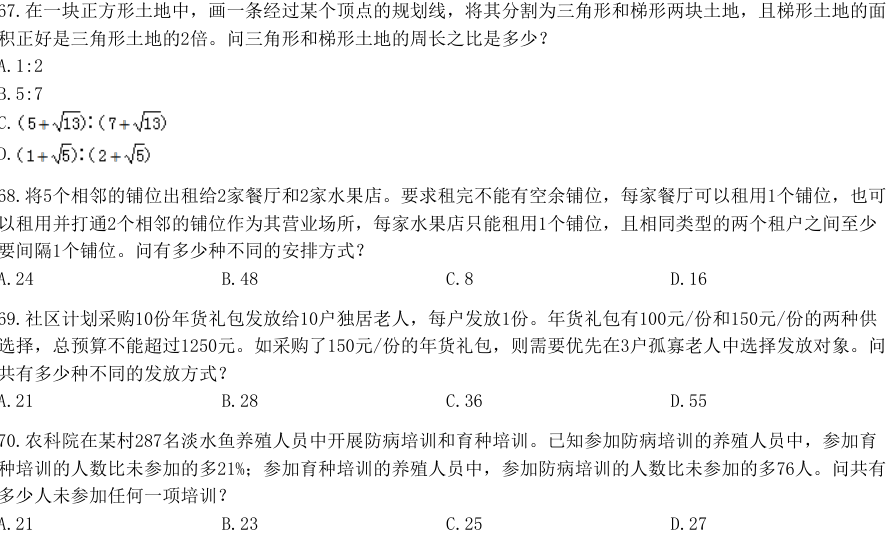

**68.** 将5个相邻的铺位出租给2家餐厅和2家水果店。要求租完不能有空余铺位，每家餐厅可以租用1个铺位，也可以租用并打通2个相邻的铺位作为其营业场所，每家水果店只能租用1个铺位，且相同类型的两个租户之间至少要间隔1个铺位。问有多少种不同的安排方式？  `[2023·副省·68]`
- A. 24
- B. 48
- C. 8
- D. 16

**69.** 社区计划采购10份年货礼包发放给10户独居老人，每户发放1份。年货礼包有100元/份和150元/份的两种供选择，总预算不能超过1250元。如采购了150元/份的年货礼包，则需要优先在3户孤寡老人中选择发放对象。问共有多少种不同的发放方式？  `[2023·副省·69]`
- A. 21
- B. 28
- C. 36
- D. 55

**70.** 农科院在某村287名淡水鱼养殖人员中开展防病培训和育种培训。已知参加防病培训的养殖人员中，参加育种培训的人数比未参加的多21%；参加育种培训的养殖人员中，参加防病培训的人数比未参加的多76人。问共有多少人未参加任何一项培训？  `[2023·副省·70]`
- A. 21
- B. 23
- C. 25
- D. 27

**71.** 某次招标活动中，甲、乙、丙、丁、戊和己6家投标企业依次对自己的设计进行讲解。已知甲和乙均不能安排在第一个或最后一个，丙只能安排在第三个或第四个，如在满足以上条件的次序中随机选择一个，则丁和戊的讲解次序相邻的概率为：  `[2023·副省·71]`
- A. 2/9
- B. 1/5
- C. 2/7
- D. 1/4

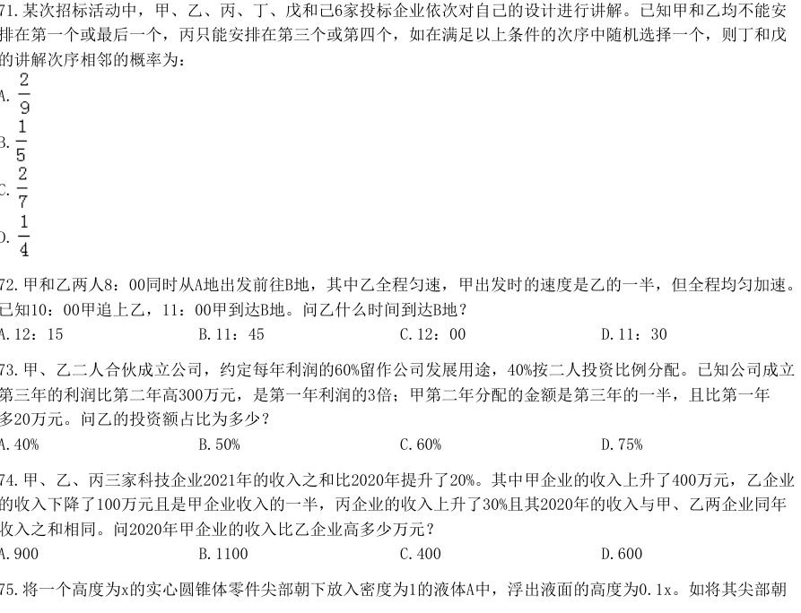

**72.** 甲和乙两人8：00同时从A地出发前往B地，其中乙全程匀速，甲出发时的速度是乙的一半，但全程均匀加速。已知10：00甲追上乙，11：00甲到达B地。问乙什么时间到达B地？  `[2023·副省·72]`
- A. 12：15
- B. 11：45
- C. 12：00
- D. 11：30

**73.** 甲、乙二人合伙成立公司，约定每年利润的60%留作公司发展用途，40%按二人投资比例分配。已知公司成立第三年的利润比第二年高300万元，是第一年利润的3倍；甲第二年分配的金额是第三年的一半，且比第一年多20万元。问乙的投资额占比为多少？  `[2023·副省·73]`
- A. 40%
- B. 50%
- C. 60%
- D. 75%

**74.** 甲、乙、丙三家科技企业2021年的收入之和比2020年提升了20%。其中甲企业的收入上升了400万元，乙企业的收入下降了100万元且是甲企业收入的一半，丙企业的收入上升了30%且其2020年的收入与甲、乙两企业同年收入之和相同。问2020年甲企业的收入比乙企业高多少万元？  `[2023·副省·74]`
- A. 900
- B. 1100
- C. 400
- D. 600

**75.** 将一个高度为x的实心圆锥体零件尖部朝下放入密度为1的液体A中，浮出液面的高度为0.1x。如将其尖部朝2023年国家公务员录用考试《行测》真题（副省卷-考生回忆版）上放入密度为1.5的液体B中，浮出液面的高度将在以下哪个范围内？  `[2023·副省·75]`
- A. 超过0.8x
- B. 0.7x～0.8x之间
- C. 0.6x～0.7x之间
- D. 不到0.6x

## 2023年 · 地市级

**61.** 社区计划采购10份年货礼包发放给10户独居老人，每户发放1份。年货礼包有100元/份和150元/份的两种供选择，总预算不能超过1250元。如采购了150元/份的年货礼包，则需要优先在3户孤寡老人中选择发放对象。问共有多少种不同的发放方式？  `[2023·地市·61]`
- A. 21
- B. 28
- C. 36
- D. 55

**62.** 商店销售某种商品，打八折销售时卖2件的利润与按定价销售时卖1件的利润相同，相当于降价120元/件销售时卖3件的利润。问该商品的定价为多少元/件？  `[2023·地市·62]`
- A. 360
- B. 450
- C. 540
- D. 720

**63.** 甲和乙两个工程队共同承担某项工程的施工任务，两队合作时各自的效率均比单独施工时高20%。已知两队合作施工需要25天完工；如甲先施工15天后乙加入，两队合作15天后剩余工作乙单独施工还需要10天完成。问甲队的效率是乙队的多少倍？  `[2023·地市·63]`
- A. 3/2
- B. 4/3
- C. 1/2
- D. 2/3

**64.** 农科院在某村287名淡水鱼养殖人员中开展防病培训和育种培训。已知参加防病培训的养殖人员中，参加育种培训的人数比未参加的多21%；参加育种培训的养殖人员中，参加防病培训的人数比未参加的多76人。问共有多少人未参加任何一项培训？  `[2023·地市·64]`
- A. 21
- B. 23
- C. 25
- D. 27

**65.** 公园里有一片四边形草坪，沿对角线修建的小道相交于0点，O到四个顶点A、B、C、D的距离之比正好为1∶2∶3∶4，一名工人花费1天正好完成AOB区域的修剪，问第二天至少需要额外增加多少名效率相同的工人一起工作，才能在当天内完成剩余草坪的修剪？ 2023年国家公务员录用考试《行测》真题（市地卷-考生回忆版）  `[2023·地市·65]`
- A. 8
- B. 10
- C. 11
- D. 12

**66.** 工厂从某周第一天开始生产某种零件，每周生产7天，从第二天开始每一天都比前一天多生产200件，已知工厂第三周的产量是第一周的2倍，问第几天其日产量第一次达到1万件？  `[2023·地市·66]`
- A. 37
- B. 38
- C. 39
- D. 40

**67.** 甲和乙两人8：00同时从A地出发前往B地，其中乙全程匀速，甲出发时的速度是乙的一半，但全程均匀加速。已知10：00甲追上乙，11：00甲到达B地。问乙什么时间到达B地？  `[2023·地市·67]`
- A. 12：15
- B. 11：45
- C. 12：00
- D. 11：30

**68.** 甲、乙二人合伙成立公司，约定每年利润的60%留作公司发展用途，40%按二人投资比例分配。已知公司成立第三年的利润比第二年高300万元，是第一年利润的3倍；甲第二年分配的金额是第三年的一半，且比第一年多20万元。问乙的投资额占比为多少？  `[2023·地市·68]`
- A. 40%
- B. 50%
- C. 60%
- D. 75%

**69.** 从A地前往B地的道路前40%的路程为上坡路，其余为下坡路。张某驾驶满载的汽车从A地去B地卸货，然后空车返回A地。已知他满载时上坡的速度是下坡速度的一半，空车时上、下坡的速度分别是满载时的1.5倍和1.2倍。问他返程的用时是去程的多少倍？  `[2023·地市·69]`
- A. 17/21
- B. 19/24
- C. 5/6
- D. 5/7

**70.** 甲、乙两名职工负责国庆7天长假的值班工作，每天安排1人值班。已知乙至少值了2天班，且在国庆期间任一天结束后，甲的累计值班天数都比乙的多。问两人的值班日期安排有多少种不同的可能？  `[2023·地市·70]`
- A. 10
- B. 14
- C. 6
- D. 9

## 2023年 · 行政执法类

**61.** 一项工作甲独立完成需要3小时，乙独立完成的用时比其与甲合作完成多4小时，且乙和丙合作完成需要4小时。问丙独立完成需要多少小时？  `[2023·执法·61]`
- A. 10
- B. 12
- C. 6
- D. 8

**62.** 在一块正方形土地中，画一条经过某个顶点的规划线，将其分割为三角形和梯形两块土地，且梯形土地的面积正好是三角形土地的2倍。问三角形和梯形土地的周长之比是多少？  `[2023·执法·62]`
- A. 1:2
- B. 5:7
- C. (5+√13):(7+√13)
- D. (1+√5):(2+√5)

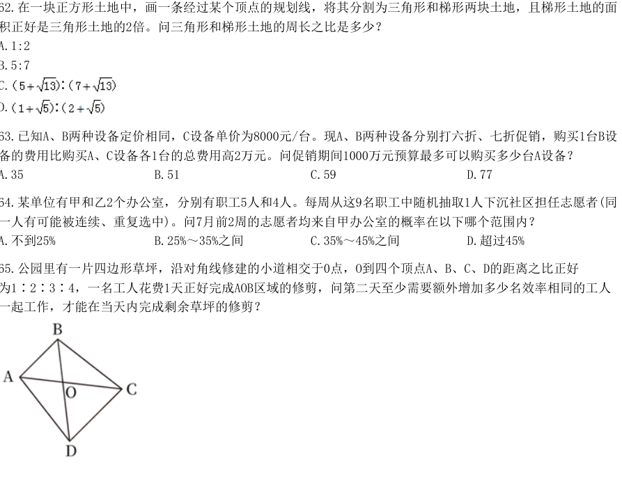

**63.** 已知A、B两种设备定价相同，C设备单价为8000元/台。现A、B两种设备分别打六折、七折促销，购买1台B设备的费用比购买A、C设备各1台的总费用高2万元。问促销期间1000万元预算最多可以购买多少台A设备？  `[2023·执法·63]`
- A. 35
- B. 51
- C. 59
- D. 77

**64.** 某单位有甲和乙2个办公室，分别有职工5人和4人。每周从这9名职工中随机抽取1人下沉社区担任志愿者(同一人有可能被连续、重复选中)。问7月前2周的志愿者均来自甲办公室的概率在以下哪个范围内？  `[2023·执法·64]`
- A. 不到25%
- B. 25%～35%之间
- C. 35%～45%之间
- D. 超过45%

**65.** 公园里有一片四边形草坪，沿对角线修建的小道相交于0点，O到四个顶点A、B、C、D的距离之比正好为1∶2∶3∶4，一名工人花费1天正好完成AOB区域的修剪，问第二天至少需要额外增加多少名效率相同的工人一起工作，才能在当天内完成剩余草坪的修剪？ 2023年国家公务员录用考试《行测》真题（行政执法卷-考生回忆版）  `[2023·执法·65]`
- A. 8
- B. 10
- C. 11
- D. 12

**66.** 单位将10个培训名额分配给4个分公司，要求在每个分公司至少分配1个名额的所有分配方案中，随机选择1个方案实施，问4个分公司中有3个分配名额数量相同的概率为多少？  `[2023·执法·66]`
- A. 3/50
- B. 1/10
- C. 3/25
- D. 1/7

**67.** 某次会议邀请4所高校每所各2位学者作报告。在某日上午、下午和晚上的三个时间段分别安排3位、3位和2位学者依次作报告,且同一所高校的2位学者不安排在同一时间段内作报告。问8人的报告次序有多少种不同的安排方式？  `[2023·执法·67]`
- A. 不到5000种
- B. 5000～10000种之间
- C. 10001～20000种之间
- D. 超过20000种

**68.** 一辆汽车从甲地开往乙地，先以40千米/小时的速度匀速行驶一半的路程，然后均匀加速；行驶完剩下路程的一半时，速度达到80千米/小时；此后均匀减速，到达乙地时的速度正好降为0。问其全程的平均速度在以下哪个范围内？  `[2023·执法·68]`
- A. 不到44千米/小时
- B. 在44～45千米/小时之间
- C. 在45～46千米/小时之间
- D. 超过46千米/小时

**69.** 甲、乙、丙三家科技企业2021年的收入之和比2020年提升了20%。其中甲企业的收入上升了400万元，乙企业的收入下降了100万元且是甲企业收入的一半，丙企业的收入上升了30%且其2020年的收入与甲、乙两企业同年收入之和相同。问2020年甲企业的收入比乙企业高多少万元？  `[2023·执法·69]`
- A. 900
- B. 1100
- C. 400
- D. 600

**70.** 一个圆柱体零件A和一个圆锥体零件B分别用甲、乙两种合金铸造而成。A的底面半径和高相同，B的底面半径是高的2倍，两个零件的高相同，质量也相同。问甲合金的密度是乙合金的多少倍？  `[2023·执法·70]`
- A. 4/3
- B. 3/4
- C. 2/3
- D. 3/2

## 2024年 · 副省级

**61.** 市政部门采购了一批灯带用于美化夜景，有30灯珠/条的M型和60灯珠/条的N型两种规格，单价分别是20元/条和30元/条。已知所采购的M型灯带的总灯珠数量是N型的2倍，M型灯带的总价比N型多3万元。问共采购灯带多少条：  `[2024·副省·61]`
- A. 2400
- B. 2700
- C. 3000
- D. 3300

**62.** 甲、乙、丙三人的年龄之比为3：4：5。8年之后，甲、乙的年龄之和是丙的1.5倍，且这一年甲、乙、丙、丁四人的平均年龄为43岁。问再过15年，甲、乙、丙、丁中有几人将超过60岁？  `[2024·副省·62]`
- A. 4
- B. 3
- C. 2
- D. 1

**63.** 甲、乙两条生产线同一天开始生产某种产品，甲每天比前一天多生产m件，乙每天比前一天少生产2m件，第5天两条生产线的当日产量相同，且前5天乙的累计产量是甲的2倍。问第一天乙的产量是甲的多少倍：  `[2024·副省·63]`
- A. 7
- B. 6
- C. 5
- D. 4

**64.** 甲和乙两辆车同时从A地出发匀速开往B地，甲车出发时的速度比乙车快20%，但乙车行驶2小时后速度加快30千米/小时继续匀速行驶，又用了3小时与甲车同时抵达。问A、B两地相距多少千米：  `[2024·副省·64]`
- A. 510
- B. 540
- C. 570
- D. 600

**65.** 某公园内的道路如下图所示，其中AB、BC分别为正南北向和正东西向道路，AB、AC分别长100米和200米，且BCD为正三角形。如要用直线道路连接AD，则该道路的长度为多少米：  `[2024·副省·65]`
- A. 150√3
- B. 100√7
- C. 50(√3+1)
- D. 200√2

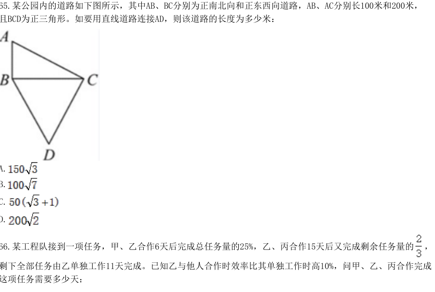

**66.** 某工程队接到一项任务，甲、乙合作6天后完成总任务量的25%，乙、丙合作15天后又完成剩余任务量的，剩下全部任务由乙单独工作11天完成。已知乙与他人合作时效率比其单独工作时高10%，问甲、乙、丙合作完成这项任务需要多少天：2024年国家公务员考试《行测》真题（副省卷-考生回忆版）  `[2024·副省·66]`
- A. 24
- B. 28
- C. 16
- D. 20

**67.** 某部门有A、B、C三个科室，共50名职员，一次全员考核中，三个科室的平均分分别为73.3、70、80分，该部门的总分为3746分，则该部门B科室有（  ）名职员。  `[2024·副省·67]`
- A. 20
- B. 12
- C. 15
- D. 18

**68.** 设计师将一个正方形的大厅分成如下图所示的几个区域，已知所有的三角形都是等腰直角三角形，梯形都是等腰梯形，且所有三角形和梯形面积均相等。在三角形的区域铺设地砖，在中间的正方形区域铺 设木地板，问地砖和木地板的面积比是多少：  `[2024·副省·68]`
- A. 8:9
- B. 16:9
- C. 2:3
- D. 4:3

**69.** 甲、乙等36人分为6个小组参加某项活动，要求任意2组人数不同，每个组都不少于3人，且任何一组人数不得超过另一组的3倍。问甲和乙至少有1人分到人数第二多的小组的概率为：  `[2024·副省·69]`
- A. 25%
- B. 30%
- C. 35%
- D. 40%

**70.** 甲、乙、丙和丁四个汽车租赁公司可用汽车数量比为5:4:3:2，现甲公司调度4辆汽车到丙公司，丁公司调度1辆汽车到乙公司后，丁公司可用汽车数量正好是丙公司的60%。问此时甲公司的可用汽车数量比乙公司：  `[2024·副省·70]`
- A. 少12辆
- B. 少22辆
- C. 多12辆
- D. 多22辆

**71.** 某企业去年全年收入1200万元，支出960万元。今年上半年和下半年，企业支出比去年同期分别减少20%和15%，且全年收入与去年相同，总体盈余（收入-支出）比去年增加172万元。问今年上半年支出比下半年：  `[2024·副省·71]`
- A. 多108万元
- B. 少108万元
- C. 多160万元
- D. 少160万元

**72.** 甲、乙、丙三种农产品价格分别为30元/包、24元/包和20元/包。某日销售三种农产品共240包，总销售额为6000元。已知甲的销量是乙的2倍，问丙销售了多少包：  `[2024·副省·72]`
- A. 45
- B. 60
- C. 75
- D. 90

**73.** 某次考试有20道选择题和20道判断题，每题答对得3分，答错得0分，不答得1分。考生小王成绩为82分，且他选择题的答错数比答对数多。问他判断题至少答对了多少道：  `[2024·副省·73]`
- A. 15
- B. 16
- C. 17
- D. 18

**74.** 某高校外国语学院中，会俄语的学生都会英语，其中一半还会法语；会英语的学生中有一半会法语；这三种语言都会的学生有50人，只会其中两种语言的有100人，只会其中一种语言的有150人。问会法语的学生有多少人?  `[2024·副省·74]`
- A. 100
- B. 200
- C. 50
- D. 150

**75.** 某小区实行封控，为了落实疫情防控政策及满足居民的日常生活需求，向某保安公司招聘保安，保安公司原计划派出N名保安，若每栋楼安排5名保安则余65名，若每栋楼安排8名保安则少43名，则保安公司至少再派出多少名保安，可使保安平均分配：  `[2024·副省·75]`
- A. 13
- B. 11
- C. 9
- D. 7

## 2024年 · 地市级

**61.** 某地为工业企业提供相当于营业额2%的税收优惠，当地的A工厂原本预计当年会产生相当于营业额0.8%的亏损，在享受优惠政策后预计可以盈利300万元。问A工厂当年的预计营业额为多少亿元？  `[2024·地市·61]`
- A. 4
- B. 3.6
- C. 3
- D. 2.5

**62.** 某企业招聘笔试参考人员均来自甲、乙、丙三所高校。笔试结束后，在进入面试的100人中，来自甲高校人员占比从笔试时的50%下降至当前的40%,乙高校人员占比下降了15个百分点，丙高校的有50人。问笔试时来自甲、乙、丙三所高校的人员比例是多少？  `[2024·地市·62]`
- A. 2：1：1
- B. 2：3：2
- C. 3：1：2
- D. 3：2：1

**63.** 甲和乙分别从一条环形跑道的A、B两点同时出发分别沿顺时针、逆时针方向匀速跑步，甲跑了15秒后与乙相遇，又跑了20秒后到达B点，又跑了45秒后回到A点。问此时乙还要跑多久才能再次回到B点：  `[2024·地市·63]`
- A. 50秒
- B. 40秒
- C. 30秒
- D. 20秒

**64.** 公司有6个编号依次为1-6的研发团队。现安排这6个团队参与甲、 乙2个科研课题，要求每个团队参与1个课题，每个课题最少安排2个团队。每个课题安排1个团队负责，且负责团队不能是该课题所有参与团队中编号最小的团队。问有多少种不同的安排方式：2024年国家公务员录用考试《行测》真题（市地卷-考生回忆版）  `[2024·地市·64]`
- A. 340
- B. 300
- C. 170
- D. 150

**65.** 甲、乙、丙三个研发团队共有研发人员300多人，其中甲的人数比乙多26%。现丙调3人去乙后，两个团队人数相同。问此时甲至少调多少人去丙后，才能保证丙的人数是甲的2倍以上？  `[2024·地市·65]`
- A. 49
- B. 35
- C. 50
- D. 40

**66.** 2023年王的年龄比张年龄的2倍小2岁，2025年张的年龄是李年龄的1.5倍，2030年张和李的年龄之和与王年龄相同。同3人的年龄之和在哪一年第一次超过120岁：  `[2024·地市·66]`
- A. 2034年
- B. 2035年
- C. 2036年
- D. 2037年

**67.** 甲、乙、丙三人未来3周均要去A、B、C三个地方调研，每人每个地方调研时长为1周，如每个人随机安排顺序，则每周三个人去的地方都不同的概率为：  `[2024·地市·67]`
- A. 1/6
- B. 1/3
- C. 1/18
- D. 1/9

**68.** 某高校外国语学院中，会俄语的学生都会英语，其中一半还会法语；会英语的学生中有一半会法语；这三种语言都会的学生有50人，只会其中两种语言的有100人，只会其中一种语言的有150人。问会法语的学生有多少人?  `[2024·地市·68]`
- A. 100
- B. 200
- C. 50
- D. 150

**69.** 小张每周二、周五和周日固定参加骑行社团活动。某年9月和10月，小张分别参加了13次和14次活动。问当年他最后一次参加活动是在哪一天?  `[2024·地市·69]`
- A. 12月31日
- B. 12月30日
- C. 12月29日
- D. 12月28日

**70.** 某小区内部的道路如下图所示，道路转弯处的∠A、∠C、∠E均为直角，∠B=135°。已知AB、CD、EA的长度分别为40米、50米、60米，问整圈道路的总长度在以下哪个范围内?  `[2024·地市·70]`
- A. 在200~210米之间
- B. 在210~220米之间
- C. 不到200米
- D. 超过220米

## 2024年 · 行政执法类

**61.** 某地为工业企业提供相当于营业额2%的税收优惠，当地的A工厂原本预计当年会产生相当于营业额0.8%的亏损，在享受优惠政策后预计可以盈利300万元。问A工厂当年的预计营业额为多少亿元？  `[2024·执法·61]`
- A. 4
- B. 3.6
- C. 3
- D. 2.5

**62.** 甲、乙、丙三人的年龄之比为3：4：5。8年之后，甲、乙的年龄之和是丙的1.5倍，且这一年甲、乙、丙、丁四人的平均年龄为43岁。问再过15年，甲、乙、丙、丁中有几人将超过60岁？  `[2024·执法·62]`
- A. 4
- B. 3
- C. 2
- D. 1

**63.** 某企业招聘笔试参考人员均来自甲、乙、丙三所高校。笔试结束后，在进入面试的100人中，来自甲高校人员占比从笔试时的50%下降至当前的40%,乙高校人员占比下降了15个百分点，丙高校的有50人。问笔试时来自甲、乙、丙三所高校的人员比例是多少？  `[2024·执法·63]`
- A. 2：1：1
- B. 2：3：2
- C. 3：1：2
- D. 3：2：1

**64.** 甲、乙、丙三人未来3周均要去A、B、C三个地方调研，每人每个地方调研时长为1周，如每个人随机安排顺序，则每周三个人去的地方都不同的概率为：2024年国家公务员考试《行测》真题（行政执法卷-考生回忆版）  `[2024·执法·64]`
- A. 1/6
- B. 1/3
- C. 1/18
- D. 1/9

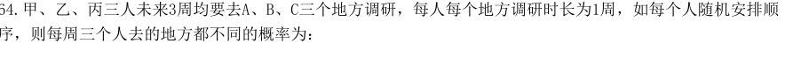

**65.** 甲、乙、丙三个研发团队共有研发人员300多人，其中甲的人数比乙多26%。现丙调3人去乙后，两个团队人数相同。问此时甲至少调多少人去丙后，才能保证丙的人数是甲的2倍以上？  `[2024·执法·65]`
- A. 49
- B. 35
- C. 50
- D. 40

**66.** 甲、乙两个联络站相距10千米。一条道路与甲、乙联络站连线相平行，且与两联络站连线的垂直距离为12千米。现需紧邻该道路建一个工作站，问工作站距离甲、乙联络站距离之和最小为多少千米?  `[2024·执法·66]`
- A. 20
- B. 22
- C. 24
- D. 26

**67.** 某高校外国语学院中，会俄语的学生都会英语，其中一半还会法语；会英语的学生中有一半会法语；这三种语言都会的学生有50人，只会其中两种语言的有100人，只会其中一种语言的有150人。问会法语的学生有多少人?  `[2024·执法·67]`
- A. 100
- B. 200
- C. 50
- D. 150

**68.** 小张每周二、周五和周日固定参加骑行社团活动。某年9月和10月，小张分别参加了13次和14次活动。问当年他最后一次参加活动是在哪一天?  `[2024·执法·68]`
- A. 12月31日
- B. 12月30日
- C. 12月29日
- D. 12月28日

**69.** 某小区内部的道路如下图所示，道路转弯处的∠A、∠C、∠E均为直角，∠B=135°。已知AB、CD、EA的长度分别为40米、50米、60米，问整圈道路的总长度在以下哪个范围内?  `[2024·执法·69]`
- A. 在200~210米之间
- B. 在210~220米之间
- C. 不到200米
- D. 超过220米

**70.** 某单位组织干部职工分5批进行业务培训，培训地点有甲、乙、丙三个地方，每个地方至少安排一批。受接待能力影响，第一、二批不去甲地，问有多少种安排方式?  `[2024·执法·70]`
- A. 52
- B. 62
- C. 72
- D. 82

## 2025年 · 副省级

**66.** 运送一批货物，第一趟派出10辆大车，第二趟又增派15辆小车，运输量比第一趟高50%。问每辆大车的载货量是小车的多少倍？  `[2025·副省·66]`
- A. 3
- B. 2.5
- C. 2
- D. 1.5

**67.** 某企业今年3月节电量是1月的1.2倍、2月的1.5倍，已知2月节电量比1月少4万度，问今年一季度企业节电量为多少万度？  `[2025·副省·67]`
- A. 48
- B. 52
- C. 56
- D. 60 2025年国家公务员录用考试《行测》真题（副省卷-考生回忆版）---估分

**68.** 甲和乙从环形跑道的同一点出发，向相反方向匀速慢跑，乙的速度是甲的一半。两人3分钟后第一次相遇，此后乙加速又跑了正好半圈后和甲第二次相遇。问两人第一次到第二次相遇间隔了多长时间？  `[2025·副省·68]`
- A. 2分10秒
- B. 2分15秒
- C. 2分20秒
- D. 2分30秒

**69.** 某研发小组员工中，60%的人参与了A项目，45%的人参与了B项目，两个项目都参与的人比两个项目都不参与的多2人。问该研发小组有多少人？  `[2025·副省·69]`
- A. 100
- B. 50
- C. 40
- D. 20

**70.** 2024年甲、乙、丙三人的年龄之和与2034年甲的年龄相同，且甲、乙的年龄之差大于乙、丙的年龄之差。已知乙的年龄小于甲但大于丙，问2024年甲的年龄最小可能为多少岁？  `[2025·副省·70]`
- A. 13
- B. 11
- C. 10
- D. 9

**71.** 甲、乙、丙3台收割机每小时均能收割2亩小麦，三台机器上午先后开始收割工作，12：00时甲收割的面积是乙的1.5倍，且比丙多收割6亩，16：00时3台收割机共收割了50亩，问乙是何时开始工作的？  `[2025·副省·71]`
- A. 6：00
- B. 7：00
- C. 8：00
- D. 9：00

**72.** 某竞赛由5道次序固定的判断题组成，参赛者起始为0分，每答对1题加1分，每答错1题扣1分。小王作答了所有试题，答完每道题时当前的得分都不低于1分。问他的答题情况有多少种不同的可能?  `[2025·副省·72]`
- A. 7
- B. 6
- C. 4
- D. 3

**73.** 某种机械由3个A模块和2个B模块组成。甲车间每天可生产6个A模块或3个B模块，乙车间每天可生产1个A模块或2个B模块。现两车间合作生产40台该机械所需模块，问至少需要多少天?  `[2025·副省·73]`
- A. 24
- B. 26
- C. 28
- D. 30

**74.** 甲船在A港正东n海里，乙船在A港正南√3n海里，两船相距120海里，同时出发向A港匀速行驶。已知乙船的速度是甲船的2√3倍，比甲船早3小时到A港。问甲船的速度是多少海里/小时？  `[2025·副省·74]`
- A. 10
- B. 15
- C. 10√3
- D. 15√3

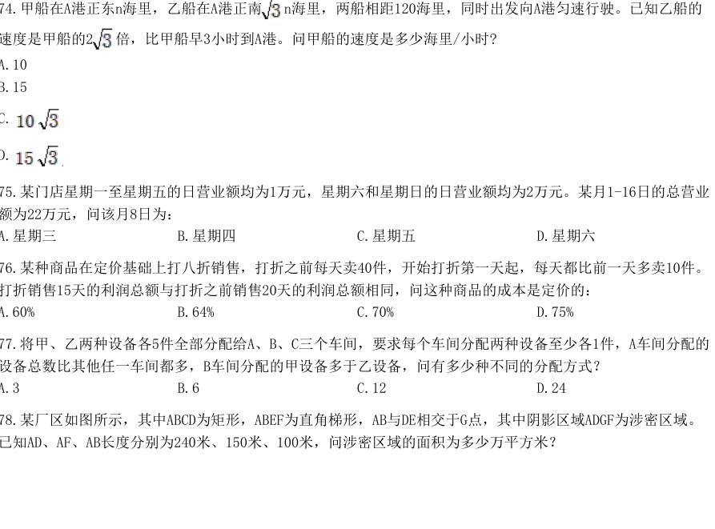

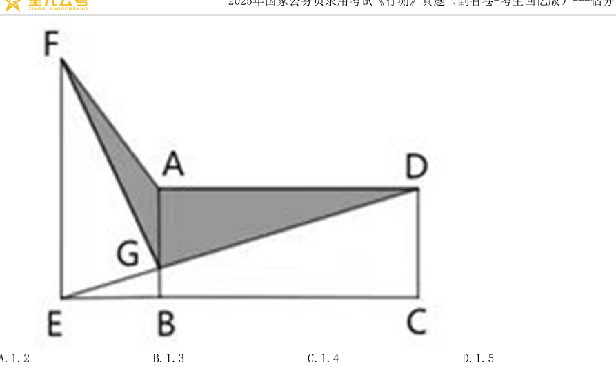

**75.** 某门店星期一至星期五的日营业额均为1万元，星期六和星期日的日营业额均为2万元。某月1-16日的总营业额为22万元，问该月8日为：  `[2025·副省·75]`
- A. 星期三
- B. 星期四
- C. 星期五
- D. 星期六

**76.** 某种商品在定价基础上打八折销售，打折之前每天卖40件，开始打折第一天起，每天都比前一天多卖10件。打折销售15天的利润总额与打折之前销售20天的利润总额相同，问这种商品的成本是定价的：  `[2025·副省·76]`
- A. 60%
- B. 64%
- C. 70%
- D. 75%

**77.** 将甲、乙两种设备各5件全部分配给A、B、C三个车间，要求每个车间分配两种设备至少各1件，A车间分配的设备总数比其他任一车间都多，B车间分配的甲设备多于乙设备，问有多少种不同的分配方式？  `[2025·副省·77]`
- A. 3
- B. 6
- C. 12
- D. 24

**78.** 某厂区如图所示，其中ABCD为矩形，ABEF为直角梯形，AB与DE相交于G点，其中阴影区域ADGF为涉密区域。已知AD、AF、AB长度分别为240米、150米、100米，问涉密区域的面积为多少万平方米？ 2025年国家公务员录用考试《行测》真题（副省卷-考生回忆版）---估分  `[2025·副省·78]`
- A. 1.2
- B. 1.3
- C. 1.4
- D. 1.5

**79.** 小王计划在7天假期自学甲、乙两门在线课程，每门课程需要连学2整天。如在所有可能的安排中随机选择1种，不用学习的3天均不相邻的概率为：  `[2025·副省·79]`
- A. 1/7
- B. 1/8
- C. 1/9
- D. 1/10

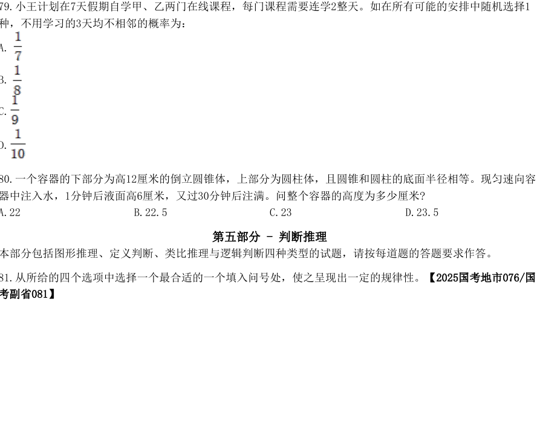

**80.** 一个容器的下部分为高12厘米的倒立圆锥体，上部分为圆柱体，且圆锥和圆柱的底面半径相等。现匀速向容器中注入水，1分钟后液面高6厘米，又过30分钟后注满。问整个容器的高度为多少厘米?  `[2025·副省·80]`
- A. 22
- B. 22.5
- C. 23
- D. 23.5

## 2025年 · 地市级

**66.** 张某8:00开车从A地出发，在A、B两地之间往返行驶。8:30第一次到达A、B之间的C点时加速30%继续行驶，并于9：00第二次到达C点。问AC距离是BC距离的多少倍?  `[2025·地市·66]`
- A. 13/5
- B. 20/13
- C. 10/13
- D. 13/10

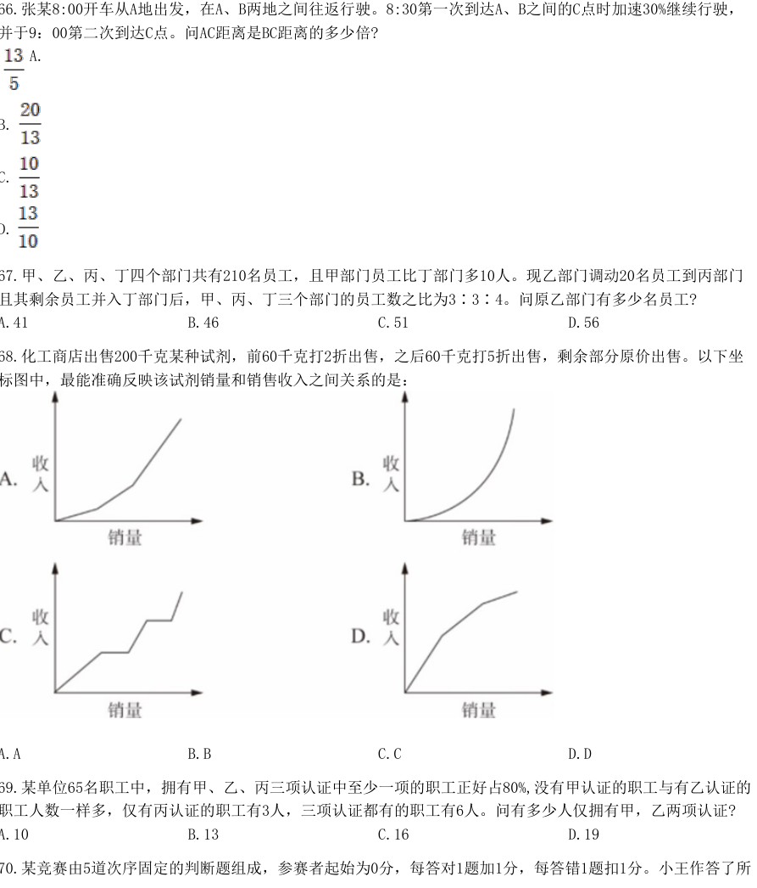

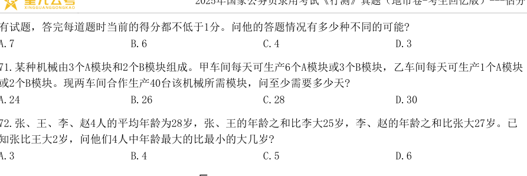

**67.** 甲、乙、丙、丁四个部门共有210名员工，且甲部门员工比丁部门多10人。现乙部门调动20名员工到丙部门且其剩余员工并入丁部门后，甲、丙、丁三个部门的员工数之比为3∶3∶4。问原乙部门有多少名员工?  `[2025·地市·67]`
- A. 41
- B. 46
- C. 51
- D. 56

**68.** 化工商店出售200千克某种试剂，前60千克打2折出售，之后60千克打5折出售，剩余部分原价出售。以下坐标图中，最能准确反映该试剂销量和销售收入之间关系的是：  `[2025·地市·68]`
- A. A
- B. B
- C. C
- D. D

**69.** 某单位65名职工中，拥有甲、乙、丙三项认证中至少一项的职工正好占80%,没有甲认证的职工与有乙认证的职工人数一样多，仅有丙认证的职工有3人，三项认证都有的职工有6人。问有多少人仅拥有甲，乙两项认证?  `[2025·地市·69]`
- A. 10
- B. 13
- C. 16
- D. 19

**70.** 某竞赛由5道次序固定的判断题组成，参赛者起始为0分，每答对1题加1分，每答错1题扣1分。小王作答了所2025年国家公务员录用考试《行测》真题（地市卷-考生回忆版）---估分有试题，答完每道题时当前的得分都不低于1分。问他的答题情况有多少种不同的可能?  `[2025·地市·70]`
- A. 7
- B. 6
- C. 4
- D. 3

**71.** 某种机械由3个A模块和2个B模块组成。甲车间每天可生产6个A模块或3个B模块，乙车间每天可生产1个A模块或2个B模块。现两车间合作生产40台该机械所需模块，问至少需要多少天?  `[2025·地市·71]`
- A. 24
- B. 26
- C. 28
- D. 30

**72.** 张、王、李、赵4人的平均年龄为28岁，张、王的年龄之和比李大25岁，李、赵的年龄之和比张大27岁。已知张比王大2岁，问他们4人中年龄最大的比最小的大几岁?  `[2025·地市·72]`
- A. 3
- B. 4
- C. 5
- D. 6

**73.** 甲船在A港正东n海里，乙船在A港正南√3n海里，两船相距120海里，同时出发向A港匀速行驶。已知乙船的速度是甲船的2√3倍，比甲船早3小时到A港。问甲船的速度是多少海里/小时？  `[2025·地市·73]`
- A. 10
- B. 15
- C. 10√3
- D. 15√3

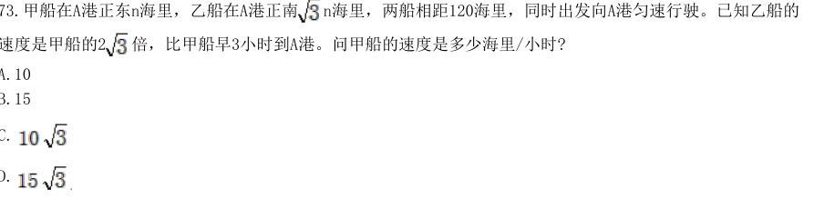

**74.** 小王计划在7天假期自学甲、乙两门在线课程，每门课程需要连学2整天。如在所有可能的安排中随机选择1种，不用学习的3天均不相邻的概率为：  `[2025·地市·74]`
- A. 1/7
- B. 1/8
- C. 1/9
- D. 1/10

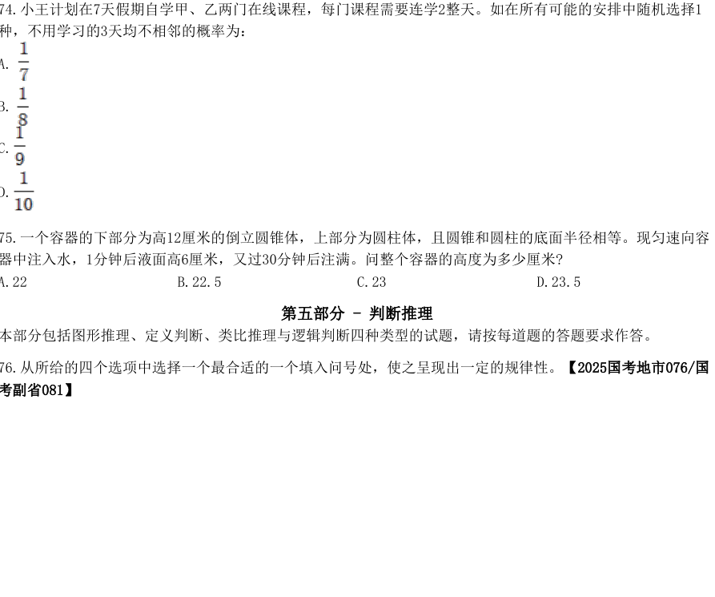

**75.** 一个容器的下部分为高12厘米的倒立圆锥体，上部分为圆柱体，且圆锥和圆柱的底面半径相等。现匀速向容器中注入水，1分钟后液面高6厘米，又过30分钟后注满。问整个容器的高度为多少厘米?  `[2025·地市·75]`
- A. 22
- B. 22.5
- C. 23
- D. 23.5

## 2025年 · 行政执法类

**66.** 甲、乙、丙3台收割机每小时均能收割2亩小麦，三台机器上午先后开始收割工作，12：00时甲收割的面积是乙的1.5倍，且比丙多收割6亩，16：00时3台收割机共收割了50亩，问乙是何时开始工作的？  `[2025·执法·66]`
- A. 6：00
- B. 7：00
- C. 8：00
- D. 9：00

**67.** 甲、乙、丙、丁四个部门共有210名员工，且甲部门员工比丁部门多10人。现乙部门调动20名员工到丙部门且其剩余员工并入丁部门后，甲、丙、丁三个部门的员工数之比为3∶3∶4。问原乙部门有多少名员工?  `[2025·执法·67]`
- A. 41
- B. 46
- C. 51
- D. 56

**68.** 张、王、李、赵4人的平均年龄为28岁，张、王的年龄之和比李大25岁，李、赵的年龄之和比张大27岁。已知张比王大2岁，问他们4人中年龄最大的比最小的大几岁?  `[2025·执法·68]`
- A. 3
- B. 4
- C. 5
- D. 6

**69.** 将甲、乙两种设备各5件全部分配给A、B、C三个车间，要求每个车间分配两种设备至少各1件，A车间分配的设备总数比其他任一车间都多，B车间分配的甲设备多于乙设备，问有多少种不同的分配方式？  `[2025·执法·69]`
- A. 3
- B. 6
- C. 12
- D. 24

**70.** 张某8:00开车从A地出发，在A、B两地之间往返行驶。8:30第一次到达A、B之间的C点时加速30%继续行驶，并于9：00第二次到达C点。问AC距离是BC距离的多少倍?  `[2025·执法·70]`
- A. 13/5
- B. 20/13
- C. 10/13
- D. 13/10

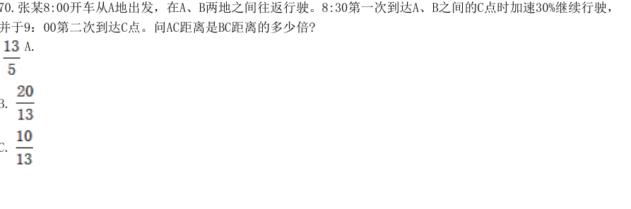

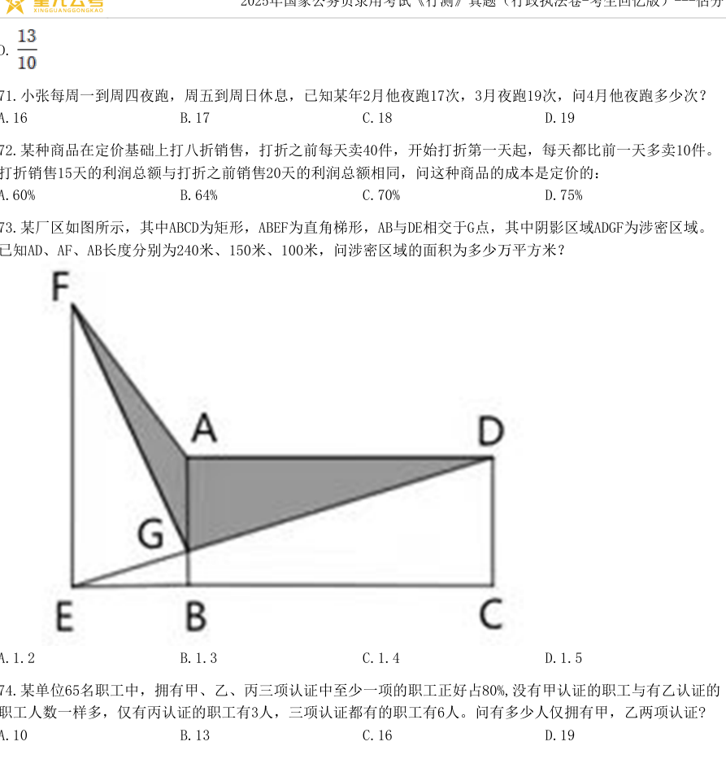

**71.** 小张每周一到周四夜跑，周五到周日休息，已知某年2月他夜跑17次，3月夜跑19次，问4月他夜跑多少次？  `[2025·执法·71]`
- A. 16
- B. 17
- C. 18
- D. 19

**72.** 某种商品在定价基础上打八折销售，打折之前每天卖40件，开始打折第一天起，每天都比前一天多卖10件。打折销售15天的利润总额与打折之前销售20天的利润总额相同，问这种商品的成本是定价的：  `[2025·执法·72]`
- A. 60%
- B. 64%
- C. 70%
- D. 75%

**73.** 某厂区如图所示，其中ABCD为矩形，ABEF为直角梯形，AB与DE相交于G点，其中阴影区域ADGF为涉密区域。已知AD、AF、AB长度分别为240米、150米、100米，问涉密区域的面积为多少万平方米？  `[2025·执法·73]`
- A. 1.2
- B. 1.3
- C. 1.4
- D. 1.5

**74.** 某单位65名职工中，拥有甲、乙、丙三项认证中至少一项的职工正好占80%,没有甲认证的职工与有乙认证的职工人数一样多，仅有丙认证的职工有3人，三项认证都有的职工有6人。问有多少人仅拥有甲，乙两项认证?  `[2025·执法·74]`
- A. 10
- B. 13
- C. 16
- D. 19

**75.** 一个长方体零件最大面的面积是最小面的3倍，次大面的面积是最大、最小面面积平均值的9/16。问该零件最小面的长是其宽的多少倍？  `[2025·执法·75]`
- A. 7/3
- B. 7/6
- C. 8/3
- D. 4/3

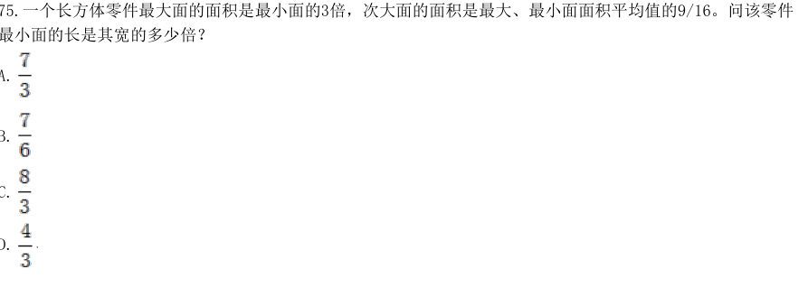

## 2026年 · 副省级

**66.** 某园区种植甲、乙、丙三种花卉共10公顷，甲的种植面积是乙的2倍，丙的种植面积比乙少2公顷。问丙的种植面积为多少公顷？  `[2026·副省·66]`
- A. 1
- B. 2
- C. 3
- D. 4

**67.** 甲和乙两个工厂共同生产5天，能生产w件产品。甲的效率是乙的m倍，如果甲效率提升50%，乙效率提升为原来的n倍，则3天就能生产w件产品。问m和n的关系为：2026年国家公务员录用考试《行测》真题（副省卷-考生回忆版）-估分  `[2026·副省·67]`
- A. m=3n-5
- B. m=6n-10
- C. m=5-3n
- D. m=10-6n

**68.** 某企业2023年开始拓展海外业务，当年海外业务亏损m元，但2024年海外业务实现利润2m元。在国内市场每年利润保持不变的前提下，2024年总利润是2023年的1.2倍。问该企业每年国内市场利润为多少元？  `[2026·副省·68]`
- A. 13m
- B. 14m
- C. 15m
- D. 16m

**69.** 某企业采购了A、B、C三个品牌的电脑共54台，其中采购A品牌电脑的台数比B品牌电脑少35%。问采购的C品牌电脑比B品牌电脑：  `[2026·副省·69]`
- A. 少1台
- B. 少2台
- C. 多1台
- D. 多2台

**70.** 4人参加乒乓球比赛，每2人对战一场，甲战胜乙的概率是0.4，乙战胜丙的概率是丙战胜丁概率的2倍。已知乙在比赛中对甲、丙均取胜的概率是0.18，问丙战胜丁的概率是：  `[2026·副省·70]`
- A. 0.1
- B. 0.12
- C. 0.15
- D. 0.3

**71.** 甲、乙两地的中点为丙。张从甲出发在甲、乙之间往返匀速慢跑，同时王从乙出发在乙、丙之间往返匀速慢跑。出发后王第5次到达乙地时，张正好第4次到达乙地。问张的速度是王的多少倍？  `[2026·副省·71]`
- A. 5/7
- B. 7/5
- C. 7/10
- D. 10/7

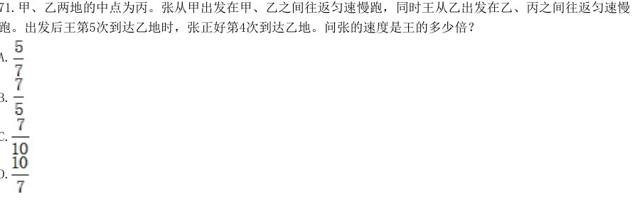

**72.** 甲和乙两个长方体零件的体积比为3：2，且甲和乙均有2个面为边长n厘米的正方形。将甲和乙粘接为一个长方体之后，表面积比原来2个零件的表面积之和减少了20%。问乙最短棱的长度是最长棱的：  `[2026·副省·72]`
- A. 2/3
- B. 3/4
- C. 3/5
- D. 4/5

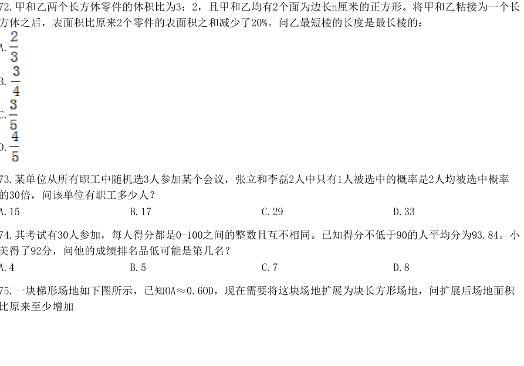

**73.** 某单位从所有职工中随机选3人参加某个会议，张立和李磊2人中只有1人被选中的概率是2人均被选中概率的30倍，问该单位有职工多少人？  `[2026·副省·73]`
- A. 15
- B. 17
- C. 29
- D. 33

**74.** 其考试有30人参加，每人得分都是0-100之间的整数且互不相同。已知得分不低于90的人平均分为93.84。小美得了92分，问他的成绩排名品低可能是第几名？  `[2026·副省·74]`
- A. 4
- B. 5
- C. 7
- D. 8

**75.** 一块梯形场地如下图所示，已知OA≈0.6OD，现在需要将这块场地扩展为块长方形场地，问扩展后场地面积比原来至少增加2026年国家公务员录用考试《行测》真题（副省卷-考生回忆版）-估分  `[2026·副省·75]`
- A. 20%
- B. 25%
- C. 40%
- D. 50%

**76.** 甲和乙办公室各有4名职工，乙办公室职工平均年龄为32岁。现从甲办公室调动1人到乙办公室，2个办公室职工平均年龄都增加了2岁。问调动后甲办公室职工的平均年龄为多少岁？  `[2026·副省·76]`
- A. 50
- B. 48
- C. 46
- D. 44

**77.** 甲、乙两个工程队单独完成A、B、C三个工程，所需时间如下：问两队合作完成这3个工程至少需要多少天（不足1天算1天）？  `[2026·副省·77]`
- A. 18
- B. 17
- C. 16
- D. 15

**78.** 某社区干部每周一参加工作例会，每月10日、20日接访群众。已知8月与9月共有2次接访群众与工作例会在同一天，问当年9月1日是:  `[2026·副省·78]`
- A. 周三
- B. 周二
- C. 周六
- D. 周五

**79.** 甲、乙、丙三辆车同时从环形道路同一点出发匀速行驶，其中甲和乙顺时针行驶，丙逆时针行驶，且甲、乙、丙的速度比为4：5：6。已知甲丙和乙丙第一次相遇的时间间隔为5秒，问出发后多久乙第一次追上甲？  `[2026·副省·79]`
- A. 不到8分钟
- B. 8分钟～9分钟之间
- C. 9分钟～10分钟之间
- D. 超过10分钟

**80.** 公司1月销售额为w元，从2月开始每个月的销售额都比上个月高k元。已知一季度完成全年销售目标的18%，上半年完成全年销售目标的48%，问公司全年实际销售额将比销售目标高多少元？  `[2026·副省·80]`
- A. 21k
- B. 28k
- C. 33k
- D. 44k

## 2026年 · 地市级

**66.** 某企业采购了A、B、C三个品牌的电脑共54台，其中采购A品牌电脑的台数比B品牌电脑少35%。问采购的C品牌电脑比B品牌电脑：  `[2026·地市·66]`
- A. 少1台
- B. 少2台
- C. 多1台
- D. 多2台

**67.** 某部门7人分两组到甲、乙两市进行调研。已知到甲市人数超过一半，老张和小王均到乙市，问共有多少种不同的分组方式？  `[2026·地市·67]`
- A. 10
- B. 8
- C. 6
- D. 5

**68.** 小王从甲地匀速前往乙地，到达后立刻匀速返回。已知他去程的用时比返程多3小时，去程的速度是返程的40%，且往返的平均速度为40千米/小时，问甲、乙两地相距多少千米？  `[2026·地市·68]`
- A. 70
- B. 140
- C. 210
- D. 280

**69.** 某种商品若按每件100元出售，每天售出m件；若降价10%，日销量将提高25%且日利润与降价前相同。问该商品成本为多少元/件？  `[2026·地市·69]`
- A. 50
- B. 60
- C. 70
- D. 80

**70.** 甲、乙两车间每天可加工2000个零件。若甲、乙车间效率分别提升10%和20%，则两车间每天可加工2260个零件。问效率提升前甲车间每天可加工多少个零件？  `[2026·地市·70]`
- A. 1100
- B. 1200
- C. 1300
- D. 1400

**71.** 某单位从所有职工中随机选3人参加某个会议，张立和李磊2人中只有1人被选中的概率是2人均被选中概率的30倍，问该单位有职工多少人？  `[2026·地市·71]`
- A. 15
- B. 17
- C. 29
- D. 33

**72.** 一块梯形场地如下图所示，已知OA≈0.6OD，现在需要将这块场地扩展为块长方形场地，问扩展后场地面积比原来至少增加  `[2026·地市·72]`
- A. 20%
- B. 25%
- C. 40%
- D. 50%

**73.** 甲和乙办公室各有4名职工，乙办公室职工平均年龄为32岁。现从甲办公室调动1人到乙办公室，2个办公室职工平均年龄都增加了2岁。问调动后甲办公室职工的平均年龄为多少岁？  `[2026·地市·73]`
- A. 50
- B. 48
- C. 46
- D. 44 2026年国家公务员录用考试《行测》真题（地市卷-考生回忆版）-估分

**74.** 某社区干部每周一参加工作例会，每月10日、20日接访群众。已知8月与9月共有2次接访群众与工作例会在同一天，问当年9月1日是:  `[2026·地市·74]`
- A. 周三
- B. 周二
- C. 周六
- D. 周五

**75.** 某新技术论坛在3个分会场安排4个领域的12场报告，安排如下表。小华希望在同一天听4个领域的报告各1场，问他有多少种不同的选择方式？  `[2026·地市·75]`
- A. 6
- B. 8
- C. 10
- D. 12

## 2026年 · 行政执法类

**66.** 某种商品若按每件100元出售，每天售出m件；若降价10%，日销量将提高25%且单日利润与降价前相同。问该商品成本为多少元/件？  `[2026·执法·66]`
- A. 50
- B. 60
- C. 70
- D. 8

**67.** 某部门7人分两组到甲、乙两市进行调研。已知到甲市人数超过一半，老张和小王均到乙市，问共有多少种不同的分组方式？  `[2026·执法·67]`
- A. 10
- B. 8
- C. 6
- D. 5

**68.** 小王从甲地匀速前往乙地，到达后立刻匀速返回。已知他去程的用时比返程多3小时，去程的速度是返程的40%，且往返的平均速度为40千米/小时，问甲、乙两地相距多少千米？  `[2026·执法·68]`
- A. 70
- B. 140
- C. 210
- D. 280

**69.** 2024年张和李年龄的平均值是刘的2倍；2028年张的年龄是李的1.5倍，比刘年龄的2倍大4岁。问张哪一年60岁？  `[2026·执法·69]`
- A. 2036年
- B. 2038年
- C. 2040年
- D. 2042年

**70.** 甲、乙和丙3个单位共有100多名职工，其中甲单位的职工人数占总数的24%，乙单位的职工比丙单位多50%。问丙单位的职工比甲单位多多少人？  `[2026·执法·70]`
- A. 4
- B. 8
- C. 12
- D. 16

**71.** 某单位从所有职工中随机选3人参加某个会议，张立和李磊2人中只有1人被选中的概率是2人均被选中概率的30倍。问该单位有职工多少人？  `[2026·执法·71]`
- A. 15
- B. 17
- C. 29
- D. 33

**72.** 甲、乙两个工程队单独完成A、B、C三个工程，所需时间如下：问两队合作完成这3个工程至少需要多少天（不足1天算1天）？  `[2026·执法·72]`
- A. 18
- B. 17
- C. 16
- D. 15

**73.** 某考试有30人参加，每人得分都是0~100之间的整数且互不相同。已知得分不低于90的人平均分为93.8分，小姜得了92分，问他的成绩排名最低可能是第几名？  `[2026·执法·73]`
- A. 4
- B. 5
- C. 7
- D. 8

**74.** 一块梯形场地如下图所示，已知OA=0.6OD，现在需要将这块场地拓展为一块长方形场地，问扩展后场地面积比原来至少增加：  `[2026·执法·74]`
- A. 20%
- B. 25%
- C. 40%
- D. 50%

**75.** 某社区干部每周一参加工作例会，每月10日、20日接访群众。已知8月与9月共有2次接访群众与工作例会在同一天，问当年9月1日是：  `[2026·执法·75]`
- A. 周三
- B. 周二
- C. 周六
- D. 周五
