# 判断推理·历年国考真题汇编（2011–2026）

> 共 1250 题。每题标注 `[年份·卷种·原卷题号]`，方便对照原卷与解析。

> 答案见同目录《答案速查.md》；文字解析见《答案与解析.md》。

## 2011年 · （2015年前合卷）

**81.** 从所给的四个选项中，选择最合适的一个填入问号处，使之呈现一定的规律性。  `[2011·合卷·81]`

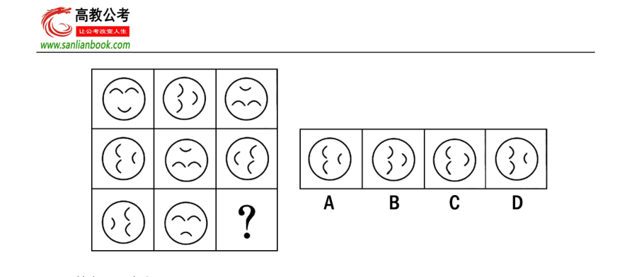

**82.** 左边给定的是纸盒的外表面，下面哪一项能由它折叠而成？  `[2011·合卷·82]`

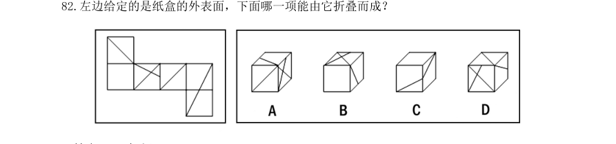

**83.** 从所给的四个选项中，选择最合适的一个填入问号处，使之呈现一定的规律性。  `[2011·合卷·83]`

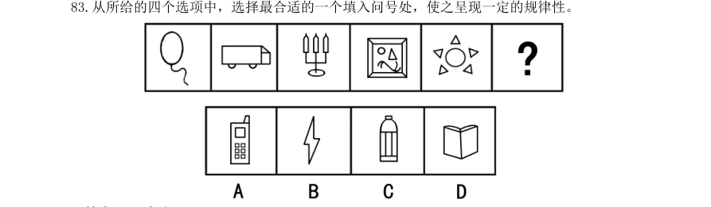

**84.** 从所给的四个选项中，选择最适合的一个填入问号处，使之呈现一定的规律性。  `[2011·合卷·84]`

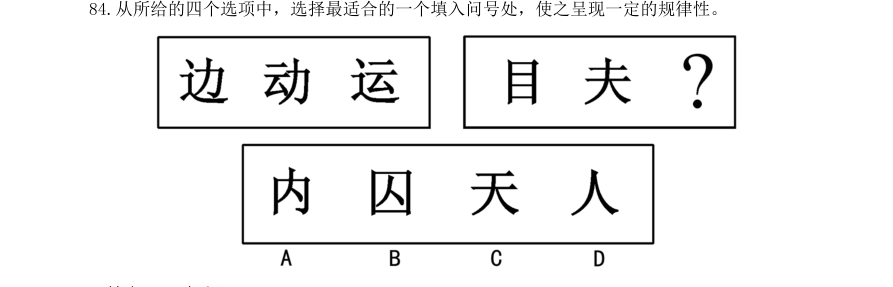

**85.** 从所给的四个选项中，选择最适合的一个填入问号处，使之呈现一定的规律性。  `[2011·合卷·85]`

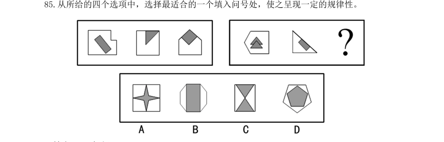

**86.** 把下面的六个图形分为两类，使每一类图形都有各自的共同特征或规律，分类正确的一项是：  `[2011·合卷·86]`
- A. ①③④，②⑤⑥
- B. ①⑤⑥，②③④
- C. ①②⑥，③④⑤
- D. ①②④，③⑤⑥

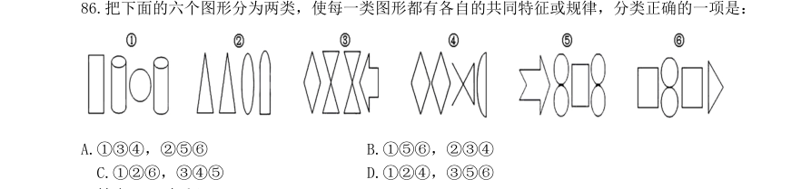

**87.** 把下面的六个图形分为两类，使每一类图形都有各自的共同特征或规律，分类正确的一项是：  `[2011·合卷·87]`
- A. ①②⑤，③④⑥
- B. ①④⑥，②③⑤
- C. ①③④，②⑤⑥
- D. ①③⑤，②④⑥

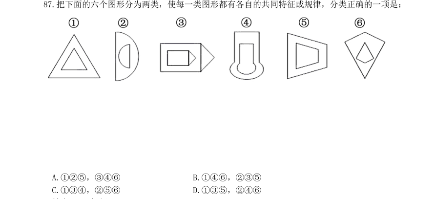

**88.** 把下面的六个图形分为两类，使每一类图形都有各自的共同特征或规律，分类正确的一项是：  `[2011·合卷·88]`
- A. ①③⑥，②④⑤
- B. ①③⑤，②④⑥
- C. ①③④，②⑤⑥
- D. ①⑤⑥，②③④

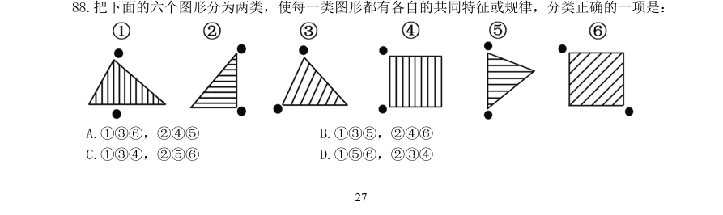

**89.** 把下面的六个图形分为两类，使每一类图形都有各自的共同特征或规律，分类正确的一项是：  `[2011·合卷·89]`
- A. ①②⑥，③④⑤
- B. ①②③，④⑤⑥
- C. ①④⑤，②③⑥
- D. ①④⑥，②③⑤

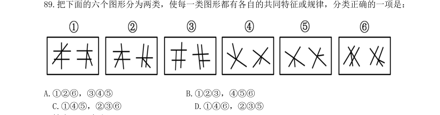

**90.** 把下面的六个图形分为两类，使每一类图形都有各自的共同特征或规律，分类正确的一项是：  `[2011·合卷·90]`
- A. ①③⑥，②④⑤
- B. ①②⑤，③④⑥
- C. ①③④，②⑤⑥
- D. ①④⑤，②③⑥

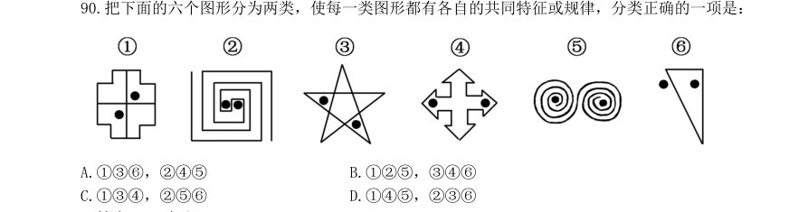

**91.** “社会人”假设是组织行为学家提出的一种与管理有关的人性假设。“社会人”假设认为，人们在工作中得到的物质利益对于调动其生产积极性是次要的，人们最重视在工作中与周围的人友好相处，良好的人际关系对于调动人的工作积极性起决定作用。根据上述定义，下列哪项是基于“社会人”假设的管理方式？  `[2011·合卷·91]`
- A. 员工的奖金与绩效挂钩，并且实行秘薪制
- B. 鼓励、支持员工利用业余时间参加职业培训
- C. 对不同年龄层的员工实行不同的管理措施
- D. 上级和下级不同程度地参与企业决策的研究和讨论

**92.** 顺从是指互动中的一方自愿或王动地调整自己的行为，按另一方的要求行事,即一方服从另一方。顺应的含义比顺从更广泛，除了有顺从的含义外，它还指互动的双方或各方都调整自己的行为，以实现互相适应，根据上述定义，下列行为属于顺应的是  `[2011·合卷·92]`
- A. 王某经常将垃圾堆放在家门口，影响了居民楼内的环境卫生，邻居们向他提出意见后，王某家门口变得干净起来
- B. 小燕经常出色地完成各项工作，经理根据小燕的表现在员工大会上表扬了她，并给予奖励
- C. 某食品厂因存在不正当竞争行为，被工商部门处以20 万元罚款，该厂以罚款过重为由提起行政复议，上级工商部门作出罚款10 万元的决定
- D. 强盛公司与荣发公司有意进行合作，经过多轮激烈地磋商，双方都降低了自己的条件，从而实现了合作目标

**93.** 体验营销是指企业采用让目标顾客观摩、聆听、尝试、试用等方式，使其亲身体验企业提供的产品或服务，让顾客实际感知产品或服务的品质或性能，从而促使顾客认知，喜好并购买的一种营销方式.根据上述定义，下列采用了体验营销方式的是：  `[2011·合卷·93]`
- A. 某美容公司举办了一场以“亲子教育”为主题的消费者联谊会，把“为消费者着想”的经营理念传递给潜在的客户
- B. 某服装公司邀请批发商参加其产品推广介绍会，在会上安排了表演、小竞赛、新产品试用等活动
- C. 某公司为维护行业领军地位，多次举办全国性的行业讨论会，邀请其部分消费者参与研讨
- D. 某化妆品公司先打开国外市场，树立国际品牌形象，然后在国内以电视购物的方式传播销售，逐步占领国内市场

**94.** 行政指令是指行政主体依靠行政组织的权威，运用行政手段，包括行政命令、指示、规定、条倒及规章制度等措施，按照行政组织的系统和层次进行行政管理活动的方法。根据上述定义，下列描述不属于行政指令的是  `[2011·合卷·94]`
- A. 体育局局长签发嘉奖令，表彰在全运会上取得优异成绩的运动员和教练员
- B. 消费者协会同中国家用电器协会正式发布《太阳能热水器选购指南》
- C. 市教育局紧急电话通知，要求全市中小学、幼儿园加强校园安全管理
- D. 市消防大队对未经消防设计备案擅自施工的违法工程下发《责令改正通知书》

**95.** 政策性收益是指由于某些政策、法规的变动而导致的个体收益，这种收益不会导致整个社会财富的增长，只会导致整个社会财富的重新分配。根据上述定义，下列涉及政策性收益的是：  `[2011·合卷·95]`
- A. 由于市相关部门联合整治经营环境，小张经营的书店效益明显好转，每月营业额增加5000 元
- B. 歹徒意欲行凶，小王挺身而出制服了歹徒，因此获得市政府见义勇为奖5 万元
- C. 由于国家加大西部开发力度，某县获得了5000 万元专项水利建设基金
- D. 由于利率调整，小李的存款利息比此前每月增加100 元

**96.** 反应性相倚是指在沟通过程中，沟通双方都以对方的行为作为自己行为的依据,做出相应的反应，而并不按照原来的计划进行沟通。根据上述定义，下列属于反应性相倚的是：  `[2011·合卷·96]`
- A. 妈妈得知小明考试失利准备劝慰一番，但她发现小明的情绪并未受到影响，于是放弃了劝慰小明的打算
- B. 王厂长在大会上宣读了关于加强劳动纪律的发言稿，由于制定的措施不合理，职工在下面议论纷纷，但他还是完成了自己的发言
- C. 张老师认为他为学生准备的口试题目并不难，但是仍有一些学生回答不出,当学生要求张老师提示时，张老师断然拒绝
- D. 小李同意按照编辑意见修改稿件，但希望保留原文的写作风格,与编辑沟通后，编辑表示同意

**97.** 附款行政行为是指除行政法规明确规定外，行政主体根据实际需要在主内容基础上附加从属性内容的行政行为。这里的附款就是附条件，是行政主体规定（而不是行政法规规定）的某种将来的不确定事实或行为，该条件是否符合将决定法律行为的效力。根据上述定义，下列属于附款行政行为的是：  `[2011·合卷·97]`
- A. 某省物价局在关于小儿广谱止泻口服液的价格批复中规定该药物每盒不得高于36 元，此价格从2009 年9 月30 日起执行
- B. 某税务所对王某（现在外地打工）偷税行为作出的处理决定是：处王某罚款1500 元，所处罚款及所欠税款待王某回乡后缴清
- C. 交通警察李某时超速驾驶的刘某作出罚款100 元的处罚决定，同时告知刘某应在规定的时间内到指定地点缴纳罚款，逾期需缴纳滞纳金
- D. 某市人民政府为发展地方经济，规划未来五年内在本市南部建立高新技术产业开发区，吸引一批高新技术企业前来投资

**98.** 反向诱导是指政府、媒体等主体所采取的措施或者宣传活动，在实际的社会生活中不但没有收到预期的效果，反而导致了与预期相反的社会现象大量出现。根据上述定义，下列属于反向诱导的是：  `[2011·合卷·98]`
- A. 某影院为了让观众摘下帽子，在银幕上打出通告：“本院允许老年人戴帽观赏。”结果通告一出，许多观众纷纷摘下了帽子
- B. 某单位要求员工统一着装，结果招致单位很多女员工的强烈反对，最后只好不了了之
- C. 高温季节供水相对紧张，某市自来水公司贴出告示，告知市民近期不会停水，结果导致很多市民在家中大量囤水备用
- D. 某电视台播放预防心理疾病的讲座，很多市民对号入座，觉得自己得了心理疾病，纷纷打电话咨询

**99.** 仿生设计学以自然界万事万物的“形”、“色”、“音”、“功能”、“结构”等为研究对象，有选择地在设计过程中应用这些特征原理，同时结合仿生学的研究成果，为设计提供新的思想、新的原理、新的方法和新的途径，其中，结构仿生设计学主要研究生物体和自然界物质存在的内部结构原理在设计中的应用问题，适用于产品设计和建筑设计。根据上述定义，下列属于结构仿生设计的是  `[2011·合卷·99]`
- A. 设计师根据鱼鳔的作用原理发明了潜艇
- B. 科学家发明了能够模仿鱼类声音的电子诱鱼器
- C. 受变色龙的启发，军方设计出适用于野外作战的迷彩服
- D. 我们的祖先有巢氏受鸟类在树上筑巢的启发，发明“巢居”以防御猛兽的攻击

**100.** 非正式组织是指人们在共同工作或相互接触中，以感情、性格、爱好相投为基础形成的若干人群。这些群体不受正式组织的行政部门和管理层次等的限制，也没有明确规定的正式结构，但在其内部形成一些特定的关系结构，自然涌现出自己的“领导者”，形成一些不成文的行为准则和规范。根据上述定义，下列提及的人群属于非正式组织的是：  `[2011·合卷·100]`
- A. 老王过生日，邀请了十多位同事在自己家中聚会
- B. 小刘下班后和本单位的几名年轻人一起踢足球
- C. 小张是校学生会文艺部部长，经他介绍，几名同学参加了文艺演出
- D. 几位退休职工自发成立老人曲艺社，利用周末时间在社区演出

**101.** 航线︰飞行  `[2011·合卷·101]`
- A. 土壤︰种植
- B. 煤炭︰发电
- C. 提纲︰发言
- D. 地基︰建筑

**102.** 树根︰根雕  `[2011·合卷·102]`
- A. 纸张︰剪纸
- B. 陶土︰瓷器
- C. 竹子︰竹排
- D. 水泥︰砚台

**103.** 亦步亦趋︰主见  `[2011·合卷·103]`
- A. 兴高采烈︰恐惧
- B. 优柔寡断︰果断
- C. 鼠目寸光︰眼力
- D. 孤陋寡闻︰胆识

**104.** 导游︰旅行社︰行程  `[2011·合卷·104]`
- A. 职员︰公司︰总结
- B. 演员︰剧院︰表演
- C. 教师︰学校︰大纲
- D. 司机︰车队︰驾照

**105.** 车轮︰汽车︰运输  `[2011·合卷·105]`
- A. 衣服︰衣架︰晒衣
- B. 镜片︰眼镜︰读书
- C. 听筒︰电话︰通话
- D. 墨汁︰毛笔︰书法

**106.** 治疗︰患者︰医院  `[2011·合卷·106]`
- A. 付款︰顾客︰商场
- B. 观看︰观众︰影院
- C. 判罚︰裁判︰赛场
- D. 改造︰罪犯︰监狱

**107.** 刀︰屠夫︰肉  `[2011·合卷·107]`
- A. 剪刀︰裁缝︰布料
- B. 粉笔︰老师︰黑板
- C. 法律︰法官︰犯人
- D. 相机︰记者︰摄影

**108.** （  ）对于  吉祥  相当于  狼烟  对于（  ）  `[2011·合卷·108]`
- A. 和平  战争
- B. 麒麟  信号
- C. 盛世  烽火
- D. 凤凰  入侵

**109.** （  ）对于  绿茶  相当于  音乐  对于（  ）  `[2011·合卷·109]`
- A. 龙井  浪漫
- B. 早春  娱乐
- C. 咖啡  绘画
- D. 健康  情操

**110.** （  ）对于  表达  相当于  信件  对于（  ）  `[2011·合卷·110]`
- A. 比喻  沟通
- B. 文字  载体
- C. 感情  抒情
- D. 交流  包裹

**111.** 据某知名房产中介机构统计，2010 年9 月份第二周全国十大城市的商品房成交量总体呈上涨趋势，并且与8 月份第二周相比上涨幅度更明显。如果没有其他因素抑制，按照这种趋势发展，9 月份或将创新政以来成交量最高水平，虽然现在还不能明确楼市完全回暖，但未来楼价调控的压力还是很大的。下列最有可能是上述论证前提假设的是：  `[2011·合卷·111]`
- A. 炒房者将大量资金投入楼市
- B. 国家对楼价的调控手段不足
- C. 消费者对房子的购买热情没有减退
- D. 楼市成交量的增长会带动楼价的上涨

**112.** 研究人员认为，如果母亲在怀孕的头几个月接触杀虫剂较多，那么出生的婴儿在智力上可能较差。他们认为，妇女怀孕后不久胚胎大脑便开始发育，因此怀孕前期是婴儿大脑发育的关键时期，接触杀虫剂较多可能改变孕妇体内正在发育的胚胎大脑周围的环境。以下哪项如果为真，最能支持研究人员的观点？  `[2011·合卷·112]`
- A. 由于母亲接触杀虫剂较多，导致许多婴儿提前出生
- B. 杀虫剂对人们的健康是一个潜在的威胁，它还会导致帕金森症、癌症和心理疾病等很多疾病
- C. 此前的研究已经发现，较多地接触杀虫剂会导致孕妇的甲状腺出现问题，而孕妇的甲状腺状况会影响胎儿的智力发育
- D. 研究人员对1500 个孕妇进行了跟踪调查，发现较多地接触杀虫剂的孕妇所生育的孩子在数学和语言学科上表现显著较差

**113.** 知己知彼，才能百战不殆。这句话同样适用于人际交往之中，一个人只有先了解自己，才能了解别人；任何人也只信赖充分了解他的人，包括他自己。试想，如果一个人根本不了解你，他如何值得你信赖呢？由此可以推出：  `[2011·合卷·113]`
- A. 只有信赖自己，才能信赖别人
- B. 不了解自己，就不会被任何人信赖
- C. 他充分了解你，所以他值得你信赖
- D. 充分了解自己，就可以获得许多人的信赖

**114.** 研究人员对四川地区出生的一批恐龙骨骼化石进行分析后发现，骨骼化石内的砷、钡、铬、铀、稀土元素等含量超高，与现代陆生动物相比，其体内的有毒元素要高出几百甚至上千倍。于是一些古生物学家推测这些恐龙死于慢性中毒。如果以下各项为真，不能质疑上述推测的是：  `[2011·合卷·114]`
- A. 恐龙化石附近土壤中的有毒元素会渗进化石
- B. 恐龙化石内还有很多相应的解毒元素
- C. 这批恐龙化石都是老年恐龙，属于自然死亡
- D. 在恐龙化石附近的植物化石里，有毒元素含量很少

**115.** 从世界经济的发展历程来看，如果一国或者地区的经济保持着稳定的增长速度，大多数商品和服务的价格必然会随之上涨，只要这种涨幅始终在一个较小的区间内就不会对经济造成负面影响。由此可以推出，在一定时期内：  `[2011·合卷·115]`
- A. 如果大多数商品价格上涨，说明改过经济在稳定增长
- B. 如果大多数商品价格涨幅过大，对该国经济必然有负面影响
- C. 如果大多数商品价格不上涨，说明该国经济没有保持稳定增长
- D. 如果经济发展水平下降，该国的大多数商品价格也会降低

**116.** 北京市为了缓解交通压力实行机动车辆限行政策，每辆机动车周一到周五都要限行一天，周末不限  `[2011·合卷·116]`
- A. 今天是周六
- B. 今天是周四
- C. A 车周三限行D.C 车周五限行
- D. E 五辆车，保证每天至少有四辆车可以上路行驶。已知：E 车周四限行，B 车昨天限行，从今天算起，A、C 两车连续四天都能上路行驶，E 车明天可以上路。由此可知，下列推测一定正确的是：

**117.** 2008年上半年原油期货价格一度上涨到每桶147美元，是2000年同期价格的4.2倍，年均增长20%，而同期世界经济年均增长率在5%左右，世界石油消费需求并没有出现跳跃式的、急剧的增长。这说明原油价格的迅速攀升并不是由于世界石油供求关系的变化引起的，而是国际投机资本在石油期货市场进行疯狂投机的结果。如果以下各项为真，哪项不能质疑上述推论？  `[2011·合卷·117]`
- A. 2000 年至2008 年，各国政府普遍加大了石油的战略储备量
- B. 较小的经济增长率总带来较大的石油需求增长率
- C. 石油需求变化率和石油价格变化率并不对称
- D. 即便对于国际投机资本来，投资石油期货也是风险巨大

**118.** 一项最新研究发现，经常喝酸奶可降低儿童患蛀牙的风险。在此之前，也有研究人员提出酸奶可预防儿童蛀牙，还有研究显示，黄油、奶酪和牛奶对预防蛀牙并没有明显效果。虽然多喝酸奶对儿童的牙齿有保护作用，但酸奶能降低蛀牙风险的原因仍不明确。目前一种说法是酸奶中所含的蛋白质可附着在牙齿表面，从而预防有害酸侵蚀牙齿。以下哪项如果为真，最能支持这项研究发现？  `[2011·合卷·118]`
- A. 黄油、奶酪和牛奶的蛋白质成分没有酸奶丰富，对儿童牙齿的防蛀效果不明显
- B. 儿童牙龈的牙釉质处于未成熟阶段，对抗酸腐蚀的能力低，人工加糖的酸奶会增加蛀牙的风险
- C. 有研究表明，儿童每周至少食用4 次酸奶可将蛀牙发生率降低15%
- D. 世界是许多国家的科学家都在研究酸奶对预防儿童蛀牙的作用

**119.** S 市规定，适龄儿童须接种麻疹疫苗，适龄儿童必须接受义务教育。右图表示1990 年到2010 年间S 市儿童数量的一些统计，其中M 表示接受义务教育的儿童总数，N 表示新生儿总数，P 表示接种麻疹疫苗的儿童总数。下面哪一项最能解释2000 年到2010 年间S 市接受义务教育的儿童总数与接种麻疹疫苗的儿童总数下降程度的不同？  `[2011·合卷·119]`
- A. 2000 年至2010 年间，有部分在S 市接种麻疹疫苗的儿童没有在S 市入学
- B. 2000 年至2010 年间，约有20%的父母没有按照S 市的规定让他们的孩子接种麻疹疫苗
- C. 2000 年至2010 年间，每年都有不在S 市出生但已接种了麻疹疫苗的儿童在S 市入学
- D. 2000 年至2010 年间，S 市新生儿总数下降，因此入学儿童总数和接种麻疹疫苗的儿童总数也随之下降

**120.** 提起极地冰，很多人眼前总是浮现一幅洁白无瑕，晶莹剔透的景观。然而，在北纬71 度，西经168度附近的北冰洋海域，“雪龙”号首次驶入一片“脏”冰区，只见一块淡蓝色的浮冰中间夹杂了许多脏兮兮的黄色冰块，这种黄色冰块，既出现在当年的新生冰块上，也出现在多年冰块上。对于“人类造成的污染已经殃及极地浮冰”的说法，有专家解释说这只是生活在极地冰中的一种特有生物——黄褐色的冰藻。如果以下各项为真，能够反驳专家上述观点的是：  `[2011·合卷·120]`
- A. 在新生冰块上形成冰藻需要多年
- B. 北极冰中生长有冰藻并不是普遍现象
- C. 近年来人类踏上北极的次数逐年增加
- D. 北冰洋周围的陆地学有沙尘天气

## 2012年 · （2015年前合卷）

**81.** 从所给的四个选项中，选择最合适的一个填入问号处，使之呈现一定的规律性。  `[2012·合卷·81]`

**82.** 从所给的四个选项中，选择最合适的一个填入问号处，使之呈现一定的规律性。  `[2012·合卷·82]`

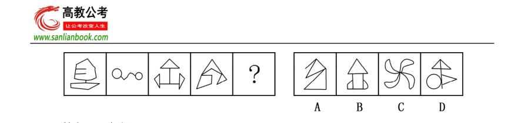

**83.** 从所给的四个选项中，选择最合适的一个填入问号处，使之呈现一定的规律性。  `[2012·合卷·83]`

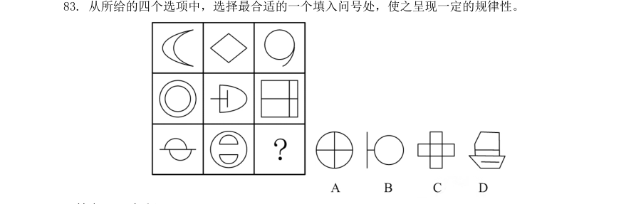

**84.** 从所给的四个选项中，选择最合适的一个填入问号处，使之呈现一定的规律性。  `[2012·合卷·84]`

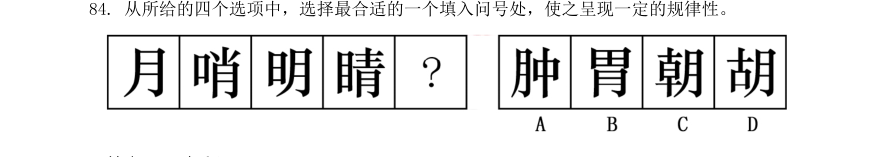

**85.** 左边给定的是纸盒的外表面，右边哪一项能由它折叠而成？  `[2012·合卷·85]`

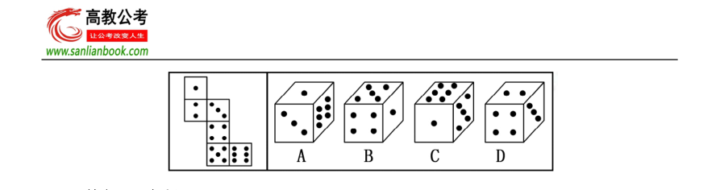

**86.** 把下面的六个图形分为两类，使每一类图形都有各自的共同特征或规律，分类正确的一项是：  `[2012·合卷·86]`
- A. ①②④ ③⑤⑥
- B. ①③④ ②⑤⑥
- C. ①②⑥ ③④⑤
- D. ①③⑤ ②④⑥

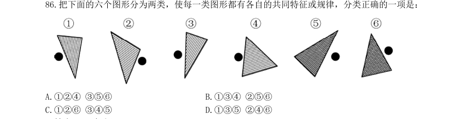

**87.** 把下面的六个图形分为两类，使每一类图形都有各自的共同特征或规律，分类正确的一项是：  `[2012·合卷·87]`
- A. ①④⑥ ②③⑤
- B. ①③⑤ ②④⑥
- C. ①③④ ②⑤⑥
- D. ①③⑥ ②④⑤

**88.** 把下面的六个图形分为两类，使每一类图形都有各自的共同特征或规律，分类正确的一项是：  `[2012·合卷·88]`
- A. ①⑤⑥ ②③④
- B. ①②③ ④⑤⑥
- C. ①②⑥ ③④⑤
- D. ①③⑤ ②④⑥

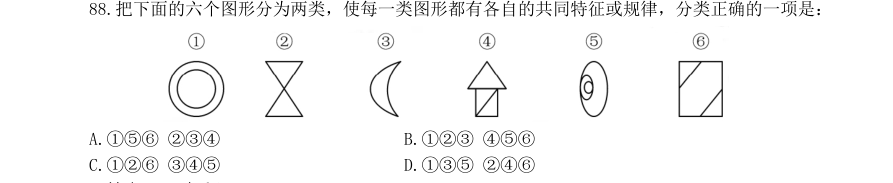

**89.** 把下面的六个图形分为两类，使每一类图形都有各自的共同特征或规律，分类正确的一项是：  `[2012·合卷·89]`
- A. ①②③ ④⑤⑥
- B. ①⑤⑥ ②③④
- C. ①②④ ③⑤⑥
- D. ①④⑥ ②③⑤

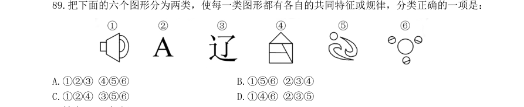

**90.** 把下面的六个图形分为两类，使每一类图形都有各自的共同特征或规律，分类正确的一项是：  `[2012·合卷·90]`
- A. ①②④ ③⑤⑥
- B. ①③④ ②⑤⑥
- C. ①③⑥ ②④⑤
- D. ①④⑥ ②③⑤

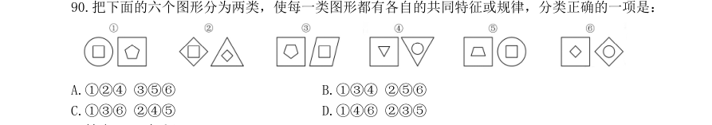

**91.** 群体极化指的是群体成员中存在的某一种倾向性，通过群体相互影响而使结果得到加强并趋于极端化，从而偏离某种合理性的现象。群体极化通常存在两种情形，一种是使结果变得更为冒险甚至激进，成为冒险偏移；一种是使结果变得更加保守，成为谨慎偏移。根据上述定义，下列哪项中的现象不涉及群体极化？  `[2012·合卷·91]`
- A. 一部略带瑕疵的电影在某网络论坛被批驳得一无是处
- B. 经过表决，答辩委员会一致否决了某同学的博士论文答辩
- C. 对某人的不良行为，大家均保持沉默，这使得他气焰更加嚣张
- D. 足球比赛中甲队因犯规被判点球，甲队球迷表示极大不满，并纷纷向场内投掷杂物

**92.** 根据我国有关规定，职工遇有下列情形之一的，可以认定为工伤：（一）在工作时间和工作场所内，因工作原因受到事故伤害的；（二）在工作时间和工作场所内，因履行工作职责受到暴力等意外伤害的；（三）因工外出期间，由于工作原因受到伤害或者发生事故下落不明的；（四）在上下班途中，受到非本人负主要责任的交通事故或者城市轨道交通、客运轮渡、火车事故伤害的。根据上述规定，下列情形中可以认定工伤的是：  `[2012·合卷·92]`
- A. 周某开车在下班途中违章驾驶，与前车发生追尾事故，导致颅骨骨折
- B. 交警小李因纠正王某的违章行为引起王某不满，在上班途中遭到王某的殴打
- C. 赵某在车间加班时因操作不当，手指被绞进机器中，事后被鉴定为二级伤残
- D. 张经理为加深与同事的感情，在工作日邀请同事共进午餐，结果同事在用餐后不慎摔伤

**93.** 包容性增长即为倡导机会平等的增长，最基本的含义是公平合理地分享经济增长。它涉及平等与公平的问题，寻求的是社会和经济的协调发展及可持续发展，与单纯追求经济增长相对立。根据上述定义，下列哪项不涉及包容性增长？  `[2012·合卷·93]`
- A. 增进社会不同阶层的相互理解，对各种社会矛盾增加容忍度
- B. 还田于海，退耕于林，延长禁捕期，对山林进行保护性封育
- C. 反对投资和贸易的地方保护主义，提倡投资和贸易自由化
- D. 在发展经济的同时充分重视社会保障体系的建立

**94.** 动物福利指的是尊重动物的权利，保护生态坏境，促进人与动物协调发展。动物福利主要包括：生理福利，即无饥渴之忧虑；环境福利，即让动物有适当的居所；卫生福利，即尽量减少动物的伤病；行为福利，即保证动物表达天性的自由；心理福利，即减少动物恐惧和焦虑的心情。根据上述定义，下列哪项不涉及动物福利？  `[2012·合卷·94]`
- A. 养鸡场让母鸡在山林中自由觅食，提高产蛋率
- B. 为了科研目的对动物进行活体实验时注射麻药
- C. 在山区修建高速公路时预留多处动物过桥涵洞
- D. 采取多种奖励方式，激发猴子表演高难度动作

**95.** 客体行政文化是指作为行政管理对象的个人、群体和组织对行政主体（主要是指行政机关）的行为做出合理的评价，其评价标准会因各自利益的不同而呈现多样性。根据上述定义，下列属于客体行政文化的是：  `[2012·合卷·95]`
- A. 个体经营者张某未按规定缴税，税务部门向其下达限期缴纳税款的通知书，张某不但置之不理，还责怪税务部门不该向其征税
- B. 某市工商部门为支持当地中小企业的发展，根据有关法律法规对这些企业实施优惠政策，这一举措得到了广大中小企业经营者的欢迎
- C. 某地环保部门加大对污染严重企业的监管力度，其严肃执法的态度受到当地群众的一致好评
- D. 小王是某政府部门工作人员，工作认真负责，他的主管领导和同志都认为小王是一名合格的工作者

**96.** 差别化信贷是指对不同行业、不同群体、不同用途的信贷额度和还贷方式采取差别对待的政策，这是国家对经济进行宏观调控的重要手段，通过差别化信贷遏制两极分化趋势，促进社会公平、促进经济机构调整和全面可持续发展。根据上述定义，下列选项中属于差别化信贷的是：  `[2012·合卷·96]`
- A. 2008 年年初，央行放宽商业银行信贷规模，全国性商业银行在原有信贷规模基础上调增5%，地方性商业银行在原有信贷规模基础上调增10%，共新增约2000 亿元贷款
- B. 某商业银行规定：贷款不满一年提前还款，收取不低于实际还款额三个月的利息；贷款满一年后提前还款，则收取不低于实际还款额一个月的利息
- C. 新购房政策规定：购买首套住房，且套型建筑面积在90 平米以下的家庭，可以享受首付款20%的政策；如果首套住房套型面积大于90 平米，贷款首付款比例不得低于30%
- D. 2009 年，某国际银行对中小企业的贷款总额较去年增长14%，同时又推出"幸福时贷"无担保个人贷款，18-55 岁的本地居民可获得最高50 万元的贷款

**97.** 研究中把实际观测或调查的一部分个体称为样本，研究对象的全部称为总体。抽样误差是指抽样方法本身所引起的误差，即样本指标值与被推断的总体指标值之差。根据上述定义，下列不涉及抽样误差的是：  `[2012·合卷·97]`
- A. 调查员因为粗心、疏忽等原因将样本数据登记错误
- B. 通过随机拨打电话了解大众对某品牌洗发水的忠诚度
- C. 要了解某班学生的数学水平，将他们的数学期中考试成绩进行统计分析
- D. 要调查全国城市居民的婚姻满意度，选取北京200 名已婚者作为调查对象

**98.** 相对剥夺感是指人们在与那些地位相近，又不完全等同于自己的人或群体做比较时，由价值期待和价值能力不一致的认知所产生的一种心理状态。根据上述定义，下列属于相对剥夺感的是：  `[2012·合卷·98]`
- A. 参加学生会竞选的人数比往年多了一倍，小燕感到竞选的压力更大了
- B. 王某从海外名校学成归来，总觉得在单位里无法施展自己的才华和能力
- C. 小张经常出色地完成各项工作，项目组其他人认为小张就是喜欢表现自己
- D. 小杨原本认为自己的工作还不错，但是参加同学聚会后，他觉得跟同学相比显得没有前途

**99.** 军事上的电子欺骗指的是利用电子设备对己方的相关信息进行伪装或者虚假模拟，欺骗敌方的电子侦察，使敌方对己方部署、作战能力和作战企图等产生错误判断，从而达到迷惑和扰乱敌方的目的。根据上述定义，下列涉及电子欺骗的是：  `[2012·合卷·99]`
- A. 军事演习时蓝军故意丢失伪造的电子作战地图，佯装泄露己方情报
- B. 某国将无人机藏匿于敌国领空，冒充敌国领导人编制，发布虚假命令
- C. 二战中盟军虚设了一个司令部，用通讯设备源源不断地发送各种“指挥命令”
- D. 驻扎在太平洋小岛的某部为其计算机系统设置了数量庞大的仿真数据库

**100.** 统计性歧视，是指将一个群体的典型特征推断为群体中的个体具有的特征，并将此特征作为对个体的评价标准。根据上述定义，下列属于统计性歧视的是：  `[2012·合卷·100]`
- A. 小莉觉得周围许多金牛座的人不太诚实，她就认为金牛座的人都不诚实可靠
- B. 公司认为某高校毕业生工作稳定性不够，该校的优秀毕业生小刘因此未被公司录取
- C. 某专家根据北京市过去十年的降雨量推断今年的降雨量将与往年的平均值基本持平
- D. 一名外国游客在旅游区随手乱扔垃圾，周围认为来自这个国家的人素质普遍较低

**101.** 通话记录︰手机  `[2012·合卷·101]`
- A. 硬盘︰计算机
- B. 遥控器︰电视机
- C. 录音磁带︰录音机
- D. 语音文件︰录音笔

**102.** 取款机︰银行职员  `[2012·合卷·102]`
- A. 收音机︰播音员
- B. 售货机︰营业员
- C. 学习机︰辅导员
- D. 读卡机︰售票员

**103.** 琵琶︰木材︰乐器  `[2012·合卷·103]`
- A. 鼎︰青铜︰用具
- B. 水墨画︰宣纸︰工艺
- C. 浮雕︰石块︰建筑
- D. 竹筒︰竹片︰书籍

**104.** B 超︰超声波︰诊断  `[2012·合卷·104]`
- A. 雷达︰天线︰探测
- B. 冰箱︰制冷剂︰冷藏
- C. 相机︰底片︰摄影
- D. 电脑︰显示器︰工作

**105.** 萎靡不振 对于（ ） 相当于（ ）对于 食物  `[2012·合卷·105]`
- A. 动力 饥肠辘辘
- B. 活力 丰衣足食
- C. 精力 饥寒交迫
- D. 毅力 饥不择食

**106.** 一项调查结果显示，78%的儿童中耳炎患者均来自二手烟家庭。研究人员表示，二手烟环境会增加空气中的不健康颗粒，其中包括尼古丁和其他有毒物质。与居住在无烟环境的孩子相比，居住于二手烟环境的孩子患中耳炎几率更大，因此医学专家表示，父母等家人吸烟，是造成儿童患中耳炎的重要原因。下列哪项如果为真，最能削弱上述论证？  `[2012·合卷·106]`
- A. 调查中还显示，无烟家庭的比率呈逐年上升的趋势
- B. 研究证明，二手烟家庭中儿童中耳炎的治愈率较高
- C. 门诊数据显示，儿童中耳炎就诊人数下降了4.6%
- D. 在这次调查的人群中，只有20%的儿童来自无烟家庭

**107.** 任何无法量化及不设定时限的目标都是无效的目标，而任何无效的目标都没有实际操作的方法。因此，详细的职业规划不是无法量化及不设定时限的目标。为使上述论证成立，必须补充以下哪项作为前提？  `[2012·合卷·107]`
- A. 详细的职业规划部都是无效的目标
- B. 详细的职业规划有实际操作的方法
- C. 有效的目标都是可以量化和设定时限的目标
- D. 无法量化及不设定时限的目标没有实际操作的方法

**108.** 某刑事人类学家在对260 名杀人犯的外貌进行了考察后，发现他们具有一些共同的生理特征，于是得出了“杀人犯具有广颚、颧骨突出、头发黑而短特征”的结论。以下哪项与上述推理方式相同？  `[2012·合卷·108]`
- A. 24-28 之间没有质数
- B. 八月十五云遮月，正月十五雪打灯
- C. 植物种子经超声波处理后可增产，所以玉米种子经超声波处理后也可以增产
- D. 某高校在对全校学生进行调查后，得出“我校同学学习态度普遍较好”的结论

**109.** 分手不仅令人心理痛苦，还可能造成身体疼痛。美国研究人员征募40 名志愿者，他们在过去半年中被迫与配偶分手，至今依然相当介意遭人拒绝。研究人员借助功能性磁共振成像技术观察志愿者的大脑活动，结果发现他们对分手等社会拒绝产生反应的大脑部位与对躯体疼痛反应的部位重合，因此分手这类社会拒绝行为会引起他们躯体疼痛。得到上述结论，隐含的假设是什么？  `[2012·合卷·109]`
- A. 个体对于疼痛的感受与社会应激事件有密切关系
- B. 功能性磁共振技术是目前进行大脑定位的常用方法
- C. 个体情绪等心理过程的改变能影响其生理反应
- D. 生理与心理反应可以通过大脑产生关联

**110.** 众所周知，西医利用现代科学技术手段可以解决很多中医无法解决的病症，而中医依靠对人体经络和气血的特殊理解也治愈了很多令西医束手无策的难病。据此，针对某些复杂疾病，很多人认为中西医结合的治疗方法是有必要的。上述这些人在论断时作的假设是：  `[2012·合卷·110]`
- A. 针对这些疾病的中医和西医的治疗方法可以相互结合，扬长避短
- B. 这些疾病单独用中医疗法或者单独用西医疗法并不能有效治疗
- C. 针对这些疾病，医疗界已经掌握了中西医疗法结合的方法
- D. 针对这些疾病，医学界已经尝试了中西医结合的疗法取得了良好的效果

**111.** 近来网上出现了一则有关“公务员绿色出行”的报道，即A 市教育局通过添置公务自行车，使得较近距离的公务活动不再派汽车，从而大幅降低了公务汽车使用率，B 市环保局负责人看了这则报道，认为引进公务员自行车能缩减财政开支，于是决定也采取这种做法。下列哪项如果为真，不能构成上述决定的前提条件？  `[2012·合卷·111]`
- A. 自行车出行的方式结合B 城市的地理环境以及道路交通状况是可行又可取的
- B. B 市环保局的公务人员规模和已有公车数量与A 市教育局相近
- C. 较近距离的公务活动由自行车取代汽车不会影响办公效率
- D. B 市环保局原来的公务活动主要是采用汽车出行的方式

**112.** 某高校外语教研室新招进五位外语老师，每位老师只教授一门外语，并且满足以下条件：（1）如果小钱教德语，那么小孙不教俄语（2）或者小李教德语，或者小钱教德语（3）如果小孙不教俄语，那么小赵不教法语（4）或者小赵教法语，或者小周不教英语以下哪项如果为真，可以得出“小李教德语”的结论？  `[2012·合卷·112]`
- A. 小孙不教俄语
- B. 小钱教德语
- C. 小周教英语
- D. 小赵不教法语

**113.** 美国研究人员分析了南极半岛和邻近的斯科舍海地区的实地数据后发现，20 世纪70 年代以来，当地气温上升了5 至6 摄氏度，并且来自其他海域的哺乳动物增多，导致南极哺乳动物捕食竞争加剧。因此，在上述地区作为哺乳动物主要食物来源的磷虾密度降低了80%，而同一时期，生活在该地区以磷虾为主食的阿德利企鹅和帽带企鹅的数量也急剧减少。由此可以推出：  `[2012·合卷·113]`
- A. 气温上升造成了南极海洋哺乳动物捕食的竞争加剧
- B. 如果磷虾的密度继续减少，阿德利企鹅和帽带企鹅都会灭绝
- C. 气候变暖和哺乳动物的捕食竞争加剧威胁了帽带企鹅的生存
- D. 气温上升对南极地区生态环境的破坏极大

**114.** 张老师将文房四宝装在一个有四层抽屉的柜子里，让学生猜笔、墨、纸、砚分别在哪一层。按照笔、墨、纸、砚的顺序，小李猜测四宝依次装在第一、二、三、四层，小王猜测四宝依次装在第一、第三、第四和第二层，小赵猜测四宝依次装在第四、第三、第一和第二层，而小杨猜测四宝依次装在第四、第二、第三和第一层。张老师说，小赵一个都没有猜对，小李和小王各猜对了一个，而小杨猜对了两个。由此可以推测：  `[2012·合卷·114]`
- A. 第一层抽屉里装的是墨
- B. 第二层抽屉里装的是纸
- C. 第三层抽屉里装的不是笔
- D. 第四层抽屉里装的不是砚

**115.** 碳纳米管材料具有重量轻、强度高等优点，被广泛应用于自行车和球拍等产品的生产中。但是近日研究发现，长期从事生产碳纳米管工作或利用该材料制造其他产品的工人，有可能因吸入碳纳米管而致癌。以下哪项如果为真，最能支持上述研究发现？  `[2012·合卷·115]`
- A. 研究表明，容易引发癌症的是一些较长的碳纳米管，这可能是因为它们更容易卡在肺部或腹部细胞间的空腔中
- B. 在使用体外培养的人体细胞进行实验时显示，碳纳米管可以进入细胞内部，降低细胞自身的免疫能力
- C. 动物实验显示，如果碳纳米管大量进入实验鼠的腹部，约有10%的实验鼠会在一年内腹腔炎症
- D. 石棉是国际癌症组织确认的致癌物质，而碳纳米管在化学分子结构上和石棉存在一些相似之处

## 2013年 · （2015年前合卷）

**76.** 从所给的四个选项中，选择最合适的一个填入问号处，使之呈现一定的规律性：  `[2013·合卷·76]`

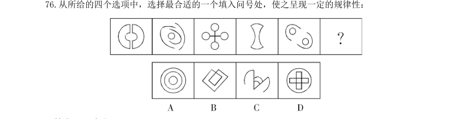

**77.** 从所给的四个选项中，选择最合适的一个填入问号处，使之呈现一定的规律性  `[2013·合卷·77]`

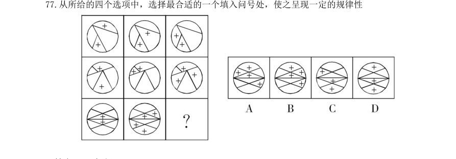

**78.** 从所给的四个选项中，选择最合适的一个填入问号处，使之呈现一定的规律性  `[2013·合卷·78]`

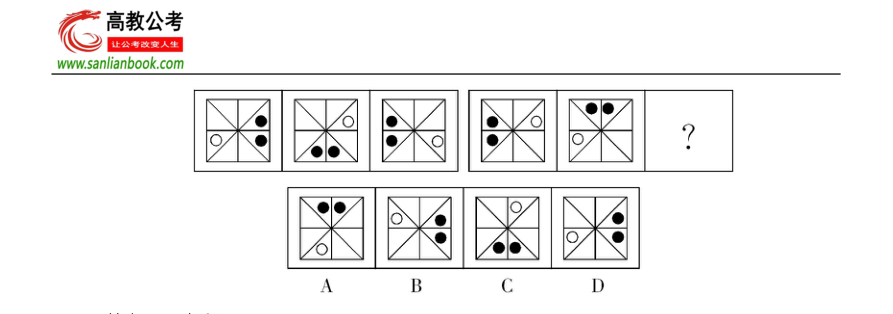

**79.** 一立方体如图所示从中挖掉一个圆锥体，然后从任意面剖开，下面哪一项不可能是该立方体的截面？  `[2013·合卷·79]`

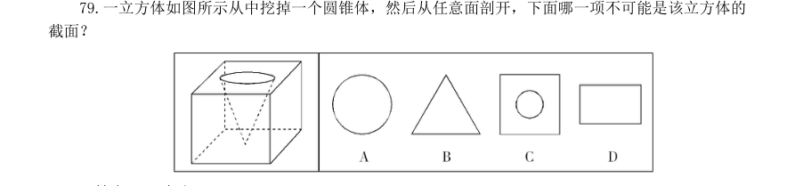

**80.** 左边给定的是纸盒的外表面，下列哪一项能由它折叠而成？  `[2013·合卷·80]`

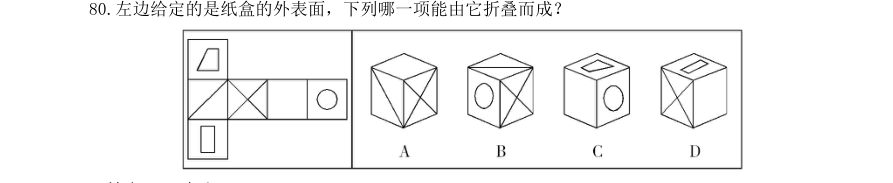

**81.** 把下面六个图形分类，使每一类图形都有各自的共同特征或规律，分类正确的一项是：  `[2013·合卷·81]`
- A. ①④⑥，②③⑤
- B. ①④⑤，②③⑥
- C. ①②⑤，③④⑥
- D. ①③⑥，②④⑤

**82.** 把下面六个图形分类，使每一类图形都有各自的共同特征或规律，分类正确的一项是：  `[2013·合卷·82]`
- A. ①⑤⑥，②③④
- B. ①③④，②⑤⑥
- C. ①②④，③⑤⑥
- D. ①②⑤，③④⑥

**83.** 把下面六个图形分类，使每一类图形都有各自的共同特征或规律，分类正确的一项是：  `[2013·合卷·83]`
- A. ①③④，②⑤⑥
- B. ①②⑤，③④⑥
- C. ①②⑥，③④⑤
- D. ①④⑤，②③⑥

**84.** 把下面六个图形分类，使每一类图形都有各自的共同特征或规律，分类正确的一项是：  `[2013·合卷·84]`
- A. ①③⑤，②④⑥
- B. ①④⑥，②③⑤
- C. ①③④，②⑤⑥
- D. ①②⑤，③④⑥

**85.** 把下面六个图形分类，使每一类图形都有各自的共同特征或规律，分类正确的一项是：  `[2013·合卷·85]`
- A. ①②④，③⑤⑥
- B. ①②③，④⑤⑥
- C. ①③⑥，②④⑤
- D. ①③⑤，②④⑥

**86.** 职业认同是指个人对所从事的职业主观建构的、与职业特征联系在一起的认知和感受，常常包括职业角色的意义感和价值感、职业是否有乐趣和吸引力等。职业认同分为过程性职业认同和状态性职业认同。其中过程性职业认同是指个体从自己经历中逐渐发展出的认同自己职业角色的过程；状态性职业认同是指个体当前对自己所从事职业的认同程度。根据上述定义，下列属于过程性职业认同的是：  `[2013·合卷·86]`
- A. 身为一名警察，老张几十年如一日，始终将维护公共安全的原则牢记于心
- B. 李老师凭借自己灵活的授课方式赢得最佳教师奖，为此她深感自豪
- C. 听完老党员的模范事迹，小赵顿时感觉到作为一名党员干部身上肩负的重任
- D. 陈医生行医多年，“救死扶伤”四个字已从字面意思转变为人生追求

**87.** 获致身份是指一个人经历某种公开的、具有竞争性的奋争或因具备某种特殊的本领而获得的社会地位。根据上述定义，下列选项符合获致身份说法的是：  `[2013·合卷·87]`
- A. 生子当如孙仲谋
- B. 王侯将相宁有种乎
- C. 忠臣必出孝子之门
- D. 上品无寒门，下品无士族

**88.** 制度的反功能指的是该制度实现了系统的某些功能之后而产生的副作用，诸如破坏该系统的内部协调、稳定关系，造成系统内部冲突，对系统良性运行产生破坏作用等现象。根据上述定义，下列涉及制度的反功能的是：  `[2013·合卷·88]`
- A. 某校实行绩效考核，实行一段时间后引发了教师争抢上课、乱发文章等一系列问题
- B. 某售楼处规定销售额可以提成，结果某销售员一个月卖房近50 套
- C. 一对夫妻新婚后实行家庭消费AA 制，一段时间后觉得不方便就取消了
- D. 某部门实行人性化管理，结果上班迟到现象反而比实行考勤制度时减少了

**89.** 优势富集效应是一种起点发展理论，是指起点上的微小优势经过关键过程的级数放大，产生更大级别的优势积累。根据上述定义，下列不属于优势富集效应的是：  `[2013·合卷·89]`
- A. 某名牌大学建校时间很早，文化传统悠久，并拥有政策、资金等多方面支持，全国许多优秀的学生填写高考志愿时都选择了该校
- B. 上海的金茂大厦楼体高度略微超过“东方明珠”电视塔，被誉为“中华第一高楼”，因此吸引了众多游客和广告商，各类会议也常在此举办，呈现后来居上的态势
- C. 某教育培训机构为了拓展业务，也像别的培训机构那样，通过发送宣传单来进行宣传，后来随着规模的不断扩大，服务质量也更上一层楼，成为业内的典范
- D. 某服装品牌设立之初，最先提出要做“夹克之王”的理念，并通过电视媒体进行推广，后来这个概念逐渐被人们认可，许多人都认为买夹克就应该买这个品牌的

**90.** “翻异别勘”是宋代为防止冤假错案而规定的复审制度，是指犯人如果在录问或行刑时提出申诉，案件必须重新审理。宋代的“翻异别勘”分为原审机关的“移司别勘”和“差官别勘”两种形式。“移司别勘”是指由原审机关将案子交给另一个同级的司法机关复审。“差官别勘”是指原审机关将案子申报到上级机关，由上级机关负责差派与原审机关不相干的另外一个机关的官员重新审理。这种情况下，往往或者是差派上级机关的官员前往原审机关主审，或者将案子移往上级机关复审。根据上述定义，下列不属于“翻异别勘”的是：  `[2013·合卷·90]`
- A. 犯人对州县审理的案件提出申诉，可以将案件移交至州县的上级——路的长官进行重审
- B. 宋代中央司法机关刑部分左、右两厅，对其中一厅审理的案件，若犯人提出申诉，则由另一厅重审
- C. 犯人对州县审理的案件提出申诉，州县的上级——路的长官可以亲至州县对案件进行重审
- D. 宋代地方司法机关从上至下分为路、州、县三级，对由县上诉至州的案件作出判决后，若犯人提出申诉，则由州发回县重审

**91.** 求助者有两种求助动机：执行性求助和工具性求助。前者是自己不作任何尝试或努力，只想知道答案或让他人代自己完成任务；后者是借助其他人的力量以达自己解决问题或实现目标的目的。根据上述定义，下列属于工具性求助的是：  `[2013·合卷·91]`
- A. 妈妈为五岁的小明报了很多兴趣班，小明在兴趣班中结识了许多新朋友
- B. 家教老师耐心讲解了这道题的思路和原理后，小斌还是请老师直接给出答案
- C. 综合了多家咨询机构提供的意见，小峰拟定了符合自身条件的出国学习规划
- D. 小文每次阅读英语文章遇到生词时都会查阅电子词典，掌握生词的读音和意思

**92.** 生态演替是指在同一地段上生物群落有规律的更替过程，分为原生演替和次生演替两类。在过去从未有过植被，或者原来有过植被但被彻底破坏，原有植被下的土壤已不复存在的裸地上开始的演替称为原生演替；在原有植被虽已被破坏，但仍保持着土壤和植物繁殖体的地方开始的演替称为次生演替。发生次生演替的生物群落趋向于恢复到破坏前的形态。根据上述定义，下列可能导致次生演替的情形是：  `[2013·合卷·92]`
- A. 人类利用转基因技术培育的植物种子洒向森林
- B. 某岛屿火山爆发之后，火山岩浆覆盖整座岛屿
- C. 当森林被反复砍伐后，演化成为了稀疏的草原
- D. 水坝建成后下游湖泊干涸，沿湖植被大多枯死

**93.** 电子反对抗是指防止敌方或已方的电子对抗措施影响已方的设备和人员作战效能所进行的各种活动，以防护已方的战争力不遭受其损害，主要措施包含电子反侦察、电子反干扰、抗反辐射摧毁、抗定向能致盲和抗计算机病毒传染。根据上述定义，下列选项不涉及电子反对抗的是：  `[2013·合卷·93]`
- A. 军事演习前，演习指挥中心提前对使用的电脑进行病毒查杀
- B. 发射车向敌方发射反辐射导弹，关闭已方电子设备以免误击
- C. 军舰在冲突海域降低雷达发射信号功率，并设置反辐射诱饵
- D. 为对抗敌方电子干扰，指挥部决定重要指令用固定电话下达

**94.** 文化自觉是指生活在一定文化中的人，对自己的文化有“自知之明”，即明白它的来历、形成过程、特色和发展趋向，从而增强自身文化转型的能力，并获得在新的时代条件下进行文化选择的能力和地位。此外，文化自觉还表现为应具有世界眼光，能够理解别的民族的文化，增强与不同文化之间接触、对话、相处的能力。根据上述定义，下列选项属于文化自觉的是：  `[2013·合卷·94]`
- A. 经谈判，中方同意增加美国电影进入中国市场的配额
- B. 为保护贵州梭嘎苗族文化习俗建立了梭嘎生态博物馆
- C. 赵武灵王的“胡服骑射”与北魏拓跋式的“禁断胡语”
- D. 湖北省襄樊市与河南省南阳市都自称是“诸葛亮故里”

**95.** 偶然音乐是指音乐家在创作中将偶然性因素引入创作过程或演奏过程的一种音乐形式。具体方法包括：谱写作品时采用随意手法，允许演奏者进行没有任何提示的即兴演奏，甚至以改造乐器或加入场外声响来演奏曲目。根据上述定义，下列选项不属于偶然音乐的是：  `[2013·合卷·95]`
- A. 指挥家在演出前随机决定使用乐器的数量、演出时长以及参演人数
- B. 在钢琴琴弦中塞进橡皮和铁钉等物以模拟打击乐的声响来演奏音乐
- C. 用掷骰子、丢硬币来确定作品的音高、力度与配器等并创作成曲谱
- D. 演奏者保持沉默，此时台上台下偶然出现的掌声、笑声构成了乐曲

**96.** 认真︰一丝不苟  `[2013·合卷·96]`
- A. 清楚︰一清二楚
- B. 正确︰分毫不差
- C. 温暖︰风和日丽
- D. 干净︰一尘不染

**97.** 火炬︰蜡烛  `[2013·合卷·97]`
- A. 中药︰药材
- B. 矿石︰煤炭
- C. 棉布︰丝绸
- D. 扇子︰蚊香

**98.** X 光片︰骨折  `[2013·合卷·98]`
- A. 卫星云图︰降雨
- B. 科普图书︰知识
- C. 电子导航︰路线
- D. 饮食习惯︰健康

**99.** 柏油公路︰阳光大道  `[2013·合卷·99]`
- A. 蔚蓝行星︰美丽地球
- B. 纳米涂料︰超级墙漆
- C. 双峰骆驼︰沙漠之舟
- D. 液晶屏幕︰璀璨荧屏

**100.** 新月︰满月︰残月  `[2013·合卷·100]`
- A. 生产︰销售︰消费
- B. 含苞︰怒放︰凋零
- C. 早晨︰中午︰夜晚
- D. 春困︰秋乏︰冬眠

**101.** 出征︰击鼓︰士气  `[2013·合卷·101]`
- A. 比赛︰呐喊︰信心
- B. 生产︰监督︰效率
- C. 喝酒︰谈判︰气氛
- D. 宣传︰登报︰名气

**102.** 电动车︰摩托车︰救护车  `[2013·合卷·102]`
- A. 乒乓球︰保龄球︰羽毛球
- B. 葡萄酒︰香槟酒︰保健酒
- C. 天鹅绒︰清洁绒︰法兰绒
- D. 联谊部︰俱乐部︰文学部

**103.** 风险︰规避︰损失  `[2013·合卷·103]`
- A. 保险︰购买︰赔偿
- B. 老人︰关爱︰长寿
- C. 锻炼︰加强︰肥胖
- D. 军队︰保卫︰战争

**104.** （   ）对于  邮费  相当于  纬度  对于（   ）  `[2013·合卷·104]`
- A. 邮局  国家
- B. 重量  气候
- C. 邮票  经度
- D. 距离  时区

**105.** （   ）对于  感时花溅泪  相当于  高兴  对于（   ）  `[2013·合卷·105]`
- A. 伤心  含情杏花草
- B. 哀伤  一日看尽长安花
- C. 多情  化作春泥更护花
- D. 憔悴  人比黄花瘦【答案B。解析：本题考查古诗词的的意境。“感时花溅泪，恨别鸟惊心”出自杜甫的《春望》，意思是说：面对乱世别离的悲凉情景，花也为之落泪，鸟也为之惊心。表现了诗人哀伤之情。按照这个理解，前一个括号里对应的词应该是“哀伤”，后一个括号里对应的词应该是表现“高兴”的诗句。代入选项造句可知，B 项是正确选项。“春风得意马蹄疾，一日看尽长安花”出自孟郊的《登科后》，意思是说：在得意的日子里，趁着和煦的春风，骑着快马，一天的工夫，就赏尽了京都长安所有的鲜花美景。表现了诗人考中进士后的喜悦之情。所以，正确选项是B四、逻辑判断。每道题给出一段陈述，这段陈述被假设是正确的，不容置疑的，要求你根据这段陈述，选择一个答案。注意：正确的答案应与所给的陈述相符合，不需要任何附加说明即可以从陈述中直接推出。

**106.** 研究显示，在115 摄氏度下，将甜玉米分别加热10 分钟、25 分钟和50 分钟后发现，其抗自由基的活性分别升高了22%、44%和53%，因此，加热时间越长的玉米，抗衰老的作用越好。以下各项如果为真，无法削弱上述结论的是：  `[2013·合卷·106]`
- A. 加热65 分钟后，玉米抗自由基的活性反而降低了
- B. 与甜玉米相比，糯玉米在加热相同时间后，其抗自由基的活性增高的幅度很小
- C. 甜玉米是玉米种比较少见的一种，不具有代表性
- D. 对于玉米来说，并非是抗自由基的活性越高，其抗衰老的作用越好

**107.** 5000 多年前某地是大汶口文化，但在距今约4400 年的时候，为龙山文化所代替。是什么原因导致这两种文化的更迭？考古人员发现，在距今4400 年的时候，发生了一次严重的“冷事件”，环境由原来的温暖湿润转变为寒冷干燥，植被大量减少，藻类、水生植物基本绝迹了，大汶口文化向南迁移，而龙山文化由北迁到此地。他们据此认为，距今4400 年左右的极端天气变化，可能是导致这次文化变迁的主要原因。以下哪项如果为真，最可能支持上述论证？  `[2013·合卷·107]`
- A. 大汶口文化有不断向南迁徙的传统
- B. 龙山文化刚迁来时，人口较多，但之后逐渐减少，在距今4400 年的时候消失了
- C. 大汶口文化的族群以藻类和水生植物作为食物的主要来源
- D. 不同生存方式的族群对气候和环境都有相对稳定的需求

**108.** 有研究表明，要成为男性至少需要拥有一条Y 染色体。3 亿年前，男性拥有的Y 染色体在产生之际含有1438 个基因，但现在只剩下45 个。按照这样的速度，Y 染色体将在大约1000 万年内消失殆尽。因此，随着Y 染色体的消亡，人类也将走向消亡。如果以下各项为真，最不能质疑上述论证的是：  `[2013·合卷·108]`
- A. 恒河猴Y 染色体基因确实经历过早期高速的丧失过程，但在过去的2500 万年内则未丢失任何一个基因
- B. 男性即使失去Y 染色体也有可能继续生存下去，因为其他染色体有类似基因可以分担Y 染色体的功能
- C. 人类进化过程中，可以找到单性繁殖或无性繁殖后代的方法，从而避免基因缺失引发的繁殖风险
- D. Y 染色体存在独特的回文结构，该结构具有自我修复功能，可以保持丢失基因的信息，实现基因再生

**109.** 我国的佛教寺庙分布于全国各地，普济寺是我国的佛教庙宇，所以，普济寺分布于我国各地。下面四个选项与题干推理模式最为相近的是：  `[2013·合卷·109]`
- A. 父母酗酒的孩子爱冒险，小华爱冒险，所以小华的父母酗酒
- B. 文明公民都是遵纪守法的，有些大学生遵纪守法，所以有些大学生是文明公民
- C. 寒门学子上大学机会减少，大学生小飞不是寒门学子，所以小飞上大学的机会不会减少
- D. 现在的独生子女娇生惯养，何况他还是三代单传的独苗呢

**110.** 某公司行政部人员手机使用情况如下：①小王拨打过行政部所有人的电话；②小李曾经拨打过小赵的电话，但是小赵不曾拨打过其他人的电话；③不曾接听来自行政部其他人电话的人也就不曾拨打过其他人的电话。由此可以推出：  `[2013·合卷·110]`
- A. 小赵不曾接听过来自小李的电话
- B. 小李曾经接听过来自小王的电话
- C. 行政部曾有人拨打过小王的电话
- D. 小王接听过来自行政部所有人的电话

**111.** 现代企业在管理过程中发现，人力资源管理部门对于公司的发展虽然十分重要，但由于该部门并没有全程参与公司发展战略的决策，而且公司聘请的高级经理均由CEO 决定，所以人力资源管理部门更多的时候起到的是支持和辅助的作用。如果以下各项为真，最能削弱上述结论的是：  `[2013·合卷·111]`
- A. 世界500 强的企业中，人力资源管理部门的员工一般都有丰富的经验
- B. 人力资源管理部门能为公司设计出人性化的报酬体系，进而留住人才
- C. 世界上最大的物流公司，人力资源部经理有权参加公司最高决策会议
- D. 人力资源部里没有决定雇佣高级经理的权力，但有权雇佣中层管理者

**112.** 有人说，工作的时候，我们要将重要事务放在主要位置。重要事务是必要条件，关系着一件事情成功与否。重要的事务没做好，一定不成功。但是，细节也是很重要的，细节是成功的充分条件，同样也与一件事情成功与否相关。一个成功的人是能够协调好重要事务与细节的关系的。由此可以推出：  `[2013·合卷·112]`
- A. 成功并不代表着所有细节都处理好了
- B. 如果不成功则说明重要事务没有做好
- C. 成功的前提条件是既要做好重要事务，又要处理好细节
- D. 虽然处理好了细节，但没有做好重要事务，也不一定成功

**113.** 在不同语言中，数字的发音和写法都不一样。一些科学家认为，代表不同文化背景的语言，会对人们大脑处理数学信息的方式产生影响。以下哪项如果为真，最能支持上述结论：  `[2013·合卷·113]`
- A. 相比欧洲，亚洲地区的人们在进行数量大小比较时，大脑中个别区域的活跃程度有所不同
- B. 在同一国家，不同方言的人们进行数学运算时，大脑语言区的神经传递路线并不十分一致
- C. 研究发现，以英语为母语的人进行心算时主要依赖大脑的语言区，而以中文为母语的人主要动用了大脑的视觉信息识别区
- D. 研究发现，不同专业背景的人们在计算数学题时会选择不同的思考方法，但都会不同程度的依赖大脑的语言区

**114.** 20 世纪50 年代依赖，人类丢弃了多达10 亿吨塑料，这种垃圾可能存在数百年甚至数千年。近日，一个科研小组在亚马逊雨林中发现一种名为内生菌的真菌，它能降解普通的聚氨酯塑料。科研人员认为，利用这种真菌的特性，将有希望帮助人类消除塑料垃圾所带来的威胁。科研人员的判断还需要基于以下哪一前提：  `[2013·合卷·114]`
- A. 塑料垃圾是人类活动产生的最主要的废弃物种类
- B. 内生菌在任何条件下都可以很好的分解塑料制品
- C. 目前绝大多数塑料垃圾都属于普通的聚氨酯塑料
- D. 这种真菌在地球上其他地区也能正常的存活生长

**115.** 生物处于污染条件下，可以通过结合固定、代谢解毒、分室作用等过程将污染物在体内富集、解毒，其中生物的解毒能力是生物抗性的基础，解毒能力强的生物都具有抗性，但解毒能力不是抗性的全部，抗性强的生物不一定解毒能力就强。由此可以推知：  `[2013·合卷·115]`
- A. 解毒能力不强的生物不具有抗性
- B. 具有抗性的生物一定具有较强的解毒能力
- C. 生物可将污染物富集、解毒，所以生物能在污染环境下生存
- D. 不具有抗性的生物解毒能力一定不强

## 2014年 · （2015年前合卷）

**76.** 从所给的四个选项中，选择最合适的一个填入问号处，使之呈现一定的规律性：  `[2014·合卷·76]`

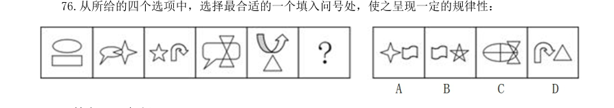

**77.** 从所给的四个选项中，选择最合适的一个填入问号处，使之呈现一定的规律性：  `[2014·合卷·77]`

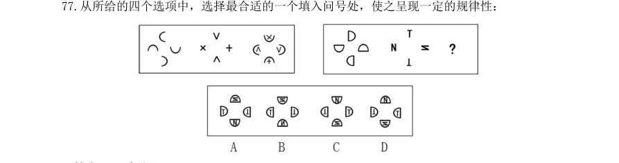

**78.** 从所给的四个选项中，选择最合适的一个填入问号处，使之呈现一定的规律性：  `[2014·合卷·78]`

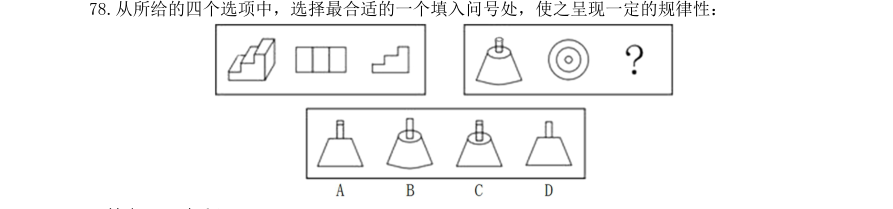

**79.** 从所给的四个选项中，选择最合适的一个填入问号处，使之呈现一定的规律性：  `[2014·合卷·79]`

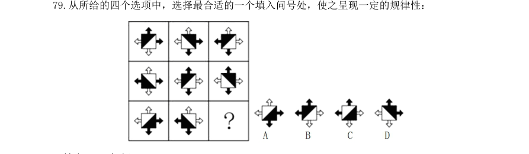

**80.** 下图中的立体图形①是由立体图形②、③和④组合而成，下列哪一项能够填入问号处？  `[2014·合卷·80]`
> （本题选项为图片，请配合原始PDF查看）

**81.** 把下面的六个图形分为两类，使每一类图形都有各自的共同特征或规律，分类正确的一项是：  `[2014·合卷·81]`
- A. ①②⑥，③④⑤
- B. ①④⑥，②③⑤
- C. ①③④，②⑤⑥
- D. ①③⑤，②④⑥

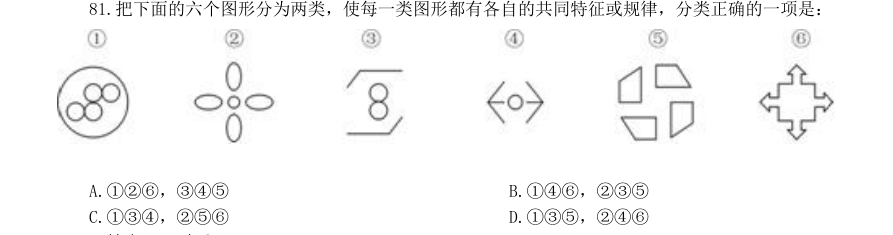

**82.** 把下面的六个图形分为两类，使每一类图形都有各自的共同特征或规律，分类正确的一项是：  `[2014·合卷·82]`
- A. ①④⑥，②③⑤
- B. ①②③，④⑤⑥
- C. ①③⑥，②④⑤
- D. ①⑤⑥，②③④

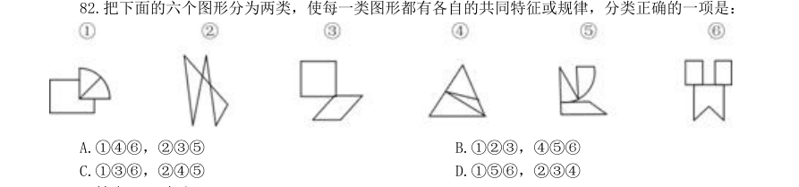

**83.** 把下面的六个图形分为两类，使每一类图形都有各自的共同特征或规律，分类正确的一项是：  `[2014·合卷·83]`
- A. ①②⑥，③④⑤
- B. ①③⑥，②④⑤
- C. ①④⑤，②③⑥
- D. ①③④，②⑤⑥

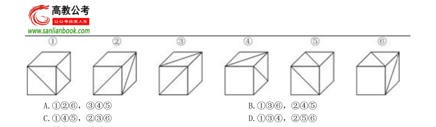

**84.** 把下面的六个图形分为两类，使每一类图形都有各自的共同特征或规律，分类正确的一项是：  `[2014·合卷·84]`
- A. ①③⑤，②④⑥
- B. ①②⑤，③④⑥
- C. ①④⑤，②③⑥
- D. ①③④，②⑤⑥

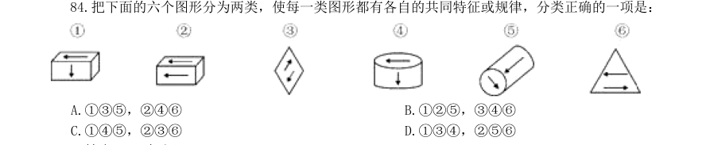

**85.** 把下面的六个图形分为两类，使每一类图形都有各自的共同特征或规律，分类正确的一项是：  `[2014·合卷·85]`
- A. ①③⑤，②④⑥
- B. ①③⑥，②④⑤
- C. ①③④，②⑤⑥
- D. ①④⑤，②③⑥

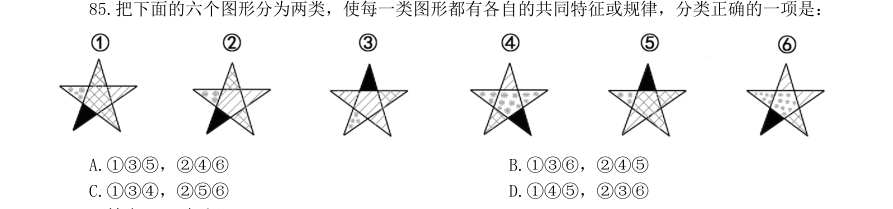

**86.** 选择性曲解是指人们面对客观事物，经常会不自觉地把外界输入的信息与头脑中早已存在的模式相结合，从而出现根据自己固有的价值体系和既定的情感好恶来解释所接收信息的倾向。根据上述定义，下列属于选择性曲解的是：  `[2014·合卷·86]`
- A. 爱屋及乌
- B. 指鹿为马
- C. 按图索骥
- D. 度日如年

**87.** 扩大论题和缩小论题在辩论赛中很常见。在相互的辩驳中，辩手们常常故意扩大对方的论题，将对方的论题推到荒谬的地步，以利于本方的反驳和进攻；同时为了利于本方立论与防守，辩手们又常常故意缩小本方的论题。根据上述定义，下列采用了扩大论题的是：  `[2014·合卷·87]`
- A. 将论题“中学生异性交往弊大于利”解释成“中学生异性过分密切交往必定弊大于利”
- B. 将论题“人性本恶”解释成“人具有与生俱来的本能和欲望，因此人性是恶的”
- C. 将论题“德国人很严谨”解释成“所有德国人都很严谨”
- D. 将论题“人性本善”解释成“没有人不是善的”

**88.** 组织控制是指组织用各种规章制度和奖惩手段来约束组织成员行为，以保证组织的决策和指令能够有效地贯彻执行，维护组织的各项秩序。根据上述定义，下列最能体现组织控制的是：  `[2014·合卷·88]`
- A. 某高校不断加强对外交流，派遣访问学者的名额逐年增加
- B. 某公司每年举办新人入职会，以便让新加入团队的成员熟悉环境
- C. 某生产厂商为了提高员工生产积极性，薪酬计算由原来的计时绩效改为计件绩效
- D. 某外企实行上班打卡制，如果员工去见客户可以不用打卡，但须在前一天向上级报告

**89.** 矩阵对策是指处于利益竞争的两个关系主体，各自可选的策略有限，且在一局对策中双方得失和为零的现象，即要不成功、要不失败。对策中，一方真正成功的措施应该是，针对对方所采取的行动相应地制定有利于自己的应对策略，各方选择的策略必定是自己对对方策略预测的最佳反应。根据上述定义，下列属于矩阵对策的是：  `[2014·合卷·89]`
- A. 齐王和田忌按原条件重新赛马，并约定每局比赛须用同等级的马参赛
- B. 劳资双方进行薪资谈判，经过反复的讨价还价，最终双方都作出让步
- C. 在进入奥运女子排球决赛后，某国家队重新安排队员阵容和出场顺序
- D. 丈夫要去踢球，妻子要去看电影，儿子要去游乐园，最后三人去郊游

**90.** 签名效应是指当人们在纸上写下自己名字时，大脑中的自我意识会加强，此时看到喜欢的东西，更容易把物品和自己联系起来，产生“这个东西真适合我”等想法，从而激发购买欲望。根据上述定义，下列现象可用签名效应解释的是：  `[2014·合卷·90]`
- A. 快递公司坚持“先签字后验货”的做法
- B. 采取实名捐款的办法能够募捐到更多善款
- C. 手术前，患者被要求在《知情同意书》上签字
- D. 中介公司要求租客在看房前签订《看房协议书》

**91.** 内隐学习是指一种无需意志努力的潜意识的学习。这种学习的特点在于人们潜意识地获得某种知识，而且无需意志努力就可以将这些知识提取出来，并应用于特定任务的操作中。根据上述定义，下列不属于内隐学习的是：  `[2014·合卷·91]`
- A. 小张在高考前做了大量数学习题，因此在数学考试中获得高分
- B. 小李经常看别人下象棋，时间一长，他也掌握了下象棋的方法
- C. 儿童无需系统地学习语词和语法规则，不知不觉地就会说母语
- D. 生长在京剧世家的孩子耳濡目染，很小就会唱京剧

**92.** 注意分为内源性和外源性注意。内源性注意是指个体根据自己的目标或意图来分配注意支配行为，是主动注意；外源性注意是指由个体外部信息引起的个体注意，是被动注意。根据上述定义，下列属于内源性注意的是：  `[2014·合卷·92]`
- A. “轰”的一声响，大家不由地都回头看了一眼
- B. 六一儿童节，公园里奇幻的魔术表演受到许多小朋友和家长的喜爱
- C. 超市琳琅满目的商品，包装各异、颜色鲜亮，吸引了许多顾客的眼球
- D. 根据客户的要求，广告设计师特别关注了大量以温馨家园为题材的售楼广告素材

**93.** 顺从型互动是指行动者之间发生性质相同或方向一致的行动过程，常有三种形式：有意无意向他人发出信号或暗示，并引起他人反应；不经过考量，直接按照他人的方式去行动；行动者在他人压力下接受他人行动方式，并且照做。根据上述定义，下列不属于顺从型互动的是：  `[2014·合卷·93]`
- A. 很多投资者寻找项目时什么热就投资什么，股票热时炒股票，翡翠热时炒翡翠
- B. 大家对小刘的业务能力有目共睹，连素来挑剔的老主任也赞成选小刘为业务主管
- C. 护士阿姨一边说“不哭啊，一点都不疼”，一边在毛毛的手臂上注射，毛毛果然没哭
- D. 小文对新来的家教老师不满意，但无奈于父母的苦心和已缴的学费，还是开始了家教课程

**94.** 红旗原则是指如果侵犯著作权的事实是显而易见的，网络服务商就不能装作看不见，或以不知道侵权的理由来推脱责任。根据上述定义，下列适用红旗原则的情形是：  `[2014·合卷·94]`
- A. 未经用户许可，某客户端软件就能够自动扫描，获取用户个人数据
- B. 甲某利用网络服务商提供的免费存储空间，非法经营盗版影视作品
- C. 乙某上传正在首播的某热门电视剧，并被网站编辑推荐到下载首页
- D. 丙某通过第三方在有下载功能的互联网电视上获取未经授权的节目

**95.** 角色混同指的是将自己所具有的不同角色相混淆，而发生的导致背离角色期待和角色规范的行为。根据上述定义，下列哪项属于角色混同？  `[2014·合卷·95]`
- A. 到北京来打工的某外省青年有时不自觉地说起家乡话，常常弄得同事莫名其妙
- B. 庄周梦见自己变成蝴蝶，醒过来之后惊惶不一，庄周不知自己梦中变成了蝴蝶，还是蝴蝶梦中变成了自己
- C. 小王是个游戏迷，他常常将工作中的同事假想成游戏中的玩家，也常常将游戏中的玩家想象成自己的某个同事
- D. 老李是某局局长，对于儿子提出的要求，他常常不自觉地说：“这事得和其他同志研究研究。”为此，他多次受到妻子的批评

**96.** 创新︰僵化  `[2014·合卷·96]`
- A. 开放︰闭塞
- B. 发展︰前途
- C. 计划︰秩序
- D. 革新︰失败

**97.** 厨师︰炒鱿鱼  `[2014·合卷·97]`
- A. 法官︰和稀泥
- B. 司机︰开天窗
- C. 脚夫︰撂挑子
- D. 高手︰摆擂台

**98.** 生命︰动物  `[2014·合卷·98]`
- A. 绿色︰植物
- B. 思维︰人类
- C. 收获︰秋季
- D. 节气︰历法

**99.** 抽样调查︰抽样原则  `[2014·合卷·99]`
- A. 调查问卷︰征求意见
- B. 人物访谈︰访谈内容
- C. 数学模型︰建模软件
- D. 设备操作︰操作规程

**100.** 交通︰拥堵︰治理  `[2014·合卷·100]`
- A. 生活︰贫困︰救济
- B. 食材︰讲究︰享用
- C. 音乐︰动感︰聆听
- D. 健康︰虚弱︰保健

**101.** 红茶︰发酵︰保健  `[2014·合卷·101]`
- A. 丝绸︰染色︰收藏
- B. 玉镯︰磨制︰装饰
- C. 石油︰蒸馏︰燃烧
- D. 中药︰采摘︰治病

**102.** 言而有信︰言而无信︰承诺  `[2014·合卷·102]`
- A. 童叟无欺︰明码实价︰交易
- B. 心满意足︰贪心不足︰满意
- C. 言之凿凿︰口说无凭︰证据
- D. 文思泉涌︰搜索枯肠︰知识

**103.** 木材︰抽屉︰收纳  `[2014·合卷·103]`
- A. 钢铁︰剪刀︰切割
- B. 棉花︰毛线︰保暖
- C. 城墙︰石头︰防御
- D. 橡胶︰气垫︰缓冲

**104.** ( ) 对于 国家 相当于 免疫 对于 ( )  `[2014·合卷·104]`
- A. 民族；脱敏
- B. 人民；淋巴
- C. 国防；生物
- D. 阶级；疫苗

**105.** 坚若磐石 对于 ( ) 相当于 ( ) 对于 良心  `[2014·合卷·105]`
- A. 懦弱；金石为开
- B. 意志；知恩图报
- C. 信心；落井下石
- D. 品质；铁石心肠

**106.** 在南极海域冰冷的海水中，有一种独特的鱼类，它们的血液和体液中具有一种防冻蛋白，因为该蛋白它们才得以存活并演化至今。但时至今日，该种鱼类的生存却面临巨大挑战。有人认为这是海水升温导致的。以下哪项如果为真，最能支持上述观点？  `[2014·合卷·106]`
- A. 南极海水中的含氧量随气温上升而下降，缺氧导致防冻蛋白变性，易沉积于血管，导致供血不足，从而缩短鱼的寿命
- B. 防冻蛋白能够防止水分子凝结，从而保证南极鱼类正常的活动，气候变暖使得该蛋白变得可有可无
- C. 南极鱼类在低温稳定的海水中能够持续的演化，而温暖的海水不利于南极鱼类的多样性
- D. 并非所有南极种都具有防冻蛋白，某些生活于副极地的物种并没有这种蛋白

**107.** 该不该让小孩玩电脑游戏？这让很多家长困扰，因为有太多的报告指责游戏正摧毁下一代，不过一项新的研究显示，玩游戏有益于小孩的阅读能力，甚至可帮助他们克服阅读障碍。以下哪项如果为真，最不能支持上述结论？  `[2014·合卷·107]`
- A. 研究发现，如果让孩子们玩体感游戏，即依靠肢体动作变化来操作的游戏，累计超过12 小时，孩子的阅读速度及认字准确率会显著提升
- B. 长期玩游戏的儿童阅读游戏规则更容易，还会对游戏中出现的画面变得敏感，但却对周围的事物表现冷漠
- C. 相比玩单机版游戏的儿童，玩网络互动游戏的儿童会更加注重要互交流，因此他们的阅读能力提高得更快
- D. 儿童阅读障碍主要与神经发育迟缓或出现障碍有关，游戏只能暂时提高阅读速度，却无法克服阅读障碍

**108.** 在一项实验中，让80 名焦虑程度不同的女性完成同样的字母识别任务，同时在她们头上放置电极，观察大脑活动，结果表明，焦虑程度高的女性完成任务时脑电活动更复杂，更容易出错。实验者由此得出结论：女性焦虑影响完成任务的质量。以下哪项如果为真，最能反驳上述结论？  `[2014·合卷·108]`
- A. 焦虑程度高的女性与其他女性相比在实验前对任务不熟悉
- B. 女性焦虑时，大脑会受到各种思绪的干扰而无法专注
- C. 女性焦虑容易引发强迫症、广泛性焦虑等心理问题
- D. 有研究显示，焦虑和大脑反应错误率是正相关的

**109.** 如果用户手机里安装了企业的手机客户端，那么就可以大大提高用户浏览手机时看到企业标识和名称的机会，进而达到宣传企业形象和品牌的目的，提高企业知名度。上述结论的假设前提是：  `[2014·合卷·109]`
- A. 手机用户数量增长势头强劲
- B. 手机客户端是一项成熟的技术
- C. 手机用户有浏览手机的习惯
- D. 手机营销的时效强、成本低

**110.** 研究发现，试管婴儿的出生缺陷率约为9%，自然受孕婴儿的出生缺陷率约为6.6%。这两部分婴儿的眼部缺陷比例分别为0.3%和0.2%，心脏异常比例分别为5%和3%，生殖系统缺陷的比例分别为1.5%和1%。因而可以说明，试管婴儿技术导致试管婴儿比自然受孕婴儿出生缺陷率高。以下哪项如果为真，最能质疑该结论？  `[2014·合卷·110]`
- A. 试管婴儿要经过体外受精和胚胎移植过程，人为操作都会加大受精卵受损的风险
- B. 选择试管婴儿技术的父母大都有生殖系统功能异常，这些异常会令此技术失败率增加
- C. 试管婴儿在体外受精阶段可以产生很多受精卵，只有最优质的才被拣选到母体进行孕育
- D. 试管婴儿的父母比自然受孕婴儿的父母年龄大很多，父母年龄越大，新生儿出生缺陷率越高

**111.** 调查显示，中国消费者对奢侈品品牌的忠诚度远远低于西方消费者，对许多中国消费者而言，高价格仍然很重要，物有所值仍然比品牌重要，而且现阶段甚至比质量还重要。由此可以推出：  `[2014·合卷·111]`
- A. 中国消费者喜欢购买价格高且物有所值的奢侈品
- B. 中国消费者购买奢侈品时往往不会考虑价格因素
- C. 中国消费者不甚关注知名奢侈品的价格及其质量
- D. 比起知名度来，奢侈品的价格更吸引中国消费者

**112.** 素数是指只含有两个因子的自然数（即只能被自身和1 整除）。孪生素数，是指两个相差为2的素数。比如，3 和5，17 和19 等。所谓的孪生素数猜想，是由希腊数学家欧几里得提出的，意思是存在着无穷对孪生素数。该论题一直末得到证明。近期，美国一位华人讲师的最新研究表明，虽然还无法证明存在无穷多个之差为2 的素数对，但存在无穷多个之差小于7000 万的素数对。有关方面认为，如果这个结果成立，那么将是数论发展的一项重大突破。以下哪项如果为真，最能支持有关方面的观点？  `[2014·合卷·112]`
- A. 7000 万这个数字很大，离孪生素数猜想给出的2 还有很大距离
- B. 这是第一次有人正式证明存在无穷多组间距小于定值的素数对
- C. 关于孪生素数猜想的证明需要一个漫长的、逐步推进的过程
- D. 这位华人讲师长期从事数学领域的相关教学和科研工作

**113.** 一个人生活虽然很难，但也必须学会一个人，不要轻易依赖别人。这样以后身边的人都离开你的时候，你还可以好好活下去。如果以上为真，则以下哪项为真？  `[2014·合卷·113]`
- A. 不能独自生活的人，在身边的人都离开他的时候，就无法好好活下去
- B. 一个人生活虽然很难，但也比身边的人都离开他的时候要来得容易些
- C. 不要轻易依赖别人，因为一个人生活的时候会很艰难无法好好活下去
- D. 身边人都离开时还可以好好活，末必是因你以前学会如何一个人生活

**114.** 研究小组利用超级计算机模拟宇宙，并结合多种其他计算，证明了在我们这个加速膨胀的宇宙中，描述大尺度时空结构的因果关系网络曲线图，是一个具有显著聚类特征的幂函数曲线，和许多复杂网络如互联网、社交网、生物网络等惊人地相似。由此可以推出：  `[2014·合卷·114]`
- A. 人脑研究有助于了解宇宙的结构
- B. 宇宙就是一个大脑或一台计算机
- C. 复杂系统演化存在某种相似法则
- D. 宇宙万物的演化遵循同样的规律

**115.** 某局办公室共有10 个文件柜按序号一字排开。其中1 个文件柜只放上级文件，2 个只放本局文件，3 个只放各处室材料，4 个只放基层单位材料。要求：（1）1 号和10 号文件柜放各处室材料；（2）两个放本局文件的文件柜连号；（3）放基层单位材料的文件柜与放本局文件的文件柜不连号；（4）放各处室材料的文件柜与放上级文件的文件柜不连号。已知4 号文件柜放本局文件，5 号文件柜放上级文件，由此可以推出：  `[2014·合卷·115]`
- A. 6 号文件柜放各处室材料
- B. 7 号文件柜放各处室材料
- C. 2 号文件柜放基层单位材料
- D. 9 号文件柜放基层单位材料

## 2015年 · 副省级

**76.** 从所给四个选项中，选择最合适的一个填入问号处，使之呈现一定规律性：  `[2015·副省·76]`
> （本题选项为图片，请配合原始PDF查看）

**77.** 从所给四个选项中，选择最合适的一个填入问号处，使之呈现一定规律性：  `[2015·副省·77]`
> （本题选项为图片，请配合原始PDF查看）

**78.** 从所给四个选项中，选择最合适的一个填入问号处，使之呈现一定规律性：  `[2015·副省·78]`
> （本题选项为图片，请配合原始PDF查看）

**79.** 一正方体如下图所示切掉了上半部分的3/4。现在从任意面剖开，下面哪一项不可能是该多面体的截面？  `[2015·副省·79]`

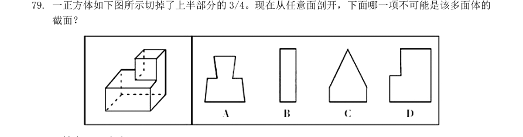

**80.** 左边给定的是纸盒的外表面，下列哪一项能由它折叠而成?  `[2015·副省·80]`

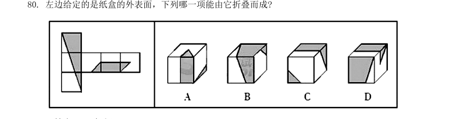

**81.** 把下面的六个图形分为两类，使每一类图形都有各自的共同特征或规律，分类正确的一项是：  `[2015·副省·81]`
- A. ①②⑥，③④⑤
- B. ①④⑤，②③⑥
- C. ①②⑤，③④⑥
- D. ①②③，④⑤⑥

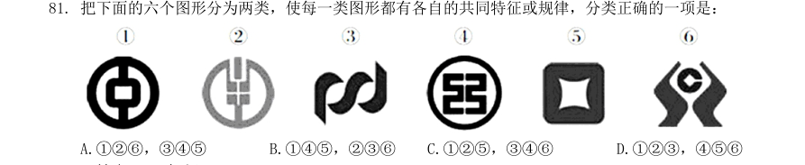

**82.** 把下面的六个图形分为两类，使每一类图形都有各自的共同特征或规律，分类正确的一项是：  `[2015·副省·82]`
- A. ①③④，②⑤⑥
- B. ①②⑥，③④⑤
- C. ①③⑤，②④⑥
- D. ①⑤⑥，②③④

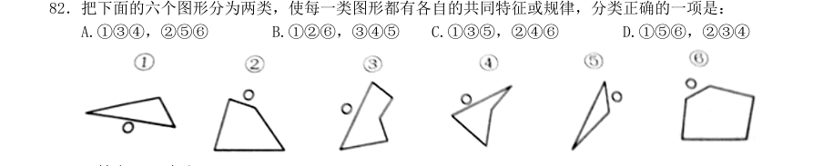

**83.** 把下面的六个图形分为两类，使每一类图形都有各自的共同特征或规律，分类正确的一项是：  `[2015·副省·83]`
- A. ①②③，④⑤⑥
- B. ①③⑤，②④⑥
- C. ①②⑥，③④⑤
- D. ①④⑥，②③⑤

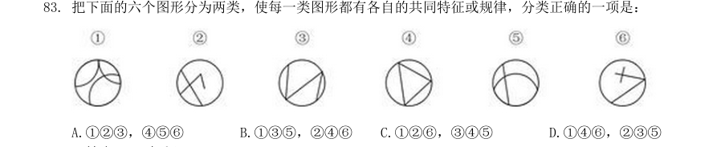

**84.** 把下面的六个图形分为两类，使每一类图形都有各自的共同特征或规律，分类正确的一项是：  `[2015·副省·84]`
- A. ①⑤⑥，②③④
- B. ①③⑤，②④⑥
- C. ①②③，④⑤⑥
- D. ①②⑤，③④⑥

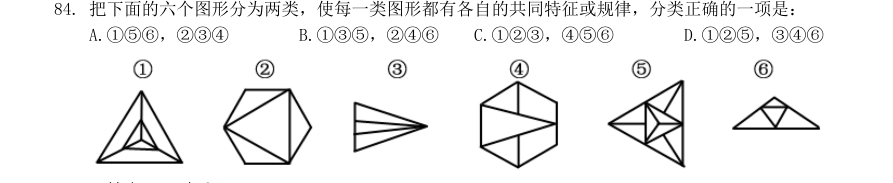

**85.** 把下面的六个图形分为两类，使每一类图形都有各自的共同特征或规律，分类正确的一项是：  `[2015·副省·85]`
- A. ①②④，③⑤⑥
- B. ①③④，②⑤⑥
- C. ①④⑥，②③⑤
- D. ①⑤⑥，②③④

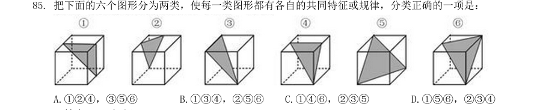

**86.** 垂直绿化指的是利用攀援植物向空中生长进行纵向绿化的一种方式，以期达到在有限面积内最大限度地利用空气和阳光来提高绿化的效率。根据上述定义，下列涉及垂直绿化的是：  `[2015·副省·86]`
- A. 爬山虎爬满了墙头和屋顶
- B. 松树林从山脚一直延伸到山顶
- C. 利用巴根草匍匐攀援的特性，人们在沙漠中逐渐开拓出一片绿洲
- D. 在丘陵地区，人们常使用飞机从空中播种的方式对山地进行绿化

**87.** 赋、比、兴指的是诗歌的三种表现手法。赋：铺陈直叙，把思想感情及其有关的事物平铺直叙地表达出来；比：类比，以彼物比此物，使此物更加生动具体、鲜明浅近；兴：先言他物，然后借以联想，引出诗人所要表达的事物、思想、感情。根据上述定义，下列诗句中使用了“比”的是：  `[2015·副省·87]`
- A. 死生契阔，与子成说。执子之手，与子偕老
- B. 七月流火，九月授衣。春日载阳，有鸣仓庚
- C. 我心匪石，不可转也。我心匪席，不可卷也
- D. 手如柔荑，肤如凝脂，领如蝤蛴，齿如瓠犀

**88.** 经济学中，系统内部个别效率较高的组织的出现，会对其他效率较低的组织的存在和发展构成破坏或抑制，人们把这种作用称为“顶尖效应”。由于个人之间、地区之间、国家之间的发展不平衡，因此“顶尖效应”是普遍存在的。根据上述定义，下列有助于避免“顶尖效应”的是：  `[2015·副省·88]`
- A. 发达国家甲与经济落后国家乙之间的贸易交易费用下降，导致乙国的资金外流
- B. 某地制定新政，加大对中小企业的扶持力度，同时对垄断行业进行调控，限制规模
- C. 某粮食生产企业一直不景气，在采用先进栽培技术后，企业生产规模扩大，销售份额开始提升
- D. 某地规定，对于优秀留学归国人员可参照其学历或专业水平直接授予相应等级的专业技术职称，不受任何年限等限制

**89.** 正惩罚是指当个体发出某种行为后，引发外部对其行为的某种反应，导致令该个体不愉快的后果，使个体今后发出此行为的可能性降低。负惩罚是指当个体发出某种行为后，撤销令个体愉快的后果，使个体今后发出此行为的可能性降低。根据上述定义，下列属于正惩罚的是：  `[2015·副省·89]`
- A. 禁烟标识贴出后，在办公室吸烟的人明显减少
- B. 母亲要求小明不写作业不得出去玩
- C. 某人因酒驾被处罚后，再没有酒驾
- D. 冰棍解暑，所以夏天冰棍很畅销

**90.** 疑罪是指司法机关对被告人是否犯罪或罪行轻重难以确证的情况。疑罪从无原则是现代刑法“有利被告”思想的体现，是无罪推定原则的具体内容之一，即在既不能证明被告人有罪又不能证明被告人无罪的情况下，推定被告人无罪。根据上述定义，下列采用了疑罪从无原则的是：  `[2015·副省·90]`
- A. 赵六因盗窃他人网络密码被起诉，但由于赵六被证明从来不使用网络，法院判其无罪
- B. 史某和汤某打架，两人都受了伤，因无法确定谁先动手，法庭建议庭外和解
- C. 钱某因涉嫌投毒被起诉，后因证据不足，法院判决钱某无罪
- D. 张三起诉李四侵权，但因拿不出任何证据，结果败诉

**91.** 隐域性是指自然地理现象在受到局部的地形、水文、土壤、气流、洋流、季风等因素的影响下，在地球表面不按或偏离纬向地带性规律分布的特性，它使地带性分布规律变得不鲜明，使自然环境变得更具复杂性与多样性。以下属于隐域性分布的是：  `[2015·副省·91]`
- A. 关汉卿《窦娥冤》中描写的“六月飞雪”
- B. 余秋雨所描写的丝绸之路上的“月牙泉”
- C. 岑参在诗中所描述的“北风卷地白草折”
- D. 电影《木乃伊归来》中所出现的大沙漠

**92.** 瓿是古代的一种盛酒器和盛水器，亦可用于盛酱。流行于商代至战国。圆体，敛口无颈，广肩，大腹，圈足，带盖，亦有方形瓿。根据上述描述，下列器具中哪一个是瓿？  `[2015·副省·92]`
> （本题选项为图片，请配合原始PDF查看）

**93.** 垂直搜索引擎是针对某一个行业的专业搜索引擎，是对网页资源中的某类专门的信息进行一次整合，定向分字段抽取出需要的数据进行处理后再以某种形式返回给用户。根据上述定义，下列应用与垂直搜索引擎关系最为密切的是：  `[2015·副省·93]`
- A. 在某个购物网站上在线购买鞋子
- B. 登陆央视网站查询某个城市天气
- C. 用百度音乐搜索自己爱听的歌曲
- D. 在图书馆网站上查询该馆的藏书

**94.** 概念的内涵是指概念所反映的事物具有的本质属性(或特有属性)，它是从质的方面反映概念的，概念的外延是指具有概念所反映的本质属性(或特有属性)的那些事物，它是从量的方面反映概念的。内涵和外延的反变关系是指具有属种关系的概念之间所具有的一种相互联系、相互制约的关系，一个概念的外延越大，它的内涵越少；一个概念外延越小，它的内涵越多。反之，一个概念的内涵越多，它的外延越小；一个概念内涵越少，它的外延越大。根据上述定义，下列哪组概念体现了概念内涵与外延的反变关系？  `[2015·副省·94]`
- A. 司法机关，最高审判机关，最高人民法院
- B. 水杯，热水杯，大号热水杯
- C. 中国，新疆，乌鲁木齐
- D. 中国人，文学家，鲁迅

**95.** 时间知觉是对客观现象延续性和顺序性的感知，时间知觉的信息，既来自于外部，也来自内部。外部信息包括计时工具，也包括宇宙环境的周期性变化，内部信息是机体内部的一些有节奏的生理过程和心理活动。根据上述定义，下列没有包含时间知觉信息的是：  `[2015·副省·95]`
- A. 东边日出西边雨，道是无晴却有晴
- B. 三更灯火五更鸡，正是男儿读书时
- C. 人有悲欢离合，月有阴晴圆缺
- D. 月出惊山鸟，时鸣春涧中

**96.** 小麦︰馒头  `[2015·副省·96]`
- A. 糜鹿︰麝香
- B. 叶绿体︰细胞
- C. 乌贼︰墨汁
- D. 棉花︰布鞋

**97.** 八卦︰乾坤  `[2015·副省·97]`
- A. 九族︰师生
- B. 七情︰情志
- C. 五音︰宫商
- D. 四书︰五经

**98.** 春夏秋冬︰四季  `[2015·副省·98]`
- A. 喜怒哀乐︰情绪
- B. 赤橙黄绿︰颜色
- C. 早中晚︰一天
- D. 东南西北︰四方

**99.** 深入︰浅尝辄止  `[2015·副省·99]`
- A. 疏远︰形影不离
- B. 细致︰事无巨细
- C. 安定︰水深火热
- D. 独立︰自食其力

**100.** 音符︰乐谱︰五线谱  `[2015·副省·100]`
- A. 笔画︰汉字︰金文
- B. 树木︰森林︰自然
- C. 稻穗︰稻谷︰香米
- D. 卫星︰星云︰宇宙

**101.** 经济赤字︰收入︰开支  `[2015·副省·101]`
- A. 债务纠纷︰还钱︰借线
- B. 优胜劣汰︰适应︰淘汰
- C. 销售利润︰进价︰售价
- D. 背信弃义︰诺言︰谎言

**102.** 鸳鸯︰凤凰︰雄雌  `[2015·副省·102]`
- A. 翡翠︰珊瑚︰红绿
- B. 经纬︰阡陌︰纵横
- C. 满月︰弦月︰盈缺
- D. 锱铢︰分毫︰长短

**103.** 铁匠︰火炉︰镰刀  `[2015·副省·103]`
- A. 医学家︰试管︰药剂
- B. 记者︰摄像机︰新闻稿
- C. 科学家︰科技文献︰新产品
- D. 网民︰互联网︰营销

**104.** 存折 对于 ( ) 相当于 栅栏 对于 ( )  `[2015·副省·104]`
- A. 储户︰牛羊
- B. 存款︰绿地
- C. 虚拟︰实物
- D. 银行卡︰围墙

**105.** 七寸 对于 ( )相当于 ( ) 对于 头绪  `[2015·副省·105]`
- A. 尺度︰线索
- B. 要害︰眉目
- C. 七步︰头脑
- D. 关键︰脉络

**106.** 在防治癌症方面，橙汁有多种潜在的积极作用，尤其由于它富含橙皮素和柚苷素等类黄酮抗氧化剂。研究证据已经表明，橙汁可以减少儿童患白血病的风险，并有助于预防乳腺癌、肝癌和结肠癌。根据研究结果，橙汁的生物效应在很大种度上受到其成分的影响，而其成分的变化又依赖于气候、土壤、水果成熟度以及采摘后的存储方法等条件。由此可以推出：  `[2015·副省·106]`
- A. 并非所有的橙汁都有相同的防癌功效
- B. 过度饮用橙汁会给身体健康造成不良影响
- C. 相对于健康儿童而言，白血病患儿的橙汁饮用量较小
- D. 生长于良好的气候土壤条件下，成熟并避光保存的橙子最有功效

**107.** 某国际小组对从已灭绝的一种恐鸟骨骼化石中提取的DNA 进行遗传物质衰变速率分析发现，虽然短DNA 片段可能存在100 万年，但30 个或者更多碱基对序列在确定条件下的半衰期只有大约15.8 万年。某位科学家据此认为，利用古代DNA 再造恐龙等类似于电影《侏罗纪公园》中的故事不可能发生。以下哪项如果为真，最能反驳该科学家的观点?  `[2015·副省·107]`
- A. 《侏罗纪公园》虽然是一部科幻电影，但也要有事实依据
- B. 上述研究的化石样本可能受到人类DNA 的“污染”
- C. 环境因素会影响DNA 等遗传物质的衰变速率
- D. 恐鸟与恐龙的碱基对序列排列顺序不同

**108.** 碎片化时代人们的注意力很难持久。让用户在邮件页面停留更长时间已经成为了营销者不断努力的方向。随着富媒体化的逐步流行，邮件逐步从单一静态向动态转变，个性化邮件的特性也逐步凸显。GIF 制作简单，兼容性强，在邮件中可以增加视觉冲击力。因此，在邮件中插入GIF 动态图片，更能吸引用户的目光，增加用户的点击率。以下哪项如果为真，最能支持上述结论?  `[2015·副省·108]`
- A. 如果针对特定用户群而制定个性化营销邮件，那么销售机会会增加20%
- B. 过去没有插入GIF 动态图片的个性化营销邮件，也为很多企业带来了成功
- C. 上世纪70 年代出生的人习惯于电子邮件的静态界面，不喜欢花里胡哨的东西
- D. 插入GIF 动态图片的个性化营销邮件，比普通发送的邮件给企业带来的收入多18 倍

**109.** 一个旅行者要去火车站，早上从旅馆出发，到达一个十字路口。十字路口分别通向东南西北四个方向，四个方向上分别有饭店、旅馆、书店和火车站。书店在饭店的东北方，饭店在火车站的西北方。该旅行者要去火车站，应当往哪个方向走?  `[2015·副省·109]`
- A. 东
- B. 南
- C. 西
- D. 北

**110.** 由于一种新的电池技术装置的出现，手机在几分钟内充满电很快就会变成现实。这种新装置是一种超级电容器，它储存电流的方式是通过让带电离子聚集到多孔材料表面，而非像传统电池那样通过化学反应储存这些离子，因此这种超级电容器能在几分钟内储满电。研究人员认为这种技术装置将会替代传统电池。以下哪项如果为真，不能支持上述结论?  `[2015·副省·110]`
- A. 超级电容器能够储存大量电能，保证长时间正常运行
- B. 超级电容器能循环使用数百万次，相比之下传统电池只能使用数千次
- C. 超级电容器可嵌入汽车底盘为汽车提供动力，可更方便地进行无线充电
- D. 超级电容器充电时所耗电能比传统电池少90%，但供电时间比后者长10 倍

**111.** 台风是大自然最具破坏性的灾害之一。有研究表明：通过向空中喷洒海水水滴，增加台风形成区域上空云层对日光的反射，那么台风将不能聚集足够的能量，这一做法将有效阻止台风的前进，从而避免更大程度的破坏。上述结论的成立需要补充以下哪项作为前提?  `[2015·副省·111]`
- A. 喷洒到空中的水滴能够在云层之上重新聚集
- B. 人工制造的云层将会对邻近区域的降雨产生影响
- C. 台风经过时，常伴随着大风和暴雨等强对流天气
- D. 台风前进的动力来源于海水表面日光照射所产生的热量

**112.** 有一段时间，电视机生产行业竞争激烈。由于电视机品牌众多，产品质量成为消费者考虑的首要因素。某电视机生产厂家为了扩大市场份额，一方面加大研发力度，进一步提高了电视机产品的质量；另一方面在价格上作调整，适当降低了产品的价格。然而，调整之后的头三个月，其电视机产品的市场份额不但没有提高反而有所下降。以下哪项如果为真，最能解释上述现象?  `[2015·副省·112]`
- A. 消费者通常会考虑不同产品的价格差异，而非同一产品在不同时期的价格差异
- B. 一个家庭再次购买电视机产品时会首先考虑原来的品牌
- C. 消费者通常是通过价格来衡量电视机产品质量的
- D. 其他电视机生产厂家也调整了产品价格

**113.** 城市病指的是人口涌入大城市，导致其公共服务功能被过度消费，最终造成交通拥挤、住房紧张、空气污染等问题。有专家认为，当城市病严重到一定程度时，大城市的吸引力就会下降，人们不会再像从前一样向大城市集聚，城市病将会减轻，从而焕发新的活力。如果以下各项为真，能够削弱上述观点的是：  `[2015·副省·113]`
- A. 我国已经进入城市病的爆发期，居民生活已受到影响
- B. 大城市能够提供的公共服务是中小城市所无法替代的
- C. 政府应该将更多财力用于发展中小城市、乡镇、农村
- D. 中小城市活力足，发展潜力大，对人们吸引力会很强

**114.** “有好消息，也有坏消息。”无论是谈起什么主题，这样的开场白都顿时让人觉得一丝寒意传遍全身。接着这句话，后边往往是这样一个问题：你想先听好消息还是坏消息？一项新的研究表明，你可能想先听坏消息。如果以下各项为真，最能削弱上述论证的是：  `[2015·副省·114]`
- A. 若消息是来自一个你信任的人，那么你想先听好坏消息的顺序会不同
- B. 研究发现，若由发布消息的人来决定，那么结果往往总是先说好消息
- C. 心理学家发现，发布好坏消息的先后顺序很可能改变人们对消息的感觉
- D. 心理评估结果证明先听到坏消息的学生比先听到好消息的学生焦虑要小

**115.** 今年联赛决赛的最后4 支队伍是甲、乙、丙和丁。其中N 与T 分别为甲队和丁队的主教练。有人指出，甲队此前每次夺该项桂冠的赛季都曾战胜过T 教练所在的球队；过去4 年间，丁队在N 教练的指导下，每隔一年都能夺得该项桂冠，而去年丁队没有夺冠。以下哪项如果为真，与上述表述相矛盾?  `[2015·副省·115]`
- A. T 教练可能执教过丁队
- B. N 教练去年曾执教丁队
- C. 甲队曾4 次夺得该项冠军
- D. 丁队前年未获得该项冠军

## 2015年 · 地市级

**71.** 从所给四个选项中，选择最合适的一个填入问号处，使之呈现一定规律性：  `[2015·地市·71]`
- A. A
- B. B
- C. C
- D. D

**72.** 从所给四个选项中，选择最合适的一个填入问号处，使之呈现一定规律性：  `[2015·地市·72]`
- A. A
- B. B
- C. C
- D. D

**73.** 从所给四个选项中，选择最合适的一个填入问号处，使之呈现一定规律性：  `[2015·地市·73]`
- A. A
- B. B
- C. C
- D. D

**74.** 左边给的是纸盒的外表面，下列哪一项能由它折叠而成?  `[2015·地市·74]`
- A. A
- B. B
- C. C
- D. D

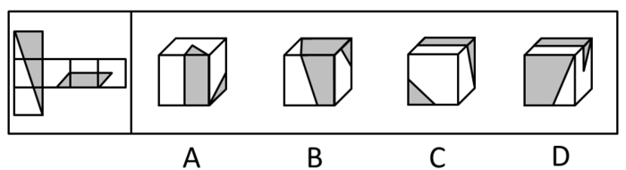

**75.** 一正方体如下图所示切掉了上半部分。现在从任意面剖开，下面哪一项不可能是该多面体的截面?  `[2015·地市·75]`
- A. A
- B. B
- C. C
- D. D

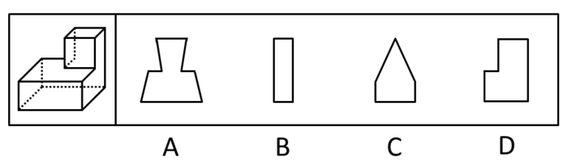

**76.** 把下面的六个图形分为两类，使每一类图形都有各自的共同特征或规律，分类正确的一项是：  `[2015·地市·76]`
- A. ①②⑥，③④⑤
- B. ①④⑤，②③⑥
- C. ①②⑤，③④⑥
- D. ①②③，④⑤⑥

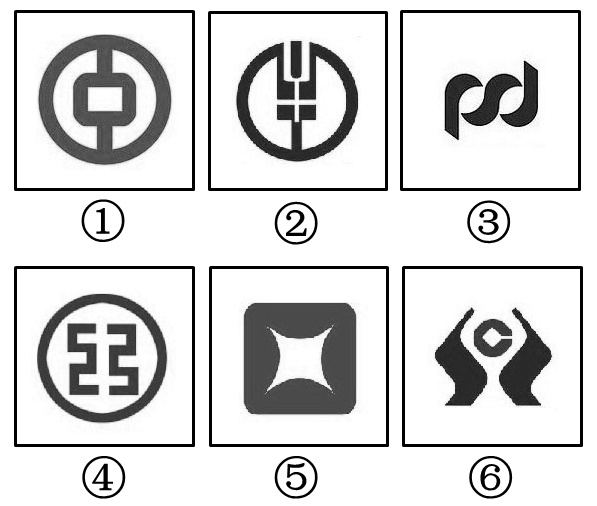

**77.** 把下面的六个图形分为两类，使每一类图形都有各自的共同特征或规律，分类正确的一项是：  `[2015·地市·77]`
- A. ①③④，②⑤⑥
- B. ①②⑥，③④⑤
- C. ①③⑤，②④⑥
- D. ①⑤⑥，②③④

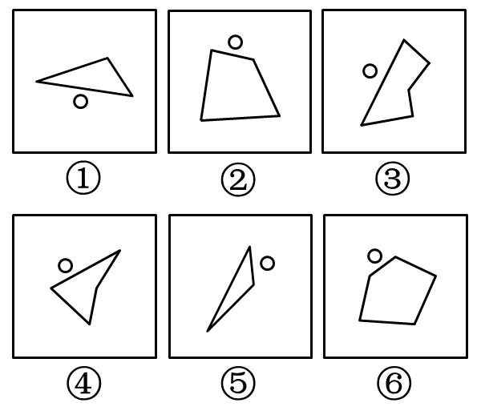

**78.** 把下面的六个图形分为两类，使每一类图形都有各自的共同特征或规律，分类正确的一项是：  `[2015·地市·78]`
- A. ①②③，④⑤⑥
- B. ①③⑤，②④⑥
- C. ①②⑥，③④⑤
- D. ①④⑥，②③⑤

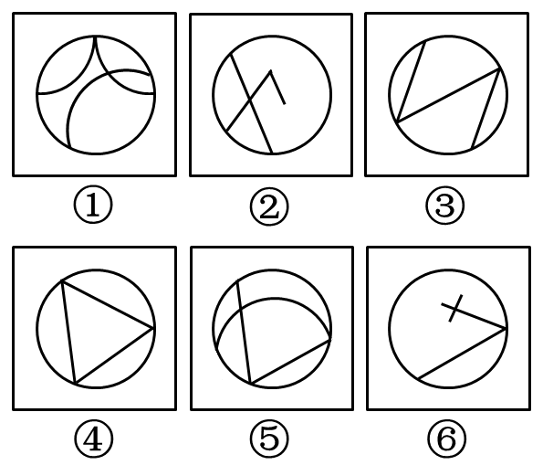

**79.** 把下面的六个图形分为两类，使每一类图形都有各自的共同特征或规律，分类正确的一项是：  `[2015·地市·79]`
- A. ①⑤⑥，②③④
- B. ①③⑤，②④⑥
- C. ①②③，④⑤⑥
- D. ①②⑤，③④⑥

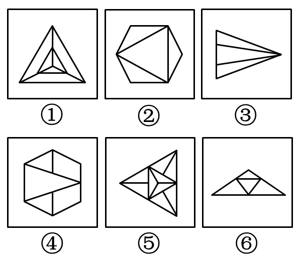

**80.** 把下面的六个图形分为两类，使每一类图形都有各自的共同特征或规律，分类正确的一项是：  `[2015·地市·80]`
- A. ①②④，③⑤⑥
- B. ①③④，②⑤⑥
- C. ①④⑥，②③⑤
- D. ①⑤⑥，②③④

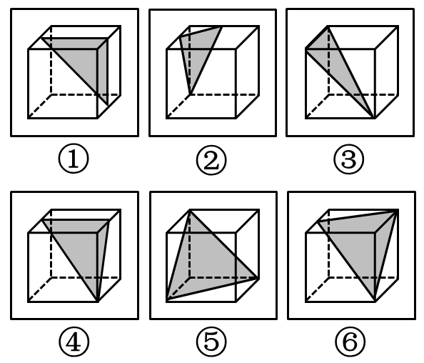

**81.** 垂直绿化指的是利用攀援植物向空中生长进行纵向绿化的一种方式，以期达到在有限面积内最大限度地利用空气和阳光来提高绿化的效率。根据上述定义，下列涉及垂直绿化的是：  `[2015·地市·81]`
- A. 爬山虎爬满了墙头和屋顶
- B. 松树林从山脚一直延伸到山顶
- C. 利用巴根草匍匐攀援的特性，人们在沙漠中逐渐开拓出一片绿洲
- D. 在丘陵地区，人们常使用飞机从空中播种的方式对山地进行绿化

**82.** 赋、比、兴指的是诗歌的三种表现手法。赋：铺陈直叙，把思想感情及其有关的事物平铺直叙地表达出来；比：类比，以彼物比此物，使此物更加生动具体、鲜明浅近;兴：先言他物，然后借以联想，引出诗人所要表达的事物、思想、感情。根据上述定义，下列诗句中使用了"比"的是：  `[2015·地市·82]`
- A. 死生契阔，与子成说。执子之手，与子偕老
- B. 七月流火，九月授衣。春日载阳，有鸣仓庚
- C. 我心匪石，不可转也。我心匪席，不可卷也
- D. 手如柔荑，肤如凝脂。领如蝤蛴，齿如瓠犀

**83.** 经济学中，系统内部个别效率较高的组织的出现，会对其他效率较低的组织的存在和发展构成破坏或抑制，人们把这种作用称为"顶尖效应"。由于个人之间、地区之间、国家之间的发展不平衡，因此"顶尖效应"是普遍存在的。根据上述定义，下列有助于避免"顶尖效应"的是：  `[2015·地市·83]`
- A. 发达国家甲与经济落后国家乙之间的贸易交易费用下降，导致乙国的资金外流
- B. 某地制定新政，加大对中小企业的扶持力度，同时对垄断行业进行调控，限制规模
- C. 某粮食生产企业一直不景气，在采用先进栽培技术后，企业生产规模扩大，销售份额开始提升
- D. 某地规定，对于优秀留学归国人员可参照其学历或专业水平直接授予相应等级的专业技术职称，不受任何年限等限制

**84.** 正惩罚是指当个体发出某种行为后，引发外部对其行为的某种反应，导致令该个体不愉快的后果，使个体今后发出此行为的可能性降低。负惩罚是指当个体发出某种行为后，撤销令个体愉快的后果，使个体今后发出此行为的可能性降低。根据上述定义，下列属于正惩罚的是：  `[2015·地市·84]`
- A. 禁烟标识贴出后，在办公室吸烟的人明显减少
- B. 母亲要求小明不写作业不得出去玩
- C. 某人因酒驾被处罚后，再没有酒驾
- D. 冰棍解暑，所以夏天冰棍很畅销

**85.** 疑罪是指司法机关对被告人是否犯罪或罪行轻重难以确证的情况。疑罪从无原则是现代刑法"有利被告"思想的体现，是无罪推定原则的具体内容之一，即在既不能证明被告人有罪又不能证明被告人无罪的情况下，推定被告人无罪。根据上述定义，下列采用了疑罪从无原则的是：  `[2015·地市·85]`
- A. 赵六因盗窃他人网络密码被起诉，但由于赵六被证明从来不使用网络，法院判其无罪
- B. 史某和汤某打架，两人都受了伤，因无法确定谁先动手，法庭建议庭外和解
- C. 钱某因涉嫌投毒被起诉，后因证据不足，法院判决钱某无罪
- D. 张三起诉李四侵权，但因拿不出任何证据，结果败诉

**86.** 隐域性是指自然地理现象在受到局部的地形、水文、土壤、气流、洋流、季风等因素的影响下，在地球表面不按或偏离纬向地带性规律分布的特性，它使地带性分布规律变得不鲜明，使自然环境变得更具复杂性与多样性。以下属于隐域性分布的是：  `[2015·地市·86]`
- A. 关汉卿《窦娥冤》中描写的"六月飞雪"
- B. 余秋雨所描写的丝绸之路上的"月牙泉"
- C. 岑参在诗中所描述的"北风卷地白草折"
- D. 电影《木乃伊归来》中所出现的大沙漠

**87.** 瓿是古代的一种盛酒器和盛水器，亦可用于盛酱。流行于商代至战国。圆体，敛口无颈，广肩，大腹，圈足，带盖，亦有方形瓿。根据上述描述下列器具中是瓿的是：  `[2015·地市·87]`
- A. A
- B. B
- C. C
- D. D

**88.** 垂直搜索引擎是针对某一个行业的专业搜索引擎，是对网页资源中的某类专门的信息进行一次整合，定向分字段抽取出需要的数据进行处理后再以某种形式返回给用户。根据上述定义，下列应用与垂直搜索引擎关系最为密切的是：  `[2015·地市·88]`
- A. 在某个购物网站上在线购买鞋子
- B. 登陆央视网站查询某个城市天气
- C. 用百度音乐搜索自己爱听的歌曲
- D. 在图书馆网站上查询该馆的藏书

**89.** 概念的内涵是指概念所反映的事物具有的本质属性（或特有属性），它是从质的方面反映概念的，概念的外延是指具有概念所反映的本质属性（或特有属性）的那些事物，它是从量的方面反映概念的。内涵和外延的反变关系是指具有属种关系的概念之间所具有的一种相互联系、相互制约的关系，一个概念的外延越大，它的内涵越少；一个概念外延越小，它的内涵越多。反之，一个概念的内涵越多，它的外延越小；一个概念内涵越少，它的外延越大。根据上述定义，下列哪组概念体现了概念内涵与外延的反变关系？  `[2015·地市·89]`
- A. 司法机关，最高审判机关，最高人民法院
- B. 水杯，热水杯，大号热水杯
- C. 中国，新疆，乌鲁木齐
- D. 中国人，文学家，鲁迅

**90.** 时间知觉是对客观现象延续性和顺序性的感知，时间知觉的信息，既来自于外部，也来自内部。外部信息包括计时工具，也包括宇宙环境的周期性变化，内部信息是机体内部的一些有节奏的生理过程和心理活动。根据上述定义，下列没有包含时间知觉信息的是：  `[2015·地市·90]`
- A. 东边日出西边雨，道是无晴却有晴
- B. 三更灯火五更鸡，正是男儿读书时
- C. 人有悲欢离合，月有阴晴圆缺
- D. 月出惊山鸟，时鸣春润中

**91.** 小麦：馒头  `[2015·地市·91]`
- A. 麋鹿：麝香
- B. 叶绿体：细胞
- C. 乌贼：墨汁
- D. 棉花：布鞋

**92.** 八卦：乾坤  `[2015·地市·92]`
- A. 九族：师生
- B. 七情：情志
- C. 五音：宫商
- D. 四书：五经

**93.** 春夏秋冬：四季  `[2015·地市·93]`
- A. 喜怒哀乐：情绪
- B. 赤橙黄绿：颜色
- C. 早中晚：一天
- D. 东南西北：四方

**94.** 深入：浅尝辄止  `[2015·地市·94]`
- A. 疏远：形影不离
- B. 细致：事无巨细
- C. 安定：水深火热
- D. 独立：自食其力

**95.** 音符：乐谱：五线谱  `[2015·地市·95]`
- A. 笔画：汉字：金文
- B. 树木：森林：自然
- C. 稻穗：稻谷：香米
- D. 卫星：星云：宇宙

**96.** 经济赤字：收入：开支  `[2015·地市·96]`
- A. 债务纠纷：还钱：借钱
- B. 优胜劣汰：适应：淘汰
- C. 销售利润：进价：售价
- D. 背信弃义：诺言：谎言

**97.** 鸳鸯：凤凰：雄雌  `[2015·地市·97]`
- A. 翡翠：珊瑚：红绿
- B. 经纬：阡陌：纵横
- C. 满月：弦月：盈缺
- D. 锱铢：分毫：长短

**98.** 铁匠：火炉：镰刀  `[2015·地市·98]`
- A. 医学家：试管：药剂
- B. 记者：摄像机：新闻稿
- C. 科学家：科技文献：新产品
- D. 网民：互联网：营销

**99.** 存折对于(    ) 相当于栅栏 对于(    )  `[2015·地市·99]`
- A. 储户牛羊
- B. 存款绿地
- C. 虚拟实物
- D. 银行卡围墙

**100.** 七寸对于 (    ) 相当于(    ) 对于头绪  `[2015·地市·100]`
- A. 尺度线索
- B. 要害眉目
- C. 七步头脑
- D. 关键脉络

**101.** 在防治癌症方面，橙汁有多种潜在的积极作用，尤其由于它富含橙皮素和柚苷素等类黄酮抗氧化剂。研究证据已经表明，橙汁可以减少儿童患白血病的风险，并有助于预防乳腺癌、肝癌和结肠癌。根据研究结果，橙汁的生物效应在很大程度上受到其成分的影响，而其成分的变化又依赖于气候、土壤、水果成熟度以及采摘后的存储方法等条件。由此可以推出：  `[2015·地市·101]`
- A. 并非所有的橙汁都有相同的防癌功效
- B. 过度饮用橙汁会给身体健康造成不良影响
- C. 相对于健康儿童而言，白血病患儿的橙汁饮用量较小
- D. 生长于良好的气候土壤条件下，成熟并避光保存的橙子最有功效

**102.** 某国际小组对从已灭绝的一种恐鸟骨骼化石中提取的DNA进行遗传物质衰变速率分析发现，虽然短DNA片段可能存在100万年，但30个或者更多碱基对序列在确定条件下的半衰期只有大约15.8万年。某位科学家据此认为，利用古代DNA再造恐龙等类似于电影《侏罗纪公园》中的故事不可能发生。以下哪项如果为真，最能反驳该科学家的观点：  `[2015·地市·102]`
- A. 《侏罗纪公园》虽然是一部科幻电影，但也要有事实依据
- B. 上述研究的化石样本可能受到人类DNA的"污染"
- C. 环境因素会影响DNA等遗传物质的衰变速率
- D. 恐鸟与恐龙的碱基对序列排列顺序不同

**103.** 碎片化时代人们的注意力很难持久。让用户在邮件页面停留更长时间已经成为了营销者不断努力的方向。随着富媒体化的逐步流行，邮件逐步从单一静态向动态转变，个性化邮件的特性也逐步凸显。GIF制作简单，兼容性强，在邮件中可以增加视觉冲击力。因此，在邮件中插入GIF动态图片，更能吸引用户的目光，增加用户的点击率。以下哪项如果为真，最能支持上述结论：  `[2015·地市·103]`
- A. 如果针对特定用户群而制定个性化营销邮件，那么销售机会会增加20%
- B. 过去没有插入GIF动态图片的个性化营销邮件，也为很多企业带来了成功
- C. 上世纪70年代出生的人习惯于电子邮件的静态界面，不喜欢花里胡哨的东西
- D. 插入GIF动态图片的个性化营销邮件，比普通发送的邮件给企业带来的收入多18倍

**104.** 一个旅行者要去火车站，早上从旅馆出发，到达一个十字路口。十字路口分别通向东南西北四个方向，四个方向上分别有饭店、旅馆、书店和火车站。书店在饭店的东北方，饭店在火车站的西北方。该旅行者要去火车站，应当往哪个方向走：  `[2015·地市·104]`
- A. 东
- B. 南
- C. 西
- D. 北

**105.** 由于一种新的电池技术装置的出现，手机在几分钟内充满电很快就会变成现实。这种新装置是一种超级电容器，它储存电流的方式是通过让带电离子聚集到多孔材料表面，而非像传统电池那样通过化学反应储存这些离子。因此这种超级电容器能在几分钟内储满电。研究人员认为这种技术装置将会替代传统电池。以下哪项如果为真，不能支持上述结论：  `[2015·地市·105]`
- A. 超级电容器能够储存大量电能，保证长时间正常运行
- B. 超级电容器能循环使用数百万次，相比之下传统电池只能使用数千次
- C. 超级电容器可嵌入汽车底盘为汽车提供动力，可更方便地进行无线充电
- D. 超级电容器充电时所耗电能比传统电池少90%，但供电时间比后者长10倍

**106.** 台风是大自然最具破坏性的灾害之一。有研究表明：通过向空中喷洒海水水滴，增加台风形成区域上空云层对日光的反射，那么台风将不能聚集足够的能量，这一做法将有效阻止台风的前进，从而避免更大程度的破坏。上述结论的成立需要补充以下哪项作为前提：  `[2015·地市·106]`
- A. 喷洒到空中的水滴能够在云层之上重新聚集
- B. 人工制造的云层将会对邻近区域的降雨产生影响
- C. 台风经过时，常伴随着大风和暴雨等强对流天气
- D. 台风前进的动力来源于海水表面日光照射所产生的热量

**107.** 有一段时间，电视机生产行业竞争激烈。由于电视机品牌众多，产品质量成为消费者考虑的首要因素。某电视机生产厂家为了扩大市场份额，一方面加大研发力度，进一步提高了电视机产品的质量；另一方面在价格上作调整，适当降低了产品的价格。然而，调整之后的头三个月，其电视机产品的市场份额不但没有提高反而有所下降。以下哪项如果为真，最能解释上述现象：  `[2015·地市·107]`
- A. 消费者通常会考虑不同产品的价格差异，而非同一产品在不同时期的价格差异
- B. 一个家庭再次购买电视机产品时会首先考虑原来的品牌
- C. 消费者通常是通过价格来衡量电视机产品质量的
- D. 其他电视机生产厂家也调整了产品价格

**108.** 城市病指的是人口涌入大城市，导致其公共服务功能被过度消费，最终造成交通拥挤、住房紧张、空气污染等问题。有专家认为，当城市病严重到一定程度时，大城市的吸引力就会下降，人们不会再像从前一样向大城市集聚，城市病将会减轻，从而焕发新的活力。如果以下各项为真，能够削弱上述观点的是：  `[2015·地市·108]`
- A. 我国已经进入城市病的爆发期，居民生活已受到影响
- B. 大城市能够提供的公共服务是中小城市所无法替代的
- C. 政府应该将更多财力用于发展中小城市、乡镇、农村
- D. 中小城市活力足，发展潜力大，对人们吸引力会很强

**109.** "有好消息，也有坏消息"。无论是谈起什么主题，这样的开场白都顿时让人觉得一丝寒意传遍全身。接着这句话，后边往往是这样一个问题：你想先听好消息还是坏消息？一项新的研究表明，你可能想先听坏消息。如果以下各项为真，最能削弱上述论证的是：  `[2015·地市·109]`
- A. 若消息是来自一个你信任的人，那么你想先听好坏消息的顺序会不同
- B. 研究发现，若由发布消息的人来决定，那么结果往往总是先说好消息
- C. 心理学家发现，发布好坏消息的先后顺序很可能改变人们对消息的感觉
- D. 心理评估结果证明先听到坏消息的学生比先听到好消息的学生焦虑要小

**110.** 今年联赛决赛的最后4支队伍是甲、乙、丙和丁。其中N与T分别为甲队和丁队的主教练。有人指出，甲队此前每次夺该项桂冠的赛季都曾战胜过T教练所在的球队；过去4年间，丁队在N教练的指导下，每隔一年都能夺得该项桂冠，而去年丁队没有夺冠。以下哪项如果为真，与上述表述相矛盾：  `[2015·地市·110]`
- A. T教练可能执教过丁队
- B. N教练去年曾执教丁队
- C. 甲队曾4次夺得该项冠军
- D. 丁队前年未获得该项冠军

## 2016年 · 副省级

**76.** 从所给四个选项中，选择最合适的一个填入问号处，使之呈现一定规律性：  `[2016·副省·76]`
- A. A
- B. B
- C. C
- D. D

**77.** 左图是给定的立方图形，将其从任一面剖开，下面哪一项可能是该立方体的截面？  `[2016·副省·77]`
- A. A
- B. B
- C. C
- D. D

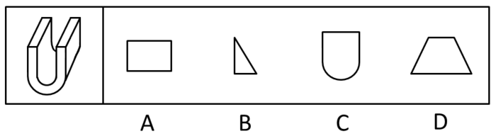

**78.** 左边给定的是纸盒的外表面，下列哪一项能由它折叠而成？  `[2016·副省·78]`
- A. A
- B. B
- C. C
- D. D

**79.** 从所给四个选项中，选择最合适的一个填入问号处，使之呈现一定的规律性：  `[2016·副省·79]`
- A. A
- B. B
- C. C
- D. D

**80.** ①、②、③、④为四个多面体零件，问A、B、C、D四个多面体零件中的哪一个与①、②、③、④中的任一个都不能组成长方体？  `[2016·副省·80]`
- A. A
- B. B
- C. C
- D. D

**81.** 把下面的六个图形分为两类，使每一类图形都有各自的共同特征或规律，分类正确的一项是：  `[2016·副省·81]`
- A. ①③④，②⑤⑥
- B. ①④⑥，②③⑤
- C. ①②④，③⑤⑥
- D. ①③⑥，②④⑤

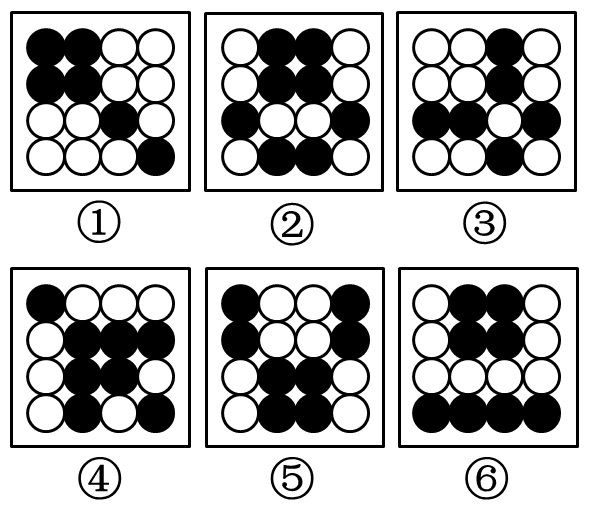

**82.** 把下面的六个图形分为两类，使每一类图形都有各自的共同特征或规律，分类正确的一项是：  `[2016·副省·82]`
- A. ①②④，③⑤⑥
- B. ①②⑤，③④⑥
- C. ①③④，②⑤⑥
- D. ①③⑥，②④⑤

**83.** 把下面的六个图形分为两类，使每一类图形都有各自的共同特征或规律，分类正确的一项是：  `[2016·副省·83]`
- A. ①②④，③⑤⑥
- B. ①③⑥，②④⑤
- C. ①③⑤，②④⑥
- D. ①⑤⑥，②③④

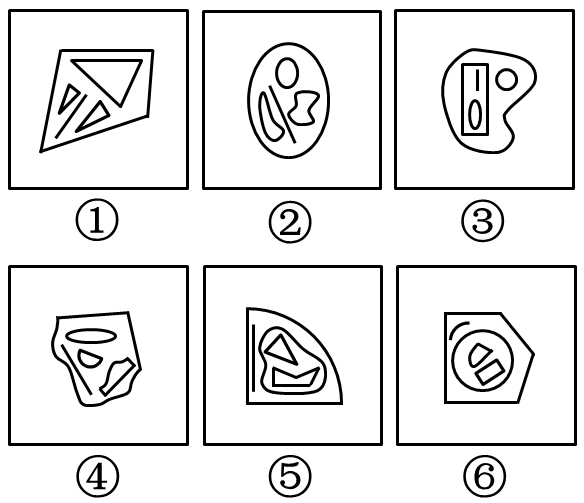

**84.** 把下面的六个图形分为两类，使每一类图形都有各自的共同特征或规律，分类正确的一项是：  `[2016·副省·84]`
- A. ①④⑥，②③⑤
- B. ①③⑤，②④⑥
- C. ①②⑤，③④⑥
- D. ①②④，③⑤⑥

**85.** 把下面的六个图形分为两类，使每一类图形都有各自的共同特征或规律，分类正确的一项是：  `[2016·副省·85]`
- A. ①④⑥，②③⑤
- B. ①③⑤，②④⑥
- C. ①②④，③⑤⑥
- D. ①②③，④⑤⑥

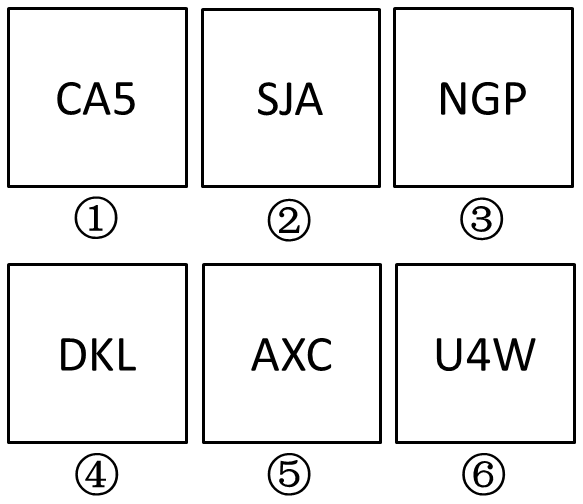

**86.** 土壤是岩石在风化作用下破碎，物理化学性质改变后形成结构疏松的风化壳，风化壳在气候与生物的作用下，经历很长时间形成的地表物质。与土壤自然形成过程无关的外来物质被称为土壤侵入体。根据上述定义，下列属于土壤侵入体的是：  `[2016·副省·86]`
- A. 戈壁滩中大量的沙砾
- B. 河床上存在的大量鹅卵石
- C. 考古发掘中挖出的砖瓦
- D. 岩缝中生长的野草

**87.** 党政机关公文是党政机关实施领导、履行职能、处理公务的具有特定效力和规范体式的文书。其中命令（令）适用于公布行政法规和规章、宣布施行重大强制性措施、批准授予和晋升衔级、嘉奖有关单位和人员。意见适用于对重要问题提出见解和处理办法。批复适用于答复下级机关请示事项。函适用于不相隶属机关之间商洽工作、询问和答复问题、请求批准和答复审批事项。根据上述定义，下列选项中应添加批复的是：  `[2016·副省·87]`
- A. 《国务院办公厅关于进一步加强资本市场中小投资者合法权益保护工作的——》
- B. 《国务院办公厅关于黑龙江双鸭山经济开发区升级为国家级经济技术开发区的——》
- C. 《国务院关于在我国统―实行法定计量单位的——》
- D. 《国务院关于同意设立陕西西咸新区的——》

**88.** 合成字是合体字中一个比较特殊的门类，它原本是汉语中―个常用的词语、词组，但由于这些词语、词组在方言中使用的频率很高，就把这些词语在讲究字形美观的前提下原封不动地组合成了一个独有的汉字。根据上述定义，下列汉字根据其意思不属于合成字的是：  `[2016·副省·88]`
- A. 氼，读作n&igrave;，古同"溺"，沉没，沉溺
- B. 嘦，读作ji&agrave;o，方言，"只要"的意思
- C. 覅，读作fi&agrave;o，表示否定，相当于"不要"
- D. 尠，读作xiǎn，意思是稀有的、罕见的

**89.** 真理是指客观事物及其规律在人的意识中的正确反映。真理可以分为理性真理和事实真理两种。理性真理指的是具有普遍性和必然性的真理，其反面是不可能的；事实真理指的是具有偶然性的真理，其反面是可能的。根据上述定义，下列属于理性真理的是：  `[2016·副省·89]`
- A. 月晕而风，础润而雨
- B. 如果a大于b且b大于c，那么a大于c
- C. 恩惠要一点点地施舍才具有最大效益
- D. 一个人如果违反了法律，就―定会受到法律的制裁

**90.** 直观教学是指利用教具作为感官传递物，向学生展示相关内容，以达到提高学习效率或效果的一种教学方式。直观教学包括实物直观、模象直观和言语直观。实物直观通过直接感知实际事物而进行；模象直观通过对实物的模拟性形象来直接感知；言语直观是在形象化的语言作用下，通过学生对语言的物质形式（语音、字形）的感知及对语义的理解而进行的一种直观形式。根据上述定义,下列不属于上述三种直观教学的是：  `[2016·副省·90]`
- A. 请学生在课后阅读整篇小说内容并撰写读后感
- B. 暑期带着学生去工厂和农村进行实地参观访问
- C. 请学生分角色朗读戏剧作品，或通过上台表演来体会人物性格
- D. 在艺术鉴赏课上，使用幻灯片给学生展示西方油画的经典之作

**91.** 负启动效应是指人们由于之前受到某一刺激的影响而使之后对同一类型刺激的知觉加工过程变得困难的心理现象。其中知觉加工过程是指外界事物作用于人的感官后，头脑中产生的对事物的认识和理解的过程。根据上述定义,下列属于负启动效应的是：  `[2016·副省·91]`
- A. 先给被试人员呈现一组汉字，里面有"海"这个字，随后让他们写出部首是"氵"的字时，这些人写出"海"的几率并未增大
- B. 先在黑板上给一组被试人员呈现词语"桌子"，后播放语音"椅子"，一段时间后，请被试人员分别说出看到和听到的词语，发现很多人答错了
- C. 请被试人员回答屏幕中显示的词语的颜色，先向其呈现词语"绿色"（字体为红色），再呈现词语"蓝色"（字体为绿色），发现被试人员辨识颜色变得困难
- D. 给被试人员呈现一张未完成的画，随着画越来越完整，被试人员逐渐辨认出画的内容，过一段时间后再给他们呈现这个未完成的画，他们会更早辨认出画的内容

**92.** 数字鸿沟指的是由于信息化和互联网的影响，人们的信息获取、信息处理和信息传播都是通过数字化技术来实现的，由此造成了不同个体、群体或者国家在思想意识、经济、文化和政治等方面的差距越来越大。根据上述定义，下列不涉及数字鸿沟的是：  `[2016·副省·92]`
- A. 放假回家的小宋和同学用手机聊天，满口网络新词，一旁的奶奶―句也听不懂
- B. 小赵整天痴迷于网络游戏，父母多次苦口婆心地劝说，均没有效果，为此小赵和父母发生了多次争执
- C. 东部某镇种植的水果尚未成熟就已经通过网络平台被订购一空，而西部某乡质优价廉的水果由于无人知晓只能烂在树上
- D. 一些西方国家利用其技术积累，在大数据处理方面取得了绝对的优势，他们进一步实行技术封锁，使得某些国家在大数据分享方面―筹莫展

**93.** 叶龄指数指的是禾谷类作物主茎已出叶数与最终总叶数的比值，是衡量作物生长进程的重要指标之一。根据上述定义，下列关于叶龄指数的说法一定正确的是：  `[2016·副省·93]`
- A. 稻谷的叶龄指数与其生长进程成正比
- B. 荞麦的叶龄指数越大则其产量也越高
- C. 小麦的叶龄指数最大值为100%
- D. 玉米的平均叶龄指数大于高粱

**94.** 图灵测试是测试者在与被测试者（一个人和―台机器）隔开的情况下，通过一些装置（如键盘）向被测试者随意提问。问过一些问题后，如果被测试者有超过30%的答复不能使测试者确认出哪个是人、哪个是机器，那么这台机器就通过了测试，并被认为具有人类智能。据上述定义，以下哪项中的测试―定通过了图灵测试？  `[2016·副省·94]`
- A. 对机器甲40%的答复所有人都确认其为机器
- B. 对机器乙60%的答复测试者能确认其为机器或人
- C. 对机器丙30%的答复有90%的某小区居民确认其为机器
- D. 对机器丁30%的答复只有10%的某校大学生不能确认其为机器

**95.** 产品责任是指产品有缺陷，存在可能危及人身、财产安全的危险，造成产品的消费者、使用者或者其他第三者人身或其他直接财产损失后，缺陷产品的生产者、销售者应当承担的特殊的侵权法律责任。根据上述定义，下列受害人可因产品责任要求侵权损害赔偿的是：  `[2016·副省·95]`
- A. 甲购买了一辆新车，一次与朋友王某驾车外出时，汽车因电路质量问题发生自燃，致使王某被烧伤
- B. 乙购买了一件大衣，大衣上没有洗涤标志和成分说明，营业员也未告知应如何洗涤。大衣水洗后严重缩水
- C. 丙购买了一部新手机，一次因质量问题自动关机，无法开启，致使丙漏接了客户的电话，损失了一笔大额订单
- D. 丁的电视机使用了20年，图像不清晰时拍几下就好了，一次丁在拍打电视机时，电视机发生爆炸，将丁炸伤，后经检验发现是显像管老化造成的

**96.** 佩刀：刀鞘  `[2016·副省·96]`
- A. 墨：墨盒
- B. 火箭：发射架
- C. 毛笔：笔帽
- D. 旅游鞋：旅行包

**97.** 琴棋书画：经史子集  `[2016·副省·97]`
- A. 兵强马壮：闭关自守
- B. 悲欢离合：漂泊流浪
- C. 衣帽鞋袜：冰清玉洁
- D. 鸟兽虫鱼：江河湖海

**98.** 森林：郁郁葱葱  `[2016·副省·98]`
- A. 法庭：庄严肃穆
- B. 校园：勤奋好学
- C. 餐桌：饕餮大餐
- D. 公园：嬉戏玩闹

**99.** 白驹过隙：秒表  `[2016·副省·99]`
- A. 恩重如山：天平
- B. 一线希望：皮尺
- C. 一言九鼎：弹簧秤
- D. 风驰电掣：测速仪

**100.** 素描：单色：绘画  `[2016·副省·100]`
- A. 色素：食品：添加剂
- B. 书签：阅读：工具
- C. 变脸：表演：艺术
- D. 新闻：纪实：文体

**101.** 前瞻：预见：回溯  `[2016·副省·101]`
- A. 深谋远虑：未雨绸缪：鼠目寸光
- B. 标新立异：特立独行：循规蹈矩
- C. 犬牙交错：参差不齐：顺理成章
- D. 墨守成规：井然有序：纷乱如麻

**102.** 教：学：教学  `[2016·副省·102]`
- A. 买：卖：买卖
- B. 好：坏：好坏
- C. 正：大：正大
- D. 阴：暗：阴暗

**103.** 自然科学：化学：化学元素  `[2016·副省·103]`
- A. 人文科学：历史学：历史人物
- B. 物理学：生物物理学：光合作用
- C. 语言学：汉语言：文学
- D. 社会学：社会科学：社区

**104.** 历练对于  （  ）  相当于磨砺  对于  （  ）  `[2016·副省·104]`
- A. 栉风沐雨；千锤百炼
- B. 波澜不惊；一鸣惊人
- C. 处心积虑；百折不回
- D. 千辛万苦；九死一生

**105.** 重力对于  （  ）  相当于（  ）  对于  昼夜交替  `[2016·副省·105]`
- A. 物体质量；月圆月缺
- B. 潮汐；地球公转
- C. 地球；月球
- D. 自由落体；地球自转

**106.** 人类与疟疾已经进行了几个世纪的斗争，但一直是"治标不治本"——无法阻断疟疾传染源。日前研究者培育出一种经过基因改造的蚊子，它具备了不再感染疟疾的能力，并且能妨碍野生蚊子繁衍，从而有效切断人与蚊子的疟疾传播途径，假以时日，就能根绝疟疾这个顽症。以下哪项如果为真，最能支持上述结论？  `[2016·副省·106]`
- A. 转基因蚊子的体质比野生蚊子差，一旦被放到野外很容易死亡
- B. 转基因蚊子只在疟疾存在时才有生存优势，当生存环境中没有疟疾时，它们和野生蚊子的存活率是相同的
- C. 转基因蚊子的生殖能力在繁衍了9代后显著增加，可能带来野生蚊子种群的灭亡
- D. 转基因蚊子与野生蚊子交配产下的后代并不都具有抗疟疾基因，但在基因层面上都会产生突变，形成新型蚊子

**107.** 格陵兰岛是地球上最大的岛屿，形成于38亿年前，大部分地区被冰雪覆盖。有大量远古的岩石化石埋藏在格陵兰岛地下，它们的排列就像是一个整齐的堤坝，也被称为蛇纹石。通过这些蛇纹石，人们可以断定格陵兰岛在远古时可能是一块海底大陆。补充以下哪项作为前提可以得出上述结论？  `[2016·副省·107]`
- A. 蛇纹石是两个大陆板块在运动中相互碰撞时挤压海底大陆而形成的一种岩石
- B. 这些蛇纹石化石的年代和特征与伊苏亚地区发现的一致，而后者曾是一片海底大陆
- C. 蛇纹石中碳的形状呈现出生物组织特有的管状和洋葱型结构，类似于早期的海洋微生物
- D. 由于大陆板块的运动才创造出了许多新的大陆，在板块运动发生之前，地球上绝大部分地区是一片汪洋大海

**108.** 近来，国外一些学者和媒体对西方民主体制较为集中地进行了反思和批评，指出西方民主正在衰败。对此，有学者认为，西方民主衰败的原因之一是其存在基因缺陷。西方民主是建立在一个假设前提的基础上的，即权利是绝对的。也就是说，权利与义务本应是相对的，但在西方民主模式中，权利绝对化已成为主流，各种权利绝对化，个人主义至上，社会责任缺乏。以下哪项如果为真，最能支持学者的观点？  `[2016·副省·108]`
- A. 西方民主制对权利绝对化的偏好，导致对他人权利与生存环境的忽视
- B. 权利是有限度的，超越了权利的限度，就可能走向权利滥用
- C. 美国两党常把自己的权利放在国家利益之上，互相否决，危害国家和公民的利益
- D. "程序万能"理论导致了西方民主制度的游戏化，民主被简化为竞选程序

**109.** 研究人员在观察开普勒太空望远镜发现的数千颗太阳系外行星后，发现银河系内拥有大量的行星，几乎每一颗恒星周围都存在行星，许多恒星系统内存在两至六颗行星，其中约三分之一的行星处于宜居带上，行星表面的温度适合液态水存在，这可能意味着银河系内几乎处处有宜居的星球。以下哪项如果为真，最能支持上述结论？  `[2016·副省·109]`
- A. 只要存在水资源，就有生命存在的可能性，但不一定能完成进化
- B. 许多宜居带行星与恒星之间的距离小于地球和太阳的间距，恒星释放的耀斑可能扼杀生命
- C. "恒星系统内存在两至六颗行星"这一结论是根据200多年前的提丢斯—波得定则推算而出，非实测结果
- D. 银河系内2000～4000亿颗恒星中80％是红矮星，超过一半的红矮星周围环绕的行星与地球类似，并存在水和大气层

**110.** 记者采访时的提问要具体、简洁明了，切忌空泛、笼统、不着边际。《采访技巧》一书中尖锐地剖析了"您感觉如何"等问题的弊端，认为这些提问实际上在信息获取上等于原地踏步，它使采访对象没法回答，除非用含混不清或枯燥无味的话来应付。由此可以推出：  `[2016·副省·110]`
- A. 记者采访时的提问如果具体、简洁明了，就不会给采访对象带来回答的困难
- B. 采访对象如果没法回答提问，说明他没有用含混不清或枯燥无味的话来应付
- C. 采访对象只有用含混不清或枯燥无味的话来应付，才能回答"您感觉如何"等问题的提问
- D. 诸如"您感觉如何"这样的问题，只能使采访对象抓不住问题的要点而作泛泛的或言不由衷的回答

**111.** 某大型晚会的导演组在对节目进行终审时，有六个节目尚未确定是否通过，这六个节目分别是歌曲A、歌曲B、相声C、相声D、舞蹈E和魔术F。综合考虑各种因素，导演组确定了如下方案：（1）歌曲A和歌曲B至少要上一个；（2）如果相声C不能通过或相声D不能通过，则歌曲A也不能通过；（3）如果相声C不能通过，那么魔术F也不能通过；（4）只有舞蹈E通过，歌曲B才能通过。导演组最终确定舞蹈E不能通过。由此可以推出：  `[2016·副省·111]`
- A. 无法确定魔术F是否能通过
- B. 歌曲A不能通过
- C. 无法确定两个相声节目是否能通过
- D. 歌曲B能通过

**112.** 9月初大学入学报到时，有多家手机运营商到某大学校园进行产品销售宣传。有好几家运营商推出了免费套餐服务。但是其中一家运营商推出了价格优惠的套餐，同时其业务员向学生宣传说：其他运营商所谓的"免费"套餐是通过出售消费者的身份信息来获得运营费用的。以下哪项如果为真，最能质疑该业务员的宣传？  `[2016·副省·112]`
- A. 免费套餐运营商所提供的手机信号质量很差
- B. 免费套餐运营商是通过广告来获得运营费用的
- C. 有法律明确规定，手机运营商不得出售消费者的身份信息
- D. 很难保证价格优惠的运营商不会同样出售消费者的身份信息

**113.** 有研究者认为，有些人罹患哮喘病是由于情绪问题。焦虑、抑郁和愤怒等消极情绪，可促使机体释放组织胺等物质，从而引发哮喘病。但是，反对者认为，迷走神经兴奋性的提高和交感神经反应性的降低才是引发哮喘病的原因，与患者的情绪问题无关。以下哪项如果为真，最能削弱反对者的观点？  `[2016·副省·113]`
- A. 现代医学已经证实，消极情绪也可诱发身体疾病
- B. 哮喘病发作会造成患者情绪焦虑、抑郁和愤怒等
- C. 焦虑、抑郁和愤怒等消极情绪是现代人的普遍问题
- D. 消极情绪会提高患者迷走神经的兴奋性并降低交感神经的反应性

**114.** 甲、乙、丙、丁四人商量周末出游。甲说：乙去，我就肯定去；乙说：丙去我就不去；丙说：无论丁去不去，我都去；丁说：甲乙中至少有一人去，我就去。以下哪项推论可能是正确的？  `[2016·副省·114]`
- A. 乙、丙两个人去了
- B. 甲一个人去了
- C. 甲、丙、丁三个人去了
- D. 四个人都去了

**115.** 某国的科研机构跟踪研究了出生于上世纪50至70年代的1万多人的精神健康状况，其间测试了他们在13岁至18岁时的语言能力、空间感知能力和归纳能力。结果发现，在此期间语言能力远低于同龄人水平的青少年，成年后患精神分裂症等精神疾病的风险较高。研究人员认为，青少年期语言能力的高低将是预测成年后精神疾病的重要指标。以下哪项如果为真，能够质疑上述观点？  `[2016·副省·115]`
- A. 青少年期激素分泌水平异常，影响大脑发育，导致语言能力发展迟缓
- B. 患精神分裂症的青少年，其归纳能力相比语言能力的发展更加缓慢
- C. 许多精神健康的脑肿瘤患者在青少年时期也经常出现语言能力发展迟缓的问题
- D. 适当的教育可显著提高青少年的语言能力，但对中老年人影响不大

## 2016年 · 地市级

**71.** 从所给四个选项中，选择最合适的一个填入问号处，使之呈现一定规律性：  `[2016·地市·71]`
- A. A
- B. B
- C. C
- D. D

**72.** 从所给四个选项中，选择最合适的一个填入问号处，使之呈现一定的规律性：  `[2016·地市·72]`
- A. A
- B. B
- C. C
- D. D

**73.** ①、②、③、④为四个多面体零件，问A、B、C、D四个多面体零件中的哪一个与①、②、③、④中的任一个都不能组成长方体？  `[2016·地市·73]`
- A. A
- B. B
- C. C
- D. D

**74.** 左图是给定的立方图形，将其从任一面剖开，下面哪一项可能是该立方体的截面？  `[2016·地市·74]`
- A. A
- B. B
- C. C
- D. D

**75.** 左边给定的是纸盒的外表面，下列哪一项能由它折叠而成？  `[2016·地市·75]`
- A. A
- B. B
- C. C
- D. D

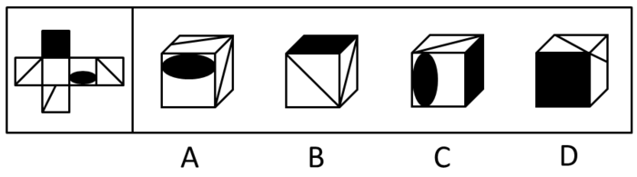

**76.** 把下面的六个图形分为两类，使每一类图形都有各自的共同特征或规律，分类正确的一项是：  `[2016·地市·76]`
- A. ①②④，③⑤⑥
- B. ①②⑤，③④⑥
- C. ①③④，②⑤⑥
- D. ①③⑥，②④⑤

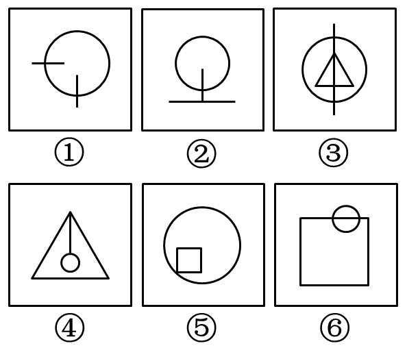

**77.** 把下面的六个图形分为两类，使每一类图形都有各自的共同特征或规律，分类正确的一项是：  `[2016·地市·77]`
- A. ①④⑥，②③⑤
- B. ①③⑤，②④⑥
- C. ①②④，③⑤⑥
- D. ①②③，④⑤⑥

**78.** 把下面的六个图形分为两类，使每一类图形都有各自的共同特征或规律，分类正确的一项是：  `[2016·地市·78]`
- A. ①③④，②⑤⑥
- B. ①④⑥，②③⑤
- C. ①②④，③⑤⑥
- D. ①③⑥，②④⑤

**79.** 把下面的六个图形分为两类，使每一类图形都有各自的共同特征或规律，分类正确的一项是：  `[2016·地市·79]`
- A. ①②④，③⑤⑥
- B. ①③⑥，②④⑤
- C. ①③⑤，②④⑥
- D. ①⑤⑥，②③④

**80.** 把下面的六个图形分为两类，使每一类图形都有各自的共同特征或规律，分类正确的一项是：  `[2016·地市·80]`
- A. ①④⑥，②③⑤
- B. ①③⑤，②④⑥
- C. ①②⑤，③④⑥
- D. ①②④，③⑤⑥

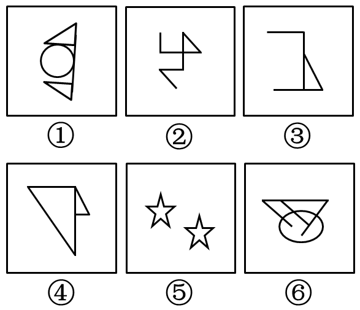

**81.** 土壤是岩石在风化作用下破碎，物理化学性质改变后形成结构疏松的风化壳，风化壳在气候与生物的作用下，经历很长时间形成的地表物质。与土壤自然形成过程无关的外来物质被称为土壤侵入体。根据上述定义，下列属于土壤侵入体的是：  `[2016·地市·81]`
- A. 戈壁滩中大量的沙砾
- B. 河床上存在的大量鹅卵石
- C. 考古发掘中挖出的砖瓦
- D. 岩缝中生长的野草

**82.** 合成字是合体字中一个比较特殊的门类，它原本是汉语中―个常用的词语、词组，但由于这些词语、词组在方言中使用的频率很高，就把这些词语在讲究字形美观的前提下原封不动地组合成了一个独有的汉字。根据上述定义，下列汉字根据其意思不属于合成字的是：  `[2016·地市·82]`
- A. 氼，读作nì，古同“溺”，沉没，沉溺
- B. 嘦，读作jiào，方言，“只要”的意思
- C. 覅，读作fiào，表示否定，相当于“不要”
- D. 尠，读作xiǎn，意思是稀有的、罕见的

**83.** 真理是指客观事物及其规律在人的意识中的正确反映。真理可以分为理性真理和事实真理两种。理性真理指的是具有普遍性和必然性的真理，其反面是不可能的；事实真理指的是具有偶然性的真理，其反面是可能的。根据上述定义，下列属于理性真理的是：  `[2016·地市·83]`
- A. 月晕而风，础润而雨
- B. 如果a大于b且b大于c，那么a大于c
- C. 恩惠要一点点地施舍才具有最大效益
- D. 一个人如果违反了法律，就―定会受到法律的制裁

**84.** 数字鸿沟指的是由于信息化和互联网的影响，人们的信息获取、信息处理和信息传播都是通过数字化技术来实现的，由此造成了不同个体、群体或者国家在思想意识、经济、文化和政治等方面的差距越来越大。根据上述定义，下列不涉及数字鸿沟的是：  `[2016·地市·84]`
- A. 放假回家的小宋和同学用手机聊天，满口网络新词，一旁的奶奶―句也听不懂
- B. 小赵整天痴迷于网络游戏，父母多次苦口婆心地劝说，均没有效果，为此小赵和父母发生了多次争执
- C. 东部某镇种植的水果尚未成熟就已经通过网络平台被订购一空，而西部某乡质优价廉的水果由于无人知晓只能烂在树上
- D. 一些西方国家利用其技术积累，在大数据处理方面取得了绝对的优势，他们进一步实行技术封锁，使得某些国家在大数据分享方面―筹莫展

**85.** 党政机关公文是党政机关实施领导、履行职能、处理公务的具有特定效力和规范体式的文书。其中命令（令）适用于公布行政法规和规章、宣布施行重大强制性措施、批准授予和晋升衔级、嘉奖有关单位和人员。意见适用于对重要问题提出见解和处理办法。批复适用于答复下级机关请示事项。函适用于不相隶属机关之间商洽工作、询问和答复问题、请求批准和答复审批事项。根据上述定义，下列选项中应添加批复的是：  `[2016·地市·85]`
- A. 《国务院办公厅关于进一步加强资本市场中小投资者合法权益保护工作的——》
- B. 《国务院办公厅关于黑龙江双鸭山经济开发区升级为国家级经济技术开发区的——》
- C. 《国务院关于在我国统―实行法定计量单位的——》
- D. 《国务院关于同意设立陕西西咸新区的——》

**86.** 负启动效应是指人们由于之前受到某一刺激的影响而使之后对同一类型刺激的知觉加工过程变得困难的心理现象。其中知觉加工过程是指外界事物作用于人的感官后，头脑中产生的对事物的认识和理解的过程。根据上述定义,下列属于负启动效应的是：  `[2016·地市·86]`
- A. 先给被试人员呈现一组汉字，里面有"海"这个字，随后让他们写出部首是"氵"的字时，这些人写出"海"的几率并未增大
- B. 先在黑板上给一组被试人员呈现词语"桌子"，后播放语音"椅子"，一段时间后，请被试人员分别说出看到和听到的词语，发现很多人答错了
- C. 请被试人员回答屏幕中显示的词语的颜色，先向其呈现词语"绿色"（字体为红色），再呈现词语"蓝色"（字体为绿色），发现被试人员辨识颜色变得困难
- D. 给被试人员呈现一张未完成的画，随着画越来越完整，被试人员逐渐辨认出画的内容，过一段时间后再给他们呈现这个未完成的画，他们会更早辨认出画的内容

**87.** 直观教学是指利用教具作为感官传递物，向学生展示相关内容，以达到提高学习效率或效果的一种教学方式。直观教学包括实物直观、模象直观和言语直观。实物直观通过直接感知实际事物而进行；模象直观通过对实物的模拟性形象来直接感知；言语直观是在形象化的语言作用下，通过学生对语言的物质形式（语音、字形）的感知及对语义的理解而进行的一种直观形式。根据上述定义,下列不属于上述三种直观教学的是：  `[2016·地市·87]`
- A. 请学生在课后阅读整篇小说内容并撰写读后感
- B. 暑期带着学生去工厂和农村进行实地参观访问
- C. 请学生分角色朗读戏剧作品，或通过上台表演来体会人物性格
- D. 在艺术鉴赏课上，使用幻灯片给学生展示西方油画的经典之作

**88.** 叶龄指数指的是禾谷类作物主茎已出叶数与最终总叶数的比值，是衡量作物生长进程的重要指标之一。根据上述定义，下列关于叶龄指数的说法一定正确的是：  `[2016·地市·88]`
- A. 稻谷的叶龄指数与其生长进程成正比
- B. 荞麦的叶龄指数越大则其产量也越高
- C. 小麦的叶龄指数最大值为100%
- D. 玉米的平均叶龄指数大于高粱

**89.** 图灵测试是测试者在与被测试者（一个人和―台机器）隔开的情况下，通过一些装置（如键盘）向被测试者随意提问。问过一些问题后，如果被测试者有超过30%的答复不能使测试者确认出哪个是人、哪个是机器，那么这台机器就通过了测试，并被认为具有人类智能。据上述定义，以下哪项中的测试―定通过了图灵测试？  `[2016·地市·89]`
- A. 对机器甲40%的答复所有人都确认其为机器
- B. 对机器乙60%的答复测试者能确认其为机器或人
- C. 对机器丙30%的答复有90%的某小区居民确认其为机器
- D. 对机器丁30%的答复只有10%的某校大学生不能确认其为机器

**90.** 产品责任是指产品有缺陷，存在可能危及人身、财产安全的危险，造成产品的消费者、使用者或者其他第三者人身或其他直接财产损失后，缺陷产品的生产者、销售者应当承担的特殊的侵权法律责任。根据上述定义，下列受害人可因产品责任要求侵权损害赔偿的是：  `[2016·地市·90]`
- A. 甲购买了一辆新车，一次与朋友王某驾车外出时，汽车因电路质量问题发生自燃，致使王某被烧伤
- B. 乙购买了一件大衣，大衣上没有洗涤标志和成分说明，营业员也未告知应如何洗涤。大衣水洗后严重缩水
- C. 丙购买了一部新手机，一次因质量问题自动关机，无法开启，致使丙漏接了客户的电话，损失了一笔大额订单
- D. 丁的电视机使用了20年，图像不清晰时拍几下就好了，一次丁在拍打电视机时，电视机发生爆炸，将丁炸伤，后经检验发现是显像管老化造成的

**91.** 白驹过隙：秒表  `[2016·地市·91]`
- A. 恩重如山：天平
- B. 一线希望：皮尺
- C. 一言九鼎：弹簧秤
- D. 风驰电掣：测速仪

**92.** 森林：郁郁葱葱  `[2016·地市·92]`
- A. 法庭：庄严肃穆
- B. 校园：勤奋好学
- C. 餐桌：饕餮大餐
- D. 公园：嬉戏玩闹

**93.** 佩刀：刀鞘  `[2016·地市·93]`
- A. 墨：墨盒
- B. 火箭：发射架
- C. 毛笔：笔帽
- D. 旅游鞋：旅行包

**94.** 琴棋书画：经史子集  `[2016·地市·94]`
- A. 兵强马壮：闭关自守
- B. 悲欢离合：漂泊流浪
- C. 衣帽鞋袜：冰清玉洁
- D. 鸟兽虫鱼：江河湖海

**95.** 教：学：教学  `[2016·地市·95]`
- A. 买：卖：买卖
- B. 好：坏：好坏
- C. 正：大：正大
- D. 阴：暗：阴暗

**96.** 前瞻：预见：回溯  `[2016·地市·96]`
- A. 深谋远虑：未雨绸缪：鼠目寸光
- B. 标新立异：特立独行：循规蹈矩
- C. 犬牙交错：参差不齐：顺理成章
- D. 墨守成规：井然有序：纷乱如麻

**97.** 素描：单色：绘画  `[2016·地市·97]`
- A. 色素：食品：添加剂
- B. 书签：阅读：工具
- C. 变脸：表演：艺术
- D. 新闻：纪实：文体

**98.** 自然科学：化学：化学元素  `[2016·地市·98]`
- A. 人文科学：历史学：历史人物
- B. 物理学：生物物理学：光合作用
- C. 语言学：汉语言：文学
- D. 社会学：社会科学：社区

**99.** 重力对于  （  ）  相当于（  ）  对于  昼夜交替  `[2016·地市·99]`
- A. 物体质量；月圆月缺
- B. 潮汐；地球公转
- C. 地球；月球
- D. 自由落体；地球自转

**100.** 历练对于  （  ）  相当于磨砺  对于  （  ）  `[2016·地市·100]`
- A. 栉风沐雨；千锤百炼
- B. 波澜不惊；一鸣惊人
- C. 处心积虑；百折不回
- D. 千辛万苦；九死一生

**101.** 人类与疟疾已经进行了几个世纪的斗争，但一直是"治标不治本"——无法阻断疟疾传染源。日前研究者培育出一种经过基因改造的蚊子，它具备了不再感染疟疾的能力，并且能妨碍野生蚊子繁衍，从而有效切断人与蚊子的疟疾传播途径，假以时日，就能根绝疟疾这个顽症。以下哪项如果为真，最能支持上述结论？  `[2016·地市·101]`
- A. 转基因蚊子的体质比野生蚊子差，一旦被放到野外很容易死亡
- B. 转基因蚊子只在疟疾存在时才有生存优势，当生存环境中没有疟疾时，它们和野生蚊子的存活率是相同的
- C. 转基因蚊子的生殖能力在繁衍了9代后显著增加，可能带来野生蚊子种群的灭亡
- D. 转基因蚊子与野生蚊子交配产下的后代并不都具有抗疟疾基因，但在基因层面上都会产生突变，形成新型蚊子

**102.** 研究人员在观察开普勒太空望远镜发现的数千颗太阳系外行星后，发现银河系内拥有大量的行星，几乎每一颗恒星周围都存在行星，许多恒星系统内存在两至六颗行星，其中约三分之一的行星处于宜居带上，行星表面的温度适合液态水存在，这可能意味着银河系内几乎处处有宜居的星球。以下哪项如果为真，最能支持上述结论？  `[2016·地市·102]`
- A. 只要存在水资源，就有生命存在的可能性，但不一定能完成进化
- B. 许多宜居带行星与恒星之间的距离小于地球和太阳的间距，恒星释放的耀斑可能扼杀生命
- C. "恒星系统内存在两至六颗行星"这一结论是根据200多年前的提丢斯—波得定则推算而出，非实测结果
- D. 银河系内2000～4000亿颗恒星中80％是红矮星，超过一半的红矮星周围环绕的行星与地球类似，并存在水和大气层

**103.** 近来，国外一些学者和媒体对西方民主体制较为集中地进行了反思和批评，指出西方民主正在衰败。对此，有学者认为，西方民主衰败的原因之一是其存在基因缺陷。西方民主是建立在一个假设前提的基础上的，即权利是绝对的。也就是说，权利与义务本应是相对的，但在西方民主模式中，权利绝对化已成为主流，各种权利绝对化，个人主义至上，社会责任缺乏。以下哪项如果为真，最能支持学者的观点？  `[2016·地市·103]`
- A. 西方民主制对权利绝对化的偏好，导致对他人权利与生存环境的忽视
- B. 权利是有限度的，超越了权利的限度，就可能走向权利滥用
- C. 美国两党常把自己的权利放在国家利益之上，互相否决，危害国家和公民的利益
- D. "程序万能"理论导致了西方民主制度的游戏化，民主被简化为竞选程序

**104.** 格陵兰岛是地球上最大的岛屿，形成于38亿年前，大部分地区被冰雪覆盖。有大量远古的岩石化石埋藏在格陵兰岛地下，它们的排列就像是一个整齐的堤坝，也被称为蛇纹石。通过这些蛇纹石，人们可以断定格陵兰岛在远古时可能是一块海底大陆。补充以下哪项作为前提可以得出上述结论？  `[2016·地市·104]`
- A. 蛇纹石是两个大陆板块在运动中相互碰撞时挤压海底大陆而形成的一种岩石
- B. 这些蛇纹石化石的年代和特征与伊苏亚地区发现的一致，而后者曾是一片海底大陆
- C. 蛇纹石中碳的形状呈现出生物组织特有的管状和洋葱型结构，类似于早期的海洋微生物
- D. 由于大陆板块的运动才创造出了许多新的大陆，在板块运动发生之前，地球上绝大部分地区是一片汪洋大海

**105.** 记者采访时的提问要具体、简洁明了，切忌空泛、笼统、不着边际。《采访技巧》一书中尖锐地剖析了"您感觉如何"等问题的弊端，认为这些提问实际上在信息获取上等于原地踏步，它使采访对象没法回答，除非用含混不清或枯燥无味的话来应付。由此可以推出：  `[2016·地市·105]`
- A. 记者采访时的提问如果具体、简洁明了，就不会给采访对象带来回答的困难
- B. 采访对象如果没法回答提问，说明他没有用含混不清或枯燥无味的话来应付
- C. 采访对象只有用含混不清或枯燥无味的话来应付，才能回答"您感觉如何"等问题的提问
- D. 诸如"您感觉如何"这样的问题，只能使采访对象抓不住问题的要点而作泛泛的或言不由衷的回答

**106.** 9月初大学入学报到时，有多家手机运营商到某大学校园进行产品销售宣传。有好几家运营商推出了免费套餐服务。但是其中一家运营商推出了价格优惠的套餐，同时其业务员向学生宣传说：其他运营商所谓的"免费"套餐是通过出售消费者的身份信息来获得运营费用的。以下哪项如果为真，最能质疑该业务员的宣传？  `[2016·地市·106]`
- A. 免费套餐运营商所提供的手机信号质量很差
- B. 免费套餐运营商是通过广告来获得运营费用的
- C. 有法律明确规定，手机运营商不得出售消费者的身份信息
- D. 很难保证价格优惠的运营商不会同样出售消费者的身份信息

**107.** 某大型晚会的导演组在对节目进行终审时，有六个节目尚未确定是否通过，这六个节目分别是歌曲A、歌曲B、相声C、相声D、舞蹈E和魔术F。综合考虑各种因素，导演组确定了如下方案：（1）歌曲A和歌曲B至少要上一个；（2）如果相声C不能通过或相声D不能通过，则歌曲A也不能通过；（3）如果相声C不能通过，那么魔术F也不能通过；（4）只有舞蹈E通过，歌曲B才能通过。导演组最终确定舞蹈E不能通过。由此可以推出：  `[2016·地市·107]`
- A. 无法确定魔术F是否能通过
- B. 歌曲A不能通过
- C. 无法确定两个相声节目是否能通过
- D. 歌曲B能通过

**108.** 甲、乙、丙、丁四人商量周末出游。甲说：乙去，我就肯定去；乙说：丙去我就不去；丙说：无论丁去不去，我都去；丁说：甲乙中至少有一人去，我就去。以下哪项推论可能是正确的？  `[2016·地市·108]`
- A. 乙、丙两个人去了
- B. 甲一个人去了
- C. 甲、丙、丁三个人去了
- D. 四个人都去了

**109.** 有研究者认为，有些人罹患哮喘病是由于情绪问题。焦虑、抑郁和愤怒等消极情绪，可促使机体释放组织胺等物质，从而引发哮喘病。但是，反对者认为，迷走神经兴奋性的提高和交感神经反应性的降低才是引发哮喘病的原因，与患者的情绪问题无关。以下哪项如果为真，最能削弱反对者的观点？  `[2016·地市·109]`
- A. 现代医学已经证实，消极情绪也可诱发身体疾病
- B. 哮喘病发作会造成患者情绪焦虑、抑郁和愤怒等
- C. 焦虑、抑郁和愤怒等消极情绪是现代人的普遍问题
- D. 消极情绪会提高患者迷走神经的兴奋性并降低交感神经的反应性

**110.** 某国的科研机构跟踪研究了出生于上世纪50至70年代的1万多人的精神健康状况，其间测试了他们在13岁至18岁时的语言能力、空间感知能力和归纳能力。结果发现，在此期间语言能力远低于同龄人水平的青少年，成年后患精神分裂症等精神疾病的风险较高。研究人员认为，青少年期语言能力的高低将是预测成年后精神疾病的重要指标。以下哪项如果为真，能够质疑上述观点？  `[2016·地市·110]`
- A. 青少年期激素分泌水平异常，影响大脑发育，导致语言能力发展迟缓
- B. 患精神分裂症的青少年，其归纳能力相比语言能力的发展更加缓慢
- C. 许多精神健康的脑肿瘤患者在青少年时期也经常出现语言能力发展迟缓的问题
- D. 适当的教育可显著提高青少年的语言能力，但对中老年人影响不大

## 2017年 · 副省级

**76.** 从所给的四个选项中，选择最合适的一个填入问号处，使之呈现一定的规律性：  `[2017·副省·76]`
- A. A
- B. B
- C. C
- D. D

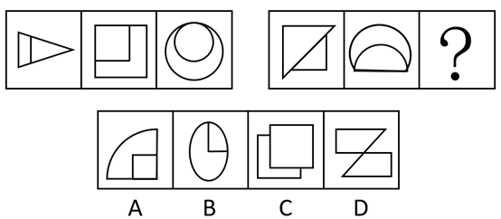

**77.** 从所给的四个选项中，选择最合适的一个填入问号处，使之呈现一定的规律性：  `[2017·副省·77]`
- A. A
- B. B
- C. C
- D. D

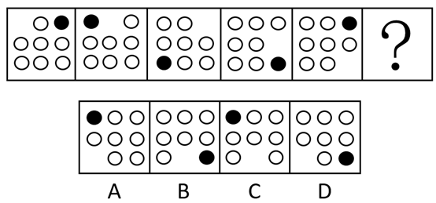

**78.** 从所给的四个选项中，选择最合适的一个填入问号处，使之呈现一定的规律性：  `[2017·副省·78]`
- A. A
- B. B
- C. C
- D. D

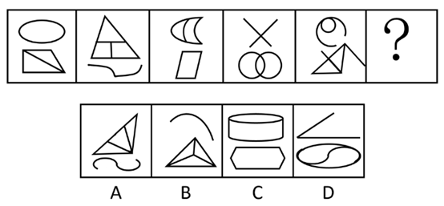

**79.** 从所给的四个选项中，选择最合适的一个填入问号处，使之呈现一定的规律性：  `[2017·副省·79]`
- A. A
- B. B
- C. C
- D. D

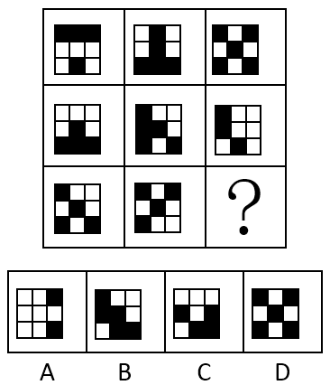

**80.** 从所给的四个选项中，选择最合适的一个填入问号处，使之呈现一定的规律性：  `[2017·副省·80]`
- A. A
- B. B
- C. C
- D. D

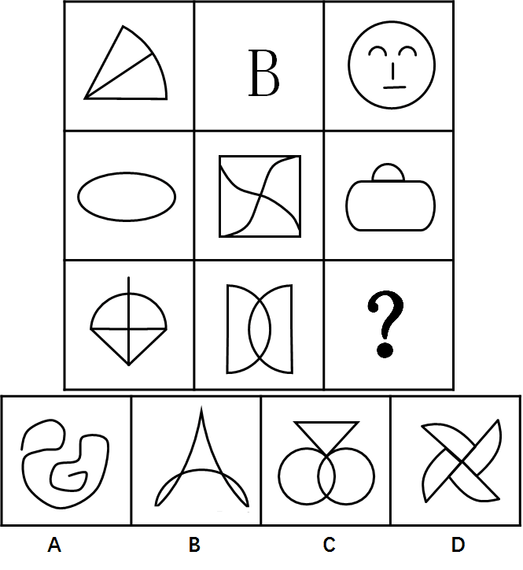

**81.** 左边给定的是正方体的外表面展开图，下面哪一项能由它折叠而成？  `[2017·副省·81]`
- A. A
- B. B
- C. C
- D. D

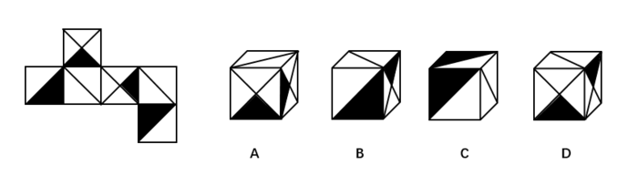

**82.** 下图中的立体图形①是由立体图形②，③和④组合而成，下列哪一项不能填入问号处？  `[2017·副省·82]`
- A. A
- B. B
- C. C
- D. D

**83.** 把下面的六个图形分为两类，使每一类图形都有各自的共同特征或规律，分类正确的一项是：  `[2017·副省·83]`
- A. ①④⑥，②③⑤
- B. ①②③，④⑤⑥
- C. ①⑤⑥，②③④
- D. ①③⑤，②④⑥

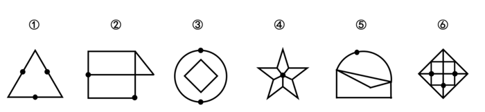

**84.** 把下面的六个图形分为两类，使每一类图形都有各自的共同特征或规律，分类正确的一项是：  `[2017·副省·84]`
- A. ①③④，②⑤⑥
- B. ①②⑤，③④⑥
- C. ①③⑥，②④⑤
- D. ①④⑤，②③⑥

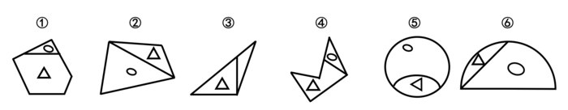

**85.** 把下面的六个图形分为两类，使每一类图形都有各自的共同特征或规律，分类正确的一项是：  `[2017·副省·85]`
- A. ①②⑤，③④⑥
- B. ①②③，④⑤⑥
- C. ①③⑤，②④⑥
- D. ①②⑥，③④⑤

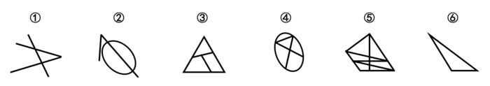

**86.** 语句的示意功能是指通过语句表达某种通知、告诫、命令或请求，目的在于要求别人按照语句表达的思想，做出或不做出某种行为。根据上述定义，下列没有反映语句的示意功能的是：  `[2017·副省·86]`
- A. 全体学生请到操场集合
- B. 请您务必不要践踏草坪
- C. 禁止生产假冒伪劣产品
- D. 销售部现在应该在开会

**87.** 水利工程是用于控制和调配自然界的地表水和地下水，达到除害兴利目的而修建的工程。根据上述定义，下列不涉及水利工程的是：  `[2017·副省·87]`
- A. 城市污水处理厂利用微生物分解吸收水中的有机物
- B. 水电站利用水力发电技术，将水能转化为电能
- C. 农业上建设合理开发利用地下水的灌溉设施，以满足作物生长需要
- D. 在水利枢纽中设河岸泄洪道以防止因洪水超过水库容量而漫顶造成溃坝

**88.** 火力投射密度是指军事行动中军事部门在单位时间内的最大弹药发射量。它是现代军事学中衡量作战部队战斗力的重要指标之一。根据上述定义，以下属于通过增大火力投射密度来加强部队战斗力的是：  `[2017·副省·88]`
- A. 某步兵师在普通士兵中选拔特等射手编入狙击班，进而能够更有效地杀伤敌人的有生力量
- B. 某国将其部队列装的半自动步枪全部更换为全自动步枪，增加了子弹的发射频率
- C. 某炮兵部队将原计划两小时的炮火掩护时间延长为三小时，更有效地杀伤了掩体中的敌人
- D. 某军事科研单位研制出更先进的炮火定位系统，能够将火力打击的误差由半径200米缩小到50米

**89.** 货币性资产是指持有的现金及将以固定或可确定金额的货币收取的资产，包括现金、应收账款和应收票据以及准备持有至到期的债券等。非货币性资产则是指货币性资产以外的资产，这些资产在将来为企业带来的经济利益（即货币金额）是不固定的或不可确定的。根据上述定义，下列属于货币性资产的是：  `[2017·副省·89]`
- A. 某服装厂的库存货物
- B. 某汽车公司用于出租的车辆
- C. 某通讯企业旗下手机品牌的商标权
- D. 某化工集团按照国家规定获得的技术补贴

**90.** 埋伏营销是指企业利用媒体和公众对重大事件的关注，通过举办与重大事件相关的活动，使自己与重大事件产生关联，从而引起消费者的联想和媒体的注意。这类营销通常是隐蔽的、突发的，不以赞助者的身份出现，却对自己的品牌悄无声息地进行了宣传。根据上述定义，下列不属于埋伏营销的是：  `[2017·副省·90]`
- A. 某矿泉水公司邀请著名运动员为其代言，并将广告投放在电视媒体的黄金时段和一些大型酒店的视频媒体中
- B. 地震发生后，某户外用品公司向灾区捐赠价值100万元的帐篷，并举行了捐赠仪式
- C. 某市举办中小学生知识竞赛，一出版集团在现场向参与者免费发放其出版的图书
- D. 世界一级方程式锦标赛比赛期间，观众席中时不时会有人挥舞着印有某轮胎企业商标的彩色旗帜

**91.** 自由落体运动是指物体只在重力作用下从静止开始下落的运动。这种运动只有在真空条件下才能发生，在有空气时，如果空气的阻力作用比较小，可以忽略不计，则物体的下落可以近似看作自由落体运动。根据上述定义，下列可以近似看作自由落体运动的是：  `[2017·副省·91]`
- A. 熟透了的苹果从树上被风吹落
- B. 飞行中的飞机被导弹击中坠落
- C. 抛过来的皮球没被接住，掉在地上
- D. 冬日中午，冰棱融化后从屋檐掉下

**92.** 著名科学家、科学史学家普赖斯提出：如果K代表参与某一专业领域的人数，那么这个数字的平方根大致等于为这个领域做出一半贡献的排名在前的那部分人的人数。根据上述定义，下列符合普赖斯观点的是：  `[2017·副省·92]`
- A. 某国出版协会统计了本国的期刊，发现与经济有关的期刊大约有150种，所有与经济有关的科研论文中，有一半发表在其中的13种期刊上
- B. 某县有20万农业人口，统计发现，过去一年全县的粮食总产量中，大约一半粮食产量是由450位左右的种粮大户贡献的
- C. 某组织统计过去一年全世界公开举办的音乐会的演奏曲目，发现所有演奏曲目是由大约250位作曲家完成的，其中大约一半的曲目来自于16位作曲家
- D. 某销售奢侈品的网店过去一年的访问量为10万人次，但去年全部的销售额中，大约一半的销售额是由其中大约300位固定客户提供的

**93.** 隐匿定位策略是指当一类产品不被消费者看好时，公司能够在不打破产品种类界限的情况下，合法地利用某些策略消除消费者对这类产品的偏见，使消费者转而接受它们，实现更好的销量。根据上述定义，下列没有运用隐匿定位策略的是：  `[2017·副省·93]`
- A. 某公司生产的游戏机销量不佳，公司决定将产品升级并提出创建家庭娱乐平台的概念，该游戏机因此变得畅销
- B. 某公司开发了家庭机器人，但消费者并不感兴趣。该公司调整思路，推出一种可爱的、不做家务的机器狗，一上市就大受欢迎
- C. 某公司推出一种小型电脑，由于定价高而鲜有问津。该公司在产品宣传中强调其可作为移动数字化设备等，与低端产品区分开，从而打开销路
- D. 某公司推出新款SUV车型，但少有人问津，于是公司又推出一款价格昂贵的跑车，消费者觉得SUV性价比更高，纷纷购买

**94.** 参照依赖是指个体基于某个参照点对得失价值进行判断，参照点之上，个体感受是收益，反之感受为损失。损失和收益的感知取决于参照点的选择。根据上述定义，下列不属于参照依赖的是：  `[2017·副省·94]`
- A. 张女士因为生育和哺乳不得不暂停工作半年，失去了很多客户，心里很苦恼，但看到自己健康活泼的儿子，又变得高兴起来
- B. 小张原本对收入很满意，他听说跟自己同时进公司、现在同是项目经理的小李收入比自己高10%后，对收入没有那么满意了
- C. 研究者设计了一项实验：告知被试他们邻居的月水电支出比他们低，结果发现被试下个月的家庭能耗显著降低了
- D. 姐姐期中考试得了99分，期末考试得了95分，妈妈批评了她；弟弟期中考试得了75分，期末考试得了85分，妈妈奖励了他

**95.** 传递关系指的是对任意的元素A、B、C来说，若元素A与元素B有某关系并且元素B与元素C有该关系，则元素A与元素C也有该关系。反传递关系指的是若元素A与元素B有某种关系并且元素B与元素C有该关系，但元素A与元素C没有该关系。根据上述定义，下列关系属于传递关系的是：  `[2017·副省·95]`
- A. 自然数中的大于关系
- B. 生活中的同学关系
- C. 家庭中的父子关系
- D. 食物链的天敌关系

**96.** 白醋：消毒  `[2017·副省·96]`
- A. 热水器：加热
- B. 汽油：去渍
- C. 白糖：调味
- D. 人参：滋补

**97.** 成百：上千  `[2017·副省·97]`
- A. 三教：九流
- B. 三头：六臂
- C. 千变：万化
- D. 千方：百计

**98.** 生死：存亡  `[2017·副省·98]`
- A. 轻重：缓急
- B. 亲疏：长幼
- C. 真伪：对错
- D. 好坏：优劣

**99.** 踢皮球：互相推诿  `[2017·副省·99]`
- A. 燕归巢：时过境迁
- B. 破天荒：闻所未闻
- C. 睁眼瞎：目不识丁
- D. 纸老虎：不堪一击

**100.** 战术：战争：胜负  `[2017·副省·100]`
- A. 血型：人种：胖瘦
- B. 诉状：案件：输赢
- C. 策略：竞选：成败
- D. 经验：能力：高低

**101.** 观众：电视：新闻  `[2017·副省·101]`
- A. 士兵：靶场：命令
- B. 渔夫：渔船：渔汛
- C. 教师：课堂：知识
- D. 消费者：消费指南：优惠信息

**102.** 寒：寒冷：寒舍  `[2017·副省·102]`
- A. 甘：甘甜：甘愿
- B. 恨：仇恨：怨恨
- C. 肤：皮肤：肌肤
- D. 讽：讽刺：讥讽

**103.** 设计：发放：问卷  `[2017·副省·103]`
- A. 播放：快进：磁带
- B. 制定：执行：政策
- C. 复制：修改：文字
- D. 预习：复习：考试

**104.** 教案对于 （  ） 相当于 （） 对于 分类  `[2017·副省·104]`
- A. 课件；信息
- B. 教学；归类
- C. 提纲；商品
- D. 授课；标准

**105.** 故人西辞黄鹤楼对于 （  ） 相当于 （） 对于 怀古  `[2017·副省·105]`
- A. 出游；越王勾践破吴归
- B. 场所；千古兴亡多少事
- C. 送别；折戟沉沙铁未销
- D. 离别；西出阳关无故人

**106.** 某网购平台发布了一份网购调研报告，分析亚洲女性的网购特点。分析显示，当代亚洲女性在网购服饰、化妆品方面的决定权为88%，在网购家居用品方面的决定权为85%。研究者由此认为，那些喜爱网购的亚洲女性在家庭中拥有更大的控制权。以下哪项如果为真，最能反驳上述结论？  `[2017·副省·106]`
- A. 喜爱网购的亚洲女性的网购支出只占其家庭消费支出的25%
- B. 亚洲女性中，习惯上网购物的人数只占女性总人数的30%左右
- C. 亚洲女性在购买贵重商品时往往会与丈夫商量，共同决定
- D. 一些亚洲女性经济不独立，对家庭收入没有贡献

**107.** 公元250年至800年，玛雅文明还十分发达，城市繁荣，庄稼收成也很喜人。气候记录显示，这一时期玛雅地区的降水量相对较高。此后玛雅文明开始衰落。从公元820年左右起，在连续95年的时间里，该地区开始经历断断续续的干旱，有些地方的干旱甚至持续了数十年之久。许多专家由此认为，9世纪的气候变化或许正是玛雅文明消亡的原因。以下哪项如果为真，最能支持上述专家的观点？  `[2017·副省·107]`
- A. 在9世纪衰退的玛雅城市大多分布在南部，使用木材进行的建造活动也大大减少
- B. 和所有大型农耕文明一样，玛雅人的社会很大程度上依赖于农作物，干旱导致农产品减少，严重影响玛雅人的生存
- C. 大多数玛雅城市是在公元850年到925年之间衰落的，和干旱发生的时间高度重合
- D. 公元1000年至1075年期间，玛雅地区石雕和其他建造活动减少了将近一半，而那时当地又一次遭受了严重的旱灾

**108.** 人体的大脑与血液之间有一道"血脑屏障"，任何起安眠作用的物质首先必须能穿过这个屏障才能起效。牛奶中含有一种名为色氨酸的氨基酸能够穿过血脑屏障，制造诱发睡眠的荷尔蒙5-羟色胺，因此人们认为睡前喝牛奶是促进睡眠非常有效的方法。以下哪项如果为真，最能削弱上述结论？  `[2017·副省·108]`
- A. 皮肤温度上升，入睡速度就快，故而喝一杯热牛奶就如同洗热水浴一样，能够加快入睡速度
- B. 小份的牛奶所含的色氨酸总量不足以让身体的激素水平发生较大的波动，只有喝大量的牛奶助眠效果才会好
- C. 米饭等碳水化合物助眠效果更好，它们会刺激胰岛素的合成，让色氨酸以外的氨基酸进入肌肉组织，从而使色氨酸更易进入大脑
- D. 牛奶中蕴含许多种类的氨基酸，这些物质进入血液后，会争抢穿过血脑屏障的通道，从而降低色氨酸穿过血脑屏障的能力

**109.** 阿尔茨海默病是一种较为严重的疾病，4号基因突变曾被认为是阿尔茨海默病的一项致病因素。但近期有科学家提出导致这一复杂疾病的病因可能很简单，就是一些能引起脑部感染的微生物，如HSV-1病毒。以下哪项如果为真，最能支持上述科学家的观点？  `[2017·副省·109]`
- A. 携带4号突变基因同时感染了HSV-1病毒的人群罹患阿尔茨海默病的概率会比单独具有此类突变基因的群体高2倍
- B. 当大鼠脑部受到HSV-1感染时，携带4号突变基因的大鼠产生的病毒DNA是正常大鼠的14倍
- C. 有些携带4号突变基因的患者使用抗病毒药物治疗后，其病情有所好转
- D. 在一些健康老年人的大脑中也存在着HSV-1病毒

**110.** 研究显示，约200万年前，人类开始使用石器处理食物，例如切肉和捣碎植物。与此同时，人类逐渐演化形成较小的牙齿和脸型，以及更弱的咀嚼肌和咬力。因此研究者推测，工具的使用减弱了咀嚼的力量，从而导致人类脸型的变化。以下哪项如果为真，最能削弱上述研究者的观点？  `[2017·副省·110]`
- A. 对与人类较为接近的灵长类动物进行研究，发现它们白天有一半时间用于咀嚼，它们的口腔肌肉非常发达、脸型也较大
- B. 200万年前人类食物类型发生了变化，这加速了人类脸型的变化
- C. 在利用石器处理食物后，越来越多的食物经过了程度更高的处理，变得易于咀嚼
- D. 早期人类进化出较小的咀嚼结构，这一过程使其他变化成为可能，比如大脑体积的增大

**111.** 针对地球冰川的研究发现，当冰川之下的火山开始喷发后，会快速产生蒸汽流，爆炸式穿透冰层，释放灰烬进入高空，并且产生出沸石、硫化物和黏土等物质。日前人们发现，在火星表面的一些圆形平顶山丘也探测到这些矿物质，并且广泛而大量地存在。因此，人们推测火星早期是覆盖着冰原的，那里曾有过较多的火山活动。要得到上述结论，需要补充的前提是：  `[2017·副省·111]`
- A. 近日火星侦察影像频谱仪发现，火星南极存在火山
- B. 火星地质活动不活跃，地表地貌大部分形成于远古较活跃的时期
- C. 沸石、硫化物和黏土这三类物质是仅在冰川下的火山活动后才会产生的独特物质
- D. 在火星平顶山丘的岩石中发现了某种远古细菌，说明这里很可能曾经有水源

**112.** 复活节岛是位于太平洋上的一座孤岛。在报道中，复活节岛文明的衰落常作为一个警世故事，讲述人类肆意采伐棕榈树林，致使肥沃的土壤流失，最终导致岛中食物短缺，文明自此衰落。然而近日有专家提出，复活节岛文明的衰落与树木砍伐并无必然联系。以下哪项如果为真，最能支持上述专家的观点？  `[2017·副省·112]`
- A. 大约公元1200年，岛上居民开始砍伐棕榈树，用于建造木船，运送大型石质雕像
- B. 考古发现，当岛上最后的树木（棕榈树）被砍伐之后，仍有大量原住居民生活着，其农业耕作的水平没有下降
- C. 花粉分析表明，早在公元800年，森林的毁灭就已经开始，岛屿地层中的大棕榈树和其他树木的花粉越来越少
- D. 1772年荷兰殖民者开始登陆复活节岛，并对当地居民进行奴役，那时岛上的土著人口是4000人，到1875年时仅有200人

**113.** 教练在甲、乙、丙三人背上分别贴了三个数字，三人都能看到对方的数字，但是看不到自己的数字，甲、乙、丙背上的数字分别用A、B、C代替。甲说B＞C；乙说A＜C；丙说A＜B；教练说他们之中最多有一个人说了假话。假如教练说的是假话，则甲、乙、丙数字大小顺序可能是：  `[2017·副省·113]`
- A. A＞B＞C
- B. C＞B＞A
- C. B＞C＞A
- D. B＞A＞C

**114.** 在某公司中，李明帮助了王刚，而王刚帮助了赵贤。李明纳税比赵贤多。由此可以推出：  `[2017·副省·114]`
- A. 王刚纳税比赵贤多
- B. 李明纳税和王刚一样多
- C. 有人帮助了一个纳税比他多的人
- D. 有人帮助了一个纳税比他少的人

**115.** 大学毕业的张、王、李、赵4人应聘到了同一家大型公司，每人负责一项工作，其中一人做行政管理，一人做销售，一人做研发，另一人做安保。已知：①张不做行政管理，也不做安保；②王不做行政管理，也不做研发；③如果张没有做研发，那么赵也没有做行政管理；④李不做行政管理，也不做安保；⑤赵不做研发，也不做安保。由此可以推出：  `[2017·副省·115]`
- A. 张做销售，李做研发
- B. 赵做研发，李做销售
- C. 李做销售，张做研发
- D. 李做研发，赵做安保

## 2017年 · 地市级

**71.** 从所给的四个选项中，选择最合适的一个填入问号处，使之呈现一定的规律性：  `[2017·地市·71]`

**72.** 从所给的四个选项中，选择最合适的一个填入问号处，使之呈现一定的规律性：  `[2017·地市·72]`

**73.** 从所给的四个选项中，选择最合适的一个填入问号处，使之呈现一定的规律性：  `[2017·地市·73]`

**74.** 从所给的四个选项中，选择最合适的一个填入问号处，使之呈现一定的规律性：  `[2017·地市·74]`

**75.** 从所给的四个选项中，选择最合适的一个填入问号处，使之呈现一定的规律性：  `[2017·地市·75]`

**76.** 左边给定的是正方体的外表面展开图，下面哪一项能由它折叠而成？  `[2017·地市·76]`

**77.** 下图中的立体图形①是由立体图形②，③和④组合而成，下列哪一项不能填入问号处？  `[2017·地市·77]`
> （本题选项为图片，请配合原始PDF查看）

**78.** 把下面的六个图形分为两类，使每一类图形都有各自的共同特征或规律，分类正确的一项是：  `[2017·地市·78]`
- A. ①④⑥，②③⑤
- B. ①②③，④⑤⑥
- C. ①⑤⑥，②③④
- D. ①③⑤，②④⑥

**79.** 把下面的六个图形分为两类，使每一类图形都有各自的共同特征或规律，分类正确的一项是：  `[2017·地市·79]`
- A. ①③④，②⑤⑥
- B. ①②⑤，③④⑥
- C. ①③⑥，②④⑤
- D. ①④⑤，②③⑥

**80.** 把下面的六个图形分为两类，使每一类图形都有各自的共同特征或规律，分类正确的一项是：  `[2017·地市·80]`
- A. ①②⑤，③④⑥
- B. ①②③，④⑤⑥
- C. ①③⑤，②④⑥
- D. ①②⑥，③④⑤

**81.** 水利工程是用于控制和调配自然界的地表水和地下水，达到除害兴利目的而修建的工程。根据上述定义，下列不涉及水利工程的是：  `[2017·地市·81]`
- A. 在水利枢纽中设河岸泄洪道以防止因洪水超过水库容量而漫顶造成溃坝
- B. 农业上建设合理开发利用地下水的灌溉设施，以满足作物生长需要
- C. 城市污水处理厂利用微生物分解吸收水中的有机物
- D. 水电站利用水力发电技术，将水能转化为电能

**82.** 语句的示意功能是指通过语句表达某种通知、告诫、命令或请求，目的在于要求别人按照语句表达的思想，做出或不做出某种行为。根据上述定义，下列没有反映语句的示意功能的是：  `[2017·地市·82]`
- A. 禁止生产假冒伪劣产品
- B. 销售部现在应该在开会
- C. 全体学生请到操场集合
- D. 请您务必不要践踏草坪

**83.** 货币性资产是指持有的现金及将以固定或可确定金额的货币收取的资产，包括现金、应收账款和应收票据以及准备持有至到期的债券等。非货币性资产则是指货币性资产以外的资产，这些资产在将来为企业带来的经济利益（即货币金额）是不固定的或不可确定的。根据上述定义，下列属于货币性资产的是：  `[2017·地市·83]`
- A. 某化工集团按照固家规定获得的技术补贴
- B. 某服装厂的库存货物
- C. 某汽车公司用于出租的车辆
- D. 某通讯企业旗下手机品牌的商标权

**84.** 火力投射密度是指军事行动中军事部门在单位时间内的最大弹药发射量。它是现代军事学中衡量作战部队战斗力的重要指标之一。根据上述定义，以下属于通过增大火力投射密度来加强部队战斗力的是：  `[2017·地市·84]`
- A. 某步兵师在普通士兵中选拔特等射手编入狙击班，进而能够更有效地杀伤敌人的有生力量
- B. 某炮兵部队将原计划两小时的炮火掩护时间延长为三小时，更有效地杀伤了掩体中的敌人
- C. 某军事科研单位研制出更先进的炮火定位系统，能将打击误差由半径200 米缩小到50 米
- D. 某国将其部队列装的半自动步枪全部更换为全自动步枪，增加了子弹的发射频率

**85.** 埋伏营销是指企业利用媒体和公众对重大事件的关注，通过举办与重大事件相关的活动，使自己与重大事件产生关联，从而引起消费者的联想和媒体的注意。这类营销通常是隐蔽的、突发的，不以赞助者的身份出现，却对自己的品牌悄无声息地进行了宣传。根据上述定义，下列不属于埋伏营销的是：  `[2017·地市·85]`
- A. 地震发生后，某户外用品公司向灾区捐赠价值100 万元的帐篷，并举行了捐赠仪式
- B. 世界一级方程式锦标赛比赛期间，观众席中时不时会有人挥舞着印有某轮胎企业商标的彩色旗帜
- C. 某市举办中小学生知识竞赛，一出版集团在现场向参与者免费发放其出版的图书
- D. 某矿泉水公司邀请著名运动员为其代言，并将广告投放在电视媒体的黄金时段和一些大型酒店的视频媒体中

**86.** 著名科学家、科学史学家普赖斯提出：如果K 代表参与某一专业领域的人数，那么这个数字的平方根大致等于为这个领域做出一半贡献的排名在前的那部分人的人数。根据上述定义，下列符合普赖斯观点的是：  `[2017·地市·86]`
- A. 某国出版协会统计了本国的期刊，发现与经济有关的期刊大约有150 种，所有与经济有关的科研论文中，有一半发表在其中的13 种期刊上
- B. 某县有20 万农业人口，统计发现，过去一年全县的粮食总产量中，大约一半粮食产量是由450位左右的种粮大户贡献的
- C. 某组织统计过去一年全世界公开举办的音乐会的演奏曲目，发现所有演奏曲目是由大约250 位作曲家完成的，其中大约一半的曲目来自于16 位作曲家
- D. 某销售奢侈品的网店过去一年的访问量为10 万人次，但去年全部的销售额中，大约一半的销售额是由其中大约300 位固定客户提供的

**87.** 自由落体运动是指物体只在重力作用下从静止开始下落的运动。这种运动只有在真空条件下才能发生，在有空气时，如果空气的阻力作用比较小，可以忽略不计，则物体的下落可以近似看作自由落体运动。根据上述定义，下列可以近似看作自由落体运动的是：  `[2017·地市·87]`
- A. 冬日中午，冰棱融化后从屋檐掉下
- B. 抛过来的皮球没被接住，掉在地上
- C. 熟透了的苹果从树上被风吹落
- D. 飞行中的飞机被导弹击中坠落

**88.** 参照依赖是指个体基于某个参照点对得失价值进行判断，参照点之上，个体感受是收益，反之感受为损失。损失和收益的感知取决于参照点的选择。根据上述定义，下列不属于参照依赖的是：  `[2017·地市·88]`
- A. 张女士因为生育和哺乳不得不暂停工作半年，失去了很多客户，心里很苦恼，但看到自己健康活泼的儿子，又变得高兴起来
- B. 小张原本对收入很满意，他听说跟自己同时进公司、现在同是项目经理的小李收入比自己高I0%后，对收入没有那么满意了
- C. 研究者设计了一项实验：告知被试他们邻居的月水电支出比他们低，结果发现被试下个月的家庭能耗显著降低了
- D. 姐姐期中考试得了99 分，期末考试得了95 分，妈妈批评了她；弟弟期中考试得了75 分，期末考试得了85 分，妈妈奖励了他

**89.** 隐匿定位策略是指当一类产品不被消费者看好时，公司能够在不打破产品种类界限的情况下，合法地利用某些策略消除消费者对这类产品的偏见，使消费者转而接受它们，实现更好的销量。根据上述定义，下列没有运用隐匿定位策略的是：  `[2017·地市·89]`
- A. 某公司生产的游戏机销量不佳，公司决定将产品升级并提出创建家庭娱乐平台的概念，该游戏机因此变得畅销
- B. 某公司推出一种小型电脑，由于定价高而鲜有问津。该公司在产品宣传中强调其可作为移动数字化设备等，与低端产品区分开，从而打开销路
- C. 某公司推出新款SUV 车型，但少有人问津，于是公司又推出一款价格昂贵的跑车，消费者觉得SUV性价比更高，纷纷购买
- D. 某公司开发了家庭机器人，但消费者并不感兴趣。该公司调整思路，推出一种可爱的、不做家务的机器狗，一上市就大受欢迎

**90.** 传递关系指的是对任意的元素A、 B、C 来说，若元素A 与元素B 有某关系并且元素B 与元素C 有该关系，则元素A 与元素C 也有该关系。反传递关系指的是若元素A 与元素B 有某种关系并且元素B与元素C 有该关系，但元素A 与元素C 没有该关系。根据上述定义，下列关系属于传递关系的是：  `[2017·地市·90]`
- A. 家庭中的父子关系
- B. 自然数中的大于关系
- C. 生活中的同学关系
- D. 食物链的天敌关系

**91.** 白醋︰消毒  `[2017·地市·91]`
- A. 白糖︰调味
- B. 人参︰滋补
- C. 汽油︰去渍
- D. 热水器︰加热

**92.** 生死︰存亡  `[2017·地市·92]`
- A. 轻重︰缓急
- B. 好坏︰优劣
- C. 亲疏︰长幼
- D. 真伪︰对错

**93.** 成百︰上千  `[2017·地市·93]`
- A. 千变︰万化
- B. 千方︰百计
- C. 三教︰九流
- D. 三头︰六臂

**94.** 踢皮球︰相互推诿  `[2017·地市·94]`
- A. 破天荒︰闻所未闻
- B. 纸老虎︰不堪一击
- C. 燕归巢︰时过境迁
- D. 睁眼瞎︰目不识丁

**95.** 观众︰电视︰新闻  `[2017·地市·95]`
- A. 教师︰课堂︰知识
- B. 消费者︰消费指南︰优惠信息
- C. 士兵︰靶场︰命令
- D. 渔夫︰渔船︰渔汛

**96.** 战术︰战争︰胜负  `[2017·地市·96]`
- A. 策略︰竞选︰成败
- B. 经验︰能力︰高低
- C. 血型︰人种︰胖瘦
- D. 诉状︰案件︰输赢

**97.** 寒︰寒冷︰寒舍  `[2017·地市·97]`
- A. 肤︰皮肤︰肌肤
- B. 讽︰讽刺︰讥讽
- C. 甘︰甘甜︰甘愿
- D. 恨︰仇恨︰怨恨

**98.** 设计︰发放︰问卷  `[2017·地市·98]`
- A. 制定︰执行︰政策
- B. 播放︰快进︰磁带
- C. 复制︰修改︰文字
- D. 预习︰复习︰考试

**99.** 教案 对于 (    ) 相当于 (    ) 对于 分类  `[2017·地市·99]`
- A. 课件；信息
- B. 教学；归类
- C. 提纲；商品
- D. 授课；标准

**100.** 故人西辞黄鹤楼 对于 (    ) 相当于 (    ) 对于 怀古  `[2017·地市·100]`
- A. 出游；越王勾践破吴归
- B. 场所；千古兴亡多少事
- C. 送别；折戟沉沙铁未销
- D. 离别；西出阳关无故人

**101.** 针对地球冰川的研究发现，当冰川之下的火山开始喷发后，会快速产生蒸汽流，爆炸式穿透冰层，释放灰烬进入高空，并且产生出沸石、硫化物和黏土等物质。日前人们发现，在火星表面的一些圆形平顶山丘也探测到这些矿物质，并且广泛而大量地存在。因此，人们推测火星早期是覆盖着冰原的，那里曾有过较多的火山活动。要得到上述结论，需要补充的前提是：  `[2017·地市·101]`
- A. 近日火星侦察影像频谱仪发现，火星南极存在火山
- B. 火星地质活动不活跃，地表地貌大部分形成于远古较活跃的时期
- C. 在火星平顶山丘的岩石中发现了某种远古细菌，说明这里很可能曾经有水源
- D. 沸石、硫化物和黏土这三类物质是仅在冰川下的火山活动后才会产生的独特物质

**102.** 某网购平台发布了一份网购调研报告，分析亚洲女性的网购特点。分析显示，当代亚洲女性在网购服饰、化妆品方面的决定权为88%，在网购家居用品方面的决定权为85%。研究者由此认为，那些喜爱网购的亚洲女性在家庭中拥有更大的控制权。以下哪项如果为真，最能反驳上述结论？  `[2017·地市·102]`
- A. 亚洲女性中，习惯上网购物的人数只占女性总人数的30%左右
- B. 一些亚洲女性经济不独立，对家庭收入没有贡献
- C. 喜爱网购的亚洲女性的网购支出只占其家庭消费支出的25%
- D. 亚洲女性在购买贵重商品时往往会与丈夫商量，共同决定

**103.** 复活节岛是位于太平洋上的一座孤岛。在报道中，复活节岛文明的衰落常作为一个警世故事，讲述人类肆意采伐棕榈树林，致使肥沃的土壤流失，最终导致岛中食物短缺，文明自此衰落。然而近日有专家提出，复活节岛文明的衰落与树木砍伐并无必然联系。以下哪项如果为真，最能支持上述专家的观点？  `[2017·地市·103]`
- A. 考古发现，当岛上最后的树木（棕榈树）被砍伐之后，仍有大量原住居民生活着，其农业耕作的水平没有下降
- B. 大约公元1200 年，岛上居民开始砍伐棕榈树，用于建造木船，运送大型石质雕像
- C. 花粉分析表明，早在公元800 年，森林的毁灭就已经开始，岛屿地层中的大棕榈树和其他树木的花粉越来越少
- D. 1772 年荷兰殖民者开始登陆复活节岛，并对当地居民进行奴役，那时岛上的土著人口是4000 人，到1875 年时仅有200 人

**104.** 阿尔茨海默病是一种较为严重的疾病，4 号基因突变曾被认为是阿尔茨海默病的一项致病因素。但近期有科学家提出导致这一复杂疾病的病因可能很简单，就是一些能引起脑部感染的微生物，如HSV-1 病毒。以下哪项如果为真，最能支持上述科学家的观点？  `[2017·地市·104]`
- A. 当大鼠脑部受到HSV-1 感染时，携带4 号突变基因的大鼠产生的病毒DNA 是正常大鼠的14 倍
- B. 携带4 号突变基因同时感染了HSV-1 病毒的人群罹患阿尔茨海默病的概率会比单独具有此类突变基因的群体高2 倍
- C. 有些携带4 号突变基因的患者使用抗病毒药物治疗后，其病情有所好转
- D. 在一些健康老年人的大脑中也存在着HSV-1 病毒

**105.** 研究显示，约200 万年前，人类开始使用石器处理食物，例如切肉和捣碎植物，与此同时，人类逐渐演化形成较小的牙齿和脸型，以及更弱的咀嚼肌和咬力。因此研究者推测，工具的使用减弱了咀嚼的力量，从而导致人类脸型的变化。以下哪项如果为真，最能削弱上述研究者的观点?  `[2017·地市·105]`
- A. 对于人类较为接近的灵长类动物进行研究，发现他们白天有一半时间用于咀嚼，他们的口腔肌肉非常发达，脸型也较大。
- B. 200 万年前人类食物类型发生了变化，这加速了人类脸型的变化
- C. 在利用石器处理食物后，越来越多的食物经过了程度更高的处理，变得易于咀嚼
- D. 早期人类进化出较小的咀嚼结构，这一过程使其他变成可能，比如大脑体积的增大

**106.** 以下哪项的工作安排符合上述条件？  `[2017·地市·106]`
- A. 王莉：网络； 李明：人事、管理、财务；丁勇：教育
- B. 王莉：网络； 李明：教育、管理；丁勇：人事、财务
- C. 王莉：教育、财务； 李明：人事、管理；丁勇：网络
- D. 王莉：管理、网络； 李明：教育、人事；丁勇：财务

**107.** 如果李明只完成5 项工作中的一项，那么包括该工作的所有可能性是以下哪项？  `[2017·地市·107]`
- A. 人事、网络
- B. 人事、财务
- C. 财务
- D. 人事、管理、财务

**108.** 以下哪项中的任务不可能均由丁勇完成？  `[2017·地市·108]`
- A. 网络、人事
- B. 财务、管理
- C. 人事、管理
- D. 教育、管理

**109.** 以下哪项中的任务不可能均由李明完成？  `[2017·地市·109]`
- A. 教育、人事、财务
- B. 教育、人事、网络
- C. 教育、管理、网络
- D. 教育、管理、财务

**110.** 如果管理工作和网络工作是由同一个人完成的，则以下哪项可能是真的？  `[2017·地市·110]`
- A. 管理工作是由李明完成的
- B. 人事工作是由丁勇完成的
- C. 财务工作是由丁勇完成的
- D. 教育工作是由李明完成的

**111.** 公元250 年至800 年，玛雅文明还十分发达，城市繁荣，庄稼收成也很喜人。气候记录显示，这一时期玛雅地区的降水量相对较高。此后玛雅文明开始衰落，从公元820 年左右起，在连续95 年的时间里，该地区开始经历断断续续的干旱，有些地方的干旱甚至持续了数十年之久。许多专家由此认为，9 世纪的气候变化或许正是玛雅文明消亡的原因。以下哪项如果为真，最能支持上述专家的观点？  `[2017·地市·111]`
- A. 在9 世纪衰退的玛雅城市大多分布在南部，使用木材进行的建造活动也大大减少
- B. 和所有大型农耕文明一样，玛雅人的社会很大程度上依赖于农作物，干旱导致农产品减少，严重影响玛雅人的生存
- C. 大多数玛雅城市是在公元850 年到925 年之间衰落的，和干旱发生的时间高度重合
- D. 公元1000 年至1075 年期间，玛雅地区石雕和其他建造活动减少了将近一半，而那时当地又一次遭受了严重的旱灾

**112.** 人体的大脑与血液之间有一道“血脑屏障”，任何起安眠作用的物质首先必须能穿过这个屏障才能起效。牛奶中含有一种名为色氨酸的氨基酸能够穿过血脑屏障，制造诱发睡眠的荷尔蒙5-羟色胺，因此人们认为睡前喝牛奶是促进睡眠非常有效的方法。以下哪项如果为真，最能削弱上述结论？  `[2017·地市·112]`
- A. 皮肤温度上升，入睡速度就快，故而喝一杯热牛奶就如同洗热水浴一样，能够加快入睡速度
- B. 小份的牛奶所含的色氨酸总量不足以让身体的激素水平发生较大的波动，只有喝大量的牛奶助眠效果才会好
- C. 米饭等碳水化合物助眠效果更好，它们会刺激胰岛素的合成，让色氨酸以外的氨基酸进入肌肉组织，从而使色氨酸更易进入大脑
- D. 牛奶中蕴含许多种类的氨基酸，这些物质进入血液后，会争抢穿过血脑屏障的通道，从而降低色氨酸穿过血脑屏障的能力

**113.** 教练在甲、乙、丙三人背上分别贴了三个数字，三人都能看到对方的数字，但是看不到自己的数字，  `[2017·地市·113]`
- A. A＞B＞C B.C＞B＞A
- B. C 代替。甲说B＞C；乙说A＜C；丙说A＜B；教练说他们之中最多有一个人说了假话。假如教练说的是假话，则甲、乙、丙数字大小顺序可能是：
- C. B＞C＞A
- D. B＞A＞C

**114.** 在某公司中，李明帮助了王刚，而王刚帮助了赵贤。李明纳税比赵贤多。由此可以推出：  `[2017·地市·114]`
- A. 王刚纳税比赵贤多
- B. 李明纳税和王刚一样多
- C. 有人帮助了一个纳税比他多的人
- D. 有人帮助了一个纳税比他少的人

**115.** 大学毕业的张、王、李、赵4 人应聘到了同一家大型公司，每人负责一项工作，其中一人做行政管理，一人做销售，一人做研发，另一人做安保。已知：①张不做行政管理，也不做安保；②王不做行政管理，也不做研发；③如果张没有做研发，那么赵也没有做行政管理；④李不做行政管理，也不做安保；⑤赵不做研发，也不做安保。由此可以推出：  `[2017·地市·115]`
- A. 张做销售，李做研发
- B. 赵做研发，李做销售
- C. 李做销售，张做研发
- D. 李做研发，赵做安保

## 2018年 · 副省级

**76.** 从所给的四个选项中，选出最合适的一个填入问号处，使之呈现一定的规律性。  `[2018·副省·76]`

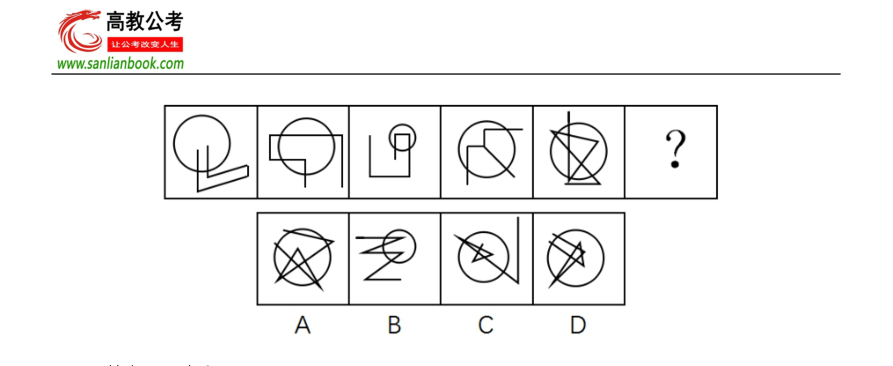

**77.** 从所给的四个选项中，选出最适合的一个填入问号处，使之呈现一定的规律性。  `[2018·副省·77]`

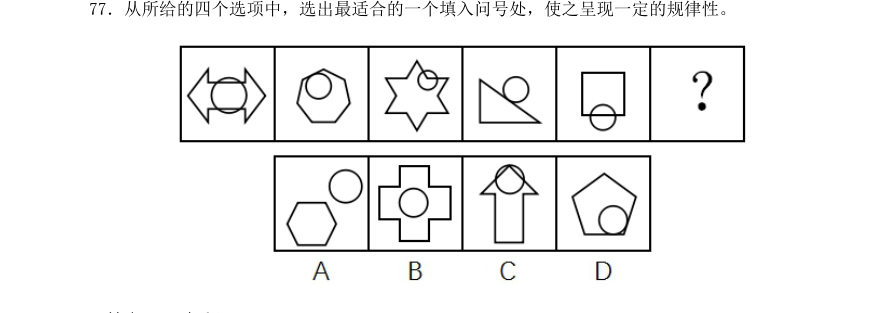

**78.** 从所给的四个选项中，选出最合适的一个填入问号处，使之呈现一定的规律性。  `[2018·副省·78]`

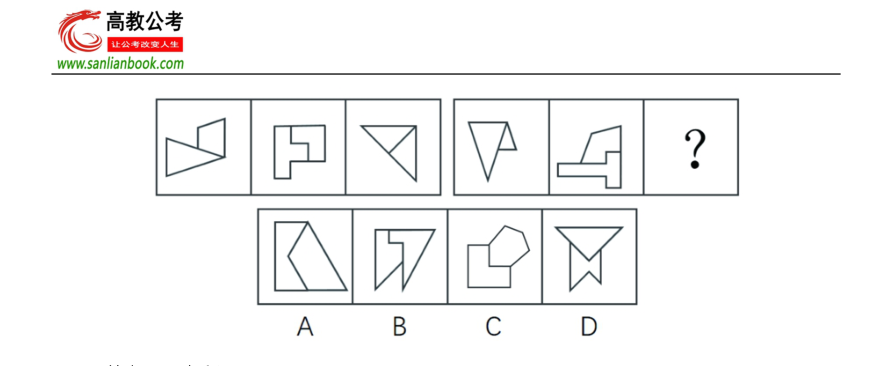

**79.** 从所给的四个选项中，选出最合适的一个填入问号处，使之呈现一定的规律性。  `[2018·副省·79]`

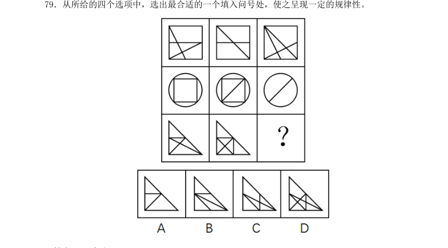

**80.** 左图给定的是正方体纸盒的外表面，下面哪一项能由它折叠而成？  `[2018·副省·80]`

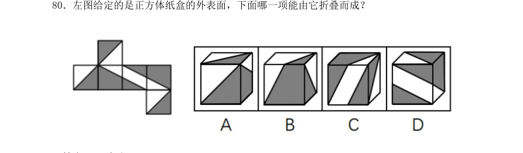

**81.** 下面四个立体图形中，哪一项不能用一个平面分割为两个完全相同或互为镜像的部分？  `[2018·副省·81]`
> （本题选项为图片，请配合原始PDF查看）

**82.** 左图为给定的多面体，从任一角度观看，右面哪一项不可能是该多面体的视图？  `[2018·副省·82]`
> （本题选项为图片，请配合原始PDF查看）

**83.** 把下面的六个图形分为两类，使每一类图形都有各自的共同特征或规律，分类正确的一项是：  `[2018·副省·83]`
- A. ①②⑥，③④⑤
- B. ①③④，②⑤⑥
- C. ①④⑤，②③⑥
- D. ①④⑥，②③⑤

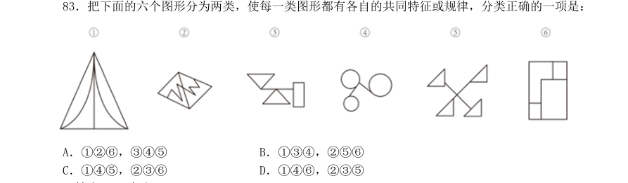

**84.** 把下面的六个图形分为两类，使每一类图形都有各自的共同特征或规律，分类正确的一项是：  `[2018·副省·84]`
- A. ①②⑥，③④⑤
- B. ①②⑤，③④⑥
- C. ①②③，④⑤⑥
- D. ①③⑤，②④⑥

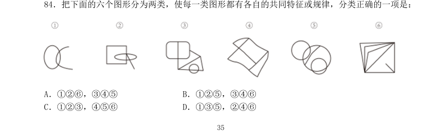

**85.** 把下面的六个图形分为两类，使每一类图形都有各自的共同特征或规律，分类正确的一项是：  `[2018·副省·85]`
- A. ①③④，②⑤⑥
- B. ①③⑥，②④⑤
- C. ①②③，④⑤⑥
- D. ①③⑤，②④⑥

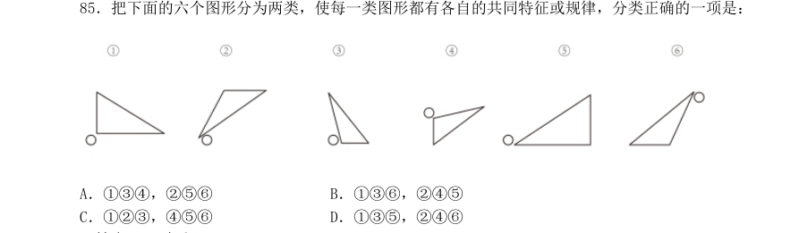

**86.** 伦理信用是指人们交往中由一定的预先约定、契约、承诺、誓言等引发的一种伦理关系，其蕴涵的合理秩序则凝结为遵守诺言、履行约定的道德准则，人们基于对信用伦理关系合理秩序的理解和规则的践行便形成了相应的道德品行。根据上述定义，下列涉及伦理信用的是：  `[2018·副省·86]`
- A. 陈某看到一群人在围殴邻居的孩子，他一边报警，一边跑上前去大声喝止
- B. 赵某答应了丈夫的临终请求，在丈夫去世后，对丈夫前妻留下的两个孩子视如己出，将他们抚养成人
- C. 王某父亲曾借给张某10 万元，王父去世后，王某要求张某还钱
- D. 李某家乡发生洪涝灾害，不少农民颗粒无收，父亲要求他发动其公司员工和微信圈朋友捐钱捐物

**87.** 定向调控指政府针对不同调控领域，制定清晰明确的调控政策，使调控更具针对性。相机调控指政府根据市场情况和各项调节措施的特点，灵活决定当前应采取哪一种或几种政策措施，重在“预调、微调”。定向调控是“做什么”，相机调控是“怎么做”。根据上述定义，下列属于相机调控的是：  `[2018·副省·87]`
- A. 甲国政府于年初提出了经济增长率和就业水平的“下限”、物价涨幅的“上限”等工作目标
- B. 乙国政府提出“双引擎”策略：一是对小微企业、“三农”等市场主体“减负”；二是支持公共产品、公共服务建设，拉动投资。由各地制定具体措施
- C. 丙国政府根据一二三四线城市房地产市场的不同特点，制定了有针对性的契税、房贷政策
- D. 丁国政府实行产品和服务的生产及销售完全由自由市场的自由价格机制所引导、产权明晰的经济政策

**88.** 法律的当然解释是指法律虽然没有明确规定某一事项，但依规范目的，该事项应当被解释为适用这一法律规定。其解释方法有举重以明轻和举轻以明重。前者是指对于某一应当被允许的行为，举一个情节比其严重而被允许的规定，以说明其应当被允许。后者是指对于某一应当被禁止的行为，举一个情节比其轻微而被禁止的规定，以说明其应当被禁止。根据上述定义，下列判断正确的是：  `[2018·副省·88]`
- A. 法律规定禁止在公园采摘树叶，依据举轻以明重，在公园攀折树枝的行为应当被禁止
- B. 唐律规定主人打死夜无故入人家者无罪，依据举轻以明重，主人打伤夜无故入人家者无罪
- C. 法律规定禁止携带小型动物，依据举重以明轻，携带大型动物的行为应当被禁止
- D. 法律规定16 周岁以下的未成年人不承担刑事责任，依据举重以明轻，15 周岁的未成年人不承担刑事责任

**89.** 系统脱敏法是一种心理治疗法，当患者面前出现引起焦虑和恐惧的刺激物时，引导患者放松，使患者逐渐消除焦虑与恐惧，不再对该刺激物产生病理性反应。它包括快速脱敏法和接触脱敏法等。前者是治疗者陪伴病人置身于令病人感到恐惧的情景，直到病人不再紧张为止。后者是通过示范，让病人逐渐与所惧怕的对象接触，最终达到克服恐惧的目的。根据上述定义，如果要治疗一名特别害怕蛇的孩子，下列治疗方法中属于接触脱敏法的是：  `[2018·副省·89]`
- A. 让孩子旁观别人触摸、拿起和放下蛇的过程后，再慢慢让孩子逐渐接近和触摸蛇
- B. 带孩子去室内蛇类养殖场，看各种不同种类的蛇，看多了自然就不再害怕了
- C. 给孩子讲有关蛇的有趣的童话故事，引发孩子开心的情绪，逐渐减少对蛇的恐惧
- D. 录下孩子看见蛇后恐惧害怕的表情和动作，然后一遍又一遍地把这些视频放给孩子看

**90.** 独立证明法和归谬法是间接论证的两种方法，其中独立证明法是通过证明与被反驳命题相矛盾的命题为真，从而确定被反驳命题为假的方法。归谬法就是由所要反驳的命题为真，引出荒谬的结论，从而证明所要反驳的命题为假。根据上述定义，下列论证中使用了独立证明法的是：  `[2018·副省·90]`
- A. 甲：人类是由猿猴进化而来的。乙：不可能！有哪一个人见过，哪一只猴子变成了人？
- B. 甲：天不生仲尼，万古如长夜。乙：难道仲尼以前的人都生活在黑暗之中？
- C. 甲：人性本恶。乙：如果真的人性本恶，那么道德规范又从何而来呢？
- D. 甲：温饱是谈道德的先决条件。乙：温饱绝不是谈道德的先决条件。古往今来，没有解决衣食之困的社会也在谈道德。

**91.** 符号现象是指表意上没有相关性的甲、乙两事物，当我们用甲事物代表乙事物时，甲事物就可以视为乙事物的符号。根据上述定义，下列不属于符号现象的是：  `[2018·副省·91]`
- A. 消防车的警笛声
- B. 医疗机构使用的十字标记
- C. 法院大门上雕刻的天平图案
- D. 体育比赛裁判员的哨声

**92.** 人耳对一个声音的感受性会因另一个声音的存在而发生改变。一个声音能被人耳听到的最低值会因另一声音的出现而提高，这种现象就是听觉掩蔽。根据上述定义，下列符合听觉掩蔽的是：  `[2018·副省·92]`
- A. 吵闹的课间，老师得大声说话，同学们才能听到
- B. 长时间戴耳机听音乐，会觉得听到的音量逐渐变小
- C. 人类无法听到蝙蝠等动物发出来的超声波
- D. 安静的房间内，我们能够听到闹钟“滴答”的声音

**93.** 异质型人力资本是指某个特定历史阶段中具有边际收益递增生产力形态的人力资本，表现为拥有者所具有的独特能力，这些能力主要包括：综合协调能力、判断决策能力、学习创新能力和承担风险能力等。根据上述定义，下列不涉及异质型人力资本的是：  `[2018·副省·93]`
- A. 某厂长期亏损，李某担任厂长后施行了大刀阔斧的改革，很快使工厂扭亏为盈
- B. 技术员陈某潜心钻研技术，他将人们认为不太可能整合的两种技术巧妙结合在一起，大大降低了生产成本
- C. 某包装厂效益平平，设计师王某应聘到该厂后，由于他的设计新颖、风格清新，一下子使该厂的包装产品畅销起来
- D. 某厂聘请某院士担任技术顾问，一大批风险投资公司慕名而来，一些高学历人才也陆续加盟

**94.** 数客互动管理是指通过先进的电子通讯和网络手段，达到企业与目标客户群之间高效、直接、自主、往复的沟通，从而满足客户的个性化需要。根据上述定义，下列属于数客互动管理的是：  `[2018·副省·94]`
- A. 某市政府在官网设立市长信箱，广泛收集各方面的意见，及时答复群众质询，努力改进政府工作
- B. 某玩具公司建立网络交流平台，家长只要将需要的玩具类型、价格、功能等提交给平台，公司就可以及时生产出来
- C. 某家具生产企业通过收集网络海量数据，进行市场需求分析，及时调整家具风格
- D. 某热水器厂家根据客户提供的信息，定期与客户联系，为客户提供免费检修服务

**95.** 蜂鸣式营销是一种通过向潜在消费者直接提供企业产品或服务，使其获得产品或服务体验的销售方式。根据上述定义，下列不属于蜂鸣式营销的是：  `[2018·副省·95]`
- A. 某软件公司在网上推出一款试用版软件，用户可免费试用三个月
- B. 某相机公司聘请演员在各大城市繁华地区扮演情侣，邀请可能成为目标客户的路人为他们拍照，借机向其宣传新款相机的功能
- C. 某企业定期向用户发送邮件，寄送产品杂志，推送优惠信息，并承诺购买产品一个月内不满意可以无条件退货
- D. 某饮料公司让营销人员频频出现在街道、咖啡馆、酒吧、超市等场所，请路人品尝不同口味的饮料来宣传自己的品牌

**96.** 法律︰法盲  `[2018·副省·96]`
- A. 文字︰文盲
- B. 雪地︰雪盲
- C. 地图︰路盲
- D. 黑暗︰夜盲

**97.** 众人拾柴︰火焰高  `[2018·副省·97]`
- A. 多行不义︰必自毙
- B. 打破沙锅︰问到底
- C. 敬酒不吃︰吃罚酒
- D. 四海之内︰皆兄弟

**98.** 羔羊跪乳︰乌鸦反哺  `[2018·副省·98]`
- A. 昙花一现︰惊鸿一瞥
- B. 魂不附体︰失魂落魄
- C. 锋芒毕露︰锐不可当
- D. 朽木难雕︰孺子可教

**99.** 花椒︰麻  `[2018·副省·99]`
- A. 月亮︰圆
- B. 水泥︰硬
- C. 饮料︰冷
- D. 火焰︰热

**100.** 蛋︰卤蛋︰松花蛋  `[2018·副省·100]`
- A. 豆︰红豆︰四季豆
- B. 油︰牛油︰植物油
- C. 瓜︰丝瓜︰白兰瓜
- D. 茶︰白茶︰乌龙茶

**101.** 闪电战︰战术︰突袭  `[2018·副省·101]`
- A. 润滑油︰机械︰减震
- B. 戈壁滩︰地形︰干旱
- C. 防空洞︰轰炸︰隐蔽
- D. 斑马线︰标记︰通过

**102.** 飞禽走兽︰大雁︰海鸥  `[2018·副省·102]`
- A. 珍馐美馔︰山珍︰海味
- B. 花鸟鱼虫︰鹦鹉︰画眉
- C. 锦衣玉食︰蟒袍︰霞帔
- D. 卧虎藏龙︰猛虎︰蛟龙

**103.** 净水器  对于  （  ）  相当于  （  ）  对于  汽缸  `[2018·副省·103]`
- A. 滤芯    蒸汽机
- B. 设备    元件
- C. 家庭    发动机
- D. 自来水  活塞

**104.** 日记  对于  （  ）  相当于  （  ）  对于  数据  `[2018·副省·104]`
- A. 纪念  查证
- B. 经历  内存
- C. 年鉴  计算机
- D. 日期  图片

**105.** 原始部落  对于  （  ）  相当于  （  ）  对于  先进科技  `[2018·副省·105]`
- A. 热带丛林  文明古国
- B. 边远小镇  创业园区
- C. 茹毛饮血  现代都市
- D. 钻木取火  宇宙航行

**106.** 扶贫必扶智。让贫困地区的孩子们接受良好教育，是扶贫开发的重要任务，也是阻断贫困代际传递的重要途径。以上观点的前提是：  `[2018·副省·106]`
- A. 贫困的代际传递导致教育的落后
- B. 富有阶层大都受过良好教育
- C. 扶贫工作难，扶智工作更难
- D. 知识改变命运，教育成就财富

**107.** 有调查显示，部分学生缺乏创造力。研究者认为，具有创造力的孩子在幼年时都比较淘气，而在一些家庭，小孩如果淘气就会被家长严厉呵斥，这导致他们只能乖乖听话，创造力就有所下降。这项调查最能支持的论断是：  `[2018·副省·107]`
- A. 幼年是创造力发展的关键时期
- B. 教育方式会影响孩子创造力的发展
- C. 幼年听话的孩子长大之后可能缺乏创造力
- D. 有些家长对小孩淘气倾向于采取比较严厉的态度

**108.** 人们普遍认为，保持乐观心态会促进健康。但一项对7 万名50 岁左右的女性进行的长达十年的追踪研究发现，长期保持乐观心态的被试与悲观被试在死亡率上并没有差异，研究者据此认为，心态乐观与否与健康没有关系。以下哪项如果为真，最能质疑研究者的结论？  `[2018·副省·108]`
- A. 在这项研究的被试中悲观的人更多患有慢性疾病，虽然尚未严重到致命的程度
- B. 与悲观的人相比，乐观的人患病后会更积极主动地治疗
- C. 乐观的人往往对身体不会特别关注，有时一些致命性疾病无法及早发现
- D. 女性更善于维持和谐的人际关系，而良好的人际关系有助于健康

**109.** 自上世纪50 年代以来，全球每年平均爆发的大型龙卷风的次数从10 次左右上升至15 次。与此同时，人类活动激增，全球气候明显变暖，有人据此认为，气候变暖导致龙卷风爆发次数增加。以下哪项如果为真，不能削弱上述结论？  `[2018·副省·109]`
- A. 龙卷风的类型多样，全球变暖后，小型龙卷风出现的次数并没有明显的变化
- B. 气候温暖是龙卷风形成的一个必要条件，几乎所有龙卷风的形成都与当地较高的温度有关
- C. 尽管全球变暖，龙卷风依然最多地发生在美国的中西部地区，其他地区的龙卷风现象并不多见
- D. 龙卷风是雷暴天气（即伴有雷击和闪电的局地对流性天气）的产物，只要在雷雨天气下出现极强的空气对流，就容易发生龙卷风

**110.** 日前，研究人员发明了一种弹性超强的新材料，这种材料可以由1 英寸被拉伸到100 英寸以上，同时这一材料可以自行修复且能通过电压控制动作。因此研究者认为，利用该材料可以制成人工肌肉，替代人体肌肉，从而为那些肌肉损伤后无法恢复功能的患者带来福音。以下哪项如果为真，不能支持研究者的观点？  `[2018·副省·110]`
- A. 该材料制成的人工肌肉在受到破坏或损伤后能立即启动修复机制，比正常肌肉的康复速度快
- B. 该材料在电刺激下会发生膨胀或收缩，具有良好的柔韧性，与正常肌肉十分接近
- C. 目前，该材料研制成的人工肌肉尚不能与人体神经很好的契合，无法实现精准抓取物体等动作
- D. 一般材料如果被破坏，需通过溶剂修复或热修复复原，而该材料在室温下就能自行恢复

**111.** 有一种理论认为，距今约5000 万年前，生活在马达加斯加岛上的环尾狐猴、狐蝠以及其他哺乳动物的祖先当年乘坐天然的“木筏”，来到了马达加斯加这座位于印度洋的岛屿上。根据这一理论，来自非洲大陆东南部的哺乳动物当年漂流到马达加斯加，它们利用的交通工具是大原木或者漂浮的植被。在上演漂流记前，风暴将它们卷入大海，在洋流的带动下，这些古代“难民”漂流数周，来到马达加斯加。以下哪项如果为真，不能支持上述漂流理论？  `[2018·副省·111]`
- A. 5000 万年前，两个大陆板块周围的洋流曾一度向东流动，也就是流向马达加斯加
- B. 小型哺乳动物天生新陈代谢缓慢，能够在没有太多食物和淡水的情况下存活数周
- C. 在从非洲大陆东南部到达马达加斯加的动物中，没有大象，狮子等超重超大哺乳动物
- D. 5000 万年前，非洲大陆和马达加斯加之间的距离与今天不同

**112.** 某省游泳队进行了为期一个月的高原集训。集训最后一日，所有队员进行了一次队内测试，几位教练预测队员的成绩：张教练说：这次集训时间短，没人会达标。孙教练说：有队员会达标。王教练说：省运会冠军或国家队队员可达标。测试结束后，结果证明只有一位教练的预测是正确的。由此可以推出：  `[2018·副省·112]`
- A. 没有人达标
- B. 全队都达标了
- C. 省运会冠军达标
- D. 国家队队员未达标

**113.** 某公司30 岁以下的年轻员工中有一部分报名参加了公司在周末举办的外语培训班。该公司的部门经理一致同意在本周末开展野外拓展训练。所有报名参加外语培训班的员工都反对在本周末开展拓展训练。由此可以推出：  `[2018·副省·113]`
- A. 所有部门经理年龄都在30 岁以上
- B. 该公司部门经理中有人报名参加了周末的外语培训班
- C. 报名参加周末外语培训班的员工都是30 岁以下的年轻人
- D. 有些30 岁以下的年轻员工不是部门经理

**114.** 开车斗气、胡乱变线、强行超车等“路怒症”是一种被称为间歇性、暴发性障碍(IED)的心理疾病。有研究发现，IED 患者弓形虫检测呈阳性的比例是非IED 组的两倍。研究者认为，弓形虫感染有可能是导致包括“路怒症”在内的IED 的罪魁祸首。以下哪项如果为真，无法支持研究者的观点？  `[2018·副省·114]`
- A. 感染了弓形虫的老鼠往往更大胆、更敢于冒险，也因此更容易被猫抓到
- B. 弓形虫使大脑中控制威胁反应的神经元受到过度刺激，易引发攻击行为
- C. 对弓形虫检测呈阳性的IED 患者施以抗虫感染治疗之后，冲动行为减少
- D. 弓形虫是猫身上的一种原生动物寄生虫，但猫是比较温顺的动物

**115.** 某次会议讨论期间，甲、乙、丙、丁、戊被安排在一张圆桌前进行讨论，圆桌边放着标有1～ 5 号的五张座椅（未必按序排列）。实际讨论时，甲、乙、丙、丁、戊5 人均未按顺序坐在1～5 号的座椅上，已知：（1）甲坐在1 号座椅右边第二张座椅上；（2）乙坐在5 号座椅左边第二张座椅上；（3）丙坐在3 号座椅左边第一张座椅上；（4）丁坐在2 号座椅左边第一张座椅上。如果丙坐在1 号座椅上，则可知甲坐的是哪个座椅？  `[2018·副省·115]`
- A. 2 号
- B. 3 号
- C. 4 号
- D. 5 号

## 2018年 · 地市级

**71.** 从所给的四个选项中，选出最合适的一个填入问号处，使之呈现一定的规律性。  `[2018·地市·71]`

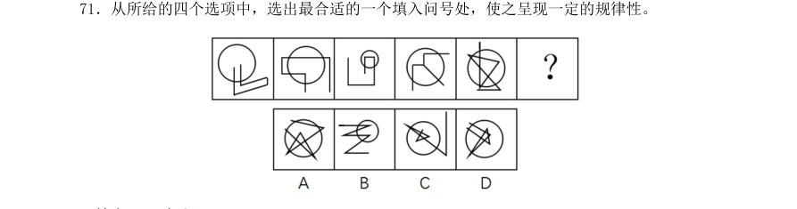

**72.** 从所给的四个选项中，选出最适合的一个填入问号处，使之呈现一定的规律性。  `[2018·地市·72]`

**73.** 从所给的四个选项中，选出最合适的一个填入问号处，使之呈现一定的规律性。  `[2018·地市·73]`

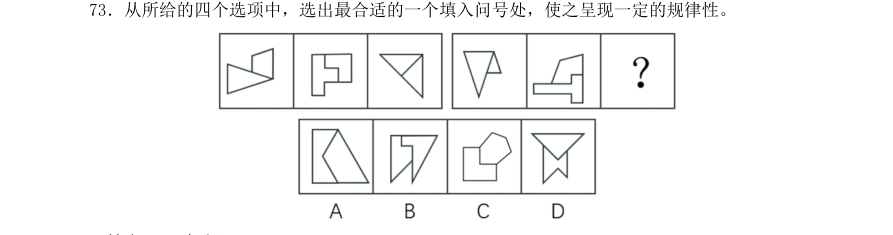

**74.** 从所给的四个选项中，选出最合适的一个填入问号处，使之呈现一定的规律性。  `[2018·地市·74]`

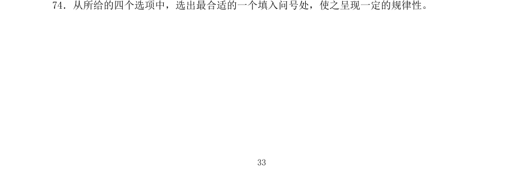

**75.** 左图给定的是正方体纸盒的外表面，下面哪一项能由它折叠而成？  `[2018·地市·75]`

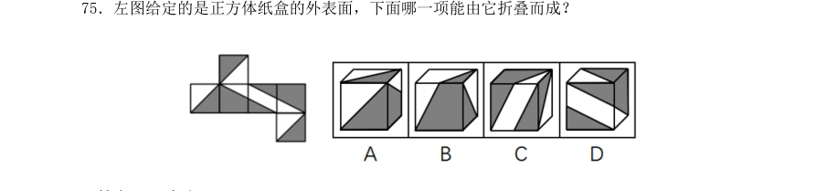

**76.** 下面四个立体图形中，哪一项不能用一个平面分割为两个完全相同或互为镜像的部分？  `[2018·地市·76]`
> （本题选项为图片，请配合原始PDF查看）

**77.** 左图为给定的多面体，从任一角度观看，右面哪一项不可能是该多面体的视图？  `[2018·地市·77]`
> （本题选项为图片，请配合原始PDF查看）

**78.** 把下面的六个图形分为两类，使每一类图形都有各自的共同特征或规律，分类正确的一项是：  `[2018·地市·78]`
- A. ①②⑥，③④⑤
- B. ①③④，②⑤⑥
- C. ①④⑤，②③⑥
- D. ①④⑥，②③⑤

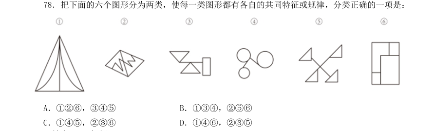

**79.** 把下面的六个图形分为两类，使每一类图形都有各自的共同特征或规律，分类正确的一项是：  `[2018·地市·79]`
- A. ①②⑥，③④⑤
- B. ①②⑤，③④⑥
- C. ①②③，④⑤⑥
- D. ①③⑤，②④⑥

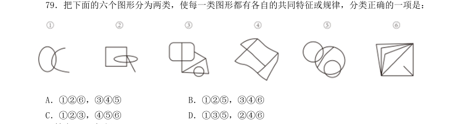

**80.** 把下面的六个图形分为两类，使每一类图形都有各自的共同特征或规律，分类正确的一项是：  `[2018·地市·80]`
- A. ①③④，②⑤⑥
- B. ①③⑥，②④⑤
- C. ①②③，④⑤⑥
- D. ①③⑤，②④⑥

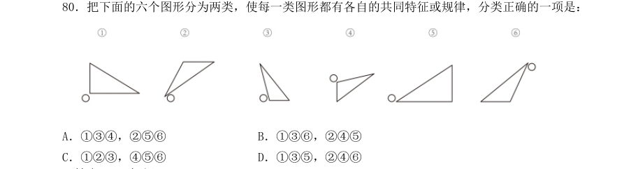

**81.** 伦理信用是指人们交往中由一定的预先约定、契约、承诺、誓言等引发的一种伦理关系，其蕴涵的合理秩序则凝结为遵守诺言、履行约定的道德准则，人们基于对信用伦理关系合理秩序的理解和规则的践行便形成了相应的道德品行。根据上述定义，下列涉及伦理信用的是：  `[2018·地市·81]`
- A. 陈某看到一群人在围殴邻居的孩子，他一边报警，一边跑上前去大声喝止
- B. 赵某答应了丈夫的临终请求，在丈夫去世后，对丈夫前妻留下的两个孩子视如己出，将他们抚养成人
- C. 王某父亲曾借给张某10 万元，王父去世后，王某要求张某还钱
- D. 李某家乡发生洪涝灾害，不少农民颗粒无收，父亲要求他发动其公司员工和微信圈朋友捐钱捐物

**82.** 定向调控指政府针对不同调控领域，制定清晰明确的调控政策，使调控更具针对性。相机调控指政府根据市场情况和各项调节措施的特点，灵活决定当前应采取哪一种或几种政策措施，重在“预调、微调”。定向调控是“做什么”，相机调控是“怎么做”。根据上述定义，下列属于相机调控的是：  `[2018·地市·82]`
- A. 甲国政府于年初提出了经济增长率和就业水平的“下限”、物价涨幅的“上限”等工作目标
- B. 乙国政府提出“双引擎”策略：一是对小微企业、“三农”等市场主体“减负”；二是支持公共产品、公共服务建设，拉动投资。由各地制定具体措施
- C. 丙国政府根据一二三四线城市房地产市场的不同特点，制定了有针对性的契税、房贷政策
- D. 丁国政府实行产品和服务的生产及销售完全由自由市场的自由价格机制所引导、产权明晰的经济政策

**83.** 法律的当然解释是指法律虽然没有明确规定某一事项，但依规范目的，该事项应当被解释为适用这一法律规定。其解释方法有举重以明轻和举轻以明重。前者是指对于某一应当被允许的行为，举一个情节比其严重而被允许的规定，以说明其应当被允许。后者是指对于某一应当被禁止的行为，举一个情节比其轻微而被禁止的规定，以说明其应当被禁止。根据上述定义，下列判断正确的是：  `[2018·地市·83]`
- A. 法律规定禁止在公园采摘树叶，依据举轻以明重，在公园攀折树枝的行为应当被禁止
- B. 唐律规定主人打死夜无故入人家者无罪，依据举轻以明重，主人打伤夜无故入人家者无罪
- C. 法律规定禁止携带小型动物，依据举重以明轻，携带大型动物的行为应当被禁止
- D. 法律规定16 周岁以下的未成年人不承担刑事责任，依据举重以明轻，15 周岁的未成年人不承担刑事责任

**84.** 系统脱敏法是一种心理治疗法，当患者面前出现引起焦虑和恐惧的刺激物时，引导患者放松，使患者逐渐消除焦虑与恐惧，不再对该刺激物产生病理性反应。它包括快速脱敏法和接触脱敏法等。前者是治疗者陪伴病人置身于令病人感到恐惧的情景，直到病人不再紧张为止。后者是通过示范，让病人逐渐与所惧怕的对象接触，最终达到克服恐惧的目的。根据上述定义，如果要治疗一名特别害怕蛇的孩子，下列治疗方法中属于接触脱敏法的是：  `[2018·地市·84]`
- A. 让孩子旁观别人触摸、拿起和放下蛇的过程后，再慢慢让孩子逐渐接近和触摸蛇
- B. 带孩子去室内蛇类养殖场，看各种不同种类的蛇，看多了自然就不再害怕了
- C. 给孩子讲有关蛇的有趣的童话故事，引发孩子开心的情绪，逐渐减少对蛇的恐惧
- D. 录下孩子看见蛇后恐惧害怕的表情和动作，然后一遍又一遍地把这些视频放给孩子看

**85.** 独立证明法和归谬法是间接论证的两种方法，其中独立证明法是通过证明与被反驳命题相矛盾的命题为真，从而确定被反驳命题为假的方法。归谬法就是由所要反驳的命题为真，引出荒谬的结论，从而证明所要反驳的命题为假。根据上述定义，下列论证中使用了独立证明法的是：  `[2018·地市·85]`
- A. 甲：人类是由猿猴进化而来的。乙：不可能！有哪一个人见过，哪一只猴子变成了人？
- B. 甲：天不生仲尼，万古如长夜。乙：难道仲尼以前的人都生活在黑暗之中？
- C. 甲：人性本恶。乙：如果真的人性本恶，那么道德规范又从何而来呢？
- D. 甲：温饱是谈道德的先决条件。乙：温饱绝不是谈道德的先决条件。古往今来，没有解决衣食之困的社会也在谈道德。

**86.** 符号现象是指表意上没有相关性的甲、乙两事物，当我们用甲事物代表乙事物时，甲事物就可以视为乙事物的符号。根据上述定义，下列不属于符号现象的是：  `[2018·地市·86]`
- A. 消防车的警笛声
- B. 医疗机构使用的十字标记
- C. 法院大门上雕刻的天平图案
- D. 体育比赛裁判员的哨声

**87.** 人耳对一个声音的感受性会因另一个声音的存在而发生改变。一个声音能被人耳听到的最低值会因另一声音的出现而提高，这种现象就是听觉掩蔽。根据上述定义，下列符合听觉掩蔽的是：  `[2018·地市·87]`
- A. 吵闹的课间，老师得大声说话，同学们才能听到
- B. 长时间戴耳机听音乐，会觉得听到的音量逐渐变小
- C. 人类无法听到蝙蝠等动物发出来的超声波
- D. 安静的房间内，我们能够听到闹钟“滴答”的声音

**88.** 异质型人力资本是指某个特定历史阶段中具有边际收益递增生产力形态的人力资本，表现为拥有者所具有的独特能力，这些能力主要包括：综合协调能力、判断决策能力、学习创新能力和承担风险能力等。根据上述定义，下列不涉及异质型人力资本的是：  `[2018·地市·88]`
- A. 某厂长期亏损，李某担任厂长后施行了大刀阔斧的改革，很快使工厂扭亏为盈
- B. 技术员陈某潜心钻研技术，他将人们认为不太可能整合的两种技术巧妙结合在一起，大大降低了生产成本
- C. 某包装厂效益平平，设计师王某应聘到该厂后，由于他的设计新颖、风格清新，一下子使该厂的包装产品畅销起来
- D. 某厂聘请某院士担任技术顾问，一大批风险投资公司慕名而来，一些高学历人才也陆续加盟

**89.** 数客互动管理是指通过先进的电子通讯和网络手段，达到企业与目标客户群之间高效、直接、自主、往复的沟通，从而满足客户的个性化需要。根据上述定义，下列属于数客互动管理的是：  `[2018·地市·89]`
- A. 某市政府在官网设立市长信箱，广泛收集各方面的意见，及时答复群众质询，努力改进政府工作
- B. 某玩具公司建立网络交流平台，家长只要将需要的玩具类型、价格、功能等提交给平台，公司就可以及时生产出来
- C. 某家具生产企业通过收集网络海量数据，进行市场需求分析，及时调整家具风格
- D. 某热水器厂家根据客户提供的信息，定期与客户联系，为客户提供免费检修服务

**90.** 蜂鸣式营销是一种通过向潜在消费者直接提供企业产品或服务，使其获得产品或服务体验的销售方式。根据上述定义，下列不属于蜂鸣式营销的是：  `[2018·地市·90]`
- A. 某软件公司在网上推出一款试用版软件，用户可免费试用三个月
- B. 某相机公司聘请演员在各大城市繁华地区扮演情侣，邀请可能成为目标客户的路人为他们拍照，借机向其宣传新款相机的功能
- C. 某企业定期向用户发送邮件，寄送产品杂志，推送优惠信息，并承诺购买产品一个月内不满意可以无条件退货
- D. 某饮料公司让营销人员频频出现在街道、咖啡馆、酒吧、超市等场所，请路人品尝不同口味的饮料来宣传自己的品牌

**91.** 法律︰法盲  `[2018·地市·91]`
- A. 文字︰文盲
- B. 雪地︰雪盲
- C. 地图︰路盲
- D. 黑暗︰夜盲

**92.** 众人拾柴︰火焰高  `[2018·地市·92]`
- A. 多行不义︰必自毙
- B. 打破沙锅︰问到底
- C. 敬酒不吃︰吃罚酒
- D. 四海之内︰皆兄弟

**93.** 羔羊跪乳︰乌鸦反哺  `[2018·地市·93]`
- A. 昙花一现︰惊鸿一瞥
- B. 魂不附体︰失魂落魄
- C. 锋芒毕露︰锐不可当
- D. 朽木难雕︰孺子可教

**94.** 花椒︰麻  `[2018·地市·94]`
- A. 月亮︰圆
- B. 水泥︰硬
- C. 饮料︰冷
- D. 火焰︰热

**95.** 蛋︰卤蛋︰松花蛋  `[2018·地市·95]`
- A. 豆︰红豆︰四季豆
- B. 油︰牛油︰植物油
- C. 瓜︰丝瓜︰白兰瓜
- D. 茶︰白茶︰乌龙茶

**96.** 闪电战︰战术︰突袭  `[2018·地市·96]`
- A. 润滑油︰机械︰减震
- B. 戈壁滩︰地形︰干旱
- C. 防空洞︰轰炸︰隐蔽
- D. 斑马线︰标记︰通过

**97.** 飞禽走兽︰大雁︰海鸥  `[2018·地市·97]`
- A. 珍馐美馔︰山珍︰海味
- B. 花鸟鱼虫︰鹦鹉︰画眉
- C. 锦衣玉食︰蟒袍︰霞帔
- D. 卧虎藏龙︰猛虎︰蛟龙

**98.** 净水器  对于  （  ）  相当于  （  ）  对于  汽缸  `[2018·地市·98]`
- A. 滤芯    蒸汽机
- B. 设备    元件
- C. 家庭    发动机
- D. 自来水  活塞

**99.** 日记  对于  （  ）  相当于  （  ）  对于  数据  `[2018·地市·99]`
- A. 纪念  查证
- B. 经历  内存
- C. 年鉴  计算机
- D. 日期  图片

**100.** 原始部落  对于  （  ）  相当于  （  ）  对于  先进科技  `[2018·地市·100]`
- A. 热带丛林  文明古国
- B. 边远小镇  创业园区
- C. 茹毛饮血  现代都市
- D. 钻木取火  宇宙航行

**101.** 扶贫必扶智。让贫困地区的孩子们接受良好教育，是扶贫开发的重要任务，也是阻断贫困代际传递的重要途径。以上观点的前提是：  `[2018·地市·101]`
- A. 贫困的代际传递导致教育的落后
- B. 富有阶层大都受过良好教育
- C. 扶贫工作难，扶智工作更难
- D. 知识改变命运，教育成就财富

**102.** 有调查显示，部分学生缺乏创造力。研究者认为，具有创造力的孩子在幼年时都比较淘气，而在一些家庭，小孩如果淘气就会被家长严厉呵斥，这导致他们只能乖乖听话，创造力就有所下降。这项调查最能支持的论断是：  `[2018·地市·102]`
- A. 幼年是创造力发展的关键时期
- B. 教育方式会影响孩子创造力的发展
- C. 幼年听话的孩子长大之后可能缺乏创造力
- D. 有些家长对小孩淘气倾向于采取比较严厉的态度

**103.** 人们普遍认为，保持乐观心态会促进健康。但一项对7 万名50 岁左右的女性进行的长达十年的追踪研究发现，长期保持乐观心态的被试与悲观被试在死亡率上并没有差异，研究者据此认为，心态乐观与否与健康没有关系。以下哪项如果为真，最能质疑研究者的结论？  `[2018·地市·103]`
- A. 在这项研究的被试中悲观的人更多患有慢性疾病，虽然尚未严重到致命的程度
- B. 与悲观的人相比，乐观的人患病后会更积极主动地治疗
- C. 乐观的人往往对身体不会特别关注，有时一些致命性疾病无法及早发现
- D. 女性更善于维持和谐的人际关系，而良好的人际关系有助于健康

**104.** 自上世纪50 年代以来，全球每年平均爆发的大型龙卷风的次数从10 次左右上升至15 次。与此同时，人类活动激增，全球气候明显变暖，有人据此认为，气候变暖导致龙卷风爆发次数增加。以下哪项如果为真，不能削弱上述结论？  `[2018·地市·104]`
- A. 龙卷风的类型多样，全球变暖后，小型龙卷风出现的次数并没有明显的变化
- B. 气候温暖是龙卷风形成的一个必要条件，几乎所有龙卷风的形成都与当地较高的温度有关
- C. 尽管全球变暖，龙卷风依然最多地发生在美国的中西部地区，其他地区的龙卷风现象并不多见
- D. 龙卷风是雷暴天气（即伴有雷击和闪电的局地对流性天气）的产物，只要在雷雨天气下出现极强的空气对流，就容易发生龙卷风

**105.** 日前，研究人员发明了一种弹性超强的新材料，这种材料可以由1 英寸被拉伸到100 英寸以上，同时这一材料可以自行修复且能通过电压控制动作。因此研究者认为，利用该材料可以制成人工肌肉，替代人体肌肉，从而为那些肌肉损伤后无法恢复功能的患者带来福音。以下哪项如果为真，不能支持研究者的观点？  `[2018·地市·105]`
- A. 该材料制成的人工肌肉在受到破坏或损伤后能立即启动修复机制，比正常肌肉的康复速度快
- B. 该材料在电刺激下会发生膨胀或收缩，具有良好的柔韧性，与正常肌肉十分接近
- C. 目前，该材料研制成的人工肌肉尚不能与人体神经很好的契合，无法实现精准抓取物体等动作
- D. 一般材料如果被破坏，需通过溶剂修复或热修复复原，而该材料在室温下就能自行恢复

**106.** 以下哪门课程不能安排在第4 天？  `[2018·地市·106]`
- A. 历史
- B. 哲学
- C. 艺术
- D. 宗教

**107.** 以下哪门课程安排在任意一天都有可能？  `[2018·地市·107]`
- A. 数学
- B. 宗教
- C. 统计
- D. 以上都不是

**108.** 以下哪门课程不能开设两次？  `[2018·地市·108]`
- A. 哲学
- B. 逻辑
- C. 统计
- D. 历史

**109.** 逻辑课程不能排在第几天？  `[2018·地市·109]`
- A. 第1 天
- B. 第2 天
- C. 第3 天
- D. 第4 天

**110.** 如果宗教课程开设两次，那么历史课程安排在哪一天？  `[2018·地市·110]`
- A. 第1 天
- B. 第2 天
- C. 第3 天
- D. 第4 天

## 2019年 · 副省级

**76.** 从所给的四个选项中，选择最合适的一个填入问号处，使之呈现一定的规律性：  `[2019·副省·76]`

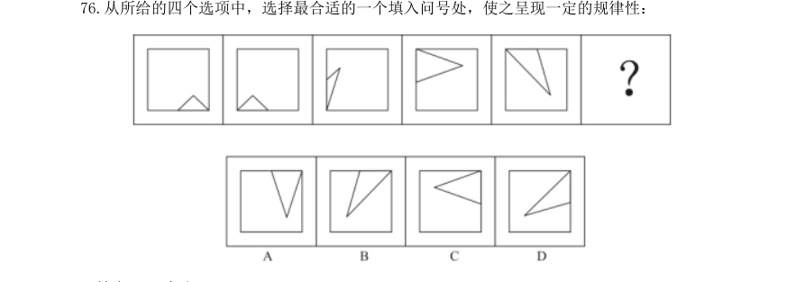

**77.** 从所给的四个选项中，选择最合适的一个填入问号处，使之呈现一定的规律性：  `[2019·副省·77]`

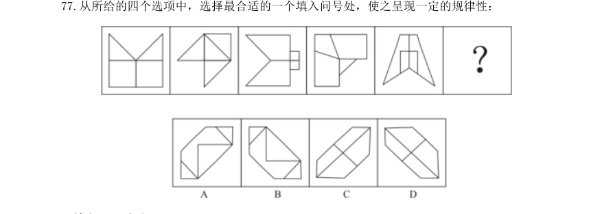

**78.** 从所给的四个选项中，选择最合适的一个填入问号处，使之呈现一定的规律性：  `[2019·副省·78]`

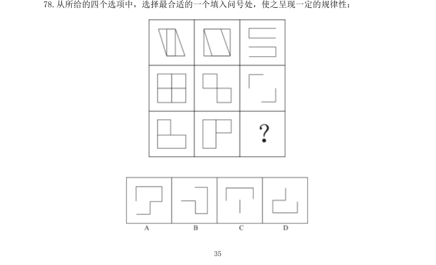

**79.** 从所给的四个选项中，选择最合适的一个填入问号处，使之呈现一定的规律性：  `[2019·副省·79]`

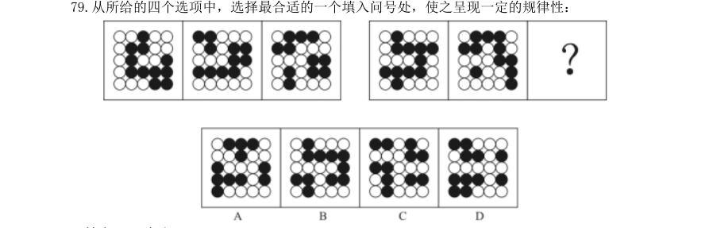

**80.** 左图为6 个相同小正方体组合成的多面体，将其从任一面剖开，以下哪一项不可能是该多面体的截面？  `[2019·副省·80]`

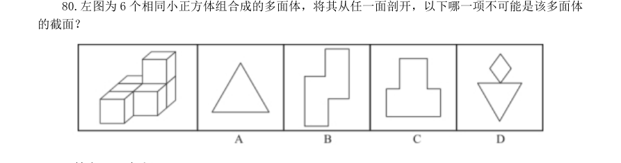

**81.** 左边给定的是正方体的外表面展开图，下面哪一项能由它折叠而成？  `[2019·副省·81]`

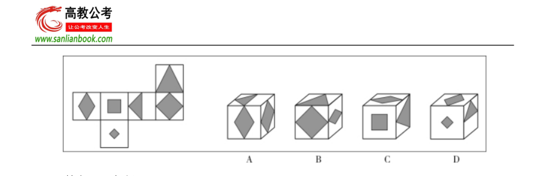

**82.** 下图为同样大小的正方体堆叠而成的多面体正视图和后视图，该多面体可拆分为①、②、③和④共4 个多面体的组合，问下列哪一项能填入问号处？  `[2019·副省·82]`
> （本题选项为图片，请配合原始PDF查看）

**83.** 把下面的六个图形分为两类，使每一类图形都有各自的共同特征或规律，分类正确的一项是：  `[2019·副省·83]`
- A. ①②③，④⑤⑥
- B. ①②⑥，③④⑤
- C. ①④⑥，②③⑤
- D. ①③④，②⑤⑥

**84.** 把下面的六个图形分为两类，使每一类图形都有各自的共同特征或规律，分类正确的一项是：  `[2019·副省·84]`
- A. ①④⑤,②③⑥
- B. ①②⑤,③④⑥
- C. ①④⑥,②③⑤
- D. ①③④,②⑤⑥

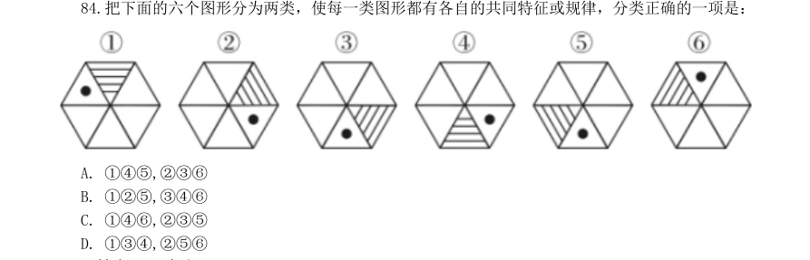

**86.** 把下面的六个图形分为两类，使每一类图形都有各自的共同特征或规律，分类正确的一项是：  `[2019·副省·86]`
- A. ①③④，②⑤⑥
- B. ①②⑥，③④⑤
- C. ①③⑤，②④⑥
- D. ①④⑥，②③⑤

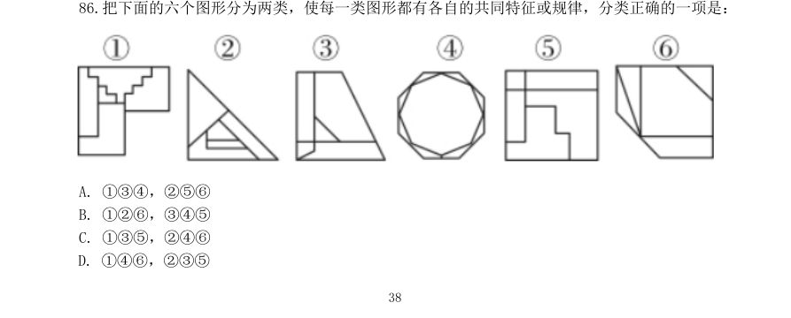

**86.** 定律假说是对一类事物或现象的性质或发生原因作出推测性解释，得出一个可能具有普遍性意义的规律性命题，从而试图建立、发展或补充科学理论。根据上述定义，下列属于定律假说的是：  `[2019·副省·86]`
- A. 老师向学生们解释潮汐现象产生的原因是海水在引力作用下出现的周期性运动
- B. 某单位仓库被盗，由于未发现破坏性进入的痕迹，侦查人员认为内部人员作案的可能性极大
- C. 牛顿根据苹果掉落现象发现了万有引力定律
- D. 有研究人员提出，由基因导致的疾病可能都是由于基因突变引起的

**87.** 严格指示词是指一个语言表达式所具有的如下性质：它所指示的对象不会随着该表达式被使用的具体情境而发生改变，这些情境通常包括表达式的使用主体、表达式被使用的时间、地点，世界状态等等。根据上述定义，下列属于严格指示词的是：  `[2019·副省·87]`
- A. 现任联合国秘书长
- B. 世界上身高最高的人
- C. 最小的素数
- D. 经常坐在教室第一排正中间的同学

**88.** 同病异治是指中医对相同疾病采取不同的治法，达到治病求本的治疗效果；异病同治是指不同的疾病在发展过程中出现性质相同的症状，因而可以采用同样的中医治疗方法。根据上述定义，下列属于异病同治的是：  `[2019·副省·88]`
- A. 久痢脱肛和胃下垂，均为中气下陷之证，可用升提中气之法治疗
- B. 外感风热，内有蕴热的表里俱实之证，宜解表和攻里之药同时并用
- C. 麻疹初期疹未出透，治疗宜宣肺透疹；中期肺热明显，治疗宜清热解毒
- D. 风热感冒宜用辛凉解表法治疗，风寒感冒宜用辛温解表法治疗

**89.** 物候现象是生物随着气候一年四季的周期性变化而发生的相应季节性变化的现象，影响物候现象的因素主要包括海拔的差异、经度的差异、纬度的差异和时间的差异。下列诗句反映的物候现象受到海拔差异影响的是：  `[2019·副省·89]`
- A. 日出江花红胜火，春来江水绿如蓝
- B. 竹外桃花三两枝，春江水暖鸭先知
- C. 人间四月芳菲尽，山寺桃花始盛开
- D. 羌笛何须怨杨柳，春风不度玉门关

**90.** 公平世界谬误是指人们倾向于认为我们生活的世界是公平的，一个人获得成就，是因为他肯定做对了什么，所以这份成就是他应得的；一个人遭遇不幸，他自己也有责任，甚至是咎由自取。根据上述定义，下列没有反映公平世界谬误的是：  `[2019·副省·90]`
- A. 一分耕耘，一分收获
- B. 谋事在人，成事在天
- C. 可怜之人必有可恨之处
- D. 天网恢恢，疏而不漏

**91.** 按照先后顺序排列的两个数字或者字母称为序对，如2a、e3、dm 等等，序对中的第一个数字或者字母称为前项，第二个称为后项。函项指的是由若干序对构成的一个有限序列，其中每个序对的前项都是字母，后项都是数字，并且对于任一序对，如果前项相同，则后项必定相同。根据上述定义，下列哪项属于函项？  `[2019·副省·91]`
- A. p3、c4、d6、p6、m8
- B. b3、5a、8n、p1、66
- C. f4、h4、gm、y2、x2
- D. a3、b5、d6，p1、e3

**92.** 诉前财产保全是指利害关系人因情况紧急，若不立即申请财产保全将会使其合法权益受到难以弥补的损害，起诉前向人民法院申请，由人民法院采取的一种财产保全措施。根据上述定义，下列不属于诉前财产保全的是：  `[2019·副省·92]`
- A. 工厂甲向信用社乙贷款500 万元，甲无法按期归还，乙随即起诉，审理期间得知甲已将设备转卖，遂请求法院查封甲正在出售的大楼
- B. 甲与乙签订购销合同，甲给乙200 万元预付款后，发现乙有欺诈行为，无力履行合同，遂请求人民法院冻结200 万元预付款
- C. 银行甲与公司乙签订协议，甲向乙提供5000 万元贷款，分3 期还清，第一笔到期时乙无力归还，甲向法院申请查封乙的财产
- D. 甲欠乙10 万元，乙多次找甲还钱未果，得知甲有一辆轿车、乙向法院申请将甲的轿车予以查封，再将甲告上法庭

**93.** 员工帮助计划是由企业为员工设置的一套长期的、系统的福利项目，通过专业人员对员工及其直系亲属提供专业指导和咨询，旨在帮助解决员工及其家庭成员的各种心理和行为问题，提高员工在企业中的工作绩效。根据上述定义，下列属于员工帮助计划的是：  `[2019·副省·93]`
- A. 项目经理小祁的父亲最近去世了，小祁很悲痛，工作效率受到很大影响，总经理特批了一笔慰问款
- B. 司机小方驾车外出工作期间交通肇事致人死亡，公司聘请律师为小方做从轻处罚的辩护，最终小方获刑三年
- C. 会计师老王的儿子没有考上大学，老王夫妇很烦恼，互相指责。在公司心理专员的指导下，老王改善了与妻子的沟通方式，情绪逐渐好转
- D. 职员小欣情绪低落，有自杀的念头，经医院诊断为重度抑郁症，需住院治疗。公司启动援助机制，为小欣支付了住院费用

**94.** 沟通网络是信息沟通的结构形式，常见的沟通网络有四种形式：在轮式网络中，一个下级同时与多个主管联系，但主管之间没有沟通的情形。在Y 式网络中，第二级有两个上级与之联系，第三级与一个或更多下级发生联系。在环式网络中，每个成员仅与相邻者联系，而不能与更远的成员进行沟通。在全通道式网络中，所有成员间充分进行沟通，所有成员的地位是平等的，无核心人物。根据上述定义，下列图形反映了轮式网络特点的是：  `[2019·副省·94]`
> （本题选项为图片，请配合原始PDF查看）

**95.** 变文和连文是古汉语中常用的修辞方法。变文是指为了避重而在相临近的句子中采用同义词来表达相同的意义。连文是指本来要表达甲，而连带说到乙，使两个相关联的词连在一起，但突出表达其中一个词的意义。根据上述定义，下列使用了连文这一修辞方法的是：  `[2019·副省·95]`
- A. 《史记·淮阴侯列传》：“置之死地而后生，置之亡地而后存。”
- B. 《易经·系辞上传》：“鼓之以雷霆，润之以风雨。”
- C. 诸葛亮《出师表》：“受任于败军之际，奉命于危难之间。”
- D. 贾谊《过秦论》：“南取汉中，西举巴蜀，东割膏腴之地、北收要害之郡。”

**96.** 分母︰除数  `[2019·副省·96]`
- A. 内角︰外角
- B. 加减法︰乘除法
- C. 横坐标︰纵坐标
- D. 百分比︰百分率

**97.** 直线交叉︰直线不平行  `[2019·副省·97]`
- A. x＞1︰x2＞1
- B. 100℃︰沸腾
- C. O3︰臭氧
- D. π︰圆面积

**98.** 刻舟︰求剑  `[2019·副省·98]`
- A. 里应︰外合
- B. 掩耳︰盗铃
- C. 打草︰惊蛇
- D. 指桑︰骂槐

**99.** 马蹄莲︰蟹爪兰  `[2019·副省·99]`
- A. 牵牛花︰美人蕉
- B. 卷心菜︰夜来香
- C. 灯笼椒︰金针菇
- D. 佛手柑︰含羞草

**100.** 金库︰现钞︰保管  `[2019·副省·100]`
- A. 网球场︰球迷︰观看
- B. 电缆车︰景区︰观光
- C. 录音棚︰专辑︰播放
- D. 美术馆︰字画︰陈列

**101.** 山洪︰村民︰士兵  `[2019·副省·101]`
- A. 狂风︰雷电︰灯塔
- B. 事故︰伤员︰医生
- C. 海啸︰船舶︰渔民
- D. 婚礼︰新人︰主持

**102.** 病毒︰传染病︰流行性  `[2019·副省·102]`
- A. 毒驾︰车祸︰危害性
- B. 市场︰交易︰自发性
- C. 噪声︰听力损伤︰普遍性
- D. 甜食︰肥胖症︰突发性

**103.** 微量元素︰稀有金属︰铜  `[2019·副省·103]`
- A. 木本植物︰草本植物︰松树
- B. 海洋动物︰哺乳动物︰北极熊
- C. 内陆湖︰淡水湖︰青海湖
- D. 节肢动物︰两栖动物︰鳄鱼

**104.** 莲蓬  对于  （    ）相当于（    ）  对于  葛根  `[2019·副省·104]`
- A. 荷叶；葛藤
- B. 荷花；葛粉
- C. 喜爱；纠缠
- D. 荷塘；山岗

**105.** 立案  对于  （    ）相当于（    ）  对于  判决  `[2019·副省·105]`
- A. 起诉；服刑
- B. 审理；质证
- C. 犯罪；调解
- D. 罚款；执行

**106.** 一般来说，塑料极难被分解，即使是较小的碎片也很难被生态系统降解，因此它造成的环境破坏十分严重。近期科学家发现，一种被称为蜡虫的昆虫能够降解聚乙烯，而且速度极快。如果使用生物技术复制蜡虫降解聚乙烯，将能够帮助我们有效清理垃圾填埋厂和海洋中累积的塑料垃圾。以下哪项如果为真，不能支持上述结论？  `[2019·副省·106]`
- A. 世界各地的塑料垃圾的主要成分是聚乙烯
- B. 蜡虫的确能够破坏聚乙烯塑料的高分子链
- C. 聚乙烯被蜡虫降解后的物质对环境的影响尚不明确
- D. 现有科技手段能够将蜡虫降解聚乙烯的酶纯化出来

**107.** 所有的幼儿园都面临同一个问题：就是对于那些在幼儿园放学之后不能及时来接孩子的家长，幼儿园老师除了等待别无他法，因此许多幼儿园都向晚接孩子的家长收取费用。然而，有调查显示，收取费用后晚接孩子的家长数量并未因此减少，反而增加了。以下哪项如果为真，最能解释上述调查结果？  `[2019·副省·107]`
- A. 收费标准太低，对原本经常晚来接孩子的家长没有太大的约束力
- B. 有个别家长对收费行为不满，有时会故意以晚接孩子的行为来抗议
- C. 有些家长因工作忙碌，常常不能及时来接孩子
- D. 收费后，更多的家长认为即使晚来接孩子也不必愧疚，只要付费即可

**108.** 应激本身没有致痛能力，但是流行病学调查发现，长期应激与疼痛慢性化的发生正相关，即长期处于巨大压力下的人群，其疼痛症状更易迁延，进而发展为慢性疼痛。以下哪项如果为真，最能支持上述调查结果？  `[2019·副省·108]`
- A. 具有焦虑倾向的人，其应激水平往往较高，疼痛慢性化的发生率也会更高
- B. 长期应激可影响神经内分泌系统，使人的疼痛抑制系统的功能被削弱
- C. 吸烟使人体神经内分泌系统发生紊乱，对疼痛感知的影响与应激相似
- D. 如果能有效缓解应激，保持心态平和，疼痛慢性化的发生率将会降低50%

**109.** 自从前年甲航运公司实行了经理任期目标责任制之后，公司的经济效益也随之逐年上升。可见，只有实行经理任期目标责任制，才能使甲公司经济效益稳步增长。以下哪项如果为真，最能削弱上述论证？  `[2019·副省·109]`
- A. 近两年国家经济发展速度较快，航运行业的整体形势大好
- B. 没实行任期目标责任制的乙航运公司，近两年的经济效益也稳步增长
- C. 前年甲公司开始实行职工薪酬管理制度改革，极大地调动了公司员工的积极性
- D. 如果甲航运公司没有实行任期目标责任制，近两年的经济效益会增长得更快

**110.** 所有的地震都是以P 波开始的，这些P 波移动快速，使地面发生上下震动，造成的破坏较小。下一个是S 波，它的移动很慢，使地面前后、左右晃动，破坏性极大。早期预警系统通过测量P 波沿地面移动的情况，来预测S 波所造成的影响，然后发出警报。然而，从事此类系统工作的科学家们发现，事实上人们并没有多少时间为大地震做好准备。要得到上述结论，需要补充的最重要前提是：  `[2019·副省·110]`
- A. 地球上每年大约发生500 多万次地震，绝大多数的地震人们根本感觉不到
- B. 根据历年大地震的记载，强震大多在夜里瞬间发生，无法在短时间内组织有效的防御行动
- C. 地震越大，P 波与S 波之间的间隔越短，留给人们预警的时间不多
- D. 发生较大地震时，人们先感到上下颠簸，而后才有很强的水平晃动，这种晃动是由S 波造成的

**111.** 有实验表明，秋葵的提取物——秋葵素，对于治疗动物糖尿病有一定效果。有人据此认为，秋葵切片泡水喝，有助于降低糖尿病人的血糖。以下哪项如果为真，最能质疑上述论证？  `[2019·副省·111]`
- A. 只有使用提取、浓缩后的大剂量秋葵素才能降低糖尿病人的血糖
- B. 接受正规治疗才是糖尿病人控制血糖最为安全有效的途径
- C. 秋葵素对Ⅱ型糖尿病患者有效，对Ⅰ型糖尿病患者无效
- D. 秋葵中所含有的膳食纤维和多种维生素并不比一般蔬菜高

**112.** 有研究人员认为，人类脱发是由于营养不均衡导致的。当人体无法吸收到均衡的营养，毛囊就会萎缩，从而导致脱发。但是，有反对者认为，脱发是由于毛囊受损导致的。当毛囊受损后，处于“假性死亡”状态，毛囊退化并萎缩，导致毛发停止生长，逐渐枯萎脱落。以下哪项如果为真，最能削弱反对者的观点？  `[2019·副省·112]`
- A. 毛囊受损是由营养不均衡导致的
- B. 长期营养不足的人住往头发枯黄，易脱发
- C. 使用洗发水也会对毛囊造成一定程度的损害
- D. 毛囊受损使其不能从头皮中吸收营养，从而导致脱发

**113.** 有位青年到杂志社询问投稿结果。编辑说：“你的稿子我看过了，总的来说有一些基础，不过在语言表达上仍不够成熟，流于幼稚。”青年问：“那能不能把它当作儿童文学作品呢？”下列选项中与青年所犯的逻辑错误相同的是：  `[2019·副省·113]`
- A. 甲到处宣扬说：“我从来不炫耀自己的优点。”
- B. 甲说：“人生太短暂，我们应该珍惜时间，抓住机会，尽情挥霍。”
- C. 甲问：“我能用蓝笔墨水写出红字，你信吗？”乙答：“不信。”甲就提笔在纸上写了一个“红”字
- D. 甲开车撞到了行人乙，二人争执起来，甲说：“我有多年驾驶经验，责任不可能在我。”

**114.** 小溪根据学习计划制定了阅读书单，准备阅读《红楼梦》《水浒传》《三国演义》《西游记》《论语》《道德经》《诗经》七部名著，每部均要阅读，但是她的阅读顺序必须符合如下要求：（1）阅读《道德经》之前要先阅读《三国演义》，阅读这两部著作之间还要阅读另外两部著作（《诗经》除外）；（2）第一部或者最后一部阅读《西游记》；（3）第三部阅读《论语》；（4）阅读《诗经》要在阅读《道德经》之前或者刚刚阅读完《道德经》之后。如果小溪首先要阅读《三国演义》，则可以确定她的阅读顺序是：  `[2019·副省·114]`
- A. 第二部阅读《水浒传》
- B. 第五部阅读《道德经》
- C. 第二部阅读《红楼梦》
- D. 第五部阅读《诗经》

**115.** 小若为了参加一项法律考试，准备在一周之内复习14 门课程，其中民法课程5 门、经济法课程3 门、行政法课程3 门、商法课程2 门、国际私法课程1 门。但是因为精力有限，小若每天只能复习2 门课程，并且需要满足以下条件：（1）星期四只能复习2 门民法课程，其余每天必须复习两类不同的课程；（2）国际私法必须在星期天复习；（3）民法和行政法不能在同一天复习；（4）经济法和商法不能在同一天复习。由此可以推出，以下哪两类课程不可能在同一天复习：  `[2019·副省·115]`
- A. 经济法和国际私法
- B. 行政法和经济法
- C. 行政法和商法
- D. 民法和经济法

## 2019年 · 地市级

**71.** 从所给的四个选项中，选择最合适的一个填入问号处，使之呈现一定的规律性：  `[2019·地市·71]`

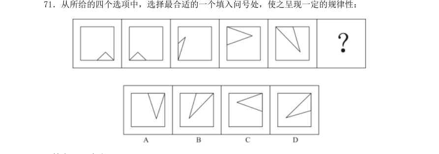

**72.** 从所给的四个选项中，选择最合适的一个填入问号处，使之呈现一定的规律性：  `[2019·地市·72]`

**73.** 从所给的四个选项中，选择最合适的一个填入问号处，使之呈现一定的规律性：  `[2019·地市·73]`

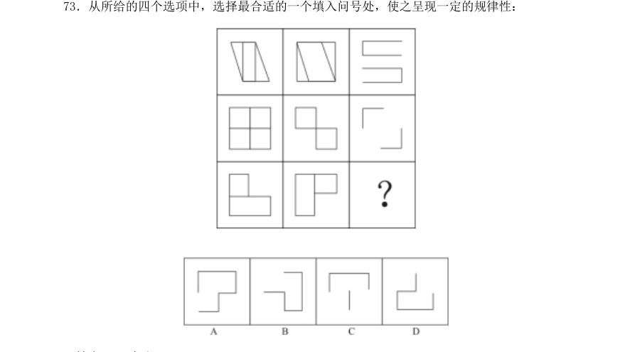

**74.** 从所给的四个选项中，选择最合适的一个填入问号处，使之呈现一定的规律性：  `[2019·地市·74]`

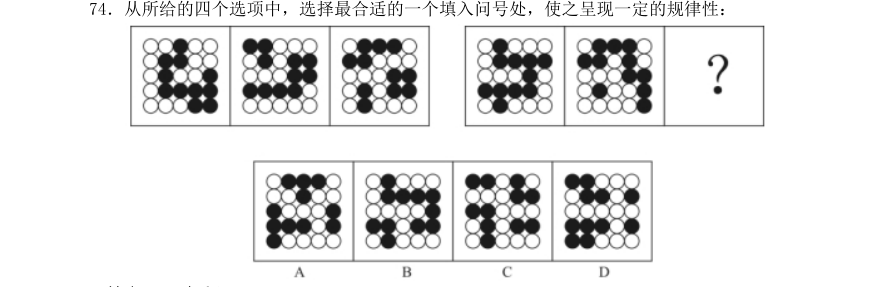

**75.** 左图为6 个相同小正方体组合成的多面体，将其从任一面剖开，以下哪一项不可能是该多面体的截面？  `[2019·地市·75]`

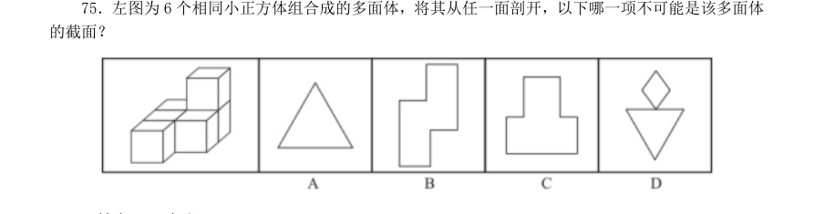

**76.** 左边给定的是正方体的外表面展开图，下面哪一项能由它折叠而成？  `[2019·地市·76]`

**77.** 下图为同样大小的正方体堆叠而成的多面体正视图和后视图，该多面体可拆分为①、②、③和④共4 个多面体的组合，问下列哪一项能填入问号处？  `[2019·地市·77]`
> （本题选项为图片，请配合原始PDF查看）

**78.** 把下面的六个图形分为两类，使每一类图形都有各自的共同特征或规律，分类正确的一项是：  `[2019·地市·78]`
- A. ①②③，④⑤⑥
- B. ①②⑥，③④⑤
- C. ①④⑥，②③⑤
- D. ①③④，②⑤⑥

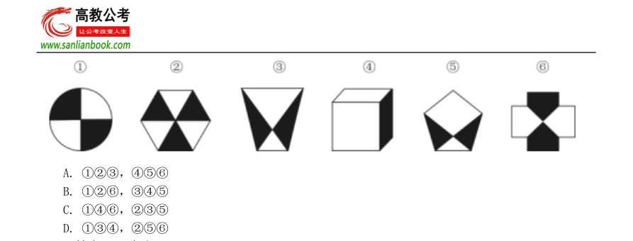

**79.** 把下面的六个图形分为两类，使每一类图形都有各自的共同特征或规律，分类正确的一项是：  `[2019·地市·79]`
- A. ①④⑤,②③⑥
- B. ①②⑤,③④⑥
- C. ①④⑥,②③⑤
- D. ①③④,②⑤⑥

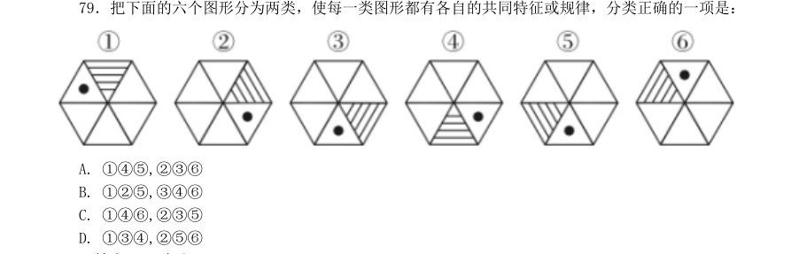

**80.** 把下面的六个图形分为两类，使每一类图形都有各自的共同特征或规律，分类正确的一项是：  `[2019·地市·80]`
- A. ①③④，②⑤⑥
- B. ①②⑥，③④⑤
- C. ①③⑤，②④⑥
- D. ①④⑥，②③⑤

**81.** 定律假说是对一类事物或现象的性质或发生原因作出推测性解释，得出一个可能具有普遍性意义的规律性命题，从而试图建立、发展或补充科学理论。根据上述定义，下列属于定律假说的是：  `[2019·地市·81]`
- A. 老师向学生们解释潮汐现象产生的原因是海水在引力作用下出现的周期性运动
- B. 某单位仓库被盗，由于未发现破坏性进入的痕迹，侦查人员认为内部人员作案的可能性极大
- C. 牛顿根据苹果掉落现象发现了万有引力定律
- D. 有研究人员提出，由基因导致的疾病可能都是由于基因突变引起的

**82.** 严格指示词是指一个语言表达式所具有的如下性质：它所指示的对象不会随着该表达式被使用的具体情境而发生改变，这些情境通常包括表达式的使用主体、表达式被使用的时间、地点，世界状态等等。根据上述定义，下列属于严格指示词的是：  `[2019·地市·82]`
- A. 现任联合国秘书长
- B. 世界上身高最高的人
- C. 最小的素数
- D. 经常坐在教室第一排正中间的同学

**83.** 同病异治是指中医对相同疾病采取不同的治法，达到治病求本的治疗效果；异病同治是指不同的疾病在发展过程中出现性质相同的症状，因而可以采用同样的中医治疗方法。根据上述定义，下列属于异病同治的是：  `[2019·地市·83]`
- A. 久痢脱肛和胃下垂，均为中气下陷之证，可用升提中气之法治疗
- B. 外感风热，内有蕴热的表里俱实之证，宜解表和攻里之药同时并用
- C. 麻疹初期疹未出透，治疗宜宣肺透疹；中期肺热明显，治疗宜清热解毒
- D. 风热感冒宜用辛凉解表法治疗，风寒感冒宜用辛温解表法治疗

**84.** 物候现象是生物随着气候一年四季的周期性变化而发生的相应季节性变化的现象，影响物候现象的因素主要包括海拔的差异、经度的差异、纬度的差异和时间的差异。下列诗句反映的物候现象受到海拔差异影响的是：  `[2019·地市·84]`
- A. 日出江花红胜火，春来江水绿如蓝
- B. 竹外桃花三两枝，春江水暖鸭先知
- C. 人间四月芳菲尽，山寺桃花始盛开
- D. 羌笛何须怨杨柳，春风不度玉门关

**85.** 公平世界谬误是指人们倾向于认为我们生活的世界是公平的，一个人获得成就，是因为他肯定做对了什么，所以这份成就是他应得的；一个人遭遇不幸，他自己也有责任，甚至是咎由自取。根据上述定义，下列没有反映公平世界谬误的是：  `[2019·地市·85]`
- A. 一分耕耘，一分收获
- B. 谋事在人，成事在天
- C. 可怜之人必有可恨之处
- D. 天网恢恢，疏而不漏

**86.** 按照先后顺序排列的两个数字或者字母称为序对，如2a、e3、dm 等等，序对中的第一个数字或者字母称为前项，第二个称为后项。函项指的是由若干序对构成的一个有限序列，其中每个序对的前项都是字母，后项都是数字，并且对于任一序对，如果前项相同，则后项必定相同。根据上述定义，下列哪项属于函项？  `[2019·地市·86]`
- A. p3、c4、d6、p6、m8
- B. b3、5a、8n、p1、66
- C. f4、h4、gm、y2、x2
- D. a3、b5、d6，p1、e3

**87.** 诉前财产保全是指利害关系人因情况紧急，若不立即申请财产保全将会使其合法权益受到难以弥补的损害，起诉前向人民法院申请，由人民法院采取的一种财产保全措施。根据上述定义，下列不属于诉前财产保全的是：  `[2019·地市·87]`
- A. 工厂甲向信用社乙贷款500 万元，甲无法按期归还，乙随即起诉，审理期间得知甲已将设备转卖，遂请求法院查封甲正在出售的大楼
- B. 甲与乙签订购销合同，甲给乙200 万元预付款后，发现乙有欺诈行为，无力履行合同，遂请求人民法院冻结200 万元预付款
- C. 银行甲与公司乙签订协议，甲向乙提供5000 万元贷款，分3 期还清，第一笔到期时乙无力归还，甲向法院申请查封乙的财产
- D. 甲欠乙10 万元，乙多次找甲还钱未果，得知甲有一辆轿车、乙向法院申请将甲的轿车予以查封，再将甲告上法庭

**88.** 员工帮助计划是由企业为员工设置的一套长期的、系统的福利项目，通过专业人员对员工及其直系亲属提供专业指导和咨询，旨在帮助解决员工及其家庭成员的各种心理和行为问题，提高员工在企业中的工作绩效。根据上述定义，下列属于员工帮助计划的是：  `[2019·地市·88]`
- A. 项目经理小祁的父亲最近去世了，小祁很悲痛，工作效率受到很大影响，总经理特批了一笔慰问款
- B. 司机小方驾车外出工作期间交通肇事致人死亡，公司聘请律师为小方做从轻处罚的辩护，最终小方获刑三年
- C. 会计师老王的儿子没有考上大学，老王夫妇很烦恼，互相指责。在公司心理专员的指导下，老王改善了与妻子的沟通方式，情绪逐渐好转
- D. 职员小欣情绪低落，有自杀的念头，经医院诊断为重度抑郁症，需住院治疗。公司启动援助机制，为小欣支付了住院费用

**89.** 沟通网络是信息沟通的结构形式，常见的沟通网络有四种形式：在轮式网络中，一个下级同时与多个主管联系，但主管之间没有沟通的情形。在Y 式网络中，第二级有两个上级与之联系，第三级与一个或更多下级发生联系。在环式网络中，每个成员仅与相邻者联系，而不能与更远的成员进行沟通。在全通道式网络中，所有成员间充分进行沟通，所有成员的地位是平等的，无核心人物。根据上述定义，下列图形反映了轮式网络特点的是：  `[2019·地市·89]`
> （本题选项为图片，请配合原始PDF查看）

**90.** 变文和连文是古汉语中常用的修辞方法。变文是指为了避重而在相临近的句子中采用同义词来表达相同的意义。连文是指本来要表达甲，而连带说到乙，使两个相关联的词连在一起，但突出表达其中一个词的意义。根据上述定义，下列使用了连文这一修辞方法的是：  `[2019·地市·90]`
- A. 《史记·淮阴侯列传》：“置之死地而后生，置之亡地而后存。”
- B. 《易经·系辞上传》：“鼓之以雷霆，润之以风雨。”
- C. 诸葛亮《出师表》：“受任于败军之际，奉命于危难之间。”
- D. 贾谊《过秦论》：“南取汉中，西举巴蜀，东割膏腴之地、北收要害之郡。”

**91.** 分母︰除数  `[2019·地市·91]`
- A. 内角︰外角
- B. 加减法︰乘除法
- C. 横坐标︰纵坐标
- D. 百分比︰百分率

**92.** 直线交叉︰直线不平行  `[2019·地市·92]`
- A. x＞1︰x2＞1
- B. 100℃︰沸腾
- C. O3︰臭氧
- D. ∏︰圆面积

**93.** 刻舟︰求剑  `[2019·地市·93]`
- A. 里应︰外合
- B. 掩耳︰盗铃
- C. 打草︰惊蛇
- D. 指桑︰骂槐

**94.** 马蹄莲︰蟹爪兰  `[2019·地市·94]`
- A. 牵牛花︰美人蕉
- B. 卷心菜︰夜来香
- C. 灯笼椒︰金针菇
- D. 佛手柑︰含羞草

**95.** 金库︰现钞︰保管  `[2019·地市·95]`
- A. 网球场︰球迷︰观看
- B. 电缆车︰景区︰观光
- C. 录音棚︰专辑︰播放
- D. 美术馆︰字画︰陈列

**96.** 山洪︰村民︰士兵  `[2019·地市·96]`
- A. 狂风︰雷电︰灯塔
- B. 事故︰伤员︰医生
- C. 海啸︰船舶︰渔民
- D. 婚礼︰新人︰主持

**97.** 病毒︰传染病︰流行性  `[2019·地市·97]`
- A. 毒驾︰车祸︰危害性
- B. 市场︰交易︰自发性
- C. 噪声︰听力损伤︰普遍性
- D. 甜食︰肥胖症︰突发性

**98.** 微量元素︰稀有金属︰铜  `[2019·地市·98]`
- A. 木本植物︰草本植物︰松树
- B. 海洋动物︰哺乳动物︰北极熊
- C. 内陆湖︰淡水湖︰青海湖
- D. 节肢动物︰两栖动物︰鳄鱼

**99.** 莲蓬  对于  （    ）相当于（    ）  对于  葛根  `[2019·地市·99]`
- A. 荷叶；葛藤
- B. 荷花；葛粉
- C. 喜爱；纠缠
- D. 荷塘；山岗

**100.** 立案  对于  （    ）相当于（    ）  对于  判决  `[2019·地市·100]`
- A. 起诉；服刑
- B. 审理；质证
- C. 犯罪；调解
- D. 罚款；执行

**101.** 一般来说，塑料极难被分解，即使是较小的碎片也很难被生态系统降解，因此它造成的环境破坏十分严重。近期科学家发现，一种被称为蜡虫的昆虫能够降解聚乙烯，而且速度极快。如果使用生物技术复制蜡虫降解聚乙烯，将能够帮助我们有效清理垃圾填埋厂和海洋中累积的塑料垃圾。以下哪项如果为真，不能支持上述结论？  `[2019·地市·101]`
- A. 世界各地的塑料垃圾的主要成分是聚乙烯
- B. 蜡虫的确能够破坏聚乙烯塑料的高分子链
- C. 聚乙烯被蜡虫降解后的物质对环境的影响尚不明确
- D. 现有科技手段能够将蜡虫降解聚乙烯的酶纯化出来

**102.** 所有的幼儿园都面临同一个问题：就是对于那些在幼儿园放学之后不能及时来接孩子的家长，幼儿园老师除了等待别无他法，因此许多幼儿园都向晚接孩子的家长收取费用。然而，有调查显示，收取费用后晚接孩子的家长数量并未因此减少，反而增加了。以下哪项如果为真，最能解释上述调查结果？  `[2019·地市·102]`
- A. 收费标准太低，对原本经常晚来接孩子的家长没有太大的约束力
- B. 有个别家长对收费行为不满，有时会故意以晚接孩子的行为来抗议
- C. 有些家长因工作忙碌，常常不能及时来接孩子
- D. 收费后，更多的家长认为即使晚来接孩子也不必愧疚，只要付费即可

**103.** 应激本身没有致痛能力，但是流行病学调查发现，长期应激与疼痛慢性化的发生正相关，即长期处于巨大压力下的人群，其疼痛症状更易迁延，进而发展为慢性疼痛。以下哪项如果为真，最能支持上述调查结果？  `[2019·地市·103]`
- A. 具有焦虑倾向的人，其应激水平往往较高，疼痛慢性化的发生率也会更高
- B. 长期应激可影响神经内分泌系统，使人的疼痛抑制系统的功能被削弱
- C. 吸烟使人体神经内分泌系统发生紊乱，对疼痛感知的影响与应激相似
- D. 如果能有效缓解应激，保持心态平和，疼痛慢性化的发生率将会降低50%

**104.** 自从前年甲航运公司实行了经理任期目标责任制之后，公司的经济效益也随之逐年上升。可见，只有实行经理任期目标责任制，才能使甲公司经济效益稳步增长。以下哪项如果为真，最能削弱上述论证？  `[2019·地市·104]`
- A. 近两年国家经济发展速度较快，航运行业的整体形势大好
- B. 没实行任期目标责任制的乙航运公司，近两年的经济效益也稳步增长
- C. 前年甲公司开始实行职工薪酬管理制度改革，极大地调动了公司员工的积极性
- D. 如果甲航运公司没有实行任期目标责任制，近两年的经济效益会增长得更快

**105.** 所有的地震都是以P 波开始的，这些P 波移动快速，使地面发生上下震动，造成的破坏较小。下一个是S 波，它的移动很慢，使地面前后、左右晃动，破坏性极大。早期预警系统通过测量P 波沿地面移动的情况，来预测S 波所造成的影响，然后发出警报。然而，从事此类系统工作的科学家们发现，事实上人们并没有多少时间为大地震做好准备。要得到上述结论，需要补充的最重要前提是：  `[2019·地市·105]`
- A. 地球上每年大约发生500 多万次地震，绝大多数的地震人们根本感觉不到
- B. 根据历年大地震的记载，强震大多在夜里瞬间发生，无法在短时间内组织有效的防御行动
- C. 地震越大，P 波与S 波之间的间隔越短，留给人们预警的时间不多
- D. 发生较大地震时，人们先感到上下颠簸，而后才有很强的水平晃动，这种晃动是由S 波造成的

**106.** “镇美”队每个选手完成自己最少的答题任务之后，剩下的题目依次是：  `[2019·地市·106]`
- A. 地理题、历史题
- B. 历史题、地理题
- C. 地理题、历史题、地理题
- D. 历史题、地理题、历史题

**107.** 如果在该场比赛中，陈佳和赵义均答对了一半的题目，则该场比赛“镇美”队答对的总题数最少为：  `[2019·地市·107]`
- A. 1 题
- B. 2 题
- C. 3 题
- D. 4 题

**108.** 如果有两名选手答题总数相同，则可以得出：  `[2019·地市·108]`
- A. 赵义回答了所有历史题
- B. 陈佳回答的都是地理题
- C. 陈佳和王冰每人各答了一道历史题
- D. 陈佳、王冰中的一人回答了一道历史题

**109.** 如果在该场比赛中，所有的历史题都答对了，而所有的地理题都答错了，假定每题1 分，则以下哪项中选手的得分情况是不可能的？  `[2019·地市·109]`
- A. 陈佳=1；赵义=2；王冰=1
- B. 陈佳=2；赵义=1；王冰=1
- C. 陈佳=1；赵义=3；王冰=0
- D. 陈佳=2；赵义=2；王冰=0

**110.** 补充以下哪项，可以确定该场比赛中3 名选手各自的答题编号？  `[2019·地市·110]`
- A. 赵义回答的是第1、第7 题
- B. 陈佳答了4 道题
- C. 赵义回答的是第3、第5 题
- D. 陈佳回答的是第2、第4 和第6 题

## 2020年 · 副省级

**76.** 从所给的四个选项中，选择最合适的一个填入问号处，使之呈现一定的规律性：  `[2020·副省·76]`

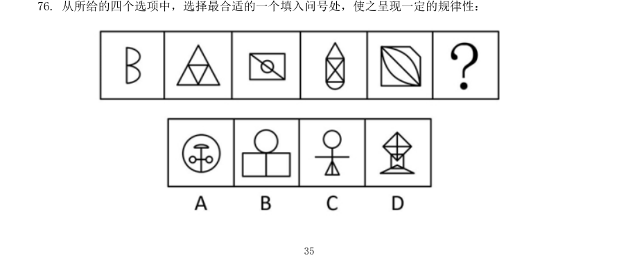

**77.** 从所给的四个选项中，选择最合适的一个填入问号处，使之呈现一定的规律性：  `[2020·副省·77]`

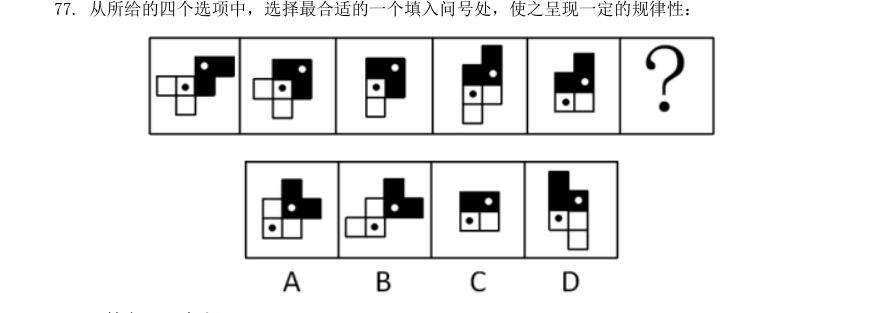

**78.** 从所给的四个选项中，选择最合适的一个填入问号处，使之呈现一定的规律性：  `[2020·副省·78]`

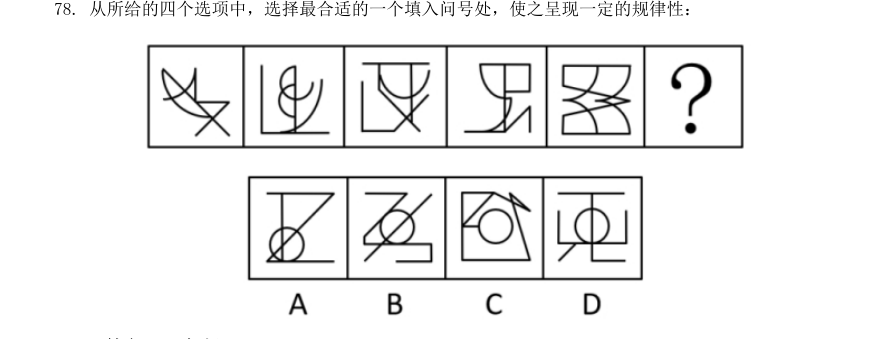

**79.** 从所给的四个选项中，选择最合适的一个填入问号处，使之呈现一定的规律性：  `[2020·副省·79]`

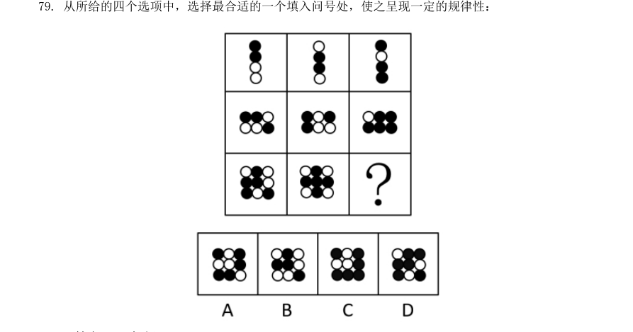

**80.** 下图为给定的多面体及其外表面展开图，问字母A、B、C、D 和数字1、2、3、4 代表的棱的对应关系为：  `[2020·副省·80]`
- A. 1—C，2—A，3—B，4—D
- B. 1—A，2—C，3—B，4—D
- C. 1—A，2—C，3—D，4—B
- D. 1—C，2—A，3—D，4—B

**81.** 左图给定的是由相同正方体堆叠而成多面体的正视图和后视图。该多面体可以由①、②和③三个多面体组合而成，问以下哪一项能填入问号处？  `[2020·副省·81]`

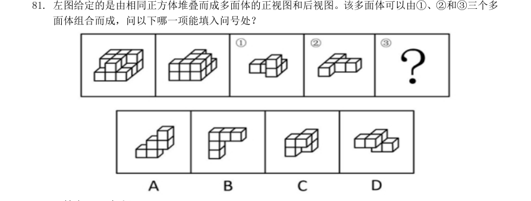

**82.** 左图为给定的立体图形，将其从任一面剖开，以下哪个不可能是该立体图形的截面？  `[2020·副省·82]`

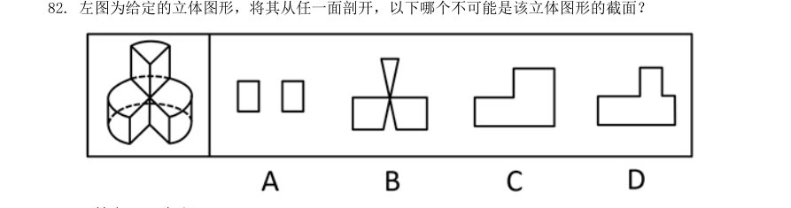

**83.** 把下面的六个图形分为两类，使每一类图形都有各自的共同特征或规律，分类正确的一项是：  `[2020·副省·83]`
- A. ①④⑥，②③⑤
- B. ①③⑤，②④⑥
- C. ①②⑥，③④⑤
- D. ①③④，②⑤⑥

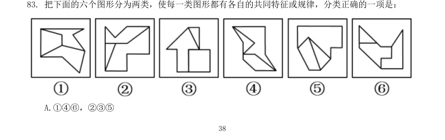

**84.** 把下面的六个图形分为两类，使每一类图形都有各自的共同特征或规律,分类正确的一项是：  `[2020·副省·84]`
- A. ①③④，②⑤⑥
- B. ①②⑥，③④⑤
- C. ①④⑤，②③⑥
- D. ①④⑥，②③⑤

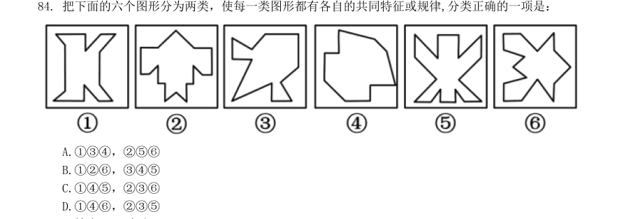

**85.** 把下面的六个图形分为两类，使每一类图形都有各自的共同特征或规律，分类正确的一项是：  `[2020·副省·85]`
- A. ①②③，④⑤⑥
- B. ①③④，②⑤⑥
- C. ①③⑤，②④⑥
- D. ①②⑤，③④⑥

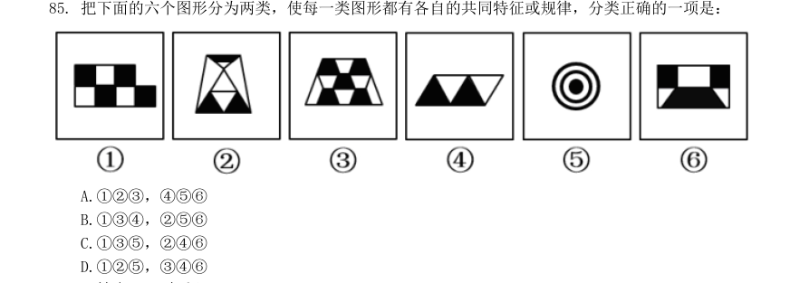

**86.** 超前纠结指的是在平庸的人群中，有正确洞见的人当其观点不被接受、不被相信，对事情的发展无能为力时，所表现出的无奈、压抑和痛苦的心情。根据上述定义，下列最能体现超前纠结的是：  `[2020·副省·86]`
- A. 古来圣贤皆寂寞，惟有饮者留其名
- B. 举世皆浊我独清，世人皆醉我独醒
- C. 无可奈何花落去，似曾相识燕归来
- D. 醉卧沙场君莫笑，古来征战几人回

**87.** 愧疚补偿策略指的是不直接提出要求，而强调由于对方的责任导致自己处于困境，使对方产生愧疚心理，从而使对方补偿自己的一种策略。根据上述定义，下列反映了愧疚补偿策略的是：  `[2020·副省·87]`
- A. 甲向李某倾诉由于误信了他群发的信息，导致自己被骗得很惨，李某于是免息借钱给甲做生意以求得心安
- B. 乙上班迟到被领导批评，回家后责怪妻子没有及时叫醒他，并要求妻子以后负责夜里带孩子，妻子答应了他
- C. 丙开车邀请陈某一起郊游，途中丙不慎扭伤了脚，只得请假休养，陈某感到非常内疚，决定帮助丙接送孩子上下学
- D. 丁在庄某家做保洁时不慎摔伤，庄某听家政公司说丁家庭非常困难，主动替丁支付了5000 元的治疗费用

**88.** 合理使用是指在法律明文规定的情形下，非商业性使用他人已经发表的作品，可以不经著作权人许可，也不必向其支付报酬。“法律明文规定的情形”主要包括：（1）为个人学习、研究或者欣赏，使用他人已经发表的作品；（2）免费表演已经发表的作品；（3）对设置或者陈列在室外公共场所的艺术作品进行临摹、绘画、摄影、录像；（4）将已经发表的以汉语言文字创作的作品翻译成少数民族语言文字作品出版发行。根据上述规定，下列属于合理使用的是：  `[2020·副省·88]`
- A. 甲在班级聚会上演唱了戊未发表的一首歌曲
- B. 乙将一部英文作品翻译成蒙文作品出版发行
- C. 丙公司拍摄公共广场的雕塑作品后，将其制作成图片发行
- D. 丁为撰写论文，复印了庚发表在某期刊上的论文作参考

**89.** 客观—价值谬误是一种错误的推理，其前提是一个事实性的描述，而结论所表述的则是一个涉及价值意义的描述，而且这种推理没有预设明显的价值判断前提。根据上述定义，下列属于客观—价值谬误的是：  `[2020·副省·89]`
- A. 人与人之间应该进行更多地交流和沟通，更多地理解和包容，世界上的民族国家将越来越少
- B. 既然人人都要遵纪守法，那我们就应该对法律多一份尊重，对规则多一份敬畏
- C. 世界变得越来越城市化，因此人们就不应该继续诗意地栖居在农村
- D. 这个地区的绿化率在不断提高，其空气质量也将不断改善

**90.** 社交裂变是一种利益驱动的商业模式，通过人与人之间的社交促进产品的传播与销售，本质上是通过利益驱动激励客户从而形成裂变。根据上述定义，下列不属于社交裂变的是：  `[2020·副省·90]`
- A. 某微商客户挑选好某个商品后，分享在自己的社交圈，好友帮助砍价后，客户可以低价购买，同时也宣传了该商品
- B. 某微信用户在购买到自己喜欢的商品后，经常拍照发在朋友圈中，慢慢地大家都知道她喜欢购买高档奢侈品
- C. 某电商平台的客户成功购买商品后，分享其链接，所有点击的人都能获得商家提供的随机金额的优惠券
- D. 某咖啡店的老顾客参加“邀请好友免费喝咖啡”的活动后，可以获取一张套餐券

**91.** 动物辅助治疗是一种以动物为媒介，通过人与动物的接触，改善或维持残障人士的身体状况，或帮助他们加强与外部世界的互动，进而促进康复、适应社会的过程。根据上述定义，下列情形不属于动物辅助治疗的是：  `[2020·副省·91]`
- A. 性情温和的迷你猪适合陪伴自闭症患者，减轻他们面对人群时产生的焦虑
- B. 卷尾猴能够帮助体障者完成日常生活中的简单动作，如开关门、操控遥控器等
- C. 鼬獾会在主人精神病发作之际，发出叫声，警示主人，让主人可以及时服药
- D. 英国短毛猫性格温顺且不具有攻击性，喜静且贴近主人，适合陪伴独自生活的老年人

**92.** 算术平均数描述了一组数据的平均趋势，是所有数据之和除以数据个数所得之商。在统计学中使用时应注意：出现极端数值、模糊不清的数据或者不同质的数据时，均不能计算算术平均数。根据上述定义，下列适于计算算术平均数的是：  `[2020·副省·92]`
- A. 某社区统计该社区居民的平均年龄，其中包括10 岁以下儿童204 人，90 岁以上老人26 人
- B. 某公司统计35 岁以下青年职工的年平均收入，发现基本处于10～12 万元之间，其中有一人为公司高管，年收入百万元以上
- C. 某学校统计本校青少年平均身高，将该校学前部、小学部和中学部全部学生计算在内
- D. 某市统计该市各区县留守儿童的平均数量，其中外出务工人员数量较多的区县无法进行准确统计，只提供了估算数据

**93.** 花序是指花在花轴上不同形式的序列。其中，伞房花序的特点是花序轴下部的花梗较长，上部的花梗依次渐短，整个花序的花几乎排列在一个平面上；伞形花序的特点是在总花梗顶端集生许多花梗近等长的小花，放射状排列如伞。根据上述定义，下列属于伞房花序的是：  `[2020·副省·93]`
> （本题选项为图片，请配合原始PDF查看）

**94.** 编剧式观影者是指看影视剧不介意被剧透，甚至会提前查询剧情介绍、翻遍各种影评的人。这种观影者追求掌控剧情发展的感觉，不喜欢出乎意料。根据上述定义，下列属于编剧式观影者的是：  `[2020·副省·94]`
- A. 小王看了一部好的影片后，觉得应该和女朋友一起分享，于是邀请女朋友到电影院观影，还向她介绍了电影的主要内容
- B. 小杜对任何事情都讲求理性思维，对于电影，他只有在了解了权威评价、剧情内容、画面特征等情况后，才有观赏的冲动
- C. 小李酷爱悬疑类影片，他喜欢陶醉在烧脑的剧情中，心情随着剧情而起伏，他经常假想自己就是一名侦探，对他人总是投出审视的目光
- D. 张大爷的老伴退休后整天在家看电视剧，对很多电视剧的剧情都了如指掌，还经常将剧情讲述给张大爷

**95.** 培养基是指供给微生物、植物或动物（或组织）生长繁殖的，由不同营养物质组合配制而成的营养基质，一般都含有碳水化合物、含氮物质、无机盐、维生素、水等物质。天然培养基是利用动物、植物或微生物包括其提取物制成的培养基；合成培养基是根据天然培养基的成分，用化学物质模拟合成、人工设计而配制的培养基；半组合培养基是以化学试剂配制为主，同时还加有少量天然成分的培养基。根据上述定义，下列属于半组合培养基的是：  `[2020·副省·95]`
- A. 为研究鸡胚细胞的生长，在一定比例的盐水氨基酸溶液中加入少量玉米汁制成的培养基
- B. 为促进乳酸菌生长，使用小麦的麦芽汁制成的培养基
- C. 为加速诱发绿萝生长，将有机成分、矿物元素、琼脂等按3︰1︰2 的比例制成的培养基
- D. 为观察产气荚膜梭菌的生成，在1000 毫升新鲜牛奶中加入10 毫升硫酸亚铁制成的培养基

**96.** 物体︰惯性  `[2020·副省·96]`
- A. 气体︰稳定性
- B. 观察︰客观性
- C. 贵金属︰磁性
- D. 液体︰流动性

**97.** 全身麻醉︰注射麻醉  `[2020·副省·97]`
- A. 网络存储︰单机存储
- B. 胸式呼吸︰腹式呼吸
- C. 物理消毒︰加热消毒
- D. 抽样调查︰问卷调查

**98.** 物必先腐︰而后虫生  `[2020·副省·98]`
- A. 古木无人径︰深山何处钟
- B. 水落鱼梁浅︰天寒梦泽深
- C. 少壮不努力︰老大徒伤悲
- D. 欲投人处宿︰隔水问樵夫

**99.** 轻车熟路︰人生地疏  `[2020·副省·99]`
- A. 廉洁奉公︰卑躬屈膝
- B. 任重道远︰无所事事
- C. 前仆后继︰贪生怕死
- D. 河清海晏︰国泰民安

**100.** 路由器︰连接︰网络  `[2020·副省·100]`
- A. 千斤顶︰修补︰轮胎
- B. 石英钟︰显示︰时间
- C. 万花筒︰观察︰花卉
- D. 烽火台︰侦察︰敌情

**101.** 建筑材料︰混凝土︰水泥  `[2020·副省·101]`
- A. 饮料︰汽水︰二氧化碳
- B. 医疗用具︰注射器︰药物
- C. 监控︰监视器︰画面
- D. 交通设施︰减速带︰警示牌

**102.** 本能行为︰学习行为︰乌贼喷墨  `[2020·副省·102]`
- A. 合法行为︰合理行为︰盗窃财物
- B. 物理变化︰化学变化︰树木折断
- C. 生产管理︰销售管理︰退货处理
- D. 社会现象︰自然现象︰四季变换

**103.** 税前收入︰税后收入︰税金  `[2020·副省·103]`
- A. 法律规定︰道德规范︰规则
- B. 测量高度︰真实高度︰误差
- C. 高原地区︰平原地区︰纬度
- D. 生产成本︰出厂价格︰销售价

**104.** 薄荷  对于（    ）相当于（    ）对于  计时器  `[2020·副省·104]`
- A. 川芎；水钟
- B. 清凉；精准
- C. 茯苓；倒计时
- D. 药用植物；沙漏

**105.** 玻璃瓶  对于（    ）相当于（    ）对于  秋播作物  `[2020·副省·105]`
- A. 石英砂；农作物
- B. 塑料瓶；水生植物
- C. 饮料瓶；春播作物
- D. 广口瓶；大棚作物

**106.** 斑头雁在飞行中有一个特点，就是它们经常以某种队形来飞，通常是后面的鸟飞在前一只鸟的侧后方，因此就有了常见的“人”字形队形。一些研究者认为这一队形可减小空气阻力、降低飞行能耗。然而反对者认为如果是为了减小阻力，鸟更应该选择直线的队形，因为一个紧跟一个飞行能最大程度地减小跟随者需要克服的空气阻力。以下哪项如果为真，最能质疑反对者的结论？  `[2020·副省·106]`
- A. 飞行过程中，领头雁会不时地与后方同伴换位，否则它们很容易精疲力尽
- B. 斑头雁飞行时偏移于前面的同伴，虽不能最大限度减小空气阻力，但能极大地减少上升时所需的体能消耗
- C. 斑头雁在飞行时会有确定方向的需求，所以并不会一直排成“人”字形飞行
- D. 速滑比赛中，运动员常以“人”字形前进，一名运动员在前，另外三名紧随其后，后三名队员因阻力变小而受益

**107.** 一切生命有机体都需要新陈代谢，否则生命就会停止。文明也是一样，如果长期自我封闭，必将走向衰落。交流互鉴是文明发展的本质要求。只有同其他文明交流互鉴、取长补短，才能保持旺盛生命活力。由此可以推出：  `[2020·副省·107]`
- A. 一种文明如果没有同其他文明交流互鉴，就不能保持旺盛生命活力
- B. 一种文明如果没有长期自我封闭，就不会走向衰落
- C. 一种文明如果同其他文明交流互鉴、取长补短，就能保持旺盛生命活力
- D. 一种文明如果没有保持旺盛生命活力，它就没有同其他文明取长补短

**108.** 小张这个夏天如果去新疆，就要游吐鲁番和喀纳斯，否则就不去；只有与小李同游，小张才会游吐鲁番或天池；如果与小李同游，小张一定要与小李做约定；如果小张与小李做约定，则小李这个夏天一定要有时间。遗憾的是，这个夏天小李单位来了一项紧急任务，相关人员一律不得请假，小李也不例外。由此可以推出：  `[2020·副省·108]`
- A. 小张这个夏天未去新疆
- B. 小张这个夏天去游喀纳斯
- C. 小张这个夏天去游天池
- D. 小张这个夏天去游吐鲁番

**109.** 一动物的蛋会通过土壤中微生物和堆肥分解有机物时产生的热量来孵化，但这些微生物（包含细菌）也会穿透蛋壳、感染胚胎，自然情况下这一比例高于20%。然而，在澳洲有一种名为丛冢雉的鸟类，其蛋发生感染的几率仅为9%，研究者发现其蛋壳中含有溶酶酵素，研究者据此认为这种物质很可能就是抵御细菌侵扰的关键因素。以下哪项如果为真，没有削弱上述结论？  `[2020·副省·109]`
- A. 丛冢雉的蛋壳中所含的溶酶酵素量，与其他动物相比，含量大抵相当
- B. 丛冢雉的蛋壳被一层纳米级的碳酸钙层包裹，拥有了更强的防水性和抗细菌入侵能力
- C. 丛冢雉散发一种特殊气味，会使附着在其蛋壳上的细菌数减少
- D. 与其他动物的蛋壳相比，丛冢雉的蛋壳要薄三分之一，更易受到微生物的入侵

**110.** 随着气温上升，热带雨林遭受闪电雷击并引发大火的几率也会上升。然而，目前的监测表明，美洲热带雨林虽然更频繁地受到闪电雷击，却没有引发更多的森林大火。研究者认为这可能与近年来雨林中藤蔓植物大量增加有关。以下哪项如果为真，最能支持上述结论？  `[2020·副省·110]`
- A. 闪电雷击常常引起温带森林大火，但热带雨林因为湿度较大，并不会产生较大火灾
- B. 1968 年热带雨林中藤蔓植物的覆盖率是32%，当前其覆盖率已经高达60%，有的地区甚至超过75%
- C. 藤蔓茎干相对树枝电阻更小，能像建筑上的避雷针那样传导闪电，让大部分电流从自己的茎干传导
- D. 雷击这样大规模、速度极快的放电，先摧毁了外部的藤蔓植物，中间的树木得到了保护

**111.** 甲、乙、丙、丁、戊五人乘坐高铁出差，他们正好坐在同一排的A、B、C、D、F 五个座位。已知：（1）若甲或者乙中的一人坐在C 座，则丙坐在B 座；（2）若戊坐在C 座，则丁坐在F 座。如果丁坐在B 座，那么可以确定的是：  `[2020·副省·111]`
- A. 甲坐在A 座
- B. 乙坐在D 座
- C. 丙坐在C 座
- D. 戊坐在F 座

**112.** 一项研究中，研究者观察了近300 名2～4 年级儿童在一个学年中的课堂参与度。参与度是根据上课过程中的专心行为和分心行为衡量的，前者指的是回答问题、举手发言或参与讨论等，后者指闲聊等行为。实验中，一半学生站立在高课桌前听课，另一半则坐着听课。结果发现：站立听课的学生比坐着的学生更加专注。以下哪项如果为真，最能支持上述结论？  `[2020·副省·112]`
- A. 站立需要大脑平衡身体、控制轻微肌肉收缩，这些适度的压力会使人的注意力更加集中
- B. 长时间坐着听课会增加身体对脊柱的压力，不利于学生的身体健康
- C. 即使是站立听课，也有个别学生会来回走动，影响课堂秩序，让他人分心
- D. 许多性格活泼的学生更喜欢站立听课，专注力更好，而内向的学生则愿意坐着听课，觉得更利于提高注意力

**113.** 澳大利亚箱形水母是世界上毒性最强的动物之一，蜇人后其毒素会使人皮肤坏死并伴随剧痛，还会侵入人的心脏，使人在短时间内因心脏停搏而死亡。一只箱形水母体内携带的毒液足以致60 人死亡，目前还没有针对其毒液的特效药物。近日，研究人员通过全基因组筛查的方法发现，人体细胞内一种名为ATP2B1 的蛋白质是箱形水母毒液发挥毒性的必要条件，研究人员据此认为，通过靶向治疗方法降低胆固醇可以对抗箱形水母的毒液。以下哪项可以作为上述论证的前提？  `[2020·副省·113]`
- A. 靶向治疗方法是一种安全可靠的方法
- B. ATP2B1 蛋白质发挥作用需要胆固醇
- C. 降低胆固醇后不会对人体产生副作用
- D. 已研制出降低胆固醇的靶向治疗药物

**114.** 近日，研究人员发现发烧可以促进淋巴细胞向感染部位转移。他们解释说，这是由于发烧会增加热休克蛋白90（Hsp90）在T 淋巴细胞中的表达，这种蛋白质与整合素结合，促进T 淋巴细胞黏附到血管上，最终加快迁移到感染的位置。以下除哪项外，均能支持上述结论？  `[2020·副省·114]`
- A. 整合素是一种细胞黏附分子，在发烧时可以控制T 淋巴细胞的转运
- B. 发烧能够诱导Hsp90 与整合素的尾部结合，并可激活整合素
- C. 不仅仅是发烧，其他压力也能诱导Hsp90 在T 淋巴细胞中的表达
- D. Hsp90 与整合素结合后，可激活促进T 淋巴细胞迁移的信号通路

**115.** 2014 年以来，某州已发生了超过230 次3 级及以上地震，而2008 年之前这一数字是年均1 次。频繁的地震活动引发了人们的疑问，一些研究者发现2014 年以来，全州为了避免石油开采中钻井和水力压裂过程中产生的有毒废水污染地表水，开始将这些废水注入地下岩石的不透水层之间，这一行为很可能就是引发地震的关键原因。以下哪项如果为真，最能支持上述推测？  `[2020·副省·115]`
- A. 废水灌入岩石水层中会降低断层之间的摩擦力，使之更易滑动，从而诱发地震
- B. 该州自2008 年以来勘探出更多的石油储备，石油开采活动大幅增加
- C. 该州2008 年之前的地震次数少但震级大，2014 年以来地震次数多但震级小
- D. 大多数连续地震是一次强震后发生的一系列余震，但该州地震并不属于这种情况

## 2020年 · 地市级

**71.** 从所给的四个选项中，选择最合适的一个填入问号处，使之呈现一定的规律性：  `[2020·地市·71]`

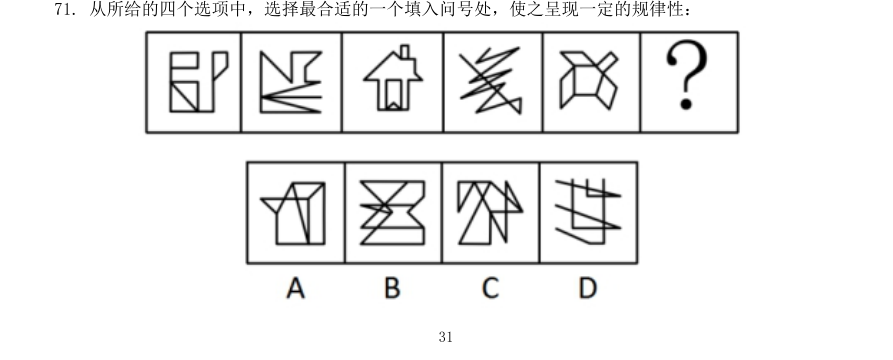

**72.** 从所给的四个选项中，选择最合适的一个填入问号处，使之呈现一定的规律性：  `[2020·地市·72]`

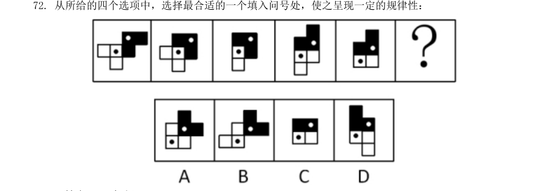

**73.** 从所给的四个选项中，选择最合适的一个填入问号处，使之呈现一定的规律性：  `[2020·地市·73]`

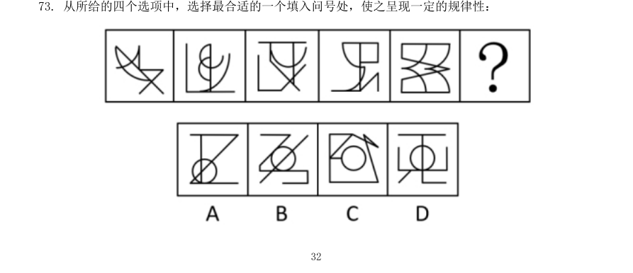

**74.** 下图为给定的多面体及其外表面展开图，问字母A、B、C、D 和数字1、2、3、4 代表的棱的对应关系为：  `[2020·地市·74]`
- A. 1—C，2—A，3—B，4—D
- B. 1—A，2—C，3—B，4—D
- C. 1—A，2—C，3—D，4—B
- D. 1—C，2—A，3—D，4—B

**75.** 从所给的四个选项中，选择最合适的一个填入问号处，使之呈现一定的规律性：  `[2020·地市·75]`

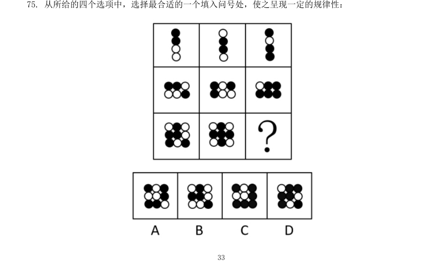

**76.** 左图给定的是由相同正方体堆叠而成多面体的正视图和后视图。该多面体可以由①、②和③三个多面体组合而成，问以下哪一项能填入问号处？  `[2020·地市·76]`

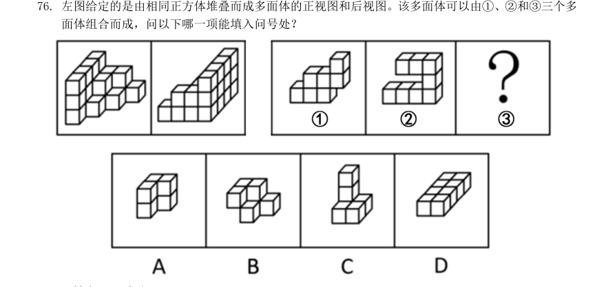

**77.** 左图是给定的多面体，将其从任一面剖开，下面哪一项不可能是该多面体的截面？  `[2020·地市·77]`

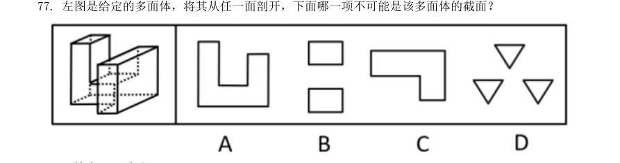

**78.** 把下面的六个图形分为两类，使每一类图形都有各自的共同特征或规律,分类正确的一项是：  `[2020·地市·78]`
- A. ①③④，②⑤⑥
- B. ①②⑥，③④⑤
- C. ①④⑤，②③⑥
- D. ①④⑥，②③⑤

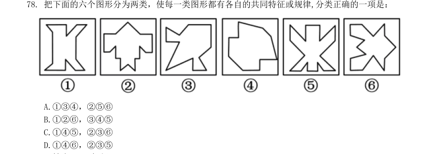

**79.** 把下面的六个图形分为两类，使每一类图形都有各自的共同特征或规律，分类正确的一项是：  `[2020·地市·79]`
- A. ①④⑥，②③⑤
- B. ①③⑤，②④⑥
- C. ①②⑥，③④⑤
- D. ①③④，②⑤⑥

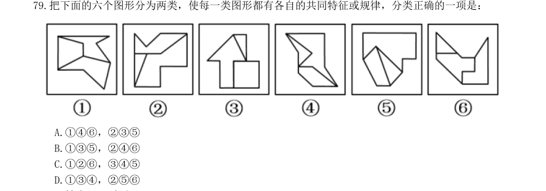

**80.** 把下面的六个图形分为两类，使每一类图形都有各自的共同特征或规律，分类正确的一项是：  `[2020·地市·80]`
- A. ①②③，④⑤⑥
- B. ①③④，②⑤⑥
- C. ①③⑤，②④⑥
- D. ①②⑤，③④⑥

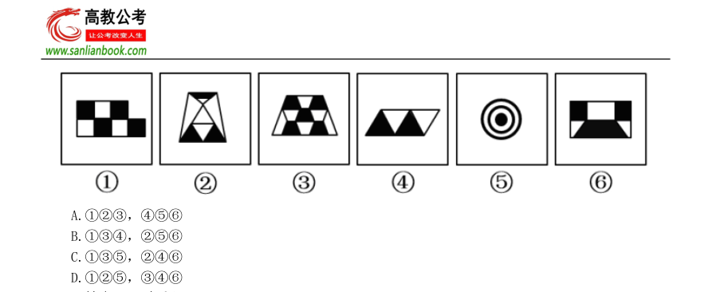

**81.** 超前纠结指的是在平庸的人群中，有正确洞见的人当其观点不被接受、不被相信，对事情的发展无能为力时，所表现出的无奈、压抑和痛苦的心情。根据上述定义，下列最能体现超前纠结的是：  `[2020·地市·81]`
- A. 古来圣贤皆寂寞，惟有饮者留其名
- B. 举世皆浊我独清，世人皆醉我独醒
- C. 无可奈何花落去，似曾相识燕归来
- D. 醉卧沙场君莫笑，古来征战几人回

**82.** 算术平均数描述了一组数据的平均趋势，是所有数据之和除以数据个数所得之商。在统计学中使用时应注意：出现极端数值、模糊不清的数据或者不同质的数据时，均不能计算算术平均数。根据上述定义，下列适于计算算术平均数的是：  `[2020·地市·82]`
- A. 某社区统计该社区居民的平均年龄，其中包括10 岁以下儿童204 人，90 岁以上老人26 人
- B. 某公司统计35 岁以下青年职工的年平均收入，发现基本处于10～12 万元之间，其中有一人为公司高管，年收入百万元以上
- C. 某学校统计本校青少年平均身高，将该校学前部、小学部和中学部全部学生计算在内
- D. 某市统计该市各区县留守儿童的平均数量，其中外出务工人员数量较多的区县无法进行准确统计，只提供了估算数据

**83.** 动物辅助治疗是一种以动物为媒介，通过人与动物的接触，改善或维持残障人士的身体状况，或帮助他们加强与外部世界的互动，进而促进康复、适应社会的过程。根据上述定义，下列情形不属于动物辅助治疗的是：  `[2020·地市·83]`
- A. 性情温和的迷你猪适合陪伴自闭症患者，减轻他们面对人群时产生的焦虑
- B. 卷尾猴能够帮助体障者完成日常生活中的简单动作，如开关门、操控遥控器等
- C. 鼬獾会在主人精神病发作之际，发出叫声，警示主人，让主人可以及时服药
- D. 英国短毛猫性格温顺且不具有攻击性，喜静且贴近主人，适合陪伴独自生活的老年人

**84.** 合理使用是指在法律明文规定的情形下，非商业性使用他人已经发表的作品，可以不经著作权人许可，也不必向其支付报酬。“法律明文规定的情形”主要包括：（1）为个人学习、研究或者欣赏，使用他人已经发表的作品；（2）免费表演已经发表的作品；（3）对设置或者陈列在室外公共场所的艺术作品进行临摹、绘画、摄影、录像；（4）将已经发表的以汉语言文字创作的作品翻译成少数民族语言文字作品出版发行。根据上述规定，下列属于合理使用的是：  `[2020·地市·84]`
- A. 甲在班级聚会上演唱了戊未发表的一首歌曲
- B. 乙将一部英文作品翻译成蒙文作品出版发行
- C. 丙公司拍摄公共广场的雕塑作品后，将其制作成图片发行
- D. 丁为撰写论文，复印了庚发表在某期刊上的论文作参考【答案】。解析：属于型。合理使用的定义要点是：（1）在法律明文规定的情形下，（2）非商业性使用他人已经发表的作品，（3）为个人学习、研究或者欣赏，使用他人已经发表的作品。（4）免费表演已经发表的作品，（5）对设置或者陈列在室外公共场所的艺术作品进行临摹、绘画、摄影、录像，（6）将已经发表的以汉语言文字创作的作品翻译成少数民族语言文字作品出版发行。A 项：甲唱了一首戊尚未发表的歌曲，不符合“他人已经发表的作品”，不符合定义，排除。B 项：乙将英文作品翻译成蒙文作品，英文作品不符合“将已经发表的以汉语言文字创作的作品翻译成少数民族语言文字作品出版发行”，不符合定义，排除。C 项：丙公司拍摄雕塑作品后制作成图片发行，属于商业性使用，不符合“非商业性使用他人已经发表的作品”，不符合定义，排除。D 项：丁为了撰写论文复印和参考了庚已经发表的论文，符合“为个人学习、研究或者欣赏，使用他人已经发表的作品”，符合定义，当选。所以，正确选项是D。

**85.** 花序是指花在花轴上不同形式的序列。其中，伞房花序的特点是花序轴下部的花梗较长，上部的花梗依次渐短，整个花序的花几乎排列在一个平面上；伞形花序的特点是在总花梗顶端集生许多花梗近等长的小花，放射状排列如伞。根据上述定义，下列属于伞房花序的是：  `[2020·地市·85]`
> （本题选项为图片，请配合原始PDF查看）

**86.** 编剧式观影者是指看影视剧不介意被剧透，甚至会提前查询剧情介绍、翻遍各种影评的人。这种观影者追求掌控剧情发展的感觉，不喜欢出乎意料。根据上述定义，下列属于编剧式观影者的是：  `[2020·地市·86]`
- A. 小王看了一部好的影片后，觉得应该和女朋友一起分享，于是邀请女朋友到电影院观影，还向她介绍了电影的主要内容
- B. 小杜对任何事情都讲求理性思维，对于电影，他只有在了解了权威评价、剧情内容、画面特征等情况后，才有观赏的冲动
- C. 小李酷爱悬疑类影片，他喜欢陶醉在烧脑的剧情中，心情随着剧情而起伏，他经常假想自己就是一名侦探，对他人总是投出审视的目光
- D. 张大爷的老伴退休后整天在家看电视剧，对很多电视剧的剧情都了如指掌，还经常将剧情讲述给张大爷

**87.** 愧疚补偿策略指的是不直接提出要求，而强调由于对方的责任导致自己处于困境，使对方产生愧疚心理，从而使对方补偿自己的一种策略。根据上述定义，下列反映了愧疚补偿策略的是：  `[2020·地市·87]`
- A. 甲向李某倾诉由于误信了他群发的信息，导致自己被骗得很惨，李某于是免息借钱给甲做生意以求得心安
- B. 乙上班迟到被领导批评，回家后责怪妻子没有及时叫醒他，并要求妻子以后负责夜里带孩子，妻子答应了他
- C. 丙开车邀请陈某一起郊游，途中丙不慎扭伤了脚，只得请假休养，陈某感到非常内疚，决定帮助丙接送孩子上下学
- D. 丁在庄某家做保洁时不慎摔伤，庄某听家政公司说丁家庭非常困难，主动替丁支付了5000 元的治疗费用【答案】。解析：属于型。愧疚补偿策略的定义要点是：（1）不直接提出要求，（2）强调由于对方的责任导致自己处于困境，（3）使对方产生愧疚心理，从而使对方补偿自己。A 项：甲向李某倾述由于李某的原因他被骗得很惨，符合“强调由于对方的责任导致自己处于困境”，李某于是免息借钱给甲做生意以求得心安，符合“使对方产生愧疚心理，从而使对方补偿自己”，符合定义，当选。B 项：乙要求妻子以后负责夜里带孩子，不符合“不直接提出要求”，不符合定义，排除。C 项：丙请假休养，但并没有和陈某说“与陈某一起郊游，途中不慎扭伤了脚”这件事情，不符合“强调由于对方的责任导致自己处于困境”，不符合定义，排除。D 项：庄某是听家政公司说丁家庭非常困难，并不是丁某自己告诉庄某在他家做保洁时不慎摔伤，不符合“强调由于对方的责任导致自己处于困境”，不符合定义，排除。所以，正确选项是A。

**88.** 客观—价值谬误是一种错误的推理，其前提是一个事实性的描述，而结论所表述的则是一个涉及价值意义的描述，而且这种推理没有预设明显的价值判断前提。根据上述定义，下列属于客观—价值谬误的是：  `[2020·地市·88]`
- A. 人与人之间应该进行更多地交流和沟通，更多地理解和包容，世界上的民族国家将越来越少
- B. 既然人人都要遵纪守法，那我们就应该对法律多一份尊重，对规则多一份敬畏
- C. 世界变得越来越城市化，因此人们就不应该继续诗意地栖居在农村
- D. 这个地区的绿化率在不断提高，其空气质量也将不断改善

**89.** 社交裂变是一种利益驱动的商业模式，通过人与人之间的社交促进产品的传播与销售，本质上是通过利益驱动激励客户从而形成裂变。根据上述定义，下列不属于社交裂变的是：  `[2020·地市·89]`
- A. 某微商客户挑选好某个商品后，分享在自己的社交圈，好友帮助砍价后，客户可以低价购买，同时也宣传了该商品
- B. 某微信用户在购买到自己喜欢的商品后，经常拍照发在朋友圈中，慢慢地大家都知道她喜欢购买高档奢侈品
- C. 某电商平台的客户成功购买商品后，分享其链接，所有点击的人都能获得商家提供的随机金额的优惠券
- D. 某咖啡店的老顾客参加“邀请好友免费喝咖啡”的活动后，可以获取一张套餐券

**90.** 培养基是指供给微生物、植物或动物（或组织）生长繁殖的，由不同营养物质组合配制而成的营养基质，一般都含有碳水化合物、含氮物质、无机盐、维生素、水等物质。天然培养基是利用动物、植物或微生物包括其提取物制成的培养基；合成培养基是根据天然培养基的成分，用化学物质模拟合成、人工设计而配制的培养基；半组合培养基是以化学试剂配制为主，同时还加有少量天然成分的培养基。根据上述定义，下列属于半组合培养基的是：  `[2020·地市·90]`
- A. 为研究鸡胚细胞的生长，在一定比例的盐水氨基酸溶液中加入少量玉米汁制成的培养基
- B. 为促进乳酸菌生长，使用小麦的麦芽汁制成的培养基
- C. 为加速诱发绿萝生长，将有机成分、矿物元素、琼脂等按3︰1︰2 的比例制成的培养基
- D. 为观察产气荚膜梭菌的生成，在1000 毫升新鲜牛奶中加入10 毫升硫酸亚铁制成的培养基

**91.** 物体︰惯性  `[2020·地市·91]`
- A. 气体︰稳定性
- B. 观察︰客观性
- C. 贵金属︰磁性
- D. 液体︰流动性

**92.** 全身麻醉︰注射麻醉  `[2020·地市·92]`
- A. 网络存储︰单机存储
- B. 胸式呼吸︰腹式呼吸
- C. 物理消毒︰加热消毒
- D. 抽样调查︰问卷调查

**93.** 物必先腐︰而后虫生  `[2020·地市·93]`
- A. 古木无人径︰深山何处钟
- B. 水落鱼梁浅︰天寒梦泽深
- C. 少壮不努力︰老大徒伤悲
- D. 欲投人处宿︰隔水问樵夫

**94.** 轻车熟路︰人生地疏  `[2020·地市·94]`
- A. 廉洁奉公︰卑躬屈膝
- B. 任重道远︰无所事事
- C. 前仆后继︰贪生怕死
- D. 河清海晏︰国泰民安

**95.** 路由器︰连接︰网络  `[2020·地市·95]`
- A. 千斤顶︰修补︰轮胎
- B. 石英钟︰显示︰时间
- C. 万花筒︰观察︰花卉
- D. 烽火台︰侦察︰敌情

**96.** 建筑材料︰混凝土︰水泥  `[2020·地市·96]`
- A. 饮料︰汽水︰二氧化碳
- B. 医疗用具︰注射器︰药物
- C. 监控︰监视器︰画面
- D. 交通设施︰减速带︰警示牌

**97.** 本能行为︰学习行为︰乌贼喷墨  `[2020·地市·97]`
- A. 合法行为︰合理行为︰盗窃财物
- B. 物理变化︰化学变化︰树木折断
- C. 生产管理︰销售管理︰退货处理
- D. 社会现象︰自然现象︰四季变换

**98.** 税前收入︰税后收入︰税金  `[2020·地市·98]`
- A. 法律规定︰道德规范︰规则
- B. 测量高度︰真实高度︰误差
- C. 高原地区︰平原地区︰纬度
- D. 生产成本︰出厂价格︰销售价

**99.** 薄荷  对于（    ）相当于（    ）对于  计时器  `[2020·地市·99]`
- A. 川芎；水钟
- B. 清凉；精准
- C. 茯苓；倒计时
- D. 药用植物；沙漏

**100.** 玻璃瓶  对于（    ）相当于（    ）对于  秋播作物  `[2020·地市·100]`
- A. 石英砂；农作物
- B. 塑料瓶；水生植物
- C. 饮料瓶；春播作物
- D. 广口瓶；大棚作物

**101.** 随着气温上升，热带雨林遭受闪电雷击并引发大火的几率也会上升。然而，目前的监测表明，美洲热带雨林虽然更频繁地受到闪电雷击，却没有引发更多的森林大火。研究者认为这可能与近年来雨林中藤蔓植物大量增加有关。以下哪项如果为真，最能支持上述结论？  `[2020·地市·101]`
- A. 闪电雷击常常引起温带森林大火，但热带雨林因为湿度较大，并不会产生较大火灾
- B. 1968 年热带雨林中藤蔓植物的覆盖率是32%，当前其覆盖率已经高达60%，有的地区甚至超过75%
- C. 藤蔓茎干相对树枝电阻更小，能像建筑上的避雷针那样传导闪电，让大部分电流从自己的茎干传导
- D. 雷击这样大规模、速度极快的放电，先摧毁了外部的藤蔓植物，中间的树木得到了保护

**102.** 一切生命有机体都需要新陈代谢，否则生命就会停止。文明也是一样，如果长期自我封闭，必将走向衰落。交流互鉴是文明发展的本质要求。只有同其他文明交流互鉴、取长补短，才能保持旺盛生命活力。由此可以推出：  `[2020·地市·102]`
- A. 一种文明如果没有同其他文明交流互鉴，就不能保持旺盛生命活力
- B. 一种文明如果没有长期自我封闭，就不会走向衰落
- C. 一种文明如果同其他文明交流互鉴、取长补短，就能保持旺盛生命活力
- D. 一种文明如果没有保持旺盛生命活力，它就没有同其他文明取长补短

**103.** 澳大利亚箱形水母是世界上毒性最强的动物之一，蜇人后其毒素会使人皮肤坏死并伴随剧痛，还会侵入人的心脏，使人在短时间内因心脏停搏而死亡。一只箱形水母体内携带的毒液足以致60 人死亡，目前还没有针对其毒液的特效药物。近日，研究人员通过全基因组筛查的方法发现，人体细胞内一种名为ATP2B1 的蛋白质是箱形水母毒液发挥毒性的必要条件，研究人员据此认为，通过靶向治疗方法降低胆固醇可以对抗箱形水母的毒液。以下哪项可以作为上述论证的前提？  `[2020·地市·103]`
- A. 靶向治疗方法是一种安全可靠的方法
- B. ATP2B1 蛋白质发挥作用需要胆固醇
- C. 降低胆固醇后不会对人体产生副作用
- D. 已研制出降低胆固醇的靶向治疗药物

**104.** 2014 年以来，某州已发生了超过230 次3 级及以上地震，而2008 年之前这一数字是年均1 次。频繁的地震活动引发了人们的疑问，一些研究者发现2014 年以来，全州为了避免石油开采中钻井和水力压裂过程中产生的有毒废水污染地表水，开始将这些废水注入地下岩石的不透水层之间，这一行为很可能就是引发地震的关键原因。以下哪项如果为真，最能支持上述推测？  `[2020·地市·104]`
- A. 废水灌入岩石水层中会降低断层之间的摩擦力，使之更易滑动，从而诱发地震
- B. 该州自2008 年以来勘探出更多的石油储备，石油开采活动大幅增加
- C. 该州2008 年之前的地震次数少但震级大，2014 年以来地震次数多但震级小
- D. 大多数连续地震是一次强震后发生的一系列余震，但该州地震并不属于这种情况

**105.** 一动物的蛋会通过土壤中微生物和堆肥分解有机物时产生的热量来孵化，但这些微生物（包含细菌）也会穿透蛋壳、感染胚胎，自然情况下这一比例高于20%。然而，在澳洲有一种名为丛冢雉的鸟类，其蛋发生感染的几率仅为9%，研究者发现其蛋壳中含有溶酶酵素，研究者据此认为这种物质很可能就是抵御细菌侵扰的关键因素。以下哪项如果为真，没有削弱上述结论？  `[2020·地市·105]`
- A. 丛冢雉的蛋壳中所含的溶酶酵素量，与其他动物相比，含量大抵相当
- B. 丛冢雉的蛋壳被一层纳米级的碳酸钙层包裹，拥有了更强的防水性和抗细菌入侵能力
- C. 丛冢雉散发一种特殊气味，会使附着在其蛋壳上的细菌数减少
- D. 与其他动物的蛋壳相比，丛冢雉的蛋壳要薄三分之一，更易受到微生物的入侵【答案】。解析：不削弱型：支持或无关。需要削弱的结论：溶酶酵素这种物质很可能就是抵御细菌侵扰的关键因素。论据：在澳洲有一种名为丛冢雉的鸟类，其蛋发生感染的几率仅为9%，研究者发现其蛋壳中含有溶酶酵素。A 项：指出丛冢雉的蛋壳中所含的溶酶酵素量与其他动物含量相当，意在说明溶酶酵素并不是丛冢雉感染率比其他动物低很多的原因，属于削弱项，排除；B 项：指出纳米级的碳酸钙拥有了更强的防水性和抗细菌入侵能力，意在说明碳酸钙可能是丛冢雉感染率比其他动物低很多的原因，提出了其他的原因可能是抵御细菌侵扰的关键因素，属于他因削弱，排除；C 项：指出丛雉蛋散发一种特殊气味会使附着在其蛋壳上的细菌数减少，意在说明气味可能是丛冢雉感染率比其他动物低很多的原因，提出了其他的原因可能是抵御细菌侵扰的关键因素，属于他因削弱，排除；D 项：指出丛雉的蛋壳很薄，更易受到微生物的入侵，讨论的是丛雉的蛋壳是否容易受到入侵，与题干议论的话题不一致，属于无关选项，不能削弱，当选。所以，正确选项是D。根据以下资料，回答106～110 题。某集团公司有生产、销售、研发、人事、财务、法务6 个部门，现有从前到后的6 栋办公楼：戊字楼、己字楼、庚字楼、辛字楼、壬字楼和癸字楼，每部门各一栋楼，并且各部门安排符合如下要求：（1）销售部在财务部和生产部之前；（2）人事部紧接在研发部或者生产部的后面；（3）紧接在法务部后面的是研发部或者销售部。

**106.** 下列各部门办公楼按照从前到后的顺序排列，哪项符合上述要求？  `[2020·地市·106]`
- A. 法务部、研发部、销售部、财务部、生产部、人事部
- B. 财务部、法务部、研发部、人事部、销售部、生产部
- C. 法务部、销售部、研发部、生产部、财务部、人事部
- D. 研发部、人事部、销售部、法务部、财务部、生产部

**107.** 如果研发部在戊字楼，那么下列哪项可能为真？  `[2020·地市·107]`
- A. 法务部在辛字楼
- B. 人事部在癸字楼
- C. 财务部在己字楼
- D. 生产部在庚字楼【答案】。解析：本题问“如果研发部在戊字楼，哪项可能为真？”可以代入验算。已知：（1）销售部在财务部和生产部之前；（2）人事部紧接在研发部或者生产部的后面；（3）紧接在法务部后面的是研发部或者销售部。根据题设“研发部在戊字楼”，结合条件（3）可知，紧挨在法务部后面的，只能是销售部。首先，代入验证A 项：法务部在辛字楼。列表如下：戊己庚辛壬癸研发部法务部销售部此时，销售部后面仅有一个空格，不可能满足条件（1）“销售部必须在财务部和生产部之前”，不可能为真，排除。其次，代入验证B 项：人事部在癸字楼。此时，根据条件（2），人事部不可能紧挨着研发部，只能紧挨着生产部之后，即：壬字楼为生产部。再结合条件（3），紧挨在法务部之后的只能是销售部。根据条件（2），销售部只能在财务部和生产部之前。列表如下：戊己庚辛壬癸研发部法务部销售部财务部生产部人事部满足所有题干条件，可能为真，当选。所以，正确选项是B。

**108.** 如果法务部在壬字楼，那么销售部在：  `[2020·地市·108]`
- A. 庚字楼
- B. 辛字楼
- C. 戊字楼
- D. 己字楼

**109.** 如果销售部安排在戊字楼，则以下哪项安排是不可能的？  `[2020·地市·109]`
- A. 财务部在癸字楼
- B. 研发部在己字楼
- C. 法务部在辛字楼
- D. 人事部在庚字楼

**110.** 下列哪两个部门不可能依次安排在庚字楼和辛字楼？  `[2020·地市·110]`
- A. 法务部、销售部
- B. 研发部、财务部
- C. 人事部、研发部
- D. 财务部、法务部

## 2021年 · 副省级

**76.** 从所给的四个选项中，选择最合适的一个填入问号处，使之呈现一定的规律性：  `[2021·副省·76]`

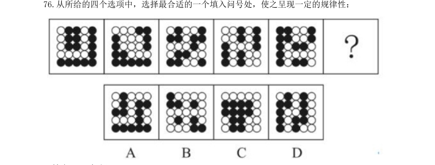

**77.** 从所给的四个选项中，选择最合适的一个填入问号处，使之呈现一定的规律性：  `[2021·副省·77]`

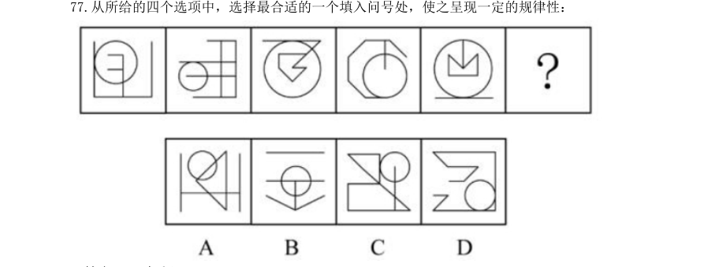

**78.** 从所给的四个选项中，选择最合适的一个填入问号处，使之呈现一定的规律性：  `[2021·副省·78]`

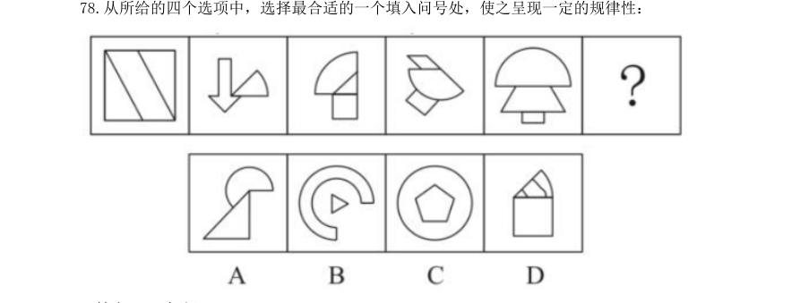

**79.** 从所给的四个选项中，选择最合适的一个填入问号处，使之呈现一定的规律性：  `[2021·副省·79]`

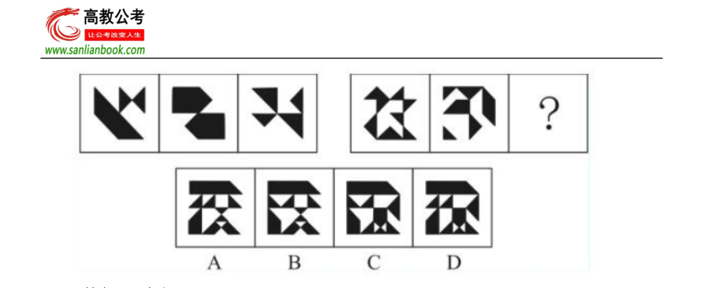

**80.** 左图给定的是正方体纸盒，下面哪项可能是其正确的外表面展开图？  `[2021·副省·80]`
> （本题选项为图片，请配合原始PDF查看）

**81.** 左图给定的是由18 个相同大小的正方体组合成的多面体，这个多面体可以切割为3 个完全相同的小多面体，问切成的小多面体是：  `[2021·副省·81]`
> （本题选项为图片，请配合原始PDF查看）

**82.** 左图为给定的多面体，从任一角度观看，下面哪项可能是该多面体的视图？  `[2021·副省·82]`
> （本题选项为图片，请配合原始PDF查看）

**83.** 把下面的六个图形分为两类，使每一类图形都有各自的共同特征或规律，分类正确的一项是：  `[2021·副省·83]`
- A. ①②③，④⑤⑥
- B. ①②④，③⑤⑥
- C. ①③④，②⑤⑥
- D. ①③⑤，②④⑥

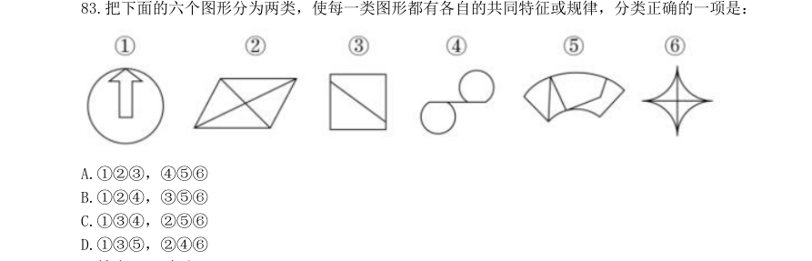

**84.** 把下面的六个图形分为两类，使每一类图形都有各自的共同特征或规律，分类正确的一项是：  `[2021·副省·84]`
- A. ①②④，③⑤⑥
- B. ①③⑤，②④⑥
- C. ①③⑥，②④⑤
- D. ①⑤⑥，②③④

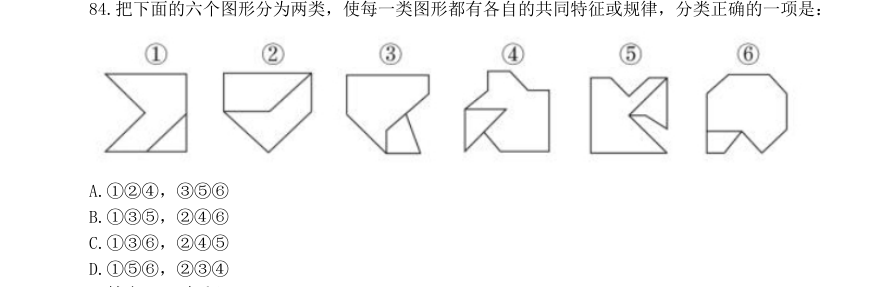

**85.** 把下面的六个图形分为两类，使每一类图形都有各自的共同特征或规律，分类正确的一项是：  `[2021·副省·85]`
- A. ①③④，②⑤⑥
- B. ①③⑤，②④⑥
- C. ①②⑥，③④⑤
- D. ①④⑥，②③⑤

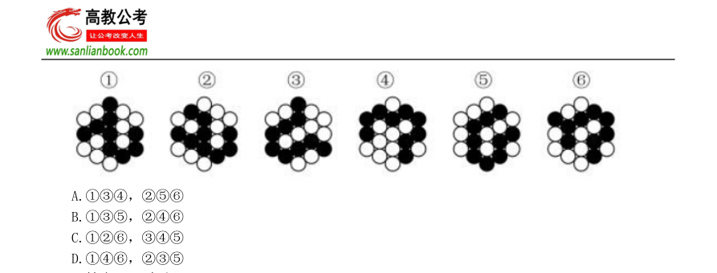

**86.** 串对是指在诗句或对联中，出句与对句在意义上和语法结构上不是相对，而是上下相承，两句不能互相脱离，更不能颠倒，在语言结构上有一定的前后顺序。根据上述定义，下列属于串对的是：  `[2021·副省·86]`
- A. 到此已穷千里目，谁知才上一层楼
- B. 书山有路勤为径，学海无涯苦作舟
- C. 横眉冷对千夫指，俯首甘为孺子牛
- D. 江间波浪兼天涌，塞上风云接地阴

**87.** 互益素是一种生物释放的、能引起他种接受生物产生对释放者和接受者都有益的反应的信息化学物质。根据上述定义，下列涉及互益素的是：  `[2021·副省·87]`
- A. 苹果实蝇在植物果实上产卵后会留下一种标记信息素，以避免自己再次到这里产卵
- B. 楝科植物印楝的种子、树叶和树皮中含有的印楝素，对几乎所有害虫都有驱杀效果
- C. 亚洲玉米螟雌蛾释放的性信息素能够吸引雄蛾，使雄蛾能够准确找到雌蛾的方位
- D. 小麦在遭受麦长管蚜攻击后会释放出水杨酸甲酯，可吸引麦长管蚜的天敌异色瓢虫

**88.** 国际多式联运是指按照多式联运合同，以至少两种不同的运输方式，由多式联运经营人将货物从一国境内接货地点运至另一国境内指定交货地点的一种运输方式。根据上述定义，下列属于国际多式联运的是：  `[2021·副省·88]`
- A. 将货运汽车直接开上火车车皮进行铁路运输，到达目的地再把货车从车皮上开下来
- B. 某公司为员工采购进口商品，通过厢式货车运送到公司楼下，员工再开车将商品带回家
- C. 电商从海外采购生鲜商品，由物流公司通过航空冷链进口到国内，然后由冷链车运至全国各地
- D. 船运公司将从外海打捞的海鲜运输到沿海地区，再由买家分销到各个生鲜市场

**89.** 统计数据分为定性数据与定量数据。定性数据包括分类数据和顺序数据。分类数据是指只能归于某一类别的非数字型数据，它是对事物进行分类的结果，用文字表述；顺序数据是指归于某一有序类别的非数字型数据。定量数据是指表现为具体数字观测值的数据。①按城市规模可将城市分为特大城市、大城市、中等城市和小城市；②婚姻状况：1—未婚，2—已婚，3—离异，4—丧偶；③A 地到B 地的距离为200 公里，到C 地为320 公里，到D 地为100 公里；④某医院建筑面积37.5 万平方米，开放床位3182 个，临床医生687 个。根据上述定义，关于以上4 组数据的说法正确的是：  `[2021·副省·89]`
- A. ②④都是分类数据
- B. ②③④都是定量数据
- C. ①②都是顺序数据
- D. 仅②是分类数据

**90.** 拮抗作用是一种常见的感觉变化现象，是指因一种呈味物质的存在，而使另一种呈味物质的呈味特性减弱的现象。根据上述定义，下列没有体现拮抗作用的是：  `[2021·副省·90]`
- A. 在橘子汁中添加少量柠檬酸会感觉甜味减弱，如再加砂糖，又会感到酸味减弱
- B. 糖精带有苦味，在糖精中添加少量的谷氨酸钠，苦味可明显缓和
- C. 同时服用氯化钠和奎宁后，再饮用清水会有微甜的感觉
- D. 在食用过酸涩的西非山榄后，再吃酸味食品，会尝不到酸味

**91.** 通过提供产品及服务使顾客产生愉悦等积极情感，从而使顾客觉得从产品及服务中获得了超过使用价值的新价值，以此为手段进行情感营销的过程，称为情感价值链。根据上述定义，下列没有凸显情感价值链的是：  `[2021·副省·91]`
- A. 小张从事美容工作多年，她总是专注而耐心地倾听客户说话，让客户在享受按摩的同时心情舒畅
- B. 智能音箱“小美”深受孩子们喜爱，因为它不仅能播放儿歌和故事，还能跟小朋友“对话、握手和点头”
- C. 电视上，一对年轻夫妻为“该谁扫地了”而犯愁，之后扫地机器人登场，并闪现广告语“有了它，更幸福”
- D. 洗碗机广告中，一位女士愁眉苦脸刷着油腻的碗盘，看着自己粗糙的双手，广告词是“你要做这样的女人吗？”

**92.** 预测干预是指人们受预测信息的影响而采取了某种行为，造成原本有多种可能性的结果真的朝着预测所指示的方向发展。根据上述定义，下列属于预测干预的是：  `[2021·副省·92]`
- A. 某次财经访谈栏目中一名专家预测H 股票将大涨，结果很多收看该节目的观众争相购买该股票，导致该股票涨停
- B. 某福利彩票代销点宣称他们卖出的彩票多次中奖，结果到该代销点购买彩票的人经常排起长队
- C. 某国首脑在新年致辞中对该国经济形势进行了展望，因而该国老百姓对未来经济好转充满了信心
- D. 甲国大选前，与其敌对的乙国媒体大肆渲染，认为M 党总统候选人将当选，结果甲国很多选民转而支持N 党总统候选人

**93.** 人们常常系统地高估自己对事件的控制程度或影响力，而低估机会、运气等不可控制因素在事件发展过程及其结果上所扮演的角色，这一现象被称为控制错觉。根据上述定义，下列没有体现控制错觉的是：  `[2021·副省·93]`
- A. 人们想用骰子掷出“双6”时会在心中默念，用力揉捏骰子，相信这样做就会如愿
- B. 一些股民往往借助几个简单的因素预测大盘指数，结果常常是谬以千里
- C. 某企业经理认为今年当地举办的运动会对企业发展非常有利，预测今年营业额会有所上涨
- D. 景区某摆渡车驾驶员常年走山路，认为自己路况熟、技术好，所以在山路上开得非常快

**94.** 对立互补命题指的是先后叙述的两个结构基本相同的句式中含有两对或者两对以上相互对立的概念，但是其阐发的意思是一致的或者是相互补充的。根据上述定义，下列不属于对立互补命题的是：  `[2021·副省·94]`
- A. 君子坦荡荡，小人长戚戚
- B. 先天下之忧而忧，后天下之乐而乐
- C. 仓廪实而知礼节，衣食足而知荣辱
- D. 穷在闹市无人问，富在深山有远亲

**95.** 一般来说，科学实验中主要涉及三种变量：自变量、因变量和控制变量。自变量是指在实验中由实验者操作的变量。因变量是指随着自变量的变化而变化的变量。控制变量是指实验中除自变量以外的影响实验变化和结果的潜在因素或条件。根据上述定义，下列说法正确的是：  `[2021·副省·95]`
- A. 研究小麦供给量受当地采购价格的影响，小麦供给量是控制变量，采购价格是因变量
- B. 研究不同税率对稀土出口量的影响，稀土出口量是自变量，税率是因变量
- C. 研究气候条件对棉花产量的影响，气候条件是因变量，害虫影响是控制变量
- D. 研究制糖厂营业额受糖产量的影响，糖的单价是控制变量，糖产量是自变量

**96.** 江河湖海∶水体  `[2021·副省·96]`
- A. 鳏寡孤独∶身份
- B. 油盐酱醋∶调味
- C. 山珍海味∶美食
- D. 绫罗绸缎∶面料

**97.** 船舶抛锚︰请求救援  `[2021·副省·97]`
- A. 安全着陆︰平稳飞行
- B. 行政复议︰获得赔偿
- C. 卖出高粱︰买入白酒
- D. 违规销售︰停业整顿

**98.** 春山暖日和风∶阑干楼阁帘栊  `[2021·副省·98]`
- A. 绿蚁新醅酒∶红泥小火炉
- B. 鸡声茅店月∶人迹板桥霜
- C. 江碧鸟逾白∶山青花欲燃
- D. 柴门闻犬吠∶风雪夜归人

**99.** 立体化战争︰数字化战争  `[2021·副省·99]`
- A. 民主型管理︰专制型管理
- B. 防风林︰观赏树木
- C. 有氧运动︰医疗瘦身
- D. 绩效奖励︰物质奖励

**100.** 风筝︰篾刀︰竹条  `[2021·副省·100]`
- A. 泥塑︰黏土︰颜料
- B. 绣品︰绣针︰绣线
- C. 糖人︰蔗糖︰竹签
- D. 漆器︰描金︰涂料

**101.** 檀香∶麝香∶香料  `[2021·副省·101]`
- A. 木材∶钢筋∶建材
- B. 日光∶月光∶光明
- C. 薯条∶粉条∶食物
- D. 鲸鱼∶鲍鱼∶海鱼

**102.** 中央预算∶年度预算∶地方预算  `[2021·副省·102]`
- A. 历史题材∶军事题材∶现实题材
- B. 户外广告∶文字广告∶电视广告
- C. 知识创新∶技术创新∶管理创新
- D. 人身权利∶生命权利∶财产权利

**103.** 健康监测︰体检︰疾病筛查  `[2021·副省·103]`
- A. 为国聚财︰税收︰调节分配
- B. 发掘遗迹︰考古︰考证年代
- C. 解决争议︰审判︰强制执行
- D. 太空飞行︰航天︰地质分析

**104.** （    ）对于  口罩，相当于  竹子  对于（    ）  `[2021·副省·104]`
- A. 耳挂；竹炭
- B. 无纺布；斗笠
- C. 卫生用品；竹叶
- D. 医用口罩；箭竹

**105.** 核安全  对于（    ），相当于（    ） 对于  虚拟货币  `[2021·副省·105]`
- A. 核技术；货币
- B. 核泄漏；交易货币
- C. 国家安全；比特币
- D. 网络安全；游戏币

**106.** 中国互联网络信息中心发布报告显示，截至2018 年12 月，我国短视频用户规模达6.48 亿，其中青少年用户占了很大比重，开展青少年防沉迷工作刻不容缓。相关主管部门组织短视频平台企业研发了青少年防沉迷系统，进入“青少年模式”后，每日使用时长将限定为累计40 分钟，打赏、充值、提现、直播等功能将不可用，每天22 时至次日6 时期间，禁止使用短视频App。以下哪项如果为真，最能质疑该模式的有效性？  `[2021·副省·106]`
- A. 用户使用“青少年模式”需提交身份证信息等，增加了泄露个人隐私的风险
- B. 不加选择地浏览视频内容，可能会对青少年价值观产生负面影响
- C. 该系统通过大数据分析来识别疑似青少年用户，可能会“误伤”成年人
- D. “青少年模式”目前尚无法识别网络使用者的真实身份

**107.** 有研究人员认为，胶原蛋白保持皮肤年轻的说法并不科学，他们认为，皮肤得以保持年轻应归功于皮表干细胞。哺乳动物的皮表细胞会持续更新，细胞来源于表皮干细胞。这些干细胞会通过一种特定分化的多元蛋白结构——半桥粒附着在基膜上。表皮干细胞会不断复制分化，产生新细胞，取代受损的老细胞，这一更新有利于维持皮肤的年轻，因此表皮干细胞的更新才是保持皮肤年轻的原因。以下哪项如果为真，最能削弱上述结论？  `[2021·副省·107]`
- A. 表皮干细胞的更新还需要其他化合物的促进
- B. 表皮干细胞的再生能力会随着年龄的增长而衰退
- C. 胶原带白对促进表皮干细胞的更新至关重要
- D. 胶原蛋白的表达在不同干细胞之间存在很大差异

**108.** 小赵和小刘是非常熟悉的好朋友，两家相距很近，疫情期间，小赵曾给本单位同处室的同事发了警示微信，小刘也给所在小区他认识的所有人发了警示微信，并进一步通过电话进行了确认提醒。小赵、小刘互通了电话，提醒近期不相互走动，小赵给小刘发过警示微信，小刘没有给小赵发过警示微信。根据以上陈述，以下哪项不可能？  `[2021·副省·108]`
- A. 小赵近期没有去过小刘家
- B. 小刘、小赵是同事
- C. 小刘、小赵不是一个处室的
- D. 小赵、小刘住一个小区

**109.** 羟苯甲酮是一种常见的紫外线吸收剂，多用于防晒护肤品中，全球3500 种品牌的防晒霜中均含有该物质，研究表明，即使是极低浓度的羟苯甲酮，也会给珊瑚带来致命的伤害，有专家指出，为了保护珊瑚，在海滨浴场应该禁止使用防晒霜。以下哪项如果为真，最能支持上述观点？  `[2021·副省·109]`
- A. 一些远离海岸的大洋中部分水域已检测到羟苯甲酮，但浓度较低
- B. 羟苯甲酮易引起皮肤过敏，长期使用会影响人体免疫力和生殖能力
- C. 羟苯甲酮会破坏、改变珊瑚的DNA，降低幼年珊瑚正常发育的几率
- D. 人们在很多场合都使用防晒霜，仅在海滨浴场限制使用效果有限

**110.** 某便利店新进了一批个性商品，如带酸味的啤酒，芥末味道的饼干等，这些个性商品摆放在单独设立的区域进行销售，三个月之后，店长发现：和之前没有引进个性商品时相比，店里的总销售额大幅提升，所以店长认为销售额增加的主要原因是引进了这些个性商品。以下哪项如果为真，最能支持店长的观点？  `[2021·副省·110]`
- A. 三个月以来，这些个性化商品的销量和销售额都很有限
- B. 来店消费的主要是年轻人，年轻人喜欢尝试新鲜事物
- C. 近三个月，该店对货品摆放进行了重新规划和调整，货品陈列更加有序醒目
- D. 除了增加个性商品，店里常规商品也增加了一些品牌和种类

**111.** 研究人员在2011 年至2017 年间采集了600 多名60 岁以上老年人的身高、血压和饮食习惯等多项数据，随后，又对研究对象进行了神经心理评估和认知障碍评定，在排除吸烟饮酒等风险因素后发现，那些每周吃两次、每次吃约150 克蘑菇的老年人，比每周吃蘑菇少于一次的老年人患轻度认知障碍的风险低20%。研究人员解释说，这是因为蘑菇中含有一种特殊化合物——麦角硫因，因此，食用蘑菇有助于降低老年人患轻度认知障碍的风险。以下哪项如果为真，最能支持上述结论？  `[2021·副省·111]`
- A. 研究发现，每周食用两次以上蘑菇的年轻人患心脏病的风险降低
- B. 轻度认知障碍老年患者血浆中麦角硫因的水平明显低于同龄健康人
- C. 上述研究中老年人主要食用的是金针菇、平菇等6 种常见蘑菇
- D. 人体实际上无法自行合成麦角硫因，只能从食物中获取

**112.** 地质学家在澳大利亚中部距地表3 公里的地下发现了两处直径超过200 公里的神秘自然景观，景观所含有的石英砂中有着一簇簇的细线，这些细线大部分是相互平行的直线，地质学家认为，这些景观很可能是巨大陨石撞击形成的陨石坑，而石英砂的结构就是造成断裂的证据。以下哪项是上述论证的必要前提？  `[2021·副省·112]`
- A. 只有经历高速的陨石撞击，地层中石英砂才会显示出含有平行直线的断裂结构
- B. 石英砂普遍存在于地球表面，由于坚硬、耐磨、化学性能稳定而很少发生变化
- C. 该景观的直径之大，并不同于其他的陨石坑，很可能不是一次形成的
- D. 该景观周围的岩石是3 亿年到4.2 亿年之前形成的，那么撞击也应发生在那一时期

**113.** 近年来，国家从药品生产、流通和销售各环节发力，频频出台降低药价的相关政策。但是，让不少患者感到疑惑的是，一方面是国家降低药价的政策不断出台，另一方面却是诸多常用药价格不断上涨。以下哪项如果为真，最能解释上述现象？  `[2021·副省·113]`
- A. 价格下降的药品占大多数，价格上涨的药品占少数，因此从整体上来说，药品价格仍然是下降了
- B. 常用进口药的需求增多，相关政策无法控制此类药品的价格上涨
- C. 国家虽然出台了降低药价的政策，但是其影响要经过一段时间才能显现出来
- D. 降低药价的政策可以有效控制药品市场中因制药原料涨价而导致的药价上涨

**114.** 单位安排甲、乙、丙、丁、戊、己、庚、辛8 人出差，他们恰好被安排在宾馆同一排左右相邻的8 个房间。已知:①甲和丙中间隔着3 人；②乙和已中间隔着2 人；③丁在庚的左边，他们中间隔着2 人；④辛和戊中间隔着1 人。根据以上信息，按照从左到右的顺序，下列哪项是不可能的？  `[2021·副省·114]`
- A. 丁在第一个房间
- B. 丁在第二个房间
- C. 丁在第三个房间
- D. 丁在第四个房间

**115.** 近日，有研究团队通过对44 个反刍动物物种的基因组测序研究，创建了一个反刍动物的系统进化树，从而解析大量反刍动物的演化史。结果揭示，在近10 万年前，反刍动物种群发生大幅衰减，而这些种群数的减少与人类向非洲之外迁徙的时间相符。有人据此认为，这佐证了早期人类活动造成了反刍动物种群的衰减。以下哪项如果为真，最能质疑上述结论？  `[2021·副省·115]`
- A. 反刍动物种群衰减后，植被愈加茂盛，为人类提供了更多食物
- B. 反刍动物通常有角，在遇到人类攻击时能发挥一定的防御作用
- C. 同一时期的马、驴等奇蹄目动物的种群也出现大幅衰减的现象
- D. 同一时期大型猫科动物繁盛，它们大规模捕杀反刍动物

## 2021年 · 地市级

**71.** 从所给的四个选项中，选择最合适的一个填入问号处，使之呈现一定的规律性：  `[2021·地市·71]`

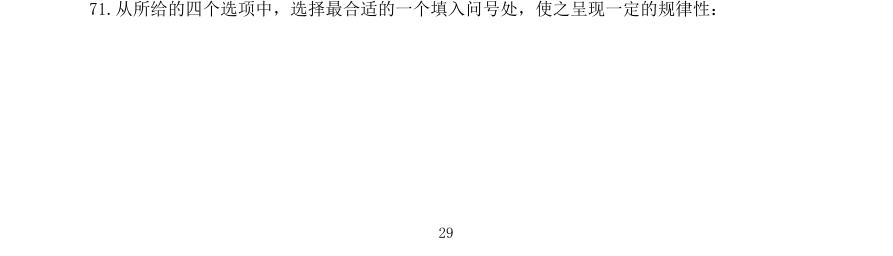

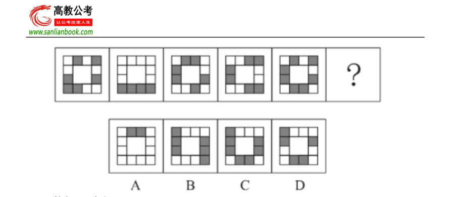

**72.** 从所给的四个选项中，选择最合适的一个填入问号处，使之呈现一定的规律性：  `[2021·地市·72]`

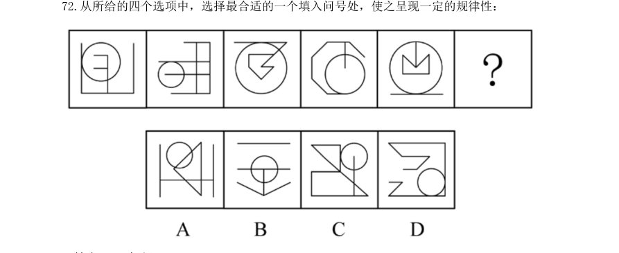

**73.** 从所给的四个选项中，选择最合适的一个填入问号处，使之呈现一定的规律性：  `[2021·地市·73]`

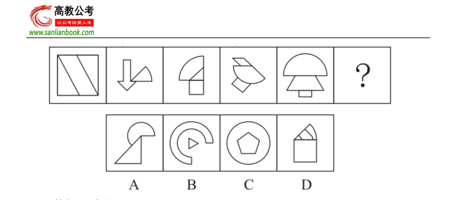

**74.** 从所给的四个选项中，选择最合适的一个填入问号处，使之呈现一定的规律性：  `[2021·地市·74]`

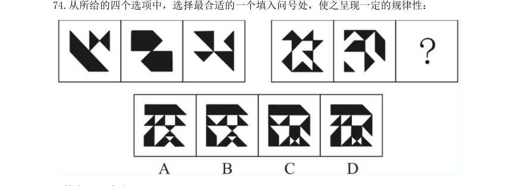

**75.** 左图给定的是正方体纸盒，下面哪项可能是其正确的外表面展开图？  `[2021·地市·75]`
> （本题选项为图片，请配合原始PDF查看）

**76.** 左图为给定的多面体，从任一角度观看，下面哪项可能是该多面体的视图？  `[2021·地市·76]`
> （本题选项为图片，请配合原始PDF查看）

**77.** 左图给定的是由相同正方体堆叠而成的多面体的正视图和后视图。该多面体可以由①、②和③三个多面体组合而成，问以下哪一项能填入问号处？  `[2021·地市·77]`

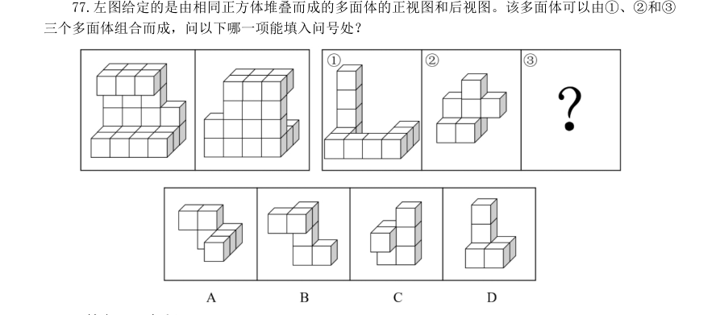

**78.** 把下面的六个图形分为两类，使每一类图形都有各自的共同特征或规律，分类正确的一项是：  `[2021·地市·78]`
- A. ①②③，④⑤⑥
- B. ①②④，③⑤⑥
- C. ①③④，②⑤⑥
- D. ①③⑤，②④⑥

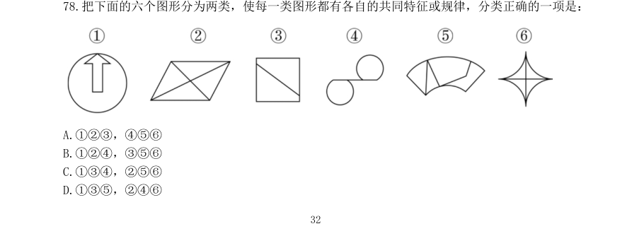

**79.** 把下面的六个图形分为两类，使每一类图形都有各自的共同特征或规律，分类正确的一项是：  `[2021·地市·79]`
- A. ①②④，③⑤⑥
- B. ①③⑤，②④⑥
- C. ①③⑥，②④⑤
- D. ①⑤⑥，②③④

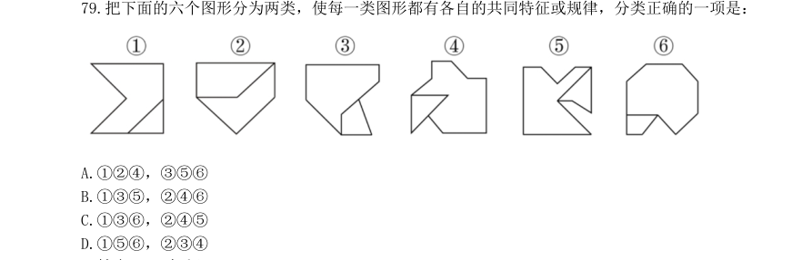

**80.** 把下面的六个图形分为两类，使每一类图形都有各自的共同特征或规律，分类正确的一项是：  `[2021·地市·80]`
- A. ①③④，②⑤⑥
- B. ①③⑤，②④⑥
- C. ①②⑥，③④⑤
- D. ①④⑥，②③⑤

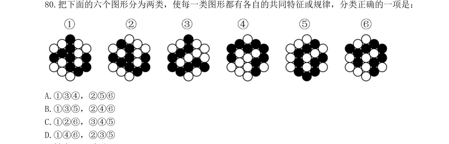

**81.** 析数是指在一定的语境中，利用数学上相加或相乘等关系，把一个数有目的地进行拆分的一种修辞手法。根据上述定义，下列没有使用析数的是：  `[2021·地市·81]`
- A. 故国三千里，深宫二十年。一声何满子，双泪落君前
- B. 娥眉蔽珠栊，玉钩隔琐窗。三五二八时，千里与君同
- C. 读尽文章一百担，老来方得一青衫。媒人却问余年纪，四十年前三十三
- D. 江陵去扬州，三千三百里。已行一千三，所有二千在

**82.** 互益素是一种生物释放的、能引起他种接受生物产生对释放者和接受者都有益的反应的信息化学物质。根据上述定义，下列涉及互益素的是：  `[2021·地市·82]`
- A. 苹果实蝇在植物果实上产卵后会留下一种标记信息素，以避免自己再次到这里产卵
- B. 楝科植物印楝的种子、树叶和树皮中含有的印楝素，对几乎所有害虫都有驱杀效果
- C. 亚洲玉米螟雌蛾释放的性信息素能够吸引雄蛾，使雄蛾能够准确找到雌蛾的方位
- D. 小麦在遭受麦长管蚜攻击后会释放出水杨酸甲酯，可吸引麦长管蚜的天敌异色瓢虫

**83.** 统计数据分为定性数据与定量数据。定性数据包括分类数据和顺序数据。分类数据是指只能归于某一类别的非数字型数据，它是对事物进行分类的结果，用文字表述；顺序数据是指归于某一有序类别的非数字型数据。定量数据是指表现为具体数字观测值的数据。①按城市规模可将城市分为特大城市、大城市、中等城市和小城市；②婚姻状况：1—未婚，2—已婚，3—离异，4—丧偶；③A 地到B 地的距离为200 公里，到C 地为320 公里，到D 地为100 公里；④某医院建筑面积37.5 万平方米，开放床位3182 个，临床医生687 个。根据上述定义，关于以上4 组数据的说法正确的是：  `[2021·地市·83]`
- A. ②④都是分类数据
- B. ②③④都是定量数据
- C. ①②都是顺序数据
- D. 仅②是分类数据

**84.** 拮抗作用是一种常见的感觉变化现象，是指因一种呈味物质的存在，而使另一种呈味物质的呈味特性减弱的现象。根据上述定义，下列没有体现拮抗作用的是：  `[2021·地市·84]`
- A. 在橘子汁中添加少量柠檬酸会感觉甜味减弱，如再加砂糖，又会感到酸味减弱
- B. 糖精带有苦味，在糖精中添加少量的谷氨酸钠，苦味可明显缓和
- C. 同时服用氯化钠和奎宁后，再饮用清水会有微甜的感觉
- D. 在食用过酸涩的西非山榄后，再吃酸味食品，会尝不到酸味

**85.** 通过提供产品及服务使顾客产生愉悦等积极情感，从而使顾客觉得从产品及服务中获得了超过使用价值的新价值，以此为手段进行情感营销的过程，称为情感价值链。根据上述定义，下列没有凸显情感价值链的是：  `[2021·地市·85]`
- A. 小张从事美容工作多年，她总是专注而耐心地倾听客户说话，让客户在享受按摩的同时心情舒畅
- B. 智能音箱“小美”深受孩子们喜爱，因为它不仅能播放儿歌和故事，还能跟小朋友“对话、握手和点头”
- C. 电视上，一对年轻夫妻为“该谁扫地了”而犯愁，之后扫地机器人登场，并闪现广告语“有了它，更幸福”
- D. 洗碗机广告中，一位女士愁眉苦脸刷着油腻的碗盘，看着自己粗糙的双手，广告词是“你要做这样的女人吗？”

**86.** 一般来说，科学实验中主要涉及三种变量：自变量、因变量和控制变量。自变量是指在实验中由实验者操作的变量。因变量是指随着自变量的变化而变化的变量。控制变量是指实验中除自变量以外的影响实验变化和结果的潜在因素或条件。根据上述定义，下列说法正确的是：  `[2021·地市·86]`
- A. 研究小麦供给量受当地采购价格的影响，小麦供给量是控制变量，采购价格是因变量
- B. 研究不同税率对稀土出口量的影响，稀土出口量是自变量，税率是因变量
- C. 研究气候条件对棉花产量的影响，气候条件是因变量，害虫影响是控制变量
- D. 研究制糖厂营业额受糖产量的影响，糖的单价是控制变量，糖产量是自变量

**87.** 对立互补命题指的是先后叙述的两个结构基本相同的句式中含有两对或者两对以上相互对立的概念，但是其阐发的意思是一致的或者是相互补充的。根据上述定义，下列不属于对立互补命题的是：  `[2021·地市·87]`
- A. 君子坦荡荡，小人长戚戚
- B. 先天下之忧而忧，后天下之乐而乐
- C. 仓廪实而知礼节，衣食足而知荣辱
- D. 穷在闹市无人问，富在深山有远亲

**88.** 预测干预是指人们受预测信息的影响而采取了某种行为，造成原本有多种可能性的结果真的朝着预测所指示的方向发展。根据上述定义，下列属于预测干预的是：  `[2021·地市·88]`
- A. 某次财经访谈栏目中一名专家预测H 股票将大涨，结果很多收看该节目的观众争相购买该股票，导致该股票涨停
- B. 某福利彩票代销点宣称他们卖出的彩票多次中奖，结果到该代销点购买彩票的人经常排起长队
- C. 某国首脑在新年致辞中对该国经济形势进行了展望，因而该国老百姓对未来经济好转充满了信心
- D. 甲国大选前，与其敌对的乙国媒体大肆渲染，认为M 党总统候选人将当选，结果甲国很多选民转而支持N 党总统候选人

**89.** 决策树是由决策点、方案枝、状态节点和概率枝构成的图解法。决策树是以决策点为出发点，引出若干方案枝，每条方案枝代表一个方案。每条方案枝的末端有一个状态节点，从状态节点引出若干概率枝，每条概率枝代表一种自然状态。概率枝上标明每种自然状态之上的概率收益值。这样层层展开，形如树状，故此得名。根据上述定义，下列图示正确展示了决策树的是：  `[2021·地市·89]`
> （本题选项为图片，请配合原始PDF查看）

**90.** 人们常常系统地高估自己对事件的控制程度或影响力，而低估机会、运气等不可控制因素在事件发展过程及其结果上所扮演的角色，这一现象被称为控制错觉。根据上述定义，下列没有体现控制错觉的是：  `[2021·地市·90]`
- A. 人们想用骰子掷出“双6”时会在心中默念，用力揉捏骰子，相信这样做就会如愿
- B. 一些股民往往借助几个简单的因素预测大盘指数，结果常常是谬以千里
- C. 某企业经理认为今年当地举办的运动会对企业发展非常有利，预测今年营业额会有所上涨
- D. 景区某摆渡车驾驶员常年走山路，认为自己路况熟、技术好，所以在山路上开得非常快

**91.** 易拉罐︰拉环  `[2021·地市·91]`
- A. 金库︰黄金
- B. 燃气灶︰点火器
- C. 台历︰农历
- D. 拦水坝︰河流

**92.** 船舶抛锚︰请求救援  `[2021·地市·92]`
- A. 安全着陆︰平稳飞行
- B. 行政复议︰获得赔偿
- C. 卖出高粱︰买入白酒
- D. 违规销售︰停业整顿

**93.** 春山暖日和风︰阑干楼阁帘栊  `[2021·地市·93]`
- A. 绿蚁新醅酒︰红泥小火炉
- B. 鸡声茅店月︰人迹板桥霜
- C. 江碧鸟逾白︰山青花欲燃
- D. 柴门闻犬吠︰风雪夜归人

**94.** 立体化战争︰数字化战争  `[2021·地市·94]`
- A. 民主型管理︰专制型管理
- B. 防风林︰观赏树木
- C. 有氧运动︰医疗瘦身
- D. 绩效奖励︰物质奖励

**95.** 风筝︰篾刀︰竹条  `[2021·地市·95]`
- A. 泥塑︰黏土︰颜料
- B. 绣品︰绣针︰绣线
- C. 糖人︰蔗糖︰竹签
- D. 漆器︰描金︰涂料

**96.** 檀香︰麝香︰香料  `[2021·地市·96]`
- A. 木材︰钢筋︰建材
- B. 日光︰月光︰光明
- C. 薯条︰粉条︰食物
- D. 鲸鱼︰鲍鱼︰海鱼

**97.** 中央预算︰年度预算︰地方预算  `[2021·地市·97]`
- A. 历史题材︰军事题材︰现实题材
- B. 户外广告︰文字广告︰电视广告
- C. 知识创新︰技术创新︰管理创新
- D. 人身权利︰生命权利︰财产权利

**98.** 健康监测︰体检︰疾病筛查  `[2021·地市·98]`
- A. 为国聚财︰税收︰调节分配
- B. 发掘遗迹︰考古︰考证年代
- C. 解决争议︰审判︰强制执行
- D. 太空飞行︰航天︰地质分析

**99.** 杠杆  对于（     ），相当于（     ）对于  成语  `[2021·地市·99]`
- A. 滑轮；固定短语
- B. 力臂；水滴石穿
- C. 省力杠杆；春夏秋冬
- D. 简单机械；四字成语

**100.** （    ）对于  口罩，相当于  竹子  对于（    ）  `[2021·地市·100]`
- A. 耳挂；竹炭
- B. 无纺布；斗笠
- C. 卫生用品；竹叶
- D. 医用口罩；箭竹

**101.** 有研究人员认为，胶原蛋白保持皮肤年轻的说法并不科学，他们认为，皮肤得以保持年轻应归功于皮表干细胞。哺乳动物的皮表细胞会持续更新，细胞来源于表皮干细胞。这些干细胞会通过一种特定分化的多元蛋白结构——半桥粒附着在基膜上。表皮干细胞会不断复制分化，产生新细胞，取代受损的老细胞，这一更新有利于维持皮肤的年轻，因此表皮干细胞的更新才是保持皮肤年轻的原因。以下哪项如果为真，最能削弱上述结论？  `[2021·地市·101]`
- A. 表皮干细胞的更新还需要其他化合物的促进
- B. 表皮干细胞的再生能力会随着年龄的增长而衰退
- C. 胶原带白对促进表皮干细胞的更新至关重要
- D. 胶原蛋白的表达在不同干细胞之间存在很大差异

**102.** 羟苯甲酮是一种常见的紫外线吸收剂，多用于防晒护肤品中，全球3500 种品牌的防晒霜中均含有该物质，研究表明，即使是极低浓度的羟苯甲酮，也会给珊瑚带来致命的伤害，有专家指出，为了保护珊瑚，在海滨浴场应该禁止使用防晒霜。以下哪项如果为真，最能支持上述观点？  `[2021·地市·102]`
- A. 一些远离海岸的大洋中部分水域已检测到羟苯甲酮，但浓度较低
- B. 羟苯甲酮易引起皮肤过敏，长期使用会影响人体免疫力和生殖能力
- C. 羟苯甲酮会破坏、改变珊瑚的DNA，降低幼年珊瑚正常发育的几率
- D. 人们在很多场合都使用防晒霜，仅在海滨浴场限制使用效果有限

**103.** 地质学家在澳大利亚中部距地表3 公里的地下发现了两处直径超过200 公里的神秘自然景观，景观所含有的石英砂中有着一簇簇的细线，这些细线大部分是相互平行的直线，地质学家认为，这些景观很可能是巨大陨石撞击形成的陨石坑，而石英砂的结构就是造成断裂的证据。以下哪项是上述论证的必要前提？  `[2021·地市·103]`
- A. 只有经历高速的陨石撞击，地层中石英砂才会显示出含有平行直线的断裂结构
- B. 石英砂普遍存在于地球表面，由于坚硬、耐磨、化学性能稳定而很少发生变化
- C. 该景观的直径之大，并不同于其他的陨石坑，很可能不是一次形成的
- D. 该景观周围的岩石是3 亿年到4.2 亿年之前形成的，那么撞击也应发生在那一时期

**104.** 近年来，国家从药品生产、流通和销售各环节发力，频频出台降低药价的相关政策。但是，让不少患者感到疑惑的是，一方面是国家降低药价的政策不断出台，另一方面却是诸多常用药价格不断上涨。以下哪项如果为真，最能解释上述现象？  `[2021·地市·104]`
- A. 价格下降的药品占大多数，价格上涨的药品占少数，因此从整体上来说，药品价格仍然是下降了
- B. 常用进口药的需求增多，相关政策无法控制此类药品的价格上涨
- C. 国家虽然出台了降低药价的政策，但是其影响要经过一段时间才能显现出来
- D. 降低药价的政策可以有效控制药品市场中因制药原料涨价而导致的药价上涨

**105.** 近日，有研究团队通过对44 个反刍动物物种的基因组测序研究，创建了一个反刍动物的系统进化树，从而解析大量反刍动物的演化史。结果揭示，在近10 万年前，反刍动物种群发生大幅衰减，而这些种群数的减少与人类向非洲之外迁徙的时间相符。有人据此认为，这佐证了早期人类活动造成了反刍动物种群的衰减。以下哪项如果为真，最能质疑上述结论？  `[2021·地市·105]`
- A. 反刍动物种群衰减后，植被愈加茂盛，为人类提供了更多食物
- B. 反刍动物通常有角，在遇到人类攻击时能发挥一定的防御作用
- C. 同一时期的马、驴等奇蹄目动物的种群也出现大幅衰减的现象
- D. 同一时期大型猫科动物繁盛，它们大规模捕杀反刍动物

**106.** 关于分管情况，下列哪项是可能的？  `[2021·地市·106]`
- A. 王：工会、科研卫：人事、教育、财务丁：宣传、后勤
- B. 王：人事、工会卫：宣传、后勤丁：科研、教育、财务
- C. 王：教育、财务卫：人事、后勤丁：科研、宣传、工会
- D. 王：宣传、后勤卫：人事、工会丁：科研、教育、财务

**107.** 如果王分管的部门多于丁，下列哪项可能为真？  `[2021·地市·107]`
- A. 人事由卫分管
- B. 科研由卫分管
- C. 教育由丁分管
- D. 后勤由丁分管

**108.** 下列哪项是不可能的？  `[2021·地市·108]`
- A. 人事和宣传由王分管
- B. 人事和宣传由丁分管
- C. 科研和宣传由丁分管
- D. 教育和宣传由王分管

**109.** 财务和以下哪个部门不可能由一人分管？  `[2021·地市·109]`
- A. 人事
- B. 科研
- C. 宣传
- D. 工会

**110.** 如果科研和宣传由一个人分管，那么下列哪项是可能的？  `[2021·地市·110]`
- A. 人事由卫分管
- B. 科研由王分管
- C. 教育由丁分管
- D. 宣传由卫分管

## 2022年 · 副省级

**76.** 从所给的四个选项中，选择最合适的一个填入问号处，使之呈现一定的规律性：  `[2022·副省·76]`

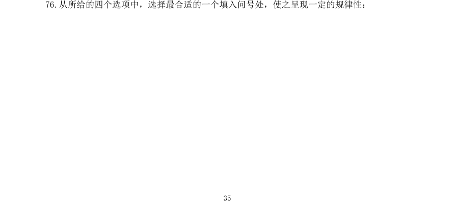

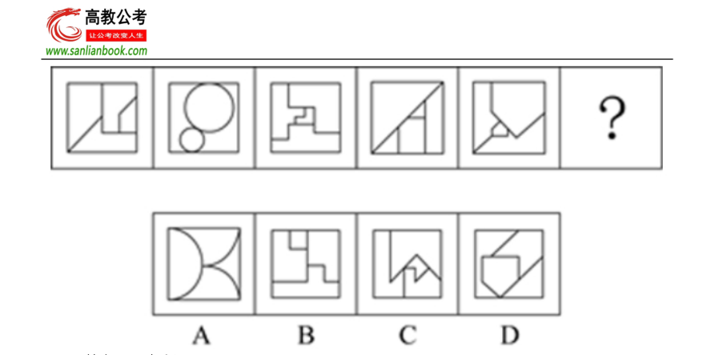

**77.** 从所给的四个选项中，选择最合适的一个填入问号处，使之呈现一定的规律性：  `[2022·副省·77]`

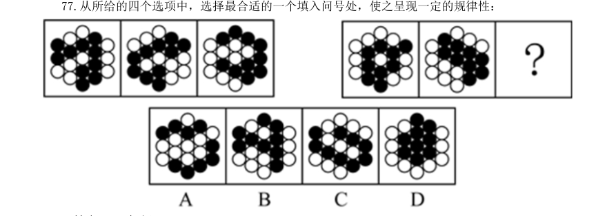

**78.** 从所给的四个选项中，选择最合适的一个填入问号处，使之呈现一定的规律性：  `[2022·副省·78]`

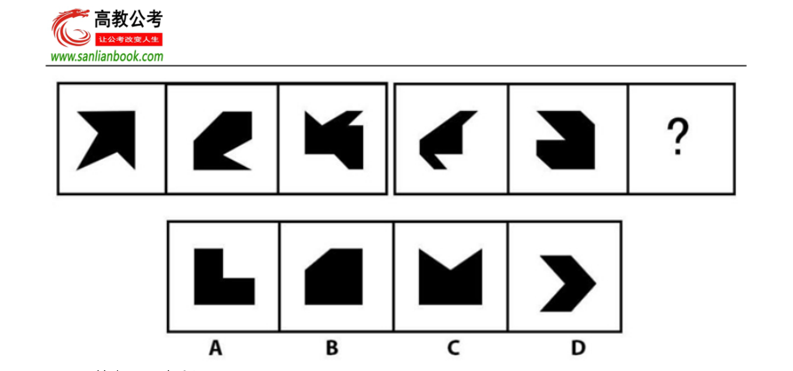

**79.** 从所给的四个选项中，选择最合适的一个填入问号处，使之呈现一定的规律性：  `[2022·副省·79]`

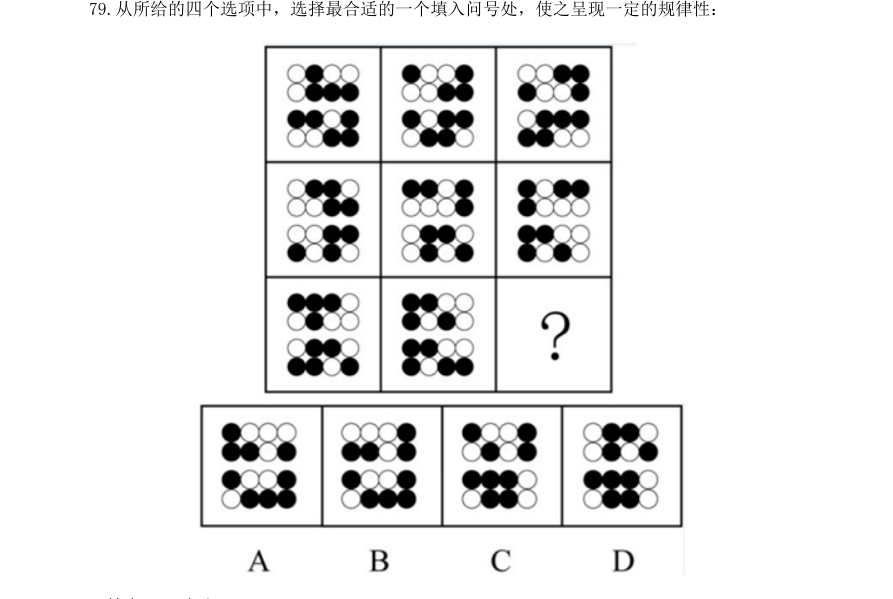

**80.** 左图是给定纸盒的外表面，下面哪项能由它折叠而成？  `[2022·副省·80]`

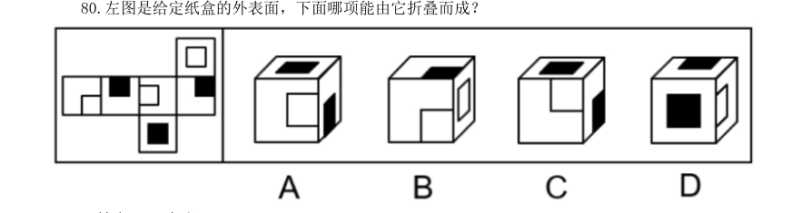

**81.** 左图是给定的空心立体图形，将其从任一面剖开，以下哪项可能是该立体图形的截面：  `[2022·副省·81]`

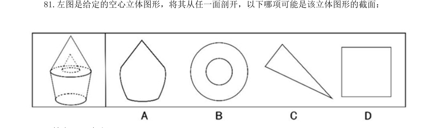

**82.** 左图给定的是由相同正方体堆叠而成的多面体，该多面体可以由①、②和③三个多面体组合而成，以下哪项能填入问号处?  `[2022·副省·82]`

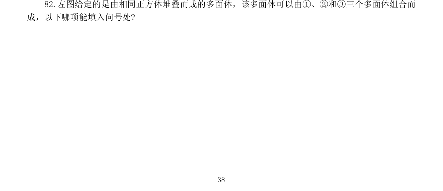

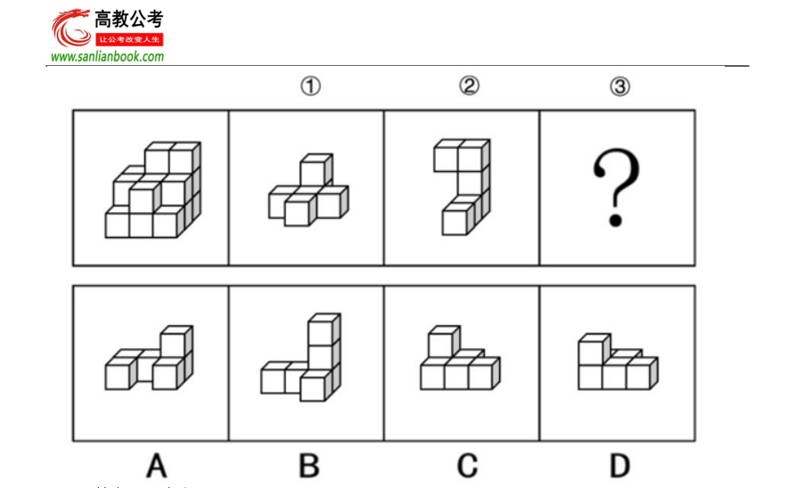

**83.** 把下面的六个图形分为两类，使每一类图形都有各自的共同特征或规律，分类正确的一项是：  `[2022·副省·83]`
- A. ①③⑥，②④⑤
- B. ①②④，③⑤⑥
- C. ①②③，④⑤⑥
- D. ①④⑤，②③⑥

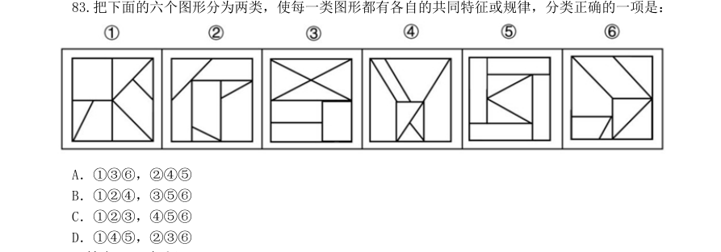

**84.** 把下面的六个图形分为两类，使每一类图形都有各自的共同特征或规律，分类正确的一项是：  `[2022·副省·84]`
- A. ①②⑤；③④⑥
- B. ①③④；②⑤⑥
- C. ①⑤⑥；②③④
- D. ①②④；③⑤⑥

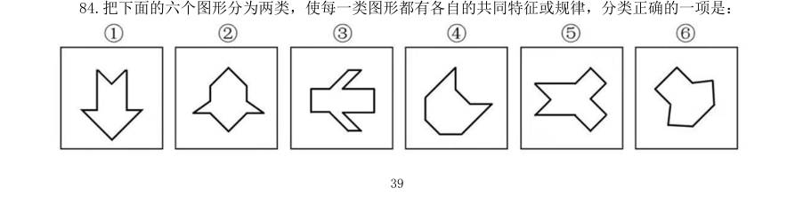

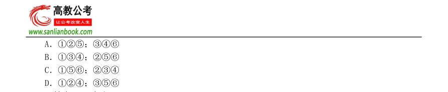

**85.** 把下面的六个图形分为两类，使每一类图形都有各自的共同特征或规律，分类正确的一项是：  `[2022·副省·85]`
- A. ①②⑤，③④⑥
- B. ①②③，④⑤⑥
- C. ①③⑥，②④⑤
- D. ①④⑤，②③⑥

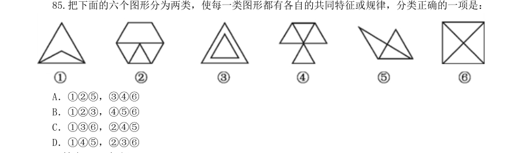

**86.** 归因不变性原则是指人们会寻找某一特定结果与特定原因之间的不变联系。如果某种特定原因在许多情境下总是与某种结果相伴，人们就会把特定结果归结于那一原因。归因折扣原则是指人们不完全相信某一现象的形成，确是由于某种原因导致，即某一特定原因在产生特定结果中的作用，如果存在其他似是而非的原因应该“打折扣”。两类归因原则均没有体现的是：  `[2022·副省·86]`
- A. 电视广告中明星推销洗发水时，观众觉得她的一头秀发不完全是因为洗发水才有的
- B. 在代理了诸多离婚案件后，律师小林统计发现，离婚诉讼中大多数争议与财产纠纷有关
- C. 创业失败总会使创业者背负债务，创业者小罗这几年债台高筑，朋友认为他一定是创业失败了
- D. 对一系列盗窃案的分析显示，现场都出现过同一个男人，人们容易假定该男人就是犯罪嫌疑人

**87.** 按调查范围来看，可将调查分为全面调查和非全面调查。全面调查指的是一定范围内的情况普查；非全面调查是指从整体中抽取一部分对象进行情况调查，又可分为：根据随机原则选择样本的抽样调查和有意识选取若干样本进行的典型调查。根据上述定义，下列说法正确的是：  `[2022·副省·87]`
- A. 对某市幼儿园的所有儿童进行口腔卫生检查，这属于非全面调查
- B. 对全国招生规模较大的前30 所医学院进行学生就业情况调查，这属于典型调查
- C. 对省内1～3 年级的全体学生进行体育活动时间的调查，这属于非全面调查
- D. 对某市中考教学成绩最好的几所学校进行调查，总结相关经验，这属于抽样调查

**88.** 对于特定论域中的任意两个对象a、b 而言，当对象a 与对象b 之间具有关系R 时，对象b 与对象a 之间是否也具有关系R。基于此，对称性关系命题可分为正对称关系、反对称关系和半对称关系。（1）正对称关系：若对象a 与b 之间具有关系R，则对象b 与a 之间也具有关系R；（2）反对称关系：若对象a 与b 之间具有关系R，则对象b 与a 之间一定不具有关系R；（3）半对称关系：若对象a 与b之间具有关系R，则对象b 与a 之间不一定具有关系R。根据上述定义，下列关系属于半对称关系的是：  `[2022·副省·88]`
- A. 人与人之间的帮助关系
- B. 学生之间的同学关系
- C. 两个分数之间的小于关系
- D. 城市与城市之间的相邻关系

**89.** 司法物理鉴定是运用物理学原理和方法，即通过检验确定物质的颜色、硬度、结构、比重、熔点、沸点、浓度、导电导热系数等物理属性，或显现肉眼看不见的痕迹特征，对与案件有关的痕迹、物品进行鉴认、识别的一种技术手段。根据上述定义，下列仅使用了司法物理鉴定手段的是：  `[2022·副省·89]`
- A. 选用试剂对被害人胃内容物进行分离、提纯，明确其中毒类型
- B. 通过技术手段复原受害人被删除的手机信息，排查案件嫌疑人
- C. 使用天平称量案件中伪造文件的重量，并采用试剂染色法检验纸浆的种类
- D. 利用不同波长光对受害者衣物进行照射，通过观察颜色、透射率来辨别色料种类

**90.** 由于人类建设活动的破坏和干扰，生物群体原来连续成片的生活环境被割裂，形成分散的岛状甚至碎片状的生境。生境廊道是指连接破碎化生境并适宜生物生活移动或扩散的通道，便于实现物种基因能量物质的流动。根据上述定义，下列不属于生境廊道的是：  `[2022·副省·90]`
- A. 国家公园两颗参天大树跨过公路上方枝叶相连，金丝猴借助古树跨越公路，不同区域的金丝猴群可以保持接触
- B. 为了野生象群在两个自然保护区之间迁移，管理者设计建成了迁移通道，避开村寨，并保证该区域范围内有丰富的水和食物资源
- C. 为避免青藏铁路隔断藏羚羊迁徙路线，动物学家设计了桥梁下方隧道上方及路基缓坡三种形式的野生动物通道
- D. 某地将过去严重污染的河道改造为河滨公园，架设了多座拱桥，美化了环境，方便了交通，还吸引了大量鸟类在此栖息

**91.** 领主属宾句是汉语中的一种句式，句子主干由主语、动词和宾语三个部分组成。这种句子的主语和宾语之间具有比较稳定的“领有——隶属”关系：主语是“领有”的一方，宾语是“隶属”的一方；句子的动词和主语没有直接的语义关系。根据上述定义，下列属于领主属宾句的是：  `[2022·副省·91]`
- A. 他的脸上长了一点肉
- B. 从远处走来一个挑夫
- C. 去年他烂了一车苹果
- D. 他头顶上飞过一只鸟

**92.** 基因污染指原生物种基因库非预期或不受控制的基因流动，即外源基因通过转基因作物、外来入侵物种、家养动物等扩散到其他栽培作物或自然野生物种并成为后者基因的一部分。根据上述定义，下列没有体现出基因污染的是：  `[2022·副省·92]`
- A. 某农场生产的大豆发现了转基因成分Bt 基因，这些成分是附近地区种植的基因工程Bt 大豆通过交叉授粉传播过来的
- B. 黑足猫是一种体型娇小但捕猎能力超强的野生猫，跑到野外的家猫和黑足猫交配后，生出血统不纯正的黑足猫，真正的黑足猫几近灭绝
- C. 转基因SL 玉米获批做动物饲料，SL 玉米只占某国玉米总产量的1%，但一年后该国22%的玉米样本被认定含有SL 玉米基因
- D. 某国开发出耐除草剂的转基因油菜，油菜出油率提高，但这种油菜种子能在土壤中休眠数年，因此成为其他作物中的“杂草”

**93.** 总量指标动态数列是将反映某种社会经济现象的一系列总量指标按时间先后顺序排列形成的数列，可分为两类：（1）时期数列：每个指标都表示社会经济现象在一定时期内发展过程的总量，各指标值可以相加，指标数值的大小与时期长短有直接关系：（2）时点数列：每个指标都表示社会经济现象在某一时点（时刻）上的数量，各指标值不能相加，指标数值大小和“时点间隔”长短没有直接关系，每个指标通常都是定期（间断）登记取得的。根据上述定义，下列属于时点数列的是：  `[2022·副省·93]`
> （本题选项为图片，请配合原始PDF查看）

**94.** 在卫生经济学评价中，直接成本是指与疾病有关的预防、诊断、治疗和康复等所支出的费用，包括直接医疗成本和直接非医疗成本。直接医疗成本是指与医疗服务的提供直接相关的医疗成本，包括一切必要的医学检验和检查的成本，以及卫生服务管理成本和所有后续治疗成本：直接非医疗成本是指与医疗服务的提供直接相关的非医疗成本。根据上述定义，下列没有体现上述成本的是：  `[2022·副省·94]`
- A. 患者李某前往医院看夜间急诊的出租车费
- B. 患者赵某因右臂受伤停工造成的工资损失
- C. 在口腔科拔取智齿前，患者于某支付的血常规化验费
- D. 在陪同女儿去外地做手术期间，何某住宾馆支付的住宿费

**95.** 地球物理勘探是通过研究和观测各种地球物理场的变化来探测地层岩性、地质构造等地质条件的过程。由于组成地壳的不同岩层介质往往在密度、弹性、导电性等方面存在差异，这些差异将引起相应的地球物理场的局部变化，通过测量这些物理场的分布和变化特征，结合已知地质资料进行分析研究，就可以达到推断地质性状的目的。根据上述定义，下列不属于地球物理勘探的是：  `[2022·副省·95]`
- A. 根据岩石和矿石导电性、电磁感应特性等来记录地层界面的深度和形态
- B. 利用人工激发的地震波在弹性不同地层内的传播规律，了解水文地质的分布情况
- C. 采集岩石样品，分析岩石内的微量元素，通过发现与矿化有关的原生异常来寻找矿床
- D. 通过观测不同岩石引起的重力差异，判断地下地层的岩性及状态，确定沉积盆地范围

**96.** 珍珠∶珍珠婚  `[2022·副省·96]`
- A. 蘑菇∶蘑菇云
- B. 母亲∶母亲河
- C. 面包∶面包树
- D. 槐花∶槐花蜜

**97.** 呼吸系统∶生殖系统  `[2022·副省·97]`
- A. 简牍公文︰纸质公文
- B. 观赏花卉︰药用花卉
- C. 水面舰艇︰巡洋舰艇
- D. 生产计划︰年度计划

**98.** 载歌∶载舞  `[2022·副省·98]`
- A. 人云∶亦云
- B. 且战∶且退
- C. 自作∶自受
- D. 全心∶全意

**99.** 边防检查︰走私  `[2022·副省·99]`
- A. 个税申报︰偷税
- B. 手术治疗︰患病
- C. 科普宣传︰迷信
- D. 农药喷洒︰除害

**100.** 独幕剧︰歌剧︰话剧  `[2022·副省·100]`
- A. 流行歌曲︰通俗歌曲︰现代歌曲
- B. 远程面试︰单独面试︰小组面试
- C. 自由体操︰竞技体操︰艺术体操
- D. 顺序作业︰流水作业︰平行作业

**101.** 剪发︰烫发剂︰烫发  `[2022·副省·101]`
- A. 风蚀︰碳酸钙︰溶蚀
- B. 阵痛︰止痛药︰止痛
- C. 催熟︰防腐剂︰防腐
- D. 伐树︰植树节︰植树

**102.** 提起公诉∶宣告判决∶收押罪犯  `[2022·副省·102]`
- A. 撰写教案∶课堂教学∶解答疑问
- B. 手机点餐∶外卖送餐∶五星好评
- C. 违章行驶∶交警处罚∶行人受伤
- D. 方案设计∶建筑施工∶竣工验收

**103.** 二线城市∶港口城市∶商业城市  `[2022·副省·103]`
- A. 海上战争∶常规战争∶空中战争
- B. 科技期刊∶电子期刊∶纸本期刊
- C. 自助旅游∶国内旅游∶探亲旅游
- D. 街心公园∶森林公园∶湿地公园

**104.** 纪录片对于（）相当于（）对于客观题  `[2022·副省·104]`
- A. 电影；主观题
- B. 国产片；选择题
- C. 动画片；考试题
- D. 译制片；必答题

**105.** 自然声源对于（）相当于（）对于煤炭  `[2022·副省·105]`
- A. 传播介质；社区供暖
- B. 物体振动；地质危害
- C. 人工声源；植物遗骸
- D. 燕语莺声；矿石燃料

**106.** 最近，主打白噪音的助眠产品引起很多人的兴趣。有人认为，白噪音可以掩盖环境中干扰性的刺激，有助于促进睡眠，但研究者对此持怀疑态度，认为白噪音可改善睡眠的研究证据不足，持续白噪音甚至会对睡眠造成影响。以下哪项如果为真，不能支持研究者的观点？  `[2022·副省·106]`
- A. 持续暴露在白噪音下，听觉系统会不断将声音信号转换成神经信号，上传大脑，大脑会持续保持活跃，无法充分休息
- B. 持续的白噪音会引起听力的损害，甚至会导致认知功能障碍，严重者还会导致失眠或嗜睡
- C. 白噪音掩盖环境中干扰性的刺激，也会掩盖环境中有意义的声音，可能对人的生活甚至对生命造成威胁
- D. 白噪音会使健康志愿者睡眠期间脑电波的循环交替模式显著改变，这意味着，健康人睡眠结构受到干扰

**107.** 聚苯乙烯泡沫塑料广泛用于制造一次性咖啡杯等用品，但其原料来自石油等不可再生能源，生成的聚苯乙烯高温条件下可能产生对人体有害组分，且无法自然降解，燃烧时还会造成环境污染。研究人员开发出一种源自特定植物的环保材料，这种环保材料质量较轻，可支撑自身重量200 倍的物体而不变形，还可自然降解，燃烧不会产生污染性烟尘。研究人员认为，这种环保材料有望成为制造一次性咖啡杯等用品的重要材料。以下哪项如果为真，最能削弱上述结论：  `[2022·副省·107]`
- A. 这种环保材料不具有一次性咖啡杯所需的良好隔热性能，盛装液体后也很难具有聚苯乙烯泡沫塑料的耐久性
- B. 这种环保材料大规模投入生产后，会挤垮生产聚苯乙烯泡沫塑料的厂家，减少市场上一次性咖啡杯等用品的供应量
- C. 对该植物有过敏反应的人群使用这种环保材料会产生过敏反应，该环保材料不适用于这类过敏人群
- D. 这种环保材料还不能完全替代聚苯乙烯泡沫材料，还有很多用品仍然需要使用聚苯乙烯泡沫材料生产

**108.** 一颗恒星足够大且经过超新星爆发，才会坍缩为一颗中子星并伴随磁场增强。在这些中子星中，只有拥有强大磁场和高自转速度才能成为磁星。一般认为，磁星的磁场是在恒星变成中子星的首十秒透过炽热内核物质的对流所产生的，只有在对流现象发生期间拥有高自转速度（周期约10 毫秒左右），产生的电流才会传遍整颗天体。由此可以推出：  `[2022·副省·108]`
- A. 能演变成磁星的星体一定是中子星
- B. 拥有高自转速度的中子星会产生强大磁场
- C. 如果不经历超新星爆发，大质量恒星是不会成为中子星的
- D. 只要中子星的内核物质产生强烈对流，就会在整个星体内出现电流

**109.** 小陈、小李、小刘3 人从学校脱颖而出，到市里参加竞赛。5 人预测：小陈、小李都获奖；小陈、小李至多有1 人获奖；小陈获奖，小李未获奖；小陈未获奖，小李获奖；若小陈获奖，则小刘也获奖。结果发现，只有1 人预测正确。由此可以推出：  `[2022·副省·109]`
- A. 小陈、小李都未获奖
- B. 小陈、小刘都获奖
- C. 小李、小刘都未获奖
- D. 小陈、小李都获奖

**110.** 不同的读者在阅读时，会对文章进行不同的加工编码，一种是浏览，从文章中收集观点和信息是知识作为独立的单元输入大脑，称为线性策略，一种是做笔记，在阅读时会构建一个层次清晰的架构，就像用信息积木搭建了一个金字塔，称为结构策略，做笔记能够对文章的主要内容进行标注，因此与单纯的浏览相比，做笔记能够取得更优的阅读效果。要使上述论证成立，还需要基于以下哪一前提？  `[2022·副省·110]`
- A. 用浏览的方式进行阅读属于知识加工的线性策略
- B. 做笔记涉及到了更加复杂的认知加工过程
- C. 与线性策略相比结构策略能够让学习提升速度
- D. 阅读效果的好坏取决于能否在阅读时抓住要点

**111.** 地理老师在五个柜子里放入了五种矿物，每个柜子只放一种矿物：赤铁矿、黑云母、绿泥石、黄铜矿、方铅矿。已知：（1）如果一号柜放赤铁矿，那么二号柜不放黑云母；（2）或者三号柜放赤铁矿，或者一号柜放赤铁矿；（3）如果二号柜不放黑云母，那么四号柜不放绿泥石；（4）若五号柜放方铅矿，则四号柜放绿泥石。以下哪项如果为真，可以得出“三号柜放赤铁矿”的结论？  `[2022·副省·111]`
- A. 二号柜不放黑云母
- B. 一号柜不放黄铜矿
- C. 五号柜放的是方铅矿
- D. 四号柜不放绿泥石

**112.** 熊蜂是一类多食性昆虫，与蜜蜂相比，熊蜂体型更大且多毛，颜色各异，大多有着经典的黄黑条纹，黑身红尾，人们发现，由于密集管理型农业系统的推广，熊蜂在这些地方开始衰落，有的种类已经灭绝，相对而言，普通蜜蜂的数量并没有明显减少，因此，相比普通蜜蜂，农田利用方式的改变对熊蜂的生存威胁更大。以下哪项如果为真，最能支持上述结论：  `[2022·副省·112]`
- A. 蜜蜂采食会派出“侦查员”，回来后通过一种“摆动舞”告知蜂群食源在哪里，而熊蜂不会跳舞，因此大多独自采食
- B. 蜜蜂会在蜂巢内储藏大量食物，熊蜂的蜂巢储存食物量较少，一旦出现食物短缺，熊蜂就会处于劣势
- C. 蜜蜂属于大型化社群，而熊蜂属于小型化社群，这会导致基因分异度降低，更易受到寄生虫感染而大量死亡
- D. 密集型农田往往种植单一植物，如果植物不是处于花期，熊蜂就会因无法如蜜蜂般进行远距离飞行而岌岌可危

**113.** 在我国北方的春天，树木花粉是一种主要的过敏源，它们通过空气传播、不可避免地被吸入体内，使过敏体质人群产生或轻或重的炎症反应。与此同时，作为树木种子的杨柳飞絮同样使过敏人群感到不适，有研究员认为，杨柳飞繁虽然会使呼吸道产生不适，但它不是过敏源，许多声称杨柳飞絮过敏的人实际上是花粉过敏。以下哪项如果为真，不能支持研究人员的论证：  `[2022·副省·113]`
- A. 杨柳飞絮容易进入人的呼吸道，并粘附其上产生刺激作用，出现类似过敏的症状
- B. 杨柳飞絮漫天飞舞之时，正值很多种树开花之际，二者在时间上存在着重叠
- C. 杨柳飞絮含有油质和多糖类物质，作用在皮肤上可通过一系列反应变成一种过敏源
- D. 由于被杨柳飞絮包裹携带，风媒花粉更突易进入呼吸道引起过敏反应

**114.** 由于集合了榨汁机、豆浆机、料理机、研磨机等产品功能，破壁机近年来一直备受消费者青睐。某公司生产了R 型和W 型两款功能相同的破壁机，相比而言R 型清洗更方便，W 型噪音更小。上市三年后的数据显示，R 型销量更好，所以公司认为消费者更喜欢易于清洗的破壁机产品。以下哪项如果为真，最能削弱上述观点：  `[2022·副省·114]`
- A. 相比W 型产品，R 型网上促销力度更大，价格更具优势
- B. W 型产品的外观设计更美观，许多白领上班族都更倾向于买W 型
- C. 和其他生产破壁机产品的公司相比，该公司具有更高的市场占有率
- D. R 型和W 型产品在全国的销售渠道一致，主要投放在超市、购物中心

**115.** 为满足乘客用餐多样化的需要，某地区推出了旅客列车的互联网订餐服务。该服务上线一年以来，通过线上渠道（官网、订票APP 等）进行了大量的宣传，但订单量除了刚推出的前三个月有小幅增长外，其他月份并未增长，甚至下降。由此可见，该地区出行的旅客对列车提供的网上订餐服务需求量不高。以下能够削弱上述结论的有几项：①接受旅客列车网络订餐的餐厅数量较少，食物品种相对单一②即使推出了互联网订餐，大部分乘客还是愿意去空间较大的餐车用餐③该地区的短程列车数量较多，相比短程列车，长程列车的网上订餐量更大④线上宣传缺少对用户的精准定位，许多订票用户并未注意到列车有网上订餐服务  `[2022·副省·115]`
- A. 1 项
- B. 2 项
- C. 3 项
- D. 4 项

## 2022年 · 地市级

**71.** 从所给的四个选项中，选择最合适的一个填入问号处，使之呈现一定的规律性：  `[2022·地市·71]`

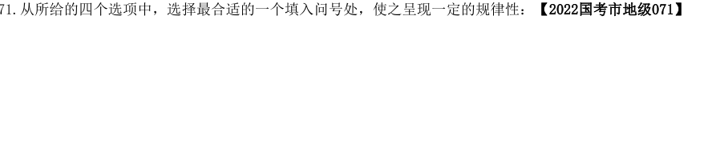

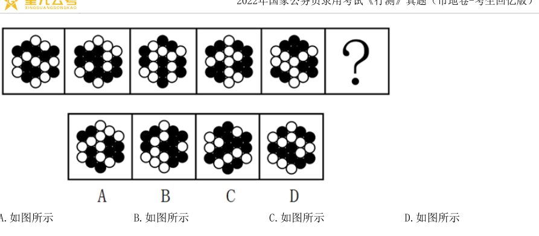

**72.** 从所给的四个选项中，选择最合适的一个填入问号处，使之呈现一定的规律性：  `[2022·地市·72]`

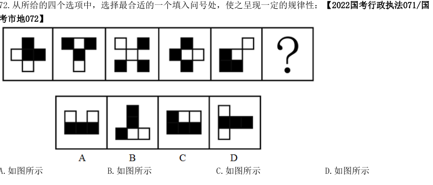

**73.** 从所给的四个选项中，选择最合适的一个填入问号处，使之呈现一定的规律型：  `[2022·地市·73]`

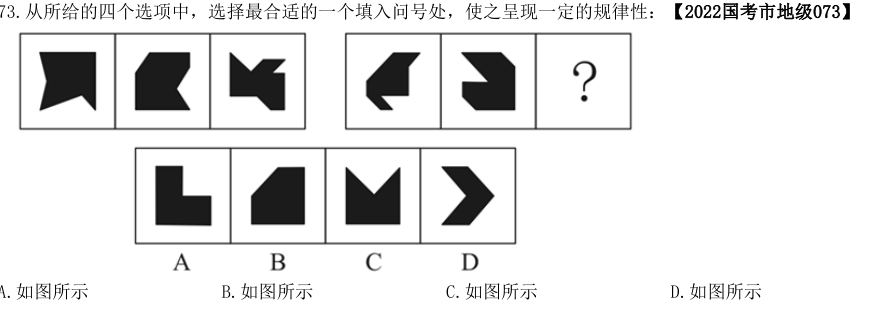

**74.** 从所给的四个选项中，选择最合适的一个填入问号处，使之呈现一定的规律性：  `[2022·地市·74]`

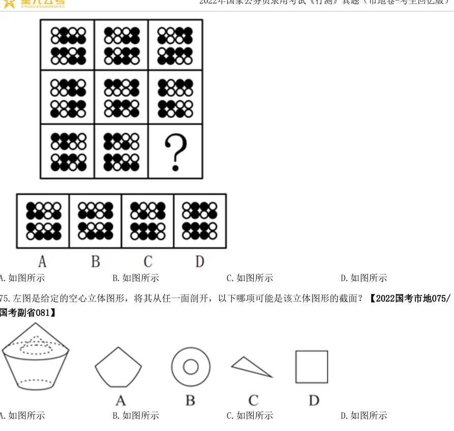

**75.** 从下列四个正六面体展开图中，找出一个折成后和其他三个不同的图形：  `[2022·地市·75]`
> （本题选项为图片，请配合原始PDF查看）

**76.** 左图是给定的立体图形，将其从任一面剖开，下面哪一项可能是该立体图形的截面：  `[2022·地市·76]`

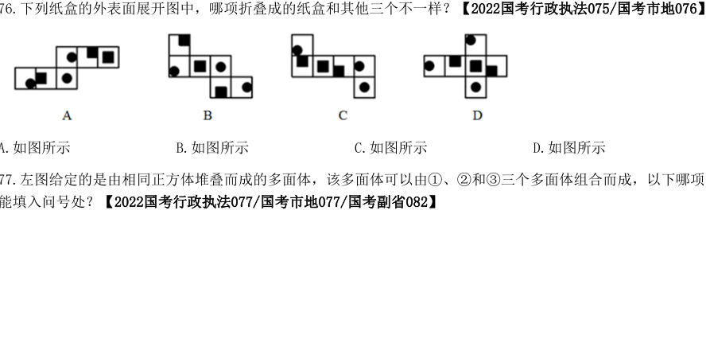

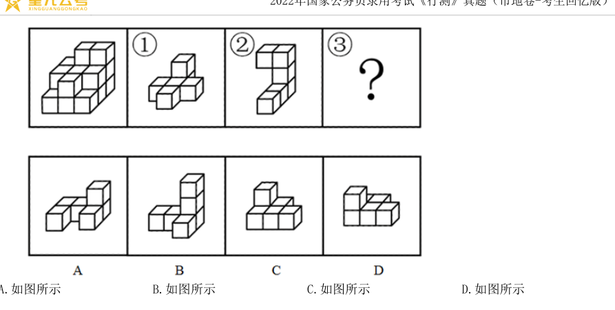

**77.** 下图中的立体图形是由立体图形①，②和③组合而成，下列哪一项能填入问号处：  `[2022·地市·77]`
> （本题选项为图片，请配合原始PDF查看）

**78.** 把下面的六个图形分为两类，使每一类图形都有各自的共同特征或规律，分类正确的一项是：  `[2022·地市·78]`
- A. ①②⑥，③④⑤
- B. ①②④，③⑤⑥
- C. ①④⑤，②③⑥
- D. ①③⑤，②④⑥

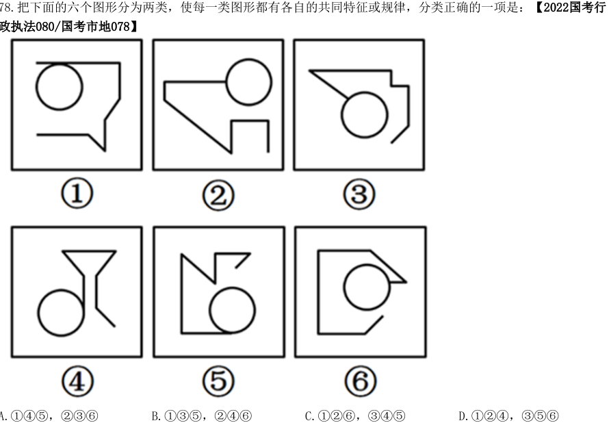

**79.** 把下面的六个图形分为两类，使每一类图形都有各自的共同特征或规律，分类正确的一项是：  `[2022·地市·79]`
- A. ①②⑤；③④⑥
- B. ①③④；②⑤⑥
- C. ①⑤⑥；②③④
- D. ①②④；③⑤⑥

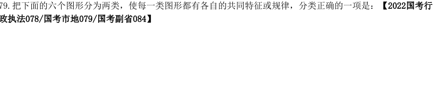

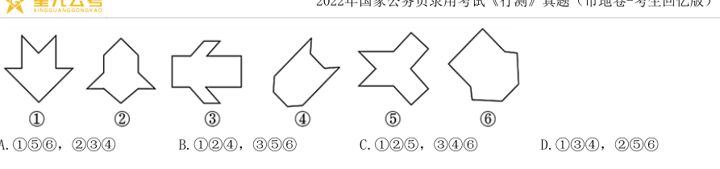

**80.** 把下面的六个图形分为两类，使每一类图形都有各自的共同特征或规律，分类正确的一项是：  `[2022·地市·80]`
- A. ①③⑥，②④⑤
- B. ①②④，③⑤⑥
- C. ①②③，④⑤⑥
- D. ①④⑤，②③⑥二、定义判断。每道题先给出定义，然后列出四种情况，要求你严格依据定义，从中选出一个最符合或最不符合该定义的答案。注意：假设这个定义是正确的，不容置疑的。

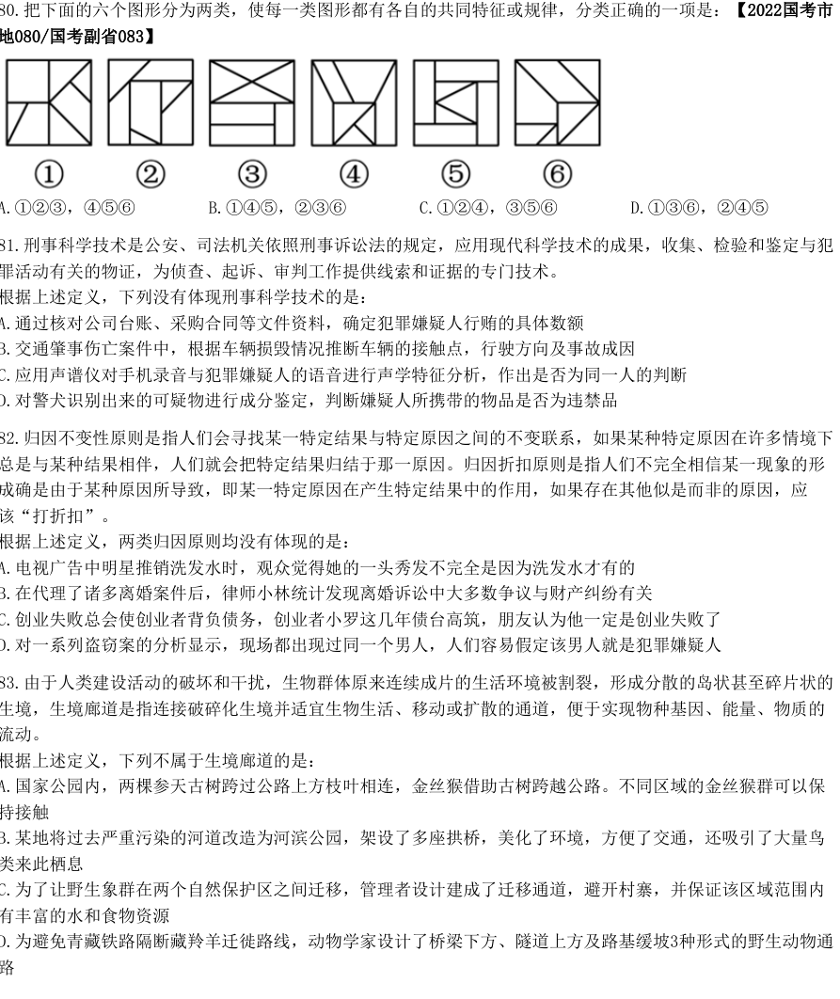

**81.** 归因不变性原则是指人们会寻找某一特定结果与特定原因之间的不变联系。如果某种特定原因在许多情境下总是与某种结果相伴，人们就会把特定结果归结于那一原因。归因折扣原则是指人们不完全相信某一现象的形成，确是由于某种原因导致，即某一特定原因在产生特定结果中的作用，如果存在其他似是而非的原因应该“打折扣”。两类归因原则均没有体现的是：  `[2022·地市·81]`
- A. 电视广告中明星推销洗发水时，观众觉得她的一头秀发不完全是因为洗发水才有的
- B. 在代理了诸多离婚案件后，律师小林统计发现，离婚诉讼中大多数争议与财产纠纷有关
- C. 创业失败总会使创业者背负债务，创业者小罗这几年债台高筑，朋友认为他一定是创业失败了
- D. 对一系列盗窃案的分析显示，现场都出现过同一个男人，人们容易假定该男人就是犯罪嫌疑人

**82.** 由于人类建设活动的破坏和干扰，生物群体原来连续成片的生活环境被割裂，形成分散的岛状甚至碎片状的生境。生境廊道是指连接破碎化生境并适宜生物生活移动或扩散的通道，便于实现物种基因能量物质的流动。根据上述定义，下列不属于生境廊道的是：  `[2022·地市·82]`
- A. 国家公园两颗参天大树跨过公路上方枝叶相连，金丝猴借助古树跨越公路，不同区域的金丝猴群可以保持接触
- B. 为了野生象群在两个自然保护区之间迁移，管理者设计建成了迁移通道，避开村寨，并保证该区域范围内有丰富的水和食物资源
- C. 为避免青藏铁路隔断藏羚羊迁徙路线，动物学家设计了桥梁下方隧道上方及路基缓坡三种形式的野生动物通道
- D. 某地将过去严重污染的河道改造为河滨公园，架设了多座拱桥，美化了环境，方便了交通，还吸引了大量鸟类在此栖息

**83.** 对于特定论域中的任意两个对象a、b而言，当对象a与对象b之间具有关系R时，对象b与对象a之间是否也具有关系R。基于此，对称性关系命题可分为正对称关系、反对称关系和半对称关系。（1）正对称关系：若对象a与b之间具有关系R，则对象b与a之间也具有关系R；（2）反对称关系：若对象a与b之间具有关系R，则对象b与a之间一定不具有关系R；（3）半对称关系：若对象a与b之间具有关系R，则对象b与a之间不一定具有关系R。根据上述定义，下列关系属于半对称关系的是：  `[2022·地市·83]`
- A. 人与人之间的帮助关系
- B. 学生之间的同学关系
- C. 两个分数之间的小于关系
- D. 城市与城市之间的相邻关系

**84.** 刑事科学技术是公安、司法机关依照刑事诉讼的规定，应用现代科学技术的成果，收集、检验和鉴定与犯罪活动有关的物证，为侦查、起诉、审判工作提供线索和证据的专门技术。根据上述定义，下列没有体现刑事科学技术的是：  `[2022·地市·84]`
- A. 通过核对公司台账、采购合同等文件资料，确定犯罪嫌疑人行贿的具体数额
- B. 交通肇事伤亡案件中，根据车辆损毁情况推断车辆接触点、行驶方向及事故成因
- C. 应用声谱仪对手机录音与犯罪嫌疑人的语音进行声学特征分析，作出是否为同一人的判断
- D. 对警犬识别出来的可疑物进行成分鉴定，判断嫌疑人所携带的物品是否为违禁品

**85.** 在生物学、医学及其子科学的研究中，对从通常的生物学环境中分离出的生物体组织成分进行体外研究的实验称为体外实验；在活体生物机体之中进行研究的实验称为体内实验。根据上述定义，下列属于体外实验的是：  `[2022·地市·85]`
- A. 在培养皿中对卵子授精后观察受精卵的发育情况
- B. 在光学显微镜下观察枯草杆菌是否具有鞭毛
- C. 研究不同比例氮肥对玉米植株生长的影响
- D. 在试管中观察药剂与某溶液的化学反应

**86.** 回指是在语法描写中用来指一个语言单位（回指语）从先前某个已表达的单位或意义（先行语）得出自身释义的过程或结果。回指可分为直接回指和间接回指。直接回指是指回指语与先行语存在明显共指关系，回指语是对先行语的重复。间接回指是指回指语与先行语之间的关系不明显，必须通过特定语境进行判断才能确立。根据上述定义，下列括号部分所反映的先行语和回指语之间的关系属于直接回指的是：  `[2022·地市·86]`
- A. 要向（前来参会的人）表示感谢，（人家）来参会就是对我们的支持
- B. 门口停着好些（三轮车），许多（车夫）在那里闲站着
- C. （这房子）相当讲究，（门）是楠木做的
- D. 他午饭前来到（餐馆）点了一杯咖啡，（服务员）是一位意大利人

**87.** 按调查范围来看，可将调查分为全面调查和非全面调查。全面调查指的是一定范围内的情况普查；非全面调查是指从整体中抽取一部分对象进行情况调查，又可分为：根据随机原则选择样本的抽样调查和有意识选取若干样本进行的典型调查。根据上述定义，下列说法正确的是：  `[2022·地市·87]`
- A. 对某市幼儿园的所有儿童进行口腔卫生检查，这属于非全面调查
- B. 对全国招生规模较大的前30所医学院进行学生就业情况调查，这属于典型调查
- C. 对省内1～3年级的全体学生进行体育活动时间的调查，这属于非全面调查
- D. 对某市中考教学成绩最好的几所学校进行调查，总结相关经验，这属于抽样调查

**88.** 量表法是运用量表形式测定被调查者对问题的态度的方法。根据不同用途，量表可分为直接量表和间接量表。直接量表中，调查者设计问题并询问被调查者，被调查者在有关量表上直接表明其态度；间接量表中，被调查者按其态度或意愿，在备选问题或语句中选择出合适的语句代表其态度。根据上述定义，下列属于间接量表的是：  `[2022·地市·88]`
- A. 请给以下四部电影打分，要求其分数总和为100分：《电影甲》  《电影乙》  《电影丙》  《电影丁》
- B. 请您按照个人喜欢的程度对下列品牌的洗衣粉进行编号，最喜欢者为1号，以此类推：品牌甲○  品牌乙○  品牌丙○  品牌丁○  品牌戊○  品牌已○
- C. 请阅读下列语句，并在合适的一项上划“√”：非常不同意不同意不确定同意非常同意我的生活大致符合我的理想
- D. 请对电视剧《XX》中王小明的人物形象进行评价：1 2 3 4 5粗心的细致的

**89.** 基因污染指原生物种基因库非预期或不受控制的基因流动，即外源基因通过转基因作物、外来入侵物种、家养动物等扩散到其他栽培作物或自然野生物种并成为后者基因的一部分。根据上述定义，下列没有体现出基因污染的是：  `[2022·地市·89]`
- A. 某农场生产的大豆发现了转基因成分Bt基因，这些成分是附近地区种植的基因工程Bt大豆通过交叉授粉传播过来的
- B. 黑足猫是一种体型娇小但捕猎能力超强的野生猫，跑到野外的家猫和黑足猫交配后，生出血统不纯正的黑足猫，真正的黑足猫几近灭绝
- C. 转基因SL玉米获批做动物饲料，SL玉米只占某国玉米总产量的1%，但一年后该国22%的玉米样本被认定含有SL玉米基因
- D. 某国开发出耐除草剂的转基因油菜，油菜出油率提高，但这种油菜种子能在土壤中休眠数年，因此成为其他作物中的“杂草”

**90.** 地球物理勘探是通过研究和观测各种地球物理场的变化来探测地层岩性、地质构造等地质条件的过程。由于组成地壳的不同岩层介质往往在密度、弹性、导电性等方面存在差异，这些差异将引起相应的地球物理场的局部变化，通过测量这些物理场的分布和变化特征，结合已知地质资料进行分析研究，就可以达到推断地质性状的目的。根据上述定义，下列不属于地球物理勘探的是：  `[2022·地市·90]`
- A. 根据岩石和矿石导电性、电磁感应特性等来记录地层界面的深度和形态
- B. 利用人工激发的地震波在弹性不同地层内的传播规律，了解水文地质的分布情况
- C. 采集岩石样品，分析岩石内的微量元素，通过发现与矿化有关的原生异常来寻找矿床
- D. 通过观测不同岩石引起的重力差异，判断地下地层的岩性及状态，确定沉积盆地范围三、类比推理。每道题先给出一组相关的词，要求你在备选答案中找出一组与之在逻辑关系上最为贴近、相似或匹配的词。

**91.** 边防检查︰走私  `[2022·地市·91]`
- A. 个税申报︰偷税
- B. 手术治疗︰患病
- C. 科普宣传︰迷信
- D. 农药喷洒︰除害

**92.** 贸易摩擦︰出口下滑  `[2022·地市·92]`
- A. 醉酒驾驶︰例行检查
- B. 行政处罚︰违规生产
- C. 商业垄断︰市场失灵
- D. 职务犯罪︰谋取私利

**93.** 微型无人机︰旋翼无人机  `[2022·地市·93]`
- A. 形象思维︰抽象思维
- B. 开环系统︰闭环系统
- C. 集体决策︰个人决策
- D. 热带植物︰香料植物

**94.** 呼吸系统︰生殖系统  `[2022·地市·94]`
- A. 简牍公文︰纸质公文
- B. 观赏花卉︰药用花卉
- C. 水面舰艇︰巡洋舰艇
- D. 生产计划︰年度计划

**95.** 剪发︰烫发剂︰烫发  `[2022·地市·95]`
- A. 风蚀︰碳酸钙︰溶蚀
- B. 阵痛︰止痛药︰止痛
- C. 催熟︰防腐剂︰防腐
- D. 伐树︰植树节︰植树

**96.** 青铜器物︰商朝礼器︰文化遗产  `[2022·地市·96]`
- A. 进口食品︰速冻海鲜︰冷冻食品
- B. 科幻小说︰微型小说︰文学作品
- C. 中式建筑︰苏州园林︰特色建筑
- D. 仰韶文化︰半坡遗址︰华夏文明

**97.** 独幕剧︰歌剧︰话剧  `[2022·地市·97]`
- A. 流行歌曲︰通俗歌曲︰现代歌曲
- B. 远程面试︰单独面试︰小组面试
- C. 自由体操︰竞技体操︰艺术体操
- D. 顺序作业︰流水作业︰平行作业

**98.** 城市公园︰公共设施︰休闲娱乐  `[2022·地市·98]`
- A. 国宾礼炮︰电子礼炮︰国事庆祝
- B. 升降舞台︰露天剧场︰演出空间
- C. 云服务器︰虚拟技术︰信息备份
- D. 医用口罩︰卫生用品︰过滤空气

**99.** 国色天香  对于（    ）相当于（    ）对于  玉树临风  `[2022·地市·99]`
- A. 面如冠玉；螓首蛾眉
- B. 倾国倾城；明眸皓齿
- C. 一表人才；仪表堂堂
- D. 才高八斗；亭亭玉立

**100.** 自然声源  对于（    ）相当于（    ）对于  煤炭  `[2022·地市·100]`
- A. 传播介质；社区供暖
- B. 物体振动；地质危害
- C. 人工声源；植物遗骸
- D. 燕语莺声；矿石燃料四、逻辑判断。每道题给出一段陈述，这段陈述被假设是正确的，不容置疑的。要求你根据这段陈述，选择一个答案。注意：正确答案应与所给的陈述相符合，不需要任何附加说明即可以从陈述中直接推出。

**101.** 一家全国连锁珠宝店的H分店，去年在当地投放大量电梯促销广告。广告投放后，客流量激增，净利润和前一年同期相比增长了30%，可见电梯促销广告对于提高企业利润十分有效。假设G、M、R、S是与H分店规模位置等具有可比性的其他四家分店，则下列最能削弱上述论证的是：  `[2022·地市·101]`
- A. G分店，去年没有投放电梯广告，利润比H分店更高
- B. M分店，去年选择了投放报纸广告，销售额同比提升了30%
- C. S分店，去年投放大量电梯广告，利润同比下降了10%
- D. R分店，去年投放大量电梯广告，销售额却比H分店低

**102.** 熊蜂是一类多食性昆虫，与蜜蜂相比，熊蜂体型更大且多毛，颜色各异，大多有着经典的黄黑条纹，黑身红尾，人们发现，由于密集管理型农业系统的推广，熊蜂在这些地方开始衰落，有的种类已经灭绝，相对而言，普通蜜蜂的数量并没有明显减少，因此，相比普通蜜蜂，农田利用方式的改变对熊蜂的生存威胁更大。以下哪项如果为真，最能支持上述结论：  `[2022·地市·102]`
- A. 蜜蜂采食会派出“侦查员”，回来后通过一种“摆动舞”告知蜂群食源在哪里，而熊蜂不会跳舞，因此大多独自采食
- B. 蜜蜂会在蜂巢内储藏大量食物，熊蜂的蜂巢储存食物量较少，一旦出现食物短缺，熊蜂就会处于劣势
- C. 蜜蜂属于大型化社群，而熊蜂属于小型化社群，这会导致基因分异度降低，更易受到寄生虫感染而大量死亡
- D. 密集型农田往往种植单一植物，如果植物不是处于花期，熊蜂就会因无法如蜜蜂般进行远距离飞行而岌岌可危

**103.** 不同的读者在阅读时，会对文章进行不同的加工编码，一种是浏览，从文章中收集观点和信息是知识作为独立的单元输入大脑，称为线性策略，一种是做笔记，在阅读时会构建一个层次清晰的架构，就像用信息积木搭建了一个金字塔，称为结构策略，做笔记能够对文章的主要内容进行标注，因此与单纯的浏览相比，做笔记能够取得更优的阅读效果。要使上述论证成立，还需要基于以下哪一前提？  `[2022·地市·103]`
- A. 用浏览的方式进行阅读属于知识加工的线性策略
- B. 做笔记涉及到了更加复杂的认知加工过程
- C. 与线性策略相比结构策略能够让学习提升速度
- D. 阅读效果的好坏取决于能否在阅读时抓住要点

**104.** 最近，主打白噪音的助眠产品引起很多人的兴趣。有人认为，白噪音可以掩盖环境中干扰性的刺激，有助于促进睡眠，但研究者对此持怀疑态度，认为白噪音可改善睡眠的研究证据不足，持续白噪音甚至会对睡眠造成影响。以下哪项如果为真，不能支持研究者的观点？  `[2022·地市·104]`
- A. 持续暴露在白噪音下，听觉系统会不断将声音信号转换成神经信号，上传大脑，大脑会持续保持活跃，无法充分休息
- B. 持续的白噪音会引起听力的损害，甚至会导致认知功能障碍，严重者还会导致失眠或嗜睡
- C. 白噪音掩盖环境中干扰性的刺激，也会掩盖环境中有意义的声音，可能对人的生活甚至对生命造成威胁
- D. 白噪音会使健康志愿者睡眠期间脑电波的循环交替模式显著改变，这意味着，健康人睡眠结构受到干扰

**105.** 动物实验发现，和处于寒冷环境的同等大小的小鼠相比，温暖环境小鼠的骨密度会明显增强，很少出现骨质疏松。与此同时，温暖环境中小鼠的肠道菌群更为活跃，当把这些小鼠的肠道菌群移植到寒冷环境的小鼠肠道后，后者骨密度也增强了。由此可见，只要改善肠道菌群活性，就可以增强骨密度。以下哪项如果为真，最能削弱上述论证？  `[2022·地市·105]`
- A. 改善肠道菌群活性还须与生活环境和饮食习惯相结合，才能增强骨密度
- B. 肠道中不是所有的细菌都会引起成骨细胞的增加，从而增加骨密度
- C. 改善肠道菌群活性，对于年老小鼠增加骨密度的作用不十分明显
- D. 接受菌群移植的小鼠若持续处于寒冷环境，骨密度会很快再次降低至原有水平根据材料回答106～110题：某超市从前到后整齐排列着7排货架，放置着文具、零食、调料、日用品、酒、粮油和饮料7类商品，每类商品占据一排。已知：（1）酒类排在调料类之前；（2）文具类和调料类中间隔着3排；（3）粮油类在零食类之后，中间隔着2排；（4）日用品类紧挨在文具类前一排或后一排。

**106.** 下列各项中，哪一类商品不可能排在第一排：  `[2022·地市·106]`
- A. 粮油类
- B. 文具类
- C. 酒类
- D. 日用品类

**107.** 按照从前到后，下列哪项排列是可能的？  `[2022·地市·107]`
- A. 文具类、零食、日用品类、酒、调料类、粮油类、饮料
- B. 日用品类、文具类、酒、零食、饮料、调料类、粮油类
- C. 零食、文具类、日用品类、粮油类、饮料、调料类、酒
- D. 日用品类、文具类、零食、酒、粮油类、调料类、饮料

**108.** 零食类和文具类中间最多可能隔几排？  `[2022·地市·108]`
- A. 2排
- B. 3排
- C. 4排
- D. 5排

**109.** 如果饮料类排在第一排，则以下哪项是可能的？  `[2022·地市·109]`
- A. 零食类排在文具类前一排
- B. 粮油类排在调料类前一排
- C. 日用品类排在文具类前一排
- D. 酒类排在文具类前一排

**110.** 如果零食类排在第一排，那么下列哪项中两类商品不可能是相邻的两排？  `[2022·地市·110]`
- A. 文具类和粮油类
- B. 零食类和文具类
- C. 日用品类和酒类
- D. 零食类和日用品类

## 2023年 · 副省级

**76.** 从所给的四个选项中，选择最合适的一个填入问号处，使之呈现一定的规律性：【2023国考行政执法071/国考副省076/国考市地071】  `[2023·副省·76]`
- A. 如图所示
- B. 如图所示
- C. 如图所示
- D. 如图所示

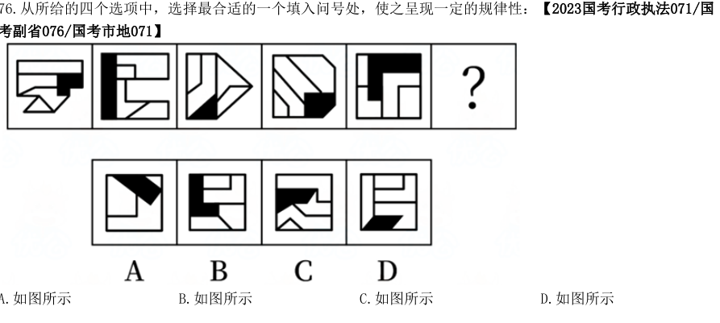

**77.** 从所给的四个选项中，选择最合适的一个填入问号处，使之呈现一定的规律性：【2023国考行政执法073/国考副省077】  `[2023·副省·77]`
- A. 如图所示
- B. 如图所示
- C. 如图所示
- D. 如图所示

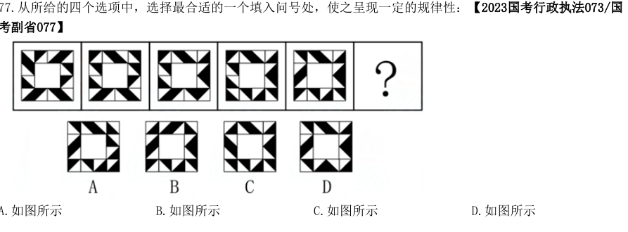

**78.** 从所给的四个选项中，选择最合适的一个填入问号处，使之呈现一定的规律性：【2023国考市地072/国考副省078】  `[2023·副省·78]`
- A. 如图所示
- B. 如图所示
- C. 如图所示
- D. 如图所示2023年国家公务员录用考试《行测》真题（副省卷-考生回忆版）

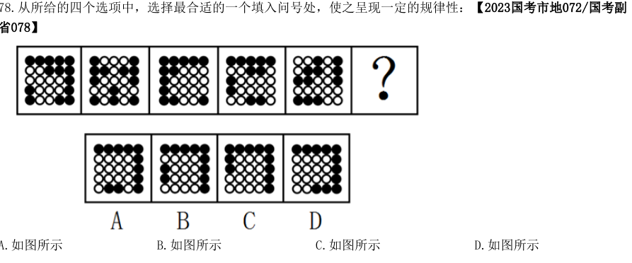

**79.** 从所给的四个选项中，选择最合适的一个填入问号处，使之呈现一定的规律性：【2023国考市地074/国考副省079】  `[2023·副省·79]`
- A. 如图所示
- B. 如图所示
- C. 如图所示
- D. 如图所示

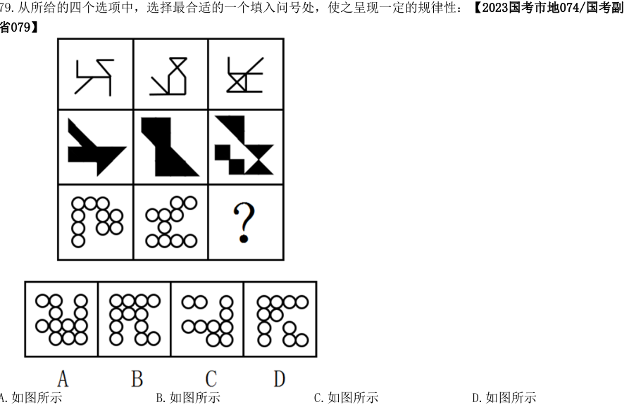

**80.** 下图是给定的立体图形（大圆柱内的虚线部分为挖空部分），将其从任一面剖开，下面哪一项不可能是该立体图形的截面？【2023国考市地076/国考副省080】  `[2023·副省·80]`
- A. 如图所示
- B. 如图所示
- C. 如图所示
- D. 如图所示

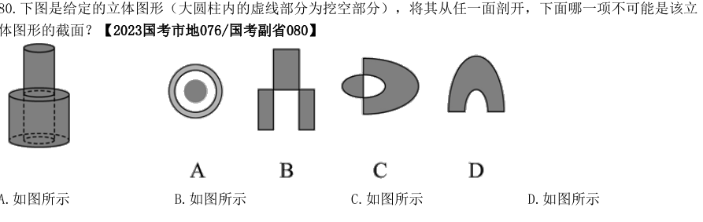

**81.** 左边给定的是正方体的外表面展开图，下面哪一项能由它折叠而成？【2023国考副省级081】  `[2023·副省·81]`
- A. 如图所示
- B. 如图所示
- C. 如图所示
- D. 如图所示

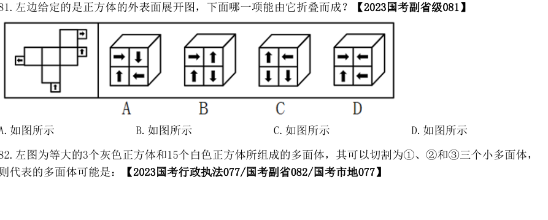

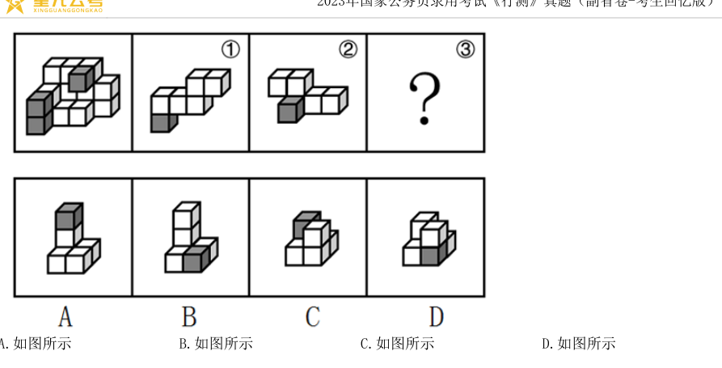

**82.** 左图为等大的3个灰色正方体和15个白色正方体所组成的多面体，其可以切割为①、②和③三个小多面体，则代表的多面体可能是：【2023国考行政执法077/国考副省082/国考市地077】 2023年国家公务员录用考试《行测》真题（副省卷-考生回忆版）  `[2023·副省·82]`
- A. 如图所示
- B. 如图所示
- C. 如图所示
- D. 如图所示

**83.** 把下面的六个图形分为两类，使每一类图形都有各自的共同特征或规律，分类正确的一项是：【2023国考副省级083】  `[2023·副省·83]`
- A. ①③⑥，②④⑤
- B. ①③⑤，②④⑥
- C. ①②⑥，③④⑤
- D. ①⑤⑥，②③④

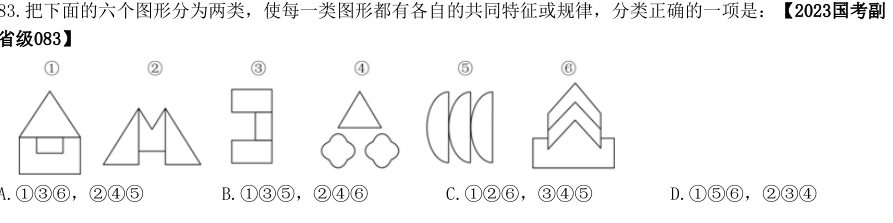

**84.** 把下面的六个图形分为两类，使每一类图形都有各自的共同特征或规律，分类正确的一项是：【2023国考市地079/国考副省084】  `[2023·副省·84]`
- A. ①⑤⑥，②③④
- B. ①④⑥，②③⑤
- C. ①②⑥，③④⑤
- D. ①③④，②⑤⑥

**85.** 把下面的六个图形分为两类，使每一类图形都有各自的共同特征或规律，分类正确的一项是：【2023国考副省级085】  `[2023·副省·85]`
- A. ①③⑥，②④⑤
- B. ①④⑤，②③⑥
- C. ①②⑥，③④⑤
- D. ①③④，②⑤⑥

**86.** 化学动力学是研究化学反应速率和反应机理的化学分支学科，主要内容包括：（1）确定化学反应的速率以及温度、压力、催化剂、溶剂和光照等外界因素对反应速率的影响；（2）研究化学反应机理，揭示化学反应速率本质；（3）探求物质结构与反应能力之间的关系和规律。根据上述定义，下列没有体现化学动力学研究的是：  `[2023·副省·86]`
- A. 研究表面积不同的各类煤块在相同温度条件下燃烧速率的变化
- B. 研究不同光照和温湿度条件下植物叶片蒸腾作用的强度和效率2023年国家公务员录用考试《行测》真题（副省卷-考生回忆版）
- C. 在馒头制作的过程中，研究酵母菌对面粉发酵的催化反应模型
- D. 在铁制品表面喷涂不同种类油漆，研究铁与水、氧气的反应情况，判断防锈效果

**87.** 政策工具是指实现政策目标所要运用的手段与方法，政策工具可分为以下三种:（1）供给型政策工具，对政策目标起直接促进作用，通常体现政府的重要政策导向，包含资金、人才、设施、技术、信息等方面的有效支持；（2）需求型政策工具，对政策目标起到拉动作用，释放对政策目标的需求，减少外部干扰，包括服务外包、直接采购、国际交流与贸易管制等:（3）环境型政策工具，对政策目标起到间接促进作用，通常体现为通过目标、计划、法规、金融与税收等方式提供有利的政策环境，包括目标规划、金融服务、税收优惠、法规管制以及策略性措施等。根据上述定义，下列属于促进养老服务的需求型政策工具的是：  `[2023·副省·87]`
- A. 政府提供资金建设社区食堂，解决失能、独居、空巢等老年人“舌尖养老”难题
- B. 政府鼓励技工院校开设老年服务与管理、健康服务与管理、护理等养老服务相关专业
- C. 政府向养老机构购买居家养老服务，为低保家庭60周岁以上失能老人提供服务
- D. 商务部发布《关于推动养老服务产业发展的指导意见》，提出打造养老服务品牌

**88.** 背信规避是指当风险来源为另一个体而不是自然条件时，人们普遍更不愿意冒险，即在同等条件下，人们对于人为风险的规避程度高于对客观风险的规避程度，体现在人们面对人为风险时比面对客观风险时表现得更保守。根据上述定义，下列没有体现背信规避的是:  `[2023·副省·88]`
- A. 与老司机相比，坐新手司机开的车时，后排座上的乘客主动系安全带的更多
- B. 在对客观题阅卷方式意愿的调查中，学生更愿意选择机器阅卷而非人工阅卷
- C. 决定谁先开球时，双方球员都倾向于由裁判抛硬币决定而非裁判随机指定
- D. 在老师打算指派一个人多承担一项任务时，同学们纷纷表示要抽签决定

**89.** 植物病害分为侵染性病害和非侵染性病害。侵染性病害是由病原物引起的，可以在植物个体间互相传染的病害；非侵染性病害是由于环境不良、营养元素不足等非生物因素造成的病害，由于没有病原物的侵袭，所以不会在植物间相互传染。根据上述定义，下列属于非侵染性病害的是:①需要微酸性生长环境的杜鹃花，种植在偏碱性土壤中，叶片会黄化②植株浇水过多，盆土积水后，由于植株根系缺氧，会导致植株萎蔫③除草剂使用不当会引起西瓜苗嫩叶黄化，叶片枯焦，植株萎缩④灰葡萄孢真菌会引起番茄灰霉病，发病后造成番茄大量烂果  `[2023·副省·89]`
- A. 仅①②③
- B. 仅②③④
- C. 仅①④
- D. 仅①②

**90.** 单元素导语是指在撰写新闻导语（即消息的开头）时，突出表现一个新闻事实的导语。单元素导语按新闻五要素可分为：①何人导语，突出报道显要或影响大的新闻人物；②何事导语，突出报道新闻事实本身；③何时导语，突出报道读者关心的事情什么时候会发生或进行；④何地导语，突出报道一些重要或有特殊意义的地方发生重大变化的消息；⑤为什么导语，突出报道一个事件的起因。根据上述定义，下列导语与其分类对应正确的是：  `[2023·副省·90]`
- A. 亲爱的读者，你知道为什么夏天夜空看到的星星比冬天夜空里看到的多？——④
- B. 1964年10月16日，我国第一颗原子弹爆炸成功——②
- C. 杨先生带着2岁的女儿到市医院看病，没想到看一个“咳嗽”就要花1000多元——①
- D. 谁是高考状元？这个一年一度的热门话题，今年却在xx省消失了——③

**91.** 数字农业是指用数字化技术，按人类需要的目标，对农业所涉及的对象和全过程进行数字化和可视化表达、设计、控制、管理等的农业。根据上述定义，下列没有体现数字农业的是：2023年国家公务员录用考试《行测》真题（副省卷-考生回忆版）  `[2023·副省·91]`
- A. 在大数据平台，点击任一块田地，就可以看到这块田地的土壤酸碱度、肥水条件、环境温度湿度等指标，农民可以根据这些信息进行田地管理
- B. 某柑橘生产大省建立“柑橘产业大数据中心”，以数据驱动柑橘产业结构性改革和高质量发展
- C. 通过电子标签等技术，对单个产品赋予身份编码及认证信息，在生产管理、仓储、物流、销售等环节实现信息追溯
- D. 遇到连绵阴雨天，果蔬容易滋生病害，需要及时喷药，采用轻型直升机几个小时就可以完成传统作业方式十多人几天才能完成的工作

**92.** 小中取大法是指在决策时，首先计算各方案在不同自然状态下的收益，并找出各方案在最差自然状态下的收益，然后进行比较，选择在最差自然状态下收益最大或损失最小的方案作为最终方案的一种决策方法。大中取大法是指在决策时，首先计算各方案在不同自然状态下的收益，并找出各方案在最好自然状态下的收益，然后进行比较，选择在最好自然状态下收益最大的方案作为最终方案的一种决策方法。根据上述定义，分别使用小中取大法和大中取大法对上述方案进行决策，所选择的方案依次是：  `[2023·副省·92]`
- A. 方案二和方案二
- B. 方案二和方案一
- C. 方案三和方案一
- D. 方案三和方案二

**93.** 对称推断法是辨析文言词义的一种方法，是指通过对运用了对偶修辞格或排比修辞格的句子内部已知词语词义的分析，推断其位置相对的文言词义的一种方法。根据上述定义，下列使用了对称推断法的是：  `[2023·副省·93]`
- A. 归有光《项脊轩志》：“项脊轩，旧南阁子也。”其中的“也”，表判断的语气词，可不译
- B. 吴均《与朱元思书》：“急湍甚箭，猛浪若奔。”其中的“箭”为名词，可据此推断“奔”也为名词，为“奔马”的意思
- C. 《荀子·劝学》：“故木受绳则直，金就砺则利。”其中的“砺”，形旁为“石”，说明“砺”与“石”有关，意思是磨刀石
- D. 《旧五代史·冯道传》：“臣所陈虽小，可以喻大。”成语“不言而喻”中的“喻”为“知晓”的意思，可据此推断此句中的“喻”为“知晓”的意思

**94.** 分布区是指某生物的活动、生存范围。如下图所示，用黑色方块表示该生物已知、推断或预计出现的位点。分布区的划定是环绕所有已知、推断或预计出现的位点的最短连续边界所包含的面积，经常用最小凸边形来表示。该最小凸边形的每个内角不能超过180度，并要包含所有出现的位点。根据上述定义，对于上述位点所划定的分布区正确的是：2023年国家公务员录用考试《行测》真题（副省卷-考生回忆版）  `[2023·副省·94]`
- A. 如图所示
- B. 如图所示
- C. 如图所示
- D. 如图所示

**95.** 细胞学检查是指对患者病变部位脱落、刮取或穿刺抽取的细胞，进行病理形态学的观察并做出定性诊断的检查方式。细胞学检查主要应用于肿瘤的诊断，也可用于某些疾病的检查和诊断，如内部器官炎症性疾病的诊断和激素水平的判定等。根据上述定义，下列属于细胞学检查的是：  `[2023·副省·95]`
- A. 采集患者血液样本，分析血细胞比例变化，判断患者是否出现感染
- B. 针对外伤患者皮肤纤维细胞的过度增生，实行激光打磨法，抑制炎性细胞浸润，修复再生皮肤组织
- C. 通过拉网法收集食道癌患者的食道脱落细胞，鉴定细胞形态，明确癌变性质
- D. 对脑疝患者脑室穿刺，放出脑室液以降低脑压，后再次穿刺注入造影剂，诊断其颅内占位病变的情况

**96.** 花海∶书山  `[2023·副省·96]`
- A. 怒火∶苦雨
- B. 车流∶人潮
- C. 雪白∶麦浪
- D. 龙舟∶木马

**97.** 猛药去疴∶重典治乱  `[2023·副省·97]`
- A. 静以修身∶俭以养德
- B. 名非天造∶必从其实
- C. 民生在勤∶勤则不匮
- D. 从善如登∶从恶如崩

**98.** 强光照射∶视力损伤  `[2023·副省·98]`
- A. 原油进口∶能源紧缺
- B. 风险防范∶消防演练
- C. 台风过境∶渔业停产
- D. 网络招聘∶业务扩张

**99.** 一望无垠∶辽阔  `[2023·副省·99]`
- A. 方兴未艾∶失败
- B. 厉兵秣马∶战斗
- C. 人云亦云∶重复
- D. 耳提面命∶教导

**100.** 特征提取∶模式匹配∶语音识别  `[2023·副省·100]`
- A. 接诊病人∶网上挂号∶健康宣教
- B. 提交资料∶资格审核∶报名成功
- C. 询问证人∶勘验现场∶接到报警
- D. 海事损害∶请求赔偿∶租赁船只

**101.** 春季过敏∶花粉∶喷嚏  `[2023·副省·101]`
- A. 肺炎∶咳嗽∶支原体
- B. 失眠∶恐惧∶噩梦2023年国家公务员录用考试《行测》真题（副省卷-考生回忆版）
- C. 秋季腹泻∶饮食∶脱水
- D. 乙型脑炎∶病毒∶发热

**102.** 片剂∶散剂∶气雾剂  `[2023·副省·102]`
- A. 边塞诗∶山水诗∶抒情诗
- B. 口头契约∶君子协定∶书面协议
- C. 头部理疗∶腰部理疗∶腿部理疗
- D. 泉水∶湖水∶天然

**103.** 标清∶高清∶超清  `[2023·副省·103]`
- A. 迁怒∶愤怒∶暴怒
- B. 幽静∶寂静∶安静
- C. 厅级∶市级∶省级
- D. 亚音速∶音速∶超音速

**104.** 刑事警察  对于（  ）相当于（  ）对于  对外交涉  `[2023·副省·104]`
- A. 交通警察  外交领事
- B. 公安机关  维护主权
- C. 打击犯罪  外交人员
- D. 刑事案件  驻外武官

**105.** 缄口不言  对于（  ）相当于（ ）对于  虚怀若谷  `[2023·副省·105]`
- A. 口若悬河  矜功伐善
- B. 畅所欲言  放荡不羁
- C. 守口如瓶  礼贤下士
- D. 三缄其口  大智若愚

**106.** 人们感受气味通过嗅觉受体实现。研究发现：随着人类的演化，编码人类嗅觉受体的基因不断突变，许多在过去能强烈感觉气味的嗅觉受体已经突变为对气味不敏感的受体。与此同时，人类嗅觉受体的总体数目也随时间推移逐渐变少。由此可以认为，人类的嗅觉经历着不断削弱、逐渐退化的过程。以下哪项如果为真，最能支持上述结论？  `[2023·副省·106]`
- A. 随着人类进化，嗅觉中枢在大脑皮层中所占面积逐渐减少
- B. 相对于视觉而言，嗅觉在人类感觉系统中的重要性较低
- C. 人类有大约1000个嗅觉受体相关基因，其中只有390个可以编码嗅觉受体
- D. 不同人群之间嗅觉存在很大差异，老年人的嗅觉敏感性明显低于年轻人

**107.** R行星是位于太阳系的一颗小行星，质量不大，平均直径不足500米。在对R行星进行长达一年的观测后，人们发现其表面长期漂浮着砂粒，且砂粒在漂浮一段时间后，还会重新落在行星表面。由于R行星表面没有稳定的大气层，因此人们认为砂粒漂浮的现象主要来自静电，原因是太阳风进入行星表面产生电场时，砂粒会因静电力的作用离开行星表面漂浮游动起来，当没有太阳风时，砂粒又会回落下来。以下哪项如果为真，没有质疑上述观点？  `[2023·副省·107]`
- A. R行星表面存在一氧化碳、干冰等挥发性物质，其升华会带动砂粒的释放与漂浮
- B. R行星质量小，静电作用只能扬起毫米级的砂粒，但目前其表面漂浮的砂粒尺寸都很大
- C. R行星自转速度快，星球上的物体受到离心作用强，其表面尘埃与石块会脱离引力束缚，剥落散逸
- D. R行星与彗星组成类似，彗星靠近太阳时，受太阳风产生的静电影响，其表面砂粒将会漂浮

**108.** 调查显示，某地区第二产业从业人员与五年前相比减少了10.4%。对于第二产业从业人员减少的原因，一种观点认为，产业优化升级是第二产业从业人员减少的原因。第二产业在实现产业规模快速扩大的同时，不断加快技术改造，实现“机器换工”，客观上降低了工业企业的用工需求。另一种观点则认为，这与第二产业的优化升级无关，第三产业的蓬勃发展发挥了就业“蓄水池”的功能，吸纳了大量第二产业从业人员。以下哪项如果为真，最能削弱第二种观点？  `[2023·副省·108]`
- A. 该地区第三产业的整体规模比第二产业要小
- B. 第二产业优化升级拉动了第三产业蓬勃发展
- C. 第三产业的发展得益于持续优化的营商环境
- D. 第二产业和第三产业都对吸纳就业作出贡献

**109.** 杂草稻是稻田里不种自生、伴随栽培稻生长的一种“杂草型稻”。研究者在杂草稻基因组中发现了与干旱胁迫下叶片干枯程度显著相关的基因——PAPH1。消除该基因后的株系，其叶肉细胞膜内外钙离子和钾离子流速降低；而PAPH1基因过度表达的株系，其叶肉细胞膜内外钙离子和钾离子流速增加。因此研究者指出，PAPH1基因在杂草稻抗旱性中发挥关键作用。上述论证的成立须补充以下哪项作为前提？  `[2023·副省·109]`
- A. 正常状态下的栽培稻长期生长在有水的环境中，不含PAPH1基因2023年国家公务员录用考试《行测》真题（副省卷-考生回忆版）
- B. 叶肉细胞膜内外钙离子和钾离子的流速也促进PAPH1基因的表达
- C. 叶肉细胞膜内外钙离子和钾离子流速越高，杂草稻的抗旱性越强
- D. 杂草稻与栽培稻存在基因交流，其演化与栽培稻选育品种密切相关

**110.** 汞在环境中有三种存在形态：金属汞、无机汞、有机汞。这三种形态下的汞均有毒性，其毒性由小到大依次为：无机汞＜金属汞＜有机汞。其中，金属汞是常温下唯一的液态金属。烷基汞是已知毒性最大的汞化合物，甲基汞毒性比无机汞大50~100倍。由此不能推出的是：  `[2023·副省·110]`
- A. 烷基汞属于有机汞
- B. 甲基汞不是无机汞
- C. 有机汞和无机汞不能呈现出液态
- D. 常温下的金属，除汞外均不呈液态

**111.** 传统污水处理，或通过重力沉降、混凝澄清、浮力浮上、离心力分离、磁力分离等物理方法对不溶态污染物进行分离，或通过酸碱中和法、化学沉淀法、氧化还原法等化学方法让污染物发生转化，而新兴的微生物治理技术则是通过水体微生物来净化污水。有专家认为，与传统手段相比，微生物治理技术是一种处理污水的更佳手段。以下哪项如果为真，不能支持上述观点？  `[2023·副省·111]`
- A. 物理方法进行污水治理的处理厂，通常占地面积大，基建费、运行费高，能耗大，易出现污泥膨胀现象
- B. 微生物技术污水治理的能耗低，效率高，剩余污泥量少，操作管理方便
- C. 化学方法进行污水治理运行成本高，需消耗大量的化学试剂，易产生二次污染
- D. 近年来，微生物技术的科研投入持续扩大，相关技术成果在土壤改良等领域已经得到了有效转化

**112.** 近来，国际大宗商品市场中，原油和天然气价格达到近十年以来的高位，锌矿价格也上涨了7%左右，有分析人士认为，大宗商品市场将进入“超级周期”（大宗商品价格高于长期平均价格的时期）。从宏观层面看，大宗商品进入“超级周期”是全球经济出现新的增长动力的结果。历史上大宗商品进入“超级周期”往往会带动全球经济复苏，这也预示着当下全球经济正在复苏。以下哪项如果为真，最能削弱上述论证？  `[2023·副省·112]`
- A. 飙升的天然气价格推高了化肥的主要成分——氨的价格，进而推高全球粮食价格
- B. 地缘政治的风险加剧了大宗商品供应的紧张局势，引发本轮大宗商品价格上涨
- C. 全球经济将更注重环保，碳中和与碳达峰将改变能源产业格局，进而影响金属和原油产业的发展远景
- D. 全球主要经济体正在加紧出台强有力的救市计划，以寻求本国新的经济增长动力

**113.** 考古人员对岳阳新墙河流域的大马古城址及其相关东周遗存进行调查研究，推测这里是东周时期䴢子国城的遗址。东周时期䴢子国被楚灭亡后迁徙江南，最后定居在今岳阳新墙河流域，因此大马古城址应是䴢子国遗民南迁后所筑的䴢子国城遗址。凤形嘴山、将军潭、尧岭山所在的这一区域应是䴢子国遗民生产活动和生活栖息的地方。以下哪项如果为真，不能支持考古人员的推测？  `[2023·副省·113]`
- A. 据明隆庆《岳州府志》记载，先秦时期被楚灭国后迁来岳州的有罗、䴢、许三国遗民，其中䴢子国遗民定居在巴陵（今湖南岳阳）境内
- B. 大马城址、凤形嘴山、将军潭、尧岭山墓地均为楚系，而麜与楚本来同源同祖同姓，二者在文化上相通是顺理成章的
- C. 䴢子国原为周初的一个子爵小国，与楚国同姓。它最早居于今山东梁山县，又辗转多地，后定居锡穴（今陕西白河县）
- D. 大马古城位于今岳阳市东南，与《读史书舆纪要》中记载的岳州“府东三十里，相传古䴢子国”所记位置大体一致

**114.** 面对需求收缩、供给冲击、预期转弱三重压力，要想实现国内经济发展稳中求进，关键是要稳住市场主体。只有围绕市场主体需求实施更大力度减税降费，才能帮助其渡过资金难关。除了减税降费外，还需继续深化“放管服”改革，才能为市场主体营造更加市场化、法治化的营商环境。只有营商环境更加市场化、法治化，2023年国家公务员录用考试《行测》真题（副省卷-考生回忆版）市场主体才会获得内生动力，从而进一步增强国内经济的吸引力、创造力、竞争力。由此可以推出：  `[2023·副省·114]`
- A. 实施更大力度减税降费，是帮助市场主体渡过资金难关的必要举措
- B. 只要稳住市场主体，就能实现国内经济发展稳中求进
- C. 如果深化“放管服”改革，就能营造更加市场化、法治化的营商环境
- D. 若市场主体不具有内生动力，国内经济就不会有吸引力、创造力、竞争力

**115.** 石、方、白、于、叶5人参加单板滑雪、跳台滑雪、越野滑雪和高山滑雪4个项目的比赛，每人参加一个项目，每个项目均有1—2人参加。已知：（1）如果石和白至少有一人参加高山滑雪，则方参加单板滑雪，而于参加高山滑雪；（2）如果于和方至少有一人参加高山滑雪，则白和叶均参加单板滑雪。如果叶未参加高山滑雪，则可以得出以下哪项？  `[2023·副省·115]`
- A. 方参加了越野滑雪
- B. 叶未参加单板渭雪
- C. 石参加了高山滑雪
- D. 白未参加跳台滑雪

## 2023年 · 地市级

**71.** 从所给的四个选项中，选择最合适的一个填入问号处，使之呈现一定的规律性：【2023国考行政执法071/国考副省076/国考市地071】  `[2023·地市·71]`
- A. 如图所示
- B. 如图所示
- C. 如图所示
- D. 如图所示2023年国家公务员录用考试《行测》真题（市地卷-考生回忆版）

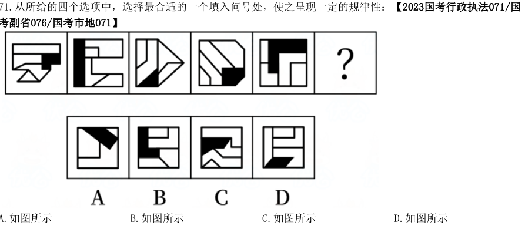

**72.** 从所给的四个选项中，选择最合适的一个填入问号处，使之呈现一定的规律性：【2023国考市地072/国考副省078】  `[2023·地市·72]`
- A. 如图所示
- B. 如图所示
- C. 如图所示
- D. 如图所示

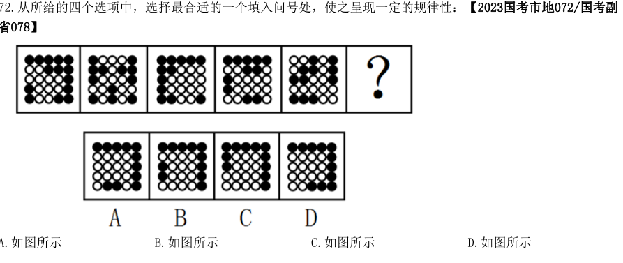

**73.** 从所给的四个选项中，选择一个最合适的填入问号处，使之呈现一定的规律性：【2023国考市地级073】  `[2023·地市·73]`
- A. 如图所示
- B. 如图所示
- C. 如图所示
- D. 如图所示

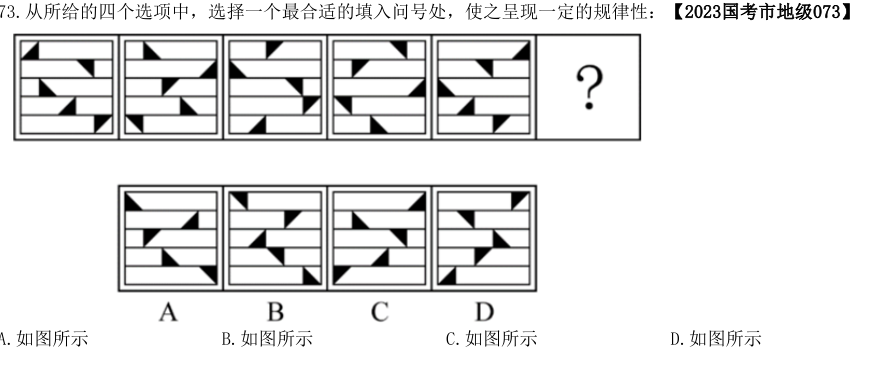

**74.** 从所给的四个选项中，选择最合适的一个填入问号处，使之呈现一定的规律性：【2023国考市地074/国考副省079】 2023年国家公务员录用考试《行测》真题（市地卷-考生回忆版）  `[2023·地市·74]`
- A. 如图所示
- B. 如图所示
- C. 如图所示
- D. 如图所示

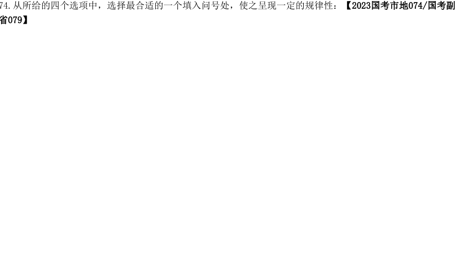

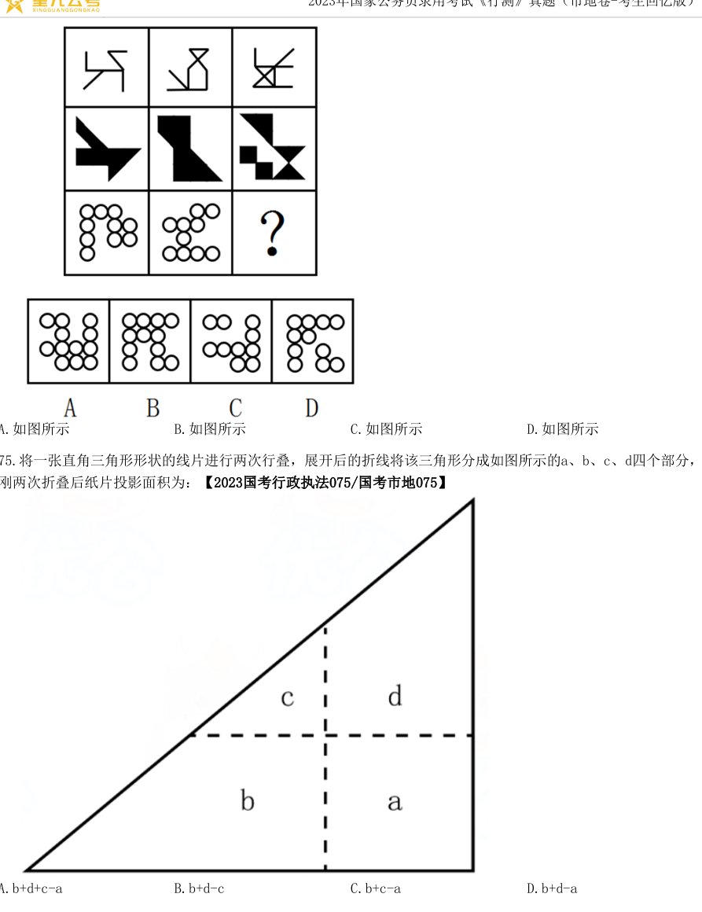

**75.** 将一张直角三角形形状的线片进行两次行叠，展开后的折线将该三角形分成如图所示的a、b、c、d四个部分，刚两次折叠后纸片投影面积为：【2023国考行政执法075/国考市地075】  `[2023·地市·75]`
- A. b+d+c-a
- B. b+d-c
- C. b+c-a
- D. b+d-a

**76.** 下图是给定的立体图形（大圆柱内的虚线部分为挖空部分），将其从任一面剖开，下面哪一项不可能是该立体图形的截面？【2023国考市地076/国考副省080】 2023年国家公务员录用考试《行测》真题（市地卷-考生回忆版）  `[2023·地市·76]`
- A. 如图所示
- B. 如图所示
- C. 如图所示
- D. 如图所示

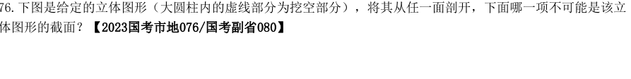

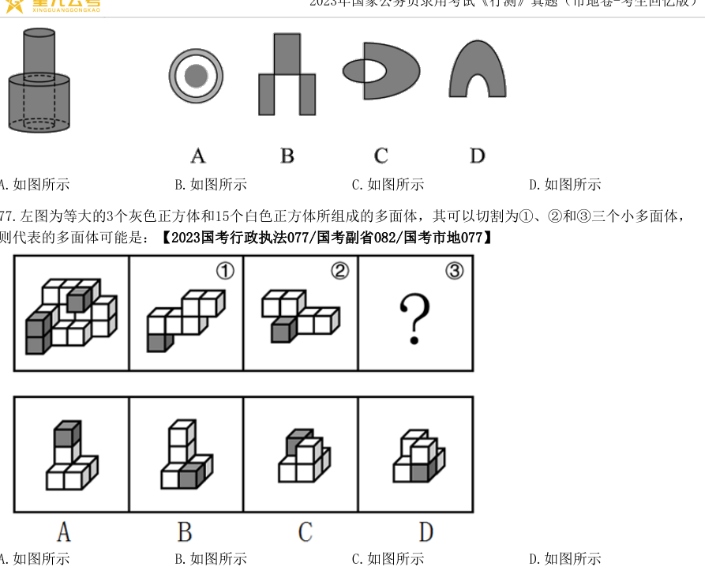

**77.** 左图为等大的3个灰色正方体和15个白色正方体所组成的多面体，其可以切割为①、②和③三个小多面体，则代表的多面体可能是：【2023国考行政执法077/国考副省082/国考市地077】  `[2023·地市·77]`
- A. 如图所示
- B. 如图所示
- C. 如图所示
- D. 如图所示

**78.** 把下面的六个图形分为两类，使每一类图形都有各自的共同特征或规律，分类正确的一项是：【2023国考行政执法079/国考市地078】  `[2023·地市·78]`
- A. ①③⑤，②④⑥
- B. ①④⑥，②③⑤
- C. ①③④，②⑤⑥
- D. ①②④，③⑤⑥

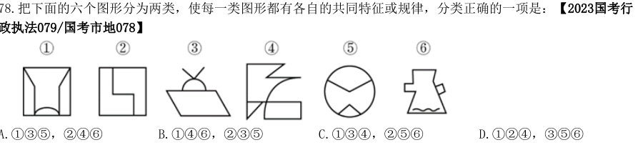

**79.** 把下面的六个图形分为两类，使每一类图形都有各自的共同特征或规律，分类正确的一项是：【2023国考市地079/国考副省084】  `[2023·地市·79]`
- A. ①⑤⑥，②③④
- B. ①④⑥，②③⑤
- C. ①②⑥，③④⑤
- D. ①③④，②⑤⑥

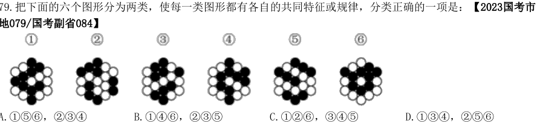

**80.** 把下面的六个图形分为两类，使每一类图形都有各自的共同特征或规律，分类正确的一项是：【2023国考行政执法078/国考市地080】 2023年国家公务员录用考试《行测》真题（市地卷-考生回忆版）  `[2023·地市·80]`
- A. ①②⑤，③④⑥
- B. ①②④，③⑤⑥
- C. ①④⑤，②③⑥
- D. ①③⑤，②④⑥

**81.** 微量鉴定是指运用物理学、化学和仪器分析等方法，通过对案件现场有关物质材料（材料特点多为体小量微、不易注意）的成分及其结构进行定性、定量分析，对检材的种类、检材和嫌疑样本的同类性和同一性进行鉴定。根据上述定义，下列涉及交通事故的鉴定属于微量鉴定的是：  `[2023·地市·81]`
- A. 对车辆驾驶人采血，分析血液中的酒精含量，判断驾驶人是否存在酒后驾车嫌疑
- B. 现场提取、检验受害人毛发、衣物纤维，认定受害人是否与嫌疑人车辆存在接触
- C. 拆解车辆特定部位，查明车辆故障原因，用以鉴定其属于人为责任还是机械故障
- D. 通过人体损伤程度检验，确定伤害损伤部位与交通事故伤害后果的关联程度

**82.** 政策工具是指实现政策目标所要运用的手段与方法，政策工具可分为以下三种:（1）供给型政策工具，对政策目标起直接促进作用，通常体现政府的重要政策导向，包含资金、人才、设施、技术、信息等方面的有效支持；（2）需求型政策工具，对政策目标起到拉动作用，释放对政策目标的需求，减少外部干扰，包括服务外包、直接采购、国际交流与贸易管制等:（3）环境型政策工具，对政策目标起到间接促进作用，通常体现为通过目标、计划、法规、金融与税收等方式提供有利的政策环境，包括目标规划、金融服务、税收优惠、法规管制以及策略性措施等。根据上述定义，下列属于促进养老服务的需求型政策工具的是：  `[2023·地市·82]`
- A. 政府提供资金建设社区食堂，解决失能、独居、空巢等老年人“舌尖养老”难题
- B. 政府鼓励技工院校开设老年服务与管理、健康服务与管理、护理等养老服务相关专业
- C. 政府向养老机构购买居家养老服务，为低保家庭60周岁以上失能老人提供服务
- D. 商务部发布《关于推动养老服务产业发展的指导意见》，提出打造养老服务品牌

**83.** 民宿是指利用当地民居等相关闲置资源，经营用客房不超过4层、建筑面积不超过800平方米，主人参与接待，为游客提供体验当地自然，文化与生产生活方式的小型住宿设施。根据上述定义，下列属于民宿的是：  `[2023·地市·83]`
- A. 王某在市中心有一套两居室的房子，过了马路就是知名的景区公园。王某将闲置房间租给那些节假日来旅游的家庭，并提供导游服务
- B. 某家庭农场开发亲子休闲旅游业务，建设了农业科普、亲子游玩场所，为孩子和家长营造一处寓教于乐的乡村乐园
- C. 李某通过某网上平台找到心仪城市的会员“交换”旅行，即双方各自为对方提供住宿，住在对方家中深入体验当地的风土人情2023年国家公务员录用考试《行测》真题（市地卷-考生回忆版）
- D. 张某在古镇上有一所老宅。他和某平台签订合同，将老宅租给该平台运营。该平台将老宅装修，并提供完善的酒店式服务机制

**84.** 背信规避是指当风险来源为另一个体而不是自然条件时，人们普遍更不愿意冒险，即在同等条件下，人们对于人为风险的规避程度高于对客观风险的规避程度，体现在人们面对人为风险时比面对客观风险时表现得更保守。根据上述定义，下列没有体现背信规避的是:  `[2023·地市·84]`
- A. 与老司机相比，坐新手司机开的车时，后排座上的乘客主动系安全带的更多
- B. 在对客观题阅卷方式意愿的调查中，学生更愿意选择机器阅卷而非人工阅卷
- C. 决定谁先开球时，双方球员都倾向于由裁判抛硬币决定而非裁判随机指定
- D. 在老师打算指派一个人多承担一项任务时，同学们纷纷表示要抽签决定

**85.** 小中取大法是指在决策时，首先计算各方案在不同自然状态下的收益，并找出各方案在最差自然状态下的收益，然后进行比较，选择在最差自然状态下收益最大或损失最小的方案作为最终方案的一种决策方法。大中取大法是指在决策时，首先计算各方案在不同自然状态下的收益，并找出各方案在最好自然状态下的收益，然后进行比较，选择在最好自然状态下收益最大的方案作为最终方案的一种决策方法。根据上述定义，分别使用小中取大法和大中取大法对上述方案进行决策，所选择的方案依次是：  `[2023·地市·85]`
- A. 方案二和方案二
- B. 方案二和方案一
- C. 方案三和方案一
- D. 方案三和方案二

**86.** 异业合作是指两个或两个以上不同行业的企业，通过分享市场营销中的资源，以达到降低成本、提高效率、增强市场竞争力等目的的一种营销策略。根据上述定义，下列体现了异业合作的是：  `[2023·地市·86]`
- A. 某集团下属的两家餐饮公司通过公众号互推产品信息，提升了各自的品牌影响力
- B. 某日用品企业将不同尺寸的收纳盒组成套装促销，销量剧增，其他企业也纷纷效仿
- C. 某运动品牌在奥运会期间推出绘有奥运标志的限量款球鞋，搭配赠送奥运吉祥物
- D. 某互联网公司和商业银行共同发行联名信用卡，办卡成员将享受更大购物优惠

**87.** 植物病害分为侵染性病害和非侵染性病害。侵染性病害是由病原物引起的，可以在植物个体间互相传染的病害；非侵染性病害是由于环境不良、营养元素不足等非生物因素造成的病害，由于没有病原物的侵袭，所以不会在植物间相互传染。根据上述定义，下列属于非侵染性病害的是:①需要微酸性生长环境的杜鹃花，种植在偏碱性土壤中，叶片会黄化②植株浇水过多，盆土积水后，由于植株根系缺氧，会导致植株萎蔫③除草剂使用不当会引起西瓜苗嫩叶黄化，叶片枯焦，植株萎缩④灰葡萄孢真菌会引起番茄灰霉病，发病后造成番茄大量烂果  `[2023·地市·87]`
- A. 仅①②③
- B. 仅②③④
- C. 仅①④
- D. 仅①②

**88.** 联合式构词法是由两个意义相同、相反或相对的词根联合起来构成新词的方法，在词内两个词根是平等的，没有主从、正副之分。根据上述定义，下列使用了联合式构词法的是：  `[2023·地市·88]`
- A. “叮当”，因摹拟动作的声音而构成的词
- B. “开关”，由“开”和“关”两个单字组合而构成的词2023年国家公务员录用考试《行测》真题（市地卷-考生回忆版）
- C. “椅子”，在单字“椅”后面附加“子”而构成的词
- D. “蹉跎”，由韵母相同的两个单字组合构成意义与单字无关的词

**89.** 细胞学检查是指对患者病变部位脱落、刮取或穿刺抽取的细胞，进行病理形态学的观察并做出定性诊断的检查方式。细胞学检查主要应用于肿瘤的诊断，也可用于某些疾病的检查和诊断，如内部器官炎症性疾病的诊断和激素水平的判定等。根据上述定义，下列属于细胞学检查的是：  `[2023·地市·89]`
- A. 采集患者血液样本，分析血细胞比例变化，判断患者是否出现感染
- B. 针对外伤患者皮肤纤维细胞的过度增生，实行激光打磨法，抑制炎性细胞浸润，修复再生皮肤组织
- C. 通过拉网法收集食道癌患者的食道脱落细胞，鉴定细胞形态，明确癌变性质
- D. 对脑疝患者脑室穿刺，放出脑室液以降低脑压，后再次穿刺注入造影剂，诊断其颅内占位病变的情况

**90.** 预判设计是一种能够引导用户，缩短用户行为路径的有效设计手段。它可以根据用户的行为或用户所在的场景，让功能“主动找到”用户，并让用户与之产生自然的交互，为用户提供更好的使用体验，本质就是为用户多想一步，让用户使用起来尽量简单。根据上述定义，下列不属于预判设计的是：  `[2023·地市·90]`
- A. 某翻译软件，用户第一次点击播放，语音速度正常；再次点击，语音速度变慢
- B. 某外卖软件，当用户对店家给出差评，系统自动勾选“将评价设为匿名评价”
- C. 某购物软件，所选商品缺货时，出现“找相似”按钮，点击可看到同款、相似商品
- D. 某购物软件，根据用户输入的搜索关键词，将商品按与关键词的相关性排列

**91.** 小计∶总计  `[2023·地市·91]`
- A. 被乘数∶总数
- B. 分目录：总目
- C. 平均值∶总值
- D. 单科分：总分

**92.** 铜镜∶化妆镜  `[2023·地市·92]`
- A. 木碗∶汤碗
- B. 瓷瓶：古瓶
- C. 门帘：纱帘
- D. 金簪：发簪

**93.** 猛药去疴∶重典治乱  `[2023·地市·93]`
- A. 静以修身∶俭以养德
- B. 名非天造∶必从其实
- C. 民生在勤∶勤则不匮
- D. 从善如登∶从恶如崩

**94.** 强光照射∶视力损伤  `[2023·地市·94]`
- A. 原油进口∶能源紧缺
- B. 风险防范∶消防演练
- C. 台风过境∶渔业停产
- D. 网络招聘∶业务扩张

**95.** 标清∶高清∶超清  `[2023·地市·95]`
- A. 迁怒∶愤怒∶暴怒
- B. 幽静∶寂静∶安静
- C. 厅级∶市级∶省级
- D. 亚音速∶音速∶超音速

**96.** 片剂∶散剂∶气雾剂  `[2023·地市·96]`
- A. 边塞诗∶山水诗∶抒情诗
- B. 口头契约∶君子协定∶书面协议
- C. 头部理疗∶腰部理疗∶腿部理疗
- D. 泉水∶湖水∶天然

**97.** 春季过敏∶花粉∶喷嚏  `[2023·地市·97]`
- A. 肺炎∶咳嗽∶支原体
- B. 失眠∶恐惧∶噩梦
- C. 秋季腹泻∶饮食∶脱水
- D. 乙型脑炎∶病毒∶发热

**98.** 资产评估∶审核通过∶股票发售  `[2023·地市·98]`
- A. 预订新车∶加装内饰∶购买车险
- B. 选购家电∶上门安装∶维修保养
- C. 修剪草坪∶设备检修∶园林养护
- D. 收看节目∶视频连线∶观众互动

**99.** 深空探测  对于（  ）相当于（  ）对于  公益组织  `[2023·地市·99]`
- A. 宇宙空间  公益事业
- B. 无人采样  慈善捐款
- C. 火星探测  社会组织
- D. 遥感技术  红十字会2023年国家公务员录用考试《行测》真题（市地卷-考生回忆版）

**100.** 缄口不言  对于（  ）相当于（ ）对于  虚怀若谷  `[2023·地市·100]`
- A. 口若悬河  矜功伐善
- B. 畅所欲言  放荡不羁
- C. 守口如瓶  礼贤下士
- D. 三缄其口  大智若愚

**101.** 深度学习是一系列复杂的算法，使计算机能够识别数据中的模式并作出预测。研究人员利用深度学习技术训练AI系统自动读取视网膜扫描数据，并识别那些在接下来的一年中患心脏病风险较高的人。研究人员认为该项技术有可能彻底改变传统的心脏病筛查方式。上述论证的成立须补充以下哪项作为前提？  `[2023·地市·101]`
- A. 视网膜扫描相对便宜，并且在许多配镜服务中被使用
- B. AI系统是解开自然界中存在的复杂模式的绝佳工具
- C. 心脏病筛查需要进行复杂且昂贵的超声心动图或心脏磁共振成像检查
- D. 视网膜扫描数据反映的微小血管变化是预测心脏疾病较为灵敏的指标

**102.** 调查显示，某地区第二产业从业人员与五年前相比减少了10.4%。对于第二产业从业人员减少的原因，一种观点认为，产业优化升级是第二产业从业人员减少的原因。第二产业在实现产业规模快速扩大的同时，不断加快技术改造，实现“机器换工”，客观上降低了工业企业的用工需求。另一种观点则认为，这与第二产业的优化升级无关，第三产业的蓬勃发展发挥了就业“蓄水池”的功能，吸纳了大量第二产业从业人员。以下哪项如果为真，最能削弱第二种观点？  `[2023·地市·102]`
- A. 该地区第三产业的整体规模比第二产业要小
- B. 第二产业优化升级拉动了第三产业蓬勃发展
- C. 第三产业的发展得益于持续优化的营商环境
- D. 第二产业和第三产业都对吸纳就业作出贡献

**103.** 太平洋中部的海底，散落着大量矿石，这些矿石名为“多金属结核”，是镍、钴、锰等稀有金属的混合物。支持深海开采的人认为，多金属结核可以提供开发清洁能源所需的矿物，同时海洋每年吸收约四分之一的全球碳排放量，开采结核的过程本身对海洋的碳吸收能力影响不大，反对者则认为海洋本就已经受到过度捕捞、工业污染和塑料垃圾等人类活动的威胁，在这种情况下，深海开采将加剧人类活动对海洋产生不利的影响。以下哪项如果为真，最能支持反对者的观点？  `[2023·地市·103]`
- A. 目前人类对深海生物及环境的研究还不够深入，还不足以支持对深海进行大规模开采矿物的活动
- B. 深海开采过程中释放的泥浆会威胁矿区之上深海中层水域的生态环境，还会产生很大的噪音向上层水域扩散
- C. 即使海洋开采活动能够为日益增加的能源需求提供更多的金属，人类对金属的需求仍然得不到满足，只会与日俱增
- D. 地球上的海洋彼此相连，并共享一个环绕地球的洋流系统，开采活动的评估应该进行全局考虑

**104.** 传统污水处理，或通过重力沉降、混凝澄清、浮力浮上、离心力分离、磁力分离等物理方法对不溶态污染物进行分离，或通过酸碱中和法、化学沉淀法、氧化还原法等化学方法让污染物发生转化，而新兴的微生物治理技术则是通过水体微生物来净化污水。有专家认为，与传统手段相比，微生物治理技术是一种处理污水的更佳手段。以下哪项如果为真，不能支持上述观点？  `[2023·地市·104]`
- A. 物理方法进行污水治理的处理厂，通常占地面积大，基建费、运行费高，能耗大，易出现污泥膨胀现象
- B. 微生物技术污水治理的能耗低，效率高，剩余污泥量少，操作管理方便
- C. 化学方法进行污水治理运行成本高，需消耗大量的化学试剂，易产生二次污染
- D. 近年来，微生物技术的科研投入持续扩大，相关技术成果在土壤改良等领域已经得到了有效转化

**105.** 近来，国际大宗商品市场中，原油和天然气价格达到近十年以来的高位，锌矿价格也上涨了7%左右，有分析人士认为，大宗商品市场将进入“超级周期”（大宗商品价格高于长期平均价格的时期）。从宏观层面看，大宗商品进入“超级周期”是全球经济出现新的增长动力的结果。历史上大宗商品进入“超级周期”往往会带动全球经济复苏，这也预示着当下全球经济正在复苏。以下哪项如果为真，最能削弱上述论证？  `[2023·地市·105]`
- A. 飙升的天然气价格推高了化肥的主要成分——氨的价格，进而推高全球粮食价格2023年国家公务员录用考试《行测》真题（市地卷-考生回忆版）
- B. 地缘政治的风险加剧了大宗商品供应的紧张局势，引发本轮大宗商品价格上涨
- C. 全球经济将更注重环保，碳中和与碳达峰将改变能源产业格局，进而影响金属和原油产业的发展远景
- D. 全球主要经济体正在加紧出台强有力的救市计划，以寻求本国新的经济增长动力6天休假期间，单位需要每天安排一人值班。财务、研发、人事、后勤、法务和销售6个部门各推荐了2人，值班人员从这12人中选择，每人至多值班一天。安排要求：（1）第二天和第四天不安排法务部门的人值班；（2）若安排后勤部门的人值班，则只能安排在法务部门的人值班的前一天；（3）若安排研发部门的人值班，则只能安排在后勤部门的人值班的前一天。

**106.** 关于6天中的人选，以下哪项安排符合上述条件？  `[2023·地市·106]`
- A. 销售、财务、法务、人事、财务、销售
- B. 财务、人事、后勤、法务、财务、人事
- C. 人事、财务、法务、研发、法务、后勤
- D. 法务、销售、人事、后勤、财务、销售

**107.** 后勤部门的人可以安排在哪几天值班？  `[2023·地市·107]`
- A. 只有第二天、第六天
- B. 只有第一天、第三天
- C. 只有第二天、第四天、第五天
- D. 只有第一天、第三天、第五天

**108.** 如果安排后勤部门的两人值班，则以下哪项一定是错误的？  `[2023·地市·108]`
- A. 第一天安排研发部门的人值班
- B. 第三天安排财务部门的人值班
- C. 第六天安排人事部门的人值班
- D. 第五天安排法务部门的人值班

**109.** 如果在第三天、第五天分别安排两个财务部门的人值班，则第一天、第六天可安排的值班人员可能分别来自：  `[2023·地市·109]`
- A. 财务部门和销售部门
- B. 研发部门和人事部门
- C. 法务部门和销售部门
- D. 后勤部门和法务部门

**110.** 如果没有安排财务和后勤部门的人值班，则以下哪项一定是正确的？  `[2023·地市·110]`
- A. 第四天安排销售部门的人值班
- B. 第五天安排法务部门的人值班
- C. 第三天安排法务部门或者人事部门的人值班
- D. 第二天安排销售部门或者人事部门的人值班

## 2023年 · 行政执法类

**71.** 从所给的四个选项中，选择最合适的一个填入问号处，使之呈现一定的规律性：【2023国考行政执法071/国考副省076/国考市地071】  `[2023·执法·71]`
- A. 如图所示
- B. 如图所示
- C. 如图所示
- D. 如图所示

**72.** 从所给的四个选项中，选择最合适的一个填入问号处，使之呈现一定的规律性：【2023国考行政执法072】 2023年国家公务员录用考试《行测》真题（行政执法卷-考生回忆版）  `[2023·执法·72]`
- A. 如图所示
- B. 如图所示
- C. 如图所示
- D. 如图所示

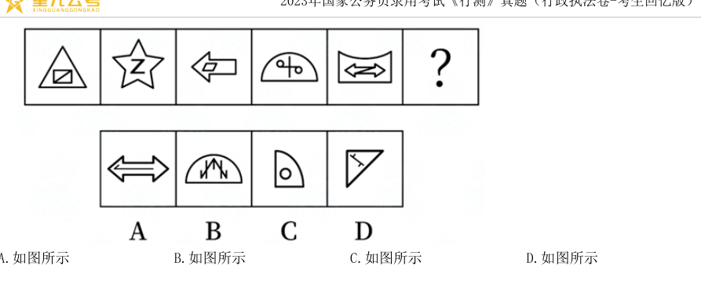

**73.** 从所给的四个选项中，选择最合适的一个填入问号处，使之呈现一定的规律性：【2023国考行政执法073/国考副省077】  `[2023·执法·73]`
- A. 如图所示
- B. 如图所示
- C. 如图所示
- D. 如图所示

**74.** 从所给的四个选项中，选择最合适的一个填入问号处，使之呈现一定的规律性：【2023国考行政执法074】 2023年国家公务员录用考试《行测》真题（行政执法卷-考生回忆版）  `[2023·执法·74]`
- A. 如图所示
- B. 如图所示
- C. 如图所示
- D. 如图所示

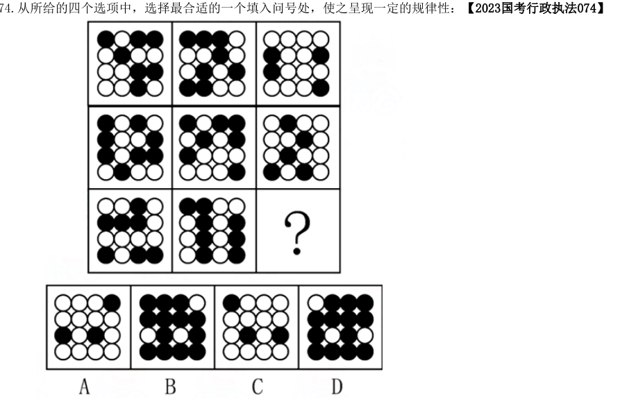

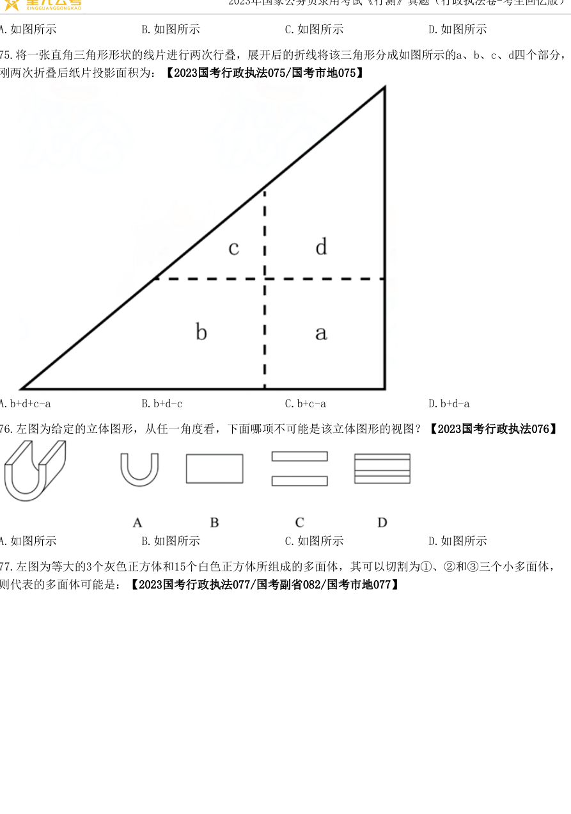

**75.** 将一张直角三角形形状的线片进行两次行叠，展开后的折线将该三角形分成如图所示的a、b、c、d四个部分，刚两次折叠后纸片投影面积为：【2023国考行政执法075/国考市地075】  `[2023·执法·75]`
- A. b+d+c-a
- B. b+d-c
- C. b+c-a
- D. b+d-a

**76.** 左图为给定的立体图形，从任一角度看，下面哪项不可能是该立体图形的视图？【2023国考行政执法076】  `[2023·执法·76]`
- A. 如图所示
- B. 如图所示
- C. 如图所示
- D. 如图所示

**77.** 左图为等大的3个灰色正方体和15个白色正方体所组成的多面体，其可以切割为①、②和③三个小多面体，则代表的多面体可能是：【2023国考行政执法077/国考副省082/国考市地077】 2023年国家公务员录用考试《行测》真题（行政执法卷-考生回忆版）  `[2023·执法·77]`
- A. 如图所示
- B. 如图所示
- C. 如图所示
- D. 如图所示

**78.** 把下面的六个图形分为两类，使每一类图形都有各自的共同特征或规律，分类正确的一项是：【2023国考行政执法078/国考市地080】  `[2023·执法·78]`
- A. ①②⑤，③④⑥
- B. ①②④，③⑤⑥
- C. ①④⑤，②③⑥
- D. ①③⑤，②④⑥

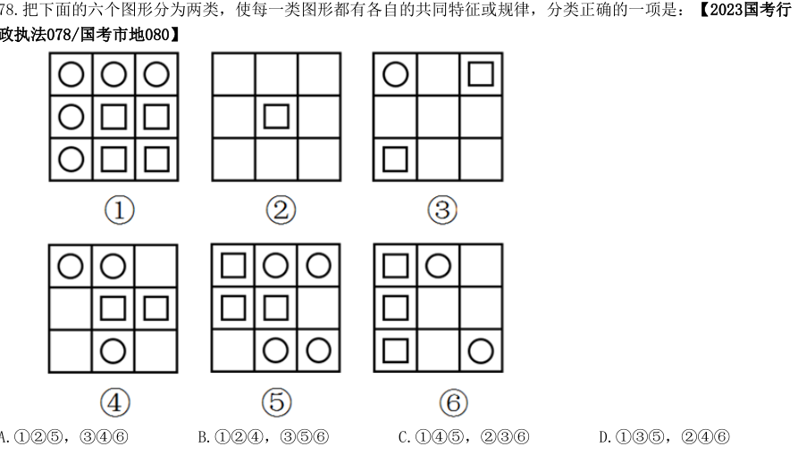

**79.** 把下面的六个图形分为两类，使每一类图形都有各自的共同特征或规律，分类正确的一项是：【2023国考行政执法079/国考市地078】  `[2023·执法·79]`
- A. ①③⑤，②④⑥
- B. ①④⑥，②③⑤
- C. ①③④，②⑤⑥
- D. ①②④，③⑤⑥

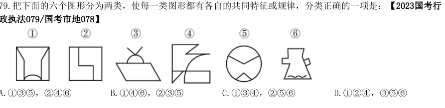

**80.** 把下面的六个图形分为两类，使每一类图形都有各自的共同特征或规律，分类正确的一项是：【2023国考行政执法080】 2023年国家公务员录用考试《行测》真题（行政执法卷-考生回忆版）  `[2023·执法·80]`
- A. ①③④，②⑤⑥
- B. ①②④，③⑤⑥
- C. ①②⑥，③④⑤
- D. ①⑤⑥，②③④

**81.** 微量鉴定是指运用物理学、化学和仪器分析等方法，通过对案件现场有关物质材料（材料特点多为体小量微、不易注意）的成分及其结构进行定性、定量分析，对检材的种类、检材和嫌疑样本的同类性和同一性进行鉴定。根据上述定义，下列涉及交通事故的鉴定属于微量鉴定的是：  `[2023·执法·81]`
- A. 对车辆驾驶人采血，分析血液中的酒精含量，判断驾驶人是否存在酒后驾车嫌疑
- B. 现场提取、检验受害人毛发、衣物纤维，认定受害人是否与嫌疑人车辆存在接触
- C. 拆解车辆特定部位，查明车辆故障原因，用以鉴定其属于人为责任还是机械故障
- D. 通过人体损伤程度检验，确定伤害损伤部位与交通事故伤害后果的关联程度

**82.** 架构创新是指组成产品的基本元件不变，但是整体结构布局改变、即将相同元件进行整体结构的重新调整，进而产生新功能的创新。根据上述定义，下列属于架构创新的是：  `[2023·执法·82]`
- A. 陶瓷底板电熨斗与传统不锈钢底板电熨斗相比，其底板的耐磨性更强，具有更高的光滑度，使用起来更顺畅
- B. 某款手机聊天软件增加了拜年红包功能，用户可以在给亲朋好友发送红包时、编辑拜年吉祥语，自定义红包图片，满足个性化需求
- C. 可拆卸手柄锅将原手柄设计成可从锅具上拆卸下来，并提供多个手柄可安装在锅具边缘的任意位置上，满足烹饪需要
- D. 某板材厂改良制作工艺，将原来的轧制工序分成两步进行，同时增加砂光工序，生产出满足市场需要的薄板

**83.** 民宿是指利用当地民居等相关闲置资源，经营用客房不超过4层、建筑面积不超过800平方米，主人参与接待，为游客提供体验当地自然，文化与生产生活方式的小型住宿设施。根据上述定义，下列属于民宿的是：  `[2023·执法·83]`
- A. 王某在市中心有一套两居室的房子，过了马路就是知名的景区公园。王某将闲置房间租给那些节假日来旅游的家庭，并提供导游服务
- B. 某家庭农场开发亲子休闲旅游业务，建设了农业科普、亲子游玩场所，为孩子和家长营造一处寓教于乐的乡村乐园
- C. 李某通过某网上平台找到心仪城市的会员“交换”旅行，即双方各自为对方提供住宿，住在对方家中深入体验当地的风土人情
- D. 张某在古镇上有一所老宅。他和某平台签订合同，将老宅租给该平台运营。该平台将老宅装修，并提供完善的酒店式服务机制

**84.** 体验式采访是指直接投入到所要报道的新闻事件中去体验生活，以获得新闻报道所需要的素材，以及对新闻事件的认识。根据上述定义，下列不属于体验式采访的是：  `[2023·执法·84]`
- A. 某报社要求年轻记者沉入生活，了解基层，以改变写官话、说套话的文风
- B. 某作家为了解包身工的悲惨遭遇，深入到工厂中，写出报告文学《包身工》
- C. 某记者为了解传销组织的真面目，打入到传销组织内部，揭示传销组织的骗局
- D. 某电视台推出专栏《体验三百六十行》，派记者体验各职业一周并进行系列报道

**85.** 伴性遗传是指控制性状的基因位于性染色体上，遗传总是与性别相关联，不同性别出现某一性状的概率不同的遗传。限性遗传是指控制性状的基因位于性染色体上，性状只在一种性别上得以表现，而在另一性别上完全不能表现的遗传。从性遗传是指控制性状的基因位于常染色体上，但由于受到性激素的作用，基因在不同性别2023年国家公务员录用考试《行测》真题（行政执法卷-考生回忆版）中表达不同的遗传。根据上述定义，下列属于限性遗传的是：  `[2023·执法·85]`
- A. 抗维生素D佝偻病是伴X染色体显性遗传病，女性发病率高，常表现为世代遗传
- B. 人类外耳道多毛症为伴Y染色体遗传病，在家族男性亲属中代代遗传
- C. 遗传性斑秃为常染色体显性遗传病，男性会出现早秃，而女性则不会出现
- D. 红绿色盲症是伴X染色体隐性遗传病，男性发病率高，表现出交叉遗传和隔代遗传

**86.** 预判设计是一种能够引导用户，缩短用户行为路径的有效设计手段。它可以根据用户的行为或用户所在的场景，让功能“主动找到”用户，并让用户与之产生自然的交互，为用户提供更好的使用体验，本质就是为用户多想一步，让用户使用起来尽量简单。根据上述定义，下列不属于预判设计的是：  `[2023·执法·86]`
- A. 某翻译软件，用户第一次点击播放，语音速度正常；再次点击，语音速度变慢
- B. 某外卖软件，当用户对店家给出差评，系统自动勾选“将评价设为匿名评价”
- C. 某购物软件，所选商品缺货时，出现“找相似”按钮，点击可看到同款、相似商品
- D. 某购物软件，根据用户输入的搜索关键词，将商品按与关键词的相关性排列

**87.** 负性偏向是指负性信息比其他信息得到优先的注意和加工，这是人类在先天遗传和后天经验基础上存在的一种普遍性认知倾向，即给予负性事物更大的权重，并在注意、记忆、情绪、决策等方面遵循“坏比好重要”的心理原则。根据上述定义，下列没有体现负性偏向的是：  `[2023·执法·87]`
- A. 被试对负面词汇的再认正确率比正面词汇高，能更精准识别某负面词汇是否在语句中
- B. “3·15”晚会报道侵犯消费者权益的违法行为，以期政府各级管理部门有效管理
- C. 新闻传播过程中，模糊信息中的一些负面细节更容易被人们关注并作进一步负面解读
- D. 应聘者的优缺点与职位具有同等相关性，但招聘者往往更关注应聘者的缺点

**88.** 单元素导语是指在撰写新闻导语（即消息的开头）时，突出表现一个新闻事实的导语。单元素导语按新闻五要素可分为：①何人导语，突出报道显要或影响大的新闻人物；②何事导语，突出报道新闻事实本身；③何时导语，突出报道读者关心的事情什么时候会发生或进行；④何地导语，突出报道一些重要或有特殊意义的地方发生重大变化的消息；⑤为什么导语，突出报道一个事件的起因。根据上述定义，下列导语与其分类对应正确的是：  `[2023·执法·88]`
- A. 亲爱的读者，你知道为什么夏天夜空看到的星星比冬天夜空里看到的多？——④
- B. 1964年10月16日，我国第一颗原子弹爆炸成功——②
- C. 杨先生带着2岁的女儿到市医院看病，没想到看一个“咳嗽”就要花1000多元——①
- D. 谁是高考状元？这个一年一度的热门话题，今年却在xx省消失了——③

**89.** 子弹时间即计算机辅助的摄影技术模拟变速特效，是一种使用在电影、电视节目或电脑游戏等领域的摄影技术模拟变速特效，例如强化的慢镜头、时间静止等效果。根据上述定义，下列描述符合子弹时间的是：  `[2023·执法·89]`
- A. 通过电视转播，观众们看到滑雪运动员的身体缓慢地在空中划出优美的曲线，翻转瞬间的每个动作都无比清晰
- B. 电视剧中，男主角因车祸去世，女主角目睹了这个过程，此后很多年，她的眼前无数次闪现出车祸发生的过程
- C. 江阿姨的丈夫去世之后，她每天的大部分时间都用来反复看他们以前拍摄的视频，时间在她身上似乎静止了
- D. 科幻小说中，小明因考试结束时还没有答完卷子，祈祷时间暂停，然后他发现时间真的静止了，只有他可以答卷

**90.** 联合式构词法是由两个意义相同、相反或相对的词根联合起来构成新词的方法，在词内两个词根是平等的，2023年国家公务员录用考试《行测》真题（行政执法卷-考生回忆版）没有主从、正副之分。根据上述定义，下列使用了联合式构词法的是：  `[2023·执法·90]`
- A. “叮当”，因摹拟动作的声音而构成的词
- B. “开关”，由“开”和“关”两个单字组合而构成的词
- C. “椅子”，在单字“椅”后面附加“子”而构成的词
- D. “蹉跎”，由韵母相同的两个单字组合构成意义与单字无关的词

**91.** 铜镜∶化妆镜  `[2023·执法·91]`
- A. 木碗∶汤碗
- B. 瓷瓶：古瓶
- C. 门帘：纱帘
- D. 金簪：发簪

**92.** 小计∶总计  `[2023·执法·92]`
- A. 被乘数∶总数
- B. 分目录：总目
- C. 平均值∶总值
- D. 单科分：总分

**93.** 脱脂棉∶原棉  `[2023·执法·93]`
- A. 黑陶∶黏土
- B. 白酒∶烧酒
- C. 摄像头∶镜头
- D. 视力∶视力表

**94.** 海棠红：南瓜橙  `[2023·执法·94]`
- A. 苏丹红：景泰蓝
- B. 孔雀蓝：柠檬黄
- C. 橄榄绿：梅子青
- D. 日落黄∶鱼肚白

**95.** 匿名投票：实名投票：现场投票  `[2023·执法·95]`
- A. 战国文字：象形文字∶古代汉字
- B. 金融危机：粮食危机：生态危机
- C. 油料作物：糖料作物∶经济作物
- D. 早间会议∶午间会议：工作会议

**96.** 春季过敏∶花粉∶喷嚏  `[2023·执法·96]`
- A. 肺炎∶咳嗽∶支原体
- B. 失眠∶恐惧∶噩梦
- C. 秋季腹泻∶饮食∶脱水
- D. 乙型脑炎∶病毒∶发热

**97.** 资产评估∶审核通过∶股票发售  `[2023·执法·97]`
- A. 预订新车∶加装内饰∶购买车险
- B. 选购家电∶上门安装∶维修保养
- C. 修剪草坪∶设备检修∶园林养护
- D. 收看节目∶视频连线∶观众互动

**98.** 标清∶高清∶超清  `[2023·执法·98]`
- A. 迁怒∶愤怒∶暴怒
- B. 幽静∶寂静∶安静
- C. 厅级∶市级∶省级
- D. 亚音速∶音速∶超音速

**99.** 深空探测  对于（  ）相当于（  ）对于  公益组织  `[2023·执法·99]`
- A. 宇宙空间  公益事业
- B. 无人采样  慈善捐款
- C. 火星探测  社会组织
- D. 遥感技术  红十字会

**100.** 刑事警察  对于（  ）相当于（  ）对于  对外交涉  `[2023·执法·100]`
- A. 交通警察  外交领事
- B. 公安机关  维护主权
- C. 打击犯罪  外交人员
- D. 刑事案件  驻外武官

**101.** 深度学习是一系列复杂的算法，使计算机能够识别数据中的模式并作出预测。研究人员利用深度学习技术训练AI系统自动读取视网膜扫描数据，并识别那些在接下来的一年中患心脏病风险较高的人。研究人员认为该项技术有可能彻底改变传统的心脏病筛查方式。上述论证的成立须补充以下哪项作为前提？  `[2023·执法·101]`
- A. 视网膜扫描相对便宜，并且在许多配镜服务中被使用
- B. AI系统是解开自然界中存在的复杂模式的绝佳工具
- C. 心脏病筛查需要进行复杂且昂贵的超声心动图或心脏磁共振成像检查
- D. 视网膜扫描数据反映的微小血管变化是预测心脏疾病较为灵敏的指标

**102.** 人们感受气味通过嗅觉受体实现。研究发现：随着人类的演化，编码人类嗅觉受体的基因不断突变，许多2023年国家公务员录用考试《行测》真题（行政执法卷-考生回忆版）在过去能强烈感觉气味的嗅觉受体已经突变为对气味不敏感的受体。与此同时，人类嗅觉受体的总体数目也随时间推移逐渐变少。由此可以认为，人类的嗅觉经历着不断削弱、逐渐退化的过程。以下哪项如果为真，最能支持上述结论？  `[2023·执法·102]`
- A. 随着人类进化，嗅觉中枢在大脑皮层中所占面积逐渐减少
- B. 相对于视觉而言，嗅觉在人类感觉系统中的重要性较低
- C. 人类有大约1000个嗅觉受体相关基因，其中只有390个可以编码嗅觉受体
- D. 不同人群之间嗅觉存在很大差异，老年人的嗅觉敏感性明显低于年轻人

**103.** 调查显示，84.8%的家长倾向于给孩子购买标有“儿童”字样的食品。几乎每一款“儿童食品”都宣称“无添加，适合孩子健康成长”。家长热衷于购买有“儿童”标签的食品是因为他们觉得，标有“儿童”字样的食品更加营养健康，更适合儿童。以下哪项如果为真，最能质疑家长的观点？  `[2023·执法·103]`
- A. 我国目前并没有设置专门的“儿童食品”分类，“儿童食品”缺乏专门的法律法规与食品安全国家标准
- B. 孩子在不同年龄阶段，对各种营养物质的需求量会发生变化，而几乎所有“儿童食品”都没有明确的年龄分段和食用提示
- C. 所谓的“儿童食品”，成分通常与普通食品没什么区别，甚至可能因为添加过量的调味物质而有害儿童健康
- D. 儿童食品的外包装设计和食品形状设计都更符合儿童的审美，会导致儿童因为喜欢外形而过量进食

**104.** 电商直播可以为农产品的营销提供一条有效的渠道，在农产品供应链的运作上要明显优于传统的“农户→批发商→分销商→消费者”模式。但目前在很多地方，电商直播营销模式并没有有效解决农产品卖难买难的问题。有从业者认为只要完善农产品物流配送体系，提高直播人员素质，就能有效解决这一问题。以下哪项如果为真，不能支持上述从业者的观点？  `[2023·执法·104]`
- A. 直播内容重复单调，易引起消费者审美疲劳，不利于树立起良好的产品形象，影响了农产品直播的效果
- B. 部分地区没有对农产品的生产、包装、运输以及销售等环节制定统一的标准，对农产品的质检投入不足
- C. 在电商直播模式下，对物流的需求会增加，现有的冷链物流水平无法满足日益增长的农产品消费需求
- D. 许多地区的农户居住比较分散，农产品出村进城“最先一公里”的物流运输难题，始终未能完全得到解决

**105.** R行星是位于太阳系的一颗小行星，质量不大，平均直径不足500米。在对R行星进行长达一年的观测后，人们发现其表面长期漂浮着砂粒，且砂粒在漂浮一段时间后，还会重新落在行星表面。由于R行星表面没有稳定的大气层，因此人们认为砂粒漂浮的现象主要来自静电，原因是太阳风进入行星表面产生电场时，砂粒会因静电力的作用离开行星表面漂浮游动起来，当没有太阳风时，砂粒又会回落下来。以下哪项如果为真，没有质疑上述观点？  `[2023·执法·105]`
- A. R行星表面存在一氧化碳、干冰等挥发性物质，其升华会带动砂粒的释放与漂浮
- B. R行星质量小，静电作用只能扬起毫米级的砂粒，但目前其表面漂浮的砂粒尺寸都很大
- C. R行星自转速度快，星球上的物体受到离心作用强，其表面尘埃与石块会脱离引力束缚，剥落散逸
- D. R行星与彗星组成类似，彗星靠近太阳时，受太阳风产生的静电影响，其表面砂粒将会漂浮6天休假期间，单位需要每天安排一人值班。财务、研发、人事、后勤、法务和销售6个部门各推荐了2人，值班人员从这12人中选择，每人至多值班一天。安排要求：（1）第二天和第四天不安排法务部门的人值班；（2）若安排后勤部门的人值班，则只能安排在法务部门的人值班的前一天；（3）若安排研发部门的人值班，则只能安排在后勤部门的人值班的前一天。

**106.** 关于6天中的人选，以下哪项安排符合上述条件？  `[2023·执法·106]`
- A. 销售、财务、法务、人事、财务、销售
- B. 财务、人事、后勤、法务、财务、人事
- C. 人事、财务、法务、研发、法务、后勤
- D. 法务、销售、人事、后勤、财务、销售

**107.** 后勤部门的人可以安排在哪几天值班？ 2023年国家公务员录用考试《行测》真题（行政执法卷-考生回忆版）  `[2023·执法·107]`
- A. 只有第二天、第六天
- B. 只有第一天、第三天
- C. 只有第二天、第四天、第五天
- D. 只有第一天、第三天、第五天

**108.** 如果安排后勤部门的两人值班，则以下哪项一定是错误的？  `[2023·执法·108]`
- A. 第一天安排研发部门的人值班
- B. 第三天安排财务部门的人值班
- C. 第六天安排人事部门的人值班
- D. 第五天安排法务部门的人值班

**109.** 如果在第三天、第五天分别安排两个财务部门的人值班，则第一天、第六天可安排的值班人员可能分别来自：  `[2023·执法·109]`
- A. 财务部门和销售部门
- B. 研发部门和人事部门
- C. 法务部门和销售部门
- D. 后勤部门和法务部门

**110.** 如果没有安排财务和后勤部门的人值班，则以下哪项一定是正确的？  `[2023·执法·110]`
- A. 第四天安排销售部门的人值班
- B. 第五天安排法务部门的人值班
- C. 第三天安排法务部门或者人事部门的人值班
- D. 第二天安排销售部门或者人事部门的人值班

## 2024年 · 副省级

**76.** 从所给的四个选项中，选择最合适的一项填入问号处，使之呈现一定的规律性：【2024国考行政执法072/国考副省076/国考地市072】  `[2024·副省·76]`
- A. 如图所示
- B. 如图所示
- C. 如图所示
- D. 如图所示

**77.** 从所给的四个选项中，选择最合适的一项填入问号处，使之呈现一定的规律性：【2024国考副省077/国考地市071】  `[2024·副省·77]`
- A. 如图所示
- B. 如图所示
- C. 如图所示
- D. 如图所示

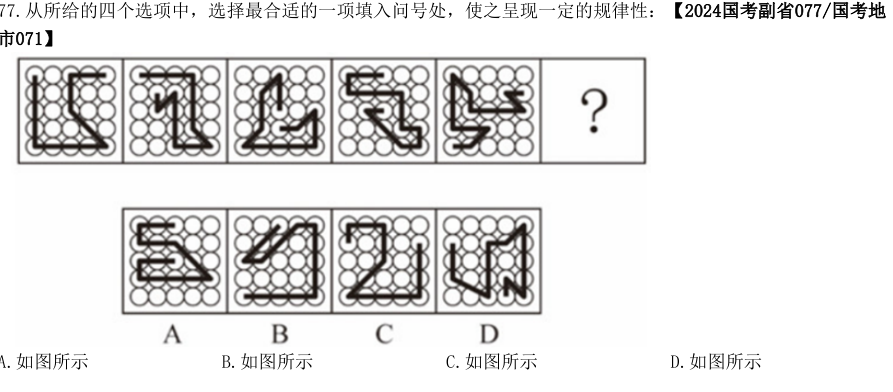

**78.** 从所给的四个选项中，选择最合适的一项填入问号处，使之呈现一定的规律性：【2024国考副省级078】  `[2024·副省·78]`
- A. 如图所示
- B. 如图所示
- C. 如图所示
- D. 如图所示

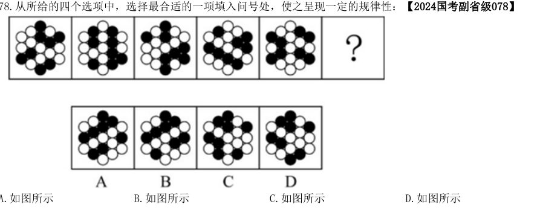

**79.** 从所给的四个选项中，选择最合适的一项填入问号处，使之呈现一定的规律性：【2024国考行政执法074/国考副省079】 2024年国家公务员考试《行测》真题（副省卷-考生回忆版）  `[2024·副省·79]`
- A. 如图所示
- B. 如图所示
- C. 如图所示
- D. 如图所示

**80.** 把下面的六个图形分为两类，使每一类图形都有各自的共同特征或规律，分类正确的一项是：【2024国考行政执法080/国考地市080/国考副省080】  `[2024·副省·80]`
- A. ①②⑥，③④⑤
- B. ①④⑥，②③⑤
- C. ①③⑤，②④⑥
- D. ①②③，④⑤⑥

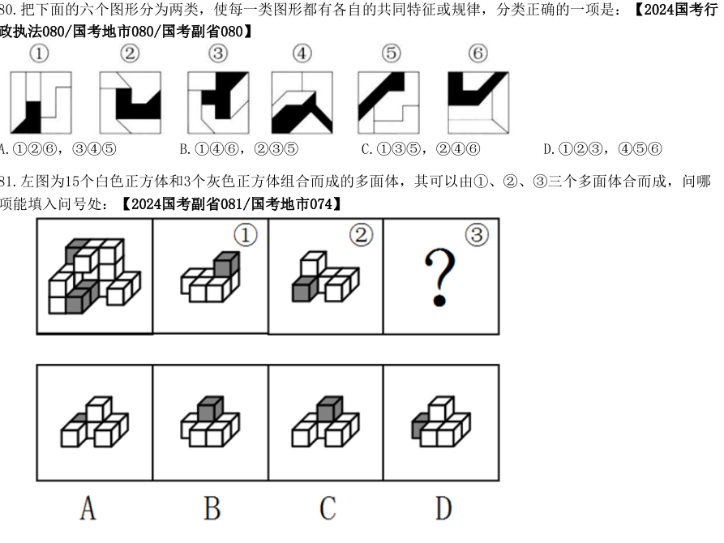

**81.** 左图为15个白色正方体和3个灰色正方体组合而成的多面体，其可以由①、②、③三个多面体合而成，问哪项能填入问号处：【2024国考副省081/国考地市074】 2024年国家公务员考试《行测》真题（副省卷-考生回忆版）  `[2024·副省·81]`
- A. 如图所示
- B. 如图所示
- C. 如图所示
- D. 如图所示

**82.** 左图为13个白色正方体和5个灰色正方体组合而成的多面体，现用经A、B、C三个顶点的平面对该多面体进行切割，正确的截面是：【2024国考行政执法077/国考副省082】  `[2024·副省·82]`
- A. 如图所示
- B. 如图所示
- C. 如图所示
- D. 如图所示

**83.** 把下面的六个图形分为两类，使每一类图形都有各自的共同特征或规律，分类正确的一项是：【2024国考副省083/国考地市078】  `[2024·副省·83]`
- A. ①②⑥，③④⑤
- B. ①③④，②⑤⑥
- C. ①③⑥，②④⑤
- D. ①③⑤，②④⑥

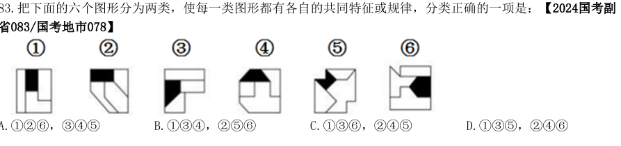

**84.** 把下面的六个图形分为两类，使每一类图形都有各自的共同特征或规律，分类正确的一项是：【2024国考行政执法078/国考副省084/国考地市079】  `[2024·副省·84]`
- A. ①④⑤，②③⑥
- B. ①③④，②⑤⑥
- C. ①⑤⑥，②③④
- D. ①②⑥，③④⑤

**85.** 左图为8个白色正方体和4个灰色正方体粘接而成的长方体，问以下哪一个不可能是其外表面展开图？【2024国考行政执法076/国考副省085/国考地市076】  `[2024·副省·85]`
- A. 如图所示
- B. 如图所示
- C. 如图所示
- D. 如图所示

**86.** 慢病也称为慢性非传染性疾病，是指长期的、不能自愈的、也几乎不能被治愈的疾病。慢病自我管理是指慢病患者主动监测自己的病情，以积极态度及行动，改善健康和情绪，通过对疾病的认识，学习与疾病长期共存。根据上述定义，下列属于慢病自我管理的是：  `[2024·副省·86]`
- A. 老张在患了流感后多方查阅相关信息，每天检测血氧、心率、血压等指标，不做剧烈运动，避免着凉
- B. 老王因慢性肾功能衰竭需定期在医院进行透析治疗，医院为其建立了慢病管理档案，追踪监测肾功能等各项指标
- C. 老赵的父母都因胃癌去世，老赵深知该疾病的严重后果，每年全面体检一次，定期进行胃肠镜检查，不熬夜不喝酒，规律作息2024年国家公务员考试《行测》真题（副省卷-考生回忆版）
- D. 患Ⅱ型糖尿病的老李，平日生活格外谨慎，含糖量高的食物一概不碰，每天按时服药，定期监测血糖水平

**87.** 多级养殖是指根据物种代谢产物或残余有机质的利用价值及其在食物链中所处的级次，依次放养相应生物，多级次利用营养物质的一种养殖方式。根据上述定义，下列属于多级养殖的是：  `[2024·副省·87]`
- A. 将养殖过江蓠的海水用于放养贝类，以利用其中繁殖的浮游生物；再将养殖过贝类的水用于放养对虾；再以对虾代谢分解的产物养殖藻类
- B. 将鱼、虾、贝类与藻类放在同一水槽混养，其代谢产物会为藻类提供必要的营养要素，藻类的光合作用又产生更多的溶解氧
- C. 在一台浮筏上，于冬春季养殖海带；至夏秋季养殖海湾扇贝或石花菜，从而更好利用海况条件，满足市场需要
- D. 同一池塘中，鲢、鳙生活在上层，主食浮游生物；草鱼、鳊生活在中下层，主食草类；鲤、鲫生活在底层，主食底栖动物和有机碎屑

**88.** 动态描写法是指记叙文中对人物、景物作运动状态的描写，创造具体而栩栩如生的形象的一种描写方法。动态描写法包括两类：一类是对运动着的景物的描写，一类是对静物所作的动态描写。动态描写法的目的在于赋予客观事物以运动感、活力感、变化感，克服形象的单调性，丰富形象的多样性，达到更好地表现事物、感染读者的艺术效果。根据上述定义，下列没有体现动态描写法的是：  `[2024·副省·88]`
- A. 有的松树望穿秋水，不见你来，独自上到高处，斜着身子张望
- B. 夜阑人静，家养的大黃狗趴在院子里安静地睡了
- C. 七股大水，从水库的桥孔跃出，仿佛七幅闪光的黄锦，直铺下去
- D. 一轮杏黄色的满月，悄悄从山嘴处爬出来，把倒影投入湖水中

**89.** 电力系统的电力设备根据其在运行中所起的作用，分为电力一次设备和电力二次设备。电力一次设备指的是直接参与生产、变换、传输、分配和消耗电能的设备；电力二次设备指的是为了保护并保证电力一次设备的正常运行，对其运行状态进行测量、监视、控制和调节等的设备。根据上述定义，下列说法正确的是：  `[2024·副省·89]`
- A. 电路中用于升降交流电压的变压器，属于电力二次设备
- B. 将回路中高电压降低的电压互感器，属于电力一次设备
- C. 由柴油驱动的发电机，属于电力二次设备
- D. 记录零序电流值并用于查找故障点的故障录波装置，属于电力一次设备

**90.** 森林覆盖率是指森林面积占土地总面积的百分比。郁闭度是指森林中乔木树冠在阳光直射下地面总投影面积与此林地总面积的比，其最大值为1，表示树冠层全部连接形成完全郁闭的状态。郁闭度与森林气温日变化呈负相关，与相对湿度呈正相关。立木蓄积量是指森林中所有树木材积的总和，立木包括枯立木和活立木两类；森林蓄积量是指森林中现存各种活立木的材积总量，以立方米为计算单位。根据上述定义，下列说法正确的是：  `[2024·副省·90]`
- A. 森林覆盖率能够反映一个国家（或地区）森林资源分布的实际状况
- B. 若某森林郁闭度为0.3，其阳光直射下乔木树冠的地面总投影面积为3万公顷，则该林地总面积为10万公顷
- C. 一般来说，郁闭度大时森林白天气温降低，气温日变化增加，相对湿度增大
- D. 某区域森林蓄积量为14亿立方米，则该区域立木蓄积量一定少于14亿立方米

**91.** 附性法推理是指将同一属性分别附加在原命题的主项和谓项前面，从而形成一个新命题的推理方法，以公式表示即为：“所有S（主项）是P（谓项）→所有NS是NP”（其中“N”表示某种属性） 。运用这种推理必须遵守的规则是： ①原命题必须断定了某个类别的所有事物的某种共性； ②附加的属性概念必须保持含义的同一：③结论中的主谓项关系应与前提中的主谓项关系相同。2024年国家公务员考试《行测》真题（副省卷-考生回忆版）根据上述定义，下列符合附性法推理规则的是：  `[2024·副省·91]`
- A. 蝴蝶是昆虫，所以，色彩斑斓的蝴蝶是色彩斑斓的昆虫
- B. 教师是人，所以，老教师是老人
- C. 有些诗人是画家，所以，有些女诗人是女画家
- D. 音乐家是人，所以，无天赋的音乐家是无天赋的人

**92.** 复杂型消费行为是指消费者对价格昂贵，品牌差异大，功能复杂的商品，由于缺乏必要的商品知识，需要慎重选择，仔细对比，只求降低风险的购买行为；多变型消费行为是指如果消费者购买的商品价格低，可供选择的品牌很多时，他们并不花太多的时间选择品牌，而是经常变换品牌。根据上述定义，下列说法正确的是：  `[2024·副省·92]`
- A. 老李给儿子换了十几个钢琴老师之后，发现还是第一个钢琴老师最好，于是一次性交了一年的学费，这属于复杂型消费行为
- B. 小明去超市买某品牌饼干，心想上次买了巧克力口味，这次买绿茶口味，下次再试一下夹心的。这属于多变型消费行为
- C. 老王打算买一辆越野车，网上查阅了各种型号参数，试驾了十几款品牌之后，才做出决定。这属于复杂型消费行为
- D. 小丽逛街的时候本来只想买一条裤子，后来发现需要搭配一件合适的上衣和配套的手提包，所以买了全套。这属于多变型消费行为

**93.** 民俗是指一个民族或一个社会群体在长期的生产实践和社会生活中逐渐形成并世代相传、较为稳定的文化事项，可以简单概括为民间流行的风尚、习俗，具有传承性、广泛性、稳定性。根据上述定义，下列活动属于民俗的是：  `[2024·副省·93]`
- A. 清明节当天，黄帝陵举行隆重的公祭活动，按照既定祀典礼仪，缅怀始祖精神，传承中华文明
- B. 王老伯家有一个传承三代的习惯，每到重大节日，全家都要聚在一起，交流感情，品尝美食，共享天伦
- C. 农历九月九日为重阳节，自古以来，河洛地区的人们每逢这天都会结伴登高山、逛庙会、赏菊花
- D. 近年来，一些大都市的公园每周都会举办“相亲角”活动，中老年父母聚在一起替儿女相亲

**94.** 伪装型反侦查行为是指犯罪行为人通过采取相应措施来隐蔽自身、迷惑侦查机关侦查活动的行为，其主要表现为三类：①栽赃嫁祸，通过将赃物、违禁品暗置别人处等方式来误导侦查方向；②主动报案，通过实施“贼喊捉贼”式的行为来蒙蔽侦查机关；③制造伪证，通过假人证、不知情的人或一些特定物品，制造出虚假的不在场证明或者自己与案件无关的假象，以达到混淆视听、误导侦查视线的目的。根据上述定义，下列没有体现上述几类伪装型反侦查行为的是：  `[2024·副省·94]`
- A. 甲将乙杀害后，故意在网络上散布丙与乙不和的谣言，转移警方注意力
- B. 甲在作案后，拿走可以证明受害人乙身份的物品，隐藏其身份
- C. 甲酒后与乙争吵并痛下杀手，事后甲主动报警，声称自己是目击证人
- D. 甲作案后接受警方讯问时，拿出案发当日的火车票谎称自己当时正在火车上

**95.** 某部落的计数法只有4个符号：■、□、◆、◇每个数字至多有两位，数位从高到低的顺序为从右到左。其中右边数位从大到小依次为■、□、◆、◇；而左边数位从大到小依次为◇、◆、□、■。根据上述定义，下列哪项中的数字最大？  `[2024·副省·95]`
- A. ◆◆
- B. ◆◇
- C. ■◆
- D. ■◇

**96.** 卫冕∶夺冠  `[2024·副省·96]`
- A. 庄园∶田园
- B. 追讨∶诉讼
- C. 续约∶签约
- D. 姓名∶笔名

**97.** 花生壳∶核桃仁  `[2024·副省·97]`
- A. 刺梨汁∶桃花扇
- B. 丝瓜络∶石榴籽
- C. 杏仁露∶葡萄皮
- D. 葛根茶∶芡实粉2024年国家公务员考试《行测》真题（副省卷-考生回忆版）

**98.** 识别敌舰∶发射鱼雷∶击毁目标  `[2024·副省·98]`
- A. 线上挂号∶远程问诊∶开具处方
- B. 环境评估∶铁路铺设∶桥梁建造
- C. 立案审查∶提起公诉∶证据确凿
- D. 交通事故∶保险赔付∶救治伤员

**99.** 花香四溢∶分子运动  `[2024·副省·99]`
- A. 波光粼粼∶光的反射
- B. 聚沙成塔∶质量互变
- C. 水落石出∶水的浮力
- D. 炉火纯青∶金属炼制

**100.** 诛禁不当∶反受其央  `[2024·副省·100]`
- A. 为者常成∶行者常至
- B. 君子检身∶常若有过
- C. 其身不正∶虽令不从
- D. 麻雀虽小∶五脏俱全

**101.** 酒器∶尊∶爵  `[2024·副省·101]`
- A. 门楣∶门框∶门槛
- B. 服装∶礼服∶常服
- C. 人居∶巢居∶穴居
- D. 木柱∶石柱∶砖柱

**102.** 蚜虫∶七星瓢虫∶小麦  `[2024·副省·102]`
- A. 蛇∶鸟：谷子
- B. 稗草∶螳螂∶水稻
- C. 蚊子∶青蛙∶高梁
- D. 老鼠∶黄鼬∶玉米

**103.** 感想∶主观性∶体会  `[2024·副省·103]`
- A. 典范∶示范性∶表率
- B. 发明∶创造性∶方法
- C. 泥土∶可塑性∶材料
- D. 规律∶普遍性∶定理

**104.** 牛皮纸 对于 （   ） 相当于 （   ）对于 背筐  `[2024·副省·104]`
- A. 包装   运输
- B. 木纤维   拎筐
- C. 纸袋   柳条
- D. 羊皮纸   竹筐

**105.** 领头雁 对于 （   ） 相当于 （   ） 对于 先驱  `[2024·副省·105]`
- A. 领导者  拓荒牛
- B. 鸟类    革命
- C. 迁徙    先锋
- D. 出头鸟  先行者

**106.** 人民是创作的源头活水，只有扎根人民，创作才能取得取之不尽、用之不竭的源泉。文化文艺工作者要走进实践深处，观照人民生活，表达人民心声，用心用情用功抒写人民、描绘人民、歌唱人民。哲学社会科学工作者要多到实地调查研究，了解百姓生活状况，把握群众思想脉搏，着眼群众需要解疑释惑、阐明道理，把学问写进群众心坎儿里。由此可以推出：  `[2024·副省·106]`
- A. 文化文艺工作者只有走进实践深处，才能观照人民生活
- B. 如果不扎根人民，创作就不能获得取之不尽、用之不竭的源泉
- C. 哲学社会科学工作者只有到实地调查研究，才能了解百姓生活状况，把握群众思想脉搏
- D. 如果哲学社会科学工作者没有着眼群众需要解疑释惑、阐明道理，就说明他们没有进行实地调查研究

**107.** 冰雪旅游是利用冰雪气候资源体验冰雪文化的旅游活动，包括冰雪观光演艺、运动竞技等内容。H地区冰雪旅游开展了五年，调查显示：在近万名受访者中，有90%的人曾以不同形式体验过冰雪旅游，平均每4年有65%的人体验过1-2次冰雪旅游，有25%的人体验过3-4次，且这一比例逐年升高。这说明H地区冰雪旅游的需求较高，常态化多次消费正成为H地区越来越多人的选择。以下哪项如果为真，最能削弱上述结论：  `[2024·副省·107]`
- A. 参与调查的受访者几乎都是了解或喜爱冰雪旅游的年轻人
- B. 近五年，H地区冰雪旅游产业的年均投资额接近，没有增加
- C. H地区位于北半球北部，冬季较长，许多游客会来此体验冰雪旅游
- D. 为扩大宣传，H地区许多冰雪项目会推出优惠组合套餐，吸引人们多次消费

**108.** 今年1-4月，张、王、李、杨4人到长三角城市上海、苏州、杭州和南京调研，每个城市每人调研1个月，每个月中4人调研的城市均不同。已知：（1）王3月在苏州调研；（2）李1月南京调研；2024年国家公务员考试《行测》真题（副省卷-考生回忆版）（3）杨2月在杭州调研；（4）张1月、3月分别在苏州、上海调研。根据以上信息，以下哪项是不可能的：  `[2024·副省·108]`
- A. 杨3月在南京调研
- B. 张4月在杭州调研
- C. 王4月在上海调研
- D. 李2月在苏州调研

**109.** 研究中，实验组小鼠每天晚上接受两小时的蓝光照射，对照组小鼠白天接受两个小时的蓝光照射。三周之后，所有小鼠进行“强迫游泳”和“糖水偏好”测试。这两项测试常用来检测小鼠是否出现了类似抑郁的症状。结果发现，相比于白天接受光照的小鼠，夜间接受光照的小鼠明显表现出类似抑郁的症状。研究者认为，长期在夜间暴露于蓝光下，人们出现抑郁情绪的风险会提高。以下除哪项外，均能削弱研究者的观点：  `[2024·副省·109]`
- A. 小鼠与人的生活习性完全不同，小鼠昼伏夜出，而人类基本是白天活动，晚上休息
- B. 光对于小鼠是厌恶型刺激，小鼠回避光以降低被发现和捕食的风险，而人通常在光明的环境感觉更加安全
- C. 行为测试是否能够测试主观情绪体验，类似抑郁的症状是否等同于出现抑郁的情绪体验，尚存在争议
- D. 相比白天，夜间的光照更容易通过视网膜神经节细胞激活伏隔核，该脑区与负性情绪的产生有关

**110.** 墨西哥丽脂鲤是一类洞穴鱼，生活在寒冷漆黑的洞穴中，它们的身体不产生色素，因此呈现白化状态。与其他鱼类相比，墨西哥丽脂鲤的某一基因发生突变，使其难以合成酪氨酸，因此抑制了黑色素的形成。研究人员认为这一基因改变并不是生物进化中的偶然事件，而是鱼类为了生存所做出的适应性策略。以下除哪项外，均能支持研究人员的观点：  `[2024·副省·110]`
- A. 酪氨酸是合成多巴胺等激素的前体，许多动物在应对生存压力时都会分泌多巴胺类物质
- B. 与墨西哥丽脂鲤类似，一些生存在阴暗寒冷环境中的海底生物也会出现身体白化现象
- C. 这一基因改变促使墨西哥丽脂鲤血液中的红细胞体积更大，血红蛋白容量更高，更能应对缺氧环境
- D. 形成黑色素需要耗费能量，而墨西哥丽脂鲤长期处在能量匮乏的环境中，减少酪氨酸的合成有助于自身能量的储备

**111.** 蕨类植物是一类无性繁殖的植物，通过释放孢子进行繁殖，不会开花结果。人们发现，与开花植物相比，蕨类植物的基因组极为庞大，一种普通树蕨就拥有超过60亿个DNA碱基对。此外，与开花植物相比，蕨类植物在地球上出现的时间更为久远，因此人们认为：蕨类植物的这一特征有助于它们长期应对地球环境的变化。以下哪项如果为真，最能支持上述观点：  `[2024·副省·111]`
- A. 蕨类植物寿命较长，演变得更慢，这可能是它们保留大量遗传物质的原因
- B. 不同生境类型中，蕨类植物的基因组大小差异显著，基因组较大的更多是附生蕨类植物
- C. 对于无性繁殖的植物，庞大的基因组可增加有益突变的概率，以适应环境
- D. 与蕨类植物相比，开花植物更擅长去除多余的基因，在少量复制后缩减染色体大小

**112.** 研究团队对欧洲各地发现的古代遗骸进行DNA分析，这些遗骸的年代可追溯到12000年前欧洲出现农业之前和之后的一段时期。数据显示，从狩猎——采集生活方式转变为种植农作物方式，人们的平均身高降低了约3.8厘米。因此，研究团队认为：农业的兴起是欧洲人在那一历史时期身高改变的重要因素。以下哪项如果为真，最能支持上述观点：  `[2024·副省·112]`
- A. 早期农业社会的古代人类遗骸中存在海绵状及多孔性骨组织区域
- B. 早期狩猎——采集社会并未留下能作出规模性统计的遗址，古代人的样本量十分有限
- C. 欧洲工业革命后，劳动条件改善及营养的增强使欧洲人在近百年时间里平均身高迅速增加
- D. 相比种植农作物的生活方式，狩猎——采集生活方式下人类肉食比例较高，虽然食物总体相对缺乏，但仍能达到较高的平均身高

**113.** 多重宇宙理论通常也称为平行宇宙理论，该理论认为有无数个宇宙与我们所在的宇宙并存，虽然我们无法意识到这一点。但也可能与我们的宇宙极其相似，在更广的意义上，要证明多重宇宙存在远比单纯想象它困难得多。甚至从一开始，有一部分科学家就认为这个理论称不上是“真正意义上的科学”。因为没有人能证明多2024年国家公务员考试《行测》真题（副省卷-考生回忆版）重宇宙理论是错误的——即它无法被证伪。以下哪项可能是上述科学家论证的前提：  `[2024·副省·113]`
- A. 平行宇宙理论至今未获证实，只是单纯的想象
- B. 只有能被证伪的理论，才能称得上是“真正意义上的科学”
- C. 平行宇宙理论即使变成现实，对于人类的文明进步也未必是坏事
- D. 如果平行宇宙的数量足够多，那可能意味着在我们认为的虚拟世界中发生的事情也会真实地发生在平行宇宙中

**114.** 软件通常存在漏洞，攻击者为接近并操控目标主机，往往会主动寻找漏洞，攻击者会花费大量时间区分时间中“真正危险的漏洞”和“良性漏洞”，并在找到前者后实施攻击。因此有观点认为：如果添加大量良性漏洞欺骗攻击者，使其耗尽资源去寻找和测试那些毫无攻击用途的漏洞，将会减少对软件“真正危险的漏洞”的攻击，从而保证软件不被攻击者恶意控制。以下哪项如果为真，最能削弱上述观点？  `[2024·副省·114]`
- A. 与软件中“真正危险的漏洞”相比，良性漏洞被攻击后只会导致程序崩溃
- B. 添加漏洞意味着要更改代码，有时候代码运行不良可能会影响软件的功能
- C. 许多军用飞机，舰艇都配有假目标系统，与此类似，良性漏洞也将起到干扰作用
- D. 大量添加良性漏洞会让其呈现很多人为特征，攻击者可利用其识别并忽略良性漏洞

**115.** 甲、乙、丙、丁4人参加预选赛。对于预选赛结果，几位教练预测如下：（1）如果甲、乙均未通过，则丙通过；（2）如果乙、丙至少有1人通过，则丁也通过；（3）如果甲、乙至少有1人通过，则丙也通过，但是丁不通过。根据几位教练的预测，可以推出：  `[2024·副省·115]`
- A. 丙和丁通过
- B. 甲和丁通过
- C. 甲和乙通过
- D. 乙和丙通过

## 2024年 · 地市级

**71.** 从所给的四个选项中，选择最合适的一项填入问号处，使之呈现一定的规律性：【2024国考副省077/国考地市071】 2024年国家公务员录用考试《行测》真题（市地卷-考生回忆版）  `[2024·地市·71]`
- A. 如图所示
- B. 如图所示
- C. 如图所示
- D. 如图所示

**72.** 从所给的四个选项中，选择最合适的一项填入问号处，使之呈现一定的规律性：【2024国考行政执法072/国考副省076/国考地市072】  `[2024·地市·72]`
- A. 如图所示
- B. 如图所示
- C. 如图所示
- D. 如图所示

**73.** 从所给的四个选项中，选择最合适的一项填入问号处，使之呈现一定的规律性：【2024国考地市级073】 2024年国家公务员录用考试《行测》真题（市地卷-考生回忆版）  `[2024·地市·73]`
- A. 如图所示
- B. 如图所示
- C. 如图所示
- D. 如图所示

**74.** 左图为15个白色正方体和3个灰色正方体组合而成的多面体，其可以由①、②、③三个多面体合而成，问哪项能填入问号处：【2024国考副省081/国考地市074】  `[2024·地市·74]`
- A. 如图所示
- B. 如图所示
- C. 如图所示
- D. 如图所示

**75.** 从所给的四个选项中，选择最合适的一项填入问号处，使之呈现一定的规律性：【2024国考地市级075】 2024年国家公务员录用考试《行测》真题（市地卷-考生回忆版）  `[2024·地市·75]`
- A. 如图所示
- B. 如图所示
- C. 如图所示
- D. 如图所示

**76.** 左图为8个白色正方体和4个灰色正方体粘接而成的长方体，问以下哪一个不可能是其外表面展开图？【2024国考行政执法076/国考副省085/国考地市076】  `[2024·地市·76]`
- A. 如图所示
- B. 如图所示
- C. 如图所示
- D. 如图所示

**77.** 左图为13个白色正方体和5个灰色正方体组合而成的多面体，现用经A、B、C三个顶点的平面对该多面体进行切割，正确的截面是：【2024国考地市级077】  `[2024·地市·77]`
- A. 如图所示
- B. 如图所示
- C. 如图所示
- D. 如图所示

**78.** 把下面的六个图形分为两类，使每一类图形都有各自的共同特征或规律，分类正确的一项是：【2024国考副省083/国考地市078】  `[2024·地市·78]`
- A. ①②⑥，③④⑤
- B. ①③④，②⑤⑥
- C. ①③⑥，②④⑤
- D. ①③⑤，②④⑥

**79.** 把下面的六个图形分为两类，使每一类图形都有各自的共同特征或规律，分类正确的一项是：【2024国考行政执法078/国考副省084/国考地市079】 2024年国家公务员录用考试《行测》真题（市地卷-考生回忆版）  `[2024·地市·79]`
- A. ①④⑤，②③⑥
- B. ①③④，②⑤⑥
- C. ①⑤⑥，②③④
- D. ①②⑥，③④⑤

**80.** 把下面的六个图形分为两类，使每一类图形都有各自的共同特征或规律，分类正确的一项是：【2024国考行政执法080/国考地市080/国考副省080】  `[2024·地市·80]`
- A. ①②⑥，③④⑤
- B. ①④⑥，②③⑤
- C. ①③⑤，②④⑥
- D. ①②③，④⑤⑥

**81.** 多级养殖是指根据物种代谢产物或残余有机质的利用价值及其在食物链中所处的级次，依次放养相应生物，多级次利用营养物质的一种养殖方式。根据上述定义，下列属于多级养殖的是：  `[2024·地市·81]`
- A. 将养殖过江蓠的海水用于放养贝类，以利用其中繁殖的浮游生物；再将养殖过贝类的水用于放养对虾；再以对虾代谢分解的产物养殖藻类
- B. 将鱼、虾、贝类与藻类放在同一水槽混养，其代谢产物会为藻类提供必要的营养要素，藻类的光合作用又产生更多的溶解氧
- C. 在一台浮筏上，于冬春季养殖海带；至夏秋季养殖海湾扇贝或石花菜，从而更好利用海况条件，满足市场需要
- D. 同一池塘中，鲢、鳙生活在上层，主食浮游生物；草鱼、鳊生活在中下层，主食草类；鲤、鲫生活在底层，主食底栖动物和有机碎屑

**82.** 复杂型消费行为是指消费者对价格昂贵，品牌差异大，功能复杂的商品，由于缺乏必要的商品知识，需要慎重选择，仔细对比，只求降低风险的购买行为；多变型消费行为是指如果消费者购买的商品价格低，可供选择的品牌很多时，他们并不花太多的时间选择品牌，而是经常变换品牌。根据上述定义，下列说法正确的是：  `[2024·地市·82]`
- A. 老李给儿子换了十几个钢琴老师之后，发现还是第一个钢琴老师最好，于是一次性交了一年的学费，这属于复杂型消费行为
- B. 小明去超市买某品牌饼干，心想上次买了巧克力口味，这次买绿茶口味，下次再试一下夹心的。这属于多变型消费行为
- C. 老王打算买一辆越野车，网上查阅了各种型号参数，试驾了十几款品牌之后，才做出决定。这属于复杂型消费行为
- D. 小丽逛街的时候本来只想买一条裤子，后来发现需要搭配一件合适的上衣和配套的手提包，所以买了全套。这属于多变型消费行为

**83.** 慢病也称为慢性非传染性疾病，是指长期的、不能自愈的、也几乎不能被治愈的疾病。慢病自我管理是指慢病患者主动监测自己的病情，以积极态度及行动，改善健康和情绪，通过对疾病的认识，学习与疾病长期共存。根据上述定义，下列属于慢病自我管理的是：  `[2024·地市·83]`
- A. 老张在患了流感后多方查阅相关信息，每天检测血氧、心率、血压等指标，不做剧烈运动，避免着凉
- B. 老王因慢性肾功能衰竭需定期在医院进行透析治疗，医院为其建立了慢病管理档案，追踪监测肾功能等各项指标
- C. 老赵的父母都因胃癌去世，老赵深知该疾病的严重后果，每年全面体检一次，定期进行胃肠镜检查，不熬夜2024年国家公务员录用考试《行测》真题（市地卷-考生回忆版）不喝酒，规律作息
- D. 患Ⅱ型糖尿病的老李，平日生活格外谨慎，含糖量高的食物一概不碰，每天按时服药，定期监测血糖水平

**84.** 人际关系图，是用一套特定的符号来表示团体内成员之间各种关系的图形。依据前期的调查，将团体成员的关系分为“吸引”“排斥”“无关”三类。图中圆圈内的字母是团体内每一成员的代号。实线与虚线表示相互关系，其中实线表示吸引关系，虚线表排斥关系，箭头表示方向(例如：表示A受B吸引，表示A排斥B),其中被实线箭头指向最多的人，就是处于团体中心位置的人。根据上述定义，对下图的判断正确的是：  `[2024·地市·84]`
- A. 该团体中没有相互排斥的人
- B. C是处于团体中心位置的人
- C. F是该团体中受排斥最多的人
- D. H和B是相互吸引的人

**85.** 电子测量是指利用电子技术为测量手段，进行电的或非电的各种测量，主要分两类：电参量的测量，是指对用电设备中用电参数的测量；非电参量的测量，是指通过不同类型的传感器将物理的、化学的、机械的非电参量转换成电信号，然后利用电子技术测出其相应的电参量，最后将其折合成非电参量数据。根据上述定义，下列电子测量与其他三项类型不同的是：  `[2024·地市·85]`
- A. 利用电子仪表测量某机房电路的电压、电流
- B. 用电子天平称出物体的重量
- C. 声波使话筒内的驻极体薄膜振动，产生与之变化的电压，这一电压被数据采集器接收，用于测量声音的振动频率
- D. 将电极放到体表采集患者心脏活动的电信号，经过放大传输到机器后形成心电图

**86.** 总被引频次是指期刊自创刊以来登载的全部论文在统计当年被引用的总次数。扩散因子是一个用于评估期刊影响力的学术指标，显示总被引频次扩散的范围，具体意义为期刊当年每被引100次所涉及的期刊目数，即扩散因子=总被引频次涉及的期刊数×100/总被引频次。甲刊：创刊于1980年，2022年总被引频次为2000，涉及期刊800种乙刊：创刊于2000年，2022年总被引频次为1500，涉及期刊500种丙刊：创刊于2020年，2022年总被引频次为200，涉及期刊60种根据定义，在2022年，上述三种期刊按照扩散因子由大到小排序正确的是：  `[2024·地市·86]`
- A. 丙、甲、乙
- B. 丙、乙、甲
- C. 乙、丙、甲
- D. 甲、乙、丙

**87.** 动态描写法是指记叙文中对人物、景物作运动状态的描写，创造具体而栩栩如生的形象的一种描写方法。动2024年国家公务员录用考试《行测》真题（市地卷-考生回忆版）态描写法包括两类：一类是对运动着的景物的描写，一类是对静物所作的动态描写。动态描写法的目的在于赋予客观事物以运动感、活力感、变化感，克服形象的单调性，丰富形象的多样性，达到更好地表现事物、感染读者的艺术效果。根据上述定义，下列没有体现动态描写法的是：  `[2024·地市·87]`
- A. 有的松树望穿秋水，不见你来，独自上到高处，斜着身子张望
- B. 夜阑人静，家养的大黃狗趴在院子里安静地睡了
- C. 七股大水，从水库的桥孔跃出，仿佛七幅闪光的黄锦，直铺下去
- D. 一轮杏黄色的满月，悄悄从山嘴处爬出来，把倒影投入湖水中

**88.** 附性法推理是指将同一属性分别附加在原命题的主项和谓项前面，从而形成一个新命题的推理方法，以公式表示即为：“所有S（主项）是P（谓项）→所有NS是NP”（其中“N”表示某种属性） 。运用这种推理必须遵守的规则是： ①原命题必须断定了某个类别的所有事物的某种共性； ②附加的属性概念必须保持含义的同一：③结论中的主谓项关系应与前提中的主谓项关系相同。根据上述定义，下列符合附性法推理规则的是：  `[2024·地市·88]`
- A. 蝴蝶是昆虫，所以，色彩斑斓的蝴蝶是色彩斑斓的昆虫
- B. 教师是人，所以，老教师是老人
- C. 有些诗人是画家，所以，有些女诗人是女画家
- D. 音乐家是人，所以，无天赋的音乐家是无天赋的人

**89.** 中医七方指的是大方、小方、缓方、急方、奇方、偶方、复方七种方剂的总称。其中缓方是指药性缓和，治疗病势缓慢需长期服用的方剂；急方是指药性峻猛，治疗病势急重急于取效的方剂；奇方是指单数药物合成的方剂；偶方是指双数药物组成的方剂。根据上述定义，下列既属于缓方又属于偶方的是：  `[2024·地市·89]`
- A. 参附汤：人参15克、附子30克，有回阳、益气、固脱之功，常用于元气大亏、阳气暴脱之症
- B. 甘草汤：甘草6克，主治少阴咽痛，兼治舌肿，有清热解毒之功效
- C. 四君子汤：人参、甘草、茯苓、白术各等分，主治脾胃气虚证，症见面色萎黄、语声低微、气短乏力等
- D. 生脉散：人参9克、麦门冬9克、五味子6克，为补益剂，具有益气生津、敛阴止汗之功效

**90.** 在图书馆统计指标中，文献流通数是指实际被阅读者借阅、利用的文献数。文献流通率是指文献流通数与馆藏中提供流通的文献数的比率。文献利用率是指文献流通数与馆藏文献总数的比率。文献拒借率是指读者未能借到的文献数与读者合理要求借阅的文献数的比率，即索书条拒借数占索书条总数的百分比。文献保障率是指图书馆根据读者借阅、利用的文献数与图书馆拥有的读者数的比率。根据上述定义，下列说法正确的是：  `[2024·地市·90]`
- A. 对一个图书馆来说，文献流通率一定不低于文献利用率
- B. 对一个图书馆来说，文献流通率反映了图书馆馆藏文献的规模及读者的需求
- C. 当文献拒借率越高时，文献保障率就越低
- D. 文献流通数越多而馆藏中提供流通的文献数越少，文献利用率就越高

**91.** 卫冕∶夺冠  `[2024·地市·91]`
- A. 庄园∶田园
- B. 追讨∶诉讼
- C. 续约∶签约
- D. 姓名∶笔名

**92.** 花生壳∶核桃仁  `[2024·地市·92]`
- A. 刺梨汁∶桃花扇
- B. 丝瓜络∶石榴籽
- C. 杏仁露∶葡萄皮
- D. 葛根茶∶芡实粉

**93.** 诛禁不当∶反受其央  `[2024·地市·93]`
- A. 为者常成∶行者常至
- B. 君子检身∶常若有过
- C. 其身不正∶虽令不从
- D. 麻雀虽小∶五脏俱全

**94.** 明辨是非∶静待成败2024年国家公务员录用考试《行测》真题（市地卷-考生回忆版）  `[2024·地市·94]`
- A. 判若云泥∶开释左右
- B. 洞鉴古今∶博观始终
- C. 一争高低∶弱肉强食
- D. 惩恶劝善∶天差地别

**95.** 蚜虫∶七星瓢虫∶小麦  `[2024·地市·95]`
- A. 蛇∶鸟：谷子
- B. 稗草∶螳螂∶水稻
- C. 蚊子∶青蛙∶高梁
- D. 老鼠∶黄鼬∶玉米

**96.** 感想∶主观性∶体会  `[2024·地市·96]`
- A. 典范∶示范性∶表率
- B. 发明∶创造性∶方法
- C. 泥土∶可塑性∶材料
- D. 规律∶普遍性∶定理

**97.** 自发裂变∶核裂变∶诱发裂变  `[2024·地市·97]`
- A. 波浪能∶太阳能∶再生能源
- B. 铁路交通∶现代交通∶公路交通
- C. 贸易逆差∶贸易平衡∶贸易顺差
- D. 负有理数∶负实数∶负无理数

**98.** 轮作休耕∶耕地保护∶严禁占用  `[2024·地市·98]`
- A. 植树造林∶碳中和∶节能减排
- B. 登月计划∶空间站∶太空探索
- C. 商品交换∶国际贸易∶技术服务
- D. 观众评选∶荣获大奖∶出类拔萃

**99.** 领头雁 对于 （   ） 相当于 （   ） 对于 先驱  `[2024·地市·99]`
- A. 领导者  拓荒牛
- B. 鸟类    革命
- C. 迁徙    先锋
- D. 出头鸟  先行者

**100.** 重型战机 对于 （  ）相当于（  ） 对于 分辨率  `[2024·地市·100]`
- A. 隐形战机  清晰度
- B. 战斗机  性能指标
- C. 轻型战机  订单量
- D. 载弹量  显示器

**101.** 冰雪旅游是利用冰雪气候资源体验冰雪文化的旅游活动，包括冰雪观光演艺、运动竞技等内容。H地区冰雪旅游开展了五年，调查显示：在近万名受访者中，有90%的人曾以不同形式体验过冰雪旅游，平均每4年有65%的人体验过1-2次冰雪旅游，有25%的人体验过3-4次，且这一比例逐年升高。这说明H地区冰雪旅游的需求较高，常态化多次消费正成为H地区越来越多人的选择。以下哪项如果为真，最能削弱上述结论：  `[2024·地市·101]`
- A. 参与调查的受访者几乎都是了解或喜爱冰雪旅游的年轻人
- B. 近五年，H地区冰雪旅游产业的年均投资额接近，没有增加
- C. H地区位于北半球北部，冬季较长，许多游客会来此体验冰雪旅游
- D. 为扩大宣传，H地区许多冰雪项目会推出优惠组合套餐，吸引人们多次消费

**102.** 多重宇宙理论通常也称为平行宇宙理论，该理论认为有无数个宇宙与我们所在的宇宙并存，虽然我们无法意识到这一点。但也可能与我们的宇宙极其相似，在更广的意义上，要证明多重宇宙存在远比单纯想象它困难得多。甚至从一开始，有一部分科学家就认为这个理论称不上是“真正意义上的科学”。因为没有人能证明多重宇宙理论是错误的——即它无法被证伪。以下哪项可能是上述科学家论证的前提：  `[2024·地市·102]`
- A. 平行宇宙理论至今未获证实，只是单纯的想象
- B. 只有能被证伪的理论，才能称得上是“真正意义上的科学”
- C. 平行宇宙理论即使变成现实，对于人类的文明进步也未必是坏事
- D. 如果平行宇宙的数量足够多，那可能意味着在我们认为的虚拟世界中发生的事情也会真实地发生在平行宇宙中

**103.** 在过去，药物的研发主要来自于陆地生物，这与陆地生物更被熟知且容易获得有关。近几十年来，越来越多的药物开始从海洋生物中产生，海洋生态环境极具复杂性，因而海洋生物相比于陆地生物有着更为广泛的多样性。有人据此认为，海洋生物产业潜力巨大，海洋生物更有可能是未来新型抗生素，抗癌药物的来源。以下除哪项外，均能支持上述观点？  `[2024·地市·103]`
- A. 目前抗生素都来源于陆地微生物，病菌耐药性不断上升，而海洋微生物药物已经对一些感染性疾病提供了替2024年国家公务员录用考试《行测》真题（市地卷-考生回忆版）代性疗法
- B. 借助计算机工具，人们已经将庞大的生物基因组库和具有生物活性的化合物库进行关联，用以探索性药物
- C. 一些海洋生物如鲸、鲨等终身不得癌症，有近300种海洋生物含有抗肿瘤物质，他们是研究抗癌药物的重要资源
- D. 当前已经发现的3.5万个海洋天然产物中有一半以上都具有生物活性，还有更多数以万计的未知海洋天然产物亟待开发

**104.** 研究中，实验组小鼠每天晚上接受两小时的蓝光照射，对照组小鼠白天接受两个小时的蓝光照射。三周之后，所有小鼠进行“强迫游泳”和“糖水偏好”测试。这两项测试常用来检测小鼠是否出现了类似抑郁的症状。结果发现，相比于白天接受光照的小鼠，夜间接受光照的小鼠明显表现出类似抑郁的症状。研究者认为，长期在夜间暴露于蓝光下，人们出现抑郁情绪的风险会提高。以下除哪项外，均能削弱研究者的观点：  `[2024·地市·104]`
- A. 小鼠与人的生活习性完全不同，小鼠昼伏夜出，而人类基本是白天活动，晚上休息
- B. 光对于小鼠是厌恶型刺激，小鼠回避光以降低被发现和捕食的风险，而人通常在光明的环境感觉更加安全
- C. 行为测试是否能够测试主观情绪体验，类似抑郁的症状是否等同于出现抑郁的情绪体验，尚存在争议
- D. 相比白天，夜间的光照更容易通过视网膜神经节细胞激活伏隔核，该脑区与负性情绪的产生有关

**105.** 研究发现，一种被称为EPAS1的特殊基因能调节机体生理状态，使人类适应缺氧环境。考古研究表明这种特殊基因最早可追溯至16万年前已居于青藏高原的古人类。由于16万年前全国同时生活着尼安德特人、月尼索瓦人及古老的直立人，其中只有丹尼索瓦人拥有这一基因，考古学家推测丹尼索瓦人很可能在16万年前居住于青藏高原。以下哪项除外，最能支持考古学家的推测？  `[2024·地市·105]`
- A. 通过对牙齿形态的扫描，发现青藏高原古人类的牙齿齿列和丹尼索瓦人最为相似
- B. 分析青藏高原人骨化石中的蛋白质序列，发现这些人类与丹尼索瓦人同属一类
- C. 考古人员在青藏高原东北部的白石崖溶洞遗址提取到丹尼索瓦人的线粒体DNA
- D. 丹尼索瓦人曾在亚洲广泛分布，他们曾在西伯利亚生活过，可耐受高寒环境有甲、乙、丙、丁、戊、己6个城市，其中的两个城市在2021年结成一对友好城市，其余4个城市中的2个在2022年结成一对友好城市，剩余的2个城市在2023年也结成一对友好城市，已知：（1）乙的结对城市不是丁（2）甲的结对城市不是乙就是丙（3）甲和乙均不是在2021年结对的（4）丁和戊均不是在2023年结对的

**106.** 下列哪项是可能的先后依次结对的城市名单？  `[2024·地市·106]`
- A. 甲和丙，丁和戊，乙和己
- B. 丙和丁，甲和乙，戊和己
- C. 丁和己，丙和戊，甲和乙
- D. 丙和戊，甲和丁，乙和己

**107.** 如果己是2023年结对的，那么戊一定是和哪个城市结对的？  `[2024·地市·107]`
- A. 甲
- B. 乙
- C. 丙
- D. 丁

**108.** 如果丁是2022年结对的，那么下列各项中，哪两个城市可能结对？  `[2024·地市·108]`
- A. 丙和戊
- B. 乙和己
- C. 甲和戊
- D. 乙和戊

**109.** 如果甲和丙结对，下列哪一项一定为真？  `[2024·地市·109]`
- A. 丙是2023年结对的
- B. 己是2023年结对的
- C. 丁是2021年结对的
- D. 戊是2021年结对的

**110.** 有几个城市可能是在2022年与其他城市结对的？  `[2024·地市·110]`
- A. 6个
- B. 5个
- C. 4个
- D. 3个2024年国家公务员录用考试《行测》真题（市地卷-考生回忆版）

## 2024年 · 行政执法类

**71.** 从所给的四个选项中，选择最合适的一项填入问号处，使之呈现一定的规律性：【2024国考行政执法071】 2024年国家公务员考试《行测》真题（行政执法卷-考生回忆版）  `[2024·执法·71]`
- A. 如图所示
- B. 如图所示
- C. 如图所示
- D. 如图所示

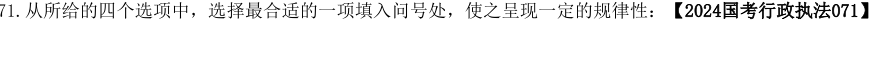

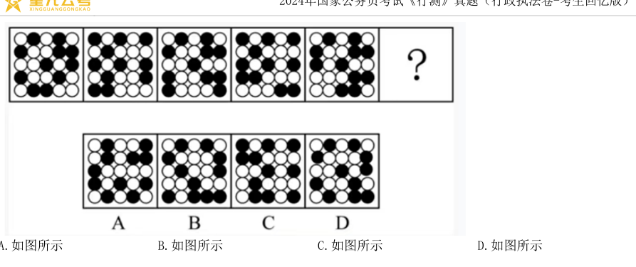

**72.** 从所给的四个选项中，选择最合适的一项填入问号处，使之呈现一定的规律性：【2024国考行政执法072/国考副省076/国考地市072】  `[2024·执法·72]`
- A. 如图所示
- B. 如图所示
- C. 如图所示
- D. 如图所示

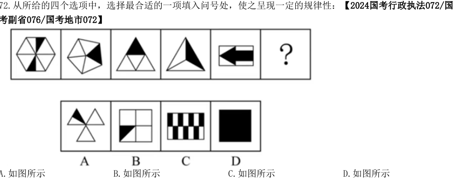

**73.** 从所给的四个选项中，选择最合适的一项填入问号处，使之呈现一定的规律性：【2024国考行政执法073】  `[2024·执法·73]`
- A. 如图所示
- B. 如图所示
- C. 如图所示
- D. 如图所示

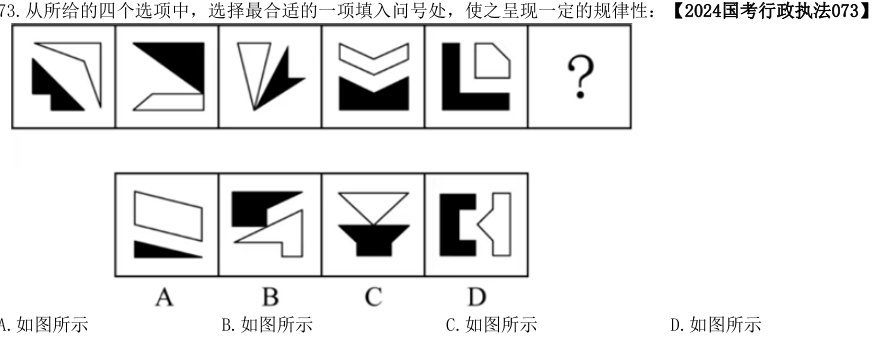

**74.** 从所给的四个选项中，选择最合适的一项填入问号处，使之呈现一定的规律性：【2024国考行政执法074/国考副省079】 2024年国家公务员考试《行测》真题（行政执法卷-考生回忆版）  `[2024·执法·74]`
- A. 如图所示
- B. 如图所示
- C. 如图所示
- D. 如图所示

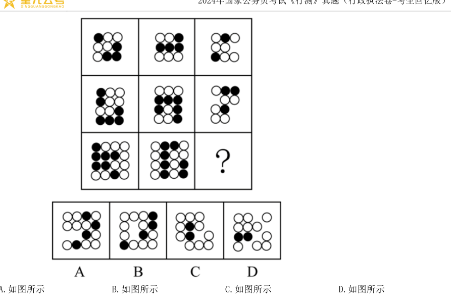

**75.** 左图为15个白色正方体和了3个灰色正方体组合而成的多面体，其可以由①、② 和③三个多面体组合而成，问哪项能填入问号处？【2024国考行政执法075】  `[2024·执法·75]`
- A. 如图所示
- B. 如图所示
- C. 如图所示
- D. 如图所示

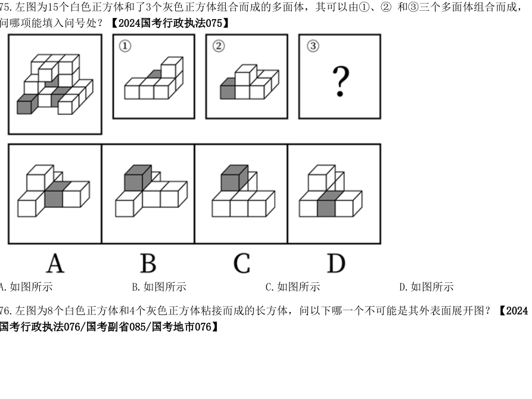

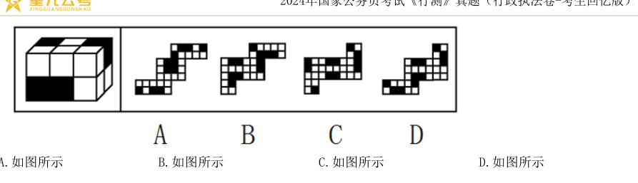

**76.** 左图为8个白色正方体和4个灰色正方体粘接而成的长方体，问以下哪一个不可能是其外表面展开图？【2024国考行政执法076/国考副省085/国考地市076】 2024年国家公务员考试《行测》真题（行政执法卷-考生回忆版）  `[2024·执法·76]`
- A. 如图所示
- B. 如图所示
- C. 如图所示
- D. 如图所示

**77.** 左图为13个白色正方体和5个灰色正方体组合而成的多面体，现用经A、B、C三个顶点的平面对该多面体进行切割，正确的截面是：【2024国考行政执法077/国考副省082】  `[2024·执法·77]`
- A. 如图所示
- B. 如图所示
- C. 如图所示
- D. 如图所示

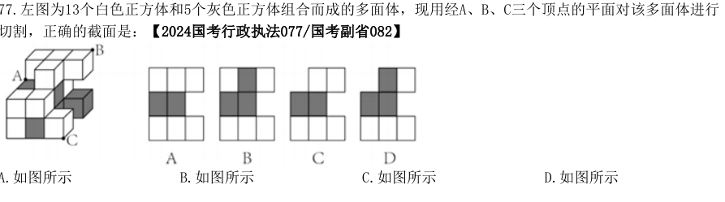

**78.** 把下面的六个图形分为两类，使每一类图形都有各自的共同特征或规律，分类正确的一项是：【2024国考行政执法078/国考副省084/国考地市079】  `[2024·执法·78]`
- A. ①④⑤，②③⑥
- B. ①③④，②⑤⑥
- C. ①⑤⑥，②③④
- D. ①②⑥，③④⑤

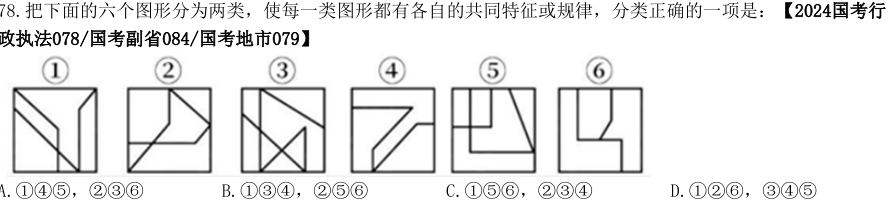

**79.** 把下面的六个图形分为两类，使每一类图形都有各自的共同特征或规律，分类正确的一项是：【2024国考行政执法079】  `[2024·执法·79]`
- A. ①④⑥，②③⑤
- B. ①⑤⑥，②③④
- C. ①②⑥，③④⑤
- D. ①③⑥，②④⑤

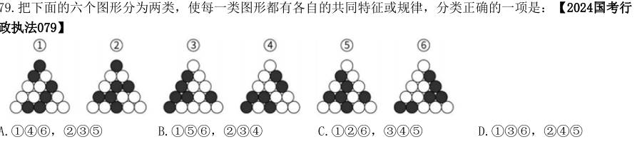

**80.** 把下面的六个图形分为两类，使每一类图形都有各自的共同特征或规律，分类正确的一项是：【2024国考行政执法080/国考地市080/国考副省080】  `[2024·执法·80]`
- A. ①②⑥，③④⑤
- B. ①④⑥，②③⑤
- C. ①③⑤，②④⑥
- D. ①②③，④⑤⑥

**81.** 伪装型反侦查行为是指犯罪行为人通过采取相应措施来隐蔽自身、迷惑侦查机关侦查活动的行为，其主要表现为三类：①栽赃嫁祸，通过将赃物、违禁品暗置别人处等方式来误导侦查方向；②主动报案，通过实施“贼喊捉贼”式的行为来蒙蔽侦查机关；③制造伪证，通过假人证、不知情的人或一些特定物品，制造出虚假的不在场证明或者自己与案件无关的假象，以达到混淆视听、误导侦查视线的目的。2024年国家公务员考试《行测》真题（行政执法卷-考生回忆版）根据上述定义，下列没有体现上述几类伪装型反侦查行为的是：  `[2024·执法·81]`
- A. 甲将乙杀害后，故意在网络上散布丙与乙不和的谣言，转移警方注意力
- B. 甲在作案后，拿走可以证明受害人乙身份的物品，隐藏其身份
- C. 甲酒后与乙争吵并痛下杀手，事后甲主动报警，声称自己是目击证人
- D. 甲作案后接受警方讯问时，拿出案发当日的火车票谎称自己当时正在火车上

**82.** 动物的战斗行为在进化中演变出一种既能决定胜负又能减少伤亡的相对固定的方式，这种方式被称为仪式化战斗。根据上述定义，下列不属于仪式化战斗的是：  `[2024·执法·82]`
- A. 偶蹄动物通常用角互相推顶以比试力量，但并不攻击对方的要害部位
- B. 蟾蜍被其他动物捕食时，其体表会分泌毒液使捕食者产生不适，从而将其吐出
- C. 蜜蚁发生争斗时，会鼓起并翘起腹部，使自己看起来更大一些，直至对方投降
- D. 响尾蛇争斗时，采用颈部侧贴并互相压制的方式，并不使用毒牙和毒液

**83.** 品牌延伸是将著名或成名品牌使用到与原产品不同类型的产品上，是企业在推出新产品过程中经常采用的策略。如果品牌延伸到一个与原产品相对立或易引起消费者反感的产品上，就会对消费者造成心理冲突。消费者只会购买其一，或两者都不买，从而损害原有品牌的形象。根据上述定义，下列情形属于品牌延伸导致消费者心理冲突的是：  `[2024·执法·83]`
- A. 某著名雪糕品牌“白雪”跟著名白酒品牌“九里香”合作推出一款雪糕新产品“雪里香”,很多家长以为这款雪糕含酒精，不敢买给孩子吃
- B. 某奢侈品手提包品牌突然走平民路线，推出百元手提包，还印上了该品牌商标，不少消费者放弃了该品牌
- C. 某世界知名服装品牌为打开甲国市场，特地将甲国标志性的动物印在新款服饰上但被指伤害了该国民众的民族感情，遭到了严重抵制
- D. 某知名厨卫清洁品牌深受消费者喜爱，后该品牌又进军食品行业，推出功能饮料产品，消费者一时难以接受

**84.** 某部落的计数法只有4个符号：■、□、◆、◇每个数字至多有两位，数位从高到低的顺序为从右到左。其中右边数位从大到小依次为■、□、◆、◇；而左边数位从大到小依次为◇、◆、□、■。根据上述定义，下列哪项中的数字最大？  `[2024·执法·84]`
- A. ◆◆
- B. ◆◇
- C. ■◆
- D. ■◇

**85.** 人际关系图，是用一套特定的符号来表示团体内成员之间各种关系的图形。依据前期的调查，将团体成员的关系分为“吸引”“排斥”“无关”三类。图中圆圈内的字母是团体内每一成员的代号。实线与虚线表示相互关系，其中实线表示吸引关系，虚线表排斥关系，箭头表示方向(例如：表示A受B吸引，表示A排斥B),其中被实线箭头指向最多的人，就是处于团体中心位置的人。根据上述定义，对下图的判断正确的是：2024年国家公务员考试《行测》真题（行政执法卷-考生回忆版）  `[2024·执法·85]`
- A. 该团体中没有相互排斥的人
- B. C是处于团体中心位置的人
- C. F是该团体中受排斥最多的人
- D. H和B是相互吸引的人

**86.** 慢病也称为慢性非传染性疾病，是指长期的、不能自愈的、也几乎不能被治愈的疾病。慢病自我管理是指慢病患者主动监测自己的病情，以积极态度及行动，改善健康和情绪，通过对疾病的认识，学习与疾病长期共存。根据上述定义，下列属于慢病自我管理的是：  `[2024·执法·86]`
- A. 老张在患了流感后多方查阅相关信息，每天检测血氧、心率、血压等指标，不做剧烈运动，避免着凉
- B. 老王因慢性肾功能衰竭需定期在医院进行透析治疗，医院为其建立了慢病管理档案，追踪监测肾功能等各项指标
- C. 老赵的父母都因胃癌去世，老赵深知该疾病的严重后果，每年全面体检一次，定期进行胃肠镜检查，不熬夜不喝酒，规律作息
- D. 患Ⅱ型糖尿病的老李，平日生活格外谨慎，含糖量高的食物一概不碰，每天按时服药，定期监测血糖水平

**87.** 民俗是指一个民族或一个社会群体在长期的生产实践和社会生活中逐渐形成并世代相传、较为稳定的文化事项，可以简单概括为民间流行的风尚、习俗，具有传承性、广泛性、稳定性。根据上述定义，下列活动属于民俗的是：  `[2024·执法·87]`
- A. 清明节当天，黄帝陵举行隆重的公祭活动，按照既定祀典礼仪，缅怀始祖精神，传承中华文明
- B. 王老伯家有一个传承三代的习惯，每到重大节日，全家都要聚在一起，交流感情，品尝美食，共享天伦
- C. 农历九月九日为重阳节，自古以来，河洛地区的人们每逢这天都会结伴登高山、逛庙会、赏菊花
- D. 近年来，一些大都市的公园每周都会举办“相亲角”活动，中老年父母聚在一起替儿女相亲

**88.** 电力系统的电力设备根据其在运行中所起的作用，分为电力一次设备和电力二次设备。电力一次设备指的是直接参与生产、变换、传输、分配和消耗电能的设备；电力二次设备指的是为了保护并保证电力一次设备的正常运行，对其运行状态进行测量、监视、控制和调节等的设备。根据上述定义，下列说法正确的是：  `[2024·执法·88]`
- A. 电路中用于升降交流电压的变压器，属于电力二次设备
- B. 将回路中高电压降低的电压互感器，属于电力一次设备
- C. 由柴油驱动的发电机，属于电力二次设备
- D. 记录零序电流值并用于查找故障点的故障录波装置，属于电力一次设备

**89.** 甲类对象如果全部属于乙类对象，就把表达甲类对象的概念称为种概念，表达乙类对象的概念称为属概念。属种定义是一种明确概念的定义方法，其定义方法是首先找出与被定义概念相邻近的上位属概念，然后找出被定义概念与该邻近属概念下其他种概念之间的差别，以此来定义该概念。根据上述定义，下列属于属种定义的是：2024年国家公务员考试《行测》真题（行政执法卷-考生回忆版）  `[2024·执法·89]`
- A. 葛布是用葛的纤维织成的布
- B. 吃香即受欢迎
- C. 摩天大厦指的是诸如上海金茂大厦、迪拜哈利法塔那样的高楼大厦
- D. 竹林七贤指的是魏晋时期的阮籍、础康、山涛、刘伶、阮成、向秀和王戎等七位名士

**90.** 中医七方指的是大方、小方、缓方、急方、奇方、偶方、复方七种方剂的总称。其中缓方是指药性缓和，治疗病势缓慢需长期服用的方剂；急方是指药性峻猛，治疗病势急重急于取效的方剂；奇方是指单数药物合成的方剂；偶方是指双数药物组成的方剂。根据上述定义，下列既属于缓方又属于偶方的是：  `[2024·执法·90]`
- A. 参附汤：人参15克、附子30克，有回阳、益气、固脱之功，常用于元气大亏、阳气暴脱之症
- B. 甘草汤：甘草6克，主治少阴咽痛，兼治舌肿，有清热解毒之功效
- C. 四君子汤：人参、甘草、茯苓、白术各等分，主治脾胃气虚证，症见面色萎黄、语声低微、气短乏力等
- D. 生脉散：人参9克、麦门冬9克、五味子6克，为补益剂，具有益气生津、敛阴止汗之功效

**91.** 质证∶法庭  `[2024·执法·91]`
- A. 缴费∶窗口
- B. 监狱∶拘役
- C. 监考∶考场
- D. 采访∶现场

**92.** 花生壳∶核桃仁  `[2024·执法·92]`
- A. 刺梨汁∶桃花扇
- B. 丝瓜络∶石榴籽
- C. 杏仁露∶葡萄皮
- D. 葛根茶∶芡实粉

**93.** 诛禁不当∶反受其央  `[2024·执法·93]`
- A. 为者常成∶行者常至
- B. 君子检身∶常若有过
- C. 其身不正∶虽令不从
- D. 麻雀虽小∶五脏俱全

**94.** 花香四溢∶分子运动  `[2024·执法·94]`
- A. 波光粼粼∶光的反射
- B. 聚沙成塔∶质量互变
- C. 水落石出∶水的浮力
- D. 炉火纯青∶金属炼制

**95.** 发酵∶灌装∶生产红酒  `[2024·执法·95]`
- A. 摇晃∶搅拌∶冲泡奶粉
- B. 下载∶打印∶检索资料
- C. 养殖∶运输∶销售对虾
- D. 折叠∶粘合∶制作信封

**96.** 蚜虫∶七星瓢虫∶小麦  `[2024·执法·96]`
- A. 蛇∶鸟：谷子
- B. 稗草∶螳螂∶水稻
- C. 蚊子∶青蛙∶高梁
- D. 老鼠∶黄鼬∶玉米

**97.** 感想∶主观性∶体会  `[2024·执法·97]`
- A. 典范∶示范性∶表率
- B. 发明∶创造性∶方法
- C. 泥土∶可塑性∶材料
- D. 规律∶普遍性∶定理

**98.** 放养过密∶饲喂不当∶鱼病发生  `[2024·执法·98]`
- A. 任务繁重∶临时加班∶积劳成疾
- B. 材料审核∶实地考核∶评估通过
- C. 地基下沉∶结构老化∶房屋倾斜
- D. 市场饱和∶利润下降∶分红减少

**99.** 嬗变 对于（  ）相当于（  ）对于 生肖  `[2024·执法·99]`
- A. 改变  中国
- B. 演变  属相
- C. 剧变  动物
- D. 巨变  传统

**100.** 重型战机 对于 （  ）相当于（  ） 对于 分辨率  `[2024·执法·100]`
- A. 隐形战机  清晰度
- B. 战斗机  性能指标
- C. 轻型战机  订单量
- D. 载弹量  显示器

**101.** 对体外环境的感知是人类生存、交流和进化的基本能力。人体的味觉系统是信息感知的重要组成部分。有学者认为，苦味的感知是人类长期进化的一种防御机制，这意味其担负着保护人体免于摄入有毒物质的预警任务。以下哪项最可能是上述学者论述的前提？  `[2024·执法·101]`
- A. 苦味受体能监测味觉分子并将信号传递至大脑2024年国家公务员考试《行测》真题（行政执法卷-考生回忆版）
- B. 已发现人体的25种苦味受体分布于舌头的不同部位
- C. 苦味分子与苦味受体结合，激活大脑味觉皮层，产生味觉感知
- D. 已有研究表明，自然界的大部分有毒物质是苦的

**102.** 在过去，药物的研发主要来自于陆地生物，这与陆地生物更被熟知且容易获得有关。近几十年来，越来越多的药物开始从海洋生物中产生，海洋生态环境极具复杂性，因而海洋生物相比于陆地生物有着更为广泛的多样性。有人据此认为，海洋生物产业潜力巨大，海洋生物更有可能是未来新型抗生素，抗癌药物的来源。以下除哪项外，均能支持上述观点？  `[2024·执法·102]`
- A. 目前抗生素都来源于陆地微生物，病菌耐药性不断上升，而海洋微生物药物已经对一些感染性疾病提供了替代性疗法
- B. 借助计算机工具，人们已经将庞大的生物基因组库和具有生物活性的化合物库进行关联，用以探索性药物
- C. 一些海洋生物如鲸、鲨等终身不得癌症，有近300种海洋生物含有抗肿瘤物质，他们是研究抗癌药物的重要资源
- D. 当前已经发现的3.5万个海洋天然产物中有一半以上都具有生物活性，还有更多数以万计的未知海洋天然产物亟待开发

**103.** W国对咖啡领域的调查显示，过去W国咖啡领域的融资金额高达5亿元，该国许多知名企业跨界进入咖啡领域，本土咖啡品牌在快速崛起。然而经过去年一年的销售发现，W国线下咖啡门店的总数量虽然有所增加，但咖啡销量与往年相比并未明显增加，因此有人认为：咖啡在W国居民中不是很受欢迎。以下哪项如果为真，最能削弱上述观点？  `[2024·执法·103]`
- A. W国个别线下门店提供的速溶咖啡添加了植脂末、白砂糖等成分，摄入过多不利于身体健康
- B. 与一些咖啡销量高的国家相比，W国咖啡的单价过高，在一定程度上阻碍了消费欲望
- C. W国的一些企业开始倾向咖啡液、速溶咖啡、袋泡咖啡等全品类进军
- D. 当前，W国的咖啡文化并不成熟，作为消费主体的年轻人喝咖啡也大多是赶潮流

**104.** 软件通常存在漏洞，攻击者为接近并操控目标主机，往往会主动寻找漏洞，攻击者会花费大量时间区分时间中“真正危险的漏洞”和“良性漏洞”，并在找到前者后实施攻击。因此有观点认为：如果添加大量良性漏洞欺骗攻击者，使其耗尽资源去寻找和测试那些毫无攻击用途的漏洞，将会减少对软件“真正危险的漏洞”的攻击，从而保证软件不被攻击者恶意控制。以下哪项如果为真，最能削弱上述观点？  `[2024·执法·104]`
- A. 与软件中“真正危险的漏洞”相比，良性漏洞被攻击后只会导致程序崩溃
- B. 添加漏洞意味着要更改代码，有时候代码运行不良可能会影响软件的功能
- C. 许多军用飞机，舰艇都配有假目标系统，与此类似，良性漏洞也将起到干扰作用
- D. 大量添加良性漏洞会让其呈现很多人为特征，攻击者可利用其识别并忽略良性漏洞

**105.** 研究发现，一种被称为EPAS1的特殊基因能调节机体生理状态，使人类适应缺氧环境。考古研究表明这种特殊基因最早可追溯至16万年前已居于青藏高原的古人类。由于16万年前全国同时生活着尼安德特人、月尼索瓦人及古老的直立人，其中只有丹尼索瓦人拥有这一基因，考古学家推测丹尼索瓦人很可能在16万年前居住于青藏高原。以下哪项除外，最能支持考古学家的推测？  `[2024·执法·105]`
- A. 通过对牙齿形态的扫描，发现青藏高原古人类的牙齿齿列和丹尼索瓦人最为相似
- B. 分析青藏高原人骨化石中的蛋白质序列，发现这些人类与丹尼索瓦人同属一类
- C. 考古人员在青藏高原东北部的白石崖溶洞遗址提取到丹尼索瓦人的线粒体DNA
- D. 丹尼索瓦人曾在亚洲广泛分布，他们曾在西伯利亚生活过，可耐受高寒环境有甲、乙、丙、丁、戊、己6个城市，其中的两个城市在2021年结成一对友好城市，其余4个城市中的2个在2022年结成一对友好城市，剩余的2个城市在2023年也结成一对友好城市，已知：2024年国家公务员考试《行测》真题（行政执法卷-考生回忆版）（1）乙的结对城市不是丁（2）甲的结对城市不是乙就是丙（3）甲和乙均不是在2021年结对的（4）丁和戊均不是在2023年结对的

**106.** 下列哪项是可能的先后依次结对的城市名单？  `[2024·执法·106]`
- A. 甲和丙，丁和戊，乙和己
- B. 丙和丁，甲和乙，戊和己
- C. 丁和己，丙和戊，甲和乙
- D. 丙和戊，甲和丁，乙和己

**107.** 如果己是2023年结对的，那么戊一定是和哪个城市结对的？  `[2024·执法·107]`
- A. 甲
- B. 乙
- C. 丙
- D. 丁

**108.** 如果丁是2022年结对的，那么下列各项中，哪两个城市可能结对？  `[2024·执法·108]`
- A. 丙和戊
- B. 乙和己
- C. 甲和戊
- D. 乙和戊

**109.** 如果甲和丙结对，下列哪一项一定为真？  `[2024·执法·109]`
- A. 丙是2023年结对的
- B. 己是2023年结对的
- C. 丁是2021年结对的
- D. 戊是2021年结对的

**110.** 有几个城市可能是在2022年与其他城市结对的？  `[2024·执法·110]`
- A. 6个
- B. 5个
- C. 4个
- D. 3个

## 2025年 · 副省级

**81.** 从所给的四个选项中选择一个最合适的一个填入问号处，使之呈现出一定的规律性。【2025国考地市076/国考副省081】 2025年国家公务员录用考试《行测》真题（副省卷-考生回忆版）---估分  `[2025·副省·81]`
- A. 如图所示
- B. 如图所示
- C. 如图所示
- D. 如图所示

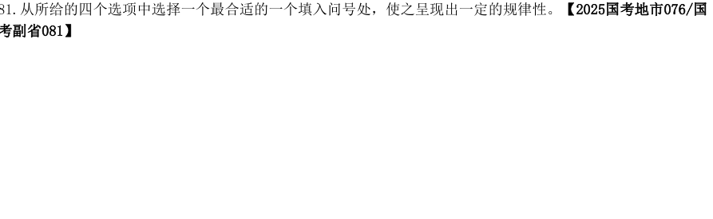

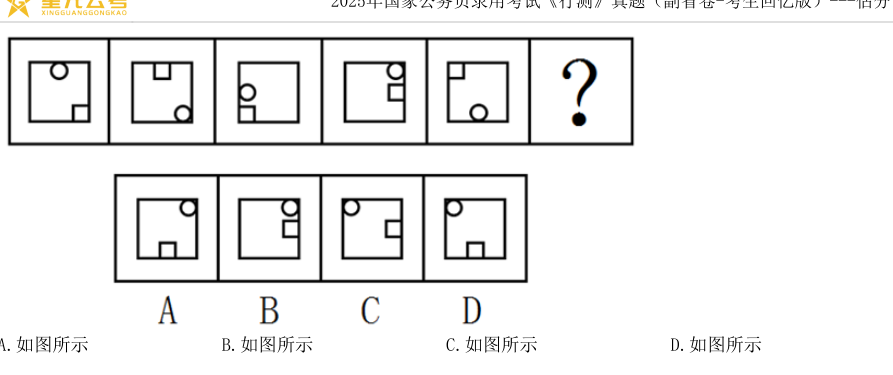

**82.** 从所给的四个选项中，选择最合适的一项填入问号处，使之呈现一定的规律性：【2025国考行政执法078/国考副省082】  `[2025·副省·82]`
- A. 如图所示
- B. 如图所示
- C. 如图所示
- D. 如图所示

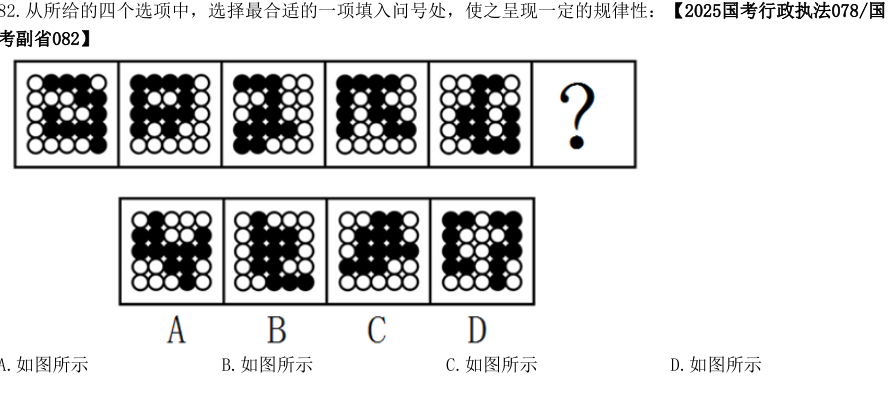

**83.** 从所给的四个选项中，选择最合适的一个填入问号处，使之呈现一定的规律性：【2025国考副省级083】  `[2025·副省·83]`
- A. 如图所示
- B. 如图所示
- C. 如图所示
- D. 如图所示

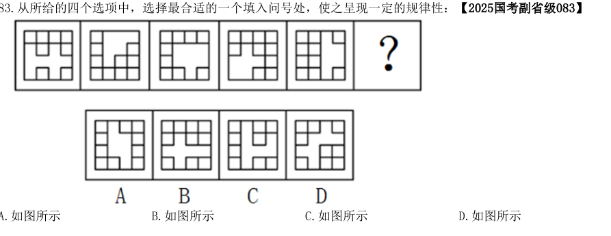

**84.** 从所给的四个选项中，选择最合适的一个填入问号处，使之呈现一定的规律性：【2025国考行政执法079/国考副省084】 2025年国家公务员录用考试《行测》真题（副省卷-考生回忆版）---估分  `[2025·副省·84]`
- A. 如图所示
- B. 如图所示
- C. 如图所示
- D. 如图所示

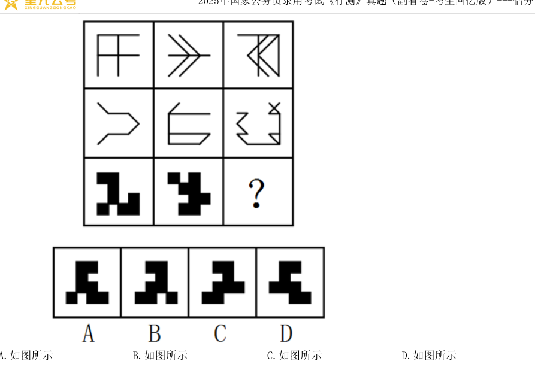

**85.** 左边为15个白色和三个灰色正方体组成的多面体的正反两面直观图，其可以由1、2、3三个多面体组合而成。问哪一项能填入问号处？【2025国考地市082/国考副省085】  `[2025·副省·85]`
- A. 如图所示
- B. 如图所示
- C. 如图所示
- D. 如图所示

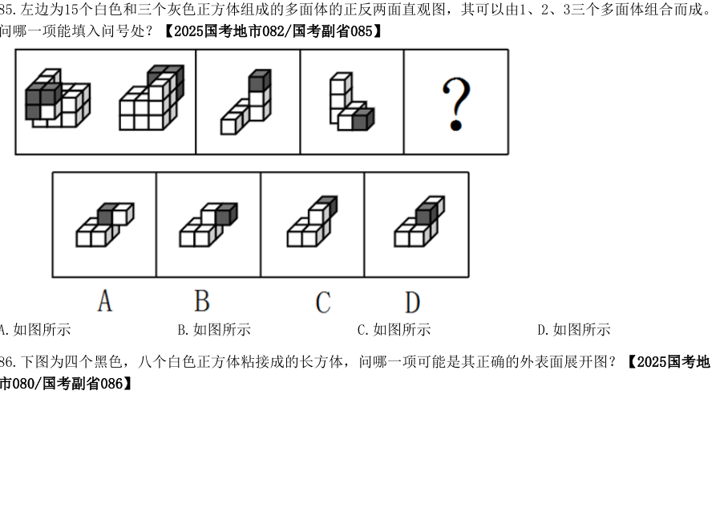

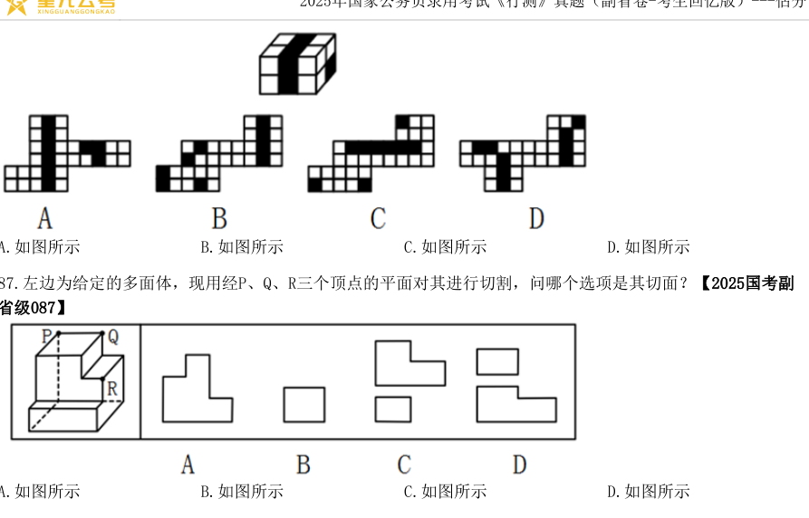

**86.** 下图为四个黑色，八个白色正方体粘接成的长方体，问哪一项可能是其正确的外表面展开图？【2025国考地市080/国考副省086】 2025年国家公务员录用考试《行测》真题（副省卷-考生回忆版）---估分  `[2025·副省·86]`
- A. 如图所示
- B. 如图所示
- C. 如图所示
- D. 如图所示

**87.** 左边为给定的多面体，现用经P、Q、R三个顶点的平面对其进行切割，问哪个选项是其切面？【2025国考副省级087】  `[2025·副省·87]`
- A. 如图所示
- B. 如图所示
- C. 如图所示
- D. 如图所示

**88.** 把下面的六个图形分为两类，使每一类图形都有各自的共同特征或规律，分类正确的一项是：【2025国考行政执法083/国考副省088】  `[2025·副省·88]`
- A. ①②④，③⑤⑥
- B. ①③⑤，②④⑥
- C. ①③④，②⑤⑥
- D. ①③⑥，②④⑤

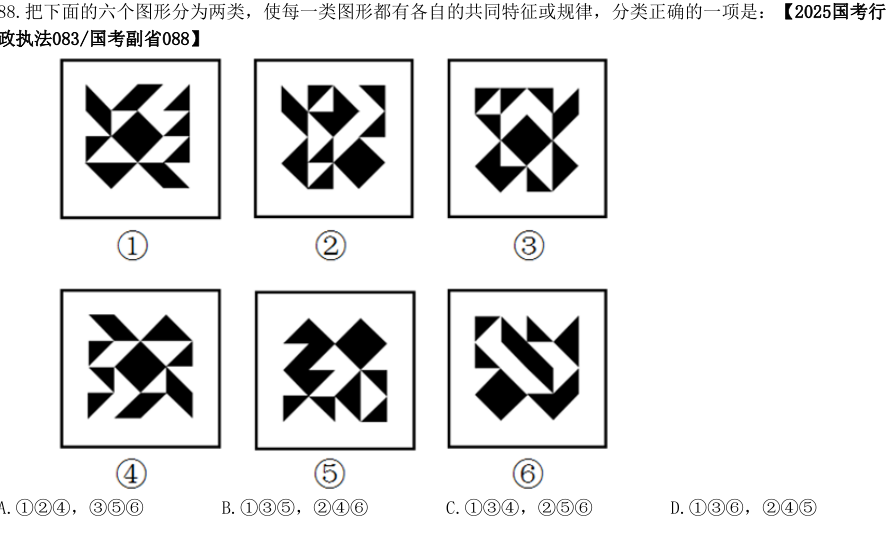

**89.** 把下面的六个图形分为两类，使每一类图形都有各自的共同特征或规律，分类正确的一项是：【2025国考行政执法084/国考副省089】 2025年国家公务员录用考试《行测》真题（副省卷-考生回忆版）---估分  `[2025·副省·89]`
- A. ①②③，④⑤⑥
- B. ①⑤⑥，②③④
- C. ①②④，③⑤⑥
- D. ①③⑤，②④⑥

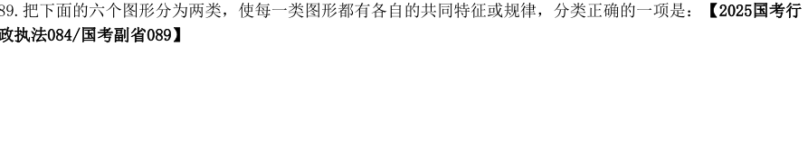

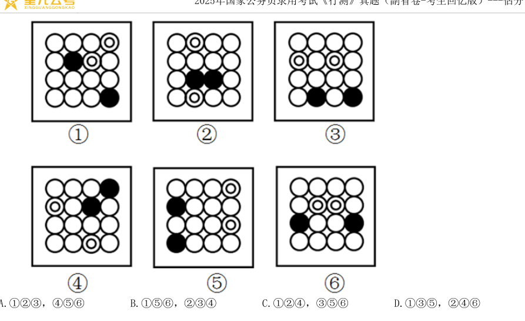

**90.** 把下面的六个图形分为两类，使每一类图形都有各自的共同特征或规律，分类正确的一项是：【2025国考副省级090】  `[2025·副省·90]`
- A. ①②④，③⑤⑥
- B. ①③④，②⑤⑥
- C. ①②⑤，③④⑥
- D. ①④⑤，②③⑥

**91.** 逐客令∶挡箭牌  `[2025·副省·91]`
- A. 急先锋∶领航者
- B. 避风港∶马后炮
- C. 敲门砖∶绊脚石
- D. 鸿门宴∶攻心计

**92.** 嘤其鸣矣:求其友声  `[2025·副省·92]`
- A. 遏其生气:以求重价
- B. 求之其本:经旬必得
- C. 道不拾遗:夜不闭户
- D. 避其锐气:击其惰归2025年国家公务员录用考试《行测》真题（副省卷-考生回忆版）---估分

**93.** 直观性∶即时性∶网络直播  `[2025·副省·93]`
- A. 等边性∶对称性∶等腰梯形
- B. 周期性∶延展性∶机械钟摆
- C. 公开性∶权威性∶行政法律
- D. 挥发性∶保温性∶石棉纤维

**94.** 光伏电站：电池板：发电  `[2025·副省·94]`
- A. 跨海大桥：桥墩支架：交通
- B. 射电望远镜：电磁波：信号
- C. 海底气田：油气管道：钻井
- D. 游乐设施：球幕电影：娱乐

**95.** 稀树草原  对于 （   ） 相当于 （   ） 对于  国际公约  `[2025·副省·95]`
- A. 物种多样性  缔约国家
- B. 落叶阔叶林  多边条约
- C. 气候变迁  政治协调
- D. 植被类型  联合国宪章

**96.** 后视错觉是个体的一种认知偏差，是指在一件事情已经发生之后，即使个体之前没有对此做过预判，也认为自己“早就知道会这样”。根据上述定义，下列符合后视错觉的是：  `[2025·副省·96]`
- A. 小瑾是一个悲观的人，她申请升职失败后，灰心丧气地说：“我早就知道，我什么都不如别人，什么也做不好。”
- B. 朋友邀阿欣去爬山，阿欣说高温预警不宜爬山，朋友坚持去，才到半山腰就汗流浃背，阿欣说：“我早就说会很热啊。”
- C. 晓琳参加一个重要会议迟到了。她懊悔地说：“我早该想到周一早上会堵车，不该按周末的情况预估通勤时间。”
- D. 晓菲在股票大跌之后，懊恼地说：“我早就觉察到那些信号了，觉得走势不太好，怎么就没有早卖出啊。”

**97.** 回应型预算要求政府基于与人民的民主协商作出预算决策、相关责任部门应当及时反应并积极回复人民的质疑和诉求。根据上速定义，下列属于回应型预算的是：  `[2025·副省·97]`
- A. 甲国突发大规模严重旱情，财政部门从中央及各级政府应急预算中，通过多种财政政策安排，保障应急救援经费
- B. 乙省是地质灾害高发地区，年初该省编制《乙省地质灾害应急中心××年度部门预算公开说明》并在官网上发布
- C. 丙市在年初将上一年度的地方预算执行情况在官网进行公布，诚邀广大市民和社会公众踊跃监督并提出意见
- D. 丁区实行预算听证制度，对与公共服务和社会民生相关的重大支出项目开展听证，并就意见和建议进行书面答复

**98.** 选择或然率理论解释的是影响受众对大众传播内容选择的决定性因素。该理论的核心公式是：选择或然率=报偿的保证/费力的程度。其中，报偿的保证指的是传播内容满足选择者需要的程度，即内容对于受众的吸引力和实用性；费力的程度指的是获取传播内容和使用传播途径的难度。根据上述定义，下列属于提高选择或然率的传播行为的是：  `[2025·副省·98]`
- A. 视频号平台借助数据分析和个性化算法，给用户推荐符合其偏好的视频
- B. 时下流行的某影视作品在播放之前被插入一段2分钟的广告
- C. 某商家优化了商品布局，将畅销商品放在出口处，顾客可直接扫码支付
- D. 电视内置视频播放软件，开机后须先注册登录，才可搜索相关内容观看

**99.** 三维反求是测量技术、数据处理技术、图形处理技术和加工技术相结合的综合性技术，是指用一定的测量方法对实物进行测量，根据测量数据通过三维几何建模方法重构实物的数字化模型的过程。根据上述定义，下列关于三维反求工程的步骤，排序正确的是：①通过制造样品来验证模型是否满足精度和其他性能指标②通过一定的算法，从测量数据中提取零件的设计与加工特征2025年国家公务员录用考试《行测》真题（副省卷-考生回忆版）---估分③使用高精度的三维测量技术获取零件表面各点的空间坐标④使用计算机辅助设计软件将数据与特征重构为三维模型  `[2025·副省·99]`
- A. ①③④②
- B. ①④③②
- C. ③①②④
- D. ③②④①

**100.** 形象史学是指把形与象作为主要材料，用以研究历史的一门学问。具体来说，是指把传世的包括出土(水)的具有研究价值的石刻、陶望、壁画、雕砖、铜玉、织绣、漆器、木器、绘画等历史实物、文本图像以及文化史迹作为主要研究对象，并结合传统文献来综合考察历史的一种新的史学研究模式。根据上述定义、下列属于形象史学研究范畴的是：  `[2025·副省·100]`
- A. 通过对现存的汉画像石(汉代人雕刻在墓室、祠堂四壁的装饰石刻壁画)的实地考察，分析汉画像石的雕刻风格和雕刻技法
- B. 根据史诗《伊利亚特》的记载，找到特洛伊城的遗址，并在其中发掘出王冠、银瓶、短剑等大量器物
- C. 通过对二十世纪二三十年代齐白石、傅抱石等人具有代表性的国画作品进行研究、分析当时国画中所蕴含的思想意境
- D. 结合《晋书》等史书，通过对吉林集安长川1号墓礼佛图主佛形象及莲花纹的考察，研究三燕文化对高句丽佛教产生的影响

**101.** 深度优先搜索是指从初始节点出发，按照一定的顺序扩展到下一个节点，然后从下一个节点出发继续扩展到新的节点，不断递归执行这个过程，直到某个节点不能再扩展到下一个节点，此时返回上一个节点重新寻找一个新的节点继续扩展，如此搜索下去，直到找到目标节点，或者搜索完所有节点为止。根据上述定义，如果以“1”为初始节点，“12”为目标节点，下列搜索路径符合深度优先搜索的是：  `[2025·副省·101]`
- A. 1→2→1→3→6→11→12
- B. 1→3→5→3→7→3→6→12
- C. 1→4→8→4→1→3→6→12
- D. 1→3→5→10→5→3→1→3→6→12

**102.** 元科学也称元理论，是一种以科学为研究对象的学科，它研究科学的性质、特征、形成和发展规律。科学概念是“科学内部”出现的概念，如“质量”“频率”等；而元科学概念是“谈论科学的”，表示科学的陈述或活动特征的概念。根据上述定义，下列说法正确的是：  `[2025·副省·102]`
- A. “黑洞”是科学概念，“量子”是元科学概念
- B. “物质波”“科学”都是科学概念
- C. “理论”“确证”都是元科学概念
- D. “经验”是科学概念，“宇宙”是元科学概念

**103.** 同一认定是指侦查中具有专门知识的人或了解客体特征的人，通过比较先后出现的客体的特征而对客体是否同一做出的判断。这里所说的客体是指与案件有关联的人或物。2025年国家公务员录用考试《行测》真题（副省卷-考生回忆版）---估分根据上述定义，下列属于同一认定的是：  `[2025·副省·103]`
- A. 通过对手机中所存储的信息进行检查，确定其是否为报案人所丢失的手机
- B. 通过对犯罪现场提取的DNA信息与DNA信息库进行比对，查找犯罪嫌疑人
- C. 通过对走私案中所缴获的走私物品进行多次鉴定，认定其是否为国外某厂家所生产
- D. 通过对犯罪嫌疑人车上所收缴的各类物品进行检验，判断其是否属于违禁物品

**104.** 流域内降雨或融冰化雪都可以引起河水显著上涨。春季，气候转暖，流域内的季节性积雪融化、河流解冻或春雨，引起河水上涨称春汛。因正值桃花盛开时节，故亦称桃汛。我国北方，把春季河冰解冻引起的涨水现象专称为凌汛。夏季，流域内的暴雨或高山冰川和积雪融化，使河水急剧上涨，称夏汛。我国习惯上把发生在夏季三伏前后的汛水称为伏汛。秋季由于暴雨，河水发生急剧上涨称秋汛。根据上述定义，下列判断错误的是：  `[2025·副省·104]`
- A. 春汛包含凌汛
- B. 夏汛包含伏汛
- C. 伏汛在凌汛前
- D. 春汛就是桃汛

**105.** 具有包含与被包含关系的三个概念，如植物、乔木、水杉等，可至少形成三个正确的命题：所有的水杉都是乔木，所有的乔木都是植物，所有的水杉都是植物，由“所有的乔木都是植物”“所有的水杉都是植物”而得出“所有的水杉都是乔木”，这样的推理被称为排序推理。根据上述定义，下列属于排序推理的是  `[2025·副省·105]`
- A. 所有的平行四边形都是四边形，所有的菱形都是四边形，所以，所有的菱形都是平行四边形
- B. 所有的昆虫都是动物，所有的蝴蝶都是昆虫，所以，所有的蝴蝶都是动物
- C. 所有的文字都是符号，所有的文字都是图形，所以，所有的符号都是图形
- D. 这个花园的花都是迎春花，迎春花都在冬、春季开放，所以，这个花园的花都在冬、春季开放

**106.** 某企业对于如何进行产教融合，形成如下两种方案：一是“做深”，企业自建培训中心，成立专职和兼职的企业培训师队伍，并根据企业需求，制定专门的培训大纲和计划，该中心与毕业生未来形成签约。二是“做浅”，在学校设立“冠名班”和“订单班”，以学校教育为主，企业与学生当前没有签约意向，但随时保持互相选择的权利。以下理由中，能够支持企业选择第二方案的是:  `[2025·副省·106]`
- A. 企业必须付出人力成本，人力资源自带“稀缺”和“增值”属性，在企业面临竞争压力时尤其要重视
- B. 该企业生产使用的是特种专业设备，竞争对手稀少，不具备从市场上挖掘技术人员的条件
- C. 企业订单量并不是稳定的，遇到订单量突然增加需要扩产的时候，才临时需要大量的人参与进来
- D. 学校教育内容具有普适性，而自建培训中心有利于企业保障准员工的培养质量，提前锁定毕业生

**107.** 海山是海面下的岛屿，与岛屿中的火山岛有相同的起源和相似的形态。以往的海山生物调查发现，海山岩石上的生物群落与海山周边的软底沉积和深海平原上的生物群落大不相同。而且，一些海山之间的生物群落在物种构成上较少重叠。因此，有一些学者认为，相对孤立的海山存在独特的生物群落且拥有高度特有的动物群。以下哪项如果为真，最能反驳上述学者的观点？  `[2025·副省·107]`
- A. 远离大陆的孤岛，因为海洋的分割往往会形成相对孤立且独特的岛屿生物群
- B. 物理隔离海洋的现象在海洋中很少出现，所以海山不可能长期被隔离成水下孤岛
- C. 地形和海流的相互作用在某些海山顶部形成封闭环流，使栖息其上的生物幼体难以扩散
- D. 早期一些海山中发现的高度特有物种其实是采样不足造成的，很多海山都有相同的生物来源

**108.** 飞行信息记录系统，也就是俗标的黑匣子，在空难事故调查中的重要作用不需赘言，但无论在陆上还是海上的空难事故中，搜寻黑匣子都极其不易。有人建议，可利用现在飞速发展的互联技术，把黑匣子升级成为“云匣子”，那么飞机在空中就能够实时与地面进行信息交互，使空难事故的分析变得更加便捷。以下哪项如果为真，最能质疑上述建议？  `[2025·副省·108]`
- A. 飞机接入互联网，其信号稳定性受到太多外界不可控因素的影响2025年国家公务员录用考试《行测》真题（副省卷-考生回忆版）---估分
- B. 空难是极小概率事件，投入高昂的数据管理成本不如直接用于提升飞行安全
- C. 即使救援人员能够顺利搜寻到黑匣子，想要依靠其揭开事故真相也绝非易事
- D. 实时同步每一架飞机的海量数据，对飞行管理并无帮助，更无必要

**109.** 某项研究显示，与未接触空气污染的人相比，暴露于空气污染中的人死于乳腺癌的风险增加了80%，死于其他各类癌症的风险增加了22%。该研究团队由此认为，这可能与空气污染物中的PM2.5有关，因为PM2.5会导致脏器的炎症和氧化应激反应。以下哪项如果为真，最可能是上述专家预设的前提？  `[2025·副省·109]`
- A. 脏器的炎症和氧化应激反应是明确的致癌危险因素
- B. PM2.5在大气成分中含量较少，但对空气质量有重要影响
- C. 吸食香烟和电子烟等都可以将PM2.5直接输送到肺部
- D. 女性更易接触烹饪油烟，其中含有大量的PM2.5

**110.** 甲、乙、丙、丁4人按顺时针依次围坐在四方桌前，每人坐一面，4人中只有1人说真话。甲：坐在东面的人说谎；乙：坐在南面的人说谎；丙：我坐在西面或者北面；丁：我坐在北面。根据以上陈述，可以得出：  `[2025·副省·110]`
- A. 甲坐在北面
- B. 甲坐在东面
- C. 乙坐在西面
- D. 乙坐在南面

**111.** 随着通货膨胀的蔓延，H国电子企业主要产品的原材料价格大幅上涨。该国最大的电子企业公报显示，今年该企业智能手机应用处理器价格较上年上涨30%，用于智能手机的相机模块价格上涨11%，用于电视和显示器的面板价格上涨9%。H国经济界认为，电子企业原材料价格居高不下，将严重削弱该国电子企业在国际市场上的竞争力。以下哪项如果为真，最能支持上述结论？  `[2025·副省·111]`
- A. 近年来，无论是国际还是国内，硅化合物价格始终呈上涨趋势，这是导致H国电子企业主要产品原材料价格大幅上涨的原因
- B. 在H国电子企业主要产品的原材料价格大幅上涨的同时，由于购买力下降等原因，电子产品的全球消费需求在缩减
- C. 其他国家电子企业都在通过科技创新降低产品原材料价格上涨的影响，以求通过低价在竞争激烈的国际电子产品市场中脱颖而出
- D. 一直以来，H国电子企业生产的产品以其卓越的技术和质量优势在国际市场上极具竞争力，近年来这种竞争优势在逐渐减弱

**112.** 我军军语惯于将数字 1、2、7、9、0变读为幺、两、拐、勾、洞。这些数字有个共同特点，即其原本的发音部位与发音方法使得在读这些数字时无法发出较大声音。在噪声干扰较为强烈的战场上，通信兵使用通讯设备进行情报交流时，话筒对这些数字的实际增音效果并不明显，可能会影响信息的准确性。因此，在军语中将这些数字变读，是为了符合实际需要。以下哪项如果为真，不能支持上述结论？  `[2025·副省·112]`
- A. 常规数字念法中1、7的韵尾相同，发音相似，在嘈杂的战场环境中容易混淆，造成信息传达错误
- B. 士兵一般都来自不同的兵源地，不可避免地带有家乡口音，将数字变读可以避免口音问题
- C. 将0读成“洞”时，更容易提高声音，同时也使声音更加干脆清晰，确保信息的准确性
- D. 在国际无线电通话中，也会对字母读音进行变读，如将A读成Alpha,将D读成Delta

**113.** 国内市场只有形成完备的市场体系与商业规则环境，才能为企业参与出口竞争提供真正的市场根基，要形成完备的市场体系，必须深化要素市场化配置体制机制改革，只有促进要素自主有序流动，且提高要素配置效2025年国家公务员录用考试《行测》真题（副省卷-考生回忆版）---估分率，才能深化要素市场化配置体制机制改革，要形成完备的商业规则环境，必须推进全方位开放并建立全国统一大市场，且加强执法效率和市场司法保障。根据以上陈述，可以推出下列哪项？  `[2025·副省·113]`
- A. 只要深化要素市场化配置体制机制改革就能形成完备的市场体系
- B. 如果加强执法效率和司法保障，就能推进全方位开放并建立全国统一大市场
- C. 只有促进要素自主有序流动，且提高要素配置效率，才能使国内市场形成完备的商业规则环境
- D. 除非推进全方位开放并建立全国统一大市场，且加强执法效率和司法保障，否则不能为企业参与进出口竞争提供真正的市场根基

**114.** 红霉素是一种抗生素，最早从放线菌糖多孢红霉菌的分泌物中发现，最新研究中，人们发现一种名为文蛤的贝类体内也会分泌红霉素。红霉素主要由微生物合成，此前从未在动物体内发现，研究者据此推测，文蛤合成红霉素的能力应当源于文蛤体内的微生物，正是这些微生物帮助文蛤合成了红霉素。以下哪项如果为真，最能削弱研究者的推测？  `[2025·副省·114]`
- A. 文蛤的基因组中具有红霉素合成基因，该基因表达在文蛤外套膜的粘液细胞中
- B. 文蛤贝壳下有一层外套膜，膜的上皮内分布着粘液细胞，它们能存储红霉素
- C. 通过对文蛤体内的所有维生素进行检测并没有发现糖多孢红霉素菌
- D. 研究者在其他贝类体内也发现了类似红霉素的抗生素

**115.** 甲、乙、丙、丁、戊、己、庚7人报名参加象棋比赛，对于比赛结果，大家预测如下：（1）戊、己、庚至少有2人获奖；（2）如果甲、丙、戊至少有1人获奖，则丁、己均不获奖；（3）如果乙、戊、己至少有1人获奖，则丁获奖而丙不获奖。比赛结束后，发现上述预测完全正确。根据上述信息，一定获奖的是：  `[2025·副省·115]`
- A. 甲
- B. 乙
- C. 丙
- D. 丁

## 2025年 · 地市级

**76.** 从所给的四个选项中选择一个最合适的一个填入问号处，使之呈现出一定的规律性。【2025国考地市076/国考副省081】 2025年国家公务员录用考试《行测》真题（地市卷-考生回忆版）---估分  `[2025·地市·76]`
- A. 如图所示
- B. 如图所示
- C. 如图所示
- D. 如图所示

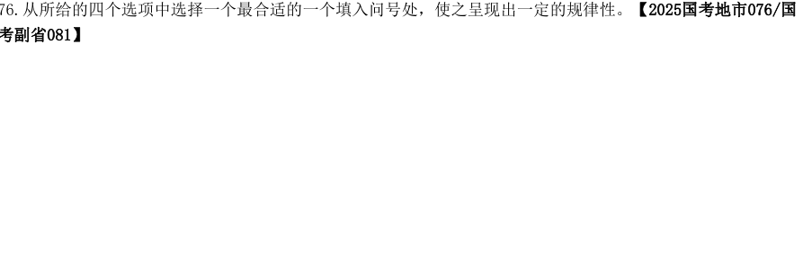

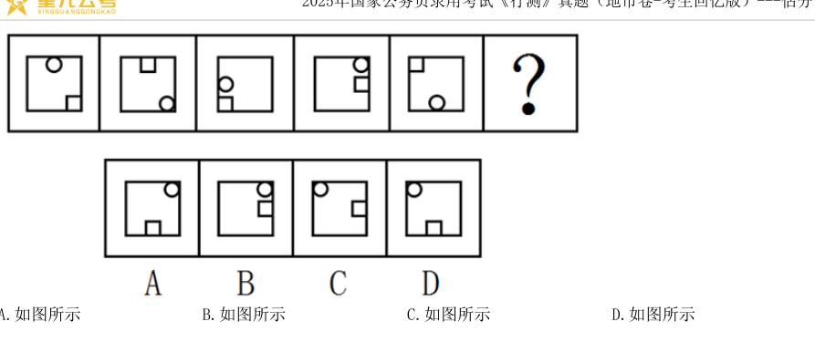

**77.** 从所给的四个选项中选择一个最合适的一个填入问号处，使之呈现出一定的规律性。【2025国考行政执法076/国考地市077】  `[2025·地市·77]`
- A. 如图所示
- B. 如图所示
- C. 如图所示
- D. 如图所示

**78.** 从所给的四个选项中选择一个最合适的一个填入问号处，使之呈现出一定的规律性。【2025国考地市级078】  `[2025·地市·78]`
- A. 如图所示
- B. 如图所示
- C. 如图所示
- D. 如图所示

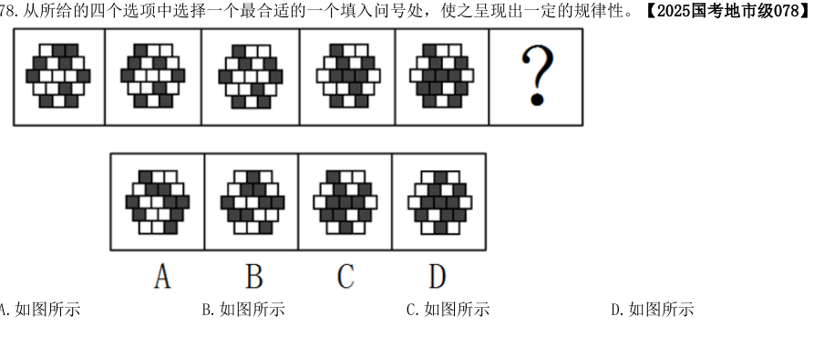

**79.** 从所给的四个选项中选择一个最合适的一个填入问号处，使之呈现出一定的规律性。【2025国考地市级079】 2025年国家公务员录用考试《行测》真题（地市卷-考生回忆版）---估分  `[2025·地市·79]`
- A. 如图所示
- B. 如图所示
- C. 如图所示
- D. 如图所示

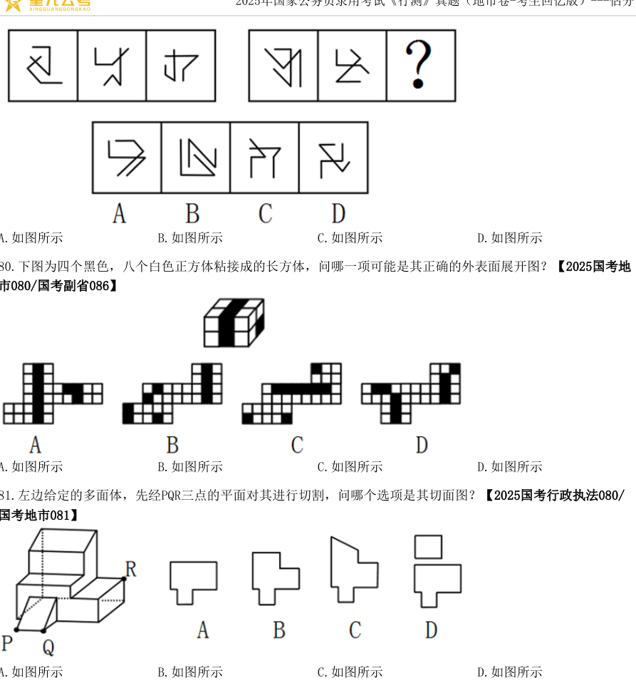

**80.** 下图为四个黑色，八个白色正方体粘接成的长方体，问哪一项可能是其正确的外表面展开图？【2025国考地市080/国考副省086】  `[2025·地市·80]`
- A. 如图所示
- B. 如图所示
- C. 如图所示
- D. 如图所示

**81.** 左边给定的多面体，先经PQR三点的平面对其进行切割，问哪个选项是其切面图？【2025国考行政执法080/国考地市081】  `[2025·地市·81]`
- A. 如图所示
- B. 如图所示
- C. 如图所示
- D. 如图所示

**82.** 左边为15个白色和三个灰色正方体组成的多面体的正反两面直观图，其可以由1、2、3三个多面体组合而成。问哪一项能填入问号处？【2025国考地市082/国考副省085】 2025年国家公务员录用考试《行测》真题（地市卷-考生回忆版）---估分  `[2025·地市·82]`
- A. 如图所示
- B. 如图所示
- C. 如图所示
- D. 如图所示

**83.** 下面把六个图形分为两类，使每一类图形都有各自的共同特征或规律，分类正确的一项是：【2025国考地市级083】  `[2025·地市·83]`
- A. ①②④，③⑤⑥
- B. ①②⑥，③④⑤
- C. ①③⑥，②④⑤
- D. ①④⑤，②③⑥

**84.** 下面把六个图形分为两类，使每一类图形都有各自的共同特征或规律，分类正确的一项是：【2025国考地市级084】  `[2025·地市·84]`
- A. ①②③，④⑤⑥
- B. ①②⑤，③④⑥
- C. ①②⑥，③④⑤
- D. ①③⑥，②④⑤

**85.** 下面把六个图形分为两类，使每一类图形都有各自的共同特征或规律，分类正确的一项是：【2025国考行政执法085/国考地市085】 2025年国家公务员录用考试《行测》真题（地市卷-考生回忆版）---估分  `[2025·地市·85]`
- A. ①②⑥，③④⑤
- B. ①③④，②⑤⑥
- C. ①③⑤，②④⑥
- D. ①④⑥，②③⑤

**86.** 土地监测是利用遥感、遥测技术，对一个国家或地区土地利用状况的动态变化进行定期或不定期的监视和测定，目的在于为国家和地区有关部门提供准确的土地利用变化情况、及时进行土地利用数据更新与对比分析，以便编制土地利用变化图解等。根据上述定义，下列属于土地监测的是：  `[2025·地市·86]`
- A. 利用定期现场踏勘的方式标绘各土地使用单位及各类型土地的界线，对变化的地物界线作出修正
- B. 通过量化多时相遥感图像空间域、时间域、光谱域的耦合特征，获得土地变化的类型、位置和数量
- C. 通过某地区土地权属变更资料的分析，梳理该地区土地所有权、使用权的变化，以及土地纠纷调解情况
- D. 利用植被具有红光强吸收特点，通过遥感设备监测植被的生长状态，并绘制植被的生长周期图

**87.** 主体间性是指人对他人意图的判断与推测。主体间性有不同的级别，一级主体间性即人对另一个人意图的判断与推测，二级主体间性即人对另一人关于其他人意图的判断与推测的认知的认识。根据上述定义，下列体现了二级主体间性的是：  `[2025·地市·87]`
- A. 小明饿了，去问妈妈饭做好没有，妈妈说爸爸正在做
- B. 老师知道学生们不喜欢做作业，周五就在班级群里通知本周末不留作业
- C. 小花看见妈妈冲爸爸使了个眼色后，爸爸尴尬地放下酒杯，小花偷偷地笑了
- D. 小王知道老板爱挑毛病，每次提交的总结都得仔细检查好几遍

**88.** 回应型预算要求政府基于与人民的民主协商作出预算决策、相关责任部门应当及时反应并积极回复人民的质疑和诉求。根据上速定义，下列属于回应型预算的是：  `[2025·地市·88]`
- A. 甲国突发大规模严重旱情，财政部门从中央及各级政府应急预算中，通过多种财政政策安排，保障应急救援经费
- B. 乙省是地质灾害高发地区，年初该省编制《乙省地质灾害应急中心××年度部门预算公开说明》并在官网上发布
- C. 丙市在年初将上一年度的地方预算执行情况在官网进行公布，诚邀广大市民和社会公众踊跃监督并提出意见
- D. 丁区实行预算听证制度，对与公共服务和社会民生相关的重大支出项目开展听证，并就意见和建议进行书面答复

**89.** 温度习服是指机体长期在高温或低温环境中，逐渐产生的对环境温度的耐受现象，包括热习服和冷习服。热2025年国家公务员录用考试《行测》真题（地市卷-考生回忆版）---估分习服是指机体长期生活或工作在炎热或高温环境后产生的适应性变化；冷习服是指机体长期暴露于寒冷环境后逐渐出现的适应性变化。根据上述定义，下列属于温度习服的是：  `[2025·地市·89]`
- A. 生活在北极的因纽特人常表现出较高的基础代谢率以维持体温
- B. 长期接受滑雪训练的人都会穿着防水防风、透气保暖的滑雪服进行运动
- C. 生活在缺氧、干燥、紫外线照射强烈的高原地区的人，脸部呈现出“高原红”特征
- D. 在寒冷天气进行体育锻炼的人，倾向于增加热身时间以适应气温

**90.** 形象史学是指把形与象作为主要材料，用以研究历史的一门学问。具体来说，是指把传世的包括出土(水)的具有研究价值的石刻、陶望、壁画、雕砖、铜玉、织绣、漆器、木器、绘画等历史实物、文本图像以及文化史迹作为主要研究对象，并结合传统文献来综合考察历史的一种新的史学研究模式。根据上述定义、下列属于形象史学研究范畴的是：  `[2025·地市·90]`
- A. 通过对现存的汉画像石(汉代人雕刻在墓室、祠堂四壁的装饰石刻壁画)的实地考察，分析汉画像石的雕刻风格和雕刻技法
- B. 根据史诗《伊利亚特》的记载，找到特洛伊城的遗址，并在其中发掘出王冠、银瓶、短剑等大量器物
- C. 通过对二十世纪二三十年代齐白石、傅抱石等人具有代表性的国画作品进行研究、分析当时国画中所蕴含的思想意境
- D. 结合《晋书》等史书，通过对吉林集安长川1号墓礼佛图主佛形象及莲花纹的考察，研究三燕文化对高句丽佛教产生的影响

**91.** 求证思维是指用自己掌握的知识和经验去验证某一结论的思维。转化思维是指在解决问题的过程中遇到障碍时，把问题转换成另一种形式，使问题变得更简单、更清晰。集中思维是指从许多资料中找出合乎逻辑的联系，从而导出一定的结论，或者对几种解决方案加以比较研究，进而导出一种解决办法。根据上述定义，下列说法正确的是：  `[2025·地市·91]`
- A. 修建铁路时，工程师依据施工方案采用爆破的方法开山劈岭，完成线路铺设。这体现了集中思维
- B. 当发现改变滚珠形状无法减少轴承摩擦时，有人设计出使旋转轴呈悬浮状的空气轴承。这体现了集中思维
- C. 数学家根据自己所学，从多角度证明某一命题是否成立。这体现了求证思维
- D. 商家通过分析药店互联网化的不同方案，权衡利弊后最终选定线上线下相结合的模式。这体现了转化思维

**92.** 自动投案是指犯罪事实或者犯罪嫌疑人未被司法机关发觉，或者虽被发觉，但犯罪嫌疑人尚未受到讯问、未被采取强制措施时，主动、直接向公安机关、人民检察院或者人民法院投案。根据上述定义，下列不属于自动投案的是：  `[2025·地市·92]`
- A. 甲实施多起电信诈骗，获利十余万元，在公安机关进行的一次隐患排查入户走访中，发现甲形迹可疑，经盘问甲主动交代了自己的罪行
- B. 乙致人重伤后潜逃，在公安机关经侦查确认乙为该案的犯罪嫌疑人时，乙正因酒后驾驶被行政拘留，经公安机关讯问后，乙交代了自己的罪行
- C. 丙多次挪用公款，其父母发现异常后，多次规劝其投案自首无效，直至单位发现款项异常开始查账后，丙才到公安机关交代自己的罪行
- D. 丁入室盗窃被判处有期徒刑，在服刑期间，丁主动向公安机关交代自已系公安机关久未破获的“7·26”走私案的主谋之一

**93.** 深度优先搜索是指从初始节点出发，按照一定的顺序扩展到下一个节点，然后从下一个节点出发继续扩展到新的节点，不断递归执行这个过程，直到某个节点不能再扩展到下一个节点，此时返回上一个节点重新寻找一个新的节点继续扩展，如此搜索下去，直到找到目标节点，或者搜索完所有节点为止。根据上述定义，如果以“1”为初始节点，“12”为目标节点，下列搜索路径符合深度优先搜索的是：2025年国家公务员录用考试《行测》真题（地市卷-考生回忆版）---估分  `[2025·地市·93]`
- A. 1→2→1→3→6→11→12
- B. 1→3→5→3→7→3→6→12
- C. 1→4→8→4→1→3→6→12
- D. 1→3→5→10→5→3→1→3→6→12

**94.** 企业薪酬策略主要包括两个方面：一是体现企业支付标准的策略，即薪酬水平策略，其本质是在市场既定的薪酬水平上设定一个对公司有利的最优报酬水平；二是体现企业支付差异的策略，即薪酬结构策略，其通过企业的工资等级和工资幅度、加薪条件、晋升降级、小时工资、加班休假、工作时间等方面的薪酬政策表现出来。根据上述定义，下列说法正确的是：  `[2025·地市·94]`
- A. 甲企业根据市场调查结果，设定行政岗位的薪酬标准。这体现了薪酬结构策略
- B. 乙企业今年赢利颇丰，企业将全员工资普遍调高。这体现了薪酬水平策略
- C. 丙企业工资分为基本工资和绩效工资两部分，绩效工资与员工绩效挂钩。这体现了薪酬水平策略
- D. 丁企业采取不同方式调整高、中、低三个职位层次人员的薪酬。这体现了薪酬水平策略

**95.** 断取是修辞格的一种，引用词语时，只截取其中部分字眼的意义，而置其余于不顾，是一种“断章取义”的修辞方式。根据上述定义，下列没有采用断取修辞方式的是：  `[2025·地市·95]`
- A. 实在走投无路，他最终还是找老师“开药方”，问询这一困局的破解之道
- B. 相较于他之前见过的大阵仗，眼前的情形在他眼中就是“小儿科”
- C. 小林一心扑在科研项目上，他至今还是一个“光杆司令”呢
- D. 山林发生火灾，消防员“上刀山下火海”，奋力保卫人民的生命和财产安全

**96.** 殚精竭虑∶处心积虑  `[2025·地市·96]`
- A. 足智多谋∶诡计多端
- B. 死灰复燃∶东山再起
- C. 耳濡目染∶潜移默化
- D. 捕风捉影∶无中生有

**97.** 逐客令∶挡箭牌  `[2025·地市·97]`
- A. 急先锋∶领航者
- B. 避风港∶马后炮
- C. 敲门砖∶绊脚石
- D. 鸿门宴∶攻心计

**98.** 直观性∶即时性∶网络直播  `[2025·地市·98]`
- A. 等边性∶对称性∶等腰梯形
- B. 周期性∶延展性∶机械钟摆
- C. 公开性∶权威性∶行政法律
- D. 挥发性∶保温性∶石棉纤维

**99.** 群众来访∶窗口接访∶调查督办  `[2025·地市·99]`
- A. 建造堤坝∶潮汐发电∶送电入户
- B. 地面试验∶点火飞行∶燃料加注
- C. 支付本币∶兑换外币∶确认汇率
- D. 重启谈判∶临时休战∶边境冲突

**100.** 稀树草原  对于 （   ） 相当于 （   ） 对于  国际公约  `[2025·地市·100]`
- A. 物种多样性  缔约国家
- B. 落叶阔叶林  多边条约
- C. 气候变迁  政治协调
- D. 植被类型  联合国宪章2025年国家公务员录用考试《行测》真题（地市卷-考生回忆版）---估分

**101.** 研究者设计了一个“拔河比赛”的实验，要求被试分别在单独和群体的情境下拔河，同时用仪器来测量他们的拉力。结果发现随着被试人数的增加，平均每个被试使出的力减少了。据此研究者认为，提高团队业绩的最佳途径就是减少团队人数。以下各项如果为真，除哪项外均能质疑上述研究者的观点？  `[2025·地市·101]`
- A. 团队合作中各取所长很重要，人数过少效率也会随之下降
- B. 团队一起工作时，个人的贡献不被凸显，很容易失去积极性
- C. 团队的合作与管理方式要比拔河复杂得多，不能一概而论
- D. 增强个体对团队的归属感、责任感，能够更好地提高团队业绩

**102.** 考古人员发现了近300枚16亿年前的丝状体生物化石，这些丝状体均由巨型细胞组成，直径20~194微米不等。化石中、有些丝状体直径保持不变，细胞呈短柱状至长柱状；有些丝状体整体向一端均匀收缩，细胞呈柱状、桶状或杯状；而有的丝状体仅一端变细，形态呈现了一定的复杂性。考古人员据此认为，这些丝状体很可能属于真核生物。以下各项如果为真，除哪项外均能支持上述观点？  `[2025·地市·102]`
- A. 在目前已知的原核生物中，大多数的丝状体形态都比较简单，只有个别呈现出过渡期形态
- B. 这些化石中被发现有类似于现生繁殖细胞——孢子一样的圆形结构，这一结构只出现在真核生物中
- C. 原核生物细胞的直径一般小于2微米，而真核生物细胞的直径一般在10~100微米之间
- D. 经比对，该化石中丝状体与一些现生绿藻(一种真核生物)的藻丝体形态，细胞大小分布和繁殖方式等最为接近

**103.** 某企业对于如何进行产教融合，形成如下两种方案：一是“做深”，企业自建培训中心，成立专职和兼职的企业培训师队伍，并根据企业需求，制定专门的培训大纲和计划，该中心与毕业生未来形成签约。二是“做浅”，在学校设立“冠名班”和“订单班”，以学校教育为主，企业与学生当前没有签约意向，但随时保持互相选择的权利。以下理由中，能够支持企业选择第二方案的是:  `[2025·地市·103]`
- A. 企业必须付出人力成本，人力资源自带“稀缺”和“增值”属性，在企业面临竞争压力时尤其要重视
- B. 该企业生产使用的是特种专业设备，竞争对手稀少，不具备从市场上挖掘技术人员的条件
- C. 企业订单量并不是稳定的，遇到订单量突然增加需要扩产的时候，才临时需要大量的人参与进来
- D. 学校教育内容具有普适性，而自建培训中心有利于企业保障准员工的培养质量，提前锁定毕业生

**104.** 我军军语惯于将数字 1、2、7、9、0变读为幺、两、拐、勾、洞。这些数字有个共同特点，即其原本的发音部位与发音方法使得在读这些数字时无法发出较大声音。在噪声干扰较为强烈的战场上，通信兵使用通讯设备进行情报交流时，话筒对这些数字的实际增音效果并不明显，可能会影响信息的准确性。因此，在军语中将这些数字变读，是为了符合实际需要。以下哪项如果为真，不能支持上述结论？  `[2025·地市·104]`
- A. 常规数字念法中1、7的韵尾相同，发音相似，在嘈杂的战场环境中容易混淆，造成信息传达错误
- B. 士兵一般都来自不同的兵源地，不可避免地带有家乡口音，将数字变读可以避免口音问题
- C. 将0读成“洞”时，更容易提高声音，同时也使声音更加干脆清晰，确保信息的准确性
- D. 在国际无线电通话中，也会对字母读音进行变读，如将A读成Alpha,将D读成Delta

**105.** 海山是海面下的岛屿，与岛屿中的火山岛有相同的起源和相似的形态。以往的海山生物调查发现，海山岩石上的生物群落与海山周边的软底沉积和深海平原上的生物群落大不相同。而且，一些海山之间的生物群落在物种构成上较少重叠。因此，有一些学者认为，相对孤立的海山存在独特的生物群落且拥有高度特有的动物群。以下哪项如果为真，最能反驳上述学者的观点？  `[2025·地市·105]`
- A. 远离大陆的孤岛，因为海洋的分割往往会形成相对孤立且独特的岛屿生物群
- B. 物理隔离海洋的现象在海洋中很少出现，所以海山不可能长期被隔离成水下孤岛
- C. 地形和海流的相互作用在某些海山顶部形成封闭环流，使栖息其上的生物幼体难以扩散2025年国家公务员录用考试《行测》真题（地市卷-考生回忆版）---估分
- D. 早期一些海山中发现的高度特有物种其实是采样不足造成的，很多海山都有相同的生物来源某科研机构今年拟举办甲、乙、丙、丁、戊、己、庚、辛8次学术会议，每个季度最多举办3次，且各次会议举办时间不重叠。具体安排要求如下：（1）丁、辛安排在第二季度；（2）甲、戊安排在同一个季度；（3）丁在乙之后丙之前举办；（4）丙在甲之前己之后举办。

**106.** 如果第二季度只安排2次会议，那么以下哪次会议一定安排在第一季度？  `[2025·地市·106]`
- A. 甲
- B. 乙
- C. 庚
- D. 丙

**107.** 下列哪2次会议可以安排在第一季度？  `[2025·地市·107]`
- A. 甲和戊
- B. 丙和丁
- C. 丁和己
- D. 己和庚

**108.** 如果每个季度至少安排1次会议，并且最后一个季度仅安排1次会议，下列哪2次会议一定安排在第三季度？  `[2025·地市·108]`
- A. 甲和戊
- B. 乙和丙
- C. 丙和己
- D. 己和庚

**109.** 如果丙、戊安排在第四季度，下列哪2次会议可以安排在第三季度？  `[2025·地市·109]`
- A. 甲和庚
- B. 乙和丁
- C. 己和庚
- D. 乙和己

**110.** 如果甲安排在第三季度，第四季度不安排会议，庚不可能和哪次会议安排在同一季度？  `[2025·地市·110]`
- A. 乙
- B. 丙
- C. 己
- D. 辛

## 2025年 · 行政执法类

**76.** 从所给的四个选项中选择一个最合适的一个填入问号处，使之呈现出一定的规律性。【2025国考行政执法076/国考地市077】  `[2025·执法·76]`
- A. 如图所示
- B. 如图所示
- C. 如图所示
- D. 如图所示

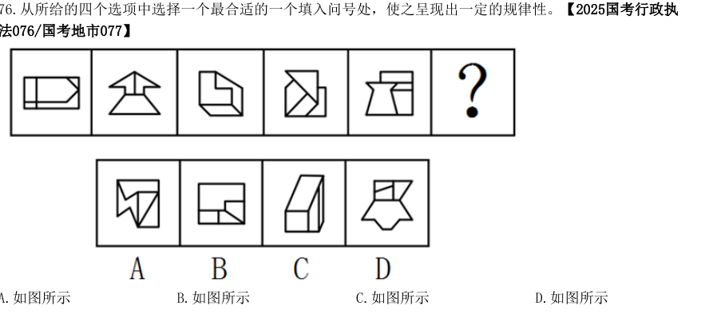

**77.** 从所给的四个选项中，选择最合适的一个填入问号处，使之呈现一定的规律性：【2025国考行政执法077】  `[2025·执法·77]`
- A. 如图所示
- B. 如图所示
- C. 如图所示
- D. 如图所示

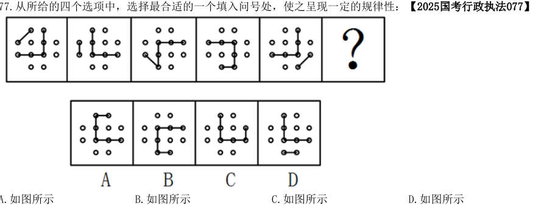

**78.** 从所给的四个选项中，选择最合适的一项填入问号处，使之呈现一定的规律性：【2025国考行政执法078/国考副省082】  `[2025·执法·78]`
- A. 如图所示
- B. 如图所示
- C. 如图所示
- D. 如图所示2025年国家公务员录用考试《行测》真题（行政执法卷-考生回忆版）---估分

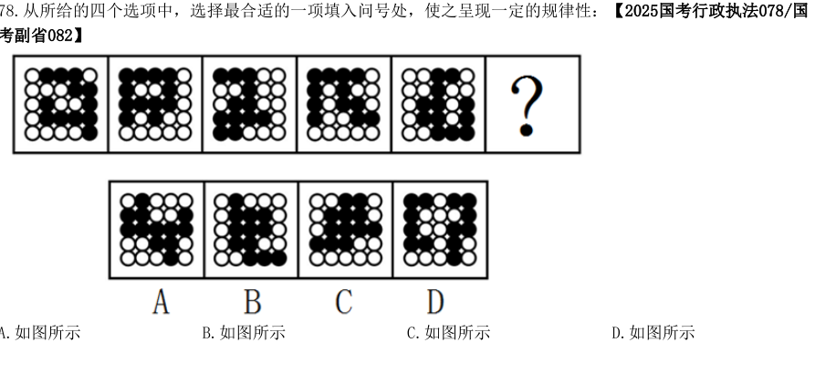

**79.** 从所给的四个选项中，选择最合适的一个填入问号处，使之呈现一定的规律性：【2025国考行政执法079/国考副省084】  `[2025·执法·79]`
- A. 如图所示
- B. 如图所示
- C. 如图所示
- D. 如图所示

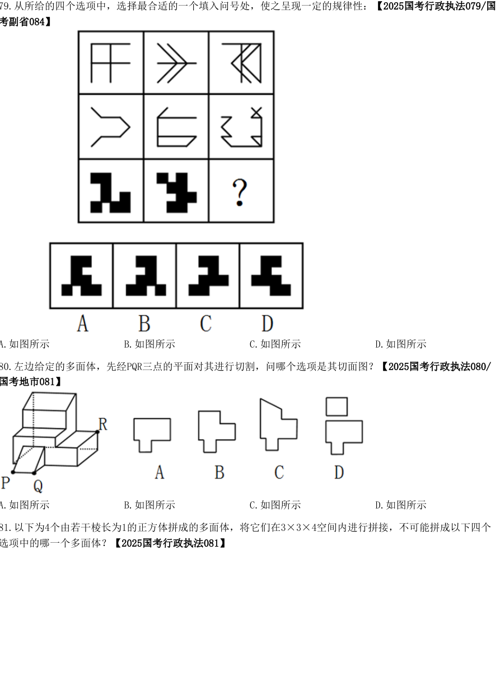

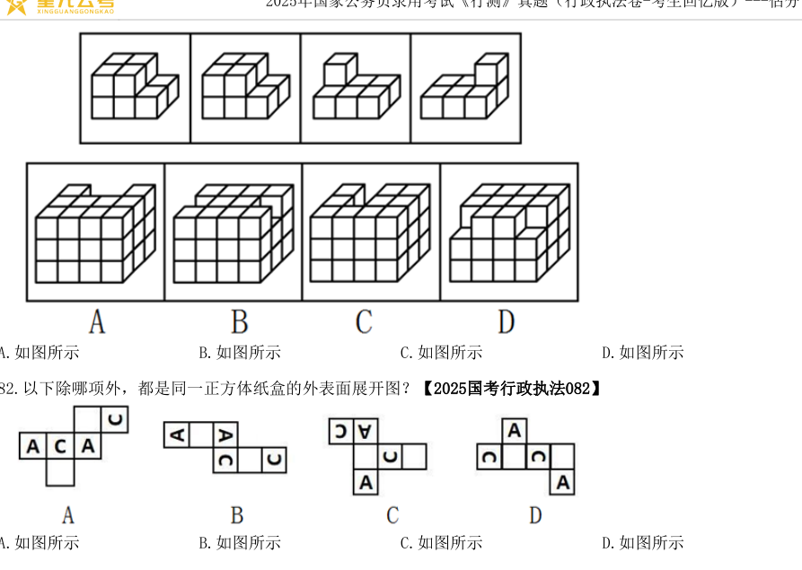

**80.** 左边给定的多面体，先经PQR三点的平面对其进行切割，问哪个选项是其切面图？【2025国考行政执法080/国考地市081】  `[2025·执法·80]`
- A. 如图所示
- B. 如图所示
- C. 如图所示
- D. 如图所示

**81.** 以下为4个由若干棱长为1的正方体拼成的多面体，将它们在3×3×4空间内进行拼接，不可能拼成以下四个选项中的哪一个多面体？【2025国考行政执法081】 2025年国家公务员录用考试《行测》真题（行政执法卷-考生回忆版）---估分  `[2025·执法·81]`
- A. 如图所示
- B. 如图所示
- C. 如图所示
- D. 如图所示

**82.** 以下除哪项外，都是同一正方体纸盒的外表面展开图？【2025国考行政执法082】  `[2025·执法·82]`
- A. 如图所示
- B. 如图所示
- C. 如图所示
- D. 如图所示

**83.** 把下面的六个图形分为两类，使每一类图形都有各自的共同特征或规律，分类正确的一项是：【2025国考行政执法083/国考副省088】  `[2025·执法·83]`
- A. ①②④，③⑤⑥
- B. ①③⑤，②④⑥
- C. ①③④，②⑤⑥
- D. ①③⑥，②④⑤

**84.** 把下面的六个图形分为两类，使每一类图形都有各自的共同特征或规律，分类正确的一项是：【2025国考行政执法084/国考副省089】 2025年国家公务员录用考试《行测》真题（行政执法卷-考生回忆版）---估分  `[2025·执法·84]`
- A. ①②③，④⑤⑥
- B. ①⑤⑥，②③④
- C. ①②④，③⑤⑥
- D. ①③⑤，②④⑥

**85.** 下面把六个图形分为两类，使每一类图形都有各自的共同特征或规律，分类正确的一项是：【2025国考行政执法085/国考地市085】  `[2025·执法·85]`
- A. ①②⑥，③④⑤
- B. ①③④，②⑤⑥
- C. ①③⑤，②④⑥
- D. ①④⑥，②③⑤

**86.** 后视错觉是个体的一种认知偏差，是指在一件事情已经发生之后，即使个体之前没有对此做过预判，也认为自己“早就知道会这样”。根据上述定义，下列符合后视错觉的是：  `[2025·执法·86]`
- A. 小瑾是一个悲观的人，她申请升职失败后，灰心丧气地说：“我早就知道，我什么都不如别人，什么也做不好。”
- B. 朋友邀阿欣去爬山，阿欣说高温预警不宜爬山，朋友坚持去，才到半山腰就汗流浃背，阿欣说：“我早就说2025年国家公务员录用考试《行测》真题（行政执法卷-考生回忆版）---估分会很热啊。”
- C. 晓琳参加一个重要会议迟到了。她懊悔地说：“我早该想到周一早上会堵车，不该按周末的情况预估通勤时间。”
- D. 晓菲在股票大跌之后，懊恼地说：“我早就觉察到那些信号了，觉得走势不太好，怎么就没有早卖出啊。”

**87.** 选择或然率理论解释的是影响受众对大众传播内容选择的决定性因素。该理论的核心公式是：选择或然率=报偿的保证/费力的程度。其中，报偿的保证指的是传播内容满足选择者需要的程度，即内容对于受众的吸引力和实用性；费力的程度指的是获取传播内容和使用传播途径的难度。根据上述定义，下列属于提高选择或然率的传播行为的是：  `[2025·执法·87]`
- A. 视频号平台借助数据分析和个性化算法，给用户推荐符合其偏好的视频
- B. 时下流行的某影视作品在播放之前被插入一段2分钟的广告
- C. 某商家优化了商品布局，将畅销商品放在出口处，顾客可直接扫码支付
- D. 电视内置视频播放软件，开机后须先注册登录，才可搜索相关内容观看

**88.** 自动投案是指犯罪事实或者犯罪嫌疑人未被司法机关发觉，或者虽被发觉，但犯罪嫌疑人尚未受到讯问、未被采取强制措施时，主动、直接向公安机关、人民检察院或者人民法院投案。根据上述定义，下列不属于自动投案的是：  `[2025·执法·88]`
- A. 甲实施多起电信诈骗，获利十余万元，在公安机关进行的一次隐患排查入户走访中，发现甲形迹可疑，经盘问甲主动交代了自己的罪行
- B. 乙致人重伤后潜逃，在公安机关经侦查确认乙为该案的犯罪嫌疑人时，乙正因酒后驾驶被行政拘留，经公安机关讯问后，乙交代了自己的罪行
- C. 丙多次挪用公款，其父母发现异常后，多次规劝其投案自首无效，直至单位发现款项异常开始查账后，丙才到公安机关交代自己的罪行
- D. 丁入室盗窃被判处有期徒刑，在服刑期间，丁主动向公安机关交代自已系公安机关久未破获的“7·26”走私案的主谋之一

**89.** 三维反求是测量技术、数据处理技术、图形处理技术和加工技术相结合的综合性技术，是指用一定的测量方法对实物进行测量，根据测量数据通过三维几何建模方法重构实物的数字化模型的过程。根据上述定义，下列关于三维反求工程的步骤，排序正确的是：①通过制造样品来验证模型是否满足精度和其他性能指标②通过一定的算法，从测量数据中提取零件的设计与加工特征③使用高精度的三维测量技术获取零件表面各点的空间坐标④使用计算机辅助设计软件将数据与特征重构为三维模型  `[2025·执法·89]`
- A. ①③④②
- B. ①④③②
- C. ③①②④
- D. ③②④①

**90.** 都、国、鄙、邑四个词在古汉语中表示不同的概念。“国”既可以指诸侯的封地，又可以指天子或诸侯的都城。“都”本义是大城邑，后引申为具有重要政治地位的大城邑。“鄙”在古汉语中是指边邑，即边远的小城。“邑”在古汉语中是指城镇。下列图示对上述概念关系的描述，正确的是：  `[2025·执法·90]`
- A. 如图所示
- B. 如图所示
- C. 如图所示
- D. 如图所示

**91.** 流域内降雨或融冰化雪都可以引起河水显著上涨。春季，气候转暖，流域内的季节性积雪融化、河流解冻或2025年国家公务员录用考试《行测》真题（行政执法卷-考生回忆版）---估分春雨，引起河水上涨称春汛。因正值桃花盛开时节，故亦称桃汛。我国北方，把春季河冰解冻引起的涨水现象专称为凌汛。夏季，流域内的暴雨或高山冰川和积雪融化，使河水急剧上涨，称夏汛。我国习惯上把发生在夏季三伏前后的汛水称为伏汛。秋季由于暴雨，河水发生急剧上涨称秋汛。根据上述定义，下列判断错误的是：  `[2025·执法·91]`
- A. 春汛包含凌汛
- B. 夏汛包含伏汛
- C. 伏汛在凌汛前
- D. 春汛就是桃汛

**92.** 断取是修辞格的一种，引用词语时，只截取其中部分字眼的意义，而置其余于不顾，是一种“断章取义”的修辞方式。根据上述定义，下列没有采用断取修辞方式的是：  `[2025·执法·92]`
- A. 实在走投无路，他最终还是找老师“开药方”，问询这一困局的破解之道
- B. 相较于他之前见过的大阵仗，眼前的情形在他眼中就是“小儿科”
- C. 小林一心扑在科研项目上，他至今还是一个“光杆司令”呢
- D. 山林发生火灾，消防员“上刀山下火海”，奋力保卫人民的生命和财产安全

**93.** 细胞化学是研究细胞的化学成分及其在细胞活动中的变化和定位的学科。具体来说，细胞化学是在不破坏细胞形态结构的状况下，用生化的和物理的技术对细胞的各种组分做定量分析，研究其动态变化，了解细胞代谢过程中各种细胞组分的作用。根据上述定义，下列属于细胞化学研究范围的是：  `[2025·执法·93]`
- A. 观察玉米根系细胞从周围环境中摄取营养的能力以及受环境影响产生的活动
- B. 根据哺乳动物细胞内核酸、蛋白质吸收不同紫外光的特点，分析其含量
- C. 抽取患者骨髓液，根据显微镜下骨髓细胞的不同形态，判断患者的疾病种类
- D. 研究小鼠免疫细胞受病原体侵入后，病原体释放毒素杀死免疫细胞的动态过程

**94.** 同一认定是指侦查中具有专门知识的人或了解客体特征的人，通过比较先后出现的客体的特征而对客体是否同一做出的判断。这里所说的客体是指与案件有关联的人或物。根据上述定义，下列属于同一认定的是：  `[2025·执法·94]`
- A. 通过对手机中所存储的信息进行检查，确定其是否为报案人所丢失的手机
- B. 通过对犯罪现场提取的DNA信息与DNA信息库进行比对，查找犯罪嫌疑人
- C. 通过对走私案中所缴获的走私物品进行多次鉴定，认定其是否为国外某厂家所生产
- D. 通过对犯罪嫌疑人车上所收缴的各类物品进行检验，判断其是否属于违禁物品

**95.** 土地监测是利用遥感、遥测技术，对一个国家或地区土地利用状况的动态变化进行定期或不定期的监视和测定，目的在于为国家和地区有关部门提供准确的土地利用变化情况、及时进行土地利用数据更新与对比分析，以便编制土地利用变化图解等。根据上述定义，下列属于土地监测的是：  `[2025·执法·95]`
- A. 利用定期现场踏勘的方式标绘各土地使用单位及各类型土地的界线，对变化的地物界线作出修正
- B. 通过量化多时相遥感图像空间域、时间域、光谱域的耦合特征，获得土地变化的类型、位置和数量
- C. 通过某地区土地权属变更资料的分析，梳理该地区土地所有权、使用权的变化，以及土地纠纷调解情况
- D. 利用植被具有红光强吸收特点，通过遥感设备监测植被的生长状态，并绘制植被的生长周期图

**96.** 嘤其鸣矣:求其友声  `[2025·执法·96]`
- A. 遏其生气:以求重价
- B. 求之其本:经旬必得
- C. 道不拾遗:夜不闭户
- D. 避其锐气:击其惰归

**97.** 殚精竭虑:费尽心机  `[2025·执法·97]`
- A. 狐假虎威:虚张声势
- B. 舍生忘死:死里逃生
- C. 侃侃而谈:喋喋不休
- D. 光怪陆离:五光十色

**98.** 群众来访∶窗口接访∶调查督办  `[2025·执法·98]`
- A. 建造堤坝∶潮汐发电∶送电入户
- B. 地面试验∶点火飞行∶燃料加注2025年国家公务员录用考试《行测》真题（行政执法卷-考生回忆版）---估分
- C. 支付本币∶兑换外币∶确认汇率
- D. 重启谈判∶临时休战∶边境冲突

**99.** 收集罪证:提取指纹:透明胶  `[2025·执法·99]`
- A. 温度不当:叶子发黄:营养液
- B. 逃生自救:敲碎车窗:安全锤
- C. 道路施工:设置防护:混凝土
- D. 冷风侵入:肩周疼痛:艾草贴

**100.** 行政文书  对于  （   ）  相当于  （   ）  对于  汇编语言  `[2025·执法·100]`
- A. 行政机关  编程人员
- B. 行政管理  传送指令
- C. 商务文书  符号语言
- D. 监管函  计算机语言

**101.** 研究者设计了一个“拔河比赛”的实验，要求被试分别在单独和群体的情境下拔河，同时用仪器来测量他们的拉力。结果发现随着被试人数的增加，平均每个被试使出的力减少了。据此研究者认为，提高团队业绩的最佳途径就是减少团队人数。以下各项如果为真，除哪项外均能质疑上述研究者的观点？  `[2025·执法·101]`
- A. 团队合作中各取所长很重要，人数过少效率也会随之下降
- B. 团队一起工作时，个人的贡献不被凸显，很容易失去积极性
- C. 团队的合作与管理方式要比拔河复杂得多，不能一概而论
- D. 增强个体对团队的归属感、责任感，能够更好地提高团队业绩

**102.** 随着通货膨胀的蔓延，H国电子企业主要产品的原材料价格大幅上涨。该国最大的电子企业公报显示，今年该企业智能手机应用处理器价格较上年上涨30%，用于智能手机的相机模块价格上涨11%，用于电视和显示器的面板价格上涨9%。H国经济界认为，电子企业原材料价格居高不下，将严重削弱该国电子企业在国际市场上的竞争力。以下哪项如果为真，最能支持上述结论？  `[2025·执法·102]`
- A. 近年来，无论是国际还是国内，硅化合物价格始终呈上涨趋势，这是导致H国电子企业主要产品原材料价格大幅上涨的原因
- B. 在H国电子企业主要产品的原材料价格大幅上涨的同时，由于购买力下降等原因，电子产品的全球消费需求在缩减
- C. 其他国家电子企业都在通过科技创新降低产品原材料价格上涨的影响，以求通过低价在竞争激烈的国际电子产品市场中脱颖而出
- D. 一直以来，H国电子企业生产的产品以其卓越的技术和质量优势在国际市场上极具竞争力，近年来这种竞争优势在逐渐减弱

**103.** 考古人员发现了近300枚16亿年前的丝状体生物化石，这些丝状体均由巨型细胞组成，直径20~194微米不等。化石中、有些丝状体直径保持不变，细胞呈短柱状至长柱状；有些丝状体整体向一端均匀收缩，细胞呈柱状、桶状或杯状；而有的丝状体仅一端变细，形态呈现了一定的复杂性。考古人员据此认为，这些丝状体很可能属于真核生物。以下各项如果为真，除哪项外均能支持上述观点？  `[2025·执法·103]`
- A. 在目前已知的原核生物中，大多数的丝状体形态都比较简单，只有个别呈现出过渡期形态
- B. 这些化石中被发现有类似于现生繁殖细胞——孢子一样的圆形结构，这一结构只出现在真核生物中
- C. 原核生物细胞的直径一般小于2微米，而真核生物细胞的直径一般在10~100微米之间
- D. 经比对，该化石中丝状体与一些现生绿藻(一种真核生物)的藻丝体形态，细胞大小分布和繁殖方式等最为接近

**104.** 某项研究显示，与未接触空气污染的人相比，暴露于空气污染中的人死于乳腺癌的风险增加了80%，死于其他各类癌症的风险增加了22%。该研究团队由此认为，这可能与空气污染物中的PM2.5有关，因为PM2.5会导致脏器的炎症和氧化应激反应。以下哪项如果为真，最可能是上述专家预设的前提？  `[2025·执法·104]`
- A. 脏器的炎症和氧化应激反应是明确的致癌危险因素2025年国家公务员录用考试《行测》真题（行政执法卷-考生回忆版）---估分
- B. PM2.5在大气成分中含量较少，但对空气质量有重要影响
- C. 吸食香烟和电子烟等都可以将PM2.5直接输送到肺部
- D. 女性更易接触烹饪油烟，其中含有大量的PM2.5

**105.** 某桃园5月份对其种植的蟠桃进行套袋。6月份，桃果出现异常，50克左右的大果很少；10余克的小果特别多，约占75%，正常情况下，此时果实应重50克左右。有人推测，今年出现小果占比过大是由于套袋较早造成的，因为过早套袋会使果实失去营养竞争力，在营养供应不足的情况下，果实竞争不过新梢。以下哪项如果为真，最能削弱上述推测？  `[2025·执法·105]`
- A. 今年套果袋时果实大小基本一致，并且期间无病虫危害
- B. 纸袋的遮光作用影响果实光合能力，进而影响甜度
- C. 今年在没有分出大小果实就完成了疏除冗余幼果的操作，留下的不一定是优质大果
- D. 今年桃树长得太快，加之萌芽肥、花后肥都没有追施，导致后期果实营养供应不足某科研机构今年拟举办甲、乙、丙、丁、戊、己、庚、辛8次学术会议，每个季度最多举办3次，且各次会议举办时间不重叠。具体安排要求如下：（1）丁、辛安排在第二季度；（2）甲、戊安排在同一个季度；（3）丁在乙之后丙之前举办；（4）丙在甲之前己之后举办。

**106.** 如果第二季度只安排2次会议，那么以下哪次会议一定安排在第一季度？  `[2025·执法·106]`
- A. 甲
- B. 乙
- C. 庚
- D. 丙

**107.** 下列哪2次会议可以安排在第一季度？  `[2025·执法·107]`
- A. 甲和戊
- B. 丙和丁
- C. 丁和己
- D. 己和庚

**108.** 如果每个季度至少安排1次会议，并且最后一个季度仅安排1次会议，下列哪2次会议一定安排在第三季度？  `[2025·执法·108]`
- A. 甲和戊
- B. 乙和丙
- C. 丙和己
- D. 己和庚

**109.** 如果丙、戊安排在第四季度，下列哪2次会议可以安排在第三季度？  `[2025·执法·109]`
- A. 甲和庚
- B. 乙和丁
- C. 己和庚
- D. 乙和己

**110.** 如果甲安排在第三季度，第四季度不安排会议，庚不可能和哪次会议安排在同一季度？  `[2025·执法·110]`
- A. 乙
- B. 丙
- C. 己
- D. 辛

## 2026年 · 副省级

**81.** 从所给的四个选项中，选择最合适的一个填入问号处，使之呈现一定的规律性：【2026国考行政执法077/国考副省081】  `[2026·副省·81]`
- A. 如图所示
- B. 如图所示
- C. 如图所示
- D. 如图所示

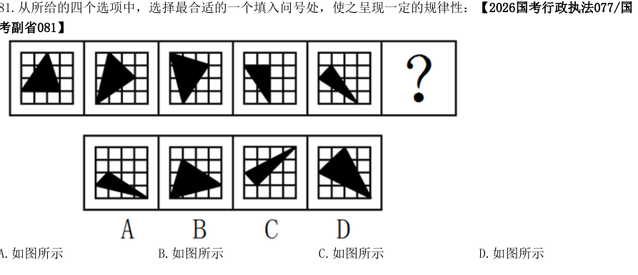

**82.** 从所给的四个选项中，选择最合适的一个填入问号处，使之呈现一定的规律性：【2026国考副省082/国考地2026年国家公务员录用考试《行测》真题（副省卷-考生回忆版）-估分市078】  `[2026·副省·82]`
- A. 如图所示
- B. 如图所示
- C. 如图所示
- D. 如图所示

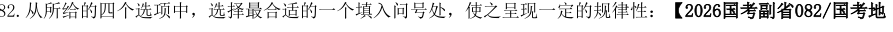

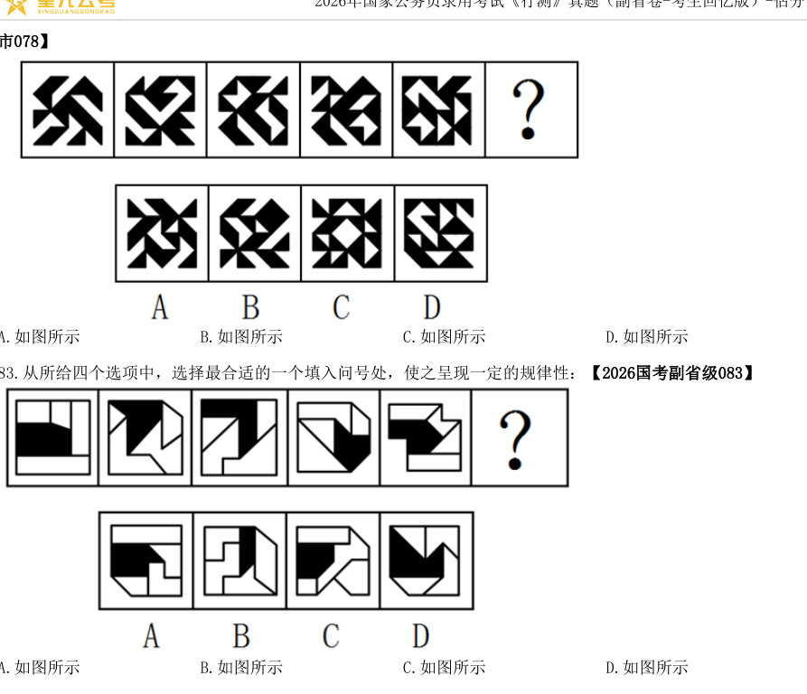

**83.** 从所给四个选项中，选择最合适的一个填入问号处，使之呈现一定的规律性：【2026国考副省级083】  `[2026·副省·83]`
- A. 如图所示
- B. 如图所示
- C. 如图所示
- D. 如图所示

**84.** 从所给的四个选项中，选择最合适的一个填入问号处，使之呈现一定的规律性：【2026国考副省084/国考地市079】 2026年国家公务员录用考试《行测》真题（副省卷-考生回忆版）-估分  `[2026·副省·84]`
- A. 如图所示
- B. 如图所示
- C. 如图所示
- D. 如图所示

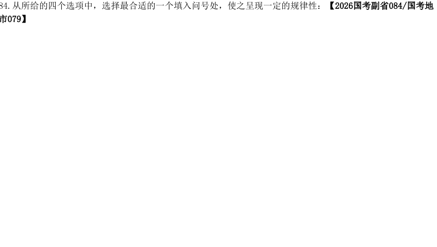

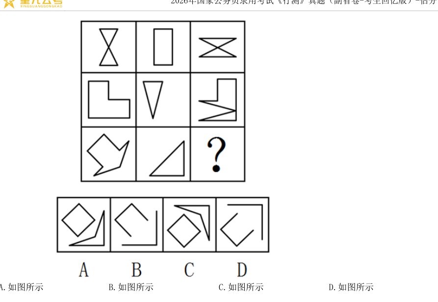

**85.** 从所给的四个选项中，选择最合适的一个填入问号处，使之呈现一定的规律性：【2026国考行政执法078/国考副省085】  `[2026·副省·85]`
- A. 如图所示
- B. 如图所示
- C. 如图所示
- D. 如图所示

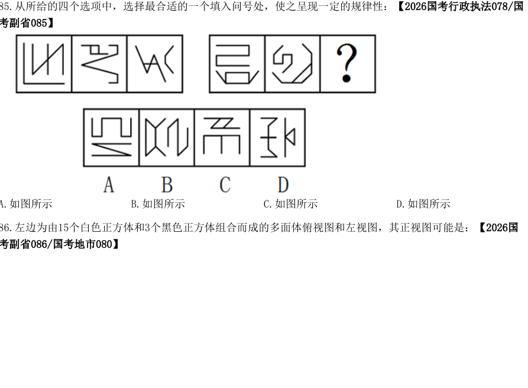

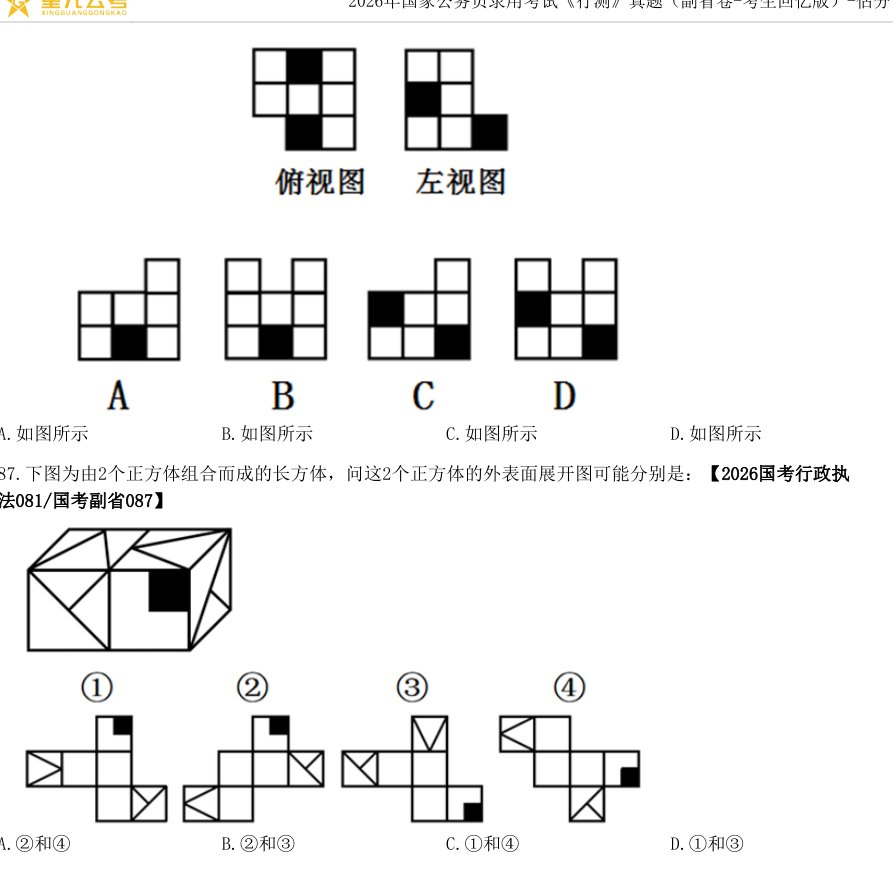

**86.** 左边为由15个白色正方体和3个黑色正方体组合而成的多面体俯视图和左视图，其正视图可能是：【2026国考副省086/国考地市080】 2026年国家公务员录用考试《行测》真题（副省卷-考生回忆版）-估分  `[2026·副省·86]`
- A. 如图所示
- B. 如图所示
- C. 如图所示
- D. 如图所示

**87.** 下图为由2个正方体组合而成的长方体，问这2个正方体的外表面展开图可能分别是：【2026国考行政执法081/国考副省087】  `[2026·副省·87]`
- A. ②和④
- B. ②和③
- C. ①和④
- D. ①和③

**88.** 左边为由12个白色正方体和3个灰色正方体组合而成的多面体前后两面直观图，问其可以由除哪项外的三个多面体组合而成？【2026国考副省级088】 2026年国家公务员录用考试《行测》真题（副省卷-考生回忆版）-估分  `[2026·副省·88]`
- A. 如图所示
- B. 如图所示
- C. 如图所示
- D. 如图所示

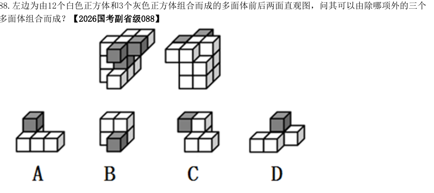

**89.** 把下面的六个图形分为两类，使每一类图形都有各自的共同特征或规律，分类正确的一项是：【2026国考行政执法084/国考副省089/国考地市084】  `[2026·副省·89]`
- A. ①②⑥，③④⑤
- B. ①②④，③⑤⑥
- C. ①⑤⑥，②③④
- D. ①④⑥，②③⑤

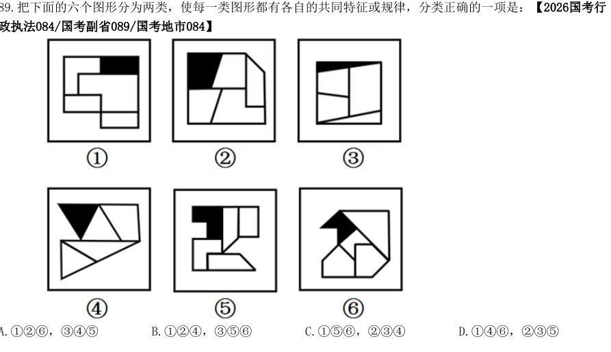

**90.** 把下面的六个图形分为两类，使每一类图形都有各自的共同特征或规律，分类正确的一项是：【2026国考副省090/国考地市083】  `[2026·副省·90]`
- A. ①②③，④⑤⑥
- B. ①③④，②⑤⑥
- C. ①③⑥，②④⑤
- D. ①⑤⑥，②③④

**91.** 均变论认为，支配各种地质过程的法则在地质历史上没有发生过变化，现在起作用的各种自然营力在漫长的地质过程中具有普遍的均一性，即地质具有相同方式和相同的强度；地球上生物的种与演变是一个渐变的过程，种之间有过渡关系，生物进化过程是极其漫长的。灾变论认为，在整个地质发展的过程中，地球经常发生各种突如其来的、短暂的全球性灾难性变化，这些变化强烈地改变了地球的面貌；地球上生物的变化是反复多次灾变的结果。2026年国家公务员录用考试《行测》真题（副省卷-考生回忆版）-估分根据上述定义，下列说法最能体现灾变论观点的是：  `[2026·副省·91]`
- A. “我们找不到开始的痕迹，也看不到结束的迹象”
- B. “地质记录是一部被鲜血和火焰写成的史诗”
- C. “现在是通往过去的一把钥匙”
- D. “自然界里没有飞跃”

**92.** 波特五力模型是一种竞争分析工具，用于评估一个行业的竞争力和吸引力。该模型通过对同行业竞争对手的威胁，潜在进入者的威胁、替代品的威胁、上游供应商的议价能力和下游购买者的议价能力这五个方面的分析，帮助企业了解其所处行业的竞争环境，以制定相应的竞争策略。根据上述定义，关于康复机器人行业，对下列问题的分析不能归入波特五力模型的是：  `[2026·副省·92]`
- A. 康复机器人行业准入门槛高吗？需要强大的技术能力和创新能力吗？
- B. 医院和康复中心患者规模如何？对于康复机器人的需求有多大？
- C. 与传统物理治疗等康复治疗方法相比，康复机器人有竞争力吗？
- D. 康复机器人企业内部各部门之间的协同合作程度高吗？

**93.** 选矿是指用物理、化学或者物理与化学相结合的方法，将原矿中的有用矿物与伴生的无用固定物质（脉石）或有害矿物分开的过程。选矿可显著提高矿石的质量，减少运输费用，降低冶炼成本，进而实现综合利用。根据上述定义，下列没有体现选矿过程的是：  `[2026·副省·93]`
- A. 利用矿物颗粒电性的差别，在高压电场中挑选出白钨矿、赤铁矿等，通过电机分离除尘
- B. 利用水枪和洗矿槽等设备，将锡矿石中的泥土等杂质洗去，同时也可以将部分轻矿物冲走，实现锡石初步富集
- C. 经验丰富的老师傅通过敲击、光照、观察皮壳等方法对开采的翡翠原石进行筛选，挑选优质原石
- D. 将铜矿矿石破碎到一定的粒度后，混以少量的食盐和煤粉隔氧加热，矿石中的铜便以金属状态析出，由此获得铜精矿

**94.** 根据动词对其后所接的宾语小句（作宾语的句子）真值的不同预设能力可以把现代汉语中的相关动词分为叙实动词、非叙实动词和反叙实动词。叙实动词的肯定式和否定式都预设其宾语小句为真；非叙实动词的肯定式和否定式都不预设其宾语小句为真，也不预设其宾语小句为假；反叙实动词的肯定式和否定式都预设其宾语小句为假。根据上述定义，下列画线的动词属于非叙实动词的是：  `[2026·副省·94]`
- A. 我听说他来过这里
- B. 我庆幸听了你的建议
- C. 我知道你帮助过我
- D. 我幻想成为一只小鸟

**95.** 动作预期是指运动员在比赛过程中，根据已有信息，对即将发生的动作结果进行预测的过程。在这一过程中，运动员主要依赖两类信息：运动学信息和情境先验信息。运动学信息包括对手的动作、器材的运动轨迹或队员之间的相对位置，情境先验信息则涉及比赛情境中事件发生的概率。根据上述定义，下列不涉及上述任何一种信息的是：  `[2026·副省·95]`
- A. 篮球队员甲在双方比分紧咬的情况下，基于对手今日比赛罚篮命中率不高，在对手投篮时选择直接犯规
- B. 网球运动员乙知道对手在比赛前有一系列习惯性动作，包括整理球衣、球裤、头发等，暗自提醒自己不要被其干扰
- C. 羽毛球双打运动员丙发现对方准备接发球的球员位置稍微靠前，可能来不及转身或后退接球，便发了个后场球
- D. 乒乓球运动员丁发现对方发过来的球位置较低、速度较慢，极有可能擦网变线，便没有后退，向前伸拍做好接球准备

**96.** 设备利用率是指每年度设备实际使用时间占计划用时的百分比。设备完好率是根据各类设备完好标准，对企业设备进行逐台检查所确定的完好台数与设备总台数之比。设备总台数是指企业在用的、备用的、停用的以及正在检修的全部生产设备，完好台数是指设备性能良好、运转正常，且原料、燃料，油料等消耗正常的设备台2026年国家公务员录用考试《行测》真题（副省卷-考生回忆版）-估分数，设备负荷率是指设备需要台数与实际选用设备的台数之比。设备闲置率是指闲置不用的设备台数与设备总台数的比值。根据上述定义，下列说法错误的是：  `[2026·副省·96]`
- A. 若年度设备实际使用时间为9个月、设备利用率为75%，则计划用时为12个月
- B. 企业正在检修的、零部件出现磨损或腐蚀的设备应当纳入设备总台数的计算中
- C. 设备负荷率可用来考核设备选用的合理性程度，可用于量化分析设备运行状态
- D. 设备闲置率可以反映出设备资产投资的回报程度，其数值一般小于设备完好率

**97.** 分项累进淘汰法是指在对植株进行选种时，根据性状的相对重要性顺序排列，先按第一重要性状进行选择，然后在入选株内按第二重要性状进行选择，依此顺次累进的一种选种方法。根据上述定义，下列对南瓜的选种方法属于分项累进淘汰法的是：  `[2026·副省·97]`
- A. 按株选目标性状出现的先后顺序，先淘汰蔓生植株，然后淘汰第一雌花节位高的植株，再淘汰单瓜重量低的植株
- B. 首先在群体内选择无病植株，再在这些无病植株内选择丰产性好的植株，再根据产量性状顺次进行选择
- C. 在收获时按照果实的大小、果型等性状初选，在初选瓜内再按照综合性状入选标准进行复选
- D. 将需要鉴定的性状，如蔓长、单瓜重、果实籽粒数、籽粒长等，分别规定一个最低的入选标准，将低于入选标准的淘汰

**98.** 组织结构可以划分为以下几种类型：（1）直线型组织结构，即每一个部门只对其直接的下属部门下达工作指令，不能越级指挥，每一个部门也只有一个直接的上级部门；（2）职能型组织结构，即每一个部门都可对其下属部门下达工作指令，每一个下属部门可能得到不同上级部门下达的多个工作指令；（3）直线职能型组织结构，即在主管之下设置相应的职能部门，实行主管统一指挥与职能部门参谋指导相结合的管理方式，各部门既受上级的管理，又受同级职能管理部门的业务指导和监督；（4）事业部组织结构，即由相对独立的事业部组成的组织结构，通常按照地区或项目来划分事业部，每个事业部拥有较大的自主权。根据上述定义，下列组织结构图代表的组织结构类型属于：  `[2026·副省·98]`
- A. 直线型组织结构
- B. 职能型组织结构
- C. 直线职能型组织结构
- D. 事业部组织结构

**99.** 《中国共产党纪律处分条例》规定，主动交代本人应当受到党纪处分的问题，可以从轻或者减轻处分。这里所称的主动交代主要包括两种情况：一是涉嫌违纪的党员在组织谈话函询、初步核实前向有关组织交代自己的问题。二是在谈话函询、初步核实和立案审查期间交代组织未掌握的问题。假定下列人员均受该条例约束，根据上述定义，下列属于主动交代的是：  `[2026·副省·99]`
- A. 甲在参加违纪违法典型案例警示教育大会后，主动找到单位领导反映同事的违纪问题
- B. 乙在组织对其进行廉政谈话时，组织举证一项他才承认一项，对未涉及的情况闭口不谈
- C. 丙在纪委对其个人财产有关事项进行函询时，将其利用职权为自己和他人谋利的情况如实交代
- D. 丁在纪委对其立案审查期间，面对确凿的证据，交代了之前没有交代的收受大额礼金的问题2026年国家公务员录用考试《行测》真题（副省卷-考生回忆版）-估分

**100.** 心理护理是指在护理过程中，护士发现了影响患者治疗及康复的心理问题后，运用心理学的理论作指导，通过自身的语言、态度和行为等，或通过改善环境（包括人文环境及物理环境）去影响或调整患者的心理状态和行为，进而帮助患者康复的护理方法。根据上述定义，下列没有体现心理护理的是：  `[2026·副省·100]`
- A. 护士协助医生让青少年患者进行心理量表的测试，进而评估患者心理问题的类型
- B. 护士发观患儿害怕用药后，在更换切口敷料时动作轻柔、耐心细致，使患儿不再抵触换药
- C. 护士建议家属及时安抚患者的消极情绪并多加陪伴，以增强患者战胜疾病的信心
- D. 针对患者手术前的紧张情绪，护士教会患者放松的技巧，帮助患者正确对待手术

**101.** 与“军事演习∶作战能力”在逻辑关系上最相近的是：  `[2026·副省·101]`
- A. 正当防卫∶人身危险
- B. 定速巡航∶车辆速度
- C. 财政赤字∶通货膨胀
- D. 土壤改良∶作物产量

**102.** 与“口腔∶唾液∶淀粉酶”在逻辑关系上最相近的是：  `[2026·副省·102]`
- A. 种子∶孜然∶调味品
- B. 叶片∶叶肉∶叶绿体
- C. 松树∶松脂∶树脂醇
- D. 试剂∶试纸∶pH试纸

**103.** 与“减数∶被减数∶差”在逻辑关系上最相近的是：  `[2026·副省·103]`
- A. 粮食产量∶播种面积∶粮食单产
- B. 溶质质量∶溶液质量∶溶剂质量
- C. 可售天数∶库存总量∶日均销量
- D. 间隔天数∶结束日期∶开始日期

**104.** 颅内疾病  对于  （   ）  相当于  （   ）  对于  岩石断裂依次填入括号中最恰当的是：  `[2026·副省·104]`
- A. 颅内感染  岩石熔融
- B. 机体疾病  地壳应力
- C. 核磁共振  地下采样
- D. 视野缺失  冰川运动

**105.** 如果用一个圆来表示词语所指称的对象的集合，那么以下哪项中画横线词语之间的关系符合下图？  `[2026·副省·105]`
- A. 船舶按用途分为军用船舶（①）和民用船舶两大类，潜艇、航空母舰（③）、驱逐舰等都属于军用船舶；按推进动力分为机动船和非机动船（②）
- B. 水杉（③）是我国的特有树种，属于落叶树（①），是一种高大的乔木（②），是世界上珍稀的“活化石”植物
- C. 图书按照读者群可分为少儿读物（③）和成人读物等；按照载体可分为纸质书和电子书（②）等；按照学科可分为历史书、文学书和哲学书（①）等
- D. 大熊猫属于哺乳动物（①），是中国特有动物（②），被列为中国国家一级保护野生动物（③）

**106.** 研究发现，受人喜爱、知名度高的物种更易成为科研人员研究的对象。有观点认为，每一物种都有研究的意义和价值，科研人员不应对研究对象差别对待，但反对者期却认为，科学研究进行重点突破比“一视同仁”2026年国家公务员录用考试《行测》真题（副省卷-考生回忆版）-估分更有意义，因为把有限的科研资源用在合适的地方，才能更好地平衡投入与回报。以下哪项如果为真，没有支持反对者的观点？  `[2026·副省·106]`
- A. 关系人类基本需求的粮食作物，家禽家畜等产能的不断增长，得益于当初人们对其进行选择性的专门研究
- B. 对那些生长周期短，基因组简单且分布广泛的模式生物进行重点研究更易揭示生命种学的普通规律
- C. 由于文化、知名度等原因，对某些物种的保护性研究对唤醒人们的生态保护意识具有特殊的号召力和吸引力
- D. 网络上搜索到关于树袋熊的相关论文有5000多篇，而更为濒危的昆士兰毛树袋熊的论文则不到1000篇

**107.** 部分研究认为，白垩纪陆地生态系统的变革是由植物、昆虫、脊椎动物与地质过程等多个要素相互作用推动的，形成了一个高度协同演化的系统结构。鉴于这一机制在当时造就了复杂而稳定的生态格局，有学者提出，现代陆地生态系统的高度复杂性，正是这种古老协同机制延续和演化的结果。以下哪项如果为真，最能削弱上述学者的观点？  `[2026·副省·107]`
- A. 在地质记录中，白垩纪末期的生态危机主要影响海洋系统，而陆地系统显示出相对稳定的演替趋势
- B. 对白垩纪地层的系统分析表明，植物、昆虫、脊椎动物与地质过程的演化几乎是在同一时期进行的
- C. 现代陆地生态系统的复杂性主要受群落内部随机扰动、自组织演化和外源干扰的共同影响，与白垩纪显著不同
- D. 被子植物的全球扩张早于部分动物类群多样化，其当时对生态结构的主导作用可能被高估

**108.** 近年来，盲盒等“非确定性产品”的市场规模迅速扩张，有分析人士指出，非确定性产品的热销说明有相当一部分消费者受到感受性消费动机的驱动，不同于实用性消费动机对商品实用价值的看重，感受性消费动机更看重商品带来的主观体验。以下哪项如果为真，不能支持上述分析人士的观点？  `[2026·副省·108]`
- A. 盲盒等产品通常设计精美，能够给消费者带来愉悦的审美体验
- B. 限量款盲盒产品吸引许多消费者以投资为目的购买并加价转手
- C. 许多盲盒产品设计有隐藏款，消费者开出时会感受到惊喜、满足
- D. 非确定性产品制造的信息缺口能够激发部分消费者强烈的好奇心

**109.** 在过去几十年，某大型沿海河口的河岸和沼泽边缘不断被侵蚀且侵蚀速度逐渐加快，这使得河口的湿地退化，生态环境变得脆弱。同时，人们发现该河口中沼泽蟹的数量持续增加，这加剧了沼泽边缘的退缩。因此，可以适度引入海獭来减缓沼泽边缘的侵蚀。以下除哪项外，均能支持上述论证？  `[2026·副省·109]`
- A. 沼泽蟹会在泥沙中挖掘洞穴，这是导致沼泽边缘不断退缩的主要原因
- B. 该地区原有的海獭曾因人类活动而消失，重新引入不易引发生态失衡
- C. 近年来，受海平面上升和潮汐冲刷的影响，许多河口都出现了湿地退化
- D. 海獭是沼泽蟹的天敌，包括沼泽蟹在内的无脊椎动物是海獭的主要食物

**110.** 某学术会议共有甲、乙、丙、丁、戊、己、庚7名代表参加，在专题讨论环节，受时间限制，对于代表发言的安排，有如下考虑：（1）甲、丁至多安排其中一人发言；（2）如果丙、戊至少安排其一，则安排甲而不安排己发言；（3）如果乙、庚至少安排其一，则安排丁而不安排甲发言。专题讨论最终安排了4名代表发言，上述考虑均被满足。下列说法正确的是：  `[2026·副省·110]`
- A. 安排了乙、庚发言
- B. 安排了丙、丁发言
- C. 安排了己、戊发言
- D. 安排了甲、乙发言

**111.** “三医”是医疗、医保、医药的简称，只有提高卫生事业发展水平且相关部门密切合作、同向发力，才能促进“三医”协同发展和治理。只有深化医改领导体制和工作推进机制，才能促进“三医”协同发展和治理。深化医改领导体制和工作推进机制，必须强化区域医疗卫生规划和医疗机构设置规划的刚性约束。只有深化医改领导体制和工作推进机制，才能满足人民对美好生活的期待，进而提高人民群众获得感、幸福感和安全感。2026年国家公务员录用考试《行测》真题（副省卷-考生回忆版）-估分由此可以推出：  `[2026·副省·111]`
- A. 只要提高卫生事业发展水平，就能使相关部门密切合作、同向发力
- B. 只有强化区域医疗卫生规划和医疗机构设置规划的刚性约束，才能提高人民群众获得感、幸福感和安全感
- C. 要深化医改领导体制和工作推进机制，就必须促进“三医”协同发展和治理
- D. 如果不能更好满足人民群众对美好生活的新期待，就不能促进“三医”协同发展和治理

**112.** 抓挠是对皮肤瘙痒感觉的一种反应。一般来说，抓挠会激活皮肤中表达TRPVI的痛觉神经元，促进其释放P物质，激活肥大细胞，增强炎症反应，而最近的研究发现，皮肤瘙痒的小鼠抓挠皮肤后，相比未抓挠的皮肤、抓挠处的皮肤更少受到细菌感染。因此研究人员认为，抓挠皮肤并非毫无益处，这一行为可以增强该部位皮肤对细菌的防御能力。以下哪项如果为真，最能支持上述研究人员的观点？  `[2026·副省·112]`
- A. 抓挠激活肥大细胞后，肥大细胞可在局部召集免疫细胞，进而抵抗病原菌的侵害
- B. 近期一项研究发现，抓挠仅增加了皮肤的损伤程度，而并未加剧皮肤的炎症反应
- C. 抓挠产生的痛感强度低于大脑疼痛阈值时，大脑会分泌血清素，让人产生愉悦感
- D. 抓挠耳廓或耳垂能够刺激外耳皮肤中的迷走神经小分支，有助于增强神经活跃度

**113.** 数据显示，当前我国的宠物数量已超过1.2亿只，养宠家庭规模破亿。在整体上升的趋势中，猫狗的数量增长并不同步，宠物猫的增速远高于宠物狗，尤其是在大城市，宠物猫的数量上升得更快。部分人士认为，随着城市化进程的加快，城市居民的居住空间越来越有限，养狗可能会面临空间不足的问题，而猫体型小巧，对空间的要求不高。因此居住空间受限是城市中的人们更倾向于养宠物猫的主要原因。以下除哪项外，均能削弱上述观点？  `[2026·副省·113]`
- A. 狗易吠叫且更具人身危险性，容易引发邻里矛盾，有些居民担心养狗会带来麻烦
- B. 猫不需每天遛，也不需花费大量时间陪伴，这对于上班族来说更具吸引力
- C. 人们饲养宠物猫后，增加了与其他猫主人之间的交流，拓展了社交圈
- D. 相比宠物狗，猫体型较小且食量也较少，食物和日常用品的开支较低

**114.** 一项针对中学生的研究发现：直接使用通用AI工具可短暂提高学生数学测试成绩，但最终削弱了学生的数学学习能力。研究持续一学期，学生被分为三组，分别在课堂练习阶段使用不同工具：①组使用标准课本和笔记；②组使用通用AI工具，可以直接查询答案；③组使用特别设计的AI工具，指导而不直接给出答案。随堂考核发现，②组和③组学生比①组学生的成绩高出48％和127％。但期末考试时，②组比①组成绩低了17%；而③组和①组无明显差异。以下除哪项外，均能削弱上述结论？  `[2026·副省·114]`
- A. 研究中未对学生做AI工具使用培训，研究结果不能说明正确使用AI工具的效果
- B. 学生的数学基础水平、学习动机、课后自主练习等变量都会影响考试成绩
- C. 研究仅针对数学学科，不能说明AI工具辅助教学对其他学科的影响
- D. 研究持续时间不够，不足以说明长期使用AI工具可能带来的效果

**115.** R市最近出现较强降雨。因为冷空气与暖湿气流交汇时会产生强降雨，可见R市最近出现了冷空气与暖湿气流的交汇。以下哪项与上述论证方式最为相似？  `[2026·副省·115]`
- A. 某草场今年牧草稀疏，因为牧草稀疏时绵羊无法摄入足够的营养，进而影响生长发育，所以该草场今年绵羊的生长发育会受到影响
- B. 某地图书馆春节期间图书借阅量减少，因为旅游人数增加不会导致图书借阅量减少，可见该地图书馆图书借阅量减少与旅游人数增加无关
- C. 由于地质松软会导致建设隧道时工期延长，某区域建设隧道时工期延长，所以该区域的地质松软
- D. 因为小质量恒星坍缩后大多会变成白矮星，科学家发现某个小质量恒星正在发生坍缩，所以这个小质量恒星会变成白矮星2026年国家公务员录用考试《行测》真题（副省卷-考生回忆版）-估分

## 2026年 · 地市级

**76.** 从所给的四个选项中，选择最合适的一个填入问号处，使之呈现一定的规律性：【2026国考地市级076】  `[2026·地市·76]`
- A. 如图所示
- B. 如图所示
- C. 如图所示
- D. 如图所示

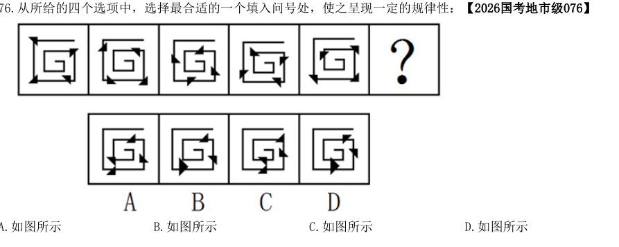

**77.** 从所给的四个选项中，选择最合适的一个填入问号处，使之呈现一定的规律性：【2026国考行政执法076/国考地市077】  `[2026·地市·77]`
- A. 如图所示
- B. 如图所示
- C. 如图所示
- D. 如图所示

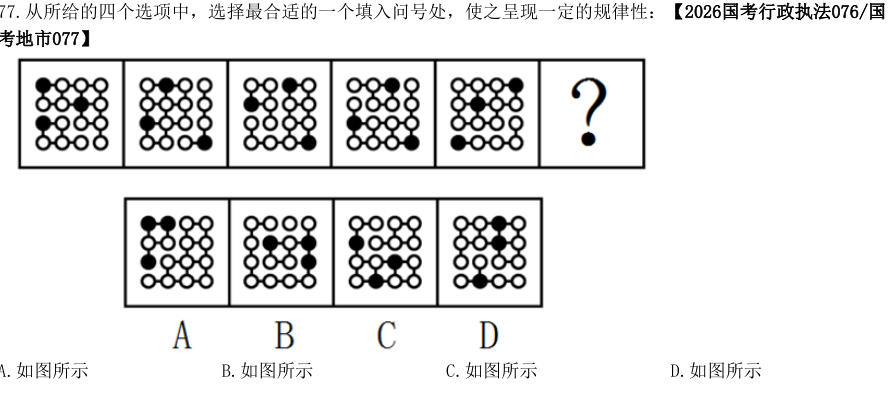

**78.** 从所给的四个选项中，选择最合适的一个填入问号处，使之呈现一定的规律性：【2026国考副省082/国考地市078】 2026年国家公务员录用考试《行测》真题（地市卷-考生回忆版）-估分  `[2026·地市·78]`
- A. 如图所示
- B. 如图所示
- C. 如图所示
- D. 如图所示

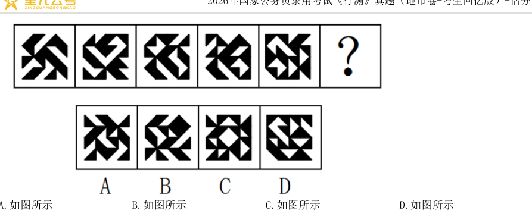

**79.** 从所给的四个选项中，选择最合适的一个填入问号处，使之呈现一定的规律性：【2026国考副省084/国考地市079】  `[2026·地市·79]`
- A. 如图所示
- B. 如图所示
- C. 如图所示
- D. 如图所示

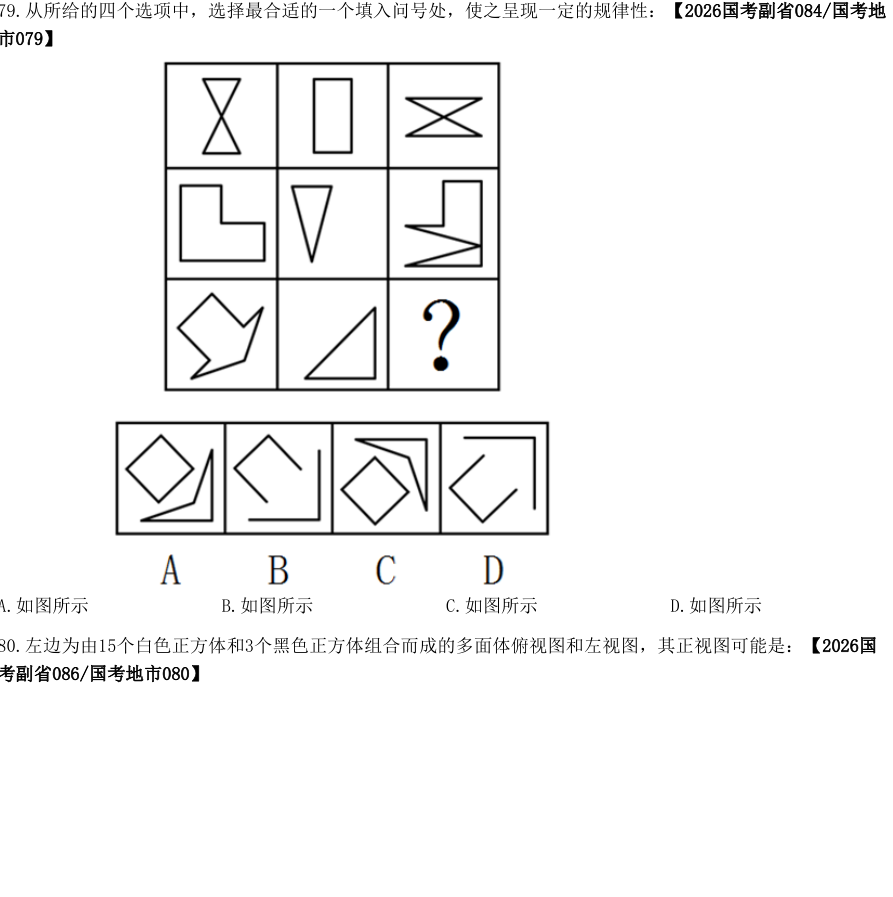

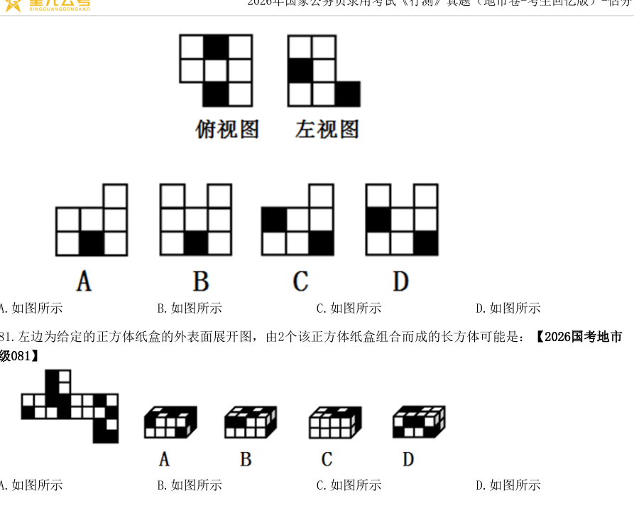

**80.** 左边为由15个白色正方体和3个黑色正方体组合而成的多面体俯视图和左视图，其正视图可能是：【2026国考副省086/国考地市080】 2026年国家公务员录用考试《行测》真题（地市卷-考生回忆版）-估分  `[2026·地市·80]`
- A. 如图所示
- B. 如图所示
- C. 如图所示
- D. 如图所示

**81.** 左边为给定的正方体纸盒的外表面展开图，由2个该正方体纸盒组合而成的长方体可能是：【2026国考地市级081】  `[2026·地市·81]`
- A. 如图所示
- B. 如图所示
- C. 如图所示
- D. 如图所示

**82.** 左边为由12个白色正方体和3个灰色正方体组合而成的多面体前后两面直观图，问其可以由除哪项外的三个多面体组合而成？【2026国考行政执法082/国考地市082】  `[2026·地市·82]`
- A. 如图所示
- B. 如图所示
- C. 如图所示
- D. 如图所示

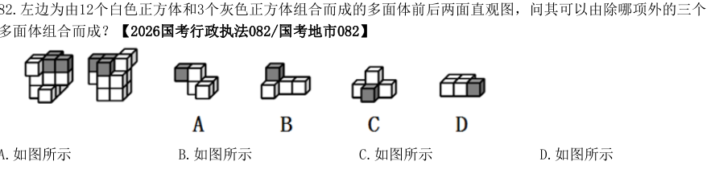

**83.** 把下面的六个图形分为两类，使每一类图形都有各自的共同特征或规律，分类正确的一项是：【2026国考副省090/国考地市083】 2026年国家公务员录用考试《行测》真题（地市卷-考生回忆版）-估分  `[2026·地市·83]`
- A. ①②③，④⑤⑥
- B. ①③④，②⑤⑥
- C. ①③⑥，②④⑤
- D. ①⑤⑥，②③④

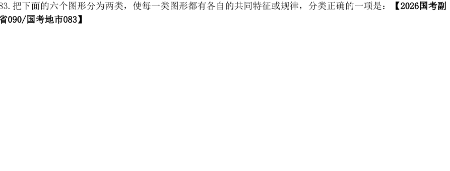

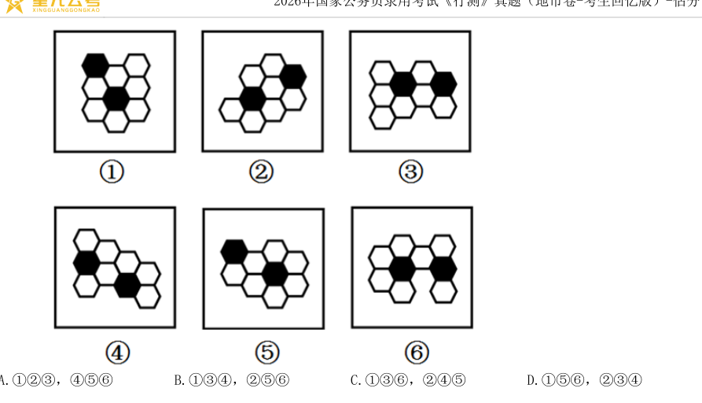

**84.** 把下面的六个图形分为两类，使每一类图形都有各自的共同特征或规律，分类正确的一项是：【2026国考行政执法084/国考副省089/国考地市084】  `[2026·地市·84]`
- A. ①②⑥，③④⑤
- B. ①②④，③⑤⑥
- C. ①⑤⑥，②③④
- D. ①④⑥，②③⑤

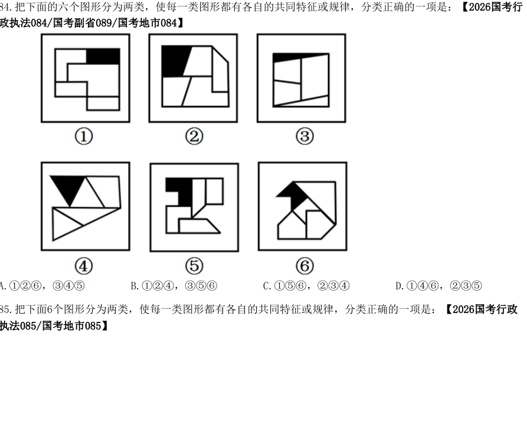

**85.** 把下面6个图形分为两类，使每一类图形都有各自的共同特征或规律，分类正确的一项是：【2026国考行政执法085/国考地市085】 2026年国家公务员录用考试《行测》真题（地市卷-考生回忆版）-估分  `[2026·地市·85]`
- A. ①④⑤，②③⑥
- B. ①③⑥，②④⑤
- C. ①②⑥，③④⑤
- D. ①②④，③⑤⑥

**86.** 《中国共产党纪律处分条例》规定，主动交代本人应当受到党纪处分的问题，可以从轻或者减轻处分。这里所称的主动交代主要包括两种情况：一是涉嫌违纪的党员在组织谈话函询、初步核实前向有关组织交代自己的问题。二是在谈话函询、初步核实和立案审查期间交代组织未掌握的问题。假定下列人员均受该条例约束，根据上述定义，下列属于主动交代的是：  `[2026·地市·86]`
- A. 甲在参加违纪违法典型案例警示教育大会后，主动找到单位领导反映同事的违纪问题
- B. 乙在组织对其进行廉政谈话时，组织举证一项他才承认一项，对未涉及的情况闭口不谈
- C. 丙在纪委对其个人财产有关事项进行函询时，将其利用职权为自己和他人谋利的情况如实交代
- D. 丁在纪委对其立案审查期间，面对确凿的证据，交代了之前没有交代的收受大额礼金的问题

**87.** 波特五力模型是一种竞争分析工具，用于评估一个行业的竞争力和吸引力。该模型通过对同行业竞争对手的威胁，潜在进入者的威胁、替代品的威胁、上游供应商的议价能力和下游购买者的议价能力这五个方面的分析，帮助企业了解其所处行业的竞争环境，以制定相应的竞争策略。根据上述定义，关于康复机器人行业，对下列问题的分析不能归入波特五力模型的是：  `[2026·地市·87]`
- A. 康复机器人行业准入门槛高吗？需要强大的技术能力和创新能力吗？
- B. 医院和康复中心患者规模如何？对于康复机器人的需求有多大？
- C. 与传统物理治疗等康复治疗方法相比，康复机器人有竞争力吗？
- D. 康复机器人企业内部各部门之间的协同合作程度高吗？

**88.** 组织结构可以划分为以下几种类型：（1）直线型组织结构，即每一个部门只对其直接的下属部门下达工作指令，不能越级指挥，每一个部门也只有一个直接的上级部门；（2）职能型组织结构，即每一个部门都可对其下属部门下达工作指令，每一个下属部门可能得到不同上级部门下达的多个工作指令；（3）直线职能型组织结构，即在主管之下设置相应的职能部门，实行主管统一指挥与职能部门参谋指导相结合的管理方式，各部门既受上级的管理，又受同级职能管理部门的业务指导和监督；（4）事业部组织结构，即由相对独立的事业部组成的组织结构，通常按照地区或项目来划分事业部，每个事业部拥有较大的自主权。根据上述定义，下列组织结构图代表的组织结构类型属于：2026年国家公务员录用考试《行测》真题（地市卷-考生回忆版）-估分  `[2026·地市·88]`
- A. 直线型组织结构
- B. 职能型组织结构
- C. 直线职能型组织结构
- D. 事业部组织结构

**89.** 均变论认为，支配各种地质过程的法则在地质历史上没有发生过变化，现在起作用的各种自然营力在漫长的地质过程中具有普遍的均一性，即地质具有相同方式和相同的强度；地球上生物的种与演变是一个渐变的过程，种之间有过渡关系，生物进化过程是极其漫长的。灾变论认为，在整个地质发展的过程中，地球经常发生各种突如其来的、短暂的全球性灾难性变化，这些变化强烈地改变了地球的面貌；地球上生物的变化是反复多次灾变的结果。根据上述定义，下列说法最能体现灾变论观点的是：  `[2026·地市·89]`
- A. “我们找不到开始的痕迹，也看不到结束的迹象”
- B. “地质记录是一部被鲜血和火焰写成的史诗”
- C. “现在是通往过去的一把钥匙”
- D. “自然界里没有飞跃”

**90.** 商品动销率是指在售的商品品种数与库存商品总品种数的比率。商品库销比是指商品库存量与销售额的比率。商品滞销率是指滞销的商品品种数占库存商品总品种数的比率。商品损耗率是指在一定的保管条件下，某商品在储存保管期间，其自然损耗量与商品在库总量的比例。根据上述定义，下列说法正确的是：  `[2026·地市·90]`
- A. 若商品动销率超过100%，说明商品在售品种数高于库存商品总品种数
- B. 商品损耗率高表明有库存积压风险，商品损耗率低表明销售态势良好
- C. 库存商品数一定时，商品滞销率越高，说明滞销的商品越多
- D. 当商品库存量越大，销售额越高时，商品库销比就会越大

**91.** 根据动词对其后所接的宾语小句（作宾语的句子）真值的不同预设能力可以把现代汉语中的相关动词分为叙实动词、非叙实动词和反叙实动词。叙实动词的肯定式和否定式都预设其宾语小句为真；非叙实动词的肯定式和否定式都不预设其宾语小句为真，也不预设其宾语小句为假；反叙实动词的肯定式和否定式都预设其宾语小句为假。根据上述定义，下列画线的动词属于非叙实动词的是：  `[2026·地市·91]`
- A. 我听说他来过这里
- B. 我庆幸听了你的建议
- C. 我知道你帮助过我
- D. 我幻想成为一只小鸟

**92.** 自主动机是指人们出于兴趣或内在满足感而从事某种活动，外部动机是指人们为获得外部奖励或避免惩罚而从事某种活动，这些动机背后的心理需求又分为三种：（1）自主性需求，即人们希望自己能控制和选择自己的行为，而不是受到外部强制；（2）胜任性需求，即人们希望能在自己做的事上获得成就感和自我效能感；（3）归属感需求，即人们希望与他人建立有意义的联系，感受到归属和支持。根据上述定义，下列说法错误的是：  `[2026·地市·92]`
- A. 小张参加了一项感兴趣的社交活动，他认为这能帮助自己结交新朋友。这体现了自主动机和归属感需求2026年国家公务员录用考试《行测》真题（地市卷-考生回忆版）-估分
- B. 小李参加公司的培训课程，虽然对课程内容不感兴趣，但他担心如果不参加就会被扣绩效。这体现了外部动机和自主性需求
- C. 小王每天晨跑，很享受锻炼带来的满足感，也坚信这是促进健康的必要努力。这体现了自主动机和胜任性需求
- D. 小陈和队友为实现团体奖牌零的突破一直在努力，在艰苦的训练中与队友相互鼓励。这体现了胜任性需求和归属感需求

**93.** 动作预期是指运动员在比赛过程中，根据已有信息，对即将发生的动作结果进行预测的过程。在这一过程中，运动员主要依赖两类信息：运动学信息和情境先验信息。运动学信息包括对手的动作、器材的运动轨迹或队员之间的相对位置，情境先验信息则涉及比赛情境中事件发生的概率。根据上述定义，下列不涉及上述任何一种信息的是：  `[2026·地市·93]`
- A. 篮球队员甲在双方比分紧咬的情况下，基于对手今日比赛罚篮命中率不高，在对手投篮时选择直接犯规
- B. 网球运动员乙知道对手在比赛前有一系列习惯性动作，包括整理球衣、球裤、头发等，暗自提醒自己不要被其干扰
- C. 羽毛球双打运动员丙发现对方准备接发球的球员位置稍微靠前，可能来不及转身或后退接球，便发了个后场球
- D. 乒乓球运动员丁发现对方发过来的球位置较低、速度较慢，极有可能擦网变线，便没有后退，向前伸拍做好接球准备

**94.** 在制品控制是企业生产控制的基础工作，是企业对生产运作过程中各工序原材料、半成品等按照位置、数量、质量及车间之间的物料转运等进行的控制。根据上述定义，下列没有直接体现在制品控制的是：  `[2026·地市·94]`
- A. 服装厂梳理了运动裤制作流程并制定规范，确保衣料在不同流水线上流转有序
- B. 食品厂设立质检员，定时对各个工序的食材抽样进行微生物检测，剔除不良品
- C. 制药厂规定员工进入洁净区后，每两小时洗手一次，避免药品生产环境被污染
- D. 家具厂对板材进行定期盘点，并合理摆放，确保板材库存合理且满足生产需要

**95.** 预防性维修是指在机械设备没有发生故障或尚未造成损坏的前提下，通过对产品的系统性检查，设备测试或更换以防止设备发生故障，使其保持在正常状态所进行的全部活动。根据上述定义，下列属于预防性维修的是：  `[2026·地市·95]`
- A. 公路管理部门定期巡视道路两旁护栏并涂刷、除锈，发现护栏松动、断裂时进行修复
- B. 某车间在正式制造某种设备前，测量将要安装在该设备中的关键零部件是否符合检查标准
- C. 某数控车床突然发生摇动，无法研制物品，检查后发现电机出现故障，更换电机后车床可正常运行
- D. 雨季来临前，供电公司对辖区内变压器、配电器、电缆线路等电力设备设施隐患进行专项排查

**96.** 与“经年∶积岁”在逻辑关系上最相近的是：  `[2026·地市·96]`
- A. 善本∶版本
- B. 秘方∶偏方
- C. 仲夏∶夏季
- D. 黎民∶百姓

**97.** 与“细胞凋亡∶基因调控∶细胞增殖”在逻辑关系上最相近的是：  `[2026·地市·97]`
- A. 成本降低∶税率调整∶成本增加
- B. 经济萧条∶经济周期∶经济复苏
- C. 价格尺度∶货币职能∶流通手段
- D. 人工智能∶智能时代∶具身智能

**98.** 与“护士人数∶护患比∶患者人数”在逻辑关系上最相近的是：  `[2026·地市·98]`
- A. 理赔总额∶平均理赔金额∶理赔次数
- B. 签收率∶实际签收数量∶应签收数量
- C. 流动资产∶流动负债∶流动比率
- D. 旅客数∶入住率∶客房数

**99.** 颅内疾病  对于  （   ）  相当于  （   ）  对于  岩石断裂依次填入括号中最恰当的是：2026年国家公务员录用考试《行测》真题（地市卷-考生回忆版）-估分  `[2026·地市·99]`
- A. 颅内感染  岩石熔融
- B. 机体疾病  地壳应力
- C. 核磁共振  地下采样
- D. 视野缺失  冰川运动

**100.** 如果用一个圆来表示词语所指称的对象的集合，那么以下哪项中画横线词语之间的关系符合下图？  `[2026·地市·100]`
- A. 船舶按用途分为军用船舶（①）和民用船舶两大类，潜艇、航空母舰（③）、驱逐舰等都属于军用船舶；按推进动力分为机动船和非机动船（②）
- B. 水杉（③）是我国的特有树种，属于落叶树（①），是一种高大的乔木（②），是世界上珍稀的“活化石”植物
- C. 图书按照读者群可分为少儿读物（③）和成人读物等；按照载体可分为纸质书和电子书（②）等；按照学科可分为历史书、文学书和哲学书（①）等
- D. 大熊猫属于哺乳动物（①），是中国特有动物（②），被列为中国国家一级保护野生动物（③）

**101.** 科技行业越来越多地使用合成数据来满足AI模型数据训练的需要。合成数据是通过算法和统计模型人为创建的数据，在理论上可以无限供应。但合成数据存在一个关键问题：当AI模型过于依赖合成数据时，它们会产生更多“幻觉”，编造看似合理可信但实际上并不存在的信息。可见，合成数据的使用会影响AI的准确性。以下哪项如果为真，最能支持上述结论？  `[2026·地市·101]`
- A. 即使经过处理，合成数据仍然可能泄露敏感信息，从而引发隐私风险
- B. 合成数据存在过于简单化的风险，无法完全模拟真实世界的复杂性
- C. 合成数据会放大源数据本身的错误或偏差，导致“失之毫厘，差之千里”
- D. 合成数据的多样性可能不如真实数据，限制了AI模型的泛化能力

**102.** 部分研究认为，白垩纪陆地生态系统的变革是由植物、昆虫、脊椎动物与地质过程等多个要素相互作用推动的，形成了一个高度协同演化的系统结构。鉴于这一机制在当时造就了复杂而稳定的生态格局，有学者提出，现代陆地生态系统的高度复杂性，正是这种古老协同机制延续和演化的结果。以下哪项如果为真，最能削弱上述学者的观点？  `[2026·地市·102]`
- A. 在地质记录中，白垩纪末期的生态危机主要影响海洋系统，而陆地系统显示出相对稳定的演替趋势
- B. 对白垩纪地层的系统分析表明，植物、昆虫、脊椎动物与地质过程的演化几乎是在同一时期进行的
- C. 现代陆地生态系统的复杂性主要受群落内部随机扰动、自组织演化和外源干扰的共同影响，与白垩纪显著不同
- D. 被子植物的全球扩张早于部分动物类群多样化，其当时对生态结构的主导作用可能被高估

**103.** 完善城乡融合发展体制机制是破除我国城乡二元结构、拓展高质量发展空间的必要举措。只有完善农业农村优先发展的投入保障机制，并且优化城乡公共资源配置机制，才能完善城乡融合发展体制机制。只有加大中央预算内投资和地方政府专项债券支持力度，并且提高土地出让收入用于农业农村的比例，才能完善农业农村2026年国家公务员录用考试《行测》真题（地市卷-考生回忆版）-估分优先发展的投入保障机制。只有推进户籍制度改革，才能优化城乡公共资源配置机制。由此可以推出：  `[2026·地市·103]`
- A. 如果推进户籍制度改革，就能优化城乡公共资源配置机制
- B. 只要完善农业农村优先发展的投入保障机制，就能完善城乡融合发展体制机制
- C. 除非完善农业农村优先发展的投入保障机制，否则不能提高土地出让收入用于农业农村的比例
- D. 加大中央预算内投资和地方政府专项债券支持力度是破除我国城乡二元结构、拓展高质量发展空间的必要前提

**104.** 平台企业依赖金融资本投资，需要迎合金融市场的估值逻辑，通过轻资产运营、扩大市场规模和用户数据挖掘与开发等，来提升自身在金融市场上的估值。随着平台企业金融化程度的日益加深，平台劳动者的具体劳动和生产过程也在发生变化。研究者认为，平台企业金融化程度的加深使得平台劳动者的劳动权益保护问题日益突出。以下哪项如果为真，最能支持上述研究者的观点？  `[2026·地市·104]`
- A. 为扩大市场规模、争夺消费者注意力，平台企业在资金投入和服务提升方面容易陷入无序竞争
- B. 为塑造轻资产企业形象、摆脱劳动密集型标签，平台企业采用弹性用工制，增加劳动者就业不稳定性
- C. 越来越多的平台企业日益注重用户数据挖掘，以增加企业竞争力，为此更加注重员工培训
- D. 部分平台企业以缴纳保证金、押金或其他名义向劳动者收取财物，限制劳动者在多平台就业

**105.** 考古人员在某地发掘出一些似鸟动物化石，同位素测年显示这些动物生存于中侏罗世晚期（距今1.72亿～1.64亿年）。经考古推算，这些似鸟动物体型与现代鸟类大致接近，尾巴很短，最重要的是它们都具有愈合的尾综骨。考古人员据此认为，这些动物一定属于鸟类。以下哪项最有可能是考古人员论证的前提？  `[2026·地市·105]`
- A. 这些似鸟动物长有与现代鸟类相似的脚骨，可以在陆地上行走
- B. 这些化石保存了诸如肩胛骨、乌喙骨、尾综骨等骨骼，形态清晰
- C. 鸟类与爬行动物最显著的区别就是鸟类最后几枚尾椎愈合成为尾综骨
- D. 尾综骨结构的出现对似鸟动物后肢和尾骨的独立运动及飞行能力的完善至关重要为倡导团结合作精神，某单位举办了若干项目的双打比赛。该单位后勤部由王、吴、韩和宋4人组成网球、乒乓球和羽毛球3支双打队伍参赛，每支队伍由其中2人组成，4人均至少参加了其中的一支队伍。已知：（1）王和韩没有参加同一个项目；（2）若韩参加羽毛球项目，则宋参加网球项目；（3）若王参加乒乓球项目，则吴参加网球项目，若王不参加乒乓球项目，则吴也不参加网球项目。

**106.** 对于3支双打队伍的组成情况，以下哪项是可能的？  `[2026·地市·106]`
- A. 网球——王、宋；乒兵球—吴、宋：羽毛球——王，韩
- B. 网球——吴、韩；乒乓球——吴、王；羽毛球——韩、宋
- C. 网球——韩、宋；乒乓球——吴、王：羽毛球——王、宋
- D. 网球——王、宋；乒乓球——吴、韩；羽毛球——王、吴

**107.** 若宋和韩组队网球双打，则以下哪项一定正确？  `[2026·地市·107]`
- A. 吴参加乒乓球项目
- B. 王参加羽毛球项目
- C. 宋参加乒乓球项目
- D. 吴参加羽毛球项目

**108.** 若吴参加3个项目，则以下哪项是可能的？  `[2026·地市·108]`
- A. 宋参加网球项目
- B. 王参加网球项目
- C. 宋参加乒乓球项目
- D. 王参加羽毛球项目

**109.** 以下哪项中的两人可能同时组队网球和羽毛球双打？  `[2026·地市·109]`
- A. 王和吴
- B. 王和宋
- C. 吴和宋
- D. 韩和宋

**110.** 若宋和韩组队乒乓球双打，则以下哪项是可能的？ 2026年国家公务员录用考试《行测》真题（地市卷-考生回忆版）-估分  `[2026·地市·110]`
- A. 吴和韩组队网球双打吴
- B. 吴和宋组队网球双打
- C. 宋和韩组队羽毛球双打
- D. 吴和宋组队羽毛球双打

## 2026年 · 行政执法类

**76.** 从所给的四个选项中，选择最合适的一个填入问号处，使之呈现一定的规律性：  `[2026·执法·76]`

**77.** 从所给的四个选项中，选择最合适的一个填入问号处，使之呈现一定的规律性：  `[2026·执法·77]`

**78.** 从所给的四个选项中，选择最合适的一个填入问号处，使之呈现一定的规律性：  `[2026·执法·78]`

**79.** 从所给的四个选项中，选择最合适的一个填入问号处，使之呈现一定的规律性：  `[2026·执法·79]`

**80.** 左边为给定的多面体，现用经P、Q、R三点的平面对其进行切割，切面为：  `[2026·执法·80]`
> （本题选项为图片，请配合原始PDF查看）

**81.** 下图为由2个正方体组合而成的长方体，问这2个正方体的外表面展开图可能分别是：  `[2026·执法·81]`
- A. ②和④
- B. ②和③
- C. ①和④
- D. ①和③

**82.** 左边为由12个白色正方体和3个灰色正方体组合而成的多面体前后两面直观图，问其可以由除哪项外的三个多面体组合而成？  `[2026·执法·82]`

**83.** 把下面的六个图形分为两类，使每一类图形都有各自的共同特征或规律，分类正确的一项是：  `[2026·执法·83]`
- A. ①④⑤，②③⑥
- B. ①③⑤，②④⑥
- C. ①③④，②⑤⑥
- D. ①②④，③⑤⑥

**84.** 把下面的六个图形分为两类，使每一类图形都有各自的共同特征或规律，分类正确的一项是：  `[2026·执法·84]`
- A. ①②⑥，③④⑤
- B. ①②④，③⑤⑥
- C. ①⑤⑥，②③④
- D. ①④⑥，②③⑤

**85.** 把下面6个图形分为两类，使每一类图形都有各自的共同特征或规律，分类正确的一项是：  `[2026·执法·85]`
- A. ①④⑤，②③⑥
- B. ①③⑥，②④⑤
- C. ①②⑥，③④⑤
- D. ①②④，③⑤⑥

**86.** 选矿是指用物理、化学或者物理与化学相结合的方法，将原矿中的有用矿物与伴生的无用固定物质（脉石）或有害矿物分开的过程。选矿可显著提高矿石的质量，减少运输费用，降低冶炼成本，进而实现综合利用。根据上述定义，下列没有体现选矿过程的是：  `[2026·执法·86]`
- A. 利用矿物颗粒电性的差别，在高压电场中挑选出白钨矿、赤铁矿等，通过电机分离除尘
- B. 利用水枪和洗矿槽等设备，将锡矿石中的泥土等杂质洗去，同时也可以将部分轻矿物冲走，实现锡石初步富集
- C. 经验丰富的老师傅通过敲击、光照、观察皮壳等方法对开采的翡翠原石进行筛选，挑选优质原石
- D. 将铜矿矿石破碎到一定的粒度后，混以少量的食盐和煤粉隔氧加热，矿石中的铜便以金属状态析出，由此获得铜精矿

**87.** 波特五力模型是一种竞争分析工具，用于评估一个行业的竞争力和吸引力。该模型通过对同行业竞争对手的威胁，潜在进入者的威胁、替代品的威胁、上游供应商的议价能力和下游购买者的议价能力这五个方面的分析，帮助企业了解其所处行业的竞争环境，以制定相应的竞争策略。根据上述定义，关于康复机器人行业，对下列问题的分析不能归入波特五力模型的是：  `[2026·执法·87]`
- A. 康复机器人行业准入门槛高吗？需要强大的技术能力和创新能力吗？
- B. 医院和康复中心患者规模如何？对于康复机器人的需求有多大？
- C. 与传统物理治疗等康复治疗方法相比，康复机器人有竞争力吗？
- D. 康复机器人企业内部各部门之间的协同合作程度高吗？

**88.** 假对是指借用同音或多义的字或词作形（音）此义彼的表达，构成形式上相对的一种修辞方式。假对也是对偶的形式之一，多用于古汉语作品中。根据其构成方式，假对可以分为谐音假对和衍义假对两类：谐音假对是利用语音的相同或相近构成的假对，衍义假对是利用字或词的一形多义现象构成的假对。根据上述定义，下列对偶句中的一对画线字属于衍义假对的是：  `[2026·执法·88]`
- A. 明月松间照，清泉石上流
- B. 厨人具鸡黍，稚子摘杨梅
- C. 本无丹灶术，那免白头翁
- D. 枸杞因吾有，鸡栖奈汝何

**89.** 药学服务是指药师应用药学专业知识向公众（包括医护人员、患者及家属）提供直接的、负责任的、与药物使用有关的服务，以提高药物治疗的安全性、有效性和经济性。根据上述定义，下列没有体现药学服务的是：  `[2026·执法·89]`
- A. 药师与主治医生协商，调整了某患者的用药方案，并给予其相应的用药教育和指导
- B. 药师在社区药房开展咨询活动，为长期服药的慢病患者提供个性化的健康用药建议
- C. 药师给去药房拿药的患者一个条码，患者扫码后手机就会显示出药物的使用医嘱
- D. 药师在调剂工作中审核某患者处方的合法性，评估病情与用药匹配度及疗程合理性

**90.** 均变论认为，支配各种地质过程的法则在地质历史上没有发生过变化，现在起作用的各种自然营力在漫长的地质过程中具有普遍的均一性，即地质演变是一个渐变的过程，具有相同方式和相同的强度；地球上生物的种与种之间有过渡关系，生物进化过程是极其漫长的。灾变论认为，在整个地质发展的过程中，地球经常发生各种突如其来的、短暂的全球性灾难性变化，这些变化强烈地改变了地球的面貌；地球上生物的变化是反复多次灾变的结果。根据上述定义，下列说法最能体现灾变论观点的是：  `[2026·执法·90]`
- A. “我们找不到开始的痕迹，也看不到结束的迹象”
- B. “地质记录是一部被鲜血和火焰写成的史诗”
- C. “现在是通往过去的一把钥匙”
- D. “自然界里没有飞跃”

**91.** 联想的相似律是指两种在性质、特征上相似的事物或属性可形成联想；对比律是指具有相反特点的事物或属性可形成联想；接近律是指在空间与时间上接近的事物或属性可形成联想。根据上述定义，下列说法正确的是：  `[2026·执法·91]`
- A. 由树木想到森林、由蓝天想到飞机，都运用了对比律
- B. 由狐狸想到狡猾、由电灯想到房间，都运用了相似律
- C. 由钢铁想到坚强、由酷暑想到严寒，分别运用了接近律和对比律
- D. 由黑暗想到光明、由花圃想到蝴蝶，分别运用了对比律和接近律

**92.** 商品动销率是指在售的商品品种数与库存商品总品种数的比率。商品库销比是指商品库存量与销售额的比率。商品滞销率是指滞销的商品品种数占库存商品总品种数的比率。商品损耗率是指在一定的保管条件下，某商品在储存保管期间，其自然损耗量与商品在库总量的比例。根据上述定义，下列说法正确的是：  `[2026·执法·92]`
- A. 若商品动销率超过100%，说明商品在售品种数高于库存商品总品种数
- B. 商品损耗率高表明有库存积压风险，商品损耗率低表明销售态势良好
- C. 库存商品数一定时，商品滞销率越高，说明滞销的商品越多
- D. 当商品库存量越大，销售额越高时，商品库销比就会越大

**93.** 动作预期是指运动员在比赛过程中，根据已有信息，对即将发生的动作结果进行预测的过程。在这一过程中，运动员主要依赖两类信息：运动学信息和情境先验信息。运动学信息包括对手的动作、器材的运动轨迹或队员之间的相对位置，情境先验信息则涉及比赛情境中事件发生的概率。根据上述定义，下列不涉及上述任何一种信息的是：  `[2026·执法·93]`
- A. 篮球队员甲在双方比分紧咬的情况下，基于对手今日比赛罚篮命中率不高，在对手投篮时选择直接犯规
- B. 网球运动员乙知道对手在比赛前有一系列习惯性动作，包括整理球衣、球裤、头发等，暗自提醒自己不要被其干扰
- C. 羽毛球双打运动员丙发现对方准备接发球的球员位置稍微靠前，可能来不及转身或后退接球，便发了个后场球
- D. 乒乓球运动员丁发现对方发过来的球位置较低、速度较慢，极有可能擦网变线，便没有后退，向前伸拍做好接球准备

**94.** 在民法理论上，可以将条件划分为随意条件、混合条件与偶成条件。随意条件又分为纯粹随意条件和非纯粹随意条件。纯粹随意条件的成就与否完全由一方当事人的意思决定；非纯粹随意条件的成就与否除一方当事人的意思外，尚须另一方当事人发生某种事件；混合条件的成就与否取决于一方当事人与第三人的意思；偶成条件的成就与否无关当事人的意思，但可能受制于第三人的意思。根据上述定义，下列属于混合条件的是：  `[2026·执法·94]`
- A. 小王与爸爸约定，如果小王考上的研究生院校让爸爸满意，爸爸就资助其旅游经费
- B. 某店铺与供应商约定，如果三伏的第一天下雨，则今年的雨伞就多进货30%
- C. 甲厂与乙厂约定，如果甲厂能与丙公司签订承揽合同，甲厂就在乙厂购置原料板材
- D. 小李与哥哥约定，如果小李能在开学前考取驾照，哥哥就把现在开的这台车赠送给小李

**95.** 分项累进淘汰法是指在对植株进行选种时，根据性状的相对重要性顺序排列，先按第一重要性状进行选择，然后在入选株内按第二重要性状进行选择，依此顺次累进的一种选种方法。根据上述定义，下列对南瓜的选种方法属于分项累进淘汰法的是：  `[2026·执法·95]`
- A. 按株选目标性状出现的先后顺序，先淘汰蔓生植株，然后淘汰第一雌花节位高的植株，再淘汰单瓜重量低的植株
- B. 首先在群体内选择无病植株，再在这些无病植株内选择丰产性好的植株，再根据产量性状顺次进行选择
- C. 在收获时按照果实的大小、果型等性状初选，在初选瓜内再按照综合性状入选标准进行复选
- D. 将需要鉴定的性状，如蔓长、单瓜重、果实籽粒数、籽粒长等，分别规定一个最低的入选标准，将低于入选标准的淘汰

**96.** 与“经年：积岁”在逻辑关系上最相近的是：  `[2026·执法·96]`
- A. 善本：版本
- B. 秘方：偏方
- C. 仲夏：夏季
- D. 黎民：百姓

**97.** 与“口腔：唾液：淀粉酶”在逻辑关系上最相近的是：  `[2026·执法·97]`
- A. 种子：孜然：调味品
- B. 叶片：叶肉：叶绿体
- C. 松树：松脂：树脂醇
- D. 试剂：试纸：pH试纸

**98.** 与“护士人数：护患比：患者人数”在逻辑关系上最相近的是：  `[2026·执法·98]`
- A. 理赔总额：平均理赔金额：理赔次数
- B. 签收率：实际签收数量：应签收数量
- C. 流动资产：流动负债：流动比率
- D. 旅客数：入住率：客房数

**99.** 颅内疾病对于 （    ） 相当于（    ） 对于 岩石断裂依次填入括号中最恰当的是：  `[2026·执法·99]`
- A. 颅内感染；岩石熔融
- B. 机体疾病；地壳应力
- C. 核磁共振；地下采样
- D. 视野缺失；冰川运动

**100.** 如果用一个圆来表示词语所指称的对象的集合，那么以下哪项中画横线词语之间的关系符合下图？  `[2026·执法·100]`
- A. 船舶按用途分为军用船舶（①）和民用船舶两大类，潜艇、航空母舰（③）、驱逐舰等都属于军用船舶；按推进动力分为机动船和非机动船（②）
- B. 水杉（③）是我国的特有树种，属于落叶树（①），是一种高大的乔木（②），是世界上珍稀的“活化石”植物
- C. 图书按照读者群可分为少儿读物（③）和成人读物等；按照载体可分为纸质书和电子书（②）等；按照学科可分为历史书、文学书和哲学书（①）等
- D. 大熊猫属于哺乳动物（①），是中国特有动物（②），被列为中国国家一级保护野生动物（③）

**101.** 考古人员在某地发掘出一些似鸟动物化石，同位素测年显示这些动物生存于中侏罗世晚期（距今1.72亿～1.64亿年）。经考古推算，这些似鸟动物体型与现代鸟类大致接近，尾巴很短，最重要的是它们都具有愈合的尾综骨。考古人员据此认为，这些动物一定属于鸟类。以下哪项最有可能是考古人员论证的前提？  `[2026·执法·101]`
- A. 这些似鸟动物长有与现代鸟类相似的脚骨，可以在陆地上行走
- B. 这些化石保存了诸如肩胛骨、乌喙骨、尾综骨等骨骼，形态清晰
- C. 鸟类与爬行动物最显著的区别就是鸟类最后几枚尾椎愈合成为尾综骨
- D. 尾综骨结构的出现对似鸟动物后肢和尾骨的独立运动及飞行能力的完善至关重要

**102.** S遗址近年来出土了大量与众不同的奇特文物，不少人认定S遗址展现了一个特色鲜明且区域封闭的南部地方文化。然而最新研究发现，在距离S遗址较远的北部Y遗址，出土的青铜器曾大量使用了来自S遗址附近矿床的铅铜矿料，在S遗址文化消亡后，Y遗址出土的青铜器基本不再含有这种矿料。这说明S遗址不是封闭区域，其所在的古国曾与Y遗址的古国或其他区域存在着交流互动。以下哪项如果为真，没有支持上述结论？  `[2026·执法·102]`
- A. S遗址的青铜器制造业在当时非常发达，出土的青铜器含有多种不同的铅铜矿料
- B. 随着考古发掘的深入，S遗址出土了越来越多带有明显Y遗址文化元素的青铜器
- C. 在铸造工艺上，S遗址出土的部分文物采用了Y遗址多见的“泥模块铸法”
- D. 原本流行于东部地区的牙璋、铜牌饰、陶盉等也在位于南部的S遗址中大量出现

**103.** 完善城乡融合发展体制机制是破除我国城乡二元结构、拓展高质量发展空间的必要举措。只有完善农业农村优先发展的投入保障机制，并且优化城乡公共资源配置机制，才能完善城乡融合发展体制机制。只有加大中央预算内投资和地方政府专项债券支持力度，并且提高土地出让收入用于农业农村的比例，才能完善农业农村优先发展的投入保障机制。只有推进户籍制度改革，才能优化城乡公共资源配置机制。由此可以推出的是（）。  `[2026·执法·103]`
- A. 如果推进户籍制度改革，就能优化城乡公共资源配置机制
- B. 只要完善农业农村优先发展的投入保障机制，就能完善城乡融合发展体制机制
- C. 除非完善农业农村优先发展的投入保障机制，否则不能提高土地出让收入用于农业农村的比例
- D. 加大中央预算内投资和地方政府专项债券支持力度是破除我国城乡二元结构、拓展高质量发展空间的必要前提

**104.** 平台企业依赖金融资本投资，需要迎合金融市场的估值逻辑，通过轻资产运营、扩大市场规模和用户数据挖掘与开发等，来提升自身在金融市场上的估值。随着平台企业金融化程度的日益加深，平台劳动者的具体劳动和生产过程也在发生变化。研究者认为，平台企业金融化程度的加深使得平台劳动者的劳动权益保护问题日益突出。以下哪项如果为真，最能支持上述研究者的观点？  `[2026·执法·104]`
- A. 为扩大市场规模、争夺消费者注意力，平台企业在资金投入和服务提升方面容易陷入无序竞争
- B. 为塑造轻资产企业形象、摆脱劳动密集型标签，平台企业采用弹性用工制，增加劳动者就业不稳定性
- C. 越来越多的平台企业日益注重用户数据挖掘，以增加企业竞争力，为此更加注重员工培训
- D. 部分平台企业以缴纳保证金、押金或其他名义向劳动者收取财物，限制劳动者在多平台就业

**105.** 一项针对中学生的研究发现：直接使用通用AI工具可短暂提高学生数学测试成绩，但最终削弱了学生的数学学习能力。研究持续一学期，学生被分为三组，分别在课堂练习阶段使用不同工具：①组使用标准课本和笔记；②组使用通用AI工具，可以直接查询答案；③组使用特别设计的AI工具，指导而不直接给出答案。随堂考核发现，②组和③组学生比①组学生的成绩高出48％和127％。但期末考试时，②组比①组成绩低了17%；而③组和①组无明显差异。以下除哪项外，均能削弱上述结论？  `[2026·执法·105]`
- A. 研究中未对学生做AI工具使用培训，研究结果不能说明正确使用AI工具的效果
- B. 学生的数学基础水平、学习动机、课后自主练习等变量都会影响考试成绩
- C. 研究仅针对数学学科，不能说明AI工具辅助教学对其他学科的影响
- D. 研究持续时间不够，不足以说明长期使用AI工具可能带来的效果（一）为倡导团结合作精神，某单位举办了若干项目的双打比赛。该单位后勤部由王、吴、韩和宋4人组成网球、乒乓球和羽毛球3支双打队伍参赛，每支队伍由其中2人组成，4人均至少参加了其中的一支队伍。已知：（1）王和韩没有参加同一个项目；（2）若韩参加羽毛球项目，则宋参加网球项目；（3）若王参加乒乓球项目，则吴参加网球项目，若王不参加乒乓球项目，则吴也不参加网球项目。

**106.** 对于3支双打队伍的组成情况，以下哪项是可能的？  `[2026·执法·106]`
- A. 网球——王、宋；乒乓球——吴、宋；羽毛球——王、韩
- B. 网球——吴、韩；乒乓球——吴、王；羽毛球——韩、宋
- C. 网球——韩、宋；乒乓球——吴、王；羽毛球——王、宋
- D. 网球——王、宋；乒乓球——吴、韩；羽毛球——王、吴

**107.** 若宋和韩组队网球双打，则以下哪项一定正确？  `[2026·执法·107]`
- A. 吴参加乒乓球项目
- B. 王参加羽毛球项目
- C. 宋参加乒乓球项目
- D. 吴参加羽毛球项目

**108.** 若吴参加3个项目，则以下哪项是可能的？  `[2026·执法·108]`
- A. 宋参加网球项目
- B. 王参加网球项目
- C. 宋参加乒乓球项目
- D. 王参加羽毛球项目

**109.** 以下哪项中的两人可能同时组队网球和羽毛球双打？  `[2026·执法·109]`
- A. 王和吴
- B. 王和宋
- C. 吴和宋
- D. 韩和宋

**110.** 若宋和韩组队乒乓球双打，则以下哪项是可能的？  `[2026·执法·110]`
- A. 吴和韩组队网球双打
- B. 吴和宋组队网球双打
- C. 宋和韩组队羽毛球双打
- D. 吴和宋组队羽毛球双打
